# Architecture

## Overview

The Checkpoint module follows a layered architecture design that separates concerns between high-level tensor operations, I/O buffering, and low-level file management.

## Module Relationships

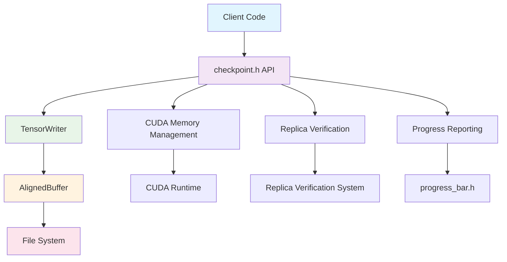

## Component Architecture

### 1. High-Level API Layer (`checkpoint.h/cpp`)

The main API layer provides:
- **Tensor Save/Restore Operations**
- **CUDA Memory Management**
- **Replica Verification Integration**
- **Cross-platform compatibility**

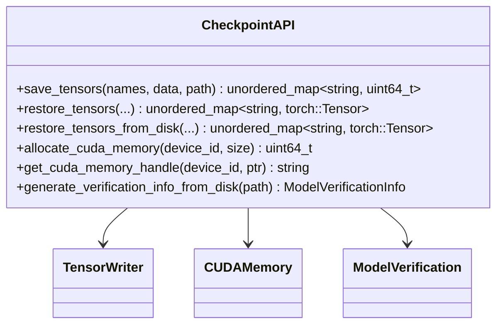

### 2. Tensor Writing Layer (`tensor_writer.h/cpp`)

Manages partitioned tensor writing:
- **Automatic Partitioning**: Splits data into 10GB chunks
- **Offset Management**: Tracks global offsets across partitions
- **Data Alignment**: Ensures 64-bit alignment for all records

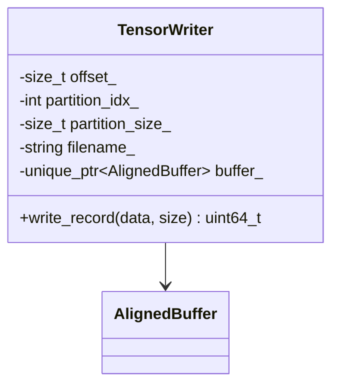

### 3. I/O Buffer Layer (`aligned_buffer.h/cpp`)

Provides optimized file I/O:
- **4K Alignment**: Uses aligned_alloc for optimal performance
- **Buffer Management**: 1GB internal buffer with overflow handling
- **Direct Writes**: Uses pwrite for positioned file I/O

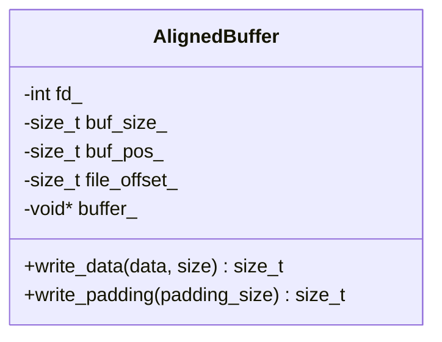

## Data Flow Architecture

### Save Operation Flow

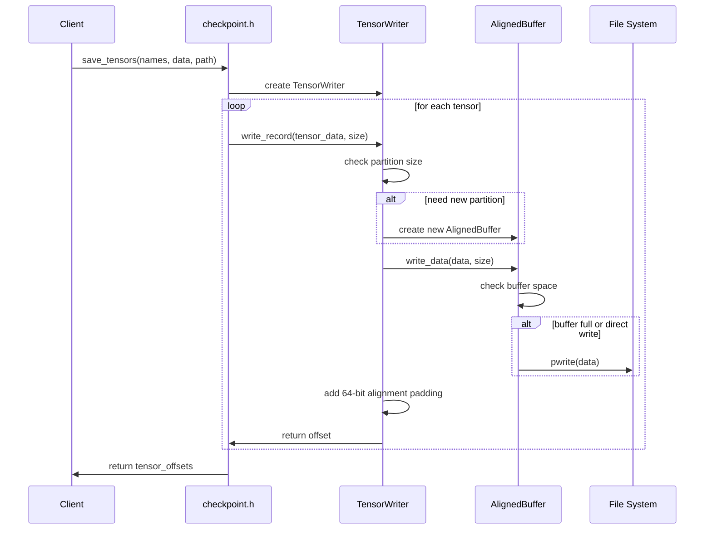

### Restore Operation Flow

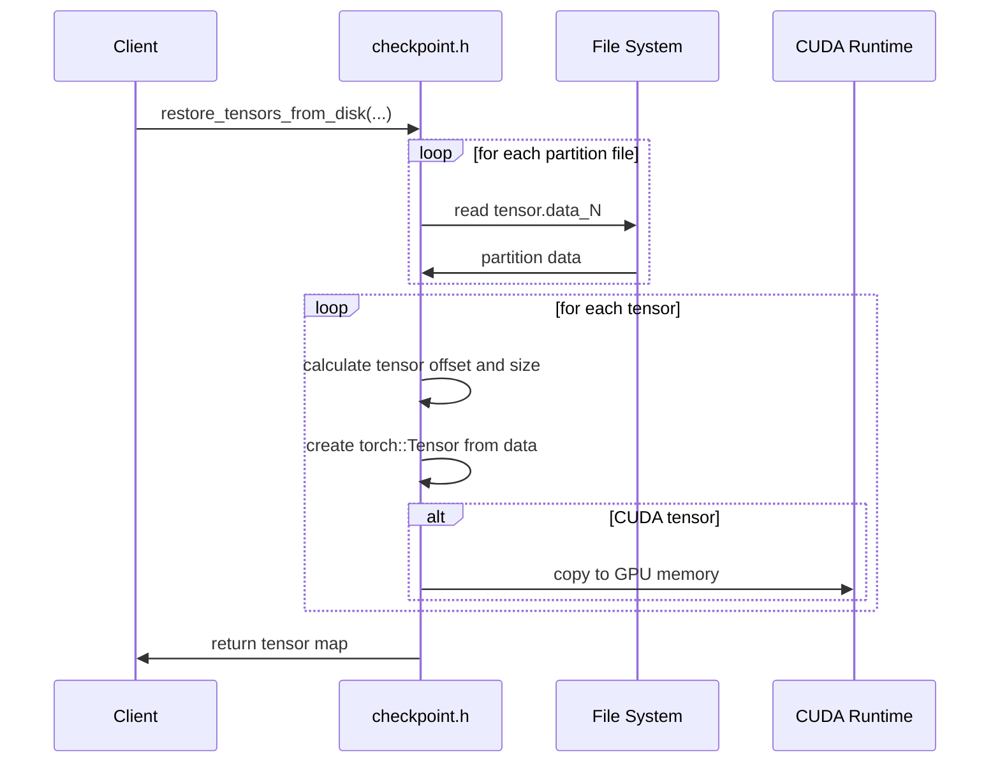

## Memory Management Architecture

### CUDA Memory States

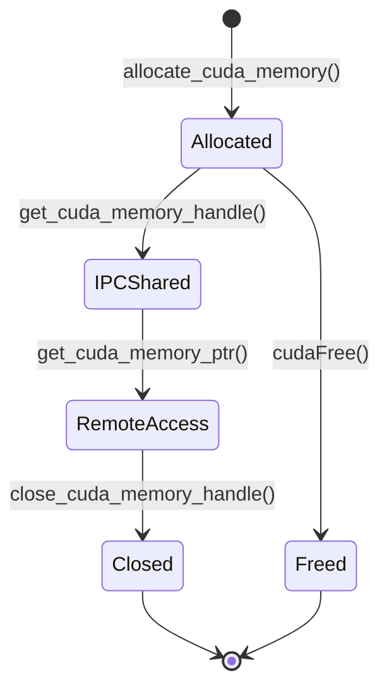

### Buffer States

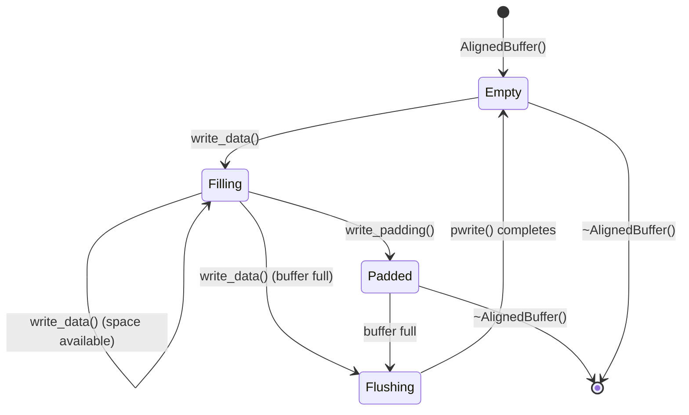

## Performance Considerations

### I/O Optimization Strategy

1. **4K Alignment**: All writes are aligned to filesystem block boundaries
2. **Large Buffers**: 1GB buffers reduce system call overhead
3. **Partitioning**: 10GB partitions balance memory usage and file management
4. **Direct Writes**: Uses pwrite system calls for efficient positioned writes

### Memory Layout

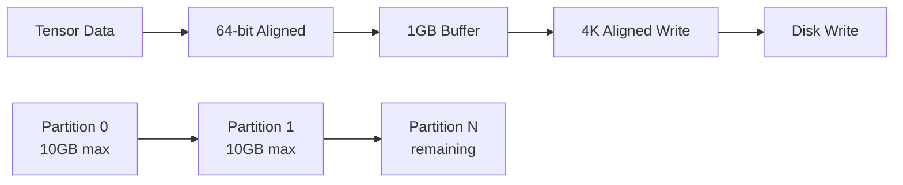

## Error Handling Strategy

The module uses a defensive programming approach:
- **Resource Management**: RAII pattern for automatic cleanup
- **Error Propagation**: Clear error messages with context
- **Validation**: Input validation at API boundaries
- **Recovery**: Graceful handling of partial failures

## Thread Safety

The current implementation is **not thread-safe**. For concurrent access:
- Use separate instances per thread
- External synchronization required for shared resources
- CUDA operations require proper device context management

## Streaming GPU Tensor Writing Layer (`streaming_tensor_writer.h/cpp`)

The streaming writer extends the core design with a **producer–consumer pipeline** that performs asynchronous GPU→Host copies and background disk flushing.

Key components:

1. **StreamingTensorWriter** – Orchestrates the streaming flow, maintains global offsets, and optionally spawns a dedicated disk-writer thread when `enable_async_write` is true.
2. **StreamingPinnedBuffer** – A circular queue backed by pinned (page-locked) memory to enable high-throughput `cudaMemcpyAsync` transfers. Producers acquire free chunks, fill them, and consumers flush them to disk.
3. **PinnedMemoryPool** – Re-usable pool of pinned buffers shared across multiple writers.

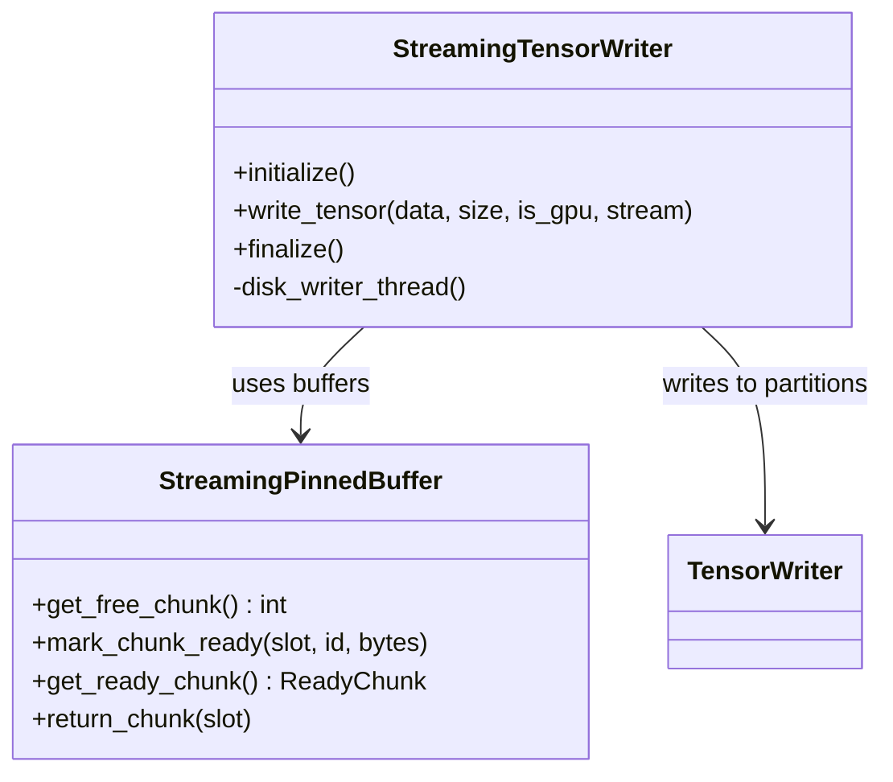

### Streaming Save Flow (GPU)

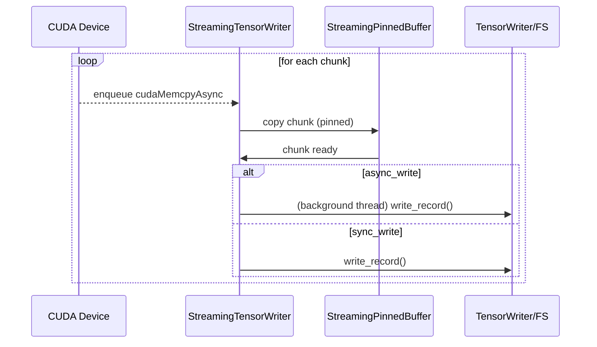

Compared to the classic `TensorWriter`, this pipeline overlaps compute, PCIe transfers, and disk I/O, achieving significantly higher end-to-end throughput on multi-GB checkpoints.

## Python Binding Overview (`checkpoint_py.cc`)

`checkpoint_py.cc` exposes the full C++ API to Python via **pybind11**. The binding lives in `tensorcast.csrc` and provides:

* `save_tensors` / `restore_tensors` – Original synchronous APIs.
* `save_tensors_streaming` – Thin wrapper that forwards a `dict`-based config to `StreamingTensorWriter`.
* CUDA utilities – `allocate_cuda_memory`, `get_cuda_memory_handle`, `get_cuda_memory_ptr`, and `close_cuda_memory_handle` for zero-copy data exchange across processes.
* Replica verification helpers – `generate_artifact_verification_info` and `verify_artifact_data_from_gpu`.

Because the binding re-exports **pointers and CUDA IPC handles** as Python `bytes` objects, transferring large tensors between Python and C++ can be done without additional copies, aligning with the module's performance goals.