# Communicator (C++)

The **Communicator** module is TensorCast's low-level, high-performance data-movement engine. It carries tensor payloads between Store Daemons and user processes (via the Store Engine) and cooperates with the control plane for metadata and session management.

This document explains its internal architecture, threading replica, key abstractions, data-flow, and extension points.

> The source lives under `core/communicator/`. All code samples and line numbers below refer to that directory unless stated otherwise.

---

## 1. High-level Architecture

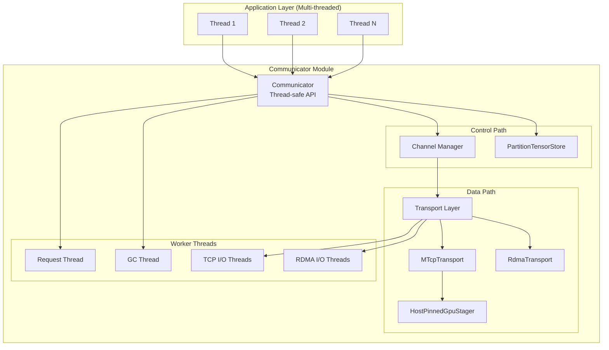

### Key Components

* **Communicator** — Central orchestrator built around `CommunicatorConfig`; owns request / GC threads, staged-buffer bookkeeping, and transport instances.
* **Channel** — Manages logical connections (control + data) to remote peers, including pending RDMA reads by `<local_dev>|<peer_dev>`.
* **Transport Layer** — Pluggable I/O mechanisms: TCP control, Multi-TCP (MTCP) bulk data, and RDMA queue pairs.
* **PartitionTensorStore** — Thread-safe registry for local tensors (CPU and GPU) backed by `misc::Map`.
* **Memory Stagers** — Unified `MemoryStager` interface with `HostPinnedGpuStager` (GPU→host-pinned), `HostPinnedCpuStager` (CPU→host-pinned), and optional `GpuVramRdmaStager` (GPU→VRAM, RDMA-only) implementations.
* **PinnedBufferPool & StreamingPinnedBuffer** — Shared pinned pools sourced from the daemon-wide `pinned_memory` authority (or internal defaults when constructed standalone).
* **MrCache** — Per-protection-domain cache that reuses RDMA MRs for staged buffers to avoid repeated registrations.

---

## 2. Threading Replica

The Communicator is designed for **concurrent access from multiple application threads**. Here's the complete threading architecture:

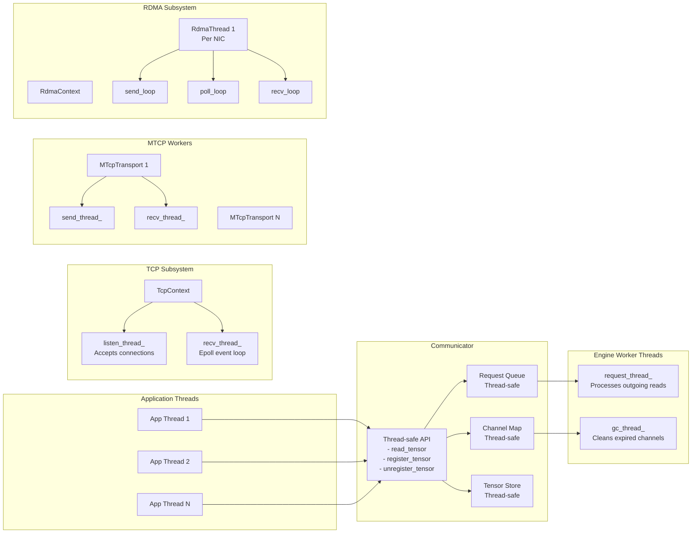

### Thread Responsibilities

#### Application Threads
- Can call any public API method concurrently
- All API methods are thread-safe through internal synchronization

#### Communicator Threads
1. **request_thread_** — Dequeues read requests and initiates remote operations
2. **gc_thread_** — Periodically scans and closes idle channels
3. **mtcp_staging_thread_** — Drains the MTCP staging queue so staging work happens off the control loop, keeping connect handshakes responsive. During shutdown it now drains and fails any remaining tasks before the queue stops so MTCP reads surface `READ_FAILED` and release staging credit.

#### TCP Infrastructure Threads
1. **TcpContext::listen_thread_** — Accepts incoming TCP connections
2. **TcpContext::recv_thread_** — Epoll-based event processing for all TCP sockets

#### MTCP Transport Threads (per connection)
1. **MTcpTransport::send_thread_** — Distributes write operations across multiple sockets
2. **MTcpTransport::recv_thread_** — Handles incoming data assembly
3. **MTcpTransportTask threads** — Per-socket send/recv workers

#### RDMA Infrastructure Threads (per NIC)
1. **RdmaThread::send_loop** — Posts RDMA READ operations
2. **RdmaThread::poll_loop** — Polls completion queues
3. **RdmaThread::recv_loop** — (Reserved for future RDMA RECV operations)

### Thread Safety Mechanisms

```cpp
// All public APIs use thread-safe containers:
Map<std::string, channel_t> channels_;        // Thread-safe map
Queue<read_request_t> request_queue_;          // Thread-safe queue
PartitionTensorStore store_;                   // Thread-safe store

// Example thread-safe implementation in Map<K,V>:
template <class K, class V>
void Map<K,V>::put(K key, V value) {
    std::unique_lock<std::mutex> lock(mu_);   // Synchronized access
    map_.insert(std::make_pair(key, value));
}

```

---

## 3. RDMA Debugging Aids

Recent instrumentation adds explicit logging around the control-plane receive loop and RDMA pipeline to make cross-node issues easier to triage:

- `[recv_func]` entries now appear whenever the TCP control channel receives a message. These logs dump the decoded header (`op`, `size`) and flag missing channel mappings before dispatch.
- `[on_receive_response]` emits whether we reused an existing RDMA transport or created a new QP, and now records queued pending reads plus peer QP parameters when the handshake finishes.
- `[rdma_transport]` traces QP readiness, segmented RDMA READ postings, and work completions (`IBV_WC_*` statuses); it refuses to post READ WRs until the peer's QP info has been applied, so the log clearly differentiates "handshake pending" from genuine RDMA failures.
- `[on_receive_request]` VLOG entries annotate each step of the READ_REQUEST server flow, from tensor-store lookup through RDMA segmentation/staging or MTCP streaming headers, making it easier to pinpoint where a read stalls.

When debugging replica hangs with `enable_rdma=true`, start by verifying that these log lines appear on both peers. Absence of `[recv_func]` or `[on_receive_response]` indicates the control channel never processed the server’s response, while missing `[rdma_transport]` completions typically points to QP handshake or remote memory registration failures.

---

## 3. Core Components Deep Dive

### 3.1 Communicator

Location: `engine/engine.{h,cc}`

The engine maintains thread-safe state and coordinates all operations:

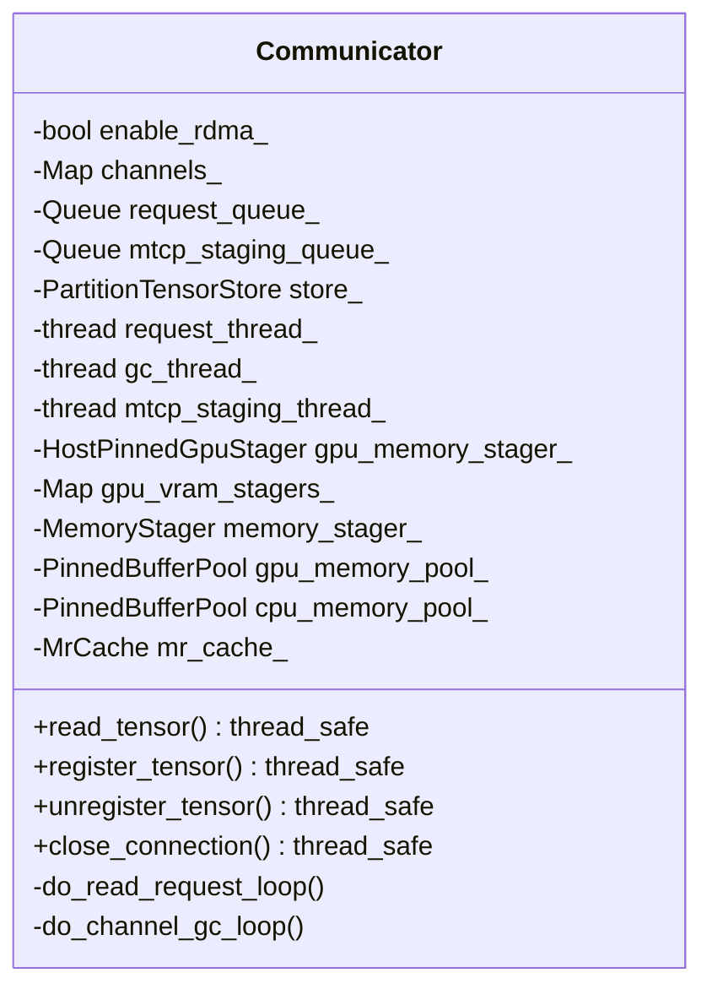

Key design points:
- All public methods are thread-safe.
- Internal worker threads (`request_thread_`, `gc_thread_`, `mtcp_staging_thread_`) handle async operations and lifecycle cleanup.
- Memory staging pools (GPU and CPU) are injected at startup (daemon: from `DaemonConfig.pinned_memory` via `comm_gpu` / `comm_cpu` class pools). `CommunicatorConfig` controls staging and transport behavior, not pool sizing.
- RDMA responses always stage into pinned buffers; clients acknowledge completions with `RDMA_READ_DONE_EX` so the server can recycle buffers.

### 3.2 Channel

Location: `engine/channel.{h,cc}`

Channels encapsulate the connection state to a remote peer:

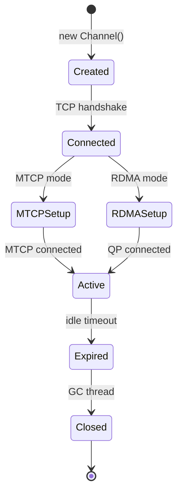

### 3.3 Transport Layer

The transport abstraction allows pluggable implementations:

| Transport       | Use-case              | Parallelism               | GPU Support |
| --------------- | --------------------- | ------------------------- | ----------- |
| `TcpTransport`  | Control channel       | Single socket             | N/A         |
| `MTcpTransport` | Large CPU/GPU tensors | Multi-socket (default: 8) | Via staging |
| `RdmaTransport` | Segmented RDMA READ (staged) | Per-QP                    | Direct after staging |

### 3.4 Memory Staging Infrastructure

The communicator routes tensor payloads through `MemoryStager` implementations:

- `HostPinnedGpuStager` performs GPU→CPU copies into chunks carved from a shared `PinnedBufferPool` and streams them with `StreamingPinnedBuffer`.
- `HostPinnedCpuStager` copies CPU tensors into the same pool and can cooperate with UMA lease providers injected by the Store Engine.
- `GpuVramRdmaStager` (RDMA-only, optional) stages GPU tensors into a fixed VRAM pool when `communicator.rdma.staging_backend=STAGED_RDMA_BACKEND_GPU_VRAM`.

`PartitionTensor::needs_staging()` (set via `RegisterTensorOptions`) signals when MTCP transfers must stage GPU tensors. RDMA responses are always staged; staged segments are issued as `StageLease`s and tracked in the channel-scoped `StageLeaseRegistry` until transport completions release the associated credit.

RDMA staging backend selection is explicit:
- `STAGED_RDMA_BACKEND_HOST_PINNED` (default) uses host-pinned stagers for both CPU and GPU tensors.
- `STAGED_RDMA_BACKEND_GPU_VRAM` uses `GpuVramRdmaStager` for GPU tensors and keeps `HostPinnedCpuStager` for CPU tensors. `StageLease::exposed_ptr()` may therefore reference host or device memory depending on backend.
  - If a request references a GPU `device_id` without a configured VRAM staging pool, the communicator logs a warning and falls back to host-pinned staging for that request (avoids null stagers and keeps the RDMA pipeline alive).

#### GPU staging (HostPinnedGpuStager)

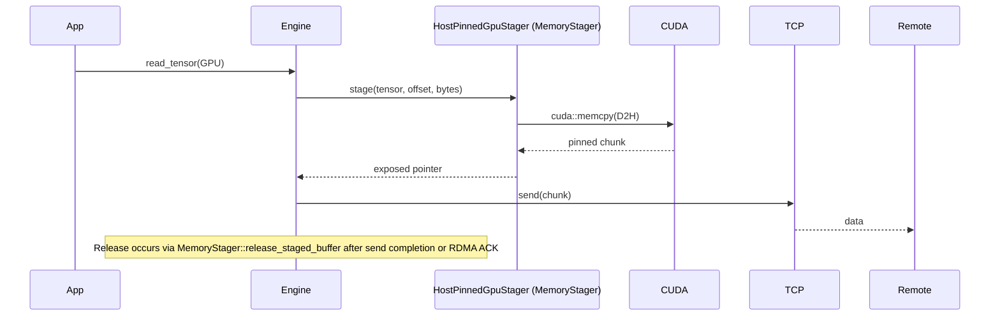

#### CPU staging (HostPinnedCpuStager)

- Uses the same `PinnedBufferPool` slices to stage CPU tensors for RDMA or MTCP when required.
- Optional UMA lease provider supplies short-lived pin leases around memcpy.
- When RDMA is enabled, staged buffers are registered through `MrCache` (or the owning `NetDev`) before being exposed to the peer.

Key characteristics:
- Multi-buffer pipelining: `buffers_per_flow` from config controls how many chunks `StreamingPinnedBuffer` rotates.
- Chunk sizing: staging slice sizes are defined by `pinned_memory.classes[name=comm_gpu].slice_bytes` and `pinned_memory.classes[name=comm_cpu].slice_bytes`.
- Zero-copy window sizing: direct RDMA uses `direct_rdma_chunk_bytes = pinned_memory.classes[name=comm_gpu].slice_bytes`.
- Pool reuse: staging buffers are allocated from the daemon-wide pinned memory authority via the `comm_gpu`/`comm_cpu` class pools.
- Explicit release: MTCP senders free staged buffers once their socket writes complete, while RDMA paths rely on `RDMA_READ_DONE_EX` to release the corresponding `StageLease` entries in the registry.
- GPU staging slots now use `StreamingChunkGuard` to acquire, promote, and hand buffers to async consumers, ensuring `StreamingPinnedBuffer` state transitions stay consistent while still aborting to the free queue if staging or copy submission fails.
- Unified flow control: `FlowCreditLedger` grants staging credit per channel, `StagingWindow` slices responses into credit-bounded windows, and `stager.max_window_segments` (0 → auto) optionally caps the number of segments emitted per window.
- Lane alignment on send/receive: MTCP now derives the active lane budget from the tensor’s total bytes and staging chunk size before assigning sockets on either side. Both sender and receiver use the same `offset + sub_offset_in_chunk` formula so GPU reads that span multiple sockets enqueue work to identical lane ordering, avoiding deadlocks when staging windows interleave connections.
- Receive buffer lifecycle: MTCP channels now track in-flight read requests and, once the last staging window completes, release the per-transport `StreamingPinnedBuffer` slices back to the shared `PinnedBufferPool`. Subsequent reads re-initialize buffers on demand, so short-lived transports no longer monopolize pinned memory until the GC sweeps the channel.
- Credit back-pressure: when MTCP exhausts staging credit, the engine now emits a warning and retries with backoff until credit returns (up to 30 s) instead of failing the transfer immediately.

### 3.5 TCP Mode Transfer Support Matrix

When MTCP is used, `PartitionTensor::needs_staging()` dictates whether the sender stages GPU tensors before writing sockets. With that hint in place, TCP mode supports all transfer combinations:

| Source | Target | Mechanism                                          | Status |
| ------ | ------ | -------------------------------------------------- | ------ |
| CPU    | CPU    | Direct transfer                                    | ✅      |
| CPU    | GPU    | Network→StreamingPinnedBuffer→GPU                  | ✅      |
| GPU    | CPU    | GPU→HostPinnedGpuStager→Network                           | ✅      |
| GPU    | GPU    | GPU→HostPinnedGpuStager→Network→StreamingPinnedBuffer→GPU | ✅      |

### 3.6 Complete Data Transfer Architecture for TCP Mode

The following diagram shows all four data transfer paths supported in both TCP and RDMA modes:

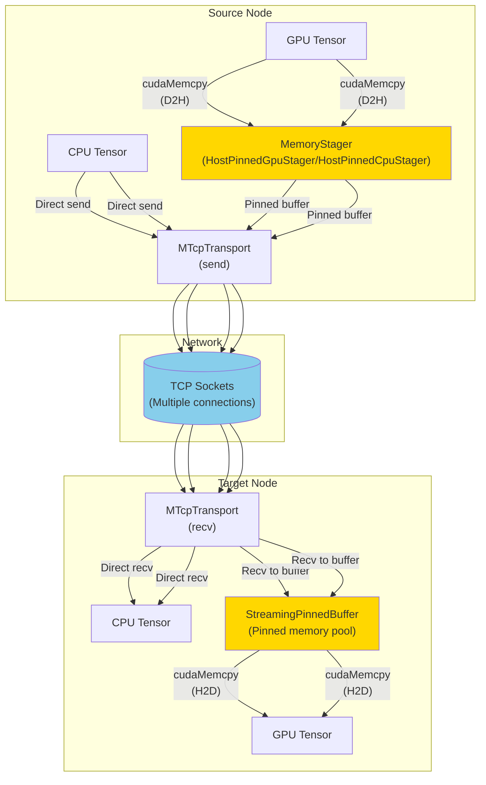


### 3.7 GPU Transfer Optimizations

#### Staging Buffer Configuration (typed)

Staging uses `CommunicatorConfig` for fan-out and `DaemonConfig.pinned_memory` for pinned sizing:

- `pinned_memory.classes[name=comm_gpu].slice_bytes`: GPU staging slice size (host-pinned).
- `pinned_memory.classes[name=comm_cpu].slice_bytes`: CPU staging slice size (host-pinned).
- `pinned_memory.classes[name=comm_*].pool_bytes`: staging pool budgets (capacity is `pool_bytes / slice_bytes`).
- `pinned_memory.classes[name=comm_*].rdma_preregister`: when RDMA is enabled, preregister host-pinned slabs once per NIC/PD.
- `rdma.staging_backend`: staged-RDMA backend selector (`STAGED_RDMA_BACKEND_HOST_PINNED` or `STAGED_RDMA_BACKEND_GPU_VRAM`).
- `rdma.vram_pool_bytes_per_gpu` / `rdma.vram_slice_bytes`: VRAM staging pool sizing (required when `rdma.staging_backend=STAGED_RDMA_BACKEND_GPU_VRAM`).
- `stager.buffers_per_flow`: number of buffers per flow (default: 4).
- `stager.expected_gpu_channels`: optional cap on concurrent GPU MTCP transports (default: 0 = auto).

#### Configuration Examples

Enable RDMA + slab-level preregistration for host-pinned staging:

```yaml
communicator:
  enable_rdma: true

pinned_memory:
  classes:
    - name: comm_gpu
      slice_bytes: 16MB
      pool_bytes: 8GB
      rdma_preregister: true
    - name: comm_cpu
      slice_bytes: 16MB
      pool_bytes: 2GB
      rdma_preregister: true
```

Enable forced GPU VRAM staged RDMA (RDMA-only) for GPU tensors:

```yaml
communicator:
  enable_rdma: true
  rdma:
    staging_backend: STAGED_RDMA_BACKEND_GPU_VRAM
    vram_pool_bytes_per_gpu: 2GB
    vram_slice_bytes: 16MB

# Still required for MTCP and for CPU tensors (and for host-pinned fallbacks).
pinned_memory:
  classes:
    - name: comm_gpu
      slice_bytes: 16MB
      pool_bytes: 8GB
      rdma_preregister: true
    - name: comm_cpu
      slice_bytes: 16MB
      pool_bytes: 2GB
      rdma_preregister: true
```

#### VRAM Pool Semantics (forced mode)

When `rdma.staging_backend=STAGED_RDMA_BACKEND_GPU_VRAM`:
- The daemon allocates exactly one contiguous VRAM pool per initialized CUDA device (VRAM scales with GPU count, not NIC count).
- The same per-GPU pool is preregistered once per NIC/PD (MR count scales with NIC/PD count, but VRAM allocation does not).
- `vram_pool_bytes_per_gpu >= vram_slice_bytes` is required; if `vram_pool_bytes_per_gpu % vram_slice_bytes != 0`, the remainder is truncated with a warning.

#### Performance Characteristics

1. **Memory Usage**: staging capacity is capped by pinned class budgets; host-pinned slices are reused across MTCP and host-pinned RDMA flows (VRAM staging uses its own pool).
2. **Pipelining**: Multiple buffers per flow allow GPU copies to overlap with socket I/O.
3. **CPU Path**: MTCP can stream CPU tensors without staging, while RDMA stages CPU slices through `HostPinnedCpuStager` and reuses cached MRs.
4. **Explicit release**: `MemoryStager::release_staged_buffer` is invoked after MTCP send completion or upon `RDMA_READ_DONE_EX` to recycle staging chunks (host-pinned or VRAM).
5. **Concurrency guard**: Set `stager.expected_gpu_channels` when sizing the pinned pool so `Communicator::init()` validates capacity up front; at runtime the communicator rejects MTCP GPU channels once this limit is reached instead of blocking on staging buffers indefinitely.

### 3.8 RDMA

Location: `transport/rdma_transport.{h,cc}` (QP, posting logic) and the RDMA paths in `engine/engine.cc`.

#### Multi-QP Configuration

The following configuration options can be used to enable multi-QP functionality for improved RDMA performance:

- **`rdma.qp_count`**: Number of Queue Pairs (QPs) to create per RDMA transport connection.
  - **Type**: int32
  - **Default**: 1 (single QP)
  - **Range**: 1-16
  - **Description**: When set to N > 1, creates N QPs for each RDMA transport and uses round-robin scheduling to distribute RDMA operations across them. This can improve throughput by leveraging multiple hardware queues and reducing contention.
  - **Example**:
    ```yaml
    communicator:
      rdma:
        qp_count: 4
    ```

- **`rdma.bonding_balance`**: Enable LAG (Link Aggregation Group) port balancing for multi-QP setups.
  - **Type**: bool
  - **Default**: false (disabled)
  - **Description**: When set to true and `qp_count` > 1, automatically distributes QPs across different LAG ports to achieve load balancing across multiple physical links. This requires NIC LAG configuration.
  - **Example**:
    ```yaml
    communicator:
      rdma:
        qp_count: 4
        bonding_balance: true
    ```

Key behaviors:
- `Channel::RdmaEndpoint` tracks each `<local_dev>|<peer_dev>` pair and governs the handshake lifecycle: `Idle → ConnectRequested → Ready → Failed`. Reads arriving while the endpoint is not `Ready` are enqueued with a generation token and drained only after the handshake succeeds.
- When an endpoint sits in `Failed` backoff, new RDMA responses queue their reads and a dedicated retry worker schedules the next handshake exactly at `next_retry_at`, so queued requests resume automatically once the backoff expires (no additional control traffic is required to nudge the handshake).
- `Communicator` stages every RDMA response into the configured staging backend (`hdr->staged = 1`) and inserts each segment as a `StageLease` in the per-channel `StageLeaseRegistry`; `MrCache` reuses registrations per protection domain.
- `on_receive_response()` only invokes `rdma_transport->read_multi()` after the endpoint transitions to `Ready`; handshake failures (connect response errors or explicit `ENGINE_OP_RDMA_CONNECT_FAILED`) flush the pending queue with an `absl::Status` that maps to `REMOTE_RDMA_CONNECT_FAILED` and schedule exponential backoff before retrying. When a fresh handshake attempt begins (`Idle` or `Failed` → `ConnectRequested`), the communicator now resets the failure counter so exponential backoff restarts from the minimum interval instead of inheriting the previous attempt's penalty.
- `rdma_transport::read_multi()` now rejects calls while `ready()` is `false`; QP transitions are solely driven by `connect()` so callers cannot post READ WRs against an uninitialised queue pair.
- Clients send `RDMA_READ_DONE_EX` after all segments complete. The server looks up the lease, deregisters when required, returns the buffer to the originating stager, and credits the `FlowCreditLedger`.
- `ack_ttl_ms` (configurable, default 30 s) guards against leaked ACKs by reaping overdue registry entries in the GC loop.
- QP attributes (`traffic_class`, `qp_timeout`, `qp_retry`) and outstanding WR limits are derived from `CommunicatorConfig`.
- Observability: zero-copy transfers increment `tc_rdma_direct_segments_total{device_id}` and `tc_rdma_direct_bytes_total{device_id}`, window sizes land in `tc_rdma_direct_window_bytes`, and fallbacks attributed by reason hit `tc_rdma_direct_fallback_total{reason}`.

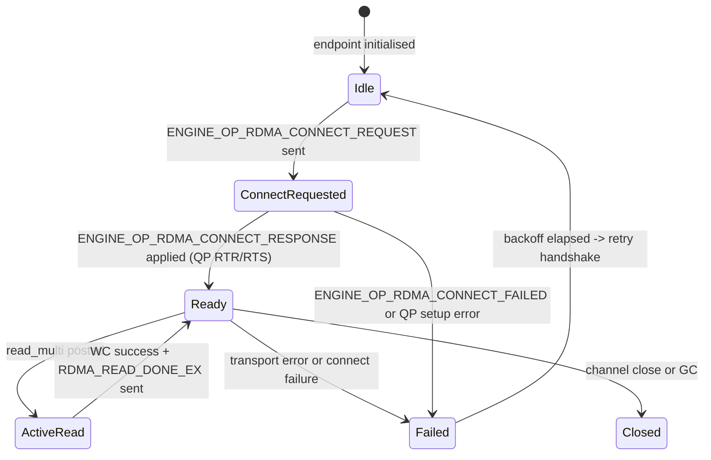

---

## 4. Data-flow Scenarios

### 4.1 Remote Read Request Flow

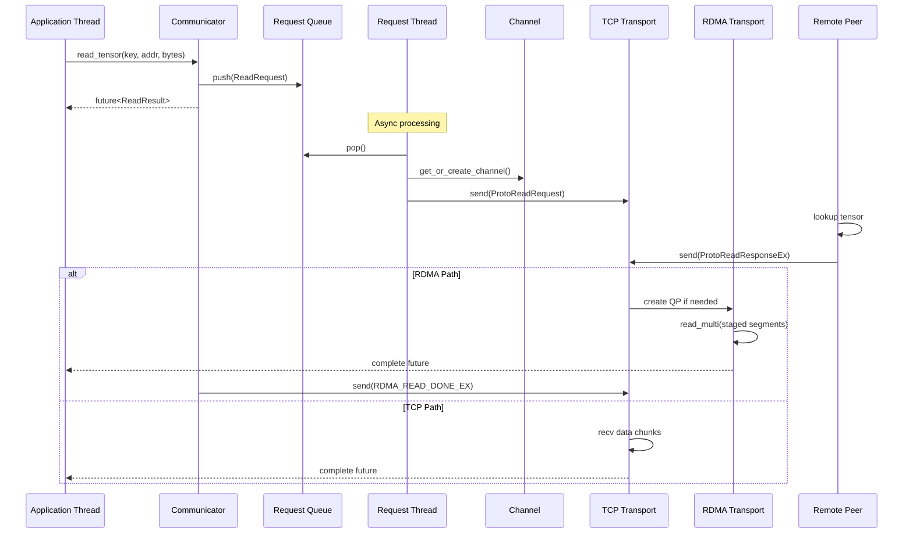

### 4.2 Tensor Registration Flow

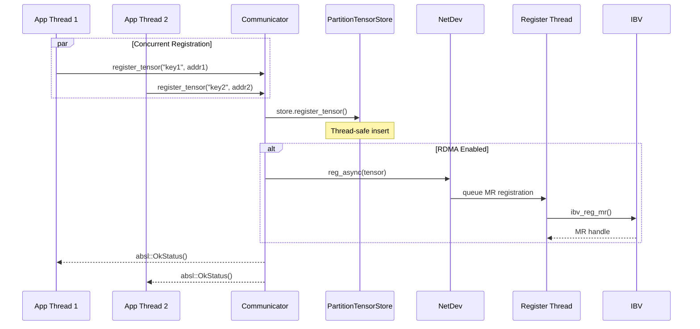

`register_tensor_ex` accepts `RegisterTensorOptions` so callers can request MR registration (`register_mr`), toggle async behavior, and flag tensors that require MTCP staging (`needs_staging`). GPU tensors pick up their device id, and `unregister_tensor()` is idempotent.

### 4.3 GPU→GPU Transfer Flow (TCP Mode)

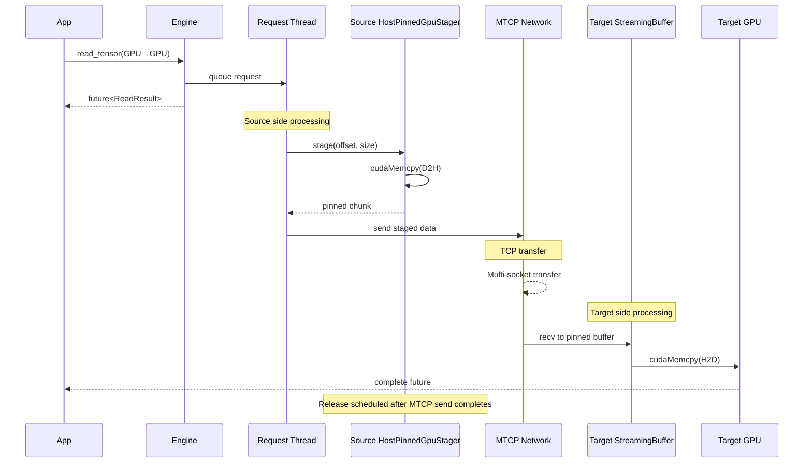

This flow demonstrates:
- GPU tensors stage through `HostPinnedGpuStager` when `needs_staging` is set (MTCP). RDMA staged fallback uses the configured `rdma.staging_backend` (`STAGED_RDMA_BACKEND_HOST_PINNED` or `STAGED_RDMA_BACKEND_GPU_VRAM`).
- Network transfer fans out across multiple MTCP sockets.
- Streaming pinned buffers feed the final `cudaMemcpy(H2D)` on the target side.
- MTCP completion triggers `MemoryStager::release_staged_buffer` to recycle pinned chunks.

---

## 5. Configuration (typed)

Communicator is configured via `CommunicatorConfig` (C++ type, mirrored in Python). See the migration guide
"CommunicatorConfig Migration" for YAML examples. Key proto fields:

- `enable_rdma`: enables RDMA transports and MR caching.
- `transport.tcp_conn_count` / `transport.tcp_tos` / `transport.connect_timeout_sec`: MTCP fan-out, socket TOS, and control connect timeouts. The engine now honors the configured TCP fan-out during both the server listener setup and client dial; values ≤1 are automatically raised to the default multi-socket budget so staging credit math stays consistent.
- `transport.so_reuseport`: enables multi-listener `SO_REUSEPORT` (default: disabled). Enable explicitly for multi-tenant deployments; keep it disabled in tests to force deterministic single-owner control sockets.
- `stager.buffers_per_flow`: staging pipeline depth.
- `rdma.ack_ttl_ms`, `rdma.traffic_class`, `rdma.qp_timeout`, `rdma.qp_retry`: staged-buffer GC window and QP tuning knobs.
- `simple_numa.nodes`: optional mapping from NICs/GPUs to stagers (pools are shared via pinned class budgets).

Pinned pool sizing and chunking are configured via `DaemonConfig.pinned_memory`:
- `pinned_memory.classes[name=comm_gpu]`: GPU staging pool (slice size + min/max bytes).
- `pinned_memory.classes[name=comm_cpu]`: CPU staging pool (slice size + min/max bytes).

Additional runtime knobs supplied by the daemon include `channel_expire_sec` (control-channel idle timeout, `0` = never).

---

## 6. Performance Considerations

### Thread Affinity
For optimal performance, consider:
- Pin RDMA polling threads to cores near the NIC
- Keep application threads on NUMA node with target memory
- Isolate GC thread to avoid interference
- Enable `simple_numa` when NIC/GPU affinity matters; the communicator will allocate per-node stagers and pools.

### Concurrency Tuning
Set `transport.tcp_conn_count` and `channel_expire_sec` in `CommunicatorConfig`.

### Memory Registration
- RDMA memory registration happens asynchronously; `MrCache` keeps staged slices alive per PD.
- First access may still incur registration latency for tensor-backed MRs.
- Setting `pinned_memory.classes[name=comm_*].rdma_preregister=true` preregisters staging slabs once per NIC/PD (only when `enable_rdma=true`).

### GPU Transfer Optimization
Tune `pinned_memory.classes[name=comm_gpu].slice_bytes`, `stager.buffers_per_flow`, and `transport.tcp_conn_count`.

**GPU-Specific Tips:**
1. **Chunk Size**: Match staging chunk size to typical tensor dimensions.
2. **Buffer Count**: Increase for concurrent transfers (e.g., replica parallel loading).
3. **Pinned Pool Headroom**: Ensure `pinned_memory.classes[name=comm_gpu].pool_bytes` covers simultaneous inflight stages on both ends.
4. **Device Selection**: Ensure the correct `device_id` so `cuda::set_device` avoids cross-GPU copies.

### Multi-QP Performance Optimization
For high-throughput RDMA scenarios, consider using multiple Queue Pairs:
- **Multi-QP Throughput**: Set `rdma.qp_count` > 1 to leverage multiple hardware queues and reduce contention
- **LAG Balancing**: Enable `rdma.bonding_balance: true` with NIC LAG configuration to distribute traffic across physical links
- **Optimal QP Count**: Typical values range from 2-8 QPs depending on hardware capabilities and workload patterns
- **Monitoring**: Monitor per-device completion queues to ensure balanced load distribution across QPs

---

### Common Issues

1. **High CPU in poll_loop**
   - Normal for RDMA polling mode
   - Consider interrupt mode for low-traffic scenarios

2. **Blocked application threads**
   - Check request queue size
   - Verify network connectivity
   - Examine GC thread activity

3. **Memory growth**
   - Ensure tensors are unregistered
   - Check channel expiration settings
   - Monitor staging buffer usage

4. **RDMA handshake reports `ibv_modify_qp`: No such device [19]**
   - Happens when the peer advertises a port number that does not exist on the local NIC. Reusing the peer’s `ib_port` for `qp_attr.ah_attr.port_num` makes `ibv_modify_qp` fail with ENODEV during the RTR transition.
   - Fixed in `RdmaTransport::do_modify_qp_rtr()`: the transport now always uses the local `NetDev` port (`dev_->get_port()`) when programming the QP attributes, so port mismatches no longer break the handshake.

---

## 7. Message Protocol (engine/protocol.h)

The Communicator uses a compact binary – **EngineMessage** – to exchange control information between peers.  Each message starts with a fixed-size `ProtoHeader` followed by a type-specific payload.  The header contains the **op-code** (`uint16_t op`) which maps 1-to-1 to the `ENGINE_OP_*` enum in `engine/protocol.h`.

### 7.1 Op-code Reference

| Op-code                           | Direction       | Purpose                                                   | When Triggered                                                          |
| --------------------------------- | --------------- | --------------------------------------------------------- | ----------------------------------------------------------------------- |
| `ENGINE_OP_READ_REQUEST`          | Client ➜ Server | Request a tensor slice (offset + bytes)                   | `read_tensor()` sends request from **request_thread_**.                 |
| `ENGINE_OP_READ_RESPONSE_EX`      | Server ➜ Client | Multi-segment response and transport indicator (MTCP/RDMA) | Server side of `on_receive_request()` ↠ client `on_receive_response()`. |
| `ENGINE_OP_RDMA_READ_DONE_EX`     | Client ➜ Server | Ack staged RDMA segments so the server can release buffers | Fired by `ReadRequest` once all RDMA READ completions are observed.     |
| `ENGINE_OP_READ_FAILED`           | Server ➜ Client | Read cannot be served (tensor missing / overflow)         | Validation failure inside `on_receive_request()`.                       |
| `ENGINE_OP_RDMA_CONNECT_REQUEST`  | Client ➜ Server | Propose an RDMA QP handshake for a NIC pair               | Issued lazily when first RDMA READ is required.                         |
| `ENGINE_OP_RDMA_CONNECT_RESPONSE` | Server ➜ Client | Return remote QP info so client can **RTR/RTS**           | `channel->get_rdma()` handshake path.                                   |
| `ENGINE_OP_RDMA_CONNECT_FAILED`   | Server ➜ Client | RDMA handshake rejected (e.g. no NIC)                     | Transport creation or `ibv_modify_qp()` failure.                        |
| `ENGINE_OP_MTCP_CONNECT_REQUEST`  | Client ➜ Server | Ask peer to open a multi-TCP (MTCP) listener              | First time a large tensor must flow over TCP.                           |
| `ENGINE_OP_MTCP_CONNECT_RESPONSE` | Server ➜ Client | Provides listener IP/port & agreed socket count           | Client then dials `MTcpTransport::connect()`.                           |
| `ENGINE_OP_MTCP_CONNECT_FAILED`   | Server ➜ Client | Peer could not create listener                            | Port exhaustion or internal error.                                      |
| `ENGINE_OP_CLOSE`                 | Either side     | Graceful channel shutdown                                 | `close_connection()` or GC thread expiry.                               |

> **Tip** – The op-codes are arranged so that **request / response / failure** triplets are numerically adjacent, simplifying switch-case handling.

### 7.2 Connection Handshake State-machine

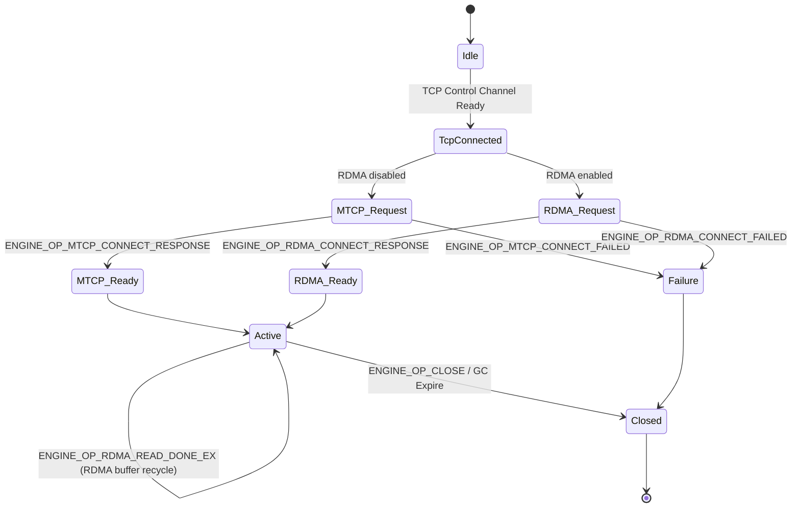

#### Unified Staging Flow Control (RDMA)
- Each `Channel` owns a `FlowState` that bundles a `FlowCreditLedger` and `StageLeaseRegistry`. When the server stages a window it records a `StageLease` in the registry, increments the outstanding credit, and returns the granted segments in `ProtoReadResponseExHeader.credit_granted`.
- Incoming RDMA read requests enqueue a per-channel staging session. The TCP receive loop calls `resume_rdma_reads()` to stage windows while credit and buffers are available, then immediately returns to the event loop when resources are exhausted. ACK handlers and GC reapers invoke the same helper so the control thread never blocks waiting for credit to cycle.
- The client records staged windows on the `ReadRequest` via `enqueue_window_ack()` and tracks the expected completions count. This keeps the ACK metadata alive until the RDMA READs finish and the acknowledgement can be sent.
- New connections still negotiate with `ENGINE_OP_RDMA_CONNECT_REQUEST/RESPONSE`. Until the response applies the peer QP parameters, `rdma_transport->ready()` remains false and the posted READs cannot complete, so the request future stays unresolved while the window metadata waits inside the ACK queue.
- Once completions arrive the `ReadRequest` coalesces offsets by window and emits `ENGINE_OP_RDMA_READ_DONE_EX`, which releases the matching leases from the registry and returns credit to the ledger.
- Handshake or read failures propagate through the request future. Any error drains the pending ACK windows, releases associated leases, and returns credit so subsequent requests are not starved.

### 7.3 Read Request Life-cycle

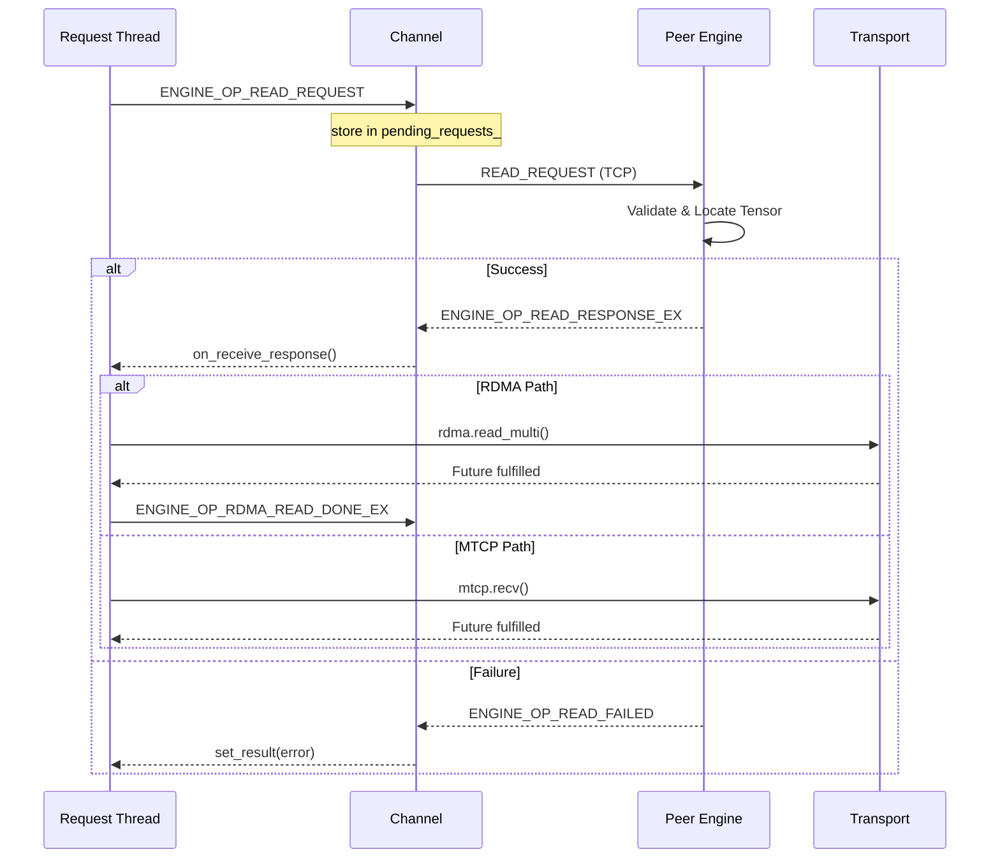

#### RDMA Path Details
- **Client request:** `do_read_request_loop()` sets `ProtoReadRequest.transport_type = ENGINE_TRANSPORT_RDMA` whenever `enable_rdma_` is true and records the `ReadRequest` in `pending_requests_` before the message is sent, preventing a fast response from beating the registration.
- **Server staging:** `on_receive_request()` schedules staging sessions via `resume_rdma_reads()` instead of blocking. `StagingWindow` pulls non-blocking credit from the ledger with `try_acquire()`, stages whatever segments fit that grant (partial windows included), registers them via `MrCache::get_or_register()` or `NetDev::reg_mr()`, and records each as a `StageLease` in the channel’s registry; when staging succeeds the header flag `ProtoReadResponseExHeader.staged` is set to `1` so the client knows to ACK.
- **Server failures:** If staging or MR registration fails, the session is removed from the pending queue, the server returns `ENGINE_OP_READ_FAILED` (reason `TENSORCAST_READ_FAILED_MEM_MISMATCH` for generic staging errors or `TENSORCAST_READ_FAILED_RESOURCE_EXHAUSTED` when GPU staging capacity is exhausted), and any staged buffers are released before the control loop continues.
- **Client handshake:** On the client side `on_receive_response()` locates the local NIC from `tensor->get_dev()`. The first RDMA response ensures the endpoint transitions from `Idle → ConnectRequested`, queues the `ReadRequest`, and emits `ENGINE_OP_RDMA_CONNECT_REQUEST`. While in `ConnectRequested` additional reads are enqueued; explicit failures (`ENGINE_OP_RDMA_CONNECT_FAILED` or QP setup errors) transition the endpoint to `Failed`, flush the queue with `REMOTE_RDMA_CONNECT_FAILED`, and schedule an exponential backoff before retrying.
- **Posting READs:** When the endpoint reaches `Ready`, the client builds `RdmaReadSeg` entries (remote `addr`/`rkey`, local destination based on `remote_offset_`) and invokes `transport->read_multi()`. The transport refuses to post READ WRs while `ready() == false`, so only the handshake path can transition the QP to RTS. Failures update the request status and drop it from `pending_requests_`.
- **ACK and cleanup:** For staged responses the client installs an `ack_action` that batches all segment offsets into `ENGINE_OP_RDMA_READ_DONE_EX`. Once all RDMA completions fire, this ACK releases staged buffers, deregisters MRs when needed, and removes the corresponding `StageLease` entries from the registry so the channel credit ledger can refill.
- **Staging backpressure:** If staging buffers are exhausted (for example, GPU tensors with chunked copies but an undersized `pinned_memory.classes[name=comm_gpu].pool_bytes`), the server does **not** block inside `MemoryStager::stage()`. Instead, staging attempts return `Unavailable/ResourceExhausted` and the MTCP staging loop retries with bounded backoff until the daemon-configured `pinned_memory.allocation_timeout` elapses; on expiry the request fails with a diagnosable `ResourceExhausted` error. Watch `[staging_credit]` WARN entries to confirm backpressure is cycling and to identify undersized pools.

#### Operational Monitoring
- `[staging_credit]` INFO logs emit whenever a window is staged or released; the log includes the request key, transport, window sequence, credit granted, and the current outstanding credit. Use these entries to verify that credit is cycling while transfers are in flight.
- The GC reaper logs `[staging_credit]` WARN entries when a lease exceeds `ack_ttl_ms`; if these appear, confirm that clients are issuing `RDMA_READ_DONE_EX`/MTCP send completions promptly.
- `[xfer_progress]` INFO/WARN logs provide low-frequency transfer progress for large requests (>=64MiB) on both sides: `side=source` advances from MTCP send-complete callbacks / RDMA ACK release, and `side=target` advances from MTCP recv chunk completion / RDMA work completions. Each update includes a textual bar, completion ratio, and instantaneous/average GiB/s.
- Tune `stager.max_window_segments` (0 → auto) when operators need to bound the number of segments per window without increasing `buffers_per_flow`.
- When running with the Fake CUDA backend the runtime automatically caps `buffers_per_flow_limit` to `1` so MTCP staging windows advance even though GPU copies are serviced synchronously.

### 7.4 Request Object States (`ReadRequest`)

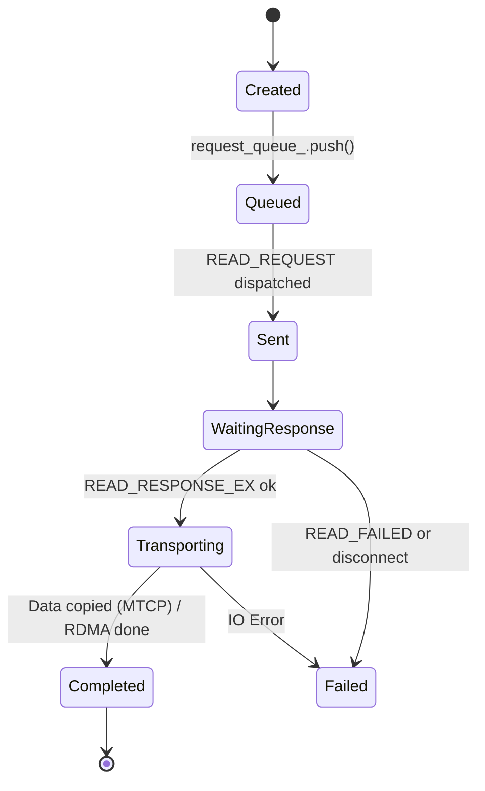

RDMA completions call `ReadRequest::invoke_ack_action_once()`, which sends `ENGINE_OP_RDMA_READ_DONE_EX` over the control channel and triggers server-side buffer reclamation.

### 7.5 Cross-Transport Soak Validation

- Bazel target `//core/communicator:cross_transport_soak_test` drives simultaneous RDMA and MTCP reads against a 128 MiB staged tensor, exercising the shared `FlowCreditLedger`/`StageLeaseRegistry` under mixed transport load.
- Run with `--test_env=TENSORCAST_CUDA_BACKEND=fake` during local development; the test auto-skips once it detects that RDMA devices are unavailable, allowing CI hosts without verbs support to pass while still validating MTCP staging.
- To execute the full soak, run the same target on a node with active RDMA interfaces. Use `--test_output=all` and tail `[staging_credit]` entries in the test log to confirm window grants/releases cycle cleanly across transports.

### 7.6 Multi-Host Smoke Tests

For manual multi-machine checks, use the communicator CPU/GPU CE binaries
(`//core/communicator:cpu_ce_test_binary` and
`//core/communicator:gpu_ce_test_binary`). See
`docs/development/testing.md` for the server/client command lines and RDMA
notes.
