# Communicator (C++)

The **Communicator** module is TensorCast's low-level, high-performance data-movement engine. It carries tensor payloads between Store Daemons and user processes (via the Store Engine) and cooperates with the control plane for metadata and session management.

This document explains its internal architecture, threading replica, key abstractions, data-flow, and extension points.

> The source lives under `core/communicator/`. All code samples and line numbers below refer to that directory unless stated otherwise.

---

## 1. High-level Architecture

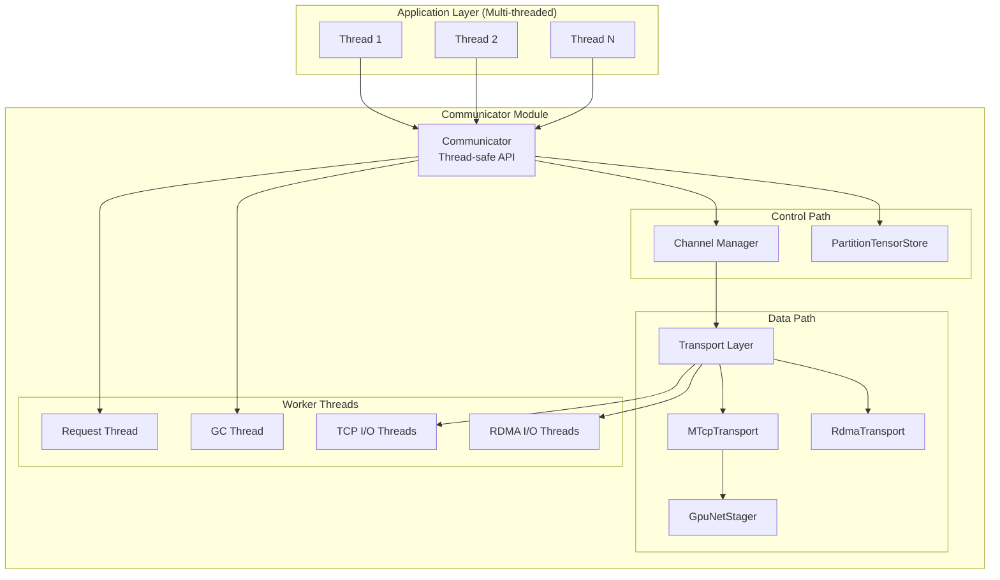

### Key Components

* **Communicator** — Central orchestrator built around `CommunicatorConfig`; owns request / GC threads, staged-buffer bookkeeping, and transport instances.
* **Channel** — Manages logical connections (control + data) to remote peers, including pending RDMA reads by `<local_dev>|<peer_dev>`.
* **Transport Layer** — Pluggable I/O mechanisms: TCP control, Multi-TCP (MTCP) bulk data, and RDMA queue pairs.
* **PartitionTensorStore** — Thread-safe registry for local tensors (CPU and GPU) backed by `misc::Map`.
* **Memory Stagers** — Unified `MemoryStager` interface with `GpuNetStager` (GPU→pinned) and `DRAMStager` (CPU→pinned) implementations.
* **PinnedBufferPool & StreamingPinnedBuffer** — Shared pools sized from config for staging chunks and streaming TCP receives.
* **MrCache** — Per-protection-domain cache that reuses RDMA MRs for staged buffers to avoid repeated registrations.

---

## 2. Threading Replica

The Communicator is designed for **concurrent access from multiple application threads**. Here's the complete threading architecture:

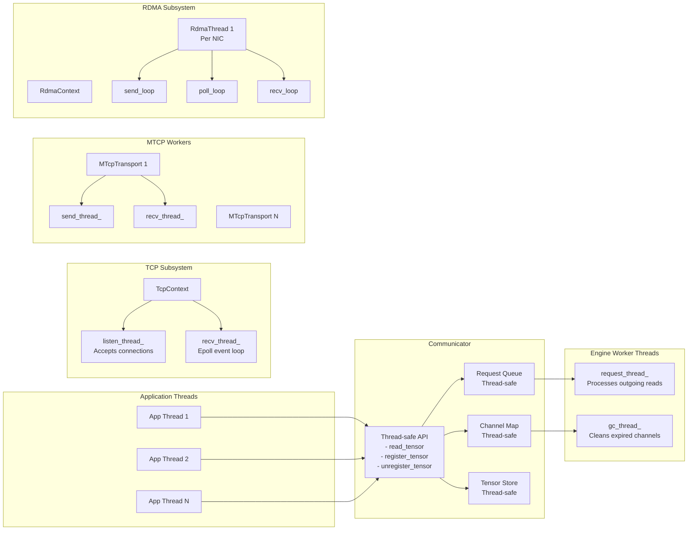

### Thread Responsibilities

#### Application Threads
- Can call any public API method concurrently
- All API methods are thread-safe through internal synchronization

#### Communicator Threads
1. **request_thread_** — Dequeues read requests and initiates remote operations
2. **gc_thread_** — Periodically scans and closes idle channels

#### TCP Infrastructure Threads
1. **TcpContext::listen_thread_** — Accepts incoming TCP connections
2. **TcpContext::recv_thread_** — Epoll-based event processing for all TCP sockets

#### MTCP Transport Threads (per connection)
1. **MTcpTransport::send_thread_** — Distributes write operations across multiple sockets
2. **MTcpTransport::recv_thread_** — Handles incoming data assembly
3. **MTcpTransportTask threads** — Per-socket send/recv workers

#### RDMA Infrastructure Threads (per NIC)
1. **RdmaThread::send_loop** — Posts RDMA READ operations
2. **RdmaThread::poll_loop** — Polls completion queues
3. **RdmaThread::recv_loop** — (Reserved for future RDMA RECV operations)

### Thread Safety Mechanisms

```cpp
// All public APIs use thread-safe containers:
Map<std::string, channel_t> channels_;        // Thread-safe map
Queue<read_request_t> request_queue_;          // Thread-safe queue
PartitionTensorStore store_;                   // Thread-safe store

// Example thread-safe implementation in Map<K,V>:
template <class K, class V>
void Map<K,V>::put(K key, V value) {
    std::unique_lock<std::mutex> lock(mu_);   // Synchronized access
    map_.insert(std::make_pair(key, value));
}

```

---

## 3. RDMA Debugging Aids

Recent instrumentation adds explicit logging around the control-plane receive loop and RDMA pipeline to make cross-node issues easier to triage:

- `[recv_func]` entries now appear whenever the TCP control channel receives a message. These logs dump the decoded header (`op`, `size`) and flag missing channel mappings before dispatch.
- `[on_receive_response]` emits whether we reused an existing RDMA transport or created a new QP, and now records queued pending reads plus peer QP parameters when the handshake finishes.
- `[rdma_transport]` traces QP readiness, segmented RDMA READ postings, and work completions (`IBV_WC_*` statuses); it refuses to post READ WRs until the peer's QP info has been applied, so the log clearly differentiates "handshake pending" from genuine RDMA failures.
- `[on_receive_request]` VLOG entries annotate each step of the READ_REQUEST server flow, from tensor-store lookup through RDMA segmentation/staging or MTCP streaming headers, making it easier to pinpoint where a read stalls.

When debugging replica hangs with `enable_rdma=true`, start by verifying that these log lines appear on both peers. Absence of `[recv_func]` or `[on_receive_response]` indicates the control channel never processed the server’s response, while missing `[rdma_transport]` completions typically points to QP handshake or remote memory registration failures.

---

## 3. Core Components Deep Dive

### 3.1 Communicator

Location: `engine/engine.{h,cc}`

The engine maintains thread-safe state and coordinates all operations:

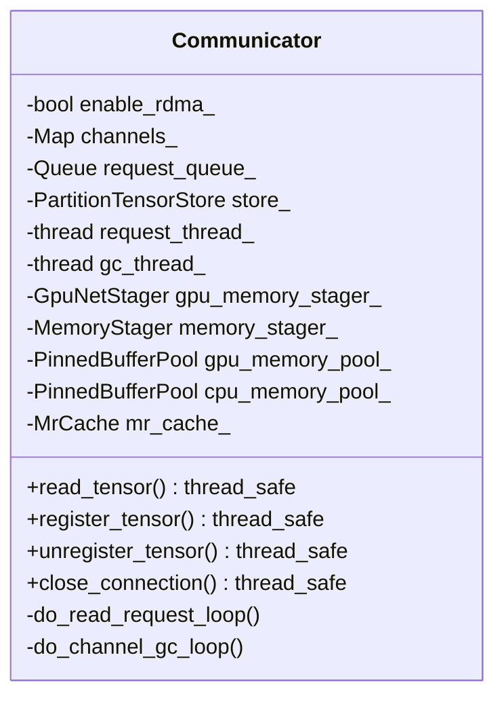

Key design points:
- All public methods are thread-safe.
- Internal worker threads (`request_thread_`, `gc_thread_`) handle async operations and lifecycle cleanup.
- Memory staging pools (GPU and CPU) plus the MR cache are constructed from `CommunicatorConfig` on startup.
- RDMA responses always stage into pinned buffers; clients acknowledge completions with `RDMA_READ_DONE_EX` so the server can recycle buffers.

### 3.2 Channel

Location: `engine/channel.{h,cc}`

Channels encapsulate the connection state to a remote peer:

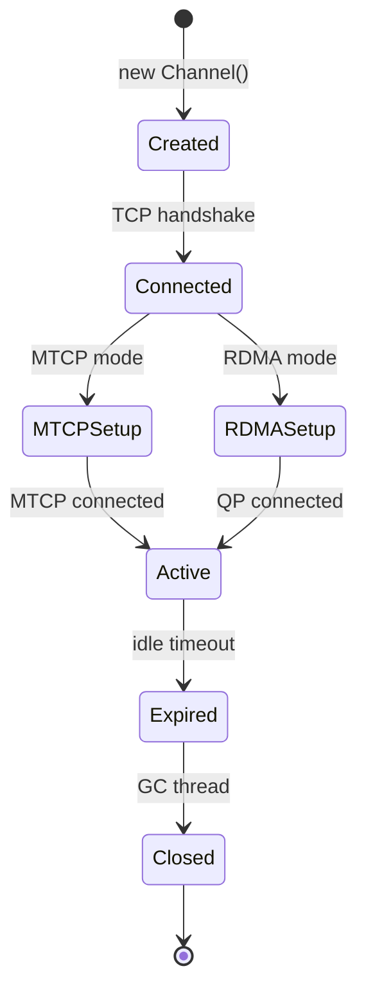

### 3.3 Transport Layer

The transport abstraction allows pluggable implementations:

| Transport       | Use-case              | Parallelism               | GPU Support |
| --------------- | --------------------- | ------------------------- | ----------- |
| `TcpTransport`  | Control channel       | Single socket             | N/A         |
| `MTcpTransport` | Large CPU/GPU tensors | Multi-socket (default: 8) | Via staging |
| `RdmaTransport` | Segmented RDMA READ (staged) | Per-QP                    | Direct after staging |

### 3.4 Memory Staging Infrastructure

The communicator routes tensor payloads through `MemoryStager` implementations:

- `GpuNetStager` performs GPU→CPU copies into chunks carved from a shared `PinnedBufferPool` and streams them with `StreamingPinnedBuffer`.
- `DRAMStager` copies CPU tensors into the same pool and can cooperate with UMA lease providers injected by the Store Engine.

`PartitionTensor::needs_staging()` (set via `RegisterTensorOptions`) signals when MTCP transfers must stage GPU tensors. RDMA responses are always staged; staged segments live in `staged_segments_` until an `RDMA_READ_DONE_EX` arrives.

#### GPU staging (GpuNetStager)

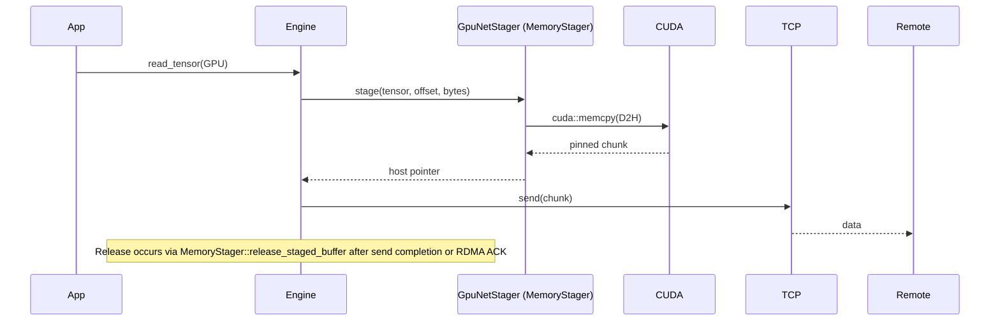

#### CPU staging (DRAMStager)

- Uses the same `PinnedBufferPool` slices to stage CPU tensors for RDMA or MTCP when required.
- Optional UMA lease provider supplies short-lived pin leases around memcpy.
- When RDMA is enabled, staged buffers are registered through `MrCache` (or the owning `NetDev`) before being exposed to the peer.

Key characteristics:
- Multi-buffer pipelining: `buffers_per_flow` from config controls how many chunks `StreamingPinnedBuffer` rotates.
- Chunk sizing: `stage_chunk_mb_gpu` and `stage_chunk_mb_cpu` define per-stager slice sizes; GPU defaults to 16 MiB, CPU to 4 MiB.
- Pool reuse: a single `PinnedBufferPool` services both staging paths (NUMA-specific pools are created when `simple_numa` is enabled).
- Explicit release: MTCP senders free staged buffers asynchronously after the socket write, while RDMA paths rely on `RDMA_READ_DONE_EX` to recycle entries in `staged_segments_`.

### 3.5 TCP Mode Transfer Support Matrix

When MTCP is used, `PartitionTensor::needs_staging()` dictates whether the sender stages GPU tensors before writing sockets. With that hint in place, TCP mode supports all transfer combinations:

| Source | Target | Mechanism                                          | Status |
| ------ | ------ | -------------------------------------------------- | ------ |
| CPU    | CPU    | Direct transfer                                    | ✅      |
| CPU    | GPU    | Network→StreamingPinnedBuffer→GPU                  | ✅      |
| GPU    | CPU    | GPU→GpuNetStager→Network                           | ✅      |
| GPU    | GPU    | GPU→GpuNetStager→Network→StreamingPinnedBuffer→GPU | ✅      |

### 3.6 Complete Data Transfer Architecture for TCP Mode

The following diagram shows all four data transfer paths supported in both TCP and RDMA modes:

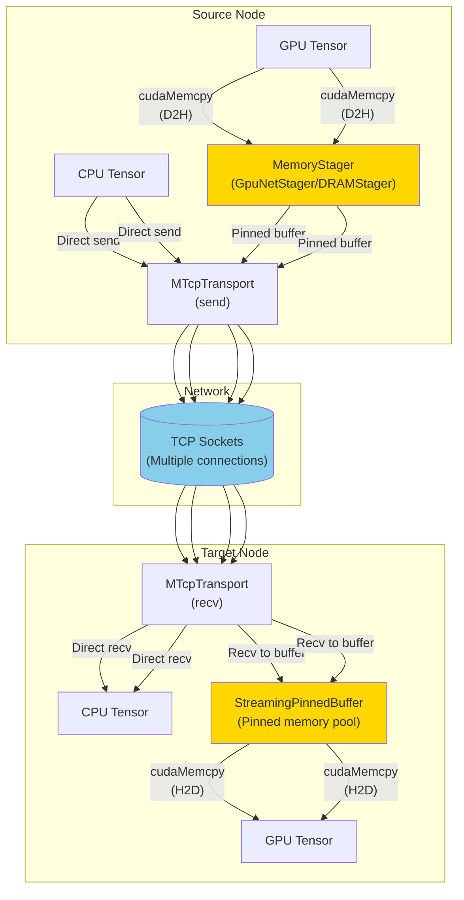


### 3.7 GPU Transfer Optimizations

#### Staging Buffer Configuration (typed)

Use `CommunicatorConfig` fields instead of env vars:

- stager.stage_chunk_mb_gpu: size of each staging chunk (MB). Default: 16.
- stager.stage_chunk_mb_cpu: CPU chunk size (MB). Default: 4.
- stager.buffers_per_flow: number of buffers per flow. Default: 4.
- pool.pool_size_bytes: total pinned memory reserved for staging. Default: 8 GiB (shared across GPU/CPU stagers).
- pool.preregister_mr: when true (default), RDMA contexts pre-register all pool slices on startup.

#### Performance Characteristics

1. **Memory Usage**: `PinnedBufferPool` capacity is capped by config; slices are reused across RDMA and MTCP flows.
2. **Pipelining**: Multiple buffers per flow allow GPU copies to overlap with socket I/O.
3. **CPU Path**: MTCP can stream CPU tensors without staging, while RDMA stages CPU slices through `DRAMStager` and reuses cached MRs.
4. **Explicit release**: `MemoryStager::release_staged_buffer` is invoked after MTCP send completion or upon `RDMA_READ_DONE_EX` to recycle pinned chunks.

### 3.8 RDMA

Location: `transport/rdma_transport.{h,cc}` (QP, posting logic) and the RDMA paths in `engine/engine.cc`.

Key behaviors:
- `Channel` holds RDMA transports keyed by `<local_dev>|<peer_dev>` and keeps per-pair pending read queues until the handshake completes.
- `Communicator` stages every RDMA response into pinned buffers (`hdr->staged = 1`) and records them in `staged_segments_`; `MrCache` reuses registrations per protection domain.
- Clients send `RDMA_READ_DONE_EX` after all segments complete. The server drops the matching staged segment, deregisters it when needed, and returns the buffer to the correct stager.
- `ack_ttl_ms` (configurable, default 30 s) guards against leaked ACKs by reaping old staged segments in the GC loop.
- QP attributes (`traffic_class`, `qp_timeout`, `qp_retry`) and outstanding WR limits are derived from `CommunicatorConfig`.

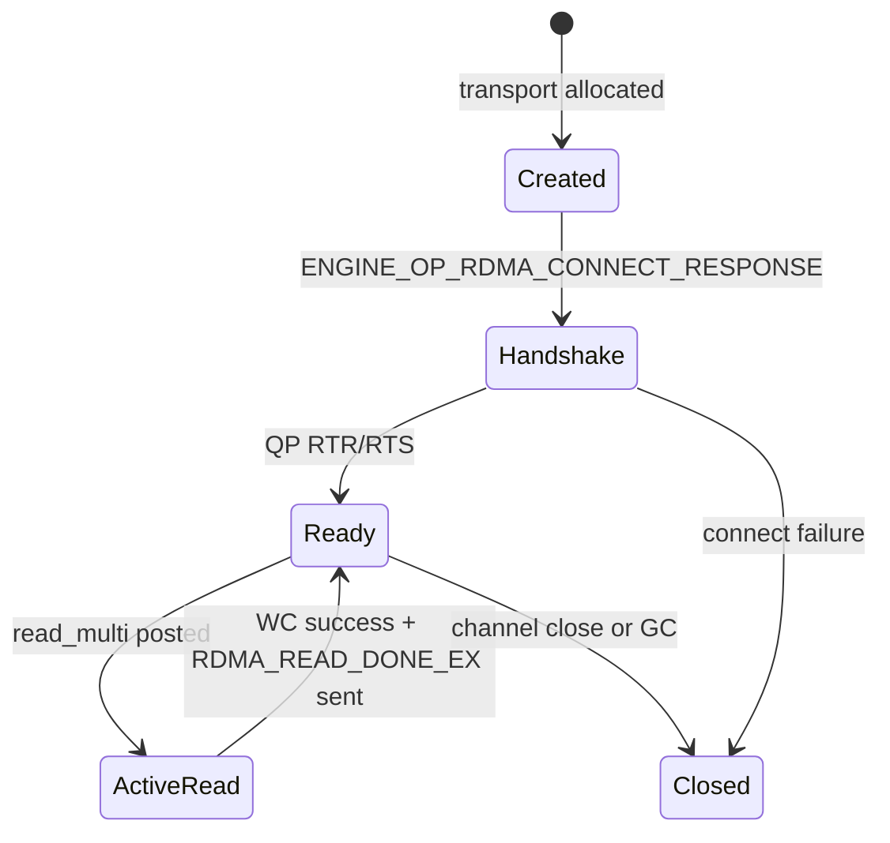

---

## 4. Data-flow Scenarios

### 4.1 Remote Read Request Flow

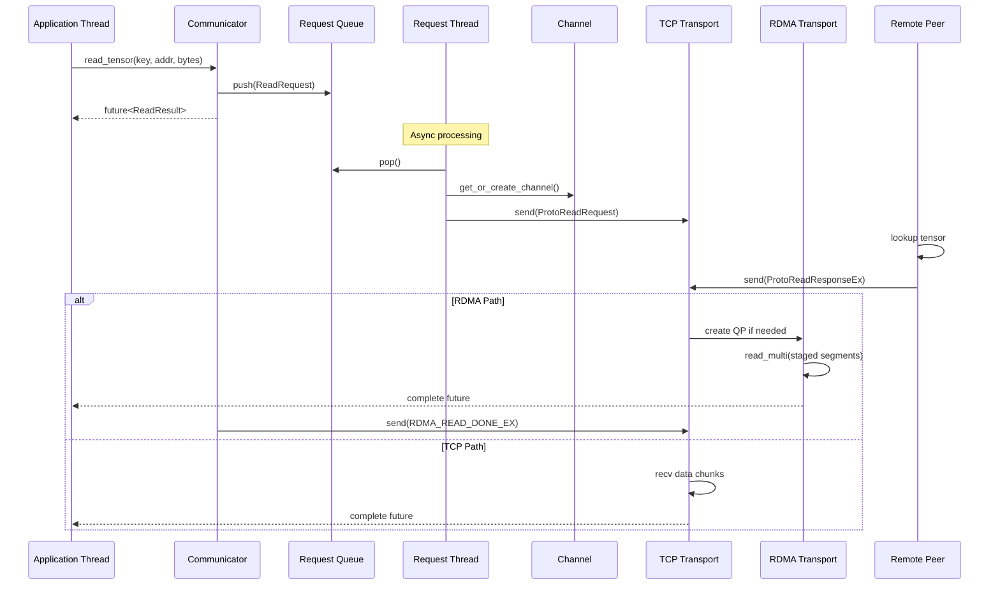

### 4.2 Tensor Registration Flow

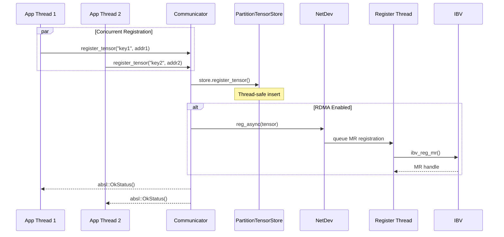

`register_tensor_ex` accepts `RegisterTensorOptions` so callers can request MR registration (`register_mr`), toggle async behavior, and flag tensors that require MTCP staging (`needs_staging`). GPU tensors pick up their device id, and `unregister_tensor()` is idempotent.

### 4.3 GPU→GPU Transfer Flow (TCP Mode)

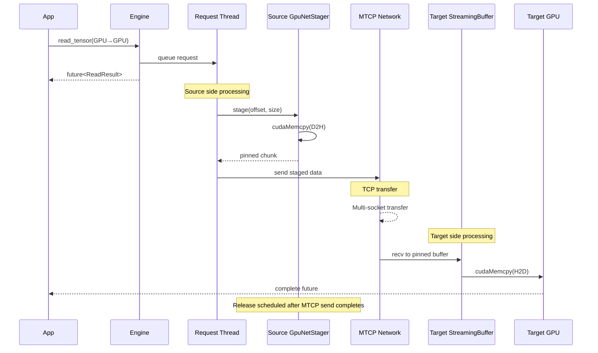

This flow demonstrates:
- GPU tensors stage through `GpuNetStager` when `needs_staging` is set.
- Network transfer fans out across multiple MTCP sockets.
- Streaming pinned buffers feed the final `cudaMemcpy(H2D)` on the target side.
- MTCP completion triggers `MemoryStager::release_staged_buffer` to recycle pinned chunks.

---

## 5. Configuration (typed)

Communicator is configured via `CommunicatorConfig` (C++ type, mirrored in Python). See the migration guide
"CommunicatorConfig Migration" for YAML examples. Key proto fields:

- `enable_rdma`: enables RDMA transports and MR caching.
- `transport.tcp_conn_count` / `transport.tcp_tos` / `transport.connect_timeout_sec`: MTCP fan-out, socket TOS, and control connect timeouts.
- `stager.stage_chunk_mb_{gpu,cpu}` & `stager.buffers_per_flow`: staging chunk size and pipeline depth.
- `pool.pool_size_bytes` / `pool.preregister_mr`: pinned pool sizing and prereregistration policy.
- `rdma.ack_ttl_ms`, `rdma.traffic_class`, `rdma.qp_timeout`, `rdma.qp_retry`: staged-buffer GC window and QP tuning knobs.
- `simple_numa.nodes`: optional mapping from NICs/GPUs to dedicated stagers and pools.

Additional runtime knobs supplied by the daemon include `channel_expire_sec` (control-channel idle timeout, `0` = never).

---

## 6. Performance Considerations

### Thread Affinity
For optimal performance, consider:
- Pin RDMA polling threads to cores near the NIC
- Keep application threads on NUMA node with target memory
- Isolate GC thread to avoid interference
- Enable `simple_numa` when NIC/GPU affinity matters; the communicator will allocate per-node stagers and pools.

### Concurrency Tuning
Set `transport.tcp_conn_count` and `channel_expire_sec` in `CommunicatorConfig`.

### Memory Registration
- RDMA memory registration happens asynchronously; `MrCache` keeps staged slices alive per PD.
- First access may still incur registration latency for tensor-backed MRs.
- Leaving `pool.preregister_mr=true` pre-registers pooled buffers across all RDMA devices.

### GPU Transfer Optimization
Tune `stager.stage_chunk_mb_gpu`, `stager.buffers_per_flow`, and `transport.tcp_conn_count`.

**GPU-Specific Tips:**
1. **Chunk Size**: Match staging chunk size to typical tensor dimensions.
2. **Buffer Count**: Increase for concurrent transfers (e.g., replica parallel loading).
3. **Pinned Pool Headroom**: Ensure `pool.pool_size_bytes` covers simultaneous inflight stages on both ends.
4. **Device Selection**: Ensure the correct `device_id` so `cuda::set_device` avoids cross-GPU copies.

---

### Common Issues

1. **High CPU in poll_loop**
   - Normal for RDMA polling mode
   - Consider interrupt mode for low-traffic scenarios

2. **Blocked application threads**
   - Check request queue size
   - Verify network connectivity
   - Examine GC thread activity

3. **Memory growth**
   - Ensure tensors are unregistered
   - Check channel expiration settings
   - Monitor staging buffer usage

---

## 7. Message Protocol (engine/protocol.h)

The Communicator uses a compact binary – **EngineMessage** – to exchange control information between peers.  Each message starts with a fixed-size `ProtoHeader` followed by a type-specific payload.  The header contains the **op-code** (`uint16_t op`) which maps 1-to-1 to the `ENGINE_OP_*` enum in `engine/protocol.h`.

### 7.1 Op-code Reference

| Op-code                           | Direction       | Purpose                                                   | When Triggered                                                          |
| --------------------------------- | --------------- | --------------------------------------------------------- | ----------------------------------------------------------------------- |
| `ENGINE_OP_READ_REQUEST`          | Client ➜ Server | Request a tensor slice (offset + bytes)                   | `read_tensor()` sends request from **request_thread_**.                 |
| `ENGINE_OP_READ_RESPONSE_EX`      | Server ➜ Client | Multi-segment response and transport indicator (MTCP/RDMA) | Server side of `on_receive_request()` ↠ client `on_receive_response()`. |
| `ENGINE_OP_RDMA_READ_DONE_EX`     | Client ➜ Server | Ack staged RDMA segments so the server can release buffers | Fired by `ReadRequest` once all RDMA READ completions are observed.     |
| `ENGINE_OP_READ_FAILED`           | Server ➜ Client | Read cannot be served (tensor missing / overflow)         | Validation failure inside `on_receive_request()`.                       |
| `ENGINE_OP_RDMA_CONNECT_REQUEST`  | Client ➜ Server | Propose an RDMA QP handshake for a NIC pair               | Issued lazily when first RDMA READ is required.                         |
| `ENGINE_OP_RDMA_CONNECT_RESPONSE` | Server ➜ Client | Return remote QP info so client can **RTR/RTS**           | `channel->get_rdma()` handshake path.                                   |
| `ENGINE_OP_RDMA_CONNECT_FAILED`   | Server ➜ Client | RDMA handshake rejected (e.g. no NIC)                     | Transport creation or `ibv_modify_qp()` failure.                        |
| `ENGINE_OP_MTCP_CONNECT_REQUEST`  | Client ➜ Server | Ask peer to open a multi-TCP (MTCP) listener              | First time a large tensor must flow over TCP.                           |
| `ENGINE_OP_MTCP_CONNECT_RESPONSE` | Server ➜ Client | Provides listener IP/port & agreed socket count           | Client then dials `MTcpTransport::connect()`.                           |
| `ENGINE_OP_MTCP_CONNECT_FAILED`   | Server ➜ Client | Peer could not create listener                            | Port exhaustion or internal error.                                      |
| `ENGINE_OP_CLOSE`                 | Either side     | Graceful channel shutdown                                 | `close_connection()` or GC thread expiry.                               |

> **Tip** – The op-codes are arranged so that **request / response / failure** triplets are numerically adjacent, simplifying switch-case handling.

### 7.2 Connection Handshake State-machine

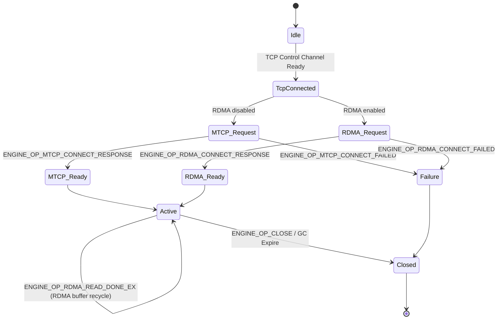

#### Pending Handshake Queue (RDMA)
- `Channel` now owns a per-device `pending_rdma_reads["<local>|<peer>"]` deque. When the client receives `READ_RESPONSE_EX` but the QP has not yet reached `RTR/RTS`, the request + segment metadata is staged in this queue.
- `ENGINE_OP_RDMA_CONNECT_RESPONSE` calls `transport->connect()` and then flushes the queue, issuing `read_multi()` for each staged request in FIFO order. This guarantees RDMA READ WRs are only posted after the handshake is complete.
- If `transport->ready()` is still false when a response arrives, the communicator leaves the request in the pending queue and waits for the handshake to finish before calling `read_multi()`.
- `ReadRequest` attaches an ACK action that sends `ENGINE_OP_RDMA_READ_DONE_EX` once all completions fire, allowing the server to recycle staged buffers.
- Any connect failure (`ENGINE_OP_RDMA_CONNECT_FAILED` or `connect()` error) drains the queue with an error so callers do not hang, and channel shutdown also fails remaining pending entries.

### 7.3 Read Request Life-cycle

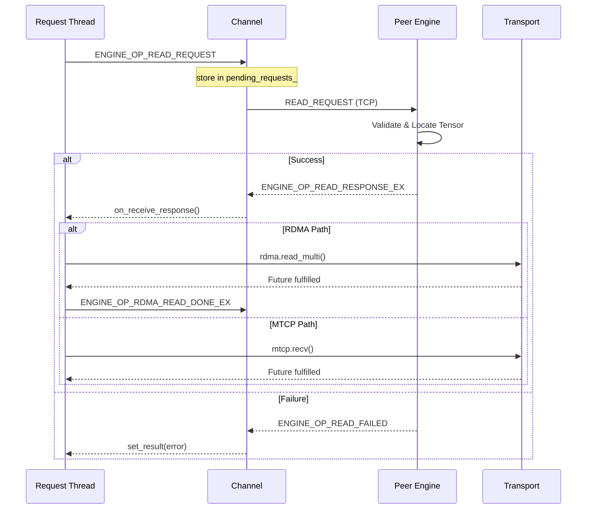

#### RDMA Path Details
- **Client request:** `do_read_request_loop()` sets `ProtoReadRequest.transport_type = ENGINE_TRANSPORT_RDMA` whenever `enable_rdma_` is true and records the `ReadRequest` in `pending_requests_` before the message is sent, preventing a fast response from beating the registration.
- **Server staging:** `on_receive_request()` forces staging for RDMA responses. Segment sizes follow the NIC/GPU-specific `MemoryStager` chunk size (falling back to defaults). Each segment is staged into host memory, registered via `MrCache::get_or_register()` or `NetDev::reg_mr()`, emitted in the response header, and tracked in `staged_segments_`; when staging succeeds the header flag `ProtoReadResponseExHeader.staged` is set to `1` so the client knows to ACK.
- **Server failures:** If staging or MR registration fails, the server immediately returns `ENGINE_OP_READ_FAILED` with reason `TENSORCAST_READ_FAILED_MEM_MISMATCH` and unwinds any staged segments.
- **Client handshake:** On the client side `on_receive_response()` locates the local NIC from `tensor->get_dev()`. Missing transports trigger `ENGINE_OP_RDMA_CONNECT_REQUEST`, and until `transport->ready()` becomes true the request waits inside `Channel::pending_rdma_reads` so the subsequent connect response can post it.
- **Posting READs:** When the transport is ready, the client builds `RdmaReadSeg` entries (remote `addr`/`rkey`, local destination based on `remote_offset_`) and invokes `transport->read_multi()`. Failures update the request status and drop it from `pending_requests_`.
- **ACK and cleanup:** For staged responses the client installs an `ack_action` that batches all segment offsets into `ENGINE_OP_RDMA_READ_DONE_EX`. Once all RDMA completions fire, this ACK releases staged buffers, deregisters MRs when needed, and erases the entries from `staged_segments_` on the server.
- **Staging backpressure:** If staging buffers are exhausted (for example, GPU tensors with chunked copies but few `StreamingPinnedBuffer` slots), the server logs `StreamingPinnedBuffer capacity exhausted...` warnings while waiting for the client’s `RDMA_READ_DONE_EX` to recycle buffers, making “hangs” due to undersized pools visible in logs.

### 7.4 Request Object States (`ReadRequest`)

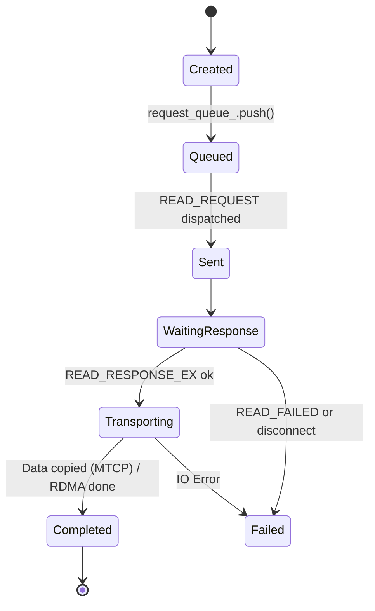

RDMA completions call `ReadRequest::invoke_ack_action_once()`, which sends `ENGINE_OP_RDMA_READ_DONE_EX` over the control channel and triggers server-side buffer reclamation.
