# Communicator (C++)

The **Communicator** module is STEP AI's low-level, high-performance data-movement engine. It powers peer-to-peer tensor exchange between **Store Daemon**, **Global Store**, and user processes.

This document explains its internal architecture, threading replica, key abstractions, data-flow, and extension points.

> The source lives under `core/communicator/`. All code samples and line numbers below refer to that directory unless stated otherwise.

---

## 1. High-level Architecture

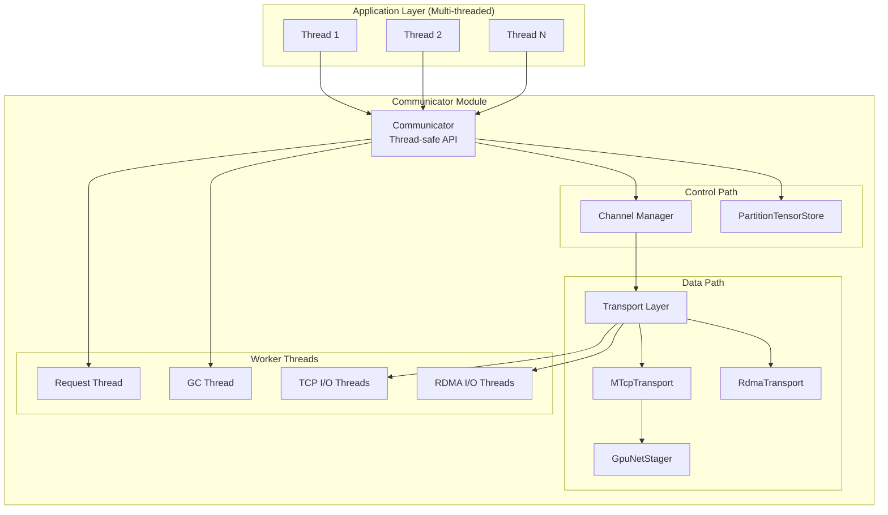

### Key Components

* **Communicator** — Central orchestrator providing thread-safe public API
* **Channel** — Manages logical connections (control + data) to remote peers
* **Transport Layer** — Pluggable I/O mechanisms: TCP, Multi-TCP (MTCP), RDMA
* **PartitionTensorStore** — Thread-safe registry for local tensors
* **GpuNetStager** — GPU→CPU staging for TCP transport (when RDMA disabled)

---

## 2. Threading Replica

The Communicator is designed for **concurrent access from multiple application threads**. Here's the complete threading architecture:

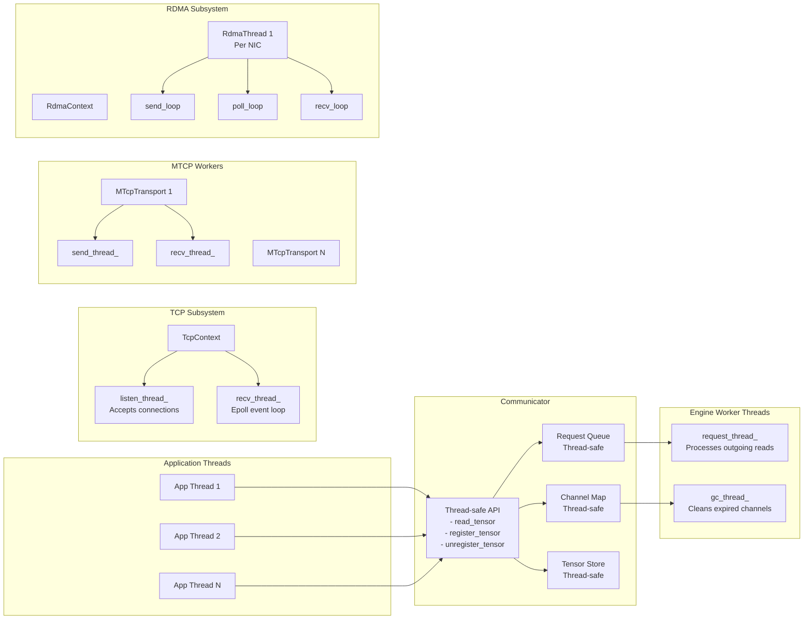

### Thread Responsibilities

#### Application Threads
- Can call any public API method concurrently
- All API methods are thread-safe through internal synchronization

#### Communicator Threads
1. **request_thread_** — Dequeues read requests and initiates remote operations
2. **gc_thread_** — Periodically scans and closes idle channels

#### TCP Infrastructure Threads
1. **TcpContext::listen_thread_** — Accepts incoming TCP connections
2. **TcpContext::recv_thread_** — Epoll-based event processing for all TCP sockets

#### MTCP Transport Threads (per connection)
1. **MTcpTransport::send_thread_** — Distributes write operations across multiple sockets
2. **MTcpTransport::recv_thread_** — Handles incoming data assembly
3. **MTcpTransportTask threads** — Per-socket send/recv workers

#### RDMA Infrastructure Threads (per NIC)
1. **RdmaThread::send_loop** — Posts RDMA READ operations
2. **RdmaThread::poll_loop** — Polls completion queues
3. **RdmaThread::recv_loop** — (Reserved for future RDMA RECV operations)

### Thread Safety Mechanisms

```cpp
// All public APIs use thread-safe containers:
Map<std::string, channel_t> channels_;        // Thread-safe map
Queue<read_request_t> request_queue_;          // Thread-safe queue
PartitionTensorStore store_;                   // Thread-safe store

// Example thread-safe implementation in Map<K,V>:
template <class K, class V>
void Map<K,V>::put(K key, V value) {
    std::unique_lock<std::mutex> lock(mu_);   // Synchronized access
    map_.insert(std::make_pair(key, value));
}
```

---

## 3. Core Components Deep Dive

### 3.1 Communicator

Location: `engine/engine.{h,cc}`

The engine maintains thread-safe state and coordinates all operations:

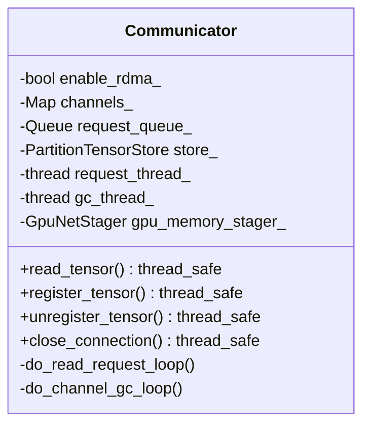

Key design points:
- All public methods are thread-safe
- Internal worker threads handle async operations
- GPU staging automatically enabled when RDMA disabled

### 3.2 Channel

Location: `engine/channel.{h,cc}`

Channels encapsulate the connection state to a remote peer:

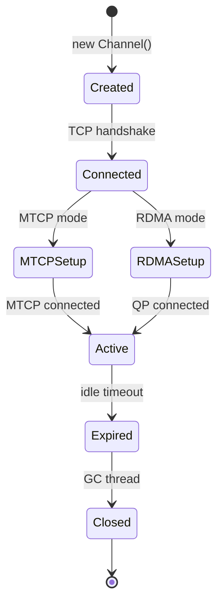

### 3.3 Transport Layer

The transport abstraction allows pluggable implementations:

| Transport       | Use-case              | Parallelism               | GPU Support |
| --------------- | --------------------- | ------------------------- | ----------- |
| `TcpTransport`  | Control channel       | Single socket             | N/A         |
| `MTcpTransport` | Large CPU/GPU tensors | Multi-socket (default: 8) | Via staging |
| `RdmaTransport` | Zero-copy GPU/CPU     | Per-QP                    | Direct      |

### 3.4 GPU→CPU Staging (TCP Mode)

When RDMA is disabled, GPU tensors are transparently staged through pinned memory:

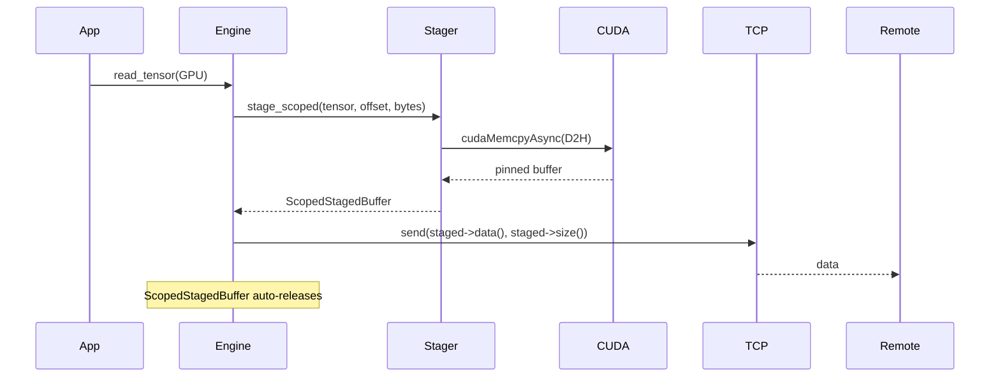

Key features:
- Double-buffered for pipelining
- Configurable chunk size (default: 64 MiB)
- Automatic buffer pool management
- RAII resource management with ScopedStagedBuffer

### 3.5 TCP Mode Transfer Support Matrix

With the complete implementation, TCP mode now supports all transfer combinations:

| Source | Target | Mechanism                                          | Status |
| ------ | ------ | -------------------------------------------------- | ------ |
| CPU    | CPU    | Direct transfer                                    | ✅      |
| CPU    | GPU    | Network→StreamingPinnedBuffer→GPU                  | ✅      |
| GPU    | CPU    | GPU→GpuNetStager→Network                           | ✅      |
| GPU    | GPU    | GPU→GpuNetStager→Network→StreamingPinnedBuffer→GPU | ✅      |

### 3.6 Complete Data Transfer Architecture for TCP Mode

The following diagram shows all four data transfer paths supported in both TCP and RDMA modes:

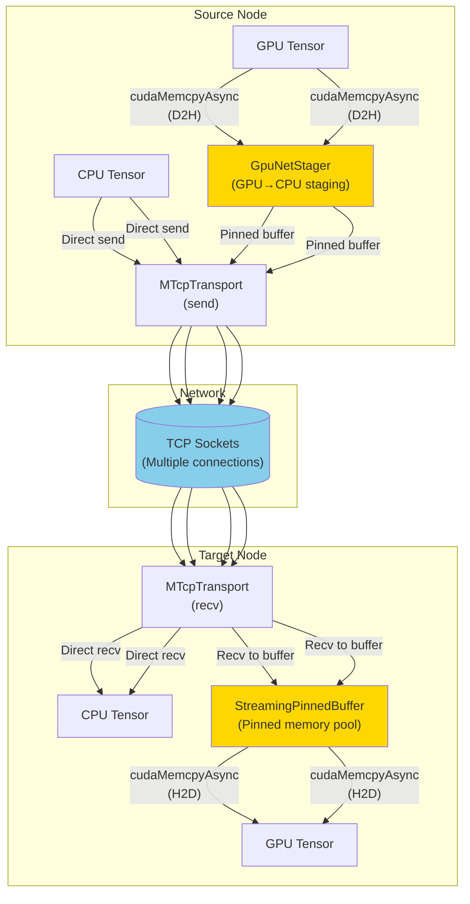


### 3.7 GPU Transfer Optimizations

#### Staging Buffer Configuration (typed)

Use `CommunicatorConfig` fields instead of env vars:

- stager.stage_chunk_mb_gpu: size of each staging chunk (MB). Default: 16.
- stager.stage_chunk_mb_cpu: CPU chunk size (MB). Default: 4.
- stager.buffers_per_flow: number of buffers per flow. Default: 4.

#### Performance Characteristics

1. **Memory Usage**: Only requires `chunk_size × (send_buffers + recv_buffers)` of pinned memory
2. **Pipelining**: GPU copies overlap with network transfers
3. **Zero-copy**: Direct transfer for CPU tensors
4. **RAII Safety**: Automatic resource cleanup prevents leaks

### 3.8 RDMA

Location: `engine/rdma.{h,cc}`

RDMA encapsulates the connection state to a remote peer:

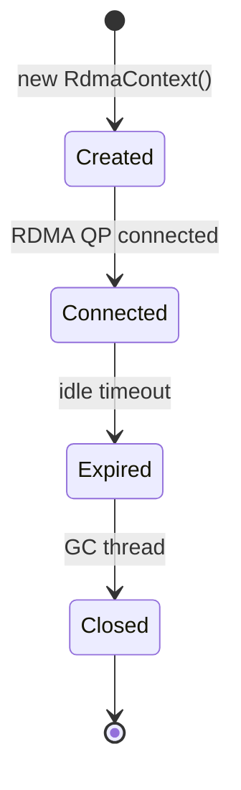

---

## 4. Data-flow Scenarios

### 4.1 Remote Read Request Flow

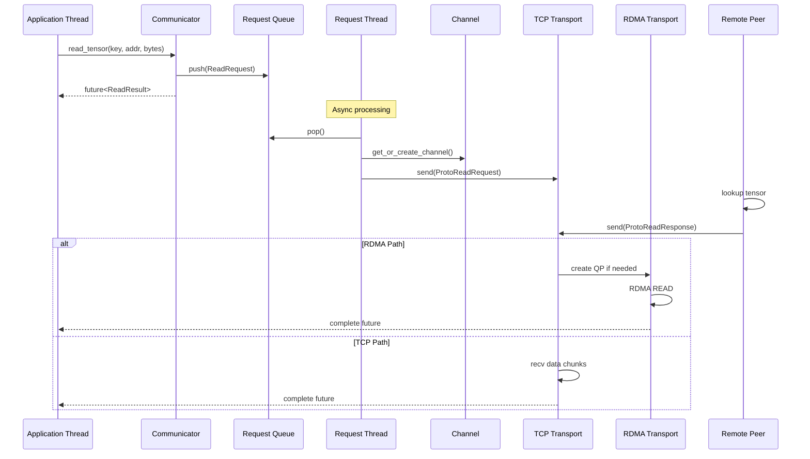

### 4.2 Tensor Registration Flow

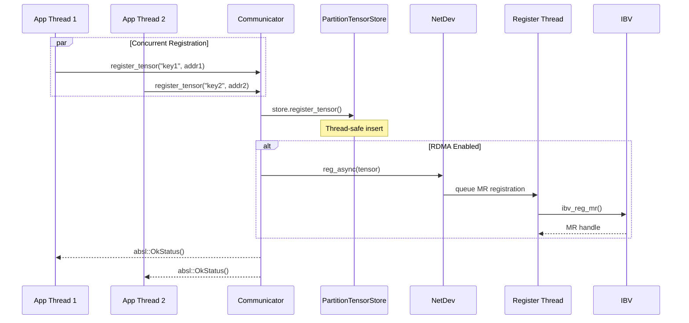

### 4.3 GPU→GPU Transfer Flow (TCP Mode)

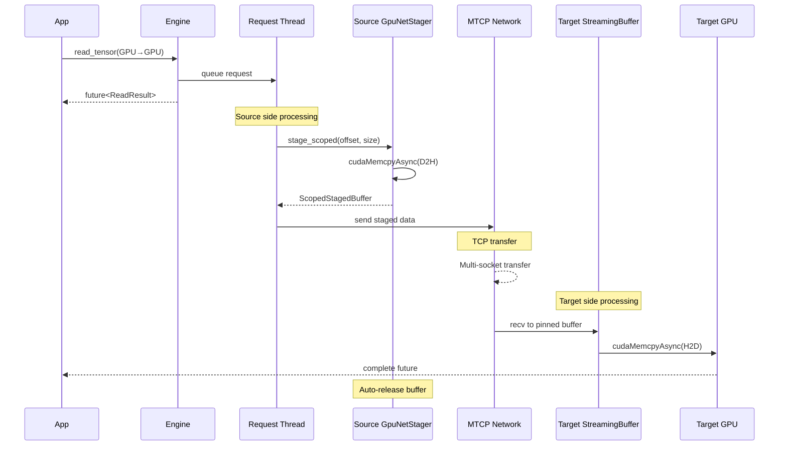

This flow demonstrates:
- Automatic GPU→CPU staging at source
- Efficient network transfer using multiple TCP sockets
- Automatic CPU→GPU staging at target
- RAII-based resource management throughout

---

## 5. Configuration (typed)

Communicator is configured via `CommunicatorConfig` (C++ type, mirrored in Python). See the migration guide
"CommunicatorConfig Migration" for YAML examples. Key fields:

- enable_rdma: enable RDMA transport.
- channel_expire_sec: channel idle timeout (0=never).
- transport.tcp_conn_count: parallel TCP sockets for MTCP.
- rdma.ack_ttl_ms: RDMA staged-segment ACK TTL.
- stager.stage_chunk_mb_{gpu,cpu}, stager.buffers_per_flow: staging parameters.

---

## 6. Performance Considerations

### Thread Affinity
For optimal performance, consider:
- Pin RDMA polling threads to cores near the NIC
- Keep application threads on NUMA node with target memory
- Isolate GC thread to avoid interference

### Concurrency Tuning
Set `transport.tcp_conn_count` and `channel_expire_sec` in `CommunicatorConfig`.

### Memory Registration
- RDMA memory registration happens asynchronously
- First access may incur registration latency
- Pre-register frequently used tensors

### GPU Transfer Optimization
Tune `stager.stage_chunk_mb_gpu`, `stager.buffers_per_flow`, and `transport.tcp_conn_count`.

**GPU-Specific Tips:**
1. **Chunk Size**: Match staging chunk size to typical tensor dimensions
2. **Buffer Count**: Increase for concurrent transfers (e.g., replica parallel loading)
3. **CUDA Streams**: Each stager uses its own CUDA stream for overlap
4. **Device Selection**: Ensure correct `device_id` to avoid cross-GPU copies

---

### Common Issues

1. **High CPU in poll_loop**
   - Normal for RDMA polling mode
   - Consider interrupt mode for low-traffic scenarios

2. **Blocked application threads**
   - Check request queue size
   - Verify network connectivity
   - Examine GC thread activity

3. **Memory growth**
   - Ensure tensors are unregistered
   - Check channel expiration settings
   - Monitor staging buffer usage

---

## 7. Message Protocol (engine/protocol.h)

The Communicator uses a compact binary – **EngineMessage** – to exchange control information between peers.  Each message starts with a fixed-size `ProtoHeader` followed by a type-specific payload.  The header contains the **op-code** (`uint16_t op`) which maps 1-to-1 to the `ENGINE_OP_*` enum in `engine/protocol.h`.

### 7.1 Op-code Reference

| Op-code                           | Direction       | Purpose                                                   | When Triggered                                                          |
| --------------------------------- | --------------- | --------------------------------------------------------- | ----------------------------------------------------------------------- |
| `ENGINE_OP_READ_REQUEST`          | Client ➜ Server | Request a tensor slice (offset + bytes)                   | `read_tensor()` sends request from **request_thread_**.                 |
| `ENGINE_OP_READ_RESPONSE_EX`      | Server ➜ Client | Multi-segment response and transport indicator (MTCP/RDMA) | Server side of `on_receive_request()` ↠ client `on_receive_response()`. |
| `ENGINE_OP_READ_FAILED`           | Server ➜ Client | Read cannot be served (tensor missing / overflow)         | Validation failure inside `on_receive_request()`.                       |
| `ENGINE_OP_RDMA_CONNECT_REQUEST`  | Client ➜ Server | Propose an RDMA QP handshake for a NIC pair               | Issued lazily when first RDMA READ is required.                         |
| `ENGINE_OP_RDMA_CONNECT_RESPONSE` | Server ➜ Client | Return remote QP info so client can **RTR/RTS**           | `channel->get_rdma()` handshake path.                                   |
| `ENGINE_OP_RDMA_CONNECT_FAILED`   | Server ➜ Client | RDMA handshake rejected (e.g. no NIC)                     | Transport creation or `ibv_modify_qp()` failure.                        |
| `ENGINE_OP_MTCP_CONNECT_REQUEST`  | Client ➜ Server | Ask peer to open a multi-TCP (MTCP) listener              | First time a large tensor must flow over TCP.                           |
| `ENGINE_OP_MTCP_CONNECT_RESPONSE` | Server ➜ Client | Provides listener IP/port & agreed socket count           | Client then dials `MTcpTransport::connect()`.                           |
| `ENGINE_OP_MTCP_CONNECT_FAILED`   | Server ➜ Client | Peer could not create listener                            | Port exhaustion or internal error.                                      |
| `ENGINE_OP_CLOSE`                 | Either side     | Graceful channel shutdown                                 | `close_connection()` or GC thread expiry.                               |

> **Tip** – The op-codes are arranged so that **request / response / failure** triplets are numerically adjacent, simplifying switch-case handling.

### 7.2 Connection Handshake State-machine

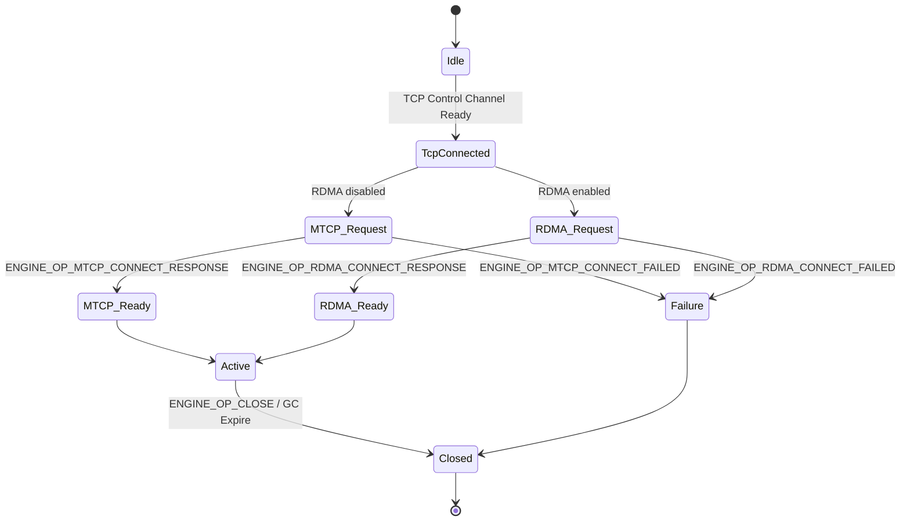

### 7.3 Read Request Life-cycle

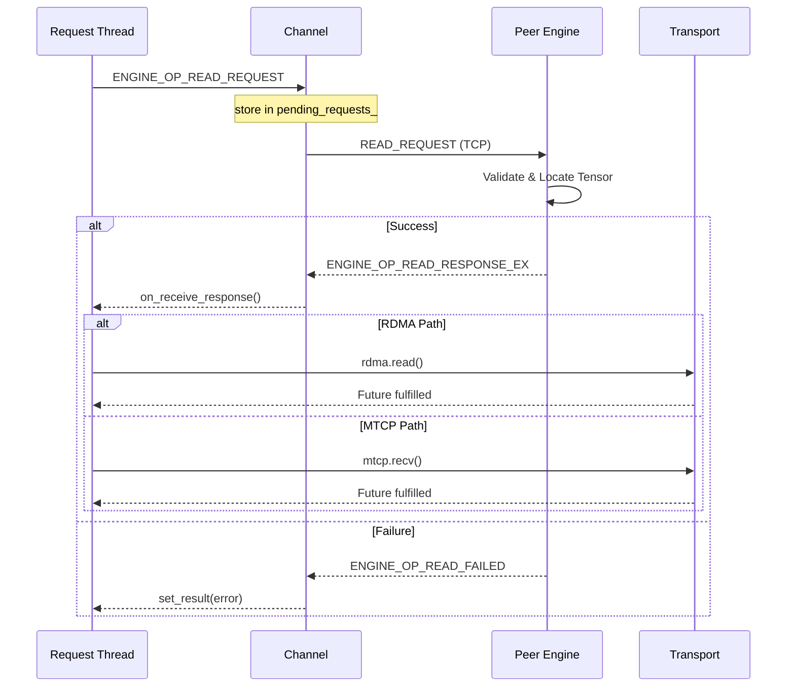

### 7.4 Request Object States (`ReadRequest`)

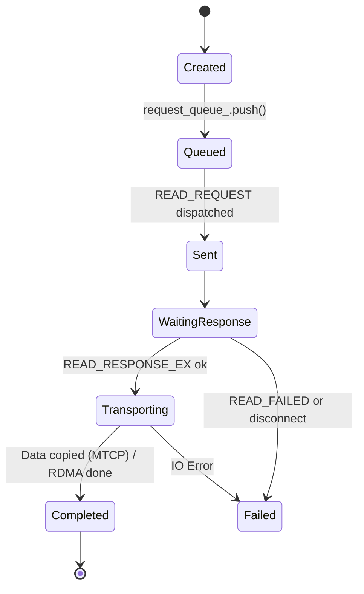
