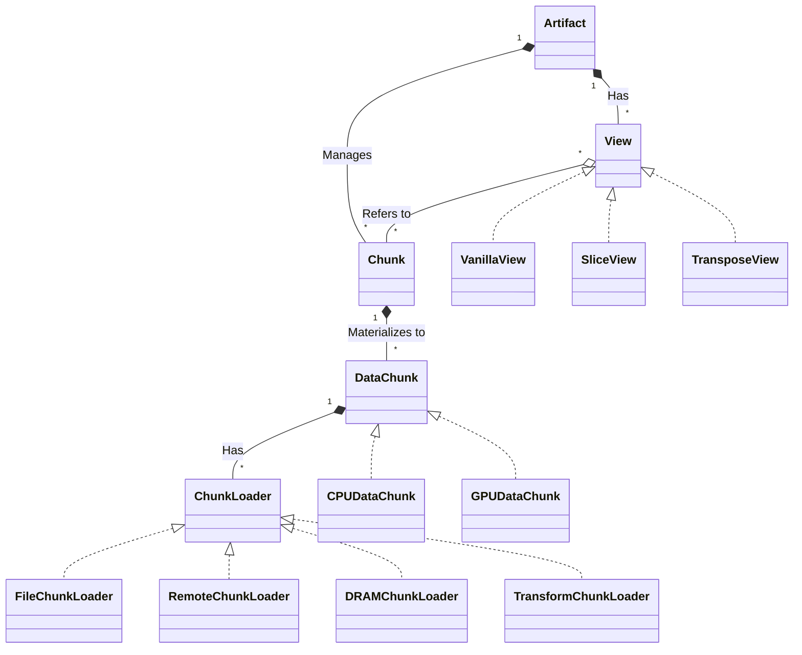

# TensorCast 单机架构设计

## 基本概念

1. Artifact：表示一个被 TensorCast 管理的数据对象，一般是一个 Tensor
2. View：Artifact 的一个“视图”，即要以怎样的视角取用数据。典型的 View 有 vanilla、slice 和 transpose几种。
3. 数据切块：TensorCast在单机上将数据切块管理，类似操作系统的 Page。对于同一个 Artifact 的不同 View，其底层数据组织可能并不相同（例如 vanilla 和 transpose），也可能相同（例如 vanilla 和 slice），因此不同 View 会根据实际情况创建/引用 Chunk。
4. Chunk（类）：Artifact（View）的一个数据切块的**描述**（数据块的元数据而非实际数据）。
5. DataChunk（类）：Chunk 在一个特定设备上的物化。例如，如果系统存在 CPU、GPU0、GPU1 三个设备，则每个 Chunk 会持有三个不同的 DataChunk 对象，分别对应这三个设备上存储的该 Chunk 的数据。

## 类图


<!-- ```
class Artifact {
  - String artifact_id
  - List~Chunk~ chunk_mgmt
  - List~View~ views
  + create_view() View
  - get_chunk_by_view_offset() Chunk
  - create_chunk() Chunk
}

class View {
  + get_chunk_at(off_t) Chunk
  + get_replica_at(Device) Map~off_t, DataChunk~
}
``` -->

## 线程模型

采用一个主线程、多个工作线程的模型：

1. 主线程处理所有元数据相关操作，主要是各种内存数据结构的管理
2. 工作线程处理数据的网络收发/设备间传输等数据面操作
3. 核心数据结构无锁；数据面相关数据结构加锁；工作线程和主线程间通过消息队列通信；工作线程不要修改元数据！

## 详细说明
### Artifact

描述一个tensor。
[TODO]

### View

描述一个tensor上边的一种“视图”。不做任何变换的tensor作为vanilla视图；此外准备支持slice和transpose视图。
[TODO]

### Chunk

描述一个数据块。最简单的例子，我们把vanilla（即原始tensor）切成2M大小的块，每个块就是一个Chunk。Chunk可以被多个View复用，例如对vanilla做slice，就可能能够复用部分Chunk。Chunk统一由Artifact管理，由View持有。当没有任何View持有Chunk时，Chunk会变为Orphan。Artifact可以定期清理Orphan Chunk（？TBD）

### DataChunk

一个数据块在某个具体设备上的实例化。例如，一个Chunk可以在DRAM上有一个CPUDataChunk，同时在多个GPU的VRAM上拥有多个GPUDataChunk。一个DataChunk上边不一定有数据：它处于loaded状态时是有数据的，否则没有数据。没有数据时要访问数据需要先load；有数据时想要让其倒出空间可以使用drop。
DataChunk可以有多个不同的ChunkLoader，例如从磁盘文件获取数据的DiskChunkLoader，从远程节点获取数据的RemoteChunkLoader等。

### ChunkLoader

为DataChunk提供load数据的方法。可被实现为从不同来源获取数据。