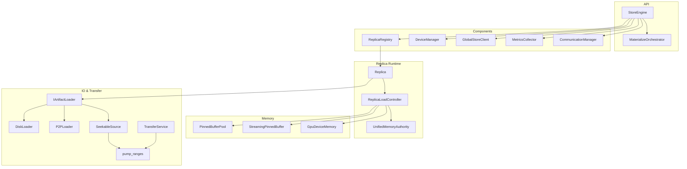
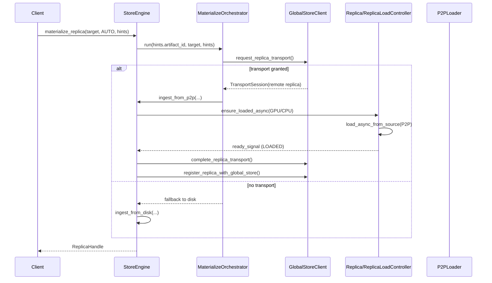
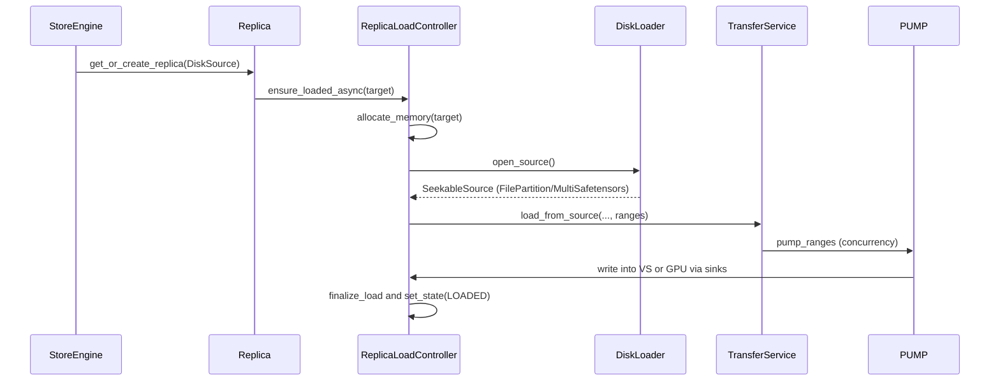
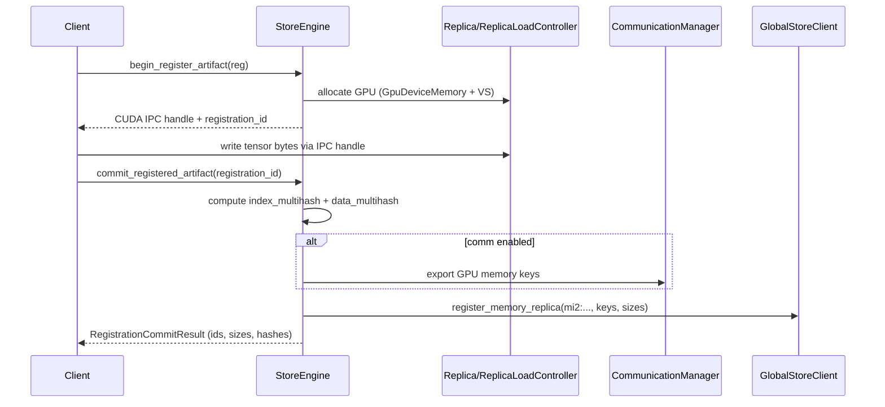
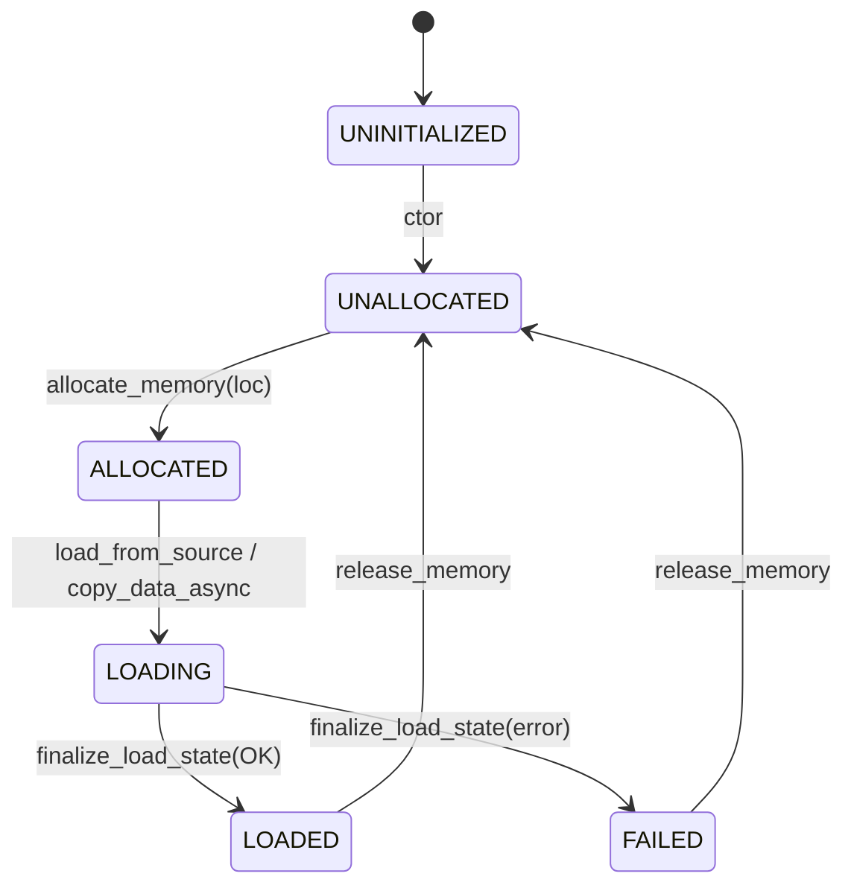
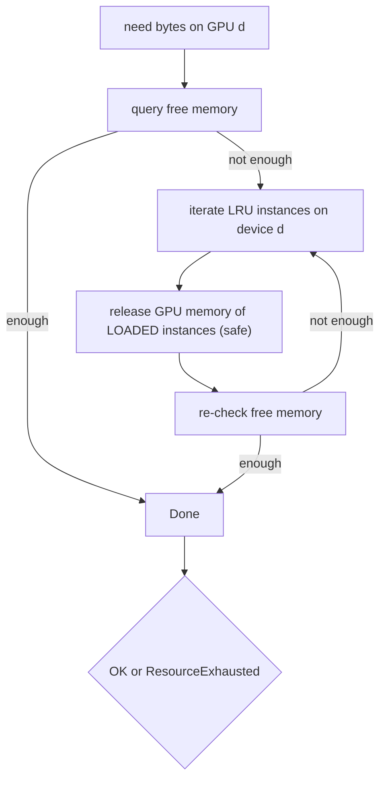

# Store Engine Internals (core/store)

This document explains the internal implementation of the C++ Store Engine based on the code in core/store. It focuses on:

- Public API surface and data contracts used by Python bindings and the Daemon
- Data flows for disk and P2P loading, and for in-memory registration
- Memory model (VS/UMA), state machines, and eviction
- Component responsibilities and how they collaborate

Key files:
- StoreEngine: core/store/store_engine.h, core/store/store_engine.cc
- Replica + ReplicaLoadController: core/store/replica/*
- Loaders and pump: core/store/materialization/dataplane/*
- Target layout sink: core/store/materialization/dataplane/sinks/target_layout_gpu_sink.{h,cc}
- View planning + execution: core/store/materialization/dataplane/view/{view_planner,view_plan_source}.{h,cc}
- Service helpers:
  - IndexService: core/store/materialization/dataplane/metadata/index_reader.{h,cc}
  - VerificationService: core/store/materialization/dataplane/verification/verification_utils.{h,cc}
  - EvictionService: core/store/components/eviction_service.{h,cc}
  - View spec helpers: core/store/view_utils.{h,cc}
  - Runtime catalog + services (core/store/runtime/**):
    - RuntimeContext: core/store/runtime/context/runtime_context.{h,cc} (initializes the shared PinnedBufferPool, DeviceManager, ReplicaRegistry, MetricsCollector, CommunicationManager, GlobalStoreClient, and ViewHashComputer, while embedding the Folly-backed event dispatcher used by the runtimes; Global Store HA sync calls carry monotonic sync tokens to reject stale updates; Global Store client helpers now include replica-availability + drain waits for safe swap retire flows).
    - RuntimeEnv: core/store/runtime/runtime_env.{h,cc} (bootstraps RuntimeContext, owns worker identity, and coordinates lifecycle/shutdown hooks for runtime services).
    - ReplicaRuntime: core/store/runtime/replica/replica_runtime.{h,cc} (wraps ReplicaRegistry operations, eviction retries, UMA snapshots, publishes replica lifecycle events, manages remote access toggles, and tracks per-replica publish state to build the HA inventory of publishable/resident replicas).
    - Ingestion events: core/store/runtime/ingestion_events.h (canonical definitions for runtime ingestion hooks shared by RuntimeContext’s dispatcher, ReplicaRuntime, and the ingestion/metadata runtimes).
    - MetadataGateway: core/store/runtime/metadata/metadata_gateway.{h,cc} (merges the old GlobalMetadataGateway + RegistrationFacade responsibilities, acting as the sole publisher for Global Store metadata, registration CRUD, key-mapping operations, TTL refreshes, view metadata fetches for view-id requests, and publish-state updates after registration).
    - IngestionRuntime: core/store/runtime/ingestion/ingestion_runtime.{h,cc} (delegates all ingestion/materialize flows to `MaterializationFacade` and exposes `IngestionRuntimeDependencies` so tests can inject facade hooks without touching production wiring; lifecycle events flow through `IngestionEventHub`).
    - RuntimeContextEvents: core/store/runtime/context/runtime_context_events.{h,cc} (Folly MPMC queue used by observers/tests; runtimes now publish ingestion/replica/registration updates after performing their own work so event consumers remain optional). Tests drain the dispatcher before teardown to ensure queued ingestion callbacks do not target destroyed runtimes.
- Components: core/store/components/*
- Types: core/store/materialization/contracts/loading_spec.h, core/store/device_types.h, core/store/communication_types.h

Related docs:
- `docs/architecture/artifact-views-and-retrieval.md`
- `docs/architecture/view-replicas-and-assembly.md`
- `docs/internals/byte-range-mapping-and-execution.md`

## High-level Architecture



`StoreEngine` is treated as a thin runtime facade. Construction delegates to `runtime::RuntimeEnv`, which validates options, initializes DeviceManager/ReplicaRegistry/MetricsCollector, wires the shared `PinnedBufferPool`, owns worker identity, and optionally connects to Global Store. Replica lifecycle helpers (`get_resident_devices`, `wait_replica_ready`, UMA snapshots, remote access toggles, eviction retries, etc.) are provided by `runtime::ReplicaRuntime`, so `StoreEngine` no longer reaches directly into `ReplicaRegistry`/`DeviceManager`; ReplicaRuntime also tracks per-replica publish state and exposes `get_ha_inventory()` for HA sync, including P2P transport metadata (remote memory keys + buffer sizes) so state sync preserves remote access. `runtime::metadata::MetadataGateway` is the sole component that talks to Global Store; all ingestion lifecycle notifications flow through `IngestionEventHub`, so `ReplicaRuntime`, `MetadataGateway`, and observability subscribers see the same typed events. `runtime::IngestionRuntime` forwards every disk/P2P/materialize request to `MaterializationFacade`, which wires the planner (`MaterializationService` + `MaterializeOrchestrator`), data plane (`IngestionPipeline`), and publishes started/completed events. Memory-registration commits and aborts still emit RuntimeContext payloads for observers, but MetadataGateway also refreshes UMA metrics inline so StoreEngine never needs to thread callbacks through the façade.

## UMA V3 Cutover (single ledger)

- Final cutover (V3): VirtualAddressSpace has been removed; UnifiedMemoryAuthority owns CPU virtual address reservation, chunk telemetry, and export bookkeeping. Incremental rollout flags are gone; transactional Plan→Execute→Commit and UMA-ledger authority are always enabled.
- Canonical Bazel targets: `//core/store/replica:unified_memory_authority` and `//core/store/replica:memory_export_registry`.
- UMA ledger keys are derived from the Replica `DeviceKey` (GPU ordinals or CPU:-1). CPU materialization binds UMA allocation to the CPU key so memory-tier lease lookups and UMA snapshots reference the same entry.
- Replica creation upgrades configs that provide `local_device_id >= 0` (even when `device_type` is left as CPU) to a GPU `DeviceKey` so CPU→GPU copy flows still bring up CUDA streams and UMA GPU sessions without requiring callers to flip the device type.

### Release & Eviction (GPU)

- GPU unload path now explicitly informs UMA to drop per-device residency and optional allocation via `UnifiedMemoryAuthority::release_gpu_device(ReplicaKey, device_id, drop_allocation=true)`. This keeps the UMA ledger authoritative and ensures VRAM is actually reclaimed. Subsequent `plan_load(GPU)` will correctly compute missing chunks instead of returning an empty set.

## Public API Surface (StoreEngine)

- Construction: `StoreEngine::StoreEngine(const StoreEngineOptions& opts)`
  - Configures the shared `storage_path` root, pinned pool size/chunk size, UMA chunk size, and optional `CommunicationManager` and `GlobalStore` address.

- Materialization (multi-device):
  - `absl::StatusOr<loading::ReplicaHandle> materialize_replica(const DeviceKey&, MaterializeMode, const MaterializeHints&, std::optional<loading::DiskSource>)`
  - `absl::StatusOr<loading::ReplicaHandle> materialize_view_from_assembly(assembly_id, target_artifact_id, view_id, view_spec_json, target_device, placement, allowed_view_ids)`
    assembles a view replica under a sealed `mi2` identity from CGID-scoped pieces; validates index multihash for `mi2`
    targets and requires a GPU destination.
  - Modes:
    - `AUTO`: Uses `MaterializeOrchestrator` to request a P2P transport from Global Store. P2P is gated by `hints.allow_p2p`; disk fallback is attempted only when `hints.allow_disk` is true and a typed `DiskSource` is supplied by the daemon. `PREFER_DISK` flips ordering to disk‑first, while `PREFER_P2P` keeps P2P‑first ordering and still requires a canonical `artifact_id`. Without a `DiskSource`, the orchestrator returns the transport status directly (no implicit path fallback). Global Store routing is eventually consistent and may briefly reference evicted local replicas; when that happens, the route is treated as stale: disk fallback is used when allowed and available, otherwise a retryable error is returned.
    - `LOAD_ONLY`: Loads from disk only and requires a typed `DiskSource`; when a content-addressed ID (`mi2:`) is provided it is validated against the on-disk `artifact_descriptor.json` to keep canonical identity aligned with the loaded replica.
    - `COPY_ONLY`: GPU→GPU copy from an already-loaded GPU instance; requires `hints.artifact_id` and a GPU target. If the destination replica already exists, it is reused instead of re-copying.
  - Safetensors disk fallback rebuilds canonical index JSON bytes and re-hashes them via `common::compute_index_multihash` so `mi2` identities stay stable even when the original `tensor_index.json` is absent.
  - Returns `ReplicaHandle { ReplicaKey, ready_signal, cpu_state, gpu_state, gpu_base_ptr, cuda_ipc_handle, view_index_json?, view_data_hash? }`.
    `cuda_ipc_handle` uses the shared `cuda::IpcHandleBytes` abstraction from `core/cuda`.
  - View-aware hints: populate `MaterializeHints::variant` (legacy field name; view id/spec + placement) to request a view. The resulting `ReplicaKey` includes `view_id` so the registry differentiates canonical and view replicas on the same device.
  - The staged ingestion pipeline emits structured events for each request; `TelemetryService` updates metrics/read-only snapshots, and `GlobalStorePublisher` registers successful loads with Global Store automatically so callers do not need to invoke the registration helper manually.

- Region-backed materialization (external targets):
  - `absl::StatusOr<loading::MaterializeIntoTargetResult> materialize_into_target(const DeviceKey&, const loading::IntoTargetLayout&, std::string_view canonical_index_json, uint64_t generation, const loading::MaterializeHints&, std::optional<loading::DiskSource>)`
  - `absl::StatusOr<loading::MaterializeIntoTargetResult> materialize_mapped_into_target(const DeviceKey&, const runtime::ingestion::strategy::PreparedSourceBoundExecutionPlan&, const loading::MaterializeHints&, std::optional<loading::DiskSource>)`
  - Executes a precompiled byte-range mapping (dst → src) into external target storages; v1 is used by mapped binding with narrow-only views and contiguous dst tensors.
  - For mapped requests carrying `hints.variant.view_id`, the ingestion path prefers view-byte-space transport (`request_view_transport`) and falls back to canonical transport when view transport is unavailable (`NOT_FOUND`/`UNIMPLEMENTED`), preserving compatibility during mixed-version rollout.
  - Streams canonical or view-selected ByteSpaces directly into client-provided GPU storages; no daemon-owned replica is allocated.
  - `IntoTargetLayout` supports ordered-concatenation multi-storage layouts (mapped to `TargetLayoutGpuSink`), and view/subset selection uses `ViewPlanner` + `ViewPlanSource` with `MaterializeHints::variant` carrying `view_id`/`view_spec` and placement.

  Note: In the key-based client flow, the Store Daemon is responsible for resolving the human key via Global Store and supplying `hints.artifact_id` plus an optional typed `DiskSource` (managed shared disk or daemon-local import). Clients do not pass disk paths directly; fallback authority remains daemon/engine-internal.

- In-memory registration (RFC-0006/0007):
  - `begin_register_artifact(const ArtifactRegistration&) -> RegistrationBeginResult`
    - Allocates target GPU memory via a temporary `Replica` and returns CUDA IPC handle bytes via the shared
      `cuda::IpcHandleBytes` abstraction so the caller can write directly.
  - `commit_registered_artifact(string_view registration_id) -> RegistrationCommitResult`
    - Computes `mi2:<index_multihash>:<data_multihash>` from GPU memory and optional canonical index bytes, optionally exports remote keys via communicator, registers with Global Store, and emits a `RegistrationCommitted` RuntimeContext notification. The returned `RegistrationCommitResult` now includes a `DeviceKey device` describing the committed residency alongside `device_id` for ABI compatibility.
  - `abort_registered_artifact(string_view registration_id)`
    - Releases UMA allocations for the pending session, refreshes UMA telemetry via ReplicaRuntime, and emits a `RegistrationAborted` RuntimeContext event (including error status when the abort is triggered by failures instead of clients).
  - Implementation is provided by `runtime::metadata::RegistrationBackend`, which owns pending registration state, TTL enforcement, view ingestion, and emits registration events through `MetadataGateway`. Global Store publication stays confined to `runtime::metadata::MetadataGateway`, so registration flows never reach into the Global Store client directly.

- Replica queries and management (ReplicaKey-centric):
  - `wait_replica_ready`, `unload_replica_status`, `unload_replica`, `get_replica_state`, `get_replica_gpu_ptr`,
    `get_replica_size`
  - `unload_replica_status` returns rich `absl::Status` failure context (location/state/release errors); the int-returning
    `unload_replica` preserves legacy 0/1/-1 semantics.
  - `get_resident_devices(artifact_id)`, `list_device_replicas(DeviceKey)`
  - UMA telemetry (authoritative):
    - `get_chunk_states_telemetry(artifact_id)` returns the UMA CPU snapshot (identical to `get_chunk_states_cpu_uma`)
    - GPU: `get_chunk_states_for_device(artifact_id, device_id)`
    - CPU (artifact-level convenience): `get_chunk_states_cpu_uma(artifact_id)`
      - Selection rule when multiple replicas exist: prefer a CPU instance if present; otherwise choose the GPU instance with the smallest device ordinal.

- View registration (v1.5):
  - `begin_register_artifact` accepts optional `ViewRegistration` payloads and requests a `BidirectionalViewPlan` from `core/store/materialization/dataplane/view::ViewPlanner`.
  - `ingest_view_registration_chunk` streams view bytes (SERVER placement) into canonical memory using `ViewIngestExecutor`; `commit_registered_artifact` publishes canonical + view hashes and canonical coverage.
  - When the runtime Fake CUDA backend is active (`TENSORCAST_CUDA_BACKEND=fake` in tests), view ingestion/transform runs on CPU tensors even for GPU placement and tolerates missing device ids.
  - See [View Registration Telemetry](../../docs/architecture/p2p-transfer-strategies.md#view-registration-telemetry) for the end-to-end flow across daemon and Global Store.
- View registration now requires `registration_kind`: `CANONICAL` keeps full-coverage semantics, while `PIECE` stores dense view bytes (no canonical zero-fill), enforces selection-only views, requires partial canonical coverage (full coverage must use `CANONICAL`), computes `view_data_hash` plus canonical coverage ranges, and fails commit if the piece hash cannot be computed.
- Piece registrations now treat Global Store view-metadata update failures (for example, `view_data_hash` conflicts) as commit failures so immutability violations surface to callers.

- Assembly sealing (v1):
  - `StoreEngine::seal_assembly(assembly_id, publish_canonical)` assembles canonical bytes from pieces, computes `data_multihash`, persists the `assembly_id → mi2_id` binding, and optionally materializes/publishes a canonical replica for durability.
  - Post-seal view migration uses `materialize_view_from_assembly(...)` under daemon-controlled policy to re-home cached
    views under the sealed identity.

- Remote access and registration helpers:
  - `enable_remote_replica_access/disable_remote_replica_access`
  - `register_replica_with_global_store(ReplicaKey[, canonical_mi2_override])`

### View-Aware Views (v1)

- `StoreEngine::compute_view_plan(canonical_index_json, ViewSpec)` constructs a deterministic `ViewPlan` by delegating to the loader `ViewPlanner`. v1 supports single-dimension `narrow` (slice) operations.
- When `tensor_names`/subset selection is provided, `ViewPlanner` packs tensors in the provided order (including full-name subsets) so `view_index_json` offsets match client-declared ordering for `MaterializeIntoTarget`.
- `StoreEngine::view_plan_allows_alias(const ViewPlan&)` exposes the loader selection analysis so callers can short-circuit to zero-copy aliasing when (and only when) the selection is contiguous, segment-aligned, and no transforms are required.
- `StoreEngine::compute_view_data_hash_from_source(SeekableSource&, ViewPlan, leaf_bytes)` delegates to the shared `ViewHashComputer`, which streams the canonical byte space, applies transforms when required, and computes the view `view_data_hash` using the standard TreeHash pipeline used by ingestion and registration flows.
  - This computes the view `view_data_hash` using the standard TreeHash pipeline used by ingestion and registration flows.

These helpers intentionally operate on generic `SeekableSource` instances; the daemon wraps GPU or disk sources in a compiled `ByteRangeMappedSource` so hashing and verification share one execution pipeline across transports.

// VS lock APIs have been removed in UMA V3 final state.
// Use UMA plan/commit and VS pin_range for CPU residency leasing.

### Granularity and Invariants

- Canonical sizes:
  - Artifact chunk (layout/state): `artifact_chunk_bytes`
  - Transfer slice/window (pump, pinned blocks): `pinned_memory.classes[name=engine].slice_bytes` (surfaced as `tx_slice_bytes`)
  - Hash leaf (content-addressed leaf): `hash_leaf_bytes`
- Invariants enforced at startup:
  - `artifact_chunk_bytes % pinned_memory.classes[name=engine].slice_bytes == 0` (equivalently `artifact_chunk_bytes % tx_slice_bytes == 0`)
  - Pinned buffer pool slice size aligned to 512 B and page size
- Transfer ranges never cross artifact chunk boundaries; pump slices always align to `tx_slice_bytes`.

## Data Paths

### AUTO Materialize (P2P-first)



### Disk Loading



### In-memory Registration (Begin → Write → Commit)



## Memory Model and State Machines

Store Engine relies on UMA (UnifiedMemoryAuthority) for contiguous per-replica CPU virtual address space, chunk bookkeeping, and export management. ReplicaLoadController orchestrates allocation, state transitions, and transfers.

### ReplicaLoadController Location States




- GPU allocations are lazily created via UMA on first use; VS CPU region is reserved at construction.
- `MemoryTierBudget` is built from `engine.memory_tiers` at runtime start, injected into each ReplicaLoadController/UMA for stable lease admission control, and surfaced via `StoreEngine::get_memory_tier_snapshot()` for daemon telemetry; the budget stays movable so runtime setup can pass it through `StatusOr` and into a shared instance without copies.
- When `StoreEngineOptions.cpu_shared_memory_enabled` (daemon config: `engine.cpu_shared_memory.enabled`) is true, UMA backs the CPU arena with `memfd_create` + `MAP_SHARED` and exposes `UnifiedMemoryAuthority::get_cpu_memfd_region(ReplicaKey)` so local clients can map CPU materializations without extra copies. Export admission is gated by stable leases (`engine.memory_tiers.stable_bytes`) and exports are pinned for the lifetime of the daemon handle lease.
- Stable lease admission bumps the UMA `ledger_version` only after stable bytes are successfully reserved from `MemoryTierBudget`; failed admissions roll the ledger back to the pre-admission value so daemon telemetry only reflects accepted changes.
- `StableDramCacheManager` gates local stable-DRAM retention by acquiring UMA stable leases on admission, applies and upgrades per-entry retention/overflow policy (`best_effort` → `ttl` → `pinned`), filters eviction candidates during demand-driven cache pressure, treats `overflow_policy=spill` as a hard requirement on shared-disk availability plus a spill-evictable durability check before evicting, and de-duplicates concurrent admits so accounting only updates on successful inserts while eviction clears tracking once stable leases are released. `StoreEngine::admit_stable_cache_policy(...)` exposes this as an engine-level hook so the daemon can apply/upgrade stable retention contracts post-commit, and `StoreEngine::update_stable_cache_policy(...)` supports downgrades when retention handles expire or release.
- Transfers and loading are pipelined via `TransferService` and `pump_ranges`, using a per-session `StreamingPinnedBuffer` backed by the shared `PinnedBufferPool`. Session buffer depth is controlled by `engine.streaming_buffer_chunks` (used for disk/P2P loads and local CPU→GPU copies). GPU materialization sessions are serialized per local GPU device before entering the pump so waiting sessions do not consume thread-pool workers needed by the active transfer. `TransferService` now synchronises the per-device H2D stream via `AsyncCopyManager::synchronize_h2d_stream()` followed by `cuda::device_synchronize()` so GPU residency is fully committed before verification and metadata persistence run.

### Async Copy Manager Integration

- H2D/D2H transfers submit via `AsyncCopyManager` (ACM), which wraps `cudaMemcpyAsync` with traced host callbacks and forwards completions onto a dedicated CPU worker to avoid making CUDA Runtime calls inside `cudaLaunchHostFunc`.
- StreamingPinnedBuffer slots remain owned by the pump consumer. ACM callbacks now only publish their completion status (and may request a `BufferPool::shutdown()` on failure); the consumer thread waits for that status and then returns the slot. Callbacks must not mutate `PumpState` or hand the slot back directly.
- Use `StreamingChunkGuard` (from `core/common/memory/streaming_chunk_guard.h`) when staging chunks for AsyncCopyManager. The guard acquires slots, promotes them to consumer ownership, and guarantees cleanup if submission fails, so callers cannot forget the `promote_producer_slot_to_consumer` transition.
- For H2D, UMA state should advance from the completion callback (if the caller needs it) using the `absl::Status` argument as proof of success; per-chunk `stream_synchronize` remains unnecessary.
- ACM owns per-device non-blocking streams per direction (H2D/D2H/D2D) and routes all copies through them; external stream injection has been removed.

#### ACM Usage Quick Guide

- Submit one async copy per chunk via `AsyncCopyManager`, and return SPB slots (or wake dependents) either inside the `on_copy_done` callback or by finalizing `CopyHandle` completions inline in the owning thread. Do not `cudaStreamSynchronize()` per chunk; the callback runs on a CPU worker after the CUDA stream callback fires. Pump consumers dealing with non-owning state (e.g., `pump_ranges`) poll handles and finalize completions inline so callbacks do not outlive stack-owned context.
- H2D example (return slot + optional UMA advancement in callback):
  ```cpp
  using common::AsyncCopyManager;
  common::HostRegion h{.base = host_ptr, .length = bytes, .pinned = true};
  common::DeviceRegion d{.device_id = device_id, .dev_ptr = dst_dev, .length = bytes};
  auto hdl_or = AsyncCopyManager::instance().submit_h2d(
      h,
      d,
      {.tracing_stage = "H2D/Copy",
       .callbacks = {.on_copy_done = [spb, slot_id, maybe_uma](absl::Status st) {
         if (st.ok()) {
           (void)spb->return_chunk(slot_id);
           if (maybe_uma) {
             maybe_uma();
           }
         } else {
           LOG(ERROR) << "async copy failed, slot=" << slot_id << ": " << st;
         }
       }}} );
  RETURN_IF_ERROR(hdl_or.status());
  ```
- D2H example (stage into SPB, mark ready in callback for writer thread):
  ```cpp
  auto hdl_or = AsyncCopyManager::instance().submit_d2h(
      src_dev,
      dst_host,
      {.tracing_stage = "D2H/Copy",
       .callbacks = {.on_copy_done = [spb, slot_id, gid, bytes](absl::Status st) {
         if (!st.ok()) {
           LOG(ERROR) << "async copy failed, gid=" << gid << ": " << st;
           return;
         }
         (void)spb->mark_chunk_ready(slot_id, gid, bytes);
       }}} );
  ```
- Same-device D2D: use `submit_d2d` and wait on handles as needed. Cross-device D2D remains under `ReplicaLoadController` (peer or staged fallback).
- Tests and CPU-only flows can use `submit_h2h` to exercise the async pump path without CUDA; the copy is dispatched on ACM’s callback worker so CopyHandles complete asynchronously.

### Chunk States (UMA Authority)

UMA is the sole ledger for chunk residency and export flags. VS no longer performs
transfer locking; instead, it provides CPU pin leases via `pin_range()` and basic
IO helpers (`write_at`, `map_file_segments`).

## Component Responsibilities

- StoreEngine
  - Coordinates materialization, memory registration and eviction
  - Owns `DeviceManager`, `ReplicaRegistry`, `MetricsCollector`, optional `GlobalStoreClient`, and optional `CommunicationManager`
  - When Global Store is configured, store registrations now fail if the daemon cannot determine a routable (non-loopback) IP to advertise; operators must set `--advertise_host` or a non-loopback `listen_addr`
  - The `GlobalStoreClient` channel and stub are constructed once at engine bring-up; `initialize()` performs only the health-check handshake so retry/backoff state stays immutable at runtime
  - Per-RPC overrides in `GlobalStoreClient::RpcOptions` allow HA call sites to bound heartbeat/sync timeouts and retries without changing the shared client defaults
  - Implements helpers for VS chunk locks, remote access registration, and Global Store registration

- Replica
  - Facade for a single instance bound to a specific `DeviceKey`
  - Provides `ensure_loaded_async`, `copy_from`, `release_memory`, verification, and remote access enable/disable

- ReplicaLoadController
  - Manages CPU/GPU memory allocation and state; exposes pointers and CUDA IPC handle
  - Performs copy and load via `copy_data_async` and `load_async_from_source`
  - Uses UMA + VS for chunk metadata and virtual address ownership

- Loaders (`DiskLoader`, `P2PLoader`)
  - Abstracted via `IArtifactLoader` to produce a `SeekableSource`
  - P2P path muxes a remote source with an optional on-disk fallback (`MuxSeekableSource`)
  - Remote reads prefer routed communicator channels when endpoint metadata + routing context are available, and strictly fall back to direct `ip/port` reads on any routed failure

- TransferService
  - Builds target sinks (GPU or VS region) and computes ranges from chunk indices
  - Enforces per-GPU concurrency (1 active session per GPU)
  - Streams data using a per-session `StreamingPinnedBuffer`

- ReplicaRegistry
  - Thread-safe multi-index: by-instance (`ReplicaKey`), by-artifact, by-device
  - LRU ordering feeds GPU eviction

- DeviceManager
  - GPU discovery, uuid↔ordinal mapping, per-device stream, and free/total memory metrics

- CommunicationManager
  - Wraps `Communicator`; registers memory for P2P and provides shared engine to loaders
  - Optionally carries a `RoutingContext` for routed-read integration while preserving direct-read fallback
  - `StoreEngineOptions.p2p_port=0` (default) binds an ephemeral P2P port chosen by the OS; set an explicit port for stable endpoints

## Content-Addressed Identity and Verification (RFC-0007)

During disk ingestion or commit of in-memory registration:
- `index_multihash` is derived from canonical index bytes (safetensors or tensor_index.json). When absent, it is computed.
- `data_multihash` is computed by compiling the canonical `ByteRangeMap` (DATA + PAD) into a `ByteRangeProgram` and streaming via `ByteRangeMappedSource` with PAD treated as zero. When canonical index bytes are available, hashing injects zeroes for PAD gaps to ensure RP‑A/B/C equivalence; otherwise real-CUDA deployments use contiguous GPU hashing via the runtime-compiled NVRTC SHA256 kernel. The daemon now prewarms that NVRTC kernel during startup for every visible GPU and fails fast if compilation/module load fails, so driver/toolkit mismatches surface before the first materialize. In real CUDA mode there is no automatic CPU fallback for GPU full-digest hashing; FakeCuda continues to use the host-copy path. The GPU lane ingests 64-byte message blocks directly, auto-tunes leaf chunking down to 512 KiB to keep ≥4K leaves resident for large tensors, and returns digests via pinned host memory with async copies to overlap compute and transfer. When NVRTC compilation fails, the status text embeds the compiler log and the exact NVRTC options so driver/toolkit mismatches are easier to diagnose, and the kernel source is self-contained (uint64 typedefs) so NVRTC toolchains without standard headers still compile cleanly.
- For disk ingestion, missing descriptors are materialized under the artifact directory:
  - `artifact_descriptor.json` (index/data multihash, sizes)
  - `tensor_index.json` (canonical, when needed)
- In-memory commit returns `mi2:<index_multihash>:<data_multihash>` and optionally registers with Global Store.

## Memory Eviction (GPU)

When GPU allocation fails or during registration when memory is tight, StoreEngine executes an LRU-based, device-aware eviction:



Implementation: `try_evict_gpu_memory_impl()` in store_engine.cc. CPU VS memory is not freed here.

## Concurrency and Error Semantics

- ReplicaLoadController uses a single `absl::Mutex` with per-location condition variables to gate state transitions.
- `ready_signal` from `ReplicaHandle` can be subscribed to via `subscribe_ready()` / `wait_ready(...)` and resolves with the final `absl::Status` of the load/copy.
- Unsafe releases during LOADING mark the destination `FAILED` with last error preserved for diagnostics.
- TransferService limits one active transfer per GPU; per-request disk producer concurrency is `min(server.num_threads, MaterializeHints::pipeline_concurrency)` with a floor of 1, and that bound is propagated to `pump_ranges` / `ensure_loaded_async`.

## Metrics

`MetricsCollector` gathers:
- Pinned pool utilization and CPU available bytes
- Replica counts and sizes
- GPU metrics (free/total) via `DeviceManager`
- Operation latencies (disk/P2P) and P2P byte counters (exposed via `tc_artifact_load_seconds` with `view_scope`, `view_id_prefix` labels so canonical vs view loads can be distinguished)

## Key Types and Contracts

- `DeviceKey` (core/store/device_types.h): logical device id `{type, ordinal, uuid}` used across APIs.
- `ReplicaKey` (core/store/materialization/contracts/loading_spec.h): `{artifact_id, view_id?, device, replica}` uniquely identifies an instance; `view_id` captures optional view byte-space residency.
- `MemoryLocation` (core/common/memory/memory_location.h): `GPU`, `CPU`, `DISK`, `REMOTE`.
- `ReplicaHandle` (loading_spec.h): conveys instance key, states, CUDA IPC handle, optional view metadata, and a `ready_signal`.

## Test Coverage (selected)

- Disk → GPU: core/store/store_engine_test.cc
- P2P (TCP) → GPU with communicator: core/store/materialization/runtime/pipeline/tests/p2p_ingestion_test.cc and p2p_verification_fail_test.cc
- Streaming and sinks: core/store/materialization/dataplane/**/tests/*_test.cc
- UMA/VS chunk semantics and locking: exercised through ReplicaLoadController and loaders

## Notes and Limitations

- `InlineBufferSource` ingestion path is currently unimplemented for general loading; it is used internally for memory-only allocations (registration, COPY_ONLY source/dest creation).
- Content-addressed `mi2:...` artifact IDs require an authoritative source binding (Global Store routing, managed shared-disk location, or daemon-local disk import). Core no longer accepts string path hints.
- Per-GPU transfer concurrency is limited to 1 active session by design to reduce VRAM fragmentation and pressure.
- Canonical tensor indices are expected in schema version `"v3"`; the engine emits v3 descriptors and rejects older schemas on write paths.
- View replica registration publishes minimal view residency to Global Store via `record_view_residency`. This residency record is queryable even when only `view_id`, `view_size`, and optional `view_data_hash` are known; explicit view registration paths still carry the full `view_spec_json` and coverage metadata.

For broader architectural context, see docs/architecture.md and docs/state-management.md.
- Verification metadata: canonical replicas reuse `verification.json`. Views persist per-view metadata under `verification.view_<sanitized_view_id>.json`; each record carries the `byte_space_id` so canonical metadata is never reused for a view. Every persisted payload now embeds a `metadata_signature` (canonical SHA-256 of the serialized payload). The loader re-reads the on-disk JSON on every materialization, validates the signature, and compares the payload fingerprint against any cached entry before reuse. Tampered or truncated files trigger `DataLoss` (cache is invalidated) and force regeneration, while cached entries are only reused when the file is absent and a fresh persistence will rewrite it. P2P senders may still provide inline `verification_json`; the backend `ingest_from_p2p()` path now flows through the runtime pipeline, which performs fast KEY_POINTS verification of the loaded replica (CPU/GPU). Verification failure returns a `DataLoss` error and aborts materialization. All metadata reads/writes are serialized through `VerificationMetadataGuard`, persisted via an atomic write helper (`open` → `write` → `fsync` → `rename` + directory `fsync`), and accompanied by structured `verification_metadata_write_{succeeded,failed}` logs that surface artifact, byte-space, guard wait, and write durations.
- Debug visibility: enabling `--v=1` (or higher) now emits the key-point triplet and artifact size whenever verification metadata is regenerated or reused. These logs include the active CUDA device id so stale metadata vs. stale GPU residency issues can be distinguished quickly when diagnosing DataLoss failures.
- Fake CUDA IPC now backs all device allocations with shared POSIX `shm`, so CUDA IPC handles expose the live buffer across processes instead of a static snapshot. Writes after export are immediately visible to consumers, matching real CUDA semantics.
## Granularity Terminology and Invariants

- Artifact layout chunk: `artifact_chunk_bytes` (VS/UMA)
- Transfer slice/window: `pinned_memory.classes[name=engine].slice_bytes` (surfaced as `tx_slice_bytes`)
- Invariant: `artifact_chunk_bytes % pinned_memory.classes[name=engine].slice_bytes == 0`
- Pinned pool block is aligned to 512 B and 4096 B (page) and validated at startup.

Defaults are defined in `core/common/const/granularity.h` and exposed to Python via the extension module.
