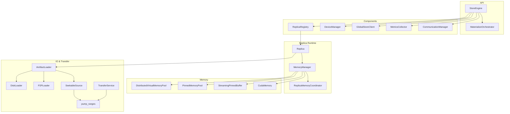
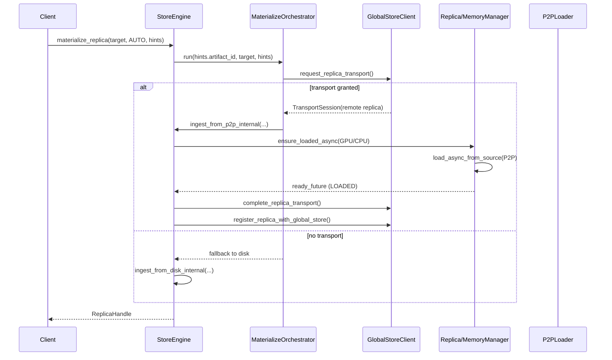
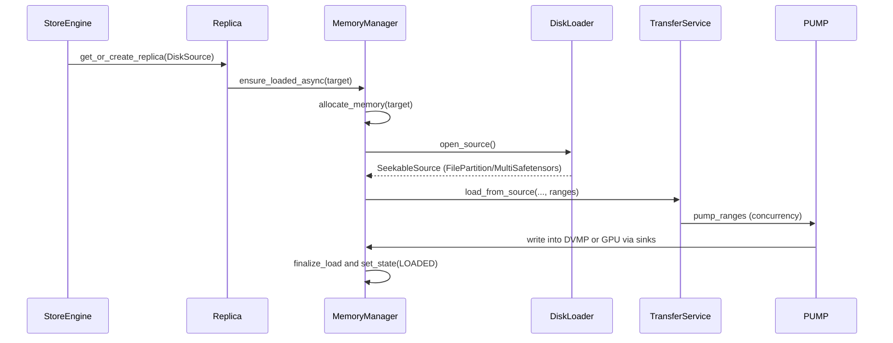
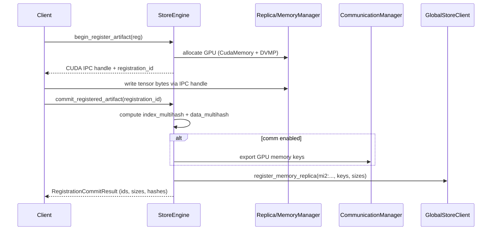
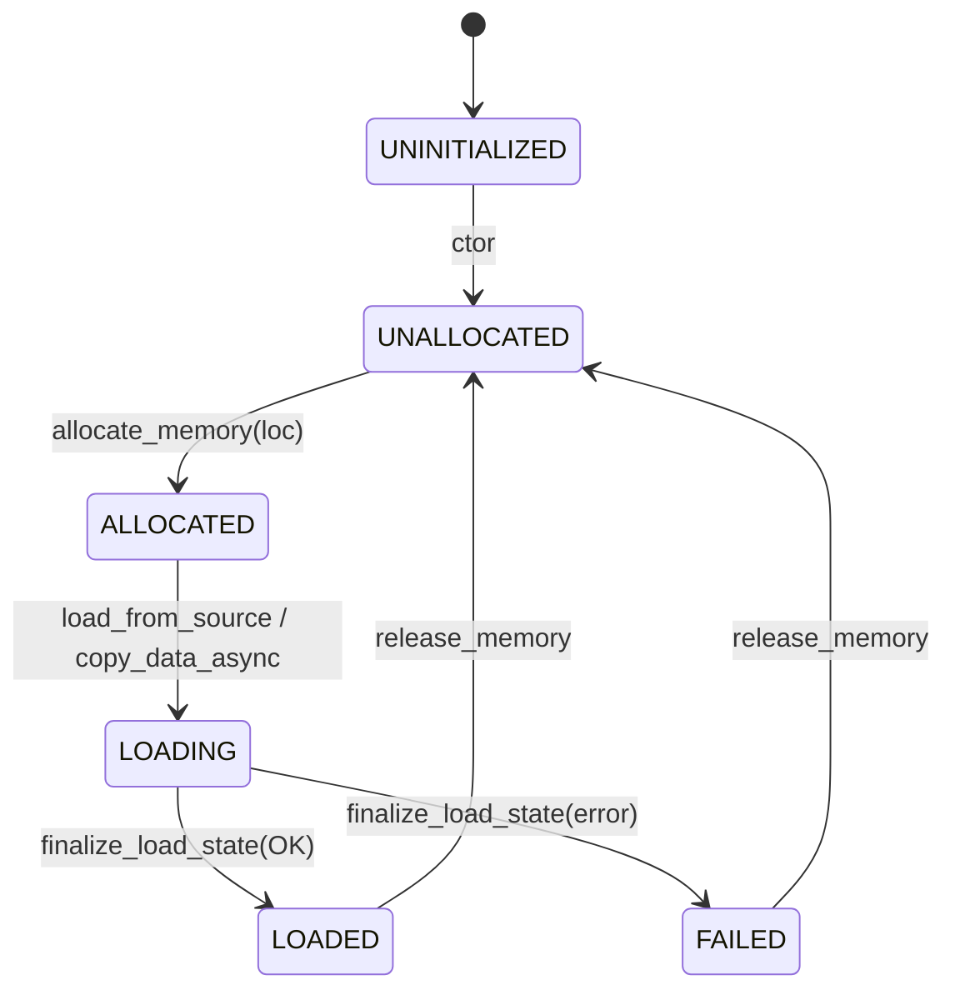
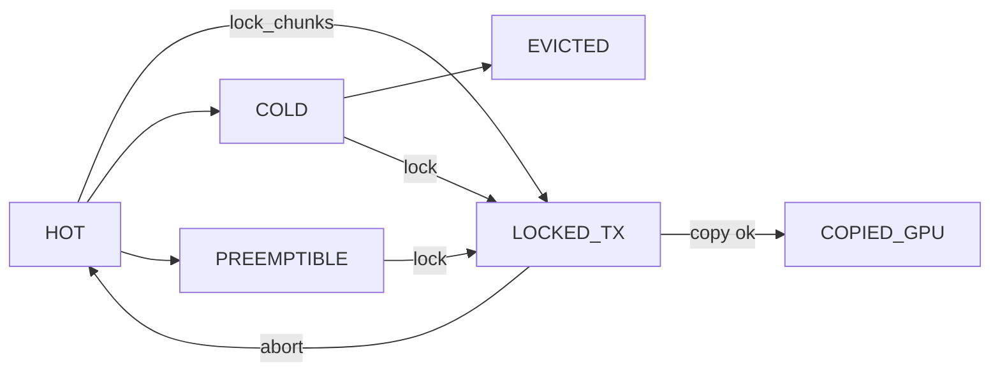
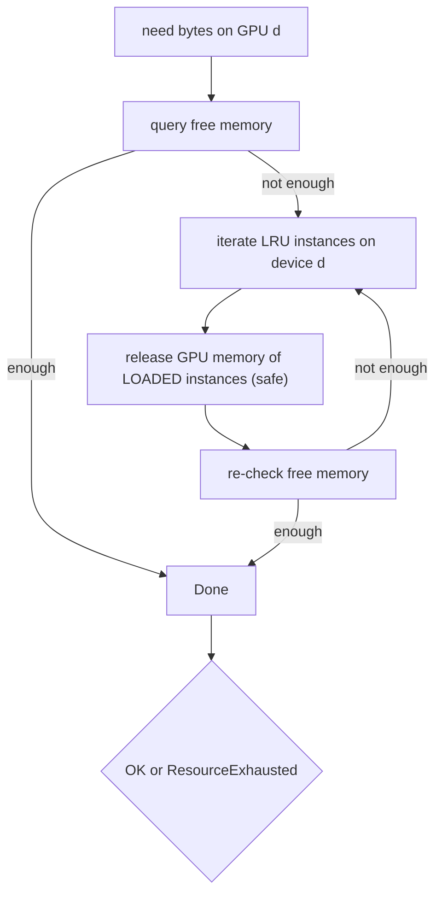

# Store Engine Internals (core/store)

This document explains the internal implementation of the C++ Store Engine based on the code in core/store. It focuses on:

- Public API surface and data contracts used by Python bindings and the Daemon
- Data flows for disk and P2P loading, and for in-memory registration
- Memory model (DVMP/UMA), state machines, and eviction
- Component responsibilities and how they collaborate

Key files:
- StoreEngine: core/store/store_engine.h, core/store/store_engine.cc
- Replica + MemoryManager: core/store/replica/*
- Loaders and pump: core/store/loader/*
- Components: core/store/components/*
- Types: core/store/loading/loading_spec.h, core/store/device_types.h, core/store/communication_types.h

## High-level Architecture



## Public API Surface (StoreEngine)

- Construction: `StoreEngine::StoreEngine(const StoreEngineOptions& opts)`
  - Configures `storage_path`, pinned pool size/chunk size, DVMP chunk size, and optional `CommunicationManager` and `GlobalStore` address.

- Materialization (multi-device):
  - `absl::StatusOr<loading::ReplicaHandle> materialize_replica(const DeviceKey&, MaterializeMode, const MaterializeHints&)`
  - Modes:
    - `AUTO`: Uses `MaterializeOrchestrator` to request a P2P transport from Global Store; falls back to disk when `hints.disk_path` is provided. For content-addressed IDs (`mi2:...`), disk fallback requires `hints.disk_path`.
    - `LOAD_ONLY`: Loads from disk only (rejects content-addressed IDs without `hints.disk_path`).
    - `COPY_ONLY`: GPU→GPU copy from an already-loaded GPU instance; requires `hints.artifact_id` and a GPU target.
  - Returns `ReplicaHandle { ReplicaKey, ready_future, cpu_state, gpu_state, gpu_base_ptr, cuda_ipc_handle }`.

  Note: In the key-based client flow (RFC‑0014), the Store Daemon is responsible for resolving the human key via Global Store and supplying `hints.artifact_id` and, when applicable, `hints.disk_path` (derived from key mapping). Clients do not pass `disk_path` directly; fallback is orchestrated entirely inside the daemon/engine.

- In-memory registration (RFC-0006/0007):
  - `begin_register_artifact(const ArtifactRegistration&) -> RegistrationBeginResult`
    - Allocates target GPU memory via a temporary `Replica` and returns a CUDA IPC handle so the caller can write directly.
  - `commit_registered_artifact(string_view registration_id) -> RegistrationCommitResult`
    - Computes `mi2:<index_multihash>:<data_multihash>` from GPU memory and optional canonical index bytes, optionally exports remote keys via communicator, and registers with Global Store.
  - `abort_registered_artifact(string_view registration_id)`

- Replica queries and management (ReplicaKey-centric):
  - `wait_replica_ready`, `unload_replica`, `get_replica_state`, `get_replica_gpu_ptr`, `get_replica_size`
  - `get_resident_devices(artifact_id)`, `list_device_replicas(DeviceKey)`

- Remote access and registration helpers:
  - `enable_remote_replica_access/disable_remote_replica_access`
  - `register_replica_with_global_store(ReplicaKey, artifact_id_override)`

- DVMP chunk API passthrough:
  - `lock_chunks(ReplicaKey, Span<uint32_t>)`, `unlock_chunks(ReplicaKey, Span<uint32_t>, bool copied_gpu)`

## Data Paths

### AUTO Materialize (P2P-first)



### Disk Loading



### In-memory Registration (Begin → Write → Commit)



## Memory Model and State Machines

Store Engine uses DVMP (DistributedVirtualMemoryPool) for contiguous per-replica CPU virtual address space and UMA (ReplicaMemoryCoordinator) for unified CPU/GPU chunk bookkeeping. MemoryManager orchestrates allocation, state transitions, and transfers.

### MemoryManager Location States



- CPU is represented as `common::memory::MemoryLocation::PAGEABLE_CPU`.
- GPU allocations are lazily created via UMA on first use; DVMP CPU region is reserved at construction.
- Transfers and loading are pipelined via `TransferService` and `pump_ranges`, using a per-session `StreamingPinnedBuffer` backed by the shared `PinnedMemoryPool`.

### Async Copy Manager Integration

- H2D/D2H transfers now submit via `AsyncCopyManager` (ACM), which wraps `cudaMemcpyAsync` with traced host callbacks.
- SPB slots are returned in the ACM completion callback; per-chunk `stream_synchronize` calls have been removed.
- For H2D, UMA state is advanced per DVMP-block after a single barrier on the device stream (temporary behavior; will move into ACM callbacks).
- ACM owns per-device non-blocking streams per direction (H2D/D2H/D2D) and routes all copies through them; external stream injection has been removed.

#### ACM Usage Quick Guide

- Submit one async copy per chunk via `AsyncCopyManager`, and return SPB slots inside the host callback. Do not `stream_synchronize()` per chunk.
- H2D example (return slot + optional UMA advancement in callback):
  ```cpp
  using common::AsyncCopyManager;
  common::HostRegion h{.base = host_ptr, .length = bytes, .pinned = true};
  common::DeviceRegion d{.device_id = device_id, .dev_ptr = dst_dev, .length = bytes};
  auto hdl_or = AsyncCopyManager::instance().submit_h2d(
      h, d, {.tracing_stage = "H2D/Copy",
             .callbacks = {.on_copy_done = [spb, slot_id, maybe_uma]() {
               (void)spb->return_chunk(slot_id);
               if (maybe_uma) maybe_uma();
             }}});
  RETURN_IF_ERROR(hdl_or.status());
  ```
- D2H example (stage into SPB, mark ready in callback for writer thread):
  ```cpp
  auto hdl_or = AsyncCopyManager::instance().submit_d2h(
      src_dev, dst_host, {.tracing_stage = "D2H/Copy",
                          .callbacks = {.on_copy_done = [spb, slot_id, gid, bytes]() {
                            (void)spb->mark_chunk_ready(slot_id, gid, bytes);
                          }}});
  ```
- Same-device D2D: use `submit_d2d` and wait on handles as needed. Cross-device D2D remains under `MemoryManager` (peer or staged fallback).
- Tests and CPU-only flows can use `submit_h2h` to exercise the async pump path without CUDA.

### Chunk States (DVMP/UMA)



- StoreEngine exposes `lock_chunks`/`unlock_chunks` which forward to DVMP for safe H2D/P2P transfers.
- UMA tracks per-chunk state for CPU and per-GPU VRAM, enabling partial loads and post-GPU policies (e.g., `mark_cpu_preemptible()`).

## Component Responsibilities

- StoreEngine
  - Coordinates materialization, memory registration and eviction
  - Owns `DeviceManager`, `ReplicaRegistry`, `MetricsCollector`, optional `GlobalStoreClient`, and optional `CommunicationManager`
  - Implements helpers for DVMP chunk locks, remote access registration, and Global Store registration

- Replica
  - Facade for a single instance bound to a specific `DeviceKey`
  - Provides `ensure_loaded_async`, `copy_from`, `release_memory`, verification, and remote access enable/disable

- MemoryManager
  - Manages CPU/GPU memory allocation and state; exposes pointers and CUDA IPC handle
  - Performs copy and load via `copy_data_async` and `load_async_from_source`
  - Uses UMA + DVMP for chunk metadata and virtual address ownership

- Loaders (`DiskLoader`, `P2PLoader`)
  - Abstracted via `IArtifactLoader` to produce a `SeekableSource`
  - P2P path muxes a remote source with an optional on-disk fallback (`MuxSeekableSource`)

- TransferService
  - Builds target sinks (GPU or DVMP region) and computes ranges from chunk indices
  - Enforces per-GPU concurrency (1 active session per GPU)
  - Streams data using a per-session `StreamingPinnedBuffer`

- ReplicaRegistry
  - Thread-safe multi-index: by-instance (`ReplicaKey`), by-artifact, by-device
  - LRU ordering feeds GPU eviction

- DeviceManager
  - GPU discovery, uuid↔ordinal mapping, per-device stream, and free/total memory metrics

- CommunicationManager
  - Wraps `CommunicateEngine`; registers memory for P2P and provides shared engine to loaders

## Content-Addressed Identity and Verification (RFC-0007)

During disk ingestion or commit of in-memory registration:
- `index_multihash` is derived from canonical index bytes (safetensors or tensor_index.json). When absent, it is computed.
- `data_multihash` is computed by linearizing the canonical SegmentPlan (PAD=0) over the loaded buffer. When canonical index bytes are available, hashing injects zeroes for PAD gaps to ensure RP‑A/B/C equivalence; otherwise it falls back to contiguous GPU hashing.
- For disk ingestion, missing descriptors are materialized under the artifact directory:
  - `artifact_descriptor.json` (index/data multihash, sizes)
  - `tensor_index.json` (canonical, when needed)
- In-memory commit returns `mi2:<index_multihash>:<data_multihash>` and optionally registers with Global Store.

## Memory Eviction (GPU)

When GPU allocation fails or during registration when memory is tight, StoreEngine executes an LRU-based, device-aware eviction:



Implementation: `try_evict_gpu_memory_impl()` in store_engine.cc. CPU DVMP memory is not freed here.

## Concurrency and Error Semantics

- MemoryManager uses a single `absl::Mutex` with per-location condition variables to gate state transitions.
- `ready_future` from `ReplicaHandle` resolves with the final `absl::Status` of the load/copy.
- Unsafe releases during LOADING mark the destination `FAILED` with last error preserved for diagnostics.
- TransferService limits one active transfer per GPU; disk read/write concurrency is configured via `MaterializeHints::pipeline_concurrency` (propagated to `pump_ranges`).

## Metrics

`MetricsCollector` gathers:
- Pinned pool utilization and CPU available bytes
- Replica counts and sizes
- GPU metrics (free/total) via `DeviceManager`
- Operation latencies (disk/P2P) and P2P byte counters

## Key Types and Contracts

- `DeviceKey` (core/store/device_types.h): logical device id `{type, ordinal, uuid}` used across APIs.
- `ReplicaKey` (core/store/loading/loading_spec.h): `{artifact_id, device, replica}` uniquely identifies an instance.
- `MemoryLocation` (core/common/memory/memory_location.h): `GPU`, `PAGEABLE_CPU`, `DISK`, `REMOTE`.
- `ReplicaHandle` (loading_spec.h): conveys instance key, states, CUDA IPC handle, and a `ready_future`.

## Test Coverage (selected)

- Disk → GPU: core/store/store_engine_test.cc
- P2P (TCP) → GPU with communicator: core/store/store_engine_p2p_loader_test.cc
- Streaming and sinks: core/store/loader/*_test.cc
- UMA/DVMP chunk semantics and locking: exercised through MemoryManager and loaders

## Notes and Limitations

- `InlineBufferSource` ingestion path is currently unimplemented for general loading; it is used internally for memory-only allocations (registration, COPY_ONLY source/dest creation).
- Content-addressed `mi2:...` artifact IDs require Global Store routing; disk fallback must specify `hints.disk_path`.
- Per-GPU transfer concurrency is limited to 1 active session by design to reduce VRAM fragmentation and pressure.

For broader architectural context, see docs/architecture.md and docs/state-management.md.
Note on verification: When the P2P source provides `verification_json` (e.g., via a sender daemon’s LockTransportChunks), `StoreEngine::ingest_from_p2p_internal()` parses it and performs fast KEY_POINTS verification of the loaded replica (CPU/GPU). Verification failure returns a DataLoss error and aborts materialization.
