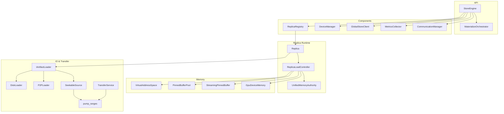
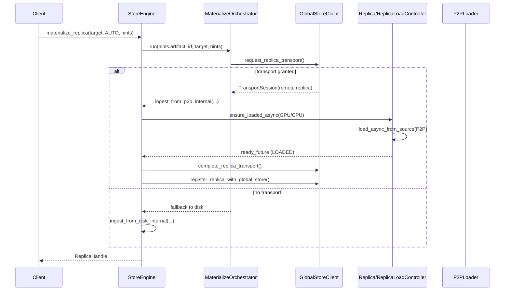
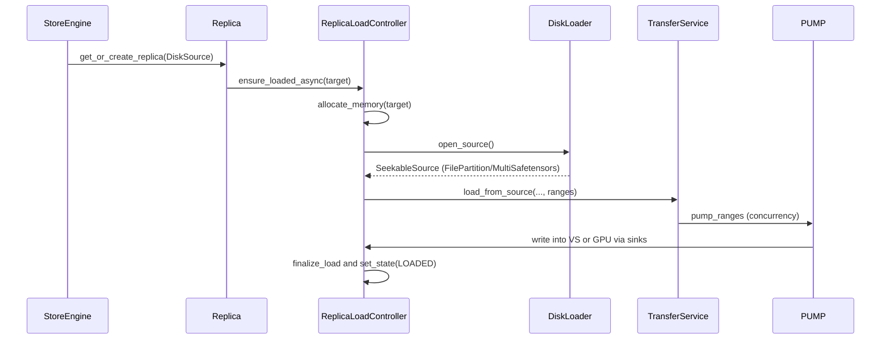
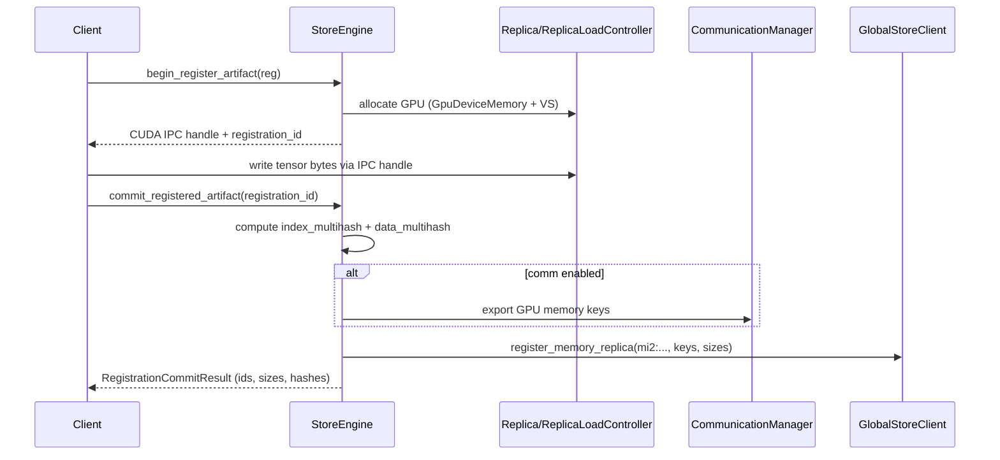
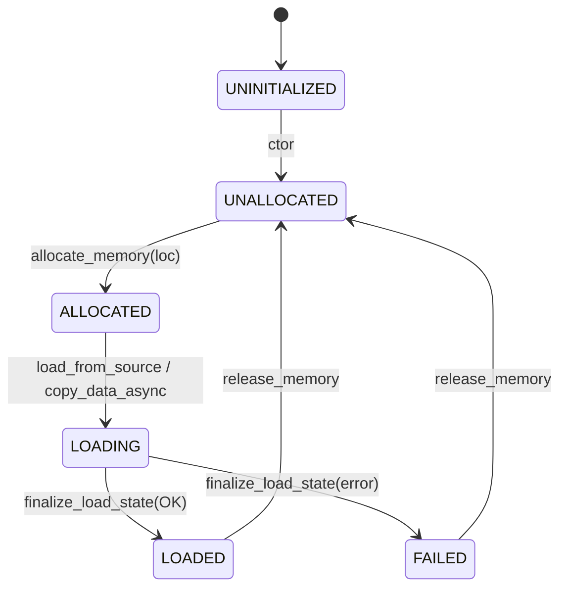
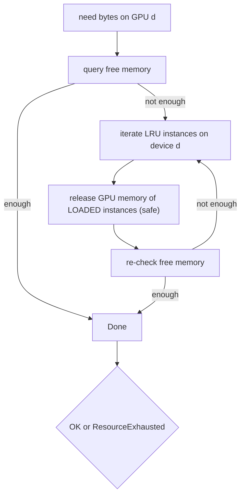

# Store Engine Internals (core/store)

This document explains the internal implementation of the C++ Store Engine based on the code in core/store. It focuses on:

- Public API surface and data contracts used by Python bindings and the Daemon
- Data flows for disk and P2P loading, and for in-memory registration
- Memory model (VS/UMA), state machines, and eviction
- Component responsibilities and how they collaborate

Key files:
- StoreEngine: core/store/store_engine.h, core/store/store_engine.cc
- Replica + ReplicaLoadController: core/store/replica/*
- Loaders and pump: core/store/loader/*
- Components: core/store/components/*
- Types: core/store/loading/loading_spec.h, core/store/device_types.h, core/store/communication_types.h

## High-level Architecture



## UMA V3 Cutover (aliases and flags)

- Final cutover (V3): alias headers removed; UnifiedMemoryAuthority/VirtualAddressSpace are the canonical names. Incremental rollout flags are removed; transactional Plan→Execute→Commit path and UMA-ledger authority are always enabled.
- Canonical Bazel targets: `//core/store/replica:unified_memory_authority`, `//core/common:virtual_address_space_lib`, and `//core/store/replica:memory_export_registry`.

### Release & Eviction (GPU)

- GPU unload path now explicitly informs UMA to drop per-device residency and optional allocation via `UnifiedMemoryAuthority::release_gpu_device(ReplicaKey, device_id, drop_allocation=true)`. This keeps the UMA ledger authoritative and ensures VRAM is actually reclaimed. Subsequent `plan_load(GPU)` will correctly compute missing chunks instead of returning an empty set.

## Public API Surface (StoreEngine)

- Construction: `StoreEngine::StoreEngine(const StoreEngineOptions& opts)`
  - Configures `storage_path`, pinned pool size/chunk size, VS chunk size, and optional `CommunicationManager` and `GlobalStore` address.

- Materialization (multi-device):
  - `absl::StatusOr<loading::ReplicaHandle> materialize_replica(const DeviceKey&, MaterializeMode, const MaterializeHints&)`
  - Modes:
    - `AUTO`: Uses `MaterializeOrchestrator` to request a P2P transport from Global Store. If `hints.disk_path` is populated it will fall back to disk; when `disk_path` is empty the orchestrator now returns the transport status directly (no implicit fallback).
    - `LOAD_ONLY`: Loads from disk only (rejects content-addressed IDs without `hints.disk_path`).
    - `COPY_ONLY`: GPU→GPU copy from an already-loaded GPU instance; requires `hints.artifact_id` and a GPU target.
  - Returns `ReplicaHandle { ReplicaKey, ready_future, cpu_state, gpu_state, gpu_base_ptr, cuda_ipc_handle }`.

  Note: In the key-based client flow (RFC‑0014), the Store Daemon is responsible for resolving the human key via Global Store and supplying `hints.artifact_id` and, when applicable, `hints.disk_path` (derived from key mapping). Clients do not pass `disk_path` directly; fallback is orchestrated entirely inside the daemon/engine.

- In-memory registration (RFC-0006/0007):
  - `begin_register_artifact(const ArtifactRegistration&) -> RegistrationBeginResult`
    - Allocates target GPU memory via a temporary `Replica` and returns a CUDA IPC handle so the caller can write directly.
  - `commit_registered_artifact(string_view registration_id) -> RegistrationCommitResult`
    - Computes `mi2:<index_multihash>:<data_multihash>` from GPU memory and optional canonical index bytes, optionally exports remote keys via communicator, and registers with Global Store.
  - `abort_registered_artifact(string_view registration_id)`

- Replica queries and management (ReplicaKey-centric):
  - `wait_replica_ready`, `unload_replica`, `get_replica_state`, `get_replica_gpu_ptr`, `get_replica_size`
  - `get_resident_devices(artifact_id)`, `list_device_replicas(DeviceKey)`
  - VS telemetry (read-only, non-authoritative): `get_chunk_states_telemetry(artifact_id)` returns VS `ChunkMeta.state`
  - UMA states (authoritative):
    - GPU: `get_chunk_states_for_device(artifact_id, device_id)`
    - CPU (artifact-level convenience): `get_chunk_states_cpu_uma(artifact_id)`
      - Selection rule when multiple replicas exist: prefer a CPU instance if present; otherwise choose the GPU instance with the smallest device ordinal.

- Remote access and registration helpers:
  - `enable_remote_replica_access/disable_remote_replica_access`
  - `register_replica_with_global_store(ReplicaKey, artifact_id_override)`

// VS lock APIs have been removed in UMA V3 final state.
// Use UMA plan/commit and VS pin_range for CPU residency leasing.

### Granularity and Invariants

- Canonical sizes:
  - Artifact chunk (layout/state): `artifact_chunk_bytes`
  - Transfer slice/window (pump, pinned blocks): `tx_slice_bytes`
  - Hash leaf (content-addressed leaf): `hash_leaf_bytes`
- Invariants enforced at startup:
  - `artifact_chunk_bytes % tx_slice_bytes == 0`
  - Pinned buffer pool slice size aligned to 512 B and page size
- Transfer ranges never cross artifact chunk boundaries; pump slices always align to `tx_slice_bytes`.

## Data Paths

### AUTO Materialize (P2P-first)



### Disk Loading



### In-memory Registration (Begin → Write → Commit)



## Memory Model and State Machines

Store Engine uses VS (VirtualAddressSpace) for contiguous per-replica CPU virtual address space and UMA (UnifiedMemoryAuthority) for unified CPU/GPU chunk bookkeeping. ReplicaLoadController orchestrates allocation, state transitions, and transfers.

### ReplicaLoadController Location States




- GPU allocations are lazily created via UMA on first use; VS CPU region is reserved at construction.
  - Transfers and loading are pipelined via `TransferService` and `pump_ranges`, using a per-session `StreamingPinnedBuffer` backed by the shared `PinnedBufferPool`.

### Async Copy Manager Integration

- H2D/D2H transfers submit via `AsyncCopyManager` (ACM), which wraps `cudaMemcpyAsync` with traced host callbacks and forwards completions onto a dedicated CPU worker to avoid making CUDA Runtime calls inside `cudaLaunchHostFunc`.
- StreamingPinnedBuffer slots stay owned by the pump consumer until ACM completion; the completion callback is the only place that returns slots, preventing early reuse while the GPU DMA is still active. Callers that need post-callback state (e.g., VS writes) must also block on the callback’s completion signal before reporting success.
- Use `StreamingChunkGuard` (from `core/common/memory/streaming_chunk_guard.h`) when staging chunks for AsyncCopyManager. The guard acquires slots, promotes them to consumer ownership, and guarantees cleanup if submission fails, so callers cannot forget the `promote_producer_slot_to_consumer` transition.
- For H2D, UMA state should advance from the completion callback (if the caller needs it) using the `absl::Status` argument as proof of success; per-chunk `stream_synchronize` remains unnecessary.
- ACM owns per-device non-blocking streams per direction (H2D/D2H/D2D) and routes all copies through them; external stream injection has been removed.

#### ACM Usage Quick Guide

- Submit one async copy per chunk via `AsyncCopyManager`, and return SPB slots (or wake dependents) inside the `on_copy_done` callback. Do not `cudaStreamSynchronize()` per chunk; the callback runs on a CPU worker after the CUDA stream callback fires. Pump consumers dealing with non-owning state (e.g., `pump_ranges`) instead poll handles and finalize completions inline so the callback does not outlive stack-owned context.
- H2D example (return slot + optional UMA advancement in callback):
  ```cpp
  using common::AsyncCopyManager;
  common::HostRegion h{.base = host_ptr, .length = bytes, .pinned = true};
  common::DeviceRegion d{.device_id = device_id, .dev_ptr = dst_dev, .length = bytes};
  auto hdl_or = AsyncCopyManager::instance().submit_h2d(
      h,
      d,
      {.tracing_stage = "H2D/Copy",
       .callbacks = {.on_copy_done = [spb, slot_id, maybe_uma](absl::Status st) {
         if (st.ok()) {
           (void)spb->return_chunk(slot_id);
           if (maybe_uma) {
             maybe_uma();
           }
         } else {
           LOG(ERROR) << "async copy failed, slot=" << slot_id << ": " << st;
         }
       }}} );
  RETURN_IF_ERROR(hdl_or.status());
  ```
- D2H example (stage into SPB, mark ready in callback for writer thread):
  ```cpp
  auto hdl_or = AsyncCopyManager::instance().submit_d2h(
      src_dev,
      dst_host,
      {.tracing_stage = "D2H/Copy",
       .callbacks = {.on_copy_done = [spb, slot_id, gid, bytes](absl::Status st) {
         if (!st.ok()) {
           LOG(ERROR) << "async copy failed, gid=" << gid << ": " << st;
           return;
         }
         (void)spb->mark_chunk_ready(slot_id, gid, bytes);
       }}} );
  ```
- Same-device D2D: use `submit_d2d` and wait on handles as needed. Cross-device D2D remains under `ReplicaLoadController` (peer or staged fallback).
- Tests and CPU-only flows can use `submit_h2h` to exercise the async pump path without CUDA; the copy is dispatched on ACM’s callback worker so CopyHandles complete asynchronously.

### Chunk States (UMA Authority)

UMA is the sole ledger for chunk residency and export flags. VS no longer performs
transfer locking; instead, it provides CPU pin leases via `pin_range()` and basic
IO helpers (`write_at`, `map_file_segments`).

## Component Responsibilities

- StoreEngine
  - Coordinates materialization, memory registration and eviction
  - Owns `DeviceManager`, `ReplicaRegistry`, `MetricsCollector`, optional `GlobalStoreClient`, and optional `CommunicationManager`
  - When Global Store is configured, store registrations now fail if the daemon cannot determine a routable (non-loopback) IP to advertise; operators must set `--advertise_host` or a non-loopback `listen_addr`
  - The `GlobalStoreClient` channel and stub are constructed once at engine bring-up; `initialize()` performs only the health-check handshake so retry/backoff state stays immutable at runtime
  - Implements helpers for VS chunk locks, remote access registration, and Global Store registration

- Replica
  - Facade for a single instance bound to a specific `DeviceKey`
  - Provides `ensure_loaded_async`, `copy_from`, `release_memory`, verification, and remote access enable/disable

- ReplicaLoadController
  - Manages CPU/GPU memory allocation and state; exposes pointers and CUDA IPC handle
  - Performs copy and load via `copy_data_async` and `load_async_from_source`
  - Uses UMA + VS for chunk metadata and virtual address ownership

- Loaders (`DiskLoader`, `P2PLoader`)
  - Abstracted via `IArtifactLoader` to produce a `SeekableSource`
  - P2P path muxes a remote source with an optional on-disk fallback (`MuxSeekableSource`)

- TransferService
  - Builds target sinks (GPU or VS region) and computes ranges from chunk indices
  - Enforces per-GPU concurrency (1 active session per GPU)
  - Streams data using a per-session `StreamingPinnedBuffer`

- ReplicaRegistry
  - Thread-safe multi-index: by-instance (`ReplicaKey`), by-artifact, by-device
  - LRU ordering feeds GPU eviction

- DeviceManager
  - GPU discovery, uuid↔ordinal mapping, per-device stream, and free/total memory metrics

- CommunicationManager
  - Wraps `Communicator`; registers memory for P2P and provides shared engine to loaders

## Content-Addressed Identity and Verification (RFC-0007)

During disk ingestion or commit of in-memory registration:
- `index_multihash` is derived from canonical index bytes (safetensors or tensor_index.json). When absent, it is computed.
- `data_multihash` is computed by linearizing the canonical SegmentPlan (PAD=0) over the loaded buffer. When canonical index bytes are available, hashing injects zeroes for PAD gaps to ensure RP‑A/B/C equivalence; otherwise it falls back to contiguous GPU hashing using the runtime-compiled NVRTC SHA256 kernel (with the old CPU streaming path as automatic fallback). The GPU lane now ingests 64-byte message blocks directly, auto-tunes leaf chunking down to 512 KiB to keep ≥4K leaves resident for large tensors, and returns digests via pinned host memory with async copies to overlap compute and transfer.
- For disk ingestion, missing descriptors are materialized under the artifact directory:
  - `artifact_descriptor.json` (index/data multihash, sizes)
  - `tensor_index.json` (canonical, when needed)
- In-memory commit returns `mi2:<index_multihash>:<data_multihash>` and optionally registers with Global Store.

## Memory Eviction (GPU)

When GPU allocation fails or during registration when memory is tight, StoreEngine executes an LRU-based, device-aware eviction:



Implementation: `try_evict_gpu_memory_impl()` in store_engine.cc. CPU VS memory is not freed here.

## Concurrency and Error Semantics

- ReplicaLoadController uses a single `absl::Mutex` with per-location condition variables to gate state transitions.
- `ready_future` from `ReplicaHandle` resolves with the final `absl::Status` of the load/copy.
- Unsafe releases during LOADING mark the destination `FAILED` with last error preserved for diagnostics.
- TransferService limits one active transfer per GPU; disk read/write concurrency is configured via `MaterializeHints::pipeline_concurrency` (propagated to `pump_ranges`).

## Metrics

`MetricsCollector` gathers:
- Pinned pool utilization and CPU available bytes
- Replica counts and sizes
- GPU metrics (free/total) via `DeviceManager`
- Operation latencies (disk/P2P) and P2P byte counters

## Key Types and Contracts

- `DeviceKey` (core/store/device_types.h): logical device id `{type, ordinal, uuid}` used across APIs.
- `ReplicaKey` (core/store/loading/loading_spec.h): `{artifact_id, device, replica}` uniquely identifies an instance.
- `MemoryLocation` (core/common/memory/memory_location.h): `GPU`, `CPU`, `DISK`, `REMOTE`.
- `ReplicaHandle` (loading_spec.h): conveys instance key, states, CUDA IPC handle, and a `ready_future`.

## Test Coverage (selected)

- Disk → GPU: core/store/store_engine_test.cc
- P2P (TCP) → GPU with communicator: core/store/store_engine_p2p_loader_test.cc
- Streaming and sinks: core/store/loader/*_test.cc
- UMA/VS chunk semantics and locking: exercised through ReplicaLoadController and loaders

## Notes and Limitations

- `InlineBufferSource` ingestion path is currently unimplemented for general loading; it is used internally for memory-only allocations (registration, COPY_ONLY source/dest creation).
- Content-addressed `mi2:...` artifact IDs require Global Store routing; disk fallback must specify `hints.disk_path`.
- Per-GPU transfer concurrency is limited to 1 active session by design to reduce VRAM fragmentation and pressure.

For broader architectural context, see docs/architecture.md and docs/state-management.md.
Note on verification: When the P2P source provides `verification_json` (e.g., via a sender daemon’s LockTransportChunks), `StoreEngine::ingest_from_p2p_internal()` parses it and performs fast KEY_POINTS verification of the loaded replica (CPU/GPU). Verification failure returns a DataLoss error and aborts materialization.
## Granularity Terminology and Invariants

- Artifact layout chunk: `artifact_chunk_bytes` (VS/UMA)
- Transfer slice/window: `tx_slice_bytes` (pinned buffer block)
- Invariant: `artifact_chunk_bytes % tx_slice_bytes == 0`
- Pinned pool block is aligned to 512 B and 4096 B (page) and validated at startup.

Defaults are defined in `core/common/const/granularity.h` and exposed to Python via the extension module.
