# Architecture Design

## System Architecture

The Core Store module adopts a layered architectural design with clear responsibility boundaries from external interfaces to low-level memory management. The architecture has evolved to support multi-device binding, a Virtual Address Space (VS), and unified type systems for replica sources and targets.

> Notes for readers:
> - In code, the CPU location is named `MemoryLocation::CPU` (file: `core/common/memory/memory_location.h`). There is no transitional alias in the current codebase; use `MemoryLocation::CPU` explicitly.

## Overall Architecture Diagram

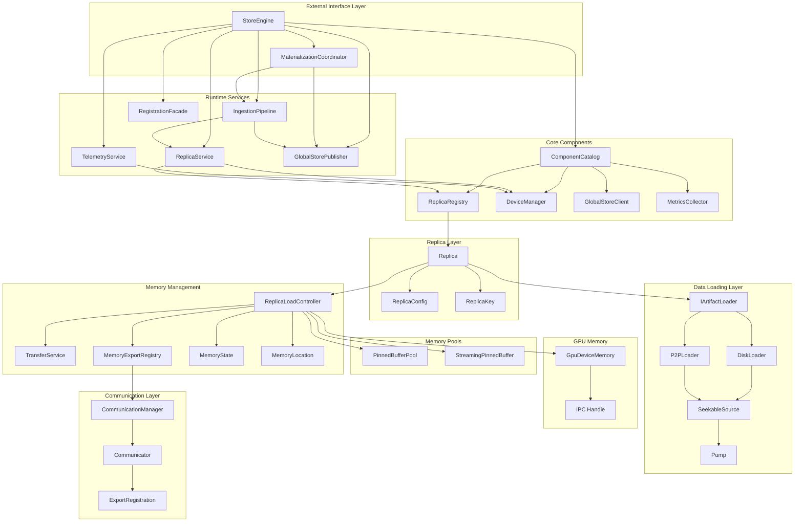

## StoreEngine Facade Refactor (Design 0028)

[Design 0028](../../docs/designs/0028-store-engine-facade-refactor.md) finalized the split of `StoreEngine` into a thin facade backed by runtime services. The refactor established the following enduring rules:

- `StoreEngine` now wires every collaborator one time during construction and simply forwards API calls, keeping orchestration logic centralized and testable.
- `ComponentCatalog` owns worker identity, UMA configuration, device bootstrap, and communicator wiring so that every downstream service reuses identical state.
- Disk, P2P, and inline-buffer loading flow through the same `IngestionPipeline` stages (SourceAdapter → Metadata → Allocation → Verification → Handle), which in turn emit structured events.
- Global Store publication, registration, and telemetry subscribe to those events, eliminating ad-hoc “remember to publish” hooks and making lifecycle side-effects deterministic.
- Legacy ingestion helpers, duplicated loader registries, and per-call dependency wiring were deleted; validation now lives in service-level suites that construct the catalog + pipeline stack directly.

## Runtime Facade & Services

`StoreEngine` now functions as a facade that delegates work to dedicated runtime services defined in `docs/designs/0028-store-engine-facade-refactor.md`. These services share infrastructure through `ComponentCatalog`, which centralizes device bootstrap, UMA configuration, communication wiring, and worker identity metadata.

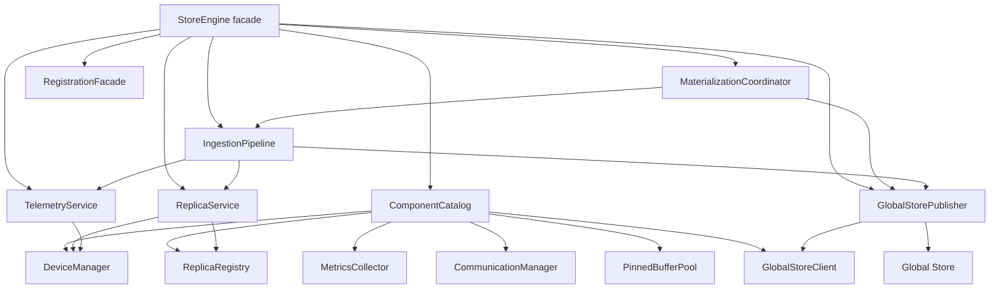

### Service responsibilities at a glance

| Service | Concise responsibilities |
| --- | --- |
| ComponentCatalog | Validates `StoreEngineOptions`, boots `DeviceManager`/`ReplicaRegistry`/`MetricsCollector`/`CommunicationManager`, manages worker identity, and shares pinned pools plus Global Store connectivity. |
| ReplicaService | Owns replica lifecycle (`get_or_create`, eviction retries, wait/unload helpers), exposes UMA-aware state snapshots, and emits load/unload events for telemetry and publishing. |
| IngestionPipeline | Normalizes sources, resolves metadata and view plans, allocates UMA-backed replicas, runs verification, constructs `ReplicaHandle`s, and produces ingestion result events reused by downstream services. |
| MaterializationCoordinator | Assembles `MaterializationService` and `MaterializeOrchestrator` with prebuilt deps so `materialize_replica` always picks AUTO policies without rebuilding lambdas per call. |
| GlobalStorePublisher | Handles all Global Store RPCs: worker/replica register/unregister, variant residency, key mapping CRUD, and ingestion success publication using worker identity from the catalog. |
| RegistrationFacade | Provides the GPU-first registration workflow (begin/ingest/commit/abort/keep-alive) and bridges CUDA IPC exports plus UMA allocations back into Global Store metadata. |
| TelemetryService | Supplies read-only replica/device snapshots, keeps metrics synchronized with ingestion events, and exposes status APIs for daemon consumers. |

### ComponentCatalog
- **Sources**: `core/store/components/runtime/component_catalog.{h,cc}`
- Initializes and owns `DeviceManager`, `ReplicaRegistry`, `MetricsCollector`, `CommunicationManager`, `PinnedBufferPool`, the optional `IGlobalStoreClient`, and the shared `ViewHashComputer`.
- Validates `StoreEngineOptions`, tracks worker/node identity, and propagates endpoint updates to both the Global Store client and registration/materialization services.
- Provides typed getters so downstream services (ReplicaService, IngestionPipeline, TelemetryService) reuse the same pinned memory pools and communication handles. Lifecycle coverage lives in `core/store/components/runtime/runtime_services_test.cc`.

### ReplicaService
- **Sources**: `core/store/components/runtime/replica_service.{h,cc}`
- Encapsulates replica lifecycle management: `get_or_create_replica`, eviction retries, `wait_replica_ready`, `unload_replica`, chunk-state snapshots, and remote access toggles via `enable_remote_replica_access`.
- Delegates UMA coordination to `ReplicaRegistry` and device-awareness to `DeviceManager`, while emitting memory metrics through `MetricsCollector`.
- Acts as the allocation surface for the ingestion pipeline and powers status queries that TelemetryService and GlobalStorePublisher consume.

### IngestionPipeline
- **Sources**: `core/store/materialization/runtime/pipeline/ingestion_pipeline.{h,cc}` plus stages `source_adapter.{h,cc}`, `metadata_stage.{h,cc}`, `allocation_stage.{h,cc}`, `verification_stage.{h,cc}`, `handle_stage.{h,cc}`, and shared `ingestion_context.{h,cc}`.
- Provides a staged ingestion path for disk, inline-buffer, and P2P sources. `DiskSourceAdapter`/`P2PSourceAdapter` normalize inputs, `MetadataStage` resolves descriptors and view plans, `AllocationStage` acquires UMA-backed replicas through `ReplicaService`, `VerificationStage` runs dataplane hashing/verification, and `HandleStage` emits `loading::ReplicaHandle` instances with CUDA IPC metadata.
- Emits structured `IngestionResultEvent`s (`core/store/components/runtime/ingestion_events.h`), allowing TelemetryService and GlobalStorePublisher to react without ad-hoc glue. Regression coverage resides in `core/store/materialization/runtime/pipeline/tests/`.

### MaterializationCoordinator
- **Sources**: `core/store/materialization/control/materialization_coordinator.{h,cc}`, `materialization_service.{h,cc}`, `materialization_backend.h`
- Implements `MaterializationBackend` by wiring `MaterializationService` with pre-built `MaterializationDeps`. Coordinates AUTO strategy selection, reuse of resident replicas, disk and peer ingestion, and success publication via the Global Store publisher.
- Serves as the single delegate behind `StoreEngine::materialize_replica` and the view-ingestion helpers, removing the legacy per-call orchestrator wiring.

### MaterializationService & MaterializeOrchestrator
- **Sources**: `core/store/materialization/control/materialization_service.{h,cc}`, `materialize_orchestrator.{h,cc}`, `materialization_backend.h`, `materialization/contracts/materialization_request.h`, `materialization/control/replica_registration_helper.{h,cc}`
- `MaterializationService` evaluates a `MaterializationRequest` by trying resident reuse, peer copies, disk or P2P ingestion, and AUTO policies provided through `MaterializationDeps`. It owns the chunk-planning heuristics, pinned-memory budgets, and handle construction helpers referenced by StoreEngine, tests, and telemetry.
- `MaterializeOrchestrator` sits on top of a `MaterializationBackend` + `IGlobalStoreClient` pair to negotiate remote transports, fall back to disk, and register success with the Global Store when mode == `MaterializeMode::AUTO`.
- `ReplicaRegistrationHelper` encapsulates the per-replica bookkeeping (view hash computation, verification metadata, registration retries) so `MaterializationCoordinator` focuses on orchestration instead of persistence details.

### GlobalStorePublisher
- **Sources**: `core/store/components/runtime/global_store_publisher.{h,cc}`
- Owns every Global Store interaction: registering/unregistering replicas, emitting variant/registration metadata, and handling key-mapping CRUD (`resolve_key_mapping`, `upsert_key_mapping`, `revoke_key_mapping`).
- Subscribes to ingestion and registration events so artifacts are published exactly once and worker identity is applied consistently.

### TelemetryService
- **Sources**: `core/store/components/runtime/telemetry_service.{h,cc}`
- Provides read-only status APIs layered over ReplicaService and DeviceManager: replica listings, chunk-state snapshots, per-device memory metrics, and ingestion counters.
- Consumes `IngestionResultEvent`s to keep metrics synchronized without calling into StoreEngine internals.

### RegistrationFacade
- **Sources**: `core/store/components/registration/registration_facade.{h,cc}`
- Handles the GPU-first registration workflow exposed via `begin/commit/abort_registered_artifact`, TTL keep-alives, incremental view ingestion (`ingest_view_registration_chunk`), and CUDA IPC export tracking.
- Reuses ComponentCatalog resources (DeviceManager, ReplicaRegistry, pinned pools, CommunicationManager) and delegates metadata publication to GlobalStorePublisher, keeping the StoreEngine surface thin.

### DeviceManager
- **Sources**: `core/store/components/device_manager.{h,cc}`, `core/store/device_registry.{h,cc}`, `core/store/device_types.h`
- Discovers CUDA devices, binds UUIDs to logical `DeviceKey`s, provisions per-device streams/events, and tracks VRAM usage & health. Provides the authoritative mapping reused by ReplicaService, TelemetryService, RegistrationFacade, and eviction decisions.
- Surfaces device residency information (NUMA locality, peer access flags) so the ingestion pipeline and communicator can pick optimal transfer strategies.

### ReplicaRegistry
- **Sources**: `core/store/components/replica_registry.{h,cc}`
- Thread-safe index that stores every live `replica::Replica` plus metadata (chunk states, residency timestamps, verification state). Provides iteration helpers so ReplicaService, TelemetryService, EvictionService, and GlobalStorePublisher can reason about system state without duplicating locks.
- Implements the UMA-aware guard rails required by `ReplicaLoadController` (e.g., `with_replica`, `maybe_get_replica`, `for_each_replica_on_device`), ensuring consistent lifecycle transitions.

### MetricsCollector
- **Sources**: `core/store/components/metrics_collector.{h,cc}`
- Centralizes metric emission for UMA pool utilization, H2D/D2H throughput, ingestion counters, registration latency, and eviction totals (`tc_store_evictions_total`, `tc_ingest_seconds`, `tc_register_*` gauges).
- Provides lightweight helpers consumed by ReplicaService, TelemetryService, EvictionService, RegistrationFacade, and TransferService so that instrumentation stays out of hot paths.

### CommunicationManager
- **Sources**: `core/store/components/communication_manager.{h,cc}`, `core/communicator/engine/engine.h`, `tensorcast/communicator/v1/communicator_config.proto`
- Wraps the communicator engine initialization, RDMA enablement, and memory registration required for `RemoteKeySource` and GPU peer copies. Exposes typed `register_memory` helpers that bridge UMA allocations to communicator `ExportRegistration` records.
- Stores the listen port + config that GlobalStorePublisher advertises, keeping P2P setup consistent across ingestion, registration, and TelemetryService.

### GlobalStoreClient
- **Sources**: `core/store/components/global_store_client.{h,cc}`, `tensorcast/global_store/v1/*.proto`
- Implements the `IGlobalStoreClient` interface used throughout StoreEngine to register workers, send heartbeats, query remote replicas, persist chunk states, manage key mappings, and request remote transports.
- Provides retrying RPC helpers (`execute_rpc_with_retry`) plus typed structs such as `RemoteReplicaInfo`, `TransportSession`, `VariantViewUpdate`, all of which are consumed by `GlobalStorePublisher`, `MaterializeOrchestrator`, and `RegistrationFacade`.

### EvictionService
- **Sources**: `core/store/components/eviction_service.{h,cc}`
- Provides `evict_for_cpu` and `evict_for_gpu` utilities that consult ReplicaRegistry ordering, DeviceManager memory pressure, MetricsCollector counters, and the pinned buffer pool to free capacity before new allocations.
- Used by ReplicaService, RegistrationFacade, and MaterializationService as the single policy owner for both UMA eviction and GPU VRAM reclamation, ensuring consistent logging/metrics across all callers.

## Component Inventory (2025 Q4 Snapshot)

This section enumerates every module that currently participates in the StoreEngine runtime so documentation stays aligned with the codebase. Use it as a checklist when auditing dependencies or planning refactors.

### External Interfaces & Orchestration
- `StoreEngine` (`core/store/store_engine.{h,cc}`) — public API surface that forwards requests into runtime services while keeping UMA details hidden from callers.
- `StoreEngineOptions` (`core/store/store_engine_options.{h,cc}`) — configuration contract consumed by ComponentCatalog; covers memory pool sizing, communicator ports, Global Store endpoints, and feature toggles.
- `MaterializationCoordinator` (`core/store/materialization/control/materialization_coordinator.{h,cc}`) — bridges StoreEngine calls to `MaterializationService`, `MaterializeOrchestrator`, and the ingestion pipeline.
- `MaterializationService` + `MaterializationDeps` (`core/store/materialization/control/materialization_service.{h,cc}`) — encapsulate AUTO strategy execution, resident reuse, and handle construction.
- `MaterializeOrchestrator` & `MaterializationBackend` (`core/store/materialization/control/materialize_orchestrator.{h,cc}`, `materialization_backend.h`) — negotiate remote replica selection, disk fallback, and registration with the Global Store.
- `MaterializationRequest` contracts (`core/store/materialization/contracts/materialization_request.{h,cc}`, `loading_spec.h`) — typed payloads exchanged between StoreEngine, MaterializationService, and pipeline stages.
- `RegistrationFacade` & helpers (`core/store/components/registration/registration_facade.{h,cc}`, `core/store/materialization/control/replica_registration_helper.{h,cc}`) — manage begin/ingest/commit flows, CUDA IPC exports, and TTL keep-alives.
- `ViewUtils` (`core/store/view_utils.{h,cc}`) — shared helpers for variant/view key derivation used by MaterializationCoordinator and RegistrationFacade.

### Runtime Services & Shared Infrastructure
- `ComponentCatalog` (`core/store/components/runtime/component_catalog.{h,cc}`) — lifecycle manager for DeviceManager, ReplicaRegistry, MetricsCollector, CommunicationManager, pinned pools, WorkerIdentity, and Global Store connectivity.
- `ReplicaService` (`core/store/components/runtime/replica_service.{h,cc}`) — owns replica lifecycle APIs, eviction retries, and UMA-ready futures.
- `GlobalStorePublisher` (`core/store/components/runtime/global_store_publisher.{h,cc}`) — canonical publisher for replica metadata, variant residency, and key mappings.
- `TelemetryService` (`core/store/components/runtime/telemetry_service.{h,cc}`) — read-only snapshot service for daemon APIs and dashboards.
- `IngestionPipeline` (`core/store/materialization/runtime/pipeline/*.cc`) — staged ingestion execution shared by materialization, registration, and view loading.
- `IngestionEvents` (`core/store/components/runtime/ingestion_events.h`) — strongly typed event bus linking ingestion outcomes to telemetry and publisher consumers.
- `EvictionService` (`core/store/components/eviction_service.{h,cc}`) — central memory pressure policy for CPU pinned pools and GPU VRAM.
- `WorkerIdentity` (`core/store/components/worker_identity.h`) & `ViewHashComputer` (`core/store/materialization/common/view_hash_utils.{h,cc}`) — capture worker/node metadata and deterministic view hashes propagated across services.

### Device, Replica, and Metrics Components
- `DeviceManager` + `DeviceRegistry` (`core/store/components/device_manager.{h,cc}`, `core/store/device_registry.{h,cc}`, `core/store/device_types.h`) — GPU enumeration, UUID/ordinal mapping, stream provisioning, and peer-access wiring.
- `ReplicaRegistry` (`core/store/components/replica_registry.{h,cc}`) — thread-safe replica map with UMA state tracking and iteration helpers.
- `MetricsCollector` (`core/store/components/metrics_collector.{h,cc}`) — aggregate for UMA, ingestion, registration, and communicator metrics exposed to Prometheus.
- `PinnedBufferPool` & `StreamingPinnedBuffer` (`core/common/memory/pinned_buffer_pool.{h,cc}`, `core/common/memory/streaming_pinned_buffer.{h,cc}`) — UMA-owned pinned memory arenas reused across CPU loads and DMA staging.

### Materialization Pipeline & Data Plane
- Pipeline stages: `SourceAdapter`, `MetadataStage`, `AllocationStage`, `VerificationStage`, `HandleStage`, and shared `IngestionContext` (`core/store/materialization/runtime/pipeline/*.cc`) — normalize sources, fetch metadata, allocate UMA-backed replicas, verify hashes, and emit `loading::ReplicaHandle`s.
- Dataplane contracts: `IArtifactLoader`, `SeekableSource`, `BufferPool` (`core/store/materialization/dataplane/contracts/*.h`) — define streaming abstractions for pump orchestration.
- Loaders & sources: `DiskLoader`, `P2PLoader`, `RemoteKeySource`, `MuxSeekableSource`, `FilePartitionSource` (`core/store/materialization/dataplane/**/*.{h,cc}`) — provide disk, inline buffer, and remote key ingestion paths.
- Sinks & pump: `CpuVaSink`, `GpuMemorySink`, `pump.{h,cc}` — bridge SeekableSource streams into UMA or GPU memory while coordinating async copies.

### Planning, Metadata, and View Tooling
- `ChunkAwareLoadingStrategy` (`core/store/materialization/planning/chunk_aware_strategy.{h,cc}`) — computes per-replica load plans from UMA chunk states, peer availability, and disk fallbacks. Produces `LoadPlan`/`LoadOperation` graphs, selects optimal `P2PSource`s, and exposes progress callbacks consumed by MaterializationService.
- Metadata utilities (`core/store/materialization/dataplane/metadata/*.cc`) — `canonical_index`, `index_reader`, `disk_dir_hash`, `source_hash`, and `safetensors_util` cover RFC-0007 canonical index normalization, multi-file SAFETENSORS manifests, deterministic directory hashing, and verification payload assembly shared by ingestion and registration.
- View execution stack (`core/store/materialization/dataplane/view/{view_planner,view_plan_source,view_ingest_executor,view_transform_executor}.{h,cc}`) — plans variant/view selections, adapts canonical `SeekableSource`s into ordered view byte streams, ingests incremental registration chunks, and runs post-copy transforms (e.g., transpose) on CPU or GPU memory. RegistrationFacade’s `ingest_view_registration_chunk` and MaterializationPipeline both rely on these helpers for deterministic variant handling.

### Replica & Memory Management
- `Replica` & `ReplicaConfig` (`core/store/replica/replica.{h,cc}`) — encapsulate per-artifact state, loader selection, and load futures.
- `ReplicaLoadController` (`core/store/replica/replica_load_controller.{h,cc}`) — mediates UMA allocations, state machines, GPU allocation views, and IPC handle export.
- `TransferService` & helpers (`core/store/replica/transfer_service.{h,cc}`, `core/store/replica/transfer_helpers.{h,cc}`) — orchestrate disk/CPU/GPU/p2p transfers, async copy scheduling, and verification ordering.
- `MemoryExportRegistry` (`core/store/replica/memory_export_registry.h`) — central registry for CUDA IPC + RDMA exports consumed by RegistrationFacade and communicator clients.
- Low-level memory primitives: `virtual_address_space.{h,cc}`, `cuda_memory.{h,cc}`, `gpu_device_memory.{h,cc}`, `memory_state.h`, `memory_location.h` — underpin UMA V3 and GPU allocation lifecycles.

### Communication, Global Store, and Observability
- `CommunicationManager` (`core/store/components/communication_manager.{h,cc}`) — wraps the communicator engine, RDMA configuration, and memory registration.
- `GlobalStoreClient` (`core/store/components/global_store_client.{h,cc}`) — typed gRPC client that handles worker/replica registration, heartbeats, state sync, transport negotiation, and key mapping CRUD.
- `GlobalStorePublisher` & `RegistrationFacade` — publish lifecycle events and registration metadata consistently.
- `TensorCast/global_store` protos (`tensorcast/global_store/v1/*.proto`, `tensorcast/communicator/v1/*.proto`) — authoritative schema for the control plane and communicator configuration.
- Observability endpoints: `core/store/components/runtime/telemetry_service.{h,cc}`, `core/store/components/metrics_collector.{h,cc}`, and regression suites (`core/store/components/runtime/runtime_services_test.cc`, `core/store/materialization/runtime/pipeline/tests/*`) keep the facade verifiable.

## Layer Details

### 1. External Interface Layer

**StoreEngine** is the entry point of the entire system, providing:

- Replica registration and management via ReplicaRegistry
- GPU device management via DeviceManager
- Global resource coordination through GlobalStoreClient
- High-level API encapsulation with materialize_replica() method
- Metrics collection through MetricsCollector
- Typed configuration via `StoreEngineOptions` (`core/store/store_engine_options.{h,cc}`), which is validated and fanned out by ComponentCatalog during initialization.

- Source: `core/store/store_engine.h`, `core/store/store_engine.cc`

**MaterializationCoordinator** orchestrates the materialize_replica() API workflow via the shared runtime services:

- Selects resident replicas or AUTO strategies using `MaterializationService::Execute()`
- Delegates disk and P2P ingestion to `materialization::runtime::pipeline::IngestionPipeline`
- Publishes successful loads through `components::runtime::GlobalStorePublisher`
- Reuses worker identity and key-mapping helpers from ComponentCatalog
- Wraps `MaterializeOrchestrator`, `MaterializationBackend`, and `ReplicaRegistrationHelper` so AUTO mode can negotiate remote transports, disk fallback, and registration retries without re-entering StoreEngine.
- Consumes typed contracts from `materialization/contracts/materialization_request.h` to keep orchestration inputs explicit and testable.

- Source: `core/store/materialization/control/materialization_coordinator.{h,cc}`, `core/store/materialization/control/materialization_service.{h,cc}`

**RegistrationFacade** handles the GPU-first registration APIs exposed by StoreEngine:

- Allocates UMA-backed GPU buffers and returns CUDA IPC handles during `begin_register_artifact`
- Streams variant/view metadata via `ingest_view_registration_chunk`
- Commits registrations by exporting remote memory keys, publishing hashes, and delegating metadata persistence to `GlobalStorePublisher`

- Source: `core/store/components/registration/registration_facade.{h,cc}`, `core/store/components/runtime/global_store_publisher.{h,cc}`

```cpp
class StoreEngine {
public:
    // Multi-device binding API
    absl::StatusOr<ReplicaHandle> materialize_replica(
        std::string_view artifact_id,
        const DeviceKey& target_device,
        MaterializeMode mode = MaterializeMode::AUTO,
        const MaterializeHints& hints = {});

    // Instance-based management
    int wait_replica_ready(const ReplicaKey& key);
    int unload_replica(const ReplicaKey& key);

    // Note: VS lock APIs are removed in UMA V3; UMA is the sole ledger.
    // UMA legacy helpers lock_chunks_for_transfer/update_chunk_states have been removed;
    // use UMA plan_load(...), execute transfer, then commit()/abort().
};
```

- Definitions: `ReplicaKey`, `ReplicaHandle`, `MaterializeHints` in `core/store/materialization/contracts/loading_spec.h`
- Device key: `DeviceKey` in `core/store/device_types.h`

### 2. Replica Management Layer

**Replica** class encapsulates the complete lifecycle of a single replica instance bound to a specific device:

- Source: `core/store/replica/replica.{h,cc}`

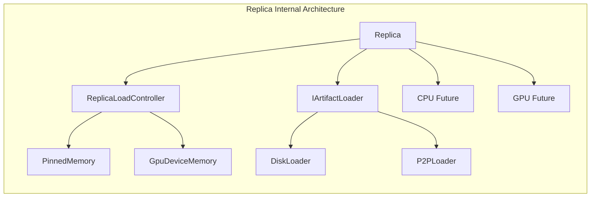

**Design Features**:
- Factory pattern with `Replica::create()` for instance creation
- Each Replica instance is uniquely identified by `ReplicaKey` (artifact_id + device + replica) — `core/store/materialization/contracts/loading_spec.h`
- Asynchronous operation management via `std::shared_future` — `Replica::ensure_loaded_async()` in `core/store/replica/replica.{h,cc}`
- Supports device copies via `Replica::copy_from()` and `ReplicaLoadController::copy_from_peer()` — `core/store/replica/replica.h`, `core/store/replica/replica_load_controller.h`
- Integrated replica verification — `core/common/artifact_verification.{h,cc}`, used by loaders and `Replica`

`ReplicaRegistry` (`core/store/components/replica_registry.{h,cc}`) is the authoritative container for those replicas and their UMA state, while `ReplicaService` (`core/store/components/runtime/replica_service.{h,cc}`) exposes thread-safe lifecycle helpers that rely on the registry. Capacity is enforced through `EvictionService` (`core/store/components/eviction_service.{h,cc}`), which frees CPU pinned memory or GPU VRAM before ReplicaLoadController allocates additional buffers.

### 3. Data Loading Layer

Adopts strategy pattern design with pump-based streaming architecture:

- Sources: `core/store/materialization/dataplane/contracts/loader.h`, `core/store/materialization/dataplane/loaders/disk_loader.{h,cc}`, `core/store/materialization/dataplane/loaders/p2p_loader.{h,cc}`
- Streaming: `core/store/materialization/dataplane/contracts/source.h`, `core/store/materialization/dataplane/runtime/pump.{h,cc}`, `core/store/materialization/dataplane/contracts/buffer_pool.h`
- Remote: `core/store/materialization/dataplane/sources/remote_key_source.{h,cc}`, `core/store/materialization/dataplane/sources/mux_seekable_source.{h,cc}`

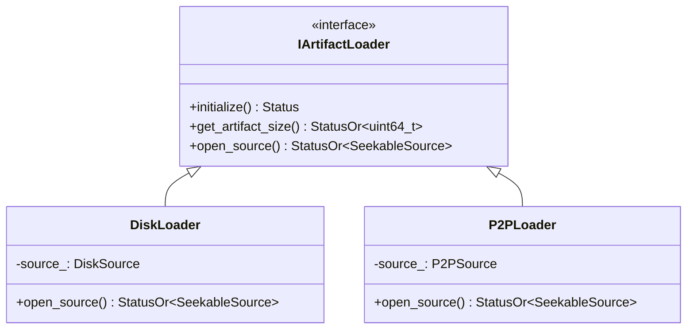

**DiskLoader Workflow**:
1. Scan partition files (`tensor.data`, `tensor.data_<n>`) — `core/store/materialization/dataplane/loaders/disk_loader.cc`
2. Create `FilePartitionSource` implementing `SeekableSource` — `core/store/materialization/dataplane/sources/file_partition_source.{h,cc}`
3. Return source handle for pump-based streaming — `DiskLoader::open_source()`
4. Actual loading handled by `ReplicaLoadController::load_async_from_source()` using `TransferService` + `pump_ranges()`
5. Data flows: FilePartitionSource → Pump → MemorySink (`CpuVaSink` for CPU or `GpuMemorySink` for GPU). For GPU targets, the pump detects sinks that implement `AsyncPositionedSink` and uses `AsyncCopyManager` to submit H2D copies. `TransferService` replays `AsyncCopyManager::synchronize_h2d_stream()` followed by `cuda::device_synchronize()` before returning to ensure the GPU buffer is fully materialised prior to verification and metadata persistence.

**P2PLoader Workflow**:
1. Validate `P2PSource` configuration (IP, port, memory keys) — `core/store/materialization/dataplane/loaders/p2p_loader.{h,cc}`
2. Create `RemoteKeySource` that wraps remote memory via `Communicator` — `core/store/materialization/dataplane/sources/remote_key_source.{h,cc}`
3. Optional disk fallback via `MuxSeekableSource` — `core/store/materialization/dataplane/sources/mux_seekable_source.{h,cc}`
4. Uses the same `load_async_from_source()` path to target CPU (CPU, previously CPU) or GPU
5. Optional checksum or direct-write support depends on communicator — see `RemoteKeySource::supports_direct_write()`

### 4. Memory Management Layer

**ReplicaLoadController** manages memory for a single replica instance at both CPU (CPU, previously CPU) and GPU locations, integrating with VS for pageable CPU memory:

- Source: `core/store/replica/replica_load_controller.{h,cc}`
- UMA (Unified Memory): `core/store/replica/unified_memory_authority.{h,cc}`
- Transfers: `core/store/replica/transfer_service.{h,cc}`, `core/store/replica/transfer_helpers.{h,cc}`
- States: `core/store/replica/memory_state.h`, Locations: `core/common/memory/memory_location.h`
- GPU unloads are strictly state-protected: if the target is in `LOADING`, `release_memory()` immediately returns `FailedPrecondition`. Callers must wait for completion (typically via `wait_for_state(..., LOADED)`). This prevents concurrent unloads from tearing down VRAM before the replica has finished loading.
- When accessing a GPU buffer, use `ReplicaLoadController::get_gpu_allocation_view()` to obtain both the base address and the UMA-owned `std::shared_ptr<GpuDeviceMemory>` in one call, ensuring the GPU allocation is not released prematurely during subsequent validation or hashing.

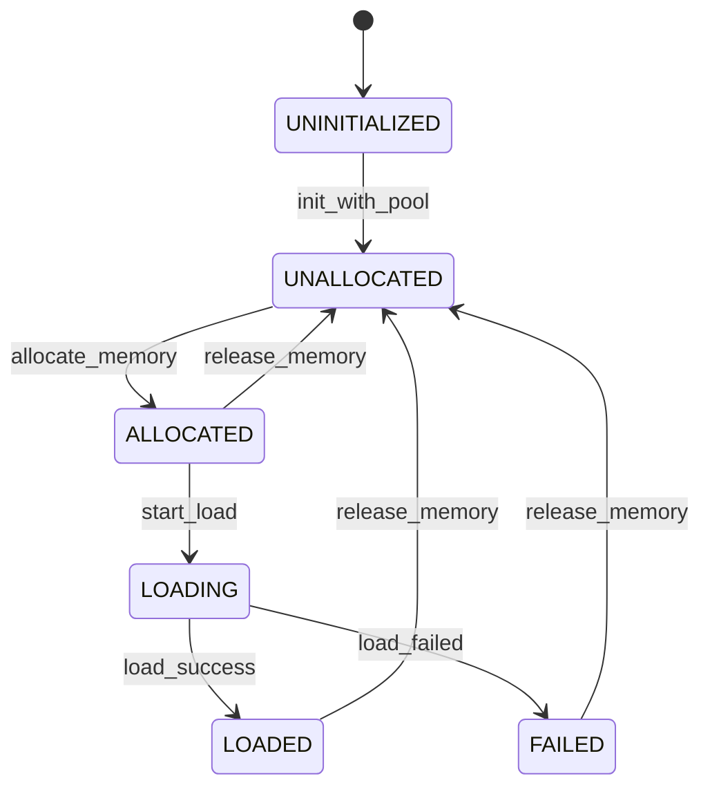

**Memory Transfer Support**:
- CPU (CPU) ↔ GPU: Asynchronous copy via dedicated CUDA stream — `ReplicaLoadController::copy_data_async()`
- DISK → CPU/GPU: Pump-based streaming via `load_async_from_source()` and `TransferService::load_from_source()`
- REMOTE → CPU/GPU: Same pump-based streaming using `RemoteKeySource` and `CpuVaSink`/`GpuMemorySink`
- GPU ↔ GPU: Direct peer copy via `ReplicaLoadController::copy_from_peer()`

### 5. Memory Implementation Layer

The memory implementation layer provides the low-level memory management and data transfer mechanisms:

- CPU Memory: `core/common/memory/pinned_buffer_pool.h`, `core/common/memory/pinned_buffer_pool.cc`, `core/common/memory/streaming_pinned_buffer.{h,cc}`, orchestrated via `core/store/replica/unified_memory_authority.{h,cc}`
- GPU Memory: `core/common/memory/cuda_memory.{h,cc}`
- Sinks/Sources: `core/store/materialization/dataplane/sinks/cpu_va_sink.{h,cc}`, `core/store/materialization/dataplane/sinks/gpu_memory_sink.{h,cc}`
- Pump: `core/store/materialization/dataplane/runtime/pump.{h,cc}` (`pump_ranges`), `core/store/materialization/dataplane/contracts/buffer_pool.h`

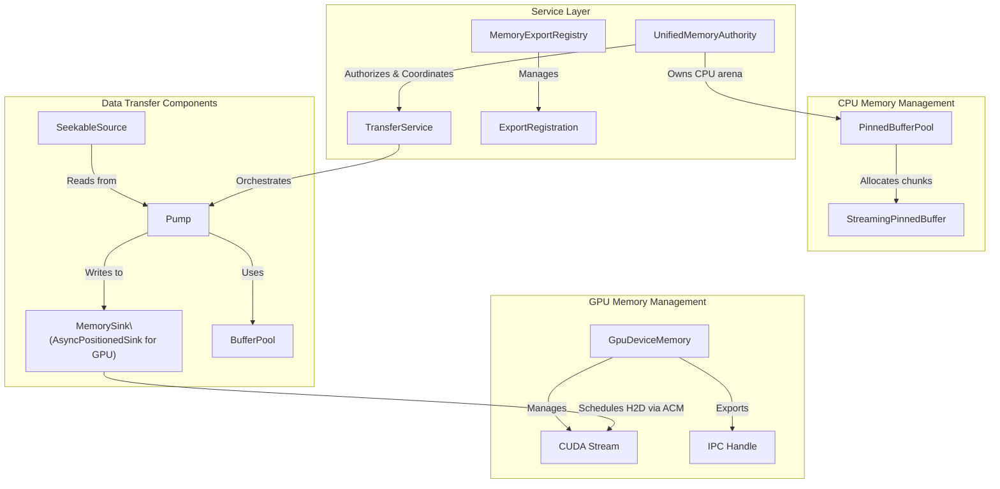

**GPU Memory Features**:
- CUDA allocation and stream management — `core/common/memory/cuda_memory.{h,cc}`
- Cross-process memory sharing via `ReplicaLoadController::get_ipc_handle()` — `core/store/replica/replica_load_controller.h`
- Device-bound memory management (via `ReplicaKey`) — `core/store/materialization/contracts/loading_spec.h`

## Memory Transfer Mechanism

### Disk to CPU Loading Mechanism

Updated to reflect `TransferService` + `pump_ranges` orchestration:

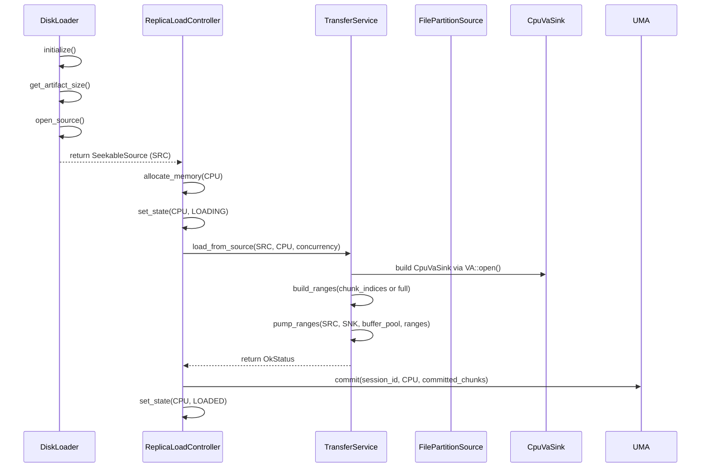

- Source: `ReplicaLoadController::load_async_from_source()` and `TransferService::load_from_source()`

### CPU to GPU Transfer Mechanism

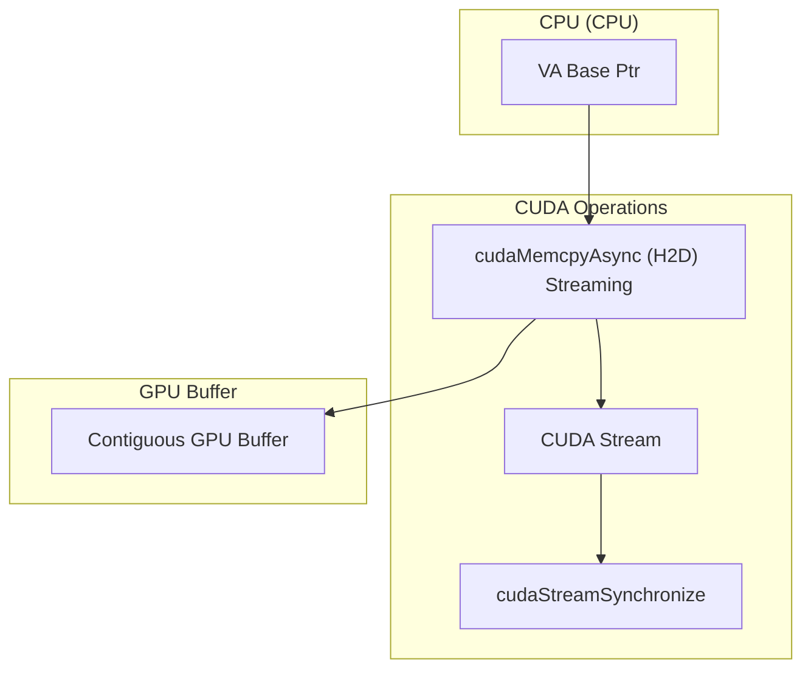

- Source: `TransferService::copy_cpu_to_gpu_streaming()`

### GPU to CPU Transfer Mechanism

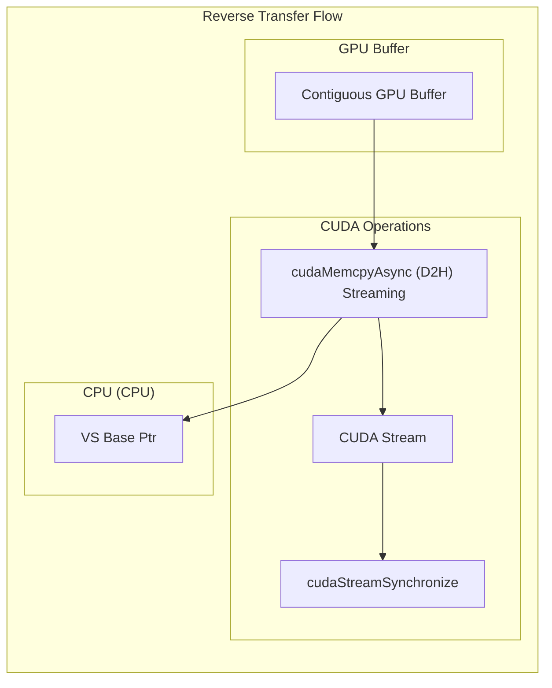

- Source: `TransferService::copy_gpu_to_cpu_streaming()`

### P2P Transfer Support

P2P transfer strategies based on memory layouts, via `RemoteKeySource` + `pump_ranges` and appropriate sinks:

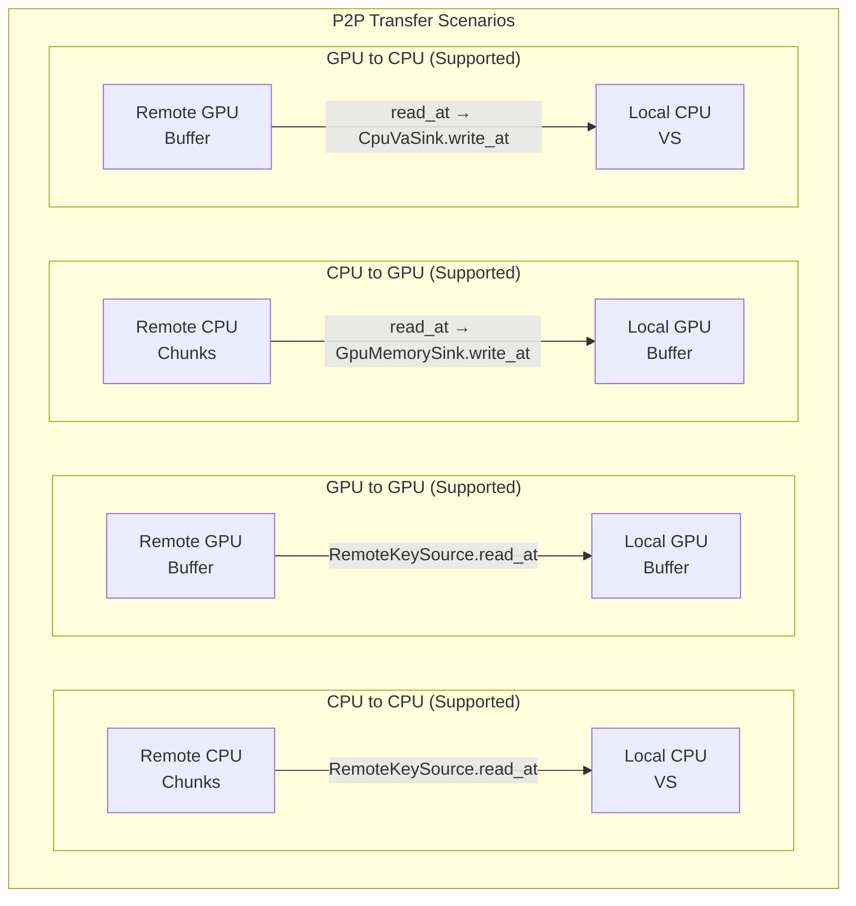

- Sources: `core/store/materialization/dataplane/sources/remote_key_source.{h,cc}`, `core/store/materialization/dataplane/sinks/gpu_memory_sink.{h,cc}`, `core/store/materialization/dataplane/sinks/cpu_va_sink.{h,cc}`, `core/store/materialization/dataplane/runtime/pump.{h,cc}`

### Transfer Failure Handling

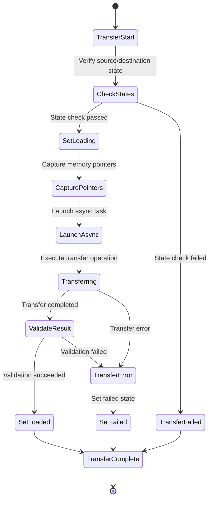

- Sources: `core/store/replica/replica_load_controller.{h,cc}` (`set_state`, `finalize_load`, error paths)

## Core Interaction Flows

### New Unified Loading Flow with materialize_replica() API

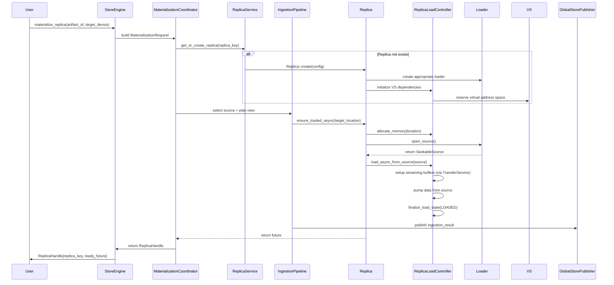

- Sources: `core/store/store_engine.{h,cc}`, `core/store/materialization/control/materialization_coordinator.{h,cc}`, `core/store/materialization/runtime/pipeline/ingestion_pipeline.{h,cc}`, `core/store/components/runtime/replica_service.{h,cc}`, `core/store/components/runtime/global_store_publisher.{h,cc}`, `core/store/replica/replica.{h,cc}`, `core/store/replica/replica_load_controller.{h,cc}`

### P2P Loading Flow with Communicator

P2P transfers leverage the `Communicator` for remote memory access with `RemoteKeySource`:

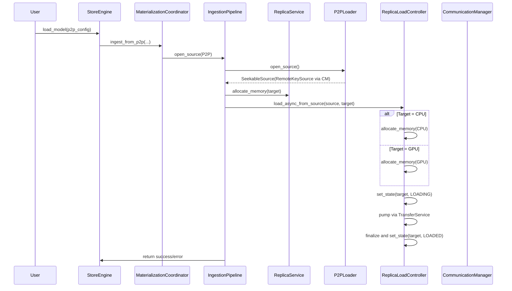

- Sources: `core/store/materialization/control/materialization_coordinator.{h,cc}`, `core/store/materialization/runtime/pipeline/ingestion_pipeline.{h,cc}`, `core/store/materialization/dataplane/loaders/p2p_loader.{h,cc}`, `core/store/materialization/dataplane/sources/remote_key_source.{h,cc}`, `core/store/components/communication_manager.{h,cc}`, `core/store/replica/replica_load_controller.{h,cc}`

### IPC Memory Sharing Flow

GPU memory can be shared between processes through IPC handles:

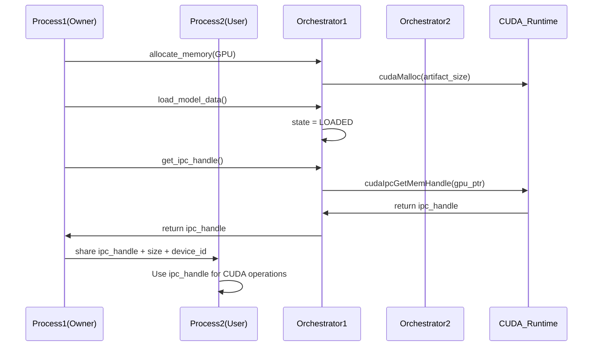

- Source: `core/store/replica/replica_load_controller.h` (`get_ipc_handle()`)

## Performance Optimization

### 1. Concurrency Strategy
- Multi-threaded parallel disk reading (via `pump_ranges` concurrency)
- CPU-GPU transfer pipeline
- Overlapped execution of async operations

### 2. Memory Optimization
- Pre-allocated memory pools
- CUDA pinned memory improves transfer speed
- Zero-copy IPC sharing

### 3. Caching Strategy
- VS-assisted CPU eviction policies (UMA-owned policy; VS issues advisories)
- Intelligent location selection based on device capabilities
- Locality-aware data access with NUMA optimization
- Chunk locking mechanism to prevent eviction during transfers

## Observability (UMA V3 additions)

- Export path: `tc_ex_registrations_total{location}` and `tc_ex_keepalive_gauge` report P2P export activity and UMA‑owned CPU VS export leases.
- UMA VA pin leases: `tc_va_pin_leases_total{reason}` increments when UMA obtains VS leases (e.g., reason="Export").
- GPU copy scheduler: `tc_tx_inflight_copies_gauge{gpu}` reflects per‑GPU in‑flight copy slots held by the scheduler gate.

## Security Considerations

### 1. Memory Safety
- Smart pointers prevent memory leaks
- Boundary checks avoid out-of-bounds access
- CUDA error checking

### 2. Thread Safety
- Fine-grained lock design
- Lock-free data structures
- Condition variable synchronization

### 3. Resource Isolation
- Memory isolation between processes
- Exclusive access to GPU devices
- Secure management of network resources

## Extension Points

The system is designed with multiple extension points to support future requirements:

1. **New Loader Types**: Implement `IArtifactLoader` interface and provide `SeekableSource`
2. **New Source Types**: Add variants to `ArtifactSource` (e.g., S3Source, AzureBlobSource)
3. **New Memory Types**: Extend `ReplicaLoadController` and `MemoryLocation` enum
4. **New Transfer Protocols**: Extend `Communicator` implementations
5. **New Verification Methods**: Extend `ArtifactVerificationInfo` framework
6. **Custom Device Types**: Extend `DeviceKey` and device registry

## Key Implementation Details

### Multi-Device Binding
- Each replica instance is uniquely identified by `ReplicaKey` (artifact_id + device + replica) — `core/store/materialization/contracts/loading_spec.h`
- Supports multiple replicas of the same replica on different devices
- Device abstraction via `DeviceKey` for stable device references — `core/store/device_types.h`

### Virtual Address Space (VS)
- System-wide virtual address space management — `core/common/memory/virtual_address_space.{h,cc}`
- Chunk-based virtual layout with lazy physical page binding; telemetry only (non‑authoritative)
- Provides pin leases to protect ranges during transfers (no explicit lock/unlock APIs)
- Enables efficient memory sharing across processes (stable VA + CUDA IPC)

### Unified Type System
- `ArtifactSource` / `ArtifactTarget` / `MaterializeHints` — `core/store/materialization/contracts/loading_spec.h`
- `ReplicaHandle`: returned from loading operations with instance info — `core/store/materialization/contracts/loading_spec.h`

### Shared Type & Contract Modules
- Device and memory descriptors (`core/store/device_types.h`, `core/store/memory_types.h`) define `DeviceKey`, residency enums, and helper predicates that keep ComponentCatalog, ReplicaService, and TelemetryService aligned on addressing semantics.
- Communication contracts in `core/store/communication_types.h` expose `ExportRegistration` and `P2PSource` structures consumed by `CommunicationManager`, `RemoteKeySource`, and `RegistrationFacade` when exporting UMA allocations or requesting remote transfers.
- Runtime replica surfaces (`core/store/components/runtime/replica_info.h`) give TelemetryService and daemon APIs a stable snapshot schema (artifact id, byte sizes, residency, timestamps, communicator status) without reaching into Replica internals.
- Direct write entitlements (`core/store/replica/types/direct_write_grant.h`) describe UMA-backed VA windows (`VaRange` + `DirectWriteGrant`) shared with dataplane sinks so peer writers can stream into CPU VA safely while keepalive handles guard the underlying leases.

### Service Architecture
- **ComponentCatalog**: Runtime registry that wires `DeviceManager`, `ReplicaRegistry`, `MetricsCollector`, `CommunicationManager`, `PinnedBufferPool`, `IGlobalStoreClient`, and worker identity — `core/store/components/runtime/component_catalog.{h,cc}`
- **ReplicaService**: Centralizes replica lifecycle management, eviction retries, chunk-state snapshots, and remote-access toggles — `core/store/components/runtime/replica_service.{h,cc}`
- **IngestionPipeline**: Shared staged ingestion (SourceAdapter, Metadata, Allocation, Verification, Handle) for disk and P2P sources — `core/store/materialization/runtime/pipeline/*.cc`
- **MaterializationCoordinator**: Wraps `MaterializationService` and dispatches to the pipeline plus Global Store publisher — `core/store/materialization/control/materialization_coordinator.{h,cc}`
- **GlobalStorePublisher**: Publishes replica metadata and key mappings, and handles registration keep-alives — `core/store/components/runtime/global_store_publisher.{h,cc}`
- **RegistrationFacade**: GPU registration lifecycle and CUDA IPC export management — `core/store/components/registration/registration_facade.{h,cc}`
- **TelemetryService**: Provides read-only status APIs backed by ReplicaService and ingestion events — `core/store/components/runtime/telemetry_service.{h,cc}`
- **TransferService**: Manages data transfers between locations — `core/store/replica/transfer_service.{h,cc}`
- **MemoryExportRegistry**: Handles P2P memory registration/export — `core/store/replica/memory_export_registry.h`
- **MetricsCollector**: Tracks performance and resource usage — `core/store/components/metrics_collector.{h,cc}`
- **Verification Metadata Coordination**: `core/store/materialization/dataplane/verification/verification_utils.{h,cc}` provides the per-artifact `VerificationMetadataGuard`, in-process metadata cache, atomic write helper (`open` → `write` → `fsync` → `rename` + directory sync), and structured logging hooks (`verification_metadata_write_{succeeded,failed}`). `core/store/replica/transfer_service.cc` synchronises the per-device H2D stream via `AsyncCopyManager::synchronize_h2d_stream()` followed by `cuda::device_synchronize()` so verification always runs on fully materialised GPU buffers. Regression coverage lives in `core/store/materialization/dataplane/verification/tests:verification_utils_test` and `core/store:multi_gpu_verification_race_test`.

## Related Guides

- **Device Registry**: Learn how GPUs are mapped to logical `DeviceKey`s in the [Device Registry guide](./device-registry.md).
- **Communicator Internals**: See communication engine details in `../communicator/README.md`.
- **StoreEngine API**: High-level usage patterns are documented in `../checkpoint/README.md`.
- **DeviceManager** — runtime GPU enumeration and streams ([Device Manager](./device-manager.md))
