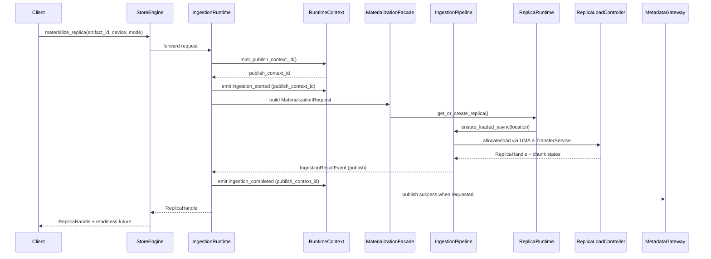
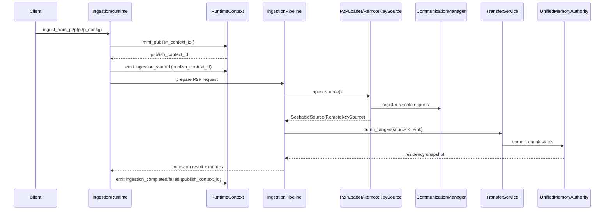

# Architecture Design

## Overview
TensorCast StoreEngine is a UMA-driven artifact runtime that materializes, registers, and exports replicas across CPU and GPU devices. Each worker daemon embeds a StoreEngine facade that orchestrates replica lifecycle, ingestion, registration, and metadata publication without exposing UMA internals to callers.

The goal of this document is to capture the November 2025 implementation snapshot, highlight how responsibilities are split, and provide a concise index of every module that participates in the StoreEngine runtime.

## Layered Topology

```mermaid
graph TB
    subgraph "Interface"
        SE[StoreEngine facade]
    end
    subgraph "Runtime Services"
        RE[RuntimeEnv]
        IR[IngestionRuntime]
        RR[ReplicaRuntime]
        MG[MetadataGateway]
        EH[RuntimeContext events]
    end
    subgraph "Shared Infrastructure"
        CC[RuntimeContext]
        DM[DeviceManager]
        REG[ReplicaRegistry]
        MC[MetricsCollector]
        COMM[CommunicationManager]
        PB[PinnedBufferPool]
        GSC[GlobalStoreClient]
        VHC[ViewHashComputer]
    end
    subgraph "Materialization & Registration"
        MF[MaterializationFacade]
        IP[IngestionPipeline]
        RB[RegistrationBackend]
        MG[MetadataGateway]
        MZ[MaterializationService]
        MO[MaterializeOrchestrator]
    end
    subgraph "Replica & Memory"
        RLC[ReplicaLoadController]
        UMA[UnifiedMemoryAuthority]
        MER[MemoryExportRegistry]
        TS[TransferService]
    end
    subgraph "Data Plane"
        DL[DiskLoader]
        PL[P2PLoader]
        RKS[RemoteKeySource]
        Pump[Pump]
        Sink[Cpu/Gpu Sinks]
    end
    SE --> RE
    RE --> IR
    RE --> RR
    RE --> MG
    RE --> EH
    RE --> CC
    CC --> DM
    CC --> REG
    CC --> MC
    CC --> COMM
    CC --> PB
    CC --> GSC
    CC --> VHC
    IR --> MF
    MF --> IP
    MF --> MG
    IR --> RF
    MF --> MZ
    MZ --> IP
    MF --> MO
    MO --> MG
    IP --> RR
    RR --> RLC
    RLC --> UMA
    RLC --> TS
    RLC --> MER
    IP --> DL
    IP --> PL
    PL --> RKS
    DL --> Pump
    RKS --> Pump
    Pump --> Sink
    MG --> GSC
    MG --> EH
    EH --> RR
    EH --> IR
    EH --> MG
```

The facade wires each collaborator once during construction, then forwards API calls so runtime services share identical catalog state, UMA pools, and telemetry.

## Runtime Facade & Shared Services

StoreEngine owns only construction-time wiring. Runtime services expose narrow, testable APIs and share infrastructure through `RuntimeContext`. The following matrix summarizes the key services.

| Service | Sources | What it owns | Shared dependencies |
| --- | --- | --- | --- |
| StoreEngine | `core/store/store_engine.{h,cc}` | Validates `StoreEngineOptions`, wires runtime services exactly once, forwards all public APIs. | `RuntimeEnv`, `IngestionRuntime`, `ReplicaRuntime`, `metadata::MetadataGateway` |
| RuntimeEnv | `core/store/runtime/runtime_env.{h,cc}` | Boots/shuts `RuntimeContext`, stores worker identity, and forwards event publishers/subscriptions to runtimes. | `RuntimeContext` |
| RuntimeContext | `core/store/runtime/context/runtime_context.{h,cc}` | Constructs `DeviceManager`, `ReplicaRegistry`, `MetricsCollector`, `CommunicationManager`, `PinnedBufferPool`, `IGlobalStoreClient`, `ViewHashComputer`, propagates worker identity, and embeds the event dispatcher. | `StoreEngineOptions`, `WorkerIdentity` |
| RuntimeContextEvents | `core/store/runtime/context/runtime_context_events.{h,cc}`, `core/store/runtime/ingestion_events.h` | Folly MPMC queue with publisher/subscription handles for ingestion, registration, and key-mapping events; runtimes register callbacks at boot and the dispatcher drains before shutdown. | Self-contained dispatcher |
| ReplicaRuntime | `core/store/runtime/replica/replica_runtime.{h,cc}` | Replica lifecycle (get/create, wait, eviction retries, unload), UMA-aware telemetry, remote access toggles, and publishes `replica_loaded`/`replica_evicted`/`remote_access_toggled` events for other runtimes. | `ReplicaRegistry`, `DeviceManager`, `MetricsCollector` |
| IngestionRuntime | `core/store/runtime/ingestion/ingestion_runtime.{h,cc}` | Routes disk/P2P/materialize flows exclusively through `MaterializationFacade`, hands off publish-context bookkeeping, and exposes `IngestionRuntimeDependencies` so tests can swap facade hooks without touching production wiring. Completion still notifies `ReplicaRuntime` and `MetadataGateway` through the shared `MaterializationFacade`. | `RuntimeContext`, `ReplicaRuntime`, `ingestion::MaterializationFacade`, `metadata::MetadataGateway` |
| MaterializationFacade | `core/store/runtime/ingestion/materialization_facade.{h,cc}` | Owns planner orchestration, wires `IngestionPipeline`, `MaterializationService`, and `MaterializeOrchestrator`, publishes ingestion events, records publish contexts, and brokers `MetadataGateway` registrations. Implements `MaterializationBackend` so AUTO flows share the same disk/P2P primitives. | `MaterializationService`, `MaterializationBackend`, `MaterializeOrchestrator`, `MetadataGateway`, `RuntimeContextEvents` |
| MaterializationService & MaterializationDeps | `core/store/runtime/ingestion/materialization_service.{h,cc}` | Resident reuse, chunk planning, pinned-memory budgeting, handle construction helpers reused across runtime services. | `ReplicaRuntime`, `ChunkAwareLoadingStrategy`, `TransferService`, `PinnedBufferPool` |
| MaterializeOrchestrator & MaterializationBackend | `core/store/materialization/control/materialize_orchestrator.{h,cc}`, `core/store/materialization/control/materialization_backend.h` | Negotiates remote transports, disk fallback, registration publication, and `MaterializeMode::AUTO` policies. | `metadata::MetadataGateway`, `IGlobalStoreClient`, `CommunicationManager` |
| RegistrationBackend | `core/store/runtime/metadata/registration_backend.{h,cc}`, `core/store/materialization/control/replica_registration_helper.{h,cc}` | GPU-first begin/commit/abort/keep-alive APIs, CUDA IPC export, verification metadata, TTL refresh helpers, emits registration events via MetadataGateway. | `DeviceManager`, `ReplicaRegistry`, `PinnedBufferPool`, `MemoryExportRegistry`, `RegistrationPublisher` |
| MetadataGateway | `core/store/runtime/metadata/metadata_gateway.{h,cc}` | All Global Store RPCs, worker registration, key-mapping CRUD, direct ingestion callbacks for Global Store publication, registration event fan-out, and UMA metric refresh for commit/abort. | `core/store/components/global_store_client.{h,cc}`, `RuntimeContext`, `WorkerIdentity`, `RegistrationBackend`, `ReplicaRuntime` |

### Testing & Overrides

`IngestionRuntime::Config` carries a shared `IngestionRuntimeDependencies` bundle (`core/store/runtime/ingestion/ingestion_runtime.h`) so unit tests can exercise the full ingestion stack without wiring an entire `StoreEngine`.

- **MaterializationHooks** — Tests populate `MaterializationHooks` (`core/store/runtime/ingestion/materialization_facade.h`) to inject fake pipelines (e.g. `core/store/runtime/ingestion/testing/fake_ingestion_pipeline.h`), intercept `register_replica_with_global_store`, or install structured callbacks such as `before_pipeline_start`, `mutate_completion_event`, and `override_result`.
- **Event hub** — `IngestionEventHub` (`core/store/runtime/ingestion/ingestion_event_hub.{h,cc}`) wraps `RuntimeContextEvents` with typed ingestion channels so ReplicaRuntime, MetadataGateway, and observability subscribers receive identical started/completed notifications. Tests subscribe directly to the hub (see `core/store/runtime/ingestion/testing/scoped_ingestion_runtime_test_harness.h`) to capture ordered events.
- **Harness utilities** — `core/store/runtime/ingestion/testing/scoped_ingestion_runtime_test_harness.h` spins up `RuntimeEnv`, `ReplicaRuntime`, and `metadata::MetadataGateway`, then hands back a ready-to-use `IngestionRuntime::Config` so tests can instantiate an `IngestionRuntime` with custom dependencies.

## Materialization & Registration Flow

Materialization uses a staged ingestion pipeline, orchestrated by `MaterializationFacade`, to normalize sources, verify data, and publish success. Registration piggybacks on the same events so metadata is published exactly once.

### Materialization Stack (API + Orchestrators)

| Component | Sources | Description |
| --- | --- | --- |
| IngestionPipeline | `core/store/materialization/runtime/pipeline/ingestion_pipeline.{h,cc}` | Stage-based ingestion reused for disk, inline-buffer, and P2P sources; produces `IngestionResultEvent`s that are forwarded through the `IngestionEventHub` rather than calling other runtime services directly. |
| Contracts | `core/store/materialization/contracts/materialization_request.{h,cc}`, `loading_spec.h` | Typed payloads for StoreEngine APIs, replica keys, device hints, and returned `loading::ReplicaHandle`s. |
| MaterializationDeps | `core/store/runtime/ingestion/materialization_service.{h,cc}` | Dependency bundle containing `ReplicaRuntime`, pinned pools, planner heuristics, and verification helpers. |
| ReplicaRegistrationHelper | `core/store/materialization/control/replica_registration_helper.{h,cc}` | Encapsulates view hash calculation, verification metadata writes, and registration retries. |
| View tooling | `core/store/view_utils.{h,cc}`, `core/store/materialization/common/view_hash_utils.{h,cc}` | Deterministic variant/view identifiers shared between ingestion and registration. |
| View execution | `core/store/materialization/dataplane/view/{view_planner,view_plan_source,view_ingest_executor,view_transform_executor}.{h,cc}` | Plan and stream incremental view chunks for registration keep-alive APIs. |

### Ingestion Pipeline Stages

| Stage | Sources | Responsibilities |
| --- | --- | --- |
| SourceAdapter | `source_adapter.{h,cc}` | Normalizes `DiskSource` and `P2PSource`, validates manifests, prepares `IngestionContext`. |
| MetadataStage | `metadata_stage.{h,cc}` | Resolves canonical index JSON, view plans, verification payloads. |
| AllocationStage | `allocation_stage.{h,cc}` | Negotiates UMA reservations via `ReplicaRuntime`, triggers evictions through `EvictionService`, captures staging buffers. |
| VerificationStage | `verification_stage.{h,cc}` | Streams data through dataplane hashing, compares against `ArtifactVerificationInfo`. |
| HandleStage | `handle_stage.{h,cc}` | Builds `loading::ReplicaHandle`, IPC metadata, publishes success/failure events. |
| Shared context | `ingestion_context.{h,cc}` | Thread-safe exchange object that stages share for options, buffers, and result metadata. |

### Data Plane & Loaders

- Loaders implement `IArtifactLoader` (`core/store/materialization/dataplane/contracts/loader.h`) with concrete `DiskLoader` and `P2PLoader` (`dataplane/loaders/*.cc`) plus dispatcher utilities.
- Sources conform to `SeekableSource` (`dataplane/contracts/source.h`) via helpers such as `FilePartitionSource`, `RemoteKeySource`, and `MuxSeekableSource`.
- Streaming is orchestrated by `pump_ranges()` (`dataplane/runtime/pump.{h,cc}`) atop buffer abstractions (`dataplane/contracts/buffer_pool.h`).
- Sinks include `CpuVaSink` and `GpuMemorySink` (`dataplane/sinks/*.cc`), both of which integrate with `AsyncCopyManager` for overlapped H2D copies.
- Metadata helpers (`dataplane/metadata/*.cc`) cover canonical index normalization, multi-file manifests, deterministic directory hashing, and verification payload management.

### Registration & Metadata Publication

- `RegistrationBackend` exposes begin/ingest/commit/abort/keep-alive APIs and bridges UMA allocations back to metadata via `MetadataGateway`.
- `MetadataGateway` calls into `IGlobalStoreClient` to register workers, replicas, and variant views, and consumes RuntimeContext notifications for automatic publication.
- `CommunicationManager` (`core/store/components/communication_manager.{h,cc}`) registers UMA allocations with the communicator engine and supplies remote key metadata to `RemoteKeySource`.
- Protos under `tensorcast/global_store/v1/*.proto` and `tensorcast/communicator/v1/communicator_config.proto` define the control-plane and communicator contracts consumed by both C++ and Python services.

#### MetadataGateway Behavior

- `core/store/runtime/metadata/metadata_gateway.{h,cc}` now receives ingestion completions directly from the pipeline, so successful loads immediately invoke `register_replica()` when `publish_to_global_store` is set without waiting on RuntimeContext events.
- Publish dedupe relies on a bounded map of `PublishContextRecord`s (1 024 entries, 10-minute TTL) keyed by `publish_context_id`, preventing duplicate publishes when both ingestion events and explicit APIs fire for the same replica key.
- `set_client_override()` plus `refresh_override_endpoint()` let integration tests supply stubbed `IGlobalStoreClient` implementations while still reusing worker identity data propagated through `RuntimeContext`.
- Registration lifecycle APIs (`begin_registration`, `commit_registration`, `abort_registration`, `keep_alive_registration`, `ingest_view_chunk`) are delegated to `RegistrationBackend`; results are re-published onto `RuntimeContextEvents` so other runtimes can observe commits/aborts without calling Global Store directly.

## Replica, Memory, and Device Management

UMA V3 keeps a single ledger for CPU virtual address space, GPU memory, and CUDA IPC exports. Replica lifecycle helpers wrap UMA so higher layers reason about handles instead of raw buffers.

### Memory & Replica Components

| Component | Sources | Description |
| --- | --- | --- |
| Replica | `core/store/replica/replica.{h,cc}` | Owns loader selection, async futures, remote access toggles, and per-location states. |
| ReplicaLoadController | `core/store/replica/replica_load_controller.{h,cc}` | State machine for CPU/GPU locations; allocate/load/release, pump data, export memory handles. |
| UnifiedMemoryAuthority | `core/store/replica/unified_memory_authority.{h,cc}`, `core/common/memory/virtual_address_space.{h,cc}` | Ledger for UMA chunks, VA leases, plan/commit/abort flows, and GPU allocation reuse. |
| TransferService & helpers | `core/store/replica/transfer_service.{h,cc}`, `transfer_helpers.{h,cc}` | Streams data from loaders to UMA via `pump_ranges`, manages async copy scheduling, enforces synchronization. |
| MemoryExportRegistry | `core/store/replica/memory_export_registry.h` | Tracks CUDA IPC/RDMA exports, coalesces chunk ranges, and maintains telemetry for remote access. |
| PinnedBufferPool | `core/common/memory/pinned_buffer_pool.{h,cc}` | Supplies aligned pinned memory and reports availability to ReplicaRuntime & TransferService. |
| StreamingPinnedBuffer | `core/common/memory/streaming_pinned_buffer.{h,cc}` | Ring buffer abstraction for overlapped disk/transfer workloads. |
| GpuDeviceMemory | `core/common/memory/gpu_device_memory.{h,cc}` | RAII wrapper for CUDA allocations; exposes device id, IPC handle export, and keep-alive semantics. |
| VirtualAddressSpace | `core/common/memory/virtual_address_space.{h,cc}` | Stable VA ranges shared across replicas, supports direct-write entitlements for P2P writers. |
| EvictionService | `core/store/components/eviction_service.{h,cc}` | Policy owner for UMA and GPU memory reclamation invoked by ReplicaRuntime, RegistrationBackend, and MaterializationService. |

### Device & Telemetry Components

- `DeviceManager`, `DeviceRegistry`, and `core/store/device_types.h` map GPU UUIDs to `DeviceKey`s, manage CUDA streams/events, and capture residency metadata.
- `ReplicaRegistry` (`core/store/components/replica_registry.{h,cc}`) is the authoritative container for live replicas and UMA state snapshots.
- `MetricsCollector` (`core/store/components/metrics_collector.{h,cc}`) publishes UMA pool utilization, transfer throughput, ingestion counters, and registration latency (`tc_store_*`, `tc_ingest_*`, `tc_register_*`).
- `WorkerIdentity` (`core/store/components/worker_identity.h`) plus `ViewHashComputer` keep worker metadata and deterministic hashes synced through the catalog.
- `Runtime replica info` (`core/store/runtime/replica/replica_info.h`) and `direct_write_grant` (`core/store/replica/types/direct_write_grant.h`) provide typed snapshots and CPU VA grant contracts for clients.

## Component Inventory (2025 Q4)

| Category | Modules | Notes |
| --- | --- | --- |
| External Interfaces & Config | `core/store/store_engine.{h,cc}`, `core/store/store_engine_options.{h,cc}`, `daemon/` Store daemon targets, `tensorcast/global_store/` Python control plane | Public API surface, configuration validation, and out-of-process control plane. |
| Runtime & Coordination | `core/store/runtime/{runtime_env,replica/replica_runtime,metadata/metadata_gateway}.cc`, `core/store/runtime/ingestion/{ingestion_runtime,materialization_coordinator,materialization_service}.cc`, `core/store/runtime/context/{runtime_context,runtime_context_events}.cc`, `core/store/runtime/runtime_services_test.cc` | Runtime orchestration, worker identity, ingestion/registration fan-out, regression coverage. |
| Materialization & Contracts | `core/store/runtime/ingestion/{ingestion_runtime,materialization_coordinator,materialization_service}.cc`, `core/store/materialization/control/{materialization_backend,materialize_orchestrator,replica_registration_helper}.cc`, `core/store/materialization/contracts/{materialization_request,loading_spec}.h`, `core/store/view_utils.{h,cc}` | Materialize API surface, runtime orchestration, strategy selection, registration helpers, and typed contracts. |
| Pipeline & Data Plane | `core/store/materialization/runtime/pipeline/*`, `core/store/materialization/dataplane/{contracts,loaders,sources,sinks,metadata,view}`, `core/store/materialization/dataplane/runtime/pump.{h,cc}` | Source normalization, staged ingestion, streaming pump, verification metadata, view execution. |
| Replica & Memory | `core/store/replica/{replica,replica_load_controller,transfer_service,transfer_helpers,unified_memory_authority,memory_export_registry}.cc`, `core/common/memory/{pinned_buffer_pool,streaming_pinned_buffer,gpu_device_memory,virtual_address_space}.cc`, `core/store/components/eviction_service.{h,cc}` | UMA ledger, transfers, IPC exports, pinned memory pools, eviction policy. |
| Device & Metrics | `core/store/components/{device_manager,replica_registry,metrics_collector,worker_identity}.cc`, `core/store/device_registry.{h,cc}`, `core/store/device_types.h`, `core/store/materialization/common/view_hash_utils.{h,cc}` | GPU discovery, registry helpers, metrics emission, deterministic hashing. |
| Communication & Metadata | `core/store/components/communication_manager.{h,cc}`, `core/store/components/global_store_client.{h,cc}`, `tensorcast/global_store/v1/*.proto`, `tensorcast/communicator/v1/communicator_config.proto` | Communicator wiring, Global Store RPC client, control-plane schemas. |
| Planning & View Execution | `core/store/materialization/planning/chunk_aware_strategy.{h,cc}`, `core/store/materialization/dataplane/view/*`, `core/store/materialization/dataplane/metadata/*` | Load plan computation, variant/view planning, deterministic metadata assembly. |
| Runtime Testing Utilities | `core/store/runtime/ingestion/testing/{fake_ingestion_pipeline,scoped_ingestion_runtime_test_harness}.h` | Deterministic ingestion pipelines and harness helpers for runtime unit tests; tests subscribe to `IngestionEventHub` for lifecycle assertions. |
| Observability & Events | `core/store/runtime/ingestion_events.h`, `core/store/runtime/context/runtime_context_events.{h,cc}`, `metrics_collector` gauges, `tc_ex_*` export counters | Structured events, synchronous delivery, and metric names consumed by dashboards. |

## Core Flows

### Materialize Replica

### P2P Ingestion

## Observability & Extension Points

- `MetricsCollector` exposes UMA pool gauges, ingestion latency, registration throughput, communicator export counters, and transfer bandwidth (`tc_store_evictions_total`, `tc_ingest_seconds`, `tc_ex_registrations_total`, `tc_ex_keepalive_gauge`, `tc_tx_inflight_copies_gauge`).
- `IngestionRuntime` emits structured `ingestion_started`, `ingestion_completed`, and `ingestion_failed` events for every disk/P2P/materialize request; each event carries the `request_id`, ingest source, and the `publish_context_id` minted via `RuntimeContext::mint_publish_context_id()`. The same completion payload is sent directly to ReplicaRuntime (telemetry) and MetadataGateway (auto-publish), so publish dedupe no longer depends on subscribing to RuntimeContext events.
- `IngestionRuntime` caches each replica’s most recent `publish_context_id` so that synchronous `register_replica_with_global_store` calls forward the same identifier to `MetadataGateway`, guaranteeing later ingestion events collapse into no-ops instead of issuing duplicate Global Store RPCs.
- `RuntimeContextEvents::drain()` is called during shutdown so no event handler can outlive shared dependencies; all ingestion/registration publishers must keep handlers lightweight.
- `WorkerIdentity` updates immediately propagate to the `GlobalStoreClient`, communicator endpoints, and registration payloads.
- Extension points follow strict interfaces: implement `IArtifactLoader` for new loaders, extend `ArtifactSource` for new source types, add planner strategies via `ChunkAwareLoadingStrategy`, and use `MaterializationDeps` to inject experimental services without touching StoreEngine.

## Related Documentation

- `docs/architecture/architecture-overview.md` — Cross-component system view.
- `core/store/README.md` — StoreEngine internals and usage patterns.
- `docs/designs/0028-store-engine-facade-refactor.md` — Facade and runtime service split.
- `docs/designs/0029-store-runtime-rearchitecture.md` — Runtime layering and dependency graph.
- `core/store/docs/state-management.md` — UMA/VS state transitions.
- `core/store/docs/device-manager.md` & `core/store/docs/device-registry.md` — Device discovery and registry semantics.
- `docs/architecture/p2p-transfer-strategies.md` — Communicator and P2P topology guidance.
- `docs/internals/model-loading.md` & `docs/internals/adding-metrics.md` — Loading flows and observability hooks.
