# Architecture Design

## System Architecture

The Core Store module adopts a layered architectural design with clear responsibility boundaries from external interfaces to low-level memory management. The architecture has evolved to support multi-device binding, a Virtual Address Space (VS), and unified type systems for replica sources and targets.

> Notes for readers:
> - In code, the CPU location is named `MemoryLocation::CPU` (file: `core/common/memory/memory_location.h`). There is no transitional alias in the current codebase; use `MemoryLocation::CPU` explicitly.

## Overall Architecture Diagram

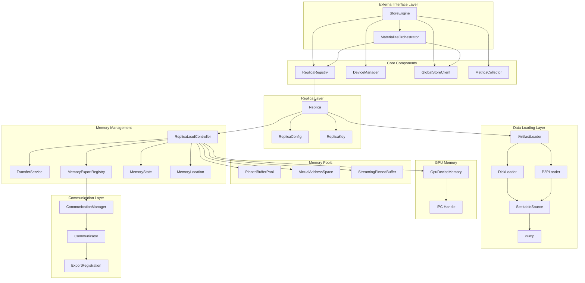

## Layer Details

### 1. External Interface Layer

**StoreEngine** is the entry point of the entire system, providing:

- Replica registration and management via ReplicaRegistry
- GPU device management via DeviceManager
- Global resource coordination through GlobalStoreClient
- High-level API encapsulation with materialize_replica() method
- Metrics collection through MetricsCollector

- Source: `core/store/store_engine.h`, `core/store/store_engine.cc`

**MaterializeOrchestrator** handles the materialize_replica() API workflow:

- Remote replica selection from Global Store
- P2P transport setup and coordination
- Disk fallback when P2P unavailable
- Replica registration after successful loading

- Source: `core/store/loading/materialize_orchestrator.{h,cc}`, `core/store/components/global_store_client.{h,cc}`

```cpp
class StoreEngine {
public:
    // Multi-device binding API
    absl::StatusOr<ReplicaHandle> materialize_replica(
        std::string_view artifact_id,
        const DeviceKey& target_device,
        MaterializeMode mode = MaterializeMode::AUTO,
        const MaterializeHints& hints = {});

    // Instance-based management
    int wait_replica_ready(const ReplicaKey& key);
    int unload_replica(const ReplicaKey& key);

    // Note: VS lock APIs are removed in UMA V3; UMA is the sole ledger.
    // UMA legacy helpers lock_chunks_for_transfer/update_chunk_states have been removed;
    // use UMA plan_load(...), execute transfer, then commit()/abort().
};
```

- Definitions: `ReplicaKey`, `ReplicaHandle`, `MaterializeHints` in `core/store/loading/loading_spec.h`
- Device key: `DeviceKey` in `core/store/device_types.h`

### 2. Replica Management Layer

**Replica** class encapsulates the complete lifecycle of a single replica instance bound to a specific device:

- Source: `core/store/replica/replica.{h,cc}`

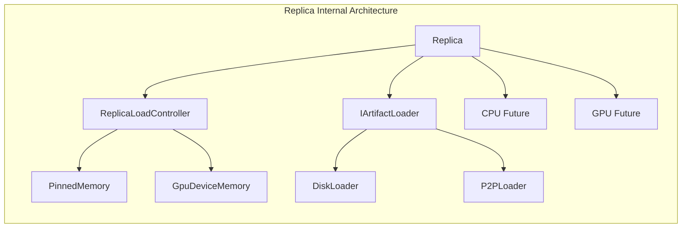

**Design Features**:
- Factory pattern with `Replica::create()` for instance creation
- Each Replica instance is uniquely identified by `ReplicaKey` (artifact_id + device + replica) — `core/store/loading/loading_spec.h`
- Asynchronous operation management via `std::shared_future` — `Replica::ensure_loaded_async()` in `core/store/replica/replica.{h,cc}`
- Supports device copies via `Replica::copy_from()` and `ReplicaLoadController::copy_from_peer()` — `core/store/replica/replica.h`, `core/store/replica/replica_load_controller.h`
- Integrated replica verification — `core/common/artifact_verification.{h,cc}`, used by loaders and `Replica`

### 3. Data Loading Layer

Adopts strategy pattern design with pump-based streaming architecture:

- Sources: `core/store/loader/loader.h`, `core/store/loader/disk_loader.{h,cc}`, `core/store/loader/p2p_loader.{h,cc}`
- Streaming: `core/store/loader/source.h`, `core/store/loader/pump.{h,cc}`, `core/store/loader/buffer_pool.h`
- Remote: `core/store/loader/remote_key_source.{h,cc}`, `core/store/loader/mux_seekable_source.{h,cc}`

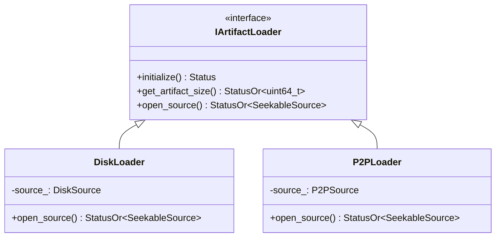

**DiskLoader Workflow**:
1. Scan partition files (`tensor.data`, `tensor.data_<n>`) — `core/store/loader/disk_loader.cc`
2. Create `FilePartitionSource` implementing `SeekableSource` — `core/store/loader/file_partition_source.{h,cc}`
3. Return source handle for pump-based streaming — `DiskLoader::open_source()`
4. Actual loading handled by `ReplicaLoadController::load_async_from_source()` using `TransferService` + `pump_ranges()`
5. Data flows: FilePartitionSource → Pump → MemorySink (`CpuVaSink` for CPU or `GpuMemorySink` for GPU). For GPU targets, the pump detects sinks that implement `AsyncPositionedSink` and uses `AsyncCopyManager` to submit H2D copies. `TransferService` replays `AsyncCopyManager::synchronize_h2d_stream()` followed by `cuda::device_synchronize()` before returning to ensure the GPU buffer is fully materialised prior to verification and metadata persistence.

**P2PLoader Workflow**:
1. Validate `P2PSource` configuration (IP, port, memory keys) — `core/store/loader/p2p_loader.{h,cc}`
2. Create `RemoteKeySource` that wraps remote memory via `Communicator` — `core/store/loader/remote_key_source.{h,cc}`
3. Optional disk fallback via `MuxSeekableSource` — `core/store/loader/mux_seekable_source.{h,cc}`
4. Uses the same `load_async_from_source()` path to target CPU (CPU, previously CPU) or GPU
5. Optional checksum or direct-write support depends on communicator — see `RemoteKeySource::supports_direct_write()`

### 4. Memory Management Layer

**ReplicaLoadController** manages memory for a single replica instance at both CPU (CPU, previously CPU) and GPU locations, integrating with VS for pageable CPU memory:

- Source: `core/store/replica/replica_load_controller.{h,cc}`
- UMA (Unified Memory): `core/store/replica/unified_memory_authority.{h,cc}`
- Transfers: `core/store/replica/transfer_service.{h,cc}`, `core/store/replica/transfer_helpers.{h,cc}`
- States: `core/store/replica/memory_state.h`, Locations: `core/common/memory/memory_location.h`
- GPU unloads are strictly state-protected: if the target is in `LOADING`, `release_memory()` immediately returns `FailedPrecondition`. Callers must wait for completion (typically via `wait_for_state(..., LOADED)`). This prevents concurrent unloads from tearing down VRAM before the replica has finished loading.
- When accessing a GPU buffer, use `ReplicaLoadController::get_gpu_allocation_view()` to obtain both the base address and the UMA-owned `std::shared_ptr<GpuDeviceMemory>` in one call, ensuring the GPU allocation is not released prematurely during subsequent validation or hashing.

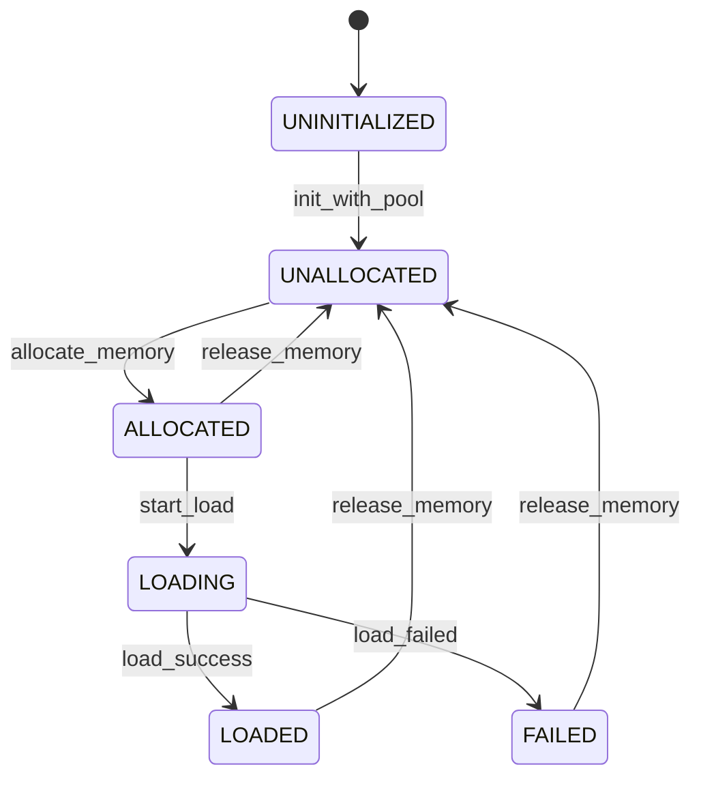

**Memory Transfer Support**:
- CPU (CPU) ↔ GPU: Asynchronous copy via dedicated CUDA stream — `ReplicaLoadController::copy_data_async()`
- DISK → CPU/GPU: Pump-based streaming via `load_async_from_source()` and `TransferService::load_from_source()`
- REMOTE → CPU/GPU: Same pump-based streaming using `RemoteKeySource` and `CpuVaSink`/`GpuMemorySink`
- GPU ↔ GPU: Direct peer copy via `ReplicaLoadController::copy_from_peer()`

### 5. Memory Implementation Layer

The memory implementation layer provides the low-level memory management and data transfer mechanisms:

- CPU Memory: `core/common/memory/pinned_buffer_pool.h`, `core/common/memory/pinned_buffer_pool.cc`, `core/common/memory/streaming_pinned_buffer.{h,cc}`
- VS: `core/common/memory/virtual_address_space.{h,cc}`
- GPU Memory: `core/common/memory/cuda_memory.{h,cc}`
- Sinks/Sources: `core/store/loader/cpu_va_sink.{h,cc}`, `core/store/loader/gpu_memory_sink.{h,cc}`
- Pump: `core/store/loader/pump.{h,cc}` (`pump_ranges`), `core/store/loader/buffer_pool.h`

```mermaid
graph TB
    subgraph "CPU Memory Management"
        PMP[PinnedBufferPool]
        VS[VirtualAddressSpace]
        SPB[StreamingPinnedBuffer]

        PMP -->|Allocates chunks| SPB
        VS -->|Virtual pages| UMA[UMA Space]
    end

    subgraph "GPU Memory Management"
        CM[GpuDeviceMemory]
        CS[CUDA Stream]
        IPC[IPC Handle]

        CM -->|Manages| CS
        CM -->|Exports| IPC
    end

    subgraph "Data Transfer Components"
        SS[SeekableSource]
        Sink[MemorySink\n(AsyncPositionedSink for GPU)]
        P[Pump]
        BP[BufferPool]

    SS -->|Reads from| P
    P -->|Writes to| Sink
    P -->|Uses| BP
    Sink -->|Schedules H2D via ACM| CS
    end

    subgraph "Service Layer"
        TS[TransferService]
        CES[MemoryExportRegistry]
        UMA[UnifiedMemoryAuthority]

        TS -->|Orchestrates| P
        CES -->|Manages| ER[ExportRegistration]
        UMA -->|Authorizes & Coordinates| TS
    end
```

**GPU Memory Features**:
- CUDA allocation and stream management — `core/common/memory/cuda_memory.{h,cc}`
- Cross-process memory sharing via `ReplicaLoadController::get_ipc_handle()` — `core/store/replica/replica_load_controller.h`
- Device-bound memory management (via `ReplicaKey`) — `core/store/loading/loading_spec.h`

## Memory Transfer Mechanism

### Disk to CPU Loading Mechanism

Updated to reflect `TransferService` + `pump_ranges` orchestration:

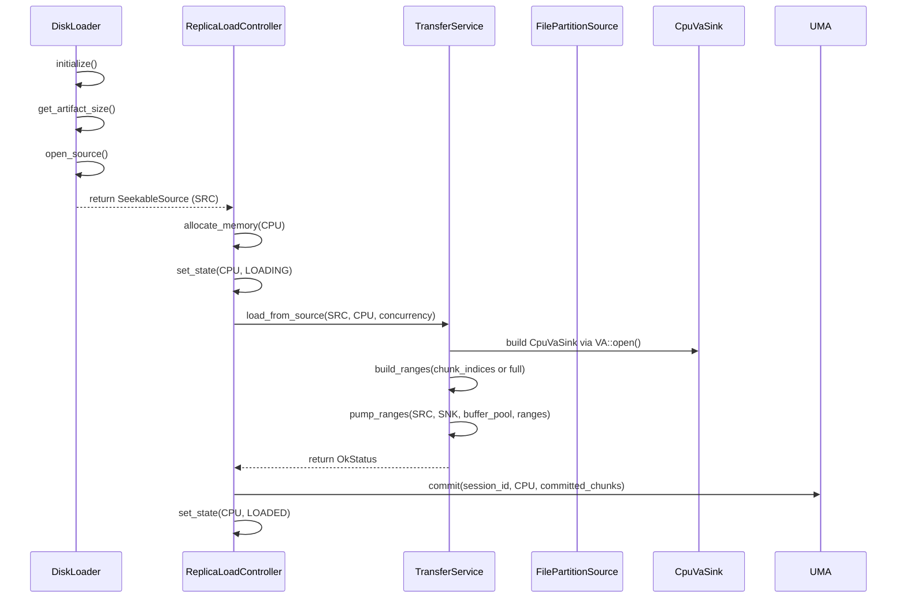

- Source: `ReplicaLoadController::load_async_from_source()` and `TransferService::load_from_source()`

### CPU to GPU Transfer Mechanism

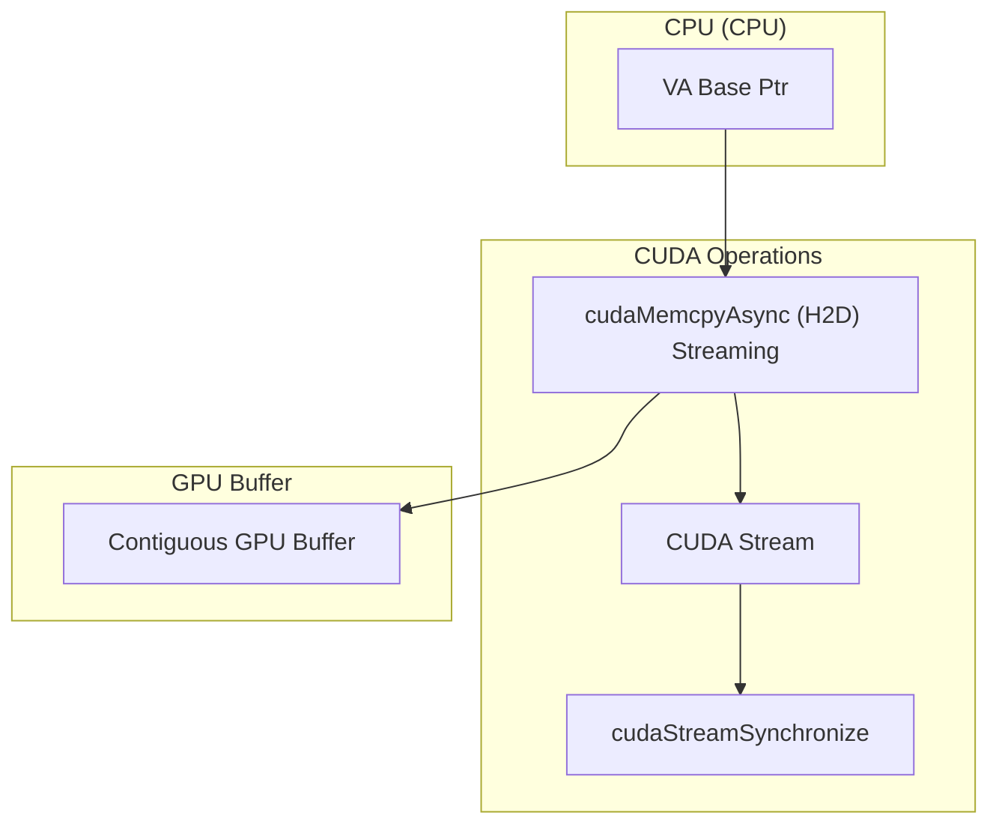

- Source: `TransferService::copy_cpu_to_gpu_streaming()`

### GPU to CPU Transfer Mechanism

```mermaid
graph TB
    subgraph "Reverse Transfer Flow"
        direction TB

        subgraph "GPU Buffer"
            GPU2[Contiguous GPU Buffer]
        end

        subgraph "CUDA Operations"
            Stream2[CUDA Stream]
            RCopy[cudaMemcpyAsync (D2H) Streaming]
            Sync2[cudaStreamSynchronize]
        end

        subgraph "CPU (CPU)"
            VSBase[VS Base Ptr]
        end

        GPU2 --> RCopy
        RCopy --> VSBase
        RCopy --> Stream2
        Stream2 --> Sync2
    end
```

- Source: `TransferService::copy_gpu_to_cpu_streaming()`

### P2P Transfer Support

P2P transfer strategies based on memory layouts, via `RemoteKeySource` + `pump_ranges` and appropriate sinks:

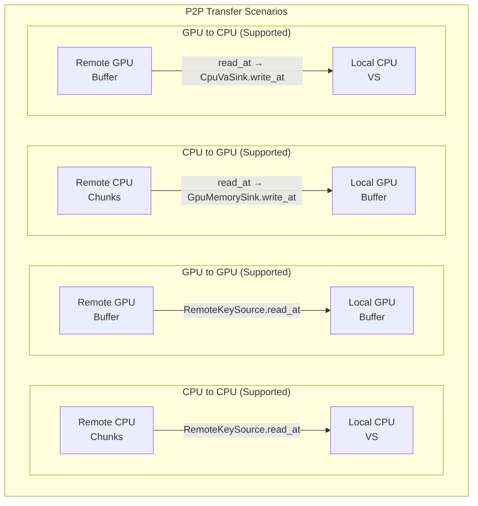

- Sources: `core/store/loader/remote_key_source.{h,cc}`, `core/store/loader/gpu_memory_sink.{h,cc}`, `core/store/loader/cpu_va_sink.{h,cc}`, `core/store/loader/pump.{h,cc}`

### Transfer Failure Handling

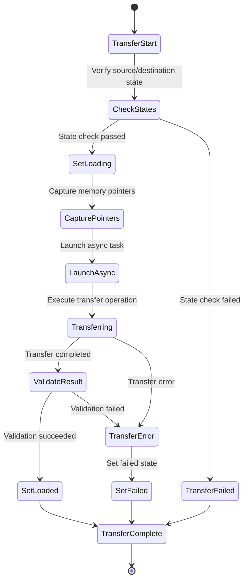

- Sources: `core/store/replica/replica_load_controller.{h,cc}` (`set_state`, `finalize_load`, error paths)

## Core Interaction Flows

### New Unified Loading Flow with materialize_replica() API

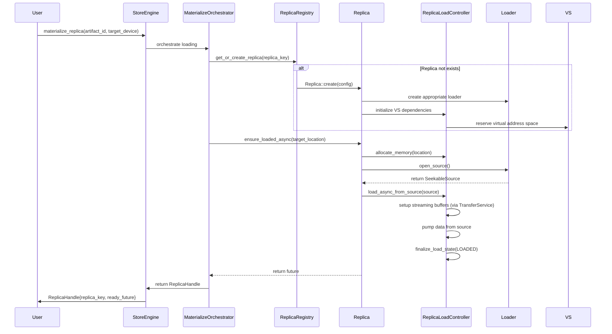

- Sources: `core/store/store_engine.{h,cc}`, `core/store/loading/materialize_orchestrator.{h,cc}`, `core/store/replica/replica.{h,cc}`, `core/store/replica/replica_load_controller.{h,cc}`

### P2P Loading Flow with Communicator

P2P transfers leverage the `Communicator` for remote memory access with `RemoteKeySource`:

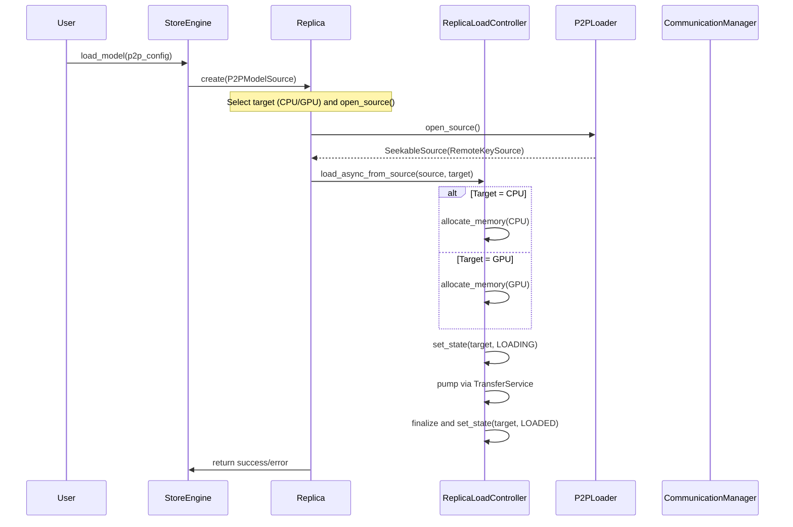

- Sources: `core/store/loader/p2p_loader.{h,cc}`, `core/store/loader/remote_key_source.{h,cc}`, `core/store/replica/replica_load_controller.{h,cc}`

### IPC Memory Sharing Flow

GPU memory can be shared between processes through IPC handles:

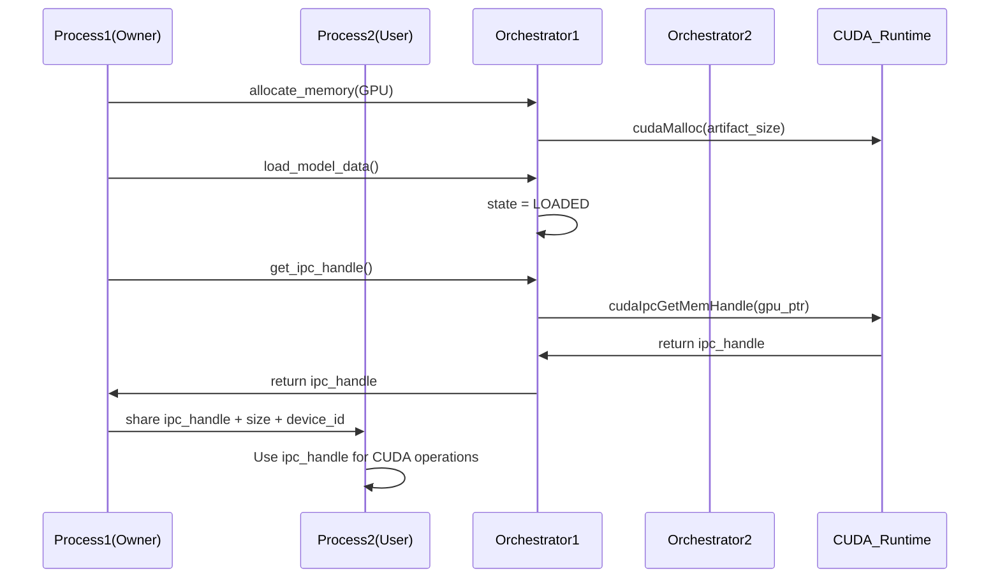

- Source: `core/store/replica/replica_load_controller.h` (`get_ipc_handle()`)

## Performance Optimization

### 1. Concurrency Strategy
- Multi-threaded parallel disk reading (via `pump_ranges` concurrency)
- CPU-GPU transfer pipeline
- Overlapped execution of async operations

### 2. Memory Optimization
- Pre-allocated memory pools
- CUDA pinned memory improves transfer speed
- Zero-copy IPC sharing

### 3. Caching Strategy
- VS-assisted CPU eviction policies (UMA-owned policy; VS issues advisories)
- Intelligent location selection based on device capabilities
- Locality-aware data access with NUMA optimization
- Chunk locking mechanism to prevent eviction during transfers

## Observability (UMA V3 additions)

- Export path: `tc_ex_registrations_total{location}` and `tc_ex_keepalive_gauge` report P2P export activity and UMA‑owned CPU VS export leases.
- UMA VA pin leases: `tc_va_pin_leases_total{reason}` increments when UMA obtains VS leases (e.g., reason="Export").
- GPU copy scheduler: `tc_tx_inflight_copies_gauge{gpu}` reflects per‑GPU in‑flight copy slots held by the scheduler gate.

## Security Considerations

### 1. Memory Safety
- Smart pointers prevent memory leaks
- Boundary checks avoid out-of-bounds access
- CUDA error checking

### 2. Thread Safety
- Fine-grained lock design
- Lock-free data structures
- Condition variable synchronization

### 3. Resource Isolation
- Memory isolation between processes
- Exclusive access to GPU devices
- Secure management of network resources

## Extension Points

The system is designed with multiple extension points to support future requirements:

1. **New Loader Types**: Implement `IArtifactLoader` interface and provide `SeekableSource`
2. **New Source Types**: Add variants to `ArtifactSource` (e.g., S3Source, AzureBlobSource)
3. **New Memory Types**: Extend `ReplicaLoadController` and `MemoryLocation` enum
4. **New Transfer Protocols**: Extend `Communicator` implementations
5. **New Verification Methods**: Extend `ArtifactVerificationInfo` framework
6. **Custom Device Types**: Extend `DeviceKey` and device registry

## Key Implementation Details

### Multi-Device Binding
- Each replica instance is uniquely identified by `ReplicaKey` (artifact_id + device + replica) — `core/store/loading/loading_spec.h`
- Supports multiple replicas of the same replica on different devices
- Device abstraction via `DeviceKey` for stable device references — `core/store/device_types.h`

### Virtual Address Space (VS)
- System-wide virtual address space management — `core/common/memory/virtual_address_space.{h,cc}`
- Chunk-based virtual layout with lazy physical page binding; telemetry only (non‑authoritative)
- Provides pin leases to protect ranges during transfers (no explicit lock/unlock APIs)
- Enables efficient memory sharing across processes (stable VA + CUDA IPC)

- ### Unified Type System
- `ArtifactSource` / `ArtifactTarget` / `MaterializeHints` — `core/store/loading/loading_spec.h`
- `ReplicaHandle`: returned from loading operations with instance info — `core/store/loading/loading_spec.h`

### Service Architecture
- **TransferService**: Manages data transfers between locations — `core/store/replica/transfer_service.{h,cc}`
- **MemoryExportRegistry**: Handles P2P memory registration/export — `core/store/replica/memory_export_registry.h`
- **MaterializeOrchestrator**: Coordinates the materialize_replica() API workflow — `core/store/loading/materialize_orchestrator.{h,cc}`
- **MetricsCollector**: Tracks performance and resource usage — `core/store/components/metrics_collector.{h,cc}`
- **Verification Metadata Coordination**: `core/store/loader/verification_utils.{h,cc}` provides the per-artifact `VerificationMetadataGuard`, in-process metadata cache, atomic write helper (`open` → `write` → `fsync` → `rename` + directory sync), and structured logging hooks (`verification_metadata_write_{succeeded,failed}`). `core/store/replica/transfer_service.cc` synchronises the per-device H2D stream via `AsyncCopyManager::synchronize_h2d_stream()` followed by `cuda::device_synchronize()` so verification always runs on fully materialised GPU buffers. Regression coverage lives in `core/store/loader:verification_utils_test` and `core/store:multi_gpu_verification_race_test`.

## Related Guides

- **Device Registry**: Learn how GPUs are mapped to logical `DeviceKey`s in the [Device Registry guide](./device-registry.md).
- **Communicator Internals**: See communication engine details in `../communicator/README.md`.
- **StoreEngine API**: High-level usage patterns are documented in `../checkpoint/README.md`.
- **DeviceManager** — runtime GPU enumeration and streams ([Device Manager](./device-manager.md))
