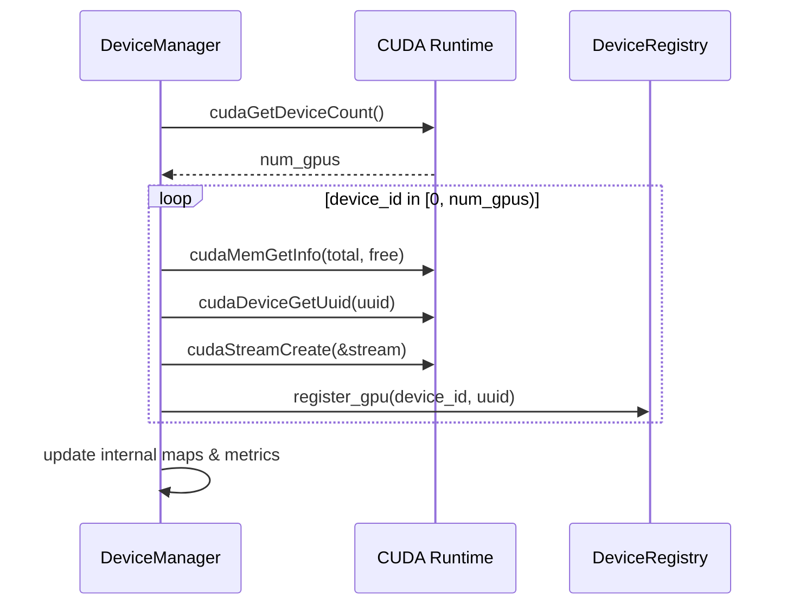

# Device Manager

> Source: `core/store/components/device_manager.{h,cc}`

The **Device Manager** is responsible for GPU discovery, CUDA stream creation, and real-time memory metrics inside the C++ Core Store. It complements the [Device Registry](./device-registry.md) by providing *runtime* information for each GPU rather than a static identifier mapping.

## Responsibilities

1. **GPU Enumeration** — Queries CUDA runtime to determine the number of available devices and gathers per-GPU properties.
2. **Stream Management** — Creates one long-lived default `cudaStream_t` per device to execute copy kernels and other asynchronous operations triggered by the `MemoryManager`.
3. **Memory Metrics** — Periodically polls `cudaMemGetInfo` and updates Prometheus gauges so operators can observe GPU utilisation.
4. **UUID Mapping** — Populates `DeviceRegistry` with the ordinal⇆UUID mapping discovered at start-up.

## Public API

```cpp
class DeviceManager {
 public:
  absl::Status initialize();
  int get_num_gpus() const;
  absl::StatusOr<const GpuInfo*> get_gpu_info(int device_id) const;
  absl::StatusOr<int> find_device_by_uuid(const std::string& uuid) const;
  absl::StatusOr<cudaStream_t> get_stream(int device_id) const;
  void update_gpu_metrics();
  absl::StatusOr<size_t> get_free_memory(int device_id);
};
```

### `GpuInfo`

```cpp
struct GpuInfo {
  std::string uuid;
  size_t total_memory;
  size_t free_memory;
  cudaStream_t stream; // Default stream for async ops
};
```

## Initialization Flow



## Metrics

* `core_store_gpu_memory_total_bytes{device_id}`
* `core_store_gpu_memory_free_bytes{device_id}`
* `core_store_models_loaded{device_id}`

These are exported via the C++ metrics subsystem and scraped by the Python **Store Daemon**.

## Error Handling

* Uses `absl::Status` and `absl::StatusOr<T>` exclusively.
* All CUDA calls are wrapped with `SC_RETURN_IF_CUDA_ERROR` macro, converting errors into readable `absl::InternalError`.

## Thread-Safety

* All public getters are thread-safe after the initial `initialize()` call.
* Metric updates take a light `absl::Mutex` to protect the maps.

## Related Components

* **Memory Manager** — Requests `cudaStream_t` handles for async copy.
* **Metrics Collector** — Consumes Device Manager gauges and forwards them to Prometheus.
* **Device Registry** — Filled with UUID mappings by Device Manager at start-up.

## Future Work

1. **Multi-stream Scheduling** — Allow multiple priority streams per device.
2. **Dynamic GPU Hot-plug** — Detect and handle GPU addition/removal at runtime.
3. **NVML Integration** — Expose temperature & power metrics.