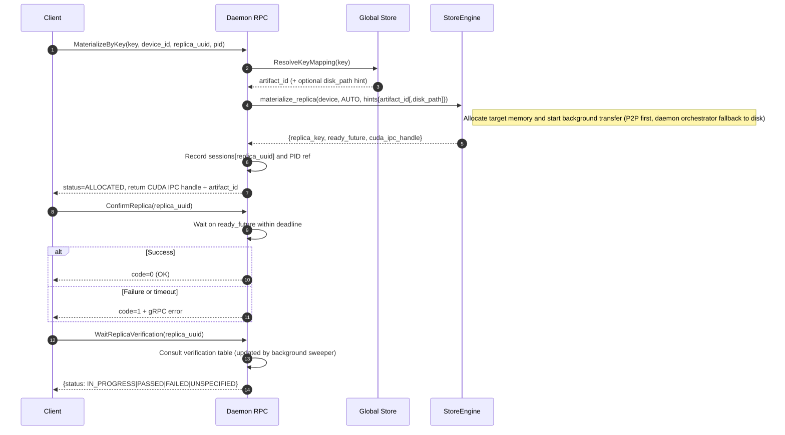
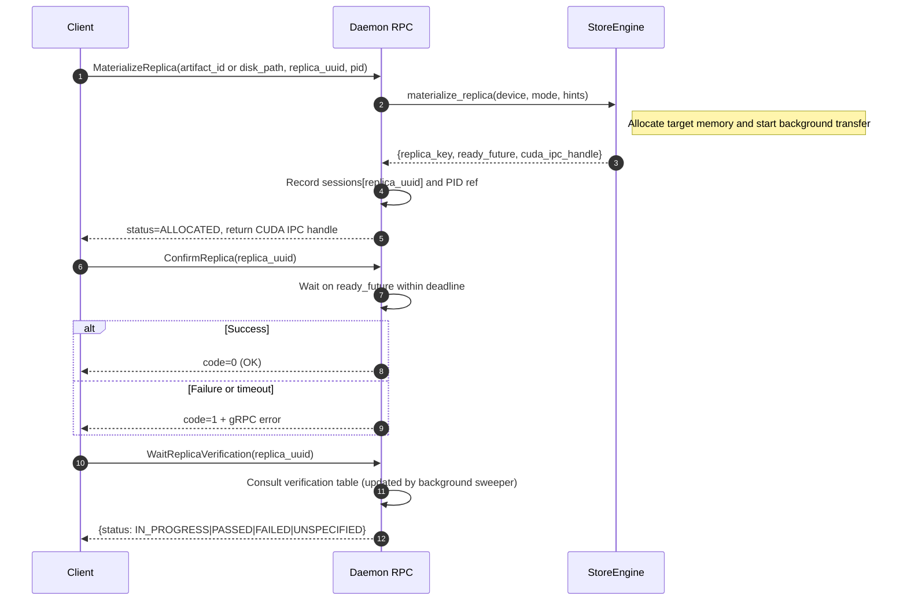
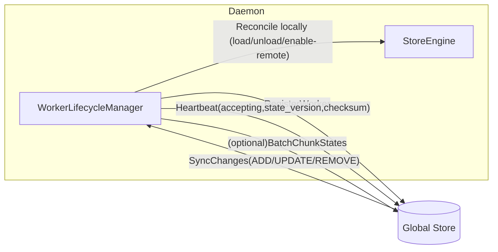

# Store Daemon Internals (C++)

This document describes the internals of the Store Daemon as implemented under `./daemon`. The daemon is a thin gRPC layer over the high‑performance C++ StoreEngine, built with Bazel and integrated with the distributed Global Store control plane.

Binary target: `//daemon:tensorcast_daemon`

Quick run example (unified config):

```bash
bazel build //daemon:tensorcast_daemon
bazel-bin/daemon/tensorcast_daemon --config=examples/config/store_daemon_config.yaml
# Enable cursor pagination for replica listing (optional feature flag)
# bazel-bin/daemon/tensorcast_daemon --config=examples/config/store_daemon_config.yaml --use_cursor_pagination=true
```

## System Context (Where this daemon fits)

```mermaid
graph TD
  subgraph Control Plane
    GS[Global Store]
  end
  subgraph Data Plane
    SD[Store Daemon (this)]
  end
  subgraph Clients
    C[User Process Worker]
  end

  GS -.->|gRPC metadata| SD
  C -->|CUDA IPC| SD
  SD <--> |RDMA/TCP P2P| SD
```

## High‑Level Architecture

The daemon is a “thin gRPC layer + StoreEngine” design. The service layer maintains sessions, process references and transport locks, and runs several background sweepers:

Recent changes (RFC‑0015 execution):
- Strong‑typed LIP keys via `ArtifactDeviceKey {artifact_id, device_id}` (no string concat keys)
- Strict CUDA IPC handle size checks (prevent partial memcpy truncation)
- Lease In‑Place commit bug fix: eliminate double close by transferring ownership to the seekable source
- TTL refresh in FeedRegisterArtifactStream: single combined refresh per frame with engine call outside lock
- LIP fast path now propagates `keep_for_global` from `MaterializeReplicaRequest`
- BackgroundScheduler integrated: sessions/locks/verification/pid/eviction sweepers now run via a central, event‑driven scheduler with `notify(TaskKind)` on verification enqueues.
- GrpcSpan RAII helper extracted (`daemon/grpc_span.h`) and adopted in key RPCs to unify `rpc.*` attributes and reduce instrumentation boilerplate.
- RpcMethodMetricsTimer extracted (`daemon/grpc_metrics.h`) and adopted across RPCs:
  - Emits `tc_rpc_requests_total{rpc.method}` and `tc_rpc_errors_total{rpc.method}` counters
  - Records `tc_rpc_duration_seconds{rpc.method}` histogram on every call
  - Best-effort; metrics failures never affect control flow
- CudaIpcMapping RAII (`daemon/cuda_ipc_raii.h`) adopted across LIP fast paths (cross‑device copy, staged export, LIP commit hashing) and coalesced destination mapping; Unlock path now relies on RAII to close IPC mappings.
- Introduced `LipManager` (`daemon/lip_manager.{h,cc}`): encapsulates LIP → coalesced copy on target GPU using RAII mappings. Service now delegates cross‑device fast‑path copies to this manager.
- Verification registry now enforces TTL (default 5m) and a capacity bound (4096 entries) via the background scheduler to prevent unbounded memory growth.
- GetLoadedReplicasV2 supports cursor pagination behind an option flag (`Options.use_cursor_pagination`).
  - When enabled, the service returns an opaque JSON token encoding the last item (sorted by `(artifact_id, device_id)`) to resume after.
  - When disabled (default), legacy numeric `page_token` behavior is preserved for backward compatibility.
- Introduced `RegistrationManager` (`daemon/registration_manager.h`): encapsulates registration state (meta + lease segments) and TTL refresh/keepalive helpers used by Begin/Feed/KeepAlive/Commit.
- LIP staged export moved into `LipManager` (`create_staged_export`/`release_staged_export`): service delegates chunk registration and CUDA IPC mapping lifecycle; service no longer manages `lip_exports_`.

RFC‑0016 (incremental controller split) — progress:
- Added thin, reusable helpers:
  - `daemon/rpc_context.h`: wraps `GrpcSpan` and `RpcMethodMetricsTimer` with a unified, low‑boilerplate per‑RPC context.
  - `daemon/deadline_utils.h`: utility to clamp user timeouts to the gRPC deadline.
  - `daemon/device_resolver.h`: unifies request→`DeviceKey` resolution with DISK→default GPU parity.
  - `daemon/sessions_service.h`: composes `ReplicaSessionManager` + `VerificationTracker` with scheduler notify.
  - `daemon/lip_bridge.{h,cc}`: adapter over `LipManager` for cross‑device LIP fast‑path.
- Introduced `MaterializationController` (`daemon/service/controllers/materialization_controller.{h,cc}`) and delegated:
  - `MaterializeReplica`, `MaterializeByKey`, `GetArtifactIndexById`, `ConfirmReplica`, `UnloadReplica`, and `WaitReplicaVerification`.
- Introduced `RegistrationController` (`daemon/service/controllers/registration_controller.{h,cc}`) and delegated:
  - `BeginRegisterArtifact`, `FeedRegisterArtifactStream` (and test vector variant), `CommitRegisteredArtifact`, `AbortRegisteredArtifact`, `KeepAliveRegisterArtifact`, and `RevokeRegisteredArtifact`.
  - Streaming feed path now centralizes TTL refresh and payload handling; vector helper forwards to the same logic to remove duplication.
- Introduced `TransportController` (`daemon/service/controllers/transport_controller.{h,cc}`) and delegated:
  - `LockTransportChunks` and `UnlockTransportChunks`; includes unique GPU residency inference helper with current service-side behavior preserved.
- Service now constructs controllers after scheduler initialization and delegates via `RpcContext`.
- Introduced `StatusController` (`daemon/service/controllers/status_controller.h`) with `StatusAssembler` helper:
  - Delegates `GetServerConfig`, `GetWorkerStatus`, `GetDetailedStatus`, and wraps `GetLoadedReplicasV2` (proxying to `listing::FillLoadedReplicasV2(...)` with optional cursor pagination).
  - Adds status metrics: `tc_status_worker_uptime_seconds`, `tc_status_worker_registered_total`,
    `tc_status_total_replicas`, `tc_status_total_bytes`, `tc_status_list_pages_total`, and
    `tc_status_list_page_size`. These complement unified RPC metrics
    (`tc_rpc_requests_total`, `tc_rpc_duration_seconds`, `tc_rpc_errors_total`).
 - Background sweepers objectified: `daemon/sweep_tasks.h` defines `SessionTtlTask`, `LockTtlTask`, `VerificationTask`, `PidWatchTask`, and `EvictionTask`. `start_sweepers()` registers these classes with intervals, improving testability and encapsulation versus inline lambdas.

Notes:
- `MaterializeByKey`’s keep_for_global pass‑through remains unchanged (false) because the current proto does not carry this flag; changing proto is out of scope for RFC‑0016’s incremental step.

```mermaid
graph TD
  subgraph Daemon (C++)
    RPC[StoreDaemonServiceImpl<br/>grpc_service_impl.{h,cc}]
    SESS[ReplicaSessionManager<br/>replica_session_manager.h]
    REFS[RefTracker (PID refs)<br/>ref_tracker.h]
    LOCKS[TransportLockManager<br/>transport_lock_manager.h]
    BG[Sweepers: sessions/locks/verification/PID/(optional)eviction]
    WLM[WorkerLifecycleManager<br/>worker_lifecycle_manager.{h,cc}]
  end

  subgraph Core (C++)
    ENG[StoreEngine<br/>core/store/store_engine.h]
    COMM[CommunicationManager]
    GSCLI[GlobalStoreClient]
  end

  RPC --> ENG
  RPC --> SESS
  RPC --> REFS
  RPC --> LOCKS
  RPC --> ENG
  WLM --> GSCLI
  ENG --> COMM
```

Startup flow (`server_main.cc`):
- Load unified config (`--config=...`) and map to `StoreEngineOptions` & service options (sweepers/TTL/eviction).
- Initialize OTel/log sink from `observability.*`; initialize communicator (`communicator.*`) and gRPC/TLS (`server.grpc.*`); register service and start listening.
- When `high_availability.enabled=true` with `global_store_endpoints` configured, start `WorkerLifecycleManager` for registration/heartbeats/optional state sync.
- Install signal handling (`sigwait` thread); on SIGINT/SIGTERM perform graceful shutdown (reject new loads and stop gRPC).

## Components and Responsibilities

- gRPC service (`grpc_service_impl.{h,cc}`)
  - Artifact lifecycle RPCs: `MaterializeReplica`, `ConfirmReplica`, `UnloadReplica`
  - Verification wait: `WaitReplicaVerification`
  - Transport locking: `LockTransportChunks` / `UnlockTransportChunks`
  - Status: `GetWorkerStatus`, `GetDetailedStatus`, `GetLoadedReplicasV2`
  - In‑memory registration: `BeginRegisterArtifact`, `CommitRegisteredArtifact`, `AbortRegisteredArtifact`
  - Key mapping (RFC‑0017): `PublishReplicaKey`, `MaterializeByKey` (resolve key→artifact_id, prefer P2P, fallback to disk if mapping contains `disk_path`)

  API notes:
  - `PublishReplicaKeyRequest`
    - Fields: `key`, `artifact_descriptor` (RFC‑0007), optional `disk_path`, `fail_if_exists` (default true)
    - Validation: both `key` and `artifact_descriptor.artifact_id` are required
  - `CommitRegisteredArtifactResponse`
    - Field renamed to `artifact_descriptor` to avoid collision with protobuf's static `descriptor()` method

- Sessions and references
  - `ReplicaSessionManager`: maps `replica_uuid` to `ReplicaKey` and a readiness `future` with TTL (default 60s); used by Confirm/Wait paths
  - `RefTracker`: PID‑based reference tracking with `keep_for_global` cache hint
  - `TransportLockManager`: lock token store for chunk transport with expiry (default TTL 120s)

- Background sweepers (`StoreDaemonServiceImpl::start_sweepers()`)
  - Session sweeper: remove expired `replica_uuid` mappings
  - Lock sweeper: remove expired tokens and proactively `unlock_chunks` to avoid leaks
  - Verification sweeper: observe ready futures and update `VERIFICATION_STATUS_{PASSED|FAILED}`
  - PID watcher: periodically scans `/proc/<pid>` to drop refs of dead processes
  - Optional periodic eviction: GPU LRU eviction when usage exceeds a threshold (env‑driven; see below)

- Worker lifecycle (`worker_lifecycle_manager.{h,cc}`)
  - Startup: connect to Global Store, register worker, inject worker identity into `StoreEngine`
  - Heartbeats: report available memory, accepting flag, state version/checksum
  - Chunk state sync (optional): batch‑update chunk states with device UUIDs
  - State reconciliation: apply `ADD/UPDATE/REMOVE` changes and clean up obsolete local replicas
  - Monitor loop: detect stalled heartbeat/sync loops and auto‑restart

## Core Flows

### Key‑based loading (MaterializeByKey → Confirm → Wait)



Notes:
- `MaterializeByKey` is the preferred path (RFC‑0017). Daemon resolves key internally and orchestrates P2P/disk fallback; client does not handle fallback logic.
- Return semantics: return ALLOCATED when allocation is complete; client completes verification with `ConfirmReplica`/`WaitReplicaVerification`.
- Device resolution: use `device_id` (or default from config), target GPU.

### Asynchronous loading (MaterializeReplica → Confirm → Wait)



Notes:
- `MaterializeReplica` requires exactly one of `artifact_id` or `disk_path`; otherwise returns `INVALID_ARGUMENT`.
- Return semantics: memory allocated, transfer in progress; clients should call `ConfirmReplica`/`WaitReplicaVerification`.
- Device resolution: prefer `device_uuid`; otherwise use `target_device_type` with sensible defaults (GPU→default card, CPU→-1).

### Transport chunk locking (for P2P)

```mermaid
sequenceDiagram
    participant C as Client/Peer
    participant D as Daemon RPC
    participant E as StoreEngine

    C->>D: LockTransportChunks(artifact_id, chunk_indices[, device_id])
    D->>D: Resolve unique device (infer from residency when device_id is absent; error if ambiguous)
    D->>E: lock_chunks(key, indices)
    E-->>D: OK
    D-->>C: lock_token

    C->>D: UnlockTransportChunks(lock_token)
    D->>D: Lookup token → {key, indices}
    D->>E: unlock_chunks(key, indices)
    D-->>C: OK
```

Notes:
- Without an explicit `device_id`, the daemon infers a unique GPU from residency; if not unique, returns `INVALID_ARGUMENT`.
- Expired tokens are swept and unlocked automatically to avoid leaks.

### Worker ↔ Global Store interaction



Notes:
- On startup, perform a full state sync once; afterward send incremental heartbeats and optional chunk state updates.
- UPDATE changes toggle remote visibility for replicas (enable/disable P2P access).
- The monitor loop detects stalled heartbeat/sync threads and restarts them.

## Status and Observability

### Status RPCs
- `GetWorkerStatus`: registration/health/shutdown, memory pool totals, uptime, worker_id
- `GetDetailedStatus`: device‑level aggregation (GPU totals and loaded replicas), CPU replicas, communication enabled, global totals
- `GetLoadedReplicasV2`: paginated per‑replica view (`artifact_id`/`device_id` filters) with `ref_count`, `pids`, `keep_for_global`, `last_access_ts`

### OpenTelemetry integration
- All RPCs extract context from gRPC metadata and start server spans with low‑cardinality attributes by default
- Set `TC_OTEL_ALLOW_HIGH_CARDINALITY_ATTRS=1` to include attributes like `device_uuid` and `disk_path`

### Periodic eviction (optional)

## VRAM Lease In Place (RFC-0014)

The daemon implements VRAM Leased-In-Place (LIP) registration semantics:
- BeginRegisterArtifact accepts `LeaseOptions` with `in_place=true` and requires `owner_pid`.
- CommitRegisteredArtifact computes the content-address descriptor from the leased GPU segments without materializing into daemon VRAM and registers an in-memory LIP lease entry with TTL.
- KeepAliveRegisterArtifact and RevokeRegisteredArtifact operate both pre-Commit (pending registration) and post-Commit (LIP lease) and enforce `owner_pid` equality.
- LIP leases are excluded from P2P/source selection if expired and are auto-revoked when the `owner_pid` process terminates.
- Local same-device consumers are rejected with FAILED_PRECONDITION; cross-device materialization falls back to normal replica creation (engine path).
- Lightweight verification is generated at LIP Commit (KEY_POINTS: first/middle/last values) and stored with the lease for future offer attachment.

Note: P2P transport remains staged-only per RFC-0009. LIP leases are not directly registered for RNIC MR.

P2P export from LIP:
- LockTransportChunks detects ACTIVE LIP entries, maps CUDA IPC segments, and registers per-chunk GPU ranges with CommunicateEngine (staged-only; no RNIC MR).
- Response includes optional `verification_json` (KEY_POINTS) that receivers can validate after transfer.
- UnlockTransportChunks unregisters keys and closes temporary IPC mappings.
Controlled by environment variables (handled by a background thread in the service layer):
- `TC_DAEMON_ENABLE_PERIODIC_EVICTION`: enable/disable (default: false)
- `TC_DAEMON_GPU_MEMORY_LIMIT_FRACTION`: usage threshold (default: 0.90)
- `TC_DAEMON_EVICTION_CHECK_INTERVAL_MS`: check interval (default: 1000)

Eviction strategy: per‑device LRU of GPU‑resident replicas that have no PID refs and are not `keep_for_global`, unloading until below threshold.

## Reference and unload semantics

- Add refs: `MaterializeByKey`/`MaterializeReplica` with `pid` adds a PID ref to the `ReplicaKey`; `keep_for_global` can pin as global cache
- Drop refs:
  - `UnloadReplica(..., pid=...)` removes that PID ref; if other refs remain, unload is skipped and success is returned (idempotent)
  - The PID watcher drops refs for dead PIDs automatically
- Special case: unloading to DISK target is a no‑op and succeeds (compatibility semantics)

## In‑memory registration (Unified; begin → feed/keepalive → commit/abort/revoke)

The daemon exposes a unified verb‑noun API to register in‑memory artifacts per RFC‑0014:

- Begin: `BeginRegisterArtifact(device_id, total_size, index, plan[, ttl_ms])`
- Feed: `FeedRegisterArtifactStream` (client‑streaming). This is the only supported feed path for all plans.
- KeepAlive: `KeepAliveRegisterArtifact(registration_id, ttl_ms, epoch)`
- Commit: `CommitRegisteredArtifact(registration_id)` → returns RFC‑0007 content‑addressed descriptor (`mi2:`)
- Abort/Revoke: abort frees pending resources; revoke also drops DVMP/Lease intermediates

Realization plans (RP):
- Coalesced VRAM: daemon allocates a single VRAM segment and returns CUDA IPC to the client (client writes into daemon VRAM).
- DVMP (CPU UMA): client uploads chunks via streaming; daemon routes chunks directly into engine‑owned DVMP (UMA) via DVMP‑owned IO (`write_at`), and hashing uses SegmentPlan (PAD=0).
- VRAM Lease (FDML): client exports CUDA IPC handles for unique storage blocks; daemon linearizes SegmentPlan (PAD=0) from leased memory.

LeaseSegments robustness:
- Each `LeasedSegment` carries `dst_offset` (destination offset in coalesced VRAM).
- The daemon zero-fills PAD intervals per SegmentPlan and copies each lease payload into `dst_offset..dst_offset+length`.
- Segment order is irrelevant; clients may send in any order.

TTL semantics:
- If `ttl_ms` is set at Begin, the registration expires unless refreshed by `KeepAliveRegisterArtifact` (SDK can auto‑keepalive). `CommitRegisteredArtifact` returns `DEADLINE_EXCEEDED` on expiry (DVMP/Lease). `RevokeRegisteredArtifact` cleans DVMP buffers and Lease segments.
 - Optional fail-fast: TTL is also enforced during `FeedRegisterArtifactStream`; expired registrations fail with `DEADLINE_EXCEEDED` and are cleaned up.

Metrics:
- `tc_register_ttl_expired_feed_total`: TTL expirations during Feed.
- `tc_register_ttl_expired_commit_total`: TTL expirations during Commit.

Hashing and identity:
- `index_multihash` from canonical index bytes or key
- `data_multihash` via SegmentPlan linearization with PAD=0 across RP‑A/B/C (coalesced/dvmp/lease) → byte‑equivalent results
- `artifact_id = mi2:<index_multihash>:<data_multihash>`

### Python helper (SDK)

For ergonomic LIP flows, use the high‑level helper that returns both the content‑address descriptor and a `RegisteredLease` context manager for keepalives and best‑effort revoke:

```python
from tensorcast.api import RegisterArtifactOptions, register_artifact_lease_in_place

opts = RegisterArtifactOptions(plan="vram_leased", lease_in_place=True)
desc, lease = register_artifact_lease_in_place(state_dict, options=opts, ttl_ms=600_000, daemon_address="127.0.0.1:8073")
with lease:
    pass
```

## Key files and build targets

- Service implementation: `daemon/grpc_service_impl.{h,cc}`
- LIP manager (LIP → coalesced copy, staged exports, in‑place commit): `daemon/lip_manager.{h,cc}`
- Verification tracker (verification registry + completion queue): `daemon/verification_tracker.h`
- Lifecycle manager: `daemon/worker_lifecycle_manager.{h,cc}`
- Session manager: `daemon/replica_session_manager.h`
- Registration manager (Begin/Feed/KeepAlive/Commit metadata): `daemon/registration_manager.h`
- Reference tracker: `daemon/ref_tracker.h`
- Transport locks: `daemon/transport_lock_manager.h`
- Entry point: `daemon/server_main.cc` (Bazel: `//daemon:tensorcast_daemon`)

## Common flags (Abseil)

- `--listen_addr=0.0.0.0:50051` gRPC listen address
- `--storage_path=/path/to/models` optional local artifact storage path
- `--p2p_port=9090` communication/P2P port
- `--mem_pool_size`, `--chunk_size`, `--io_threads` engine memory/IO settings
- `--global_store_addr=host:port` enable Global Store lifecycle integration
- `--comm_config_path=/path/to/communicator.yaml` enable communication engine (RDMA/TCP)
- `--force_full_digest_on_load` compute strong digest during load (engine‑side)

Note: periodic eviction is env‑controlled (see “Periodic eviction”), not via flags.

## Testing

Representative C++ tests live under `daemon/*_test.cc`:
- Compatibility/idempotency: `grpc_service_impl_parity_test.cc`
- Worker status and device aggregation: `grpc_service_impl_status(_multigpu|_mixed_residency)_test.cc`
- In‑memory registration: `grpc_service_impl_registration_test.cc`
- Utilities: `transport_lock_manager_test.cc`, `status_utils_test.cc`

Run examples:

```bash
bazel test //daemon:grpc_service_impl_status_test
bazel test //daemon:grpc_service_impl_status_multigpu_test
bazel test //daemon:grpc_service_impl_registration_test
```

## Extension guidelines

- When adding RPCs:
  - Add OpenTelemetry spans in the service layer; keep high‑cardinality attributes behind `TC_OTEL_ALLOW_HIGH_CARDINALITY_ATTRS`
  - If temporary state is involved, provide TTL and background sweeping
- New Global Store interactions should go through `WorkerLifecycleManager` when possible
- Performance: prefer asynchronous/batch `StoreEngine` APIs and protect shared state consistently (e.g., `absl::Mutex`)

## Differences vs. legacy implementation

- Current daemon is a C++ service. Legacy Python service layers and HTTP health/metrics endpoints were removed; use OpenTelemetry and status RPCs instead.
- Legacy `GetLoadedReplicas` is removed; use the paginated `GetLoadedReplicasV2`.

For broader system context, see the repository root `README.md`, `AGENTS.md`, and `docs/architecture/architecture-overview.md`.
