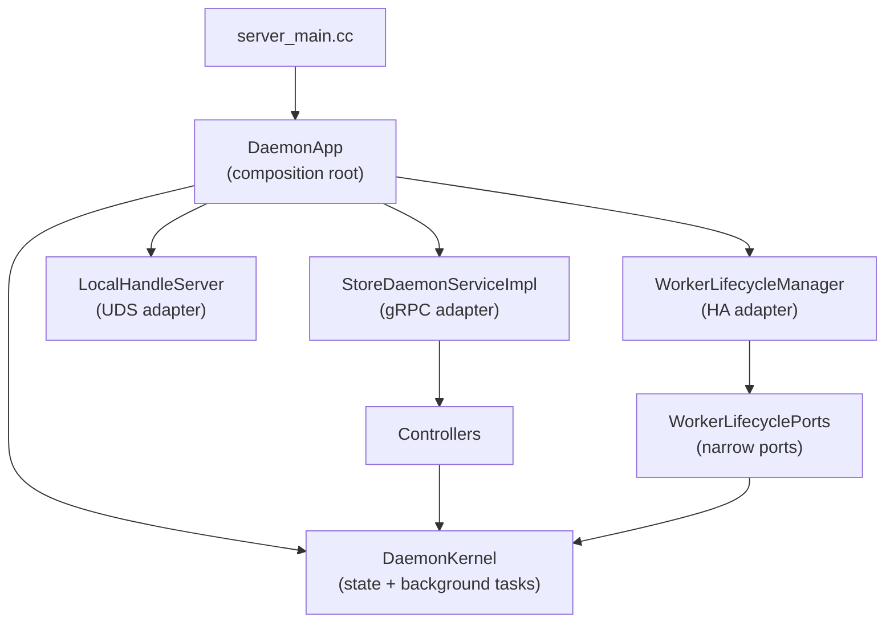

# Store Daemon

The Store Daemon is the data-plane service process that exposes a stable gRPC API over the C++ StoreEngine. It validates and routes requests, coordinates per-request orchestration, and tracks ephemeral state (sessions, PID refs, locks). It does not own domain invariants implemented in the engine.

- Binary: `//daemon:tensorcast_daemon`
- Public API: `../proto/tensorcast/daemon/v2/store_daemon.proto` (Python import: `tensorcast.proto.daemon.v2`).
- Deployment: see `../docs/deployment/store-daemon.md`

## What It Does

- gRPC surface for artifact loading, lifecycle, key mapping, and status.
- Orchestration via controllers with strong input validation and deadline handling.
- Ephemeral state management with TTL: sessions (`replica_uuid` → key + readiness), PID references, transport locks, verification tracking. Session joins are safe under retries: reusing a `replica_uuid` for a different `ReplicaKey` fails fast (`FAILED_PRECONDITION`) instead of silently overwriting state.
- Programmable control-plane RPCs for operation-scoped wait/cancel: `QueryReplicaStatus`, `WaitReplicaStatus` (unary long-poll), and `ReleaseReplica` operate on `replica_uuid` operation records (not replica identity).
- Placement pin RPCs (`CreatePlacementLease`, `RenewPlacementLease`, `ReleasePlacementLease`) expose daemon-owned placement pins behind a daemon-scoped capability token (`lease_token`) for renew/release.
- Retention handle RPCs (`AcquireRetentionHandle`, `RenewRetentionHandle`, `ReleaseRetentionHandle`) issue daemon-scoped, capability-tokenized handles that keep local stable DRAM rematerializable for a bounded TTL. Acquire fails fast with explicit errors if handle ID/token minting or lease creation fails (before stable cache admission). When the last handle is released/expired, the daemon downgrades stable retention intent so resources can be reclaimed. Metrics: `tc_retention_handles_active`, `tc_retention_bytes_charged`, `tc_retention_handles_expired_total`.
- Materialization supports explicit `lease_mode`; `NO_LEASE` is used for process-independent daemon-owned actions (prefetch/pinning) and disables PID-bound use leases / IPC handle lease minting.
- Local-only handle plane (Unix domain socket) for handle leases: exchanges CPU memfd FDs (`SCM_RIGHTS`) and releases `lease_token`s when client tensor views are destroyed. Handle leases are only minted for loopback/UDS gRPC callers; CPU shared-memory materialization is rejected for non-loopback peers. Config normalization defaults `engine.cpu_shared_memory.enabled=true` when omitted and auto-fills `engine.memory_tiers.stable_bytes=64MB` when CPU shared memory is enabled but stable bytes are absent. When `engine.cpu_shared_memory.enabled=true` and `lifecycle.handle_leases.local_handle_socket_path` is empty, the daemon auto-selects
  `<daemon_state_dir>/local_handle.sock` for same-pod/local SDKs (daemon_state_dir defaults to `$TENSORCAST_HOME/hosts/<host_id>/sessions/<session_id>/session` or `~/.tensorcast/hosts/<host_id>/sessions/<session_id>/session` and requires `TENSORCAST_INSTANCE`); if `TENSORCAST_INSTANCE` is not set, it falls back to `$TENSORCAST_HOME/hosts/<host_id>/runtime/daemons/<daemon_id>/local_handle.sock`. If the resulting path exceeds AF_UNIX length limits, the daemon falls back to `$TENSORCAST_HOME/uds/lh-<hash>.sock`. Set the socket path explicitly when daemon and client SDK run in different pods. Handle lease minting can be rate-limited via `lifecycle.handle_leases.max_mints_per_second` as a guardrail against buggy/abusive clients. Handle-lease TTL is disabled by default (PID-exit + explicit release); operators may enable TTL as a crash/bug backstop. Metrics: `tc_handle_leases_active_gauge`, `tc_handle_cpu_exports_active_gauge`.
- Event-driven background scheduling with a unified `SessionLifecycleTask` (sessions TTL, PID liveness, registration join TTL), plus Lock TTL and Verification tasks. The lifecycle manager exposes a schedule hook so the scheduler can be rescheduled immediately when the earliest deadline changes, minimizing expiry drift.
- Observability wrappers that attach unified metrics and tracing to each RPC.
- Handles view registration uploads (slice/transpose) without feature flags: `RegistrationController` streams view chunks to the StoreEngine and publishes view telemetry through Global Store (see [View Registration Telemetry](../docs/architecture/p2p-transfer-strategies.md#view-registration-telemetry)). Registration now requires `registration_kind` (`CANONICAL` or `PIECE`). Piece registrations are selection-only and reject transpose. The daemon computes deterministic `view_id` values from the canonical index + view spec when omitted and rejects mismatches when supplied.
- Supports assembly sealing (`SealAssembly`) and binding-aware reads: materialization resolves `assembly_id → mi2_id` when sealed, and piece registrations are rejected after sealing.
- Post-seal policies (`post_seal.*` config) can migrate cached views under the sealed `mi2_id`, enable proof-gated reuse
  of CGID-scoped views, and retire CGID-scoped pieces after seal to reclaim memory.
- Enforces routable advertisement when registering with Global Store; if `server.advertise.host` is set but non-routable, startup fails. Resolution prefers `server.advertise.host`, then a routable `server.listen.host`, then the outbound route IP to the configured Global Store endpoint, and finally the default interface IP. Startup fails if no routable IP can be determined, and the resolved advertise address is logged.
- HA registration/heartbeats require a stable `daemon_id` (auto-generated and persisted under `$TENSORCAST_HOME/hosts/<host_id>/runtime/daemon_id` when omitted, or explicitly configured) so Global Store can reconcile restarts and address changes without using address:port as identity.
- When `capability_directory.enabled=true`, HA registration/heartbeats publish daemon capability flags (retention handles, capability-token envelope) so brokers/controllers can discover compatible daemons.
- When `server.storage_path` is set, the daemon canonicalizes this root and requires all `disk_path` values (relative or absolute) to resolve under it. When `server.storage_path` is empty, disk materialization accepts absolute `disk_path` values only. The public SDK no longer supplies `disk_path` hints; disk paths are resolved internally from managed disk locations or explicit import RPCs.
- Trusted mounted-source resolve now runs through typed `public_disk_source` daemon config. By default, the daemon derives one trusted root policy from `server.storage_path` and rejects absolute mounted-source paths outside that root. If `server.storage_path` is empty, the compatibility default is absolute-path fallback with daemon-session-local `msa1:` attestation only.
- Immediate reclaim: when the last UseLease retires and no PlacementPins remain for a daemon-owned GPU replica, the lifecycle finalizer unloads the replica immediately (best-effort).
- Eviction consults lifecycle counters (use_count, placement_pins); request-level cache hints removed.
- Join TTL via leases: duplicate coalesced commits (`existed=true`) create a TTL-bound UseLease for the owner PID. On expiry, the lease finalizer drops the lightweight RefTracker ref and may reclaim memory immediately.
- Session keepalive: session principal TTL is tracked by the lifecycle manager via deadline guards instead of a standalone sweep.
- PID unwatch: when the last pid-bound guard retires, the monitor stops watching that PID (pidfd/epoll cleaned). The PID monitor’s polling fallback interval is configurable via service options (`proc_check_interval`).

## Disk Import Transition (Design 0077)

Daemon disk import is now import-only and reference-only:

- `ImportArtifactFromPath` + `ImportArtifactFromPathStream` are the only SDK-facing disk import contracts.
- Import performs registration only for payload bytes: no copy/link/reflink fallback. On first import, the daemon may
  persist metadata sidecars such as `artifact_descriptor.json` (and safetensors `tensor_index.json`) so later imports
  can reuse trusted multihashes without re-hashing the full artifact.
- Progress is stream-native with fixed phases and machine-readable `error_code`.
- Retrieval/materialization identity is `artifact_id`; clients do not supply disk paths for retrieval.

See `../docs/designs/0077-unified-reference-only-disk-import.md` and `../docs/plans/0077-unified-reference-only-disk-import.md`.

## What It Does Not Do

- Reimplement engine invariants: memory lifecycle, UMA ledger model, verification semantics. Transfer chunk-locking is removed (handled by UMA plan/commit and VS pin leases).
- Own long-lived cache policy is out of scope for the daemon. Eviction policies live below or behind explicit feature flags.
- Bypass the StoreEngine for data movement or memory management.
- Protocol changes are additive and guarded; no backward‑compat bridging layers are maintained.

## Layering and Boundaries

- App (composition root): constructs and wires subsystems; owns start/stop order for background tasks, UDS, gRPC, and HA.
- Service (gRPC): thin adapter that routes RPCs to controllers and maps `absl::Status` to gRPC.
- Controllers:
  - MaterializationController: `Materialize*`, `Confirm`, `WaitVerification`, `Unload`, `GetArtifactIndexById`.
  - RegistrationController: `Begin`/`Feed`/`KeepAlive`/`Commit`/`Abort`/`Revoke` (unified feed path).
  - TransportController: `LockTransportChunks`/`UnlockTransportChunks`.
  - StatusController: `GetServerConfig`, `GetWorkerStatus`, daemon-served directory RPCs
    (`ListDirectoryWorkers`, `ListDirectoryInstances`, `ResolveInstanceExecution`),
    `GetDetailedStatus`, `GetLoadedReplicasV2`.
- State/Kernel:
  - DaemonKernel owns long-lived state (sessions, registries, lifecycle, persistence, identity) and wires background tasks.
  - Runtime: BackgroundScheduler runs the unified `SessionLifecycleTask` for sessions/PID/join TTL, plus Lock TTL and Verification tasks, with “sleep until deadline or signal” semantics. PID liveness is event-driven via a `PidMonitor` (pidfd + epoll) with a `/proc` polling fallback when pidfd is unavailable.
- HA: WorkerLifecycleManager uses `WorkerLifecyclePorts` (identity, retire gates, shutdown, async runtime) and does not depend on gRPC internals.
- Engine: single source of truth for materialization orchestration, memory lifecycle, UMA ledger semantics, verification readiness.

## Interfaces (Public Surface)

- Loading: `ResolveKeyMapping` (control path), `MaterializeReplica`, `ConfirmReplica`, `UnloadReplica`, `WaitReplicaVerification`. Materialization requests are selection-first (`ArtifactSelection`), and responses include descriptor payloads derived from UMA view plans (offset/stride/byte-length) so exported buffer layouts match the planner.
- Region-backed loading: `MaterializeIntoTarget` streams bytes directly into client-registered CUDA regions with a coalesced `TargetLayout`. Canonical and view-indexed byte spaces are supported (including packed subset selection encoded in `selection.tensor_names`/`selection.view_subset_hash`); non-identity views must resolve a deterministic `selection.view_id` that matches `target_layout.view_id`. The daemon validates layout/device/region constraints, maps the IPC handles (single or ordered-concatenation multi-storage), and never allocates a daemon-owned replica or returns standalone publish authority. `PublishTargetReplica` now accepts only a `binding_current_value_publication_token` minted from an artifact-backed daemon-owned binding current value, and `RetirePublishedReplica` performs safe retire (GS drain + local cleanup), publication terminalization, and capability cleanup before overwrite with drain waits bounded by `drain_timeout_ms` across Global Store and local export drain. `DeregisterArtifact` accepts `ByteSpaceRef` to target canonical vs view replicas explicitly; for canonical byte-space it always attempts worker-scoped Global Store unregister for the resolved device after drain/revoke so a single deregister can fully retire stale routable records. `engine.progressive_replication` is disabled by default; when enabled together with Global Store progressive source eligibility, verified canonical byte-prefix coverage can be reported after successful materialization and `MaterializeIntoTarget` can claim progressive sources before falling back to ordinary complete-replica policy. The progressive path is canonical-full-byte-prefix v1 only, uses typed daemon/worker source domains, completes or retires durable assignments, and does not publish incomplete coverage as ordinary replica availability.
- Mapped region-backed loading: `MaterializeIntoMappedTarget` executes a copy plan (src range → dst range) into client-registered CUDA regions. v1 requires contiguous dst tensors, full dst coverage with no overlaps, and narrow-only views. The RPC is loopback/UDS-only; when selection carries view identity, the daemon forwards `VariantIdentity` so StoreEngine can prefer view-byte-space transport (`request_view_transport`) with canonical fallback. Mapped materialization does not mint publishable tokens; publishing must route through an artifact-backed daemon-owned binding current value.
- Byte-artifact batch ingress: `BatchExists` and `BatchTouchTtl` are ingress RPCs and require `gateway_ingress_enabled=true` for non-local callers. `BatchGetIntoRegion` and `BatchPutIfAbsentFromRegion` stay local-only and reuse the same validated caller-region boundary as region-backed materialization. Large remote payloads move over signed `payload_ref` transport via `FetchPayloadRefChunk`; `BatchGetIntoRegion` no longer exposes `preference` or `source_policy`.
- Disk fallbacks are daemon-owned: `ImportArtifactFromPathRequest.verify_checksums` controls import-time descriptor/index consistency checks, and disk materialization flows apply read-only source mutation policy for imported sources.
- Key mapping: `PublishReplicaKey`, `ResolveKeyMapping`, `GetArtifactIndexById`, `SealAssembly`.
- Plan ingress: `ExecutePlan` now serves the first `gateway_ingress_enabled`-gated `terminal_only` slice for local
  worker-targeted plans and returns a terminal `node_agent.v1.ExecutePlanResponse` envelope. Instance-targeted plans
  now resolve `instance_id -> execution_endpoint` through the daemon-served directory and forward to the Node Agent
  when the plan is compatible with one resolved instance target. The slice still fails closed on incompatible worker
  mixes, cluster targets, and non-terminal execution classes.
- Status: `GetServerConfig`, `GetWorkerStatus`, `GetDetailedStatus`, `GetLoadedReplicasV2` (paginated). `GetWorkerStatus`
  now carries daemon-side freshness metadata (`as_of_ms`, `staleness_ms`, `cache_epoch`, `freshness_state`), and
  `GetDetailedStatus.communication_info` reports cumulative P2P transfer counters (`total_transfers`,
  `total_bytes_transferred`, `total_transfer_errors`) sourced from daemon-side ingestion metrics.
- Directory: `ListDirectoryWorkers`, `ListDirectoryInstances`, and `ResolveInstanceExecution` expose the daemon-served
  routing contract for programmable callers. Responses carry `as_of_ms`, `staleness_ms`, `cache_epoch`,
  `freshness_state`, and `authority_mode`; in `LOCAL_ONLY` mode the daemon exposes only daemon-local facts, and in
  Global-Store-backed mode stale-beyond-budget reads fail closed.
- Transport: `LockTransportChunks`, `UnlockTransportChunks`.
- In-memory registration: `BeginRegisterArtifact`, `FeedRegisterArtifactStream`, `KeepAliveRegisterArtifact`, `CommitRegisteredArtifact`, `AbortRegisteredArtifact`, `RevokeRegisteredArtifact`.
- Local stable tier: `CommitRegisteredArtifact` can synchronously satisfy `stable_dram(scope=local)` based on the resolved `StorePolicy` and returns `local_stable_tier` (`READY`/`DEGRADED`/`SKIPPED`). `must` failures fail the RPC; `should` failures degrade. Metrics: `tc_local_stable_tier_total{op,status,requirement}`, `tc_local_stable_tier_seconds{op,status}`. See `../docs/architecture/api/registration-flow.md#local-stable-tier`.
- Persistence: `StartPersistence`/`QueryPersistenceStatus` run through a shard-aware persistence manager that resolves `StorePolicy` into must/should/may requirements, calls Global Store `PlanPlacement`, requests stable leases per shard target, acknowledges lease acquisition, registers remote replicas back to Global Store, and reports status. Tasks start from a daemon-owned stable-DRAM replica when present and fall back to an active LIP lease otherwise; routed byte-artifact claims also publish their current retained backing as an external persistence source so managed shared-disk persistence can later restore `policy_backed_path` visibility after local backing loss. Shards follow UMA chunking (128MB sharding threshold, 64–256MB shard caps); targets include the local node, any planned remotes, and an optional shared-disk leg that deduplicates by shard digest (skipped when the digest already exists on the daemon). Background ticks drive bounded lease retries with exponential cooldown, task state, and metrics (`tc_persist_tasks_active`, `tc_persist_errors_total`, `tc_persist_progress_ratio`). An append-only task log at `/tmp/tensorcast_persistence.log` (configurable via `Options.persistence_log_path`) is replayed on startup so in-flight persistence can resume/report after restart. The persistence manager reuses the Global Store client injected by `WorkerLifecycleManager` and is updated with the mutex-guarded `node_id` on registration so lease ACK/reporting carries the registered identity, and status reports are assembled under the persistence mutex then dispatched after releasing it so slow or failed Global Store RPCs cannot stall the scheduler loop. Query responses include shard targets and lease ids (index-aligned; empty lease_id means pending) alongside task-level progress/error/degraded fields; remote/shared-disk failures degrade or fail based on the resolved policy requirement. The persistence pipeline also updates a durability index (shared-disk/remote completion) that the stable DRAM cache uses to gate `overflow_policy=spill` eviction, and completed managed shared-disk tasks now act as the actionable control proof for routed byte-artifact `policy_backed_path` visibility (pure local stable retention still does not count). See `../docs/architecture/api/policy-persistence.md#startpersistence-and-querypersistencestatus`.
- Requests carry `SourcePolicy` (preference + allow flags), and the daemon resolves disk sources internally (managed shared-disk bindings or local import registry) while enforcing local-only gating for local imports.

Contract highlights:
- `Materialize*` returns after allocation with a CUDA IPC handle; clients must `ConfirmReplica` and may `WaitReplicaVerification`.
- `WaitReplicaStatus` is a unary long-poll: `timeout_ms=0` waits until the replica reaches a terminal state or the RPC deadline expires; `timeout_ms>0` bounds the server-side wait and is clamped to the RPC deadline.
- Key workflows resolve `key -> artifact_id` via `ResolveKeyMapping` before materialization; all data-path loads then use `MaterializeReplica`/`MaterializeIntoTarget`.
- `MaterializeReplica` shares the same LIP fast-path semantics; same-device denial from LIP is treated as a cache miss and falls back to the engine path rather than surfacing an RPC failure.
- `MaterializeIntoTarget` requires `selection.artifact_id`, accepts canonical or view-indexed layouts (including subset-packed and multi-storage coalesced targets), and can optionally verify external target writes when `engine.enable_external_target_verification=true`; verification failures poison the region and return `DATA_LOSS`. Progressive target reads require `engine.progressive_replication.enabled=true` and Global Store `worker_policy.progressive_replication.enabled=true`; they stop rather than silently mixing partial progressive writes with ordinary fallback once target bytes may be dirty.
- `MaterializeIntoMappedTarget` is a local-only RPC that validates copy-plan coverage before writing any bytes and rejects transpose/permutation views in v1. `selection.view_id` can be metadata-backed (from `selection.view_spec`) or an opaque mapped byte-space identity.
- Transport locks infer a unique device when `device_id` is absent; ambiguity returns `INVALID_ARGUMENT`.
- `UnloadReplica` surfaces detailed failure reasons (state/location/release status) via gRPC status messages so clients can
  diagnose unload failures without daemon-side logs.

### Variant Views

- `MaterializeReplicaRequest` carries `ArtifactSelection selection` and optional `placement` hint (`SERVER` for slice/min-byte, `CLIENT` for transpose). Non-identity transforms are encoded in `selection.view_spec` with deterministic `selection.view_id`, and selection identity is anchored on `selection.artifact_id`.
- When a non-identity view is requested, `MaterializeReplicaResponse` populates `view_index_json` (canonicalised layout for the requested ByteSpace) and `view_data_hash` when verification completes. For canonical disk-source loads, `view_index_json` is also filled from the artifact directory so clients can reconstruct tensors without querying Global Store.
- The controller collapses identity views to the canonical path, preserves LIP fast-path semantics, and forwards `VariantIdentity` into the StoreEngine so replica keys and telemetry track `(artifact_id, view_id)` tuples.
- When `post_seal.reuse_views_if_safe=true`, view requests for sealed assemblies may reuse CGID-scoped view replicas
  only after Global Store verifies proof-commitment equality for replicated tensors; otherwise the request fails with
  the original `NOT_FOUND` for the missing mi2-scoped view.

## Invariants and Guardrails

- Thin service: only validation, orchestration, status mapping. No duplicated engine logic.
- RAII for external resources (e.g., CUDA IPC) using the shared `core/cuda` IPC abstraction to prevent leaks and
  double-close.
- Canonical index rebuild mirrors the SDK path: storage-level offsets and lengths are emitted for every alias so tensor views dedupe across disk, coalesced VRAM, and LIP flows.
- TTL for every ephemeral map; all TTL updates and cleanup run under BackgroundScheduler.
- Consistent deadlines: user timeouts are clamped to RPC deadlines.
- Memory tiers: `engine.memory_tiers` drives stable/preemptible behavior; startup fails if configured `stable_bytes` exceed `(cgroup|MemTotal) - sum(pinned_memory.classes[].pool_bytes)`. Startup also performs a fail-fast available-memory admission check *before allocating pinned pools*: it requires `pinned_total + stable_bytes + headroom`, where `headroom = min(10% * (pinned_total + stable_bytes), 10GiB)` and availability is derived from cgroup v2 headroom when `memory.max` is set (treating `inactive_file` as reclaimable) or `/proc/meminfo` `MemAvailable` otherwise. For GPU ingest concurrency, startup also validates that `pinned_memory.classes[name=engine]` can cover at least one streaming session per detected GPU (`required_slices = engine.streaming_buffer_chunks * gpu_count`) and fails fast if undersized. Preemptible markings are skipped entirely when `enable_preemptible` is false. When HA is enabled, the daemon publishes `MemoryTierStatus` heartbeats via `MemoryTierService` using the UMA-backed `MemoryTierBudget` and replays `MemoryTierLease` state on startup/heartbeats (ListOutstandingLeases → UMA stable lease bind/release → ACK carrying artifact_id + chunk_ids + ledger_version for audit).
- In real CUDA mode with visible GPUs, startup also prewarms the NVRTC GPU-hash kernel on every device and fails fast if compilation or module load fails. GPU full-digest hashing no longer falls back to CPU in real CUDA mode.
- Observability is best-effort and never changes control flow; high-cardinality fields are gated. Background HA counters (heartbeat/sync) tolerate missing meters so registration and sync continue even when telemetry providers are unavailable.
- HA lifecycle loops are decoupled: the heartbeat thread only samples state and queues sync work, state sync runs in a separate loop (including memory tier maintenance), and the monitor only requests cancel when state sync exceeds its RPC-timeout budget, restarting after the thread exits to avoid overlapping syncs; per-RPC timeouts tune that budget.
- Idempotent unload and lock cleanup; expired tokens are unlocked automatically.
- Lease-in-place commits rebuild the canonical tensor index from the fed `storage_entries` and `tensor_aliases`, emitting `tc_register_storage_count` / `tc_register_tensor_count` metrics so rollouts can confirm dedupe efficacy.
- LIP segment alignment checks apply to logical artifact offsets (`LeasedSegment.artifact_offset`) and segment lengths; physical offsets (`StorageEntry.mapping_base_offset` / `LeasedSegment.storage_offset`) are only bounds-validated and may be unaligned (e.g., PyTorch sub-allocations).

## Directory Layout (What lives here)

- `app/`: composition root (`daemon_app.{h,cc}`), entrypoint (`server_main.cc`), shutdown drain test.
- `service/`: gRPC adapter (`grpc_service_impl.{h,cc}`), controllers (`service/controllers/*`), and RPC helpers (`rpc_context.h`, `grpc_span.h`, `grpc_metrics.h`, `replica_listing.h`).
- `ha/`: HA adapter (`worker_lifecycle_manager.{h,cc}`) and `worker_lifecycle_ports.h` for decoupled state access.
- `state/`: daemon kernel and state modules (`daemon_kernel.{h,cc}`, `shutdown_signal.h`, `worker_identity_store.{h,cc}`, `retire_gates.{h,cc}`),
  registries/lifecycle (`session_lifecycle.{h,cc}`, `pid_monitor.{h,cc}`, `replica_session_manager.h`, `sessions_service.h`,
  `ref_tracker.h`, `handle_lease_registry.{h,cc}`, `ipc_region_registry.{h,cc}`, `transport_lock_manager.h`,
  `verification_tracker.h`, `background_scheduler.h`, `sweep_tasks.h`, `persistence_manager.{h,cc}`, `local_handle_server.{h,cc}`).
- `util/`: shared helpers (`path_utils.{h,cc}`, `identity_utils.{h,cc}`, `deadline_utils.h`, `grpc_peer_utils.{h,cc}`, `status_utils.h`).
- `testing/`: shared daemon service harness for gRPC tests, plus the spawn-based `cuda_ipc_helper` used by CUDA IPC tests.
- `common/`: low-level safe syscall wrappers (`safe_sys.h`).

## Build, Run, Test

- Build binary: `bazel build //daemon:tensorcast_daemon`
- Launch with unified config: see `../docs/deployment/store-daemon.md`
- C++ tests: `bazel test //daemon:grpc_service_impl_registration_test` (and related `*_test.cc` in this directory)
- CUDA IPC tests spawn `//daemon:cuda_ipc_helper` via runfiles; when running outside Bazel, build it in `bazel-bin/daemon/`.

## Error Handling Conventions

- Use wrappers in `daemon/common/safe_sys.h` (e.g., `safe_epoll_add`, `safe_epoll_del`, `safe_eventfd_write/read`) instead of raw syscalls; they map errno to Status and treat expected cases (EEXIST/ENOENT) as OK.

These conventions improve observability while keeping best‑effort paths fast and non‑fatal.

## Key Links

- Architecture overview: `../docs/architecture/architecture-overview.md`
- Artifact views and retrieval: `../docs/architecture/artifact-views-and-retrieval.md`
- View replicas and assembly: `../docs/architecture/view-replicas-and-assembly.md`
- Model loading internals: `../docs/internals/model-loading.md`
- P2P transfer strategies: `../docs/architecture/p2p-transfer-strategies.md`
- Store Engine internals: `../core/store/README.md`
- Global Store internals: `../tensorcast/global_store/README.md`
- Deployment guide: `../docs/deployment/store-daemon.md`

---
This README captures “what and boundaries” of the daemon after the completed architecture and gRPC service refactor. It avoids leaking engine abstractions into the service layer and keeps responsibilities explicit for future evolution.
