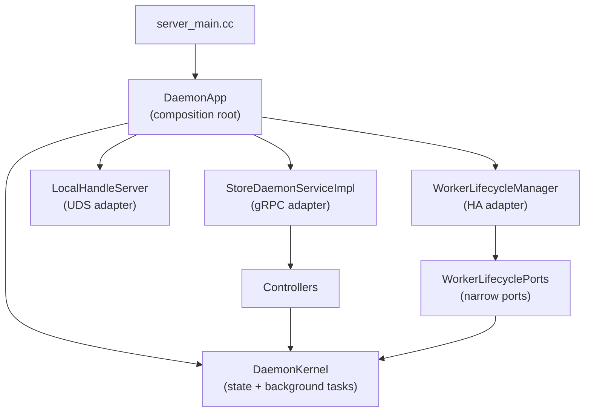

# Store Daemon

The Store Daemon is the data-plane service process that exposes a stable gRPC API over the C++ StoreEngine. It validates and routes requests, coordinates per-request orchestration, and tracks ephemeral state (sessions, PID refs, locks). It does not own domain invariants implemented in the engine.

- Binary: `//daemon:tensorcast_daemon`
- Public API: `../proto/tensorcast/daemon/v2/store_daemon.proto` (Python import: `tensorcast.proto.daemon.v2`).
- Deployment: see `../docs/deployment/store-daemon.md`

## What It Does

- gRPC surface for artifact loading, lifecycle, key mapping, and status.
- Orchestration via controllers with strong input validation and deadline handling.
- Ephemeral state management with TTL: sessions (`replica_uuid` → key + readiness), PID references, transport locks, verification tracking.
- Local-only handle plane (Unix domain socket) for handle leases: exchanges CPU memfd FDs (`SCM_RIGHTS`) and releases `lease_token`s when client tensor views are destroyed. Handle leases are only minted for loopback/UDS gRPC callers; CPU shared-memory materialization is rejected for non-loopback peers. When `engine.cpu_shared_memory.enabled=true` and `lifecycle.handle_leases.local_handle_socket_path` is empty, the daemon auto-selects
  `<daemon_state_dir>/local_handle.sock` for same-pod/local SDKs (daemon_state_dir defaults to `$TENSORCAST_HOME/hosts/<host_id>/sessions/<session_id>/session` or `~/.tensorcast/hosts/<host_id>/sessions/<session_id>/session`, auto-discovery relies on `TENSORCAST_INSTANCE`); set the socket path explicitly when daemon and client SDK run in different pods. Handle lease minting can be rate-limited via `lifecycle.handle_leases.max_mints_per_second` as a guardrail against buggy/abusive clients. Handle-lease TTL is disabled by default (PID-exit + explicit release); operators may enable TTL as a crash/bug backstop. Metrics: `tc_handle_leases_active_gauge`, `tc_handle_cpu_exports_active_gauge`.
- Event-driven background scheduling with a unified `SessionLifecycleTask` (sessions TTL, PID liveness, registration join TTL), plus Lock TTL and Verification tasks. The lifecycle manager exposes a schedule hook so the scheduler can be rescheduled immediately when the earliest deadline changes, minimizing expiry drift.
- Observability wrappers that attach unified metrics and tracing to each RPC.
- Handles view registration uploads (slice/transpose) without feature flags: `RegistrationController` streams view chunks to the StoreEngine and publishes variant telemetry through Global Store (see [Variant View Registration Telemetry](../docs/architecture/p2p-transfer-strategies.md#variant-view-registration-telemetry)).
- Enforces routable advertisement when registering with Global Store; if `server.advertise.host` is set but non-routable, startup fails. Resolution prefers `server.advertise.host`, then a routable `server.listen.host`, then the outbound route IP to the configured Global Store endpoint, and finally the default interface IP. Startup fails if no routable IP can be determined, and the resolved advertise address is logged.
- When `server.storage_path` is set, the daemon canonicalizes this shared disk root on startup and rejects `disk_path` inputs that escape it; when empty, disk materialization is disabled and `disk_path` inputs are rejected.
- Immediate reclaim: when the last UseLease retires and no PlacementPins remain for a daemon-owned GPU replica, the lifecycle finalizer unloads the replica immediately (best-effort).
- Eviction consults lifecycle counters (use_count, placement_pins); request-level cache hints removed.
- Join TTL via leases: duplicate coalesced commits (`existed=true`) create a TTL-bound UseLease for the owner PID. On expiry, the lease finalizer drops the lightweight RefTracker ref and may reclaim memory immediately.
- Session keepalive: session principal TTL is tracked by the lifecycle manager via deadline guards instead of a standalone sweep.
- PID unwatch: when the last pid-bound guard retires, the monitor stops watching that PID (pidfd/epoll cleaned). The PID monitor’s polling fallback interval is configurable via service options (`proc_check_interval`).

## What It Does Not Do

- Reimplement engine invariants: memory lifecycle, UMA ledger model, verification semantics. Transfer chunk-locking is removed (handled by UMA plan/commit and VS pin leases).
- Own long-lived cache policy is out of scope for the daemon. Eviction policies live below or behind explicit feature flags.
- Bypass the StoreEngine for data movement or memory management.
- Protocol changes are additive and guarded; no backward‑compat bridging layers are maintained.

## Layering and Boundaries

- App (composition root): constructs and wires subsystems; owns start/stop order for background tasks, UDS, gRPC, and HA.
- Service (gRPC): thin adapter that routes RPCs to controllers and maps `absl::Status` to gRPC.
- Controllers:
  - MaterializationController: `Materialize*`, `Confirm`, `WaitVerification`, `Unload`, `GetArtifactIndexById`.
  - RegistrationController: `Begin`/`Feed`/`KeepAlive`/`Commit`/`Abort`/`Revoke` (unified feed path).
  - TransportController: `LockTransportChunks`/`UnlockTransportChunks`.
  - StatusController: `GetServerConfig`, `GetWorkerStatus`, `GetDetailedStatus`, `GetLoadedReplicasV2`.
- State/Kernel:
  - DaemonKernel owns long-lived state (sessions, registries, lifecycle, persistence, identity) and wires background tasks.
  - Runtime: BackgroundScheduler runs the unified `SessionLifecycleTask` for sessions/PID/join TTL, plus Lock TTL and Verification tasks, with “sleep until deadline or signal” semantics. PID liveness is event-driven via a `PidMonitor` (pidfd + epoll) with a `/proc` polling fallback when pidfd is unavailable.
- HA: WorkerLifecycleManager uses `WorkerLifecyclePorts` (identity, retire gates, shutdown, async runtime) and does not depend on gRPC internals.
- Engine: single source of truth for materialization orchestration, memory lifecycle, UMA ledger semantics, verification readiness.

## Interfaces (Public Surface)

- Loading: `MaterializeByKey` (preferred), `MaterializeReplica`, `ConfirmReplica`, `UnloadReplica`, `WaitReplicaVerification`. Materialization responses include descriptor payloads derived from UMA view plans (offset/stride/byte-length) so exported buffer layouts match the planner.
- Region-backed loading: `MaterializeIntoTarget` streams bytes directly into a client-registered CUDA region when the SDK supplies a full coalesced `TargetLayout` (`layout_kind=LAYOUT_KIND_COALESCED_UNSPECIFIED`, `index_kind=INDEX_KIND_CANONICAL_UNSPECIFIED`, `tensor_spec_kind=TENSOR_SPEC_KIND_OFFSETS`) and `artifact_id`. The daemon validates layout/device constraints, maps the IPC handle, and never allocates a daemon-owned replica.
- Disk fallbacks honor `verify_checksums` on `DiskFallbackHint`/`MaterializeReplicaRequest` and propagate the flag into engine `MaterializeHints` so checksum/descriptor validation is enforced by default but can be disabled for local development.
- Key mapping: `PublishReplicaKey`, `ResolveKeyMapping`, `GetArtifactIndexById`.
- Status: `GetServerConfig`, `GetWorkerStatus`, `GetDetailedStatus`, `GetLoadedReplicasV2` (paginated).
- Transport: `LockTransportChunks`, `UnlockTransportChunks`.
- In-memory registration: `BeginRegisterArtifact`, `FeedRegisterArtifactStream`, `KeepAliveRegisterArtifact`, `CommitRegisteredArtifact`, `AbortRegisteredArtifact`, `RevokeRegisteredArtifact`.
- Local stable tier: `CommitRegisteredArtifact` can synchronously satisfy `stable_dram(scope=local)` based on the resolved `StorePolicy` and returns `local_stable_tier` (`READY`/`DEGRADED`/`SKIPPED`). `must` failures fail the RPC; `should` failures degrade. Metrics: `tc_local_stable_tier_total{op,status,requirement}`, `tc_local_stable_tier_seconds{op,status}`. See `../docs/architecture/api/registration-flow.md#local-stable-tier`.
- Persistence: `StartPersistence`/`QueryPersistenceStatus` run through a shard-aware persistence manager that resolves `StorePolicy` into must/should/may requirements, calls Global Store `PlanPlacement`, requests stable leases per shard target, acknowledges lease acquisition, registers remote replicas back to Global Store, and reports status. Tasks start from a daemon-owned stable-DRAM replica when present and fall back to an active LIP lease otherwise. Shards follow UMA chunking (128MB sharding threshold, 64–256MB shard caps); targets include the local node, any planned remotes, and an optional shared-disk leg that deduplicates by shard digest (skipped when the digest already exists on the daemon). Background ticks drive bounded lease retries with exponential cooldown, task state, and metrics (`tc_persist_tasks_active`, `tc_persist_errors_total`, `tc_persist_progress_ratio`). An append-only task log at `/tmp/tensorcast_persistence.log` (configurable via `Options.persistence_log_path`) is replayed on startup so in-flight persistence can resume/report after restart. The persistence manager reuses the Global Store client injected by `WorkerLifecycleManager` and is updated with the mutex-guarded `node_id` on registration so lease ACK/reporting carries the registered identity, and status reports are assembled under the persistence mutex then dispatched after releasing it so slow or failed Global Store RPCs cannot stall the scheduler loop. Query responses include shard targets and lease ids (index-aligned; empty lease_id means pending) alongside task-level progress/error/degraded fields; remote/shared-disk failures degrade or fail based on the resolved policy requirement. The persistence pipeline also updates a durability index (shared-disk/remote completion) that the stable DRAM cache uses to gate `overflow_policy=spill` eviction. See `../docs/architecture/api/policy-persistence.md#startpersistence-and-querypersistencestatus`.
- Requests carry `DiskFallbackHint` + `SourcePolicy` (preference + allow flags) so the daemon owns all disk reads and enforces local‑only gating.

Contract highlights:
- `Materialize*` returns after allocation with a CUDA IPC handle; clients must `ConfirmReplica` and may `WaitReplicaVerification`.
- `MaterializeByKey` performs key resolution and P2P-first loading with disk fallback inside the daemon; clients do not implement fallback.
- `MaterializeReplica` shares the same LIP fast-path semantics; same-device denial from LIP is treated as a cache miss and falls back to the engine path rather than surfacing an RPC failure.
- `MaterializeIntoTarget` requires canonical layouts and `artifact_id` in Phase 1, skips verification, and returns `DATA_LOSS` on post-start failures after poisoning the region to prevent reuse.
- Transport locks infer a unique device when `device_id` is absent; ambiguity returns `INVALID_ARGUMENT`.
- `UnloadReplica` surfaces detailed failure reasons (state/location/release status) via gRPC status messages so clients can
  diagnose unload failures without daemon-side logs.

### Variant Views

- `MaterializeReplicaRequest` accepts optional `view` (deterministic slice/transpose spec) or `view_id` along with a `placement` hint (`SERVER` for slice/min-byte, `CLIENT` for transpose). Requests using `view` require the canonical `artifact_id` so the daemon can normalise against canonical index v3.
- When a non-identity view is requested, `MaterializeReplicaResponse` populates `view_index_json` (canonicalised layout for the requested ByteSpace) and `view_data_hash` when verification completes. For canonical disk-source loads, `view_index_json` is also filled from the artifact directory so clients can reconstruct tensors without querying Global Store.
- The controller collapses identity views to the canonical path, preserves LIP fast-path semantics, and forwards `VariantIdentity` into the StoreEngine so replica keys and telemetry track `(artifact_id, view_id)` tuples.

## Invariants and Guardrails

- Thin service: only validation, orchestration, status mapping. No duplicated engine logic.
- RAII for external resources (e.g., CUDA IPC) using the shared `core/cuda` IPC abstraction to prevent leaks and
  double-close.
- Canonical index rebuild mirrors the SDK path: storage-level offsets and lengths are emitted for every alias so tensor views dedupe across disk, coalesced VRAM, and LIP flows.
- TTL for every ephemeral map; all TTL updates and cleanup run under BackgroundScheduler.
- Consistent deadlines: user timeouts are clamped to RPC deadlines.
- Memory tiers: `engine.memory_tiers` drives stable/preemptible behavior; startup fails if configured `stable_bytes` exceed `(cgroup|MemTotal) - sum(pinned_memory.classes[].pool_bytes)`, and preemptible markings are skipped entirely when `enable_preemptible` is false. When HA is enabled, the daemon publishes `MemoryTierStatus` heartbeats via `MemoryTierService` using the UMA-backed `MemoryTierBudget` and replays `MemoryTierLease` state on startup/heartbeats (ListOutstandingLeases → UMA stable lease bind/release → ACK carrying artifact_id + chunk_ids + ledger_version for audit).
- Observability is best-effort and never changes control flow; high-cardinality fields are gated. Background HA counters (heartbeat/sync) tolerate missing meters so registration and sync continue even when telemetry providers are unavailable.
- HA lifecycle loops are decoupled: the heartbeat thread only samples state and queues sync work, state sync runs in a separate loop (including memory tier maintenance), and the monitor only requests cancel when state sync exceeds its RPC-timeout budget, restarting after the thread exits to avoid overlapping syncs; per-RPC timeouts tune that budget.
- Idempotent unload and lock cleanup; expired tokens are unlocked automatically.
- Lease-in-place commits rebuild the canonical tensor index from the fed `storage_entries` and `tensor_aliases`, emitting `tc_register_storage_count` / `tc_register_tensor_count` metrics so rollouts can confirm dedupe efficacy.
- LIP segment alignment checks apply to logical artifact offsets (`LeasedSegment.artifact_offset`) and segment lengths; physical offsets (`StorageEntry.mapping_base_offset` / `LeasedSegment.storage_offset`) are only bounds-validated and may be unaligned (e.g., PyTorch sub-allocations).

## Directory Layout (What lives here)

- `app/`: composition root (`daemon_app.{h,cc}`), entrypoint (`server_main.cc`), shutdown drain test.
- `service/`: gRPC adapter (`grpc_service_impl.{h,cc}`), controllers (`service/controllers/*`), and RPC helpers (`rpc_context.h`, `grpc_span.h`, `grpc_metrics.h`, `replica_listing.h`).
- `ha/`: HA adapter (`worker_lifecycle_manager.{h,cc}`) and `worker_lifecycle_ports.h` for decoupled state access.
- `state/`: daemon kernel and state modules (`daemon_kernel.{h,cc}`, `shutdown_signal.h`, `worker_identity_store.{h,cc}`, `retire_gates.{h,cc}`),
  registries/lifecycle (`session_lifecycle.{h,cc}`, `pid_monitor.{h,cc}`, `replica_session_manager.h`, `sessions_service.h`,
  `ref_tracker.h`, `handle_lease_registry.{h,cc}`, `ipc_region_registry.{h,cc}`, `transport_lock_manager.h`,
  `verification_tracker.h`, `background_scheduler.h`, `sweep_tasks.h`, `persistence_manager.{h,cc}`, `local_handle_server.{h,cc}`).
- `util/`: shared helpers (`path_utils.{h,cc}`, `identity_utils.{h,cc}`, `deadline_utils.h`, `grpc_peer_utils.{h,cc}`, `status_utils.h`).
- `testing/`: shared daemon service harness for gRPC tests.
- `common/`: low-level safe syscall wrappers (`safe_sys.h`).

## Build, Run, Test

- Build binary: `bazel build //daemon:tensorcast_daemon`
- Launch with unified config: see `../docs/deployment/store-daemon.md`
- C++ tests: `bazel test //daemon:grpc_service_impl_registration_test` (and related `*_test.cc` in this directory)

## Error Handling Conventions

- Use wrappers in `daemon/common/safe_sys.h` (e.g., `safe_epoll_add`, `safe_epoll_del`, `safe_eventfd_write/read`) instead of raw syscalls; they map errno to Status and treat expected cases (EEXIST/ENOENT) as OK.

These conventions improve observability while keeping best‑effort paths fast and non‑fatal.

## Key Links

- Architecture overview: `../docs/architecture/architecture-overview.md`
- Model loading internals: `../docs/internals/model-loading.md`
- P2P transfer strategies: `../docs/architecture/p2p-transfer-strategies.md`
- Store Engine internals: `../core/store/README.md`
- Global Store internals: `../tensorcast/global_store/README.md`
- Deployment guide: `../docs/deployment/store-daemon.md`

---
This README captures “what and boundaries” of the daemon after the completed architecture and gRPC service refactor. It avoids leaking engine abstractions into the service layer and keeps responsibilities explicit for future evolution.
