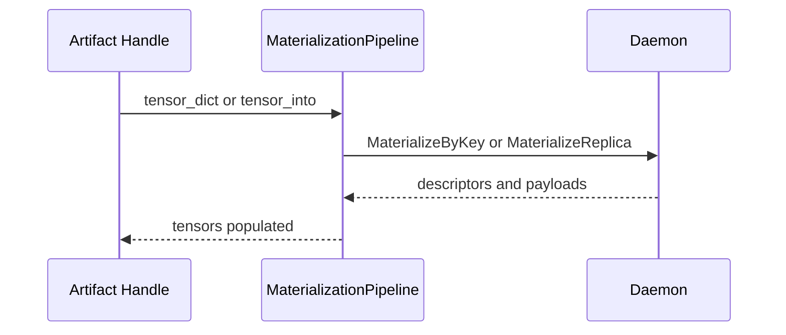

# Materialization Flow

This document describes how Artifact handles resolve metadata and materialize
replicas into tensors.

## Handle To Materialization Pipeline

`Artifact` handles are the public entry point. They call into
`MaterializationPipeline` to fetch or stream data.

- Handles preserve identifiers (`artifact_id`, `key`, `disk_path`) and attach
  fallback hints.
- The pipeline resolves the canonical index and then selects a materialization
  source based on policy and availability.

## Materialize By Key And By Replica

The daemon offers two primary retrieval paths:

- `MaterializeByKey` resolves key mappings, selects a source, and executes the
  transfer.
- `MaterializeReplica` targets a specific artifact id and device.

Both paths return descriptor metadata and payloads that the SDK uses to rebuild
PyTorch tensors.

## Fallback And Source Preference

`FallbackOptions.prefer` maps to daemon source hints:

- `auto` lets the daemon choose the best source.
- `local` disallows P2P and prefers local replicas.
- `p2p` allows remote replicas and staged transfers.
- `disk` prioritizes disk fallback and uses a disk path if available.

Disk reads remain daemon-owned and respect `verify_checksums`.

## Region Backed get_into

`get_into` may use a region-backed path when a full coalesced target layout is
provided. In this mode:

- The SDK sends a target layout and the daemon streams bytes into the mapped
  region.
- The daemon does not allocate a replica for the request.
- If validation fails and region-backed mode is `auto`, the SDK falls back to
  the replica path.

`GetArtifactOptions.region_backed_mode` selects `auto`, `require`, or `disable`
to control fallback behavior.

## View Retrieval

View requests carry a view spec and placement hint. The daemon can apply
transforms server-side and return view index bytes so the SDK can rebuild
correct tensor layouts.

## Materialization Sequence

## Code Map

- Artifact handle: `../../../tensorcast/api/store/artifact.py`
- Materialization pipeline: `../../../tensorcast/api/store/materialization.py`
- Daemon materialization controller: `../../../daemon/service/controllers/materialization_controller.cc`
- Materialization v2 proto: `../../../proto/tensorcast/daemon/v2/store_daemon.proto`
