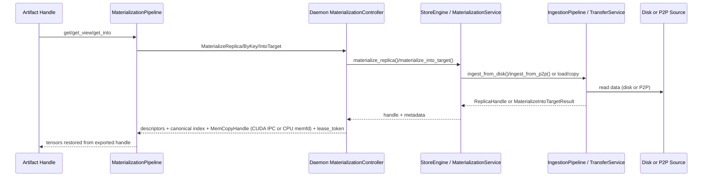

# Materialization Flow

This document describes how artifact materialization is implemented today, based
on daemon, StoreEngine, dataplane, and SDK code. It focuses on internal control
flow, data flow, state flow, and the CPU/GPU + transport mechanics.

Related docs:

- Public surface and fallbacks: [API Design](./api-design.md)
- Region-backed lifecycles and teardown: [Region-Backed](./region-backed.md)
- Error/retry semantics: [Error, Retry, Observability](./error-retry-observability.md)
- View semantics: [Artifact Views and Retrieval](../artifact-views-and-retrieval.md)

## Definitions and Payloads

- **Canonical index**: JSON mapping `tensor_name -> [logical_offset, logical_length, shape, stride, dtype, storage_offset]`.
  It defines the logical layout and is used to build payload descriptors. See
  `core/store/materialization/dataplane/metadata/canonical_index.h` for the stable format.
- **View id (`view_id`)**: Deterministic identity of a variant ByteSpace (see `docs/architecture/artifact-views-and-retrieval.md`).
  Non-identity views must have a resolved `view_id` so `ReplicaKey` disambiguation and variant verification apply.
- **View data hash (`view_data_hash`)**: Integrity hash of the realized view byte stream (post-transform). It is distinct
  from `view_id` and is not used as a subset identifier.
- **View subset hash (`view_subset_hash` / `ViewSubset.subset_hash`)**: Opaque raw digest bytes identifying a selection
  (e.g., sorted+unique `tensor_names`). These bytes must not be UTF-8/hex-string bytes; see
  `docs/architecture/artifact-views-and-retrieval.md` and `docs/architecture/api/region-backed.md`.
- **Replica**: An engine-managed memory instance backed by UMA/VS. It can be loaded
  into CPU and/or GPU memory states and exported via CUDA IPC handles (GPU) or a local CPU memfd handle (CPU).
- **Materialization**: Resolving an artifact reference (`artifact_id`/`key`)
  into GPU-visible tensors plus descriptors and canonical index bytes.
- **Handle lease (lease_token)**: An opaque daemon capability returned alongside the exported handle (CUDA IPC or CPU
  memfd). The SDK binds it to returned tensor lifetimes and releases it over the local handle plane.
- **Region-backed get_into**: A no-replica path that writes directly into a
  caller-provided CUDA region when the layout is coalesced and matches canonical.

## RPC Surface and Entry Points (v2)

The daemon exposes v2 materialization RPCs (see `proto/tensorcast/daemon/v2/store_daemon.proto`):

- `MaterializeReplica`: by `artifact_id`. Supports views.
- `MaterializeByKey`: resolves key mapping in Global Store, then materializes.
- `MaterializeIntoTarget`: region-backed `get_into` into an existing CUDA region.
- `ImportArtifactFromPath` / `ImportArtifactFromPathStream`: explicit local-only
  disk import that returns `artifact_id` + canonical index metadata for
  reference-only registration.
- `ConfirmReplica` / `WaitReplicaVerification`: readiness + verification waits.
- `GetServerConfig`: advertises `local_handle_socket_path` and `cpu_shared_memory_enabled` for lease-aware imports. When the socket path is unset in config, the daemon auto-selects
  `<daemon_state_dir>/local_handle.sock` for same-pod/local SDKs (daemon_state_dir defaults to
  `$TENSORCAST_HOME/hosts/<host_id>/sessions/<session_id>/session` or
  `~/.tensorcast/hosts/<host_id>/sessions/<session_id>/session`, auto-discovery relies on
  `TENSORCAST_INSTANCE`); if `TENSORCAST_INSTANCE` is not set, it falls back to
  `$TENSORCAST_HOME/hosts/<host_id>/runtime/daemons/<daemon_id>/local_handle.sock`. If the selected path exceeds AF_UNIX limits, the daemon falls back to `$TENSORCAST_HOME/uds/lh-<hash>.sock`. Set it explicitly for cross-pod deployments.

The SDK builds these requests in `tensorcast/api/_materialize.py` and
`tensorcast/api/store/materialization.py`.

## High-Level Control Flow

Key controller behavior lives in `daemon/service/controllers/materialization_controller.cc`.

## Source Selection and Fallback

### SDK preference mapping

`FallbackOptions` in the SDK drives a daemon `SourcePolicy` (preference +
allow flags) so local-only requests are enforced server-side:

- `prefer=auto` -> `SourcePreference=AUTO`, `allow_p2p=true`, `allow_disk=true`.
- `prefer=local` -> `allow_p2p=false`, `allow_disk=false`.
- `prefer=p2p` -> `SourcePreference=PREFER_P2P` (requires `artifact_id`).
- `prefer=disk` -> `SourcePreference=PREFER_DISK` (daemon resolves disk source
  from managed/shared-disk bindings or local import registry).
- `allow_p2p=False` disables P2P but still allows local replica reuse; disk is allowed unless `prefer=local`.

See `tensorcast/api/store/materialization.py` for the exact decision logic.

### Daemon control path (MaterializeReplica / MaterializeByKey)

1. **Validate inputs**: require `artifact_id` (or `key` for `MaterializeByKey`);
   `prefer_p2p` requires `artifact_id`; device UUID/ID must be valid.
2. **Resolve disk source internally**: when disk is allowed, the daemon chooses a
   managed shared-disk path or local-import source binding by `artifact_id`, and
   validates source fingerprints for local-import bindings before read.
3. **Disk descriptor checks**:
   - If `verify_checksums=true`, `artifact_descriptor.json` is required and
     validated against the computed index multihash.
   - If `verify_checksums=false` but disk is preferred, the daemon still checks
     that `tensor_index.(json|cbor)` exists.
   - When available, the daemon forwards descriptor + index metadata in
     `MaterializeHints.disk_metadata` so the ingestion pipeline can reuse
     canonical index bytes and multihash values without re-reading disk.
4. **LIP fast path** (local IPC):
   - If a local LIP lease exists and the target GPU is different, the daemon
     copies LIP segments into a new coalesced GPU buffer and returns a CUDA IPC
     handle (`daemon/state/lip_bridge.cc`, `daemon/state/lip_manager.cc`).
   - Same-device LIP is denied and falls back to the engine path.
5. **Engine path**:
   - Build `MaterializeHints` (verify mode, pinned timeout, source preference,
     typed disk-source selection, source policy allow flags, variant/view info).
   - Determine materialize mode:
     - Disk-only (no artifact_id, no prefer_disk) -> `LOAD_ONLY`.
     - Otherwise -> `AUTO`.
   - Call `StoreEngine::materialize_replica`.

### StoreEngine materialization service

`core/store/runtime/ingestion/materialization_service.cc` executes a priority
chain:

1. **Reuse existing replica**: if present, return handle with ready signal.
2. **Local CPU -> GPU copy** (AUTO): if CPU replica loaded, stream to GPU using
   pinned buffers and AsyncCopyManager.
3. **GPU peer copy** (COPY_ONLY): if a GPU replica exists, copy from it.
4. **Disk load** (LOAD_ONLY): ingest from disk; enforce descriptor for `mi2:` ids.
5. **AUTO orchestrator**: uses Global Store routing to request P2P transport, then
   falls back to disk if allowed (`core/store/materialization/control/materialize_orchestrator.cc`).

The orchestrator decides between disk/P2P using `SourcePreference`, allow flags,
and Global Store connectivity. It requests a transport session, ingests P2P when
allowed, then registers the replica back with Global Store.

## Ingestion Pipeline (Disk/P2P)

Materialization ingestion uses a structured pipeline in
`core/store/materialization/runtime/pipeline/ingestion_pipeline.cc`:

1. **MetadataStage**
   - Resolve canonical index from: `hints.variant.canonical_index_json`, disk
     `tensor_index`/safetensors, or Global Store.
   - If `hints.disk_metadata` provides canonical index bytes or multihash,
     reuse them directly and skip redundant disk reads.
   - Build view plans when a view spec is present.
2. **AllocationStage**
   - Build `ReplicaConfig`, create or reuse replica, allocate memory via UMA.
   - Load asynchronously and wait for LOADED state (with pinned timeout).
   - GPU loads may retry after eviction.
3. **VerificationStage**
   - Disk: compute full digest when requested or forced (e.g., safetensors) and
     verify descriptor multihashes. For reference-only imported sources, source
     mutation policy is read-only (no descriptor/index/verification writes).
   - P2P: validate `verification_json` key points when provided.
   - Compute view data hash when applicable.
4. **HandleStage**
   - Build `ReplicaHandle`, attach CUDA IPC handle and view index JSON if present.

## Data Plane: Loaders, Pump, and Sinks

Byte-range mapping and execution semantics are documented in `docs/internals/byte-range-mapping-and-execution.md`.

### Sources

- **DiskLoader** (`core/store/materialization/dataplane/loaders/disk_loader.cc`)
  - Scans `tensor.data` / `tensor.data_*` or `.safetensors` files.
  - Enforces descriptor/index presence for content-addressed (`mi2:`) disk loads.
  - Produces `FilePartitionSource` or Safetensors sources.
- **P2PLoader** (`core/store/materialization/dataplane/loaders/p2p_loader.cc`)
  - Uses `RemoteKeySource` (communicator read) and can mux in disk fallback.
  - `RemoteKeySource` supports RDMA direct write when enabled.

### Pump and streaming buffer

`core/store/materialization/dataplane/runtime/pump.cc` handles the transfer loop:

- Uses a **StreamingPinnedBuffer** to stage reads (per-session buffer pool).
- **Direct-write path**: if source supports direct write (RDMA) and sink is
  `DirectWriteCapable` (CPU/UMA sink), pump plans windowed VA grants and writes
  directly into destination VA ranges. On failure, it falls back to staged copy.
- **Staged path**: producer threads read from source into pinned buffers; a
  consumer writes into the sink. GPU sinks use async H2D copies (AsyncCopyManager)
  and return CopyHandles to overlap IO and DMA.

### Sinks

- **GpuMemorySink** (`core/store/materialization/dataplane/sinks/gpu_memory_sink.cc`)
  - Writes into GPU memory via AsyncCopyManager (H2D).
  - Enforces per-GPU scheduling limits (inflight bytes/copies).
  - Performs tail probes and logs on mismatches (debug mode).
- **CpuVaSink** (`core/store/materialization/dataplane/sinks/cpu_va_sink.cc`)
  - Writes into UMA-managed CPU VA ranges and keeps chunk metadata in sync.
  - Supports direct-write grants for RDMA paths.

## Memory Model and Copy Semantics

- **UMA/VS**: Replicas allocate via UMA; chunk state is tracked per device.
- **Pinned buffers**: Disk/P2P ingestion stages through pinned host memory
  (`StreamingPinnedBuffer`) to avoid pageable copies during H2D.
- **AsyncCopyManager**: GPU writes are scheduled asynchronously and awaited via
  CopyHandles; sink-level scheduling limits avoid GPU copy storms.
- **CUDA IPC (GPU)**: GPU materialization responses include a CUDA IPC handle plus a `lease_token`; the SDK maps it to
  a device pointer and reconstructs tensors via offsets, releasing the lease when tensor views are destroyed.
- **CPU memfd (CPU)**: CPU materialization responses include a `cpu_memfd` descriptor plus a `lease_token`. The SDK
  exchanges the token for the backing FD over the local handle plane (UDS + `SCM_RIGHTS`), mmaps it, reconstructs CPU
  tensors via offsets, and releases the lease token when the last tensor view is destroyed.
- **Replica states**: `UNALLOCATED -> ALLOCATED -> LOADING -> LOADED`, with a
  `ReadySignal` used for `ConfirmReplica` and session tracking.

## Views and Transform Placement

Views can be requested by spec (`ViewSpec`) or by ID (`view_id`):

- **Planning**: The daemon computes view plans from canonical index and view
  ops (`ViewPlanner`). Plans include selection ranges and optional transforms.
- **Identity**: If a request provides `view` but omits `view_id`, the daemon must resolve a deterministic `view_id`
  (non-identity views must never execute without one). Identity views fold to the canonical path (no `view_id`).
- **Placement**:
  - `TransformPlacement::kServer`: server applies transforms after load
    (`Replica::ensure_loaded_async` post-load hook).
  - `TransformPlacement::kClient`: server returns view index bytes; the client
    reconstructs tensors without server-side transform.
  - If a view includes transpose and placement is unspecified, the server
    defaults to client placement.
- **View hashes**: View data hashes are computed when available and propagated
  in handles for verification and caching.

## Region-Backed get_into (MaterializeIntoTarget)

Region-backed mode bypasses replica allocation and streams directly into a
CUDA region registered by the client:

- **SDK constraints** (`tensorcast/api/store/materialization.py`):
  - Requires `artifact_id`, CUDA contiguous tensors, matching dtype/shape/stride, and a
    coalesced layout over canonical or view-indexed ByteSpaces (including subsets).
  - Non-identity views resolve a deterministic `view_id`; multi-storage layouts must
    be ordered concatenations across registered regions.
- **Daemon validation**:
  - The RPC is **loopback/UDS only**; non-loopback peers are rejected before any write begins.
  - Requires `TargetLayout` with coalesced layout, canonical or view index kind,
    `vram_region_id` storages (single or ordered multi-storage), and a matching `view_id`
    when view transforms are requested.
  - Validates offsets and storage length against the selected index, plus optional
    `view_subset_hash` when provided.
- **Execution**:
  - The daemon maps the region via CUDA IPC, builds a segment or view plan from
    the selected index, and runs the same pump path into GPU memory.
  - Verification is explicitly skipped (`MaterializeHints::Verify::NONE`).
  - On DataLoss, the region is marked poisoned and the client unregisters it.

## Verification and Integrity

- **Disk verification**:
  - `verify_checksums=true` enforces descriptor validation and index/data
    multihash consistency.
  - `FULL_DIGEST` or forced digest (e.g., safetensors) computes data multihash
    directly from CPU/GPU memory after load.
  - `verification.json` can be generated or reused for key-point checks.
- **P2P verification**:
  - When Global Store provides `verification_json`, key-point verification runs
    against the loaded replica.
- **Client monitor**:
  - SDK spawns a background verification wait; failures can terminate the
    process (`os._exit(1)`), see `tensorcast/api/_materialize.py`.
- **Generation**:
  - The daemon computes a generation ID as the first 8 bytes of the SHA-256
    digest of canonical index bytes; used by SDK cache layers.

## Threading Model

- **Replica load** (`Replica::ensure_loaded_async`): schedules work on
  `AsyncRuntime::serial_executor()` and sets a `ReadySignal` on completion.
- **Transfer execution** (`ReplicaLoadController::load_async_from_source`):
  runs on `AsyncRuntime::blocking_executor()` and uses UMA plan/execute/commit.
- **Pump**: producer tasks run on the blocking executor; the consumer runs on
  the calling thread. GPU loads gate concurrency via per-GPU transfer limits.
- **SDK**: materialization calls are synchronous by default; `wait_for_completion`
  controls whether a ticket is returned for later confirmation.

## Code Map

- SDK pipeline: `tensorcast/api/store/materialization.py`
- SDK RPC wrapper: `tensorcast/api/_materialize.py`
- Daemon controller: `daemon/service/controllers/materialization_controller.cc`
- LIP fast path: `daemon/state/lip_bridge.cc`, `daemon/state/lip_manager.cc`
- Materialization service: `core/store/runtime/ingestion/materialization_service.cc`
- Ingestion pipeline: `core/store/materialization/runtime/pipeline/ingestion_pipeline.cc`
- Transfer and pump: `core/store/replica/transfer_service.cc`, `core/store/materialization/dataplane/runtime/pump.cc`
- Disk/P2P loaders: `core/store/materialization/dataplane/loaders/disk_loader.cc`, `core/store/materialization/dataplane/loaders/p2p_loader.cc`
- View planning: `core/store/materialization/dataplane/view/view_planner.cc`
- Region-backed controller: `daemon/service/controllers/materialization_controller.cc`
- Materialization contracts: `core/store/materialization/contracts/loading_spec.h`
