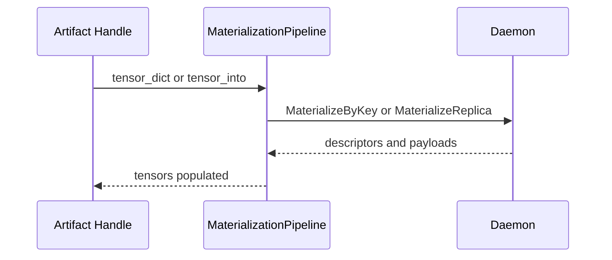

# Materialization Flow

This document describes how Artifact handles resolve metadata and materialize
replicas into tensors.

Related docs:

- Public surface and fallbacks: [API Design](./api-design.md)
- Region-backed lifecycles and teardown: [Region-Backed](./region-backed.md)
- Error/retry semantics: [Error, Retry, Observability](./error-retry-observability.md)

## What is “materialization”?

Materialization is the process of taking an **artifact reference** (artifact id,
key, and/or disk hint) and producing **concrete tensors** on a target device.

Why it is daemon-owned:

- P2P transfers require **dual-end transport locks** and consistent TTL
  extension semantics.
- Disk reads require **integrity verification** and uniform access control.
- The daemon can choose between sources (local replica, P2P, disk) using
  real-time availability and policy.

## Handle To Materialization Pipeline

`Artifact` handles are the public entry point. They call into
`MaterializationPipeline` to fetch or stream data.

- Handles preserve identifiers (`artifact_id`, `key`, `disk_path`) and attach
  fallback hints.
- The pipeline resolves the canonical index and then selects a materialization
  source based on policy and availability.

## Materialize By Key And By Replica

The daemon offers two primary retrieval paths:

- `MaterializeByKey` resolves key mappings, selects a source, and executes the
  transfer.
- `MaterializeReplica` targets a specific artifact id and device.

Both paths return descriptor metadata and payloads that the SDK uses to rebuild
PyTorch tensors.

### RPC surface (v2)

The SDK uses the v2 materialization RPCs for tensor payload descriptors:

- v2 proto: [proto/tensorcast/daemon/v2/store_daemon.proto](../../../proto/tensorcast/daemon/v2/store_daemon.proto)

v2 materialization returns canonical index bytes, payload descriptors, and an optional replica ticket.

## Fallback And Source Preference

`FallbackOptions.prefer` maps to daemon source hints:

- `auto` lets the daemon choose the best source.
- `local` disallows P2P and prefers local replicas.
- `p2p` allows remote replicas and staged transfers.
- `disk` prioritizes disk fallback and uses a disk path if available.

Disk reads remain daemon-owned and respect `verify_checksums`.

### FallbackOptions (fields and typical usage)

Type: [tensorcast/api/store/types.py](../../../tensorcast/api/store/types.py) (`FallbackOptions`)

| Field | Default | What it does | Notes |
|---|---:|---|---|
| `prefer` | `auto` | Source preference: `auto`/`local`/`p2p`/`disk`. | `local` also implies `allow_p2p=False`. |
| `disk_path` | `None` | A specific path to use for disk fallback. | Often set via `tensorcast.from_disk(...)`. |
| `allow_p2p` | `True` | Whether P2P is allowed as a source. | Used to enforce local-only deployments. |
| `verify_checksums` | `True` | Whether to verify descriptor/index checksums on disk reads. | Turning off is risky; mainly for debugging. |
| `replica_uuid` | `None` | Hint to reuse a prefetched replica ticket/uuid. | Primarily produced by `Artifact.prefetch()`. |

### GetArtifactOptions (per-operation knobs)

Type: [tensorcast/api/_config.py](../../../tensorcast/api/_config.py) (`GetArtifactOptions`)

These options influence *how* a materialization executes (timeouts, verification,
region-backed mode). Most applications won’t pass them directly, but they show up
in internal pipelines and in APIs like `Artifact.prefetch()`.

| Field | Default | What it does | Notes |
|---|---:|---|---|
| `pinned_allocation_timeout_ms` | `DEFAULT_PINNED_TIMEOUT_MS` | Upper-bound for daemon pinned allocation / staging setup. | Also used to derive verification monitor timeout. |
| `wait_for_completion` | `True` | If `False`, v2 materialization can return before transfer completes. | Used by prefetch/batching. |
| `enable_verification` | `True` | Starts a background daemon verification monitor. | If verification fails, the client process may exit (`os._exit(1)`); see [tensorcast/api/_materialize.py](../../../tensorcast/api/_materialize.py). |
| `region_backed_mode` | `auto` | Controls region-backed `get_into` attempt/fallback. | See below. |
| `prefer` | `auto` | Reserved knob mirroring `FallbackOptions.prefer`. | Current SDK preference selection is primarily driven by `FallbackOptions`. |
| `transport_hold_ms` | `None` | Reserved hint for transport/lease TTL extension. | Present for advanced deployments; may not be wired in all paths. |

Why verification can be “fail-fast”:

- It protects callers from silently using corrupted or incomplete payloads.
- It turns “integrity failure” into an unmistakable signal in production.

### Prefetch and replica reuse (why replica_uuid exists)

`Artifact.prefetch()` issues a materialization request with `wait_for_completion=False`
and returns a `PrefetchTicket` containing a `replica_uuid`. Subsequent reads can
reuse the prefetched replica by setting `FallbackOptions.replica_uuid`.

This pattern exists to:

- overlap “start transfer” with compute
- avoid re-selecting/duplicating replicas when the daemon has already allocated one

## Region-Backed get_into (MaterializeIntoTarget v2)

`get_into` may use a region-backed path when a full coalesced target layout is
provided. In this mode:

- The SDK sends a target layout and the daemon streams bytes into the mapped
  region.
- The daemon does not allocate a replica for the request.
- If validation fails and region-backed mode is `auto`, the SDK falls back to
  the replica path.

`GetArtifactOptions.region_backed_mode` selects `auto`, `require`, or `disable`
to control fallback behavior.

### Why region-backed exists

Region-backed `get_into` is a performance and memory-pressure tool:

- Avoids allocating a temporary replica buffer when the caller already has a
  correctly-sized target allocation.
- Reduces extra copy steps in “load directly into preallocated tensors” flows.
- Lets the daemon still enforce source selection and verification while writing
  into a caller-provided layout.

### Eligibility (what must be true)

The SDK enforces a strict “layout must match canonical” rule before attempting
region-backed mode. In particular, region-backed `get_into` requires:

- the request is by **artifact id** (not key) and has no view/view_id
- the request materializes the **full** canonical tensor set (no subsets)
- all target tensors are **CUDA**, **contiguous**, and match canonical dtype/shape/stride
- canonical layout is **coalesced** (segment offsets equal storage offsets)

When `region_backed_mode=require`, violations fail fast with `INVALID_ARGUMENT`
or `FAILED_PRECONDITION`. When `auto`, violations cause a recorded fallback and
the SDK uses the normal replica materialization path.

## View Retrieval

View requests carry a view spec and placement hint. The daemon can apply
transforms server-side and return view index bytes so the SDK can rebuild
correct tensor layouts.

## Materialization Sequence

## Code Map

- Artifact handle: [tensorcast/api/store/artifact.py](../../../tensorcast/api/store/artifact.py)
- Materialization pipeline: [tensorcast/api/store/materialization.py](../../../tensorcast/api/store/materialization.py)
- v2 RPC client wrapper: [tensorcast/api/_materialize.py](../../../tensorcast/api/_materialize.py)
- Daemon materialization controller: [daemon/service/controllers/materialization_controller.cc](../../../daemon/service/controllers/materialization_controller.cc)
- Materialization v2 proto: [proto/tensorcast/daemon/v2/store_daemon.proto](../../../proto/tensorcast/daemon/v2/store_daemon.proto)
