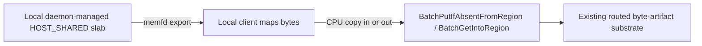
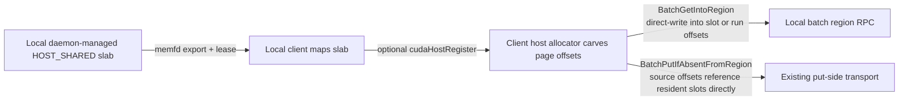
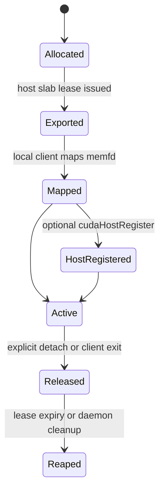
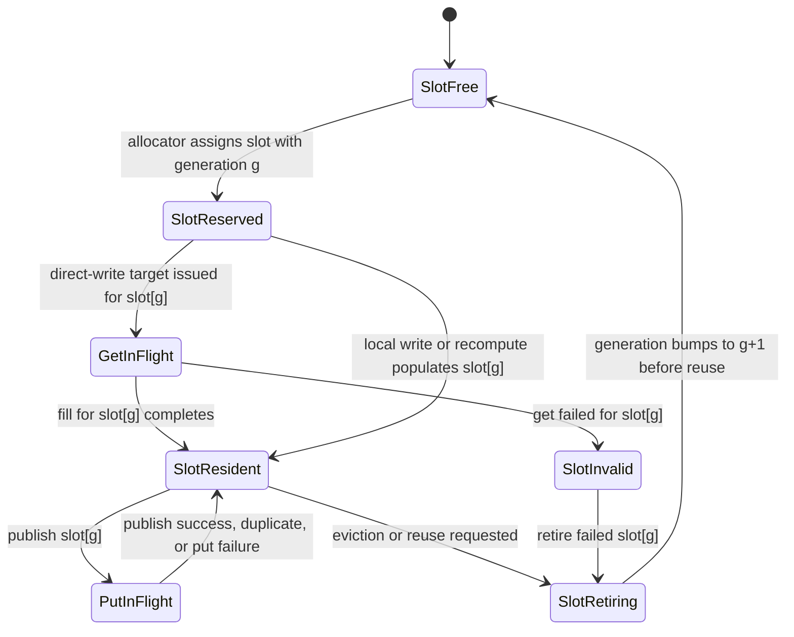

# Region Backed Registration

This document explains region-backed registration, lease reuse, and quiesced
cleanup flows.

Current status:

- the live implementation in this repo is still primarily `VRAM`-region-backed,
- the planned next step for byte-artifact batch ingress is to extend the same
  local-only region model to `HOST_SHARED`,
- that extension changes the local placement layer only; it does not change
  artifact identity, routed authority, or inter-daemon transport semantics.

Related docs:

- Public surface: [API Design](./api-design.md#region-apis)
- LIP registration internals: [Registration Flow](./registration-flow.md#lease-in-place-path)
- Region-backed `get_into` (different mechanism, same motivation): [Materialization Flow](./materialization-flow.md#region-backed-get_into-materializeintotarget-v2)
- View semantics and identity: [Artifact Views and Retrieval](../artifact-views-and-retrieval.md)
- Failure semantics: [Error, Retry, Observability](./error-retry-observability.md)
- Strategy-plane design: [0108 Tensor-Aware Materialization Strategy Plane](../../designs/0108-tensor-aware-materialization-strategy-plane.md)

## What is a region?

A region is a daemon-tracked local shared byte window with:

- one memory kind,
- one owner PID or local lifecycle authority,
- explicit bounds,
- and a TTL or lease-scoped lifetime.

Current live region kind:

- `VRAM`, backed by CUDA IPC handle bytes and tracked in `IpcRegionRegistry`.

Planned additional region kind for byte-artifact batch ingress:

- `HOST_SHARED`, backed by daemon-managed or otherwise locally shared host
  memory, typically exported through memfd plus the local handle plane.

Why regions exist:

- region-backed placement lets a caller and the local daemon agree on one
  mutable byte window without making that window part of artifact identity,
- regions amortize registration and safety checks across many item placements,
- many applications naturally manage slabs and offsets rather than one isolated
  allocation per artifact.

## What is a “VRAM region”?

A VRAM region is a daemon-tracked handle to a long-lived CUDA allocation (via
CUDA IPC handle bytes), scoped to:

- a specific GPU device
- an owner PID (for safety)
- a TTL (to prevent leaks)

Why this current live flavor exists:

- LIP registration requires CUDA IPC handles for client-owned VRAM.
- Creating or transporting handles per tensor or storage is expensive and
  error-prone.
- Many applications already allocate “slabs” and carve them into many tensors;
  region-backed registration turns those into offset-based references.

## Register VRAM Region

The SDK registers reusable CUDA IPC regions using:

- `RegisterVramRegion` RPC
- `Store.register_vram_region(...)` API

A region is scoped to a device and owner PID and is protected by TTL. The daemon
stores region metadata and handle bytes in `IpcRegionRegistry`.

This is the current live region-registration surface. The planned `HOST_SHARED`
extension should converge on the same conceptual model instead of introducing a
separate SGLang-only notion of a host buffer lease.

### RegisterVramRegionRequest (field reference)

Proto: [proto/tensorcast/daemon/v2/store_daemon.proto](../../../proto/tensorcast/daemon/v2/store_daemon.proto)

| Field | What it does | Why it exists |
|---|---|---|
| `session_id` | Optional client session tag. | Diagnostics and ownership correlation. |
| `device_id` | GPU ordinal for the region. | Validate/route IPC handle usage. |
| `cuda_ipc_handle` | CUDA IPC handle bytes for the base allocation. | The core “capability” the daemon needs to export/resolve. |
| `size_bytes` | Region size. | Bounds checks for offsets and storages. |
| `ttl_ms` | Region TTL. | Auto-cleanup in crash/leak scenarios. |
| `owner_pid` | Owner process id. | Prevent other processes from hijacking lifecycle. |
| `region_name` | Optional tag. | Operator-friendly debugging (e.g. “model_weights_slab”). |

Example:

```python
import tensorcast

tensorcast.init(mode="connect")
handle = tensorcast.register_vram_region(
    device_id=0,
    base_ptr=int(slab_ptr),
    size_bytes=slab_bytes,
    ttl_ms=60_000,
    name="weights_slab",
)
```

## Planned unified local region model

The planned evolution is a unified surface such as
`RegisterRegion(memory_kind=VRAM|HOST_SHARED)` or an equivalent API shape with
the same semantics.

Design intent:

- keep one local-only placement abstraction,
- widen the admissible memory kinds from `VRAM` to `VRAM | HOST_SHARED`,
- avoid making host-region support look like a one-off integration patch,
- preserve the existing trust boundary: only the local daemon may access the
  caller-visible region, and remote daemons never touch it directly.

Planned `HOST_SHARED` rules:

1. A `HOST_SHARED` region is still local-only and lease-scoped.
2. It carries explicit bounds and offset-based placement exactly like a VRAM
   region.
3. It is part of local placement only; it is not part of artifact identity or
   routed authority truth.
4. It may be realized as:
   - a daemon-managed exported host slab,
   - or another local shared-memory backing that fits the same region contract.
5. For GPU-friendly load-back, the local consumer may map the exported host
   bytes and perform one long-lived `cudaHostRegister` on its own mapping.
6. The preferred schema direction is one generic region reference rather than a
   host-specific storage-source field. In practice this means converging toward
   one `RegionRef { region_id, memory_kind }` style contract for both `VRAM`
   and `HOST_SHARED`.
   For allocator-backed Phase-B residency, the request must additionally carry
   a slot-lifetime token or equivalent fields sufficient to recover:
   - `slot_index`
   - `slot_generation`
   - `offset_bytes`
   - `length_bytes`
   The first safe rollout should preserve one logical slot token per KV page
   even if adjacent slots are later coalesced internally after validation.
7. Initial `HOST_SHARED` rollout should reject mixed `VRAM` and `HOST_SHARED`
   layouts in one request. Mixed-kind layouts are a separate follow-up.
8. `HOST_SHARED` correctness must not depend on host pinning. Long-lived
   `cudaHostRegister` is a performance policy for later load-back, not the
   semantic definition of a host region.
9. Ordinary batch-operation failure on a host slab should not automatically
   poison the whole slab. Whole-slab poison should be reserved for slab-level
   fatal faults such as invalid lease state, inconsistent mapping metadata, or
   another condition that makes the whole local mapping unsafe.
10. For allocator-backed Phase-B residency, one host `slot` is the ownership
    unit and typically corresponds to one KV page.
11. Allocator-backed slot reuse must be guarded by a monotonically increasing
    `generation` so stale completions or callbacks cannot write into a reused
    slot after the old lifetime has ended.

Planned phase-A host-staging flow for byte artifacts:



Planned phase-B zero-copy flow for host allocators:



Phase-B scope clarification:

- the primary zero-copy target in this phase is `BatchGetIntoRegion` writing
  directly into allocator-owned `HOST_SHARED` slots or contiguous slot runs,
- `BatchPutIfAbsentFromRegion` should also stop requiring an extra caller-side
  staging copy once the source already resides in the exported slab,
- but the current phase does not require a new CPU-source direct-RDMA export
  path for put; daemon-side put transport may continue to use the existing
  communicator/export realization until that follow-up optimization lands.

Allocator ownership rules:

- the caller owns per-slot allocation, pinning, and eviction policy,
- the daemon owns only slab lease validity, request validation, and execution
  against the caller-provided slot token,
- any slot targeted by `BatchGetIntoRegion` or used as a source for
  `BatchPutIfAbsentFromRegion` must remain pinned until the caller finishes
  processing the outcome,
- the caller must not bump `slot_generation` or recycle the slot until all
  in-flight refs for that slot have drained.

Planned host-region lifecycle:



Planned host-slab failure policy:

- scratch slabs may invalidate the current placement window on batch failure and
  continue serving later windows,
- allocator-backed residency slabs should invalidate only the affected page
  range or page slot on ordinary data-path failure,
- and only slab-level fatal faults should retire the entire exported slab and
  require re-export plus remap.

`SlotInvalid` semantics:

- `SlotInvalid` means the slot's current bytes are not trusted as a valid page
  for the current generation,
- it is entered for target-side fill failure, failed post-fill validation, or
  another corruption signal affecting the current lifetime,
- ordinary put-side transport failure does not by itself invalidate the local
  source slot because the source bytes were not overwritten,
- an invalid slot must not be surfaced as a hit, reused in-place, or rebound to
  a new logical page without retirement,
- retirement means removing any provisional visibility, waiting for in-flight
  refs to drain, bumping generation, and only then returning the slot to the
  allocatable pool.

Planned allocator-slot lifecycle:



Planned slab teardown order:

1. Stop admitting new slot allocations or new batch region RPCs for the slab.
2. Drain all in-flight slot refs owned by the caller.
3. Retire any remaining resident or invalid slots and remove their visibility.
4. Bump generation for each retired slot before it can re-enter `SlotFree`.
5. If host registration was enabled, `cudaHostUnregister(...)` the local
   mapping.
6. Unmap the memfd from the local process.
7. Release the slab lease so the daemon may reap the backing object.

Recommended operational policy for SGLang-like host allocators:

- export one long-lived slab per rank rather than one slab shared across all TP
  ranks,
- attach and map the slab once per rank process,
- reserve long-lived `cudaHostRegister` for allocator-backed residency slabs,
- and avoid keeping a separate GPU staging fallback path once the host-shared
  path becomes the active backend implementation.

### UnregisterVramRegionRequest (field reference)

Proto: [proto/tensorcast/daemon/v2/store_daemon.proto](../../../proto/tensorcast/daemon/v2/store_daemon.proto)

| Field | What it does | Notes |
|---|---|---|
| `region_id` | Region identifier returned by `RegisterVramRegion`. | Required. |
| `owner_pid` | Owner PID verification. | Safety: mismatches fail. |
| `force` | Best-effort release even if TTL expired. | Useful for cleanup; use with care. |

## Region Referenced LIP Storage

When LIP registration sees a storage fully covered by a registered region, the
SDK emits:

- `StorageEntry.vram_region_id`
- `StorageEntry.mapping_base_offset`

The lease segments then reference the storage id without attaching a per-storage
CUDA IPC handle. The daemon resolves region handles and holds refs for the
lifetime of the export.

Why “fully covered” matters:

- It lets the daemon validate that every byte the artifact needs is within the
  region bounds.
- It avoids a mixed mode where part of a storage would need a separate CUDA IPC
  handle (harder to reason about and easy to get wrong).

## Region-Backed get_into (MaterializeIntoTarget)

Region-backed `get_into` uses the same region registry but a different control
path from LIP registration. The daemon writes directly into existing CUDA
regions when the target layout is coalesced and matches the selected
byte-space (canonical or view-indexed). No replica is allocated.

Boundary note:

- This API is a local external-target front-door only (caller/instance-agent ->
  local daemon).
- Cross-node cache routing must not bypass this boundary: remote/home daemons
  never write directly into caller-visible local regions, whether `VRAM` or
  `HOST_SHARED`.

### SDK preconditions

The SDK enforces strict eligibility rules before invoking
`MaterializeIntoTarget`:

- `artifact_id` is required (key-based requests are rejected).
- Canonical or view-indexed selection supported, including packed subsets
  (`tensor_names`); non-identity views resolve a deterministic `view_id`.
- All target tensors must be CUDA, contiguous, and match the selected index dtype/shape/stride.
- Coalesced layouts may span multiple storages using ordered concatenation.
- Each storage must map into a registered region and cover its logical range.

These checks are implemented in `tensorcast/api/store/materialization.py` and
`tensorcast/api/_region_cache.py`.

### Daemon validation

The daemon validates the request and the layout strictly:

- The RPC is **loopback/UDS only**; non-loopback peers are rejected before any
  write begins.
- `TargetLayout` must be `LAYOUT_KIND_COALESCED_UNSPECIFIED` with
  `INDEX_KIND_CANONICAL_UNSPECIFIED` or `INDEX_KIND_VIEW`.
- One or more storage entries, each using `vram_region_id` and
  `mapping_base_offset`, ordered by concatenation.
- `tensor_spec_kind` must be offsets or alias format.
- Offsets/lengths must match the selected index entries (canonical or view),
  and `storage_offset` must equal logical offset within the concatenated layout.
- `storage_length` must cover the selected logical size.
- `device_uuid` and `pid` are required and must match the region device.
- When `INDEX_KIND_VIEW` is used, the daemon resolves a view plan and validates
  `target_layout.view_id` against the resolved `view_id` (empty for subset-only
  layouts). `view_subset_hash` is treated as raw digest bytes and must match
  the selected `tensor_names` when provided.

### Execution

Once validated, the daemon:

1. Acquires the region from `IpcRegionRegistry` and maps its CUDA IPC handle.
2. Computes the canonical index plan and materializes directly into the region
   via `StoreEngine::materialize_into_target`.
3. Skips external-target verification by default (`engine.enable_external_target_verification=false`);
   when enabled, the daemon hashes the target ByteSpace and compares against the
   expected mi2/view hash, poisoning the region on mismatch and emitting metrics
   for enabled/skipped verification.

For mapped-target region-backed writes, controller validation still owns all
local-only and poison/publication boundaries, but the runtime now lowers the
resolved copy contract through the `0108` strategy plane before falling back to
generic byte-range execution.

## Typed Strategy Config

Region-backed and mapped-target execution now share the same typed strategy
config under `engine.materialization_strategy`. In particular:

- `enable_tensor_aware_mapped_executor` controls whether the mapped strategy
  plane may choose tensor-aware executor ops,
- `enable_owner_file_collective` controls whether owner-file collective
  execution is eligible,
- `allow_mixed_execution` controls whether the runtime may mix specialized ops
  with residual byte-range fallback,
- `diagnostics_verbosity` controls strategy-plane observability in daemon logs.

On transfer `DataLoss`, the daemon marks the region as poisoned to prevent
reuse. The client then unregisters the region from its cache.

## Deregister Artifact

`DeregisterArtifact` performs a quiesced teardown for LIP replicas:

1. Quiesce new staged exports.
2. Drain active exports if `wait_for_drain=true`.
3. Revoke the commit lease if the owner matches.
4. Best-effort unregister from Global Store.
5. By default, also tombstone and delete any managed shared-disk copies for the artifact
   (set `keep_shared_disk_copy=true` to retain shared-disk persistence).

The SDK exposes this as `Store.deregister_artifact(...)` and returns a
`DeregisterArtifactOutcome` containing drain status and released region ids.

### DeregisterArtifactRequest (field reference)

Proto: [proto/tensorcast/daemon/v2/store_daemon.proto](../../../proto/tensorcast/daemon/v2/store_daemon.proto)

| Field | What it does | Notes |
|---|---|---|
| `artifact_id` | Target content-addressed artifact id. | Required. |
| `wait_for_drain` | Block until active staged exports drain (or timeout). | SDK surface: `wait=`. |
| `drain_timeout_ms` | Optional bounded wait timeout. | `0` uses daemon policy. |
| `extend_ttl_ms` | Optional TTL bump before quiesce. | Useful if lease TTL is close to expiring. |
| `owner_pid` | Optional PID check. | When present, mismatches fail with `PERMISSION_DENIED`. |
| `device_id` | Disambiguate when replicas span devices. | Avoid revoking the wrong resident replica. |
| `release_regions` | Release region references after deregistration. | Prevent ref leaks on long-running daemons. |
| `keep_shared_disk_copy` | Preserve managed shared-disk copies for this artifact. | Default is `false` (purge shared disk on deregister). |

## TTL Extension And Transport Hold

- `DeregisterArtifactRequest.extend_ttl_ms` extends TTL before quiesce.
- `GetArtifactOptions.transport_hold_ms` requests a TTL bump during transfers.

## Failure Modes

- Owner mismatch returns `PERMISSION_DENIED`.
- Expired regions behave as missing and return `NOT_FOUND`.
- Drain timeouts return `DEADLINE_EXCEEDED` and leave the artifact quiesced.
- The drain timeout bounds both Global Store drain waits and local export drain; total wait does not exceed the requested budget.

## Code Map

- Region registry: [daemon/state/ipc_region_registry.h](../../../daemon/state/ipc_region_registry.h)
- LIP manager: [daemon/state/lip_manager.cc](../../../daemon/state/lip_manager.cc)
- Daemon RPC wiring: [daemon/service/grpc_service_impl.cc](../../../daemon/service/grpc_service_impl.cc)
- SDK region cache: [tensorcast/api/_region_cache.py](../../../tensorcast/api/_region_cache.py)
- SDK APIs: [tensorcast/api/store/__init__.py](../../../tensorcast/api/store/__init__.py)
