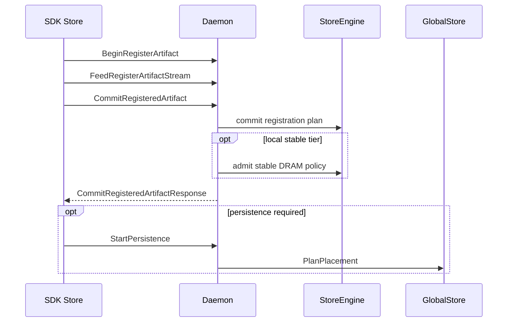

# Registration Flow

This document describes internal registration and upload flows implemented by
SDK, daemon, and StoreEngine.

## Registration Inputs And Canonicalization

- The SDK builds a tensor storage graph that de-duplicates storages and produces
  tensor aliases. See `tensorcast/api/_tensor_graph.py` and
  `tensorcast/api/_register.py`.
- Canonical index bytes and layout metadata are derived from the storage graph
  and used to build plans for registration.

## Begin, Feed, Commit

All registration paths use the same RPC lifecycle:

1. `BeginRegisterArtifact`
2. `FeedRegisterArtifactStream`
3. `CommitRegisteredArtifact`

The plan controls how the daemon interprets the payload and which memory tier is
committed.

## Lease In Place Path

`Store.register` uses the LIP plan and streams storage metadata plus lease
segments.

- Storage entries include `storage_id`, `storage_length`, and either a CUDA IPC
  handle or a region reference.
- Tensor aliases map logical tensors to storage entries.
- Lease segments reference storage entries and specify destination offsets.

Region-backed LIP is preferred when a storage is fully covered by a registered
VRAM region. The SDK emits `vram_region_id` and `region_base_offset` in
`RegisterStorage` and does not send per-storage CUDA handles in that case.

## Coalesced And Stable DRAM Paths

`Store.put` commits a stable DRAM replica. The daemon performs a coalesced or
stable DRAM commit and returns the descriptor and canonical hashes.

## View Registration

`Store.register_view` attaches a view spec and upload ranges. The daemon
rebuilds the canonical artifact from the view payload and returns canonical
coverage ranges in the commit response.

## Local Stable Tier

After commit, the daemon resolves `StorePolicy` and may satisfy the local stable
DRAM tier synchronously:

- `must` local stable failures fail the commit RPC.
- `should` local stable failures return a `local_stable_tier` result with
  `DEGRADED` and a message.
- `may` does not trigger admission.

Stable DRAM retention and overflow rules are enforced by
`StableDramCacheManager` in the StoreEngine.

## Outputs

The SDK returns `RegisteredArtifact` containing:

- `artifact_id` and canonical index
- `replica` info (plan, device, size)
- `lease` when LIP is used
- `local_stable_tier` result when policy requests local stable
- `persistence_task_id` when persistence is started

## Registration Sequence

## Code Map

- SDK registration: `../../../tensorcast/api/store/registration.py`
- Storage graph and LIP upload: `../../../tensorcast/api/_register.py`
- Daemon registration controller: `../../../daemon/service/controllers/registration_controller.cc`
- Policy resolution: `../../../daemon/store_policy_resolver.cc`
- Stable cache admission: `../../../core/store/components/stable_dram_cache_manager.*`
