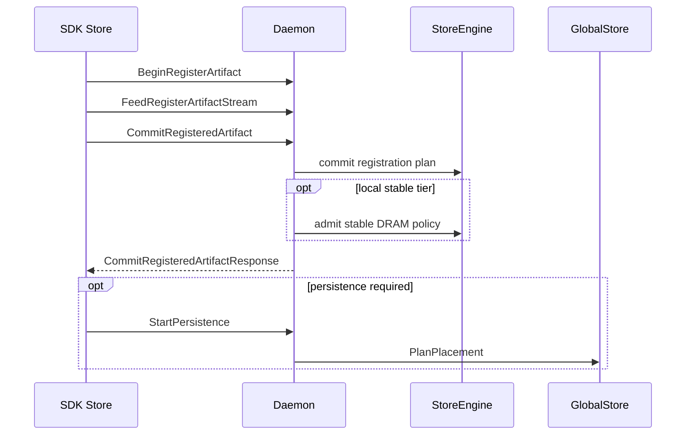

# Registration Flow

This document describes internal registration and upload flows implemented by
SDK, daemon, and StoreEngine.

Related docs:

- Public surface and caller contracts: [API Design](./api-design.md)
- Policy and what happens after commit: [Policy & Persistence](./policy-persistence.md)
- Region registration and teardown: [Region-Backed](./region-backed.md)
- View semantics and piece assembly: [Artifact Views and Retrieval](../artifact-views-and-retrieval.md)
- Failure modes and retry guidance: [Error, Retry, Observability](./error-retry-observability.md)

## What is “registration”?

Registration turns a caller-provided tensor dictionary into a daemon-tracked
artifact with:

- a **canonical index** (names → dtype/shape/stride → canonical byte layout)
- a **content-addressed artifact id** (`mi2:...`)
- optionally, an initial **replica** (stable DRAM) or an exported **lease** (LIP)
- optionally, a background **persistence task** (shared disk / remote stable)

Why it is split into a multi-step lifecycle:

- registration can involve **large payloads** (streaming is required)
- the daemon may need to **allocate resources** up-front (e.g. coalesced buffers)
- the system needs a clean cancellation/retry boundary (`AbortRegisteredArtifact`)

## Registration Inputs And Canonicalization

- The SDK builds a tensor storage graph that de-duplicates storages and produces
  tensor aliases. See [tensorcast/api/_tensor_graph.py](../../../tensorcast/api/_tensor_graph.py) and
  [tensorcast/api/_register.py](../../../tensorcast/api/_register.py).
- Canonical index bytes and layout metadata are derived from the storage graph
  and used to build plans for registration.

## Begin, Feed, Commit

All registration paths use the same RPC lifecycle (unary begin, streaming feed,
unary commit):

1. `BeginRegisterArtifact`
2. `FeedRegisterArtifactStream`
3. `CommitRegisteredArtifact`

The plan controls how the daemon interprets the payload and which memory tier is
committed.

### BeginRegisterArtifactRequest (what/why of each field)

Proto: [proto/tensorcast/daemon/v2/store_daemon.proto](../../../proto/tensorcast/daemon/v2/store_daemon.proto)

| Field | What it means | Why it exists |
|---|---|---|
| `device_id` | Target GPU device ordinal for the registration plan. | Tie allocations/handles to a specific device. |
| `total_size` | Total canonical bytes to register (aligned). | Allocate/validate buffers and enforce size invariants. |
| `ttl_ms` | Optional TTL for lease-based lifecycles. | Prevent leaked registrations/leases. |
| `owner_pid` | Required client PID for lease lifecycle. | Safety: ensure only the owner can keep-alive/revoke. |
| `client_artifact_id` | Optional client-provided identity. | Debugging / idempotency hooks; daemon remains authoritative. |
| `index` (`tensor_index_key` or `tensor_index_data`) | Canonical index bytes or a hash key referencing them. | Avoid resending large indices when deduplicated by hash. |
| `plan` (`coalesced`/`lease`/`stable_dram`) | Oneof selecting the realization plan. | Same high-level API, multiple data-plane strategies. |
| `policy` | `StorePolicy` declaration. | The daemon resolves placement/durability at commit time. |
| `view` | Optional view registration parameters. | Support `register_view` without a separate RPC surface. |

### FeedRegisterArtifactStreamRequest

The feed stream carries plan-specific payloads plus optional deduplicated
metadata tables.

| Field | Used by | What it does |
|---|---|---|
| `registration_id` | all plans | Correlates the stream with the begin session. |
| `lease_segments` | lease/LIP | Streams lease segments (handles + ranges) to build canonical bytes. |
| `view_chunk` | view registration | Streams view payload chunks into canonical offsets. |
| `storage_entries` | lease/LIP | Deduplicated storage table for handles/regions. |
| `tensor_aliases` | lease/LIP | Logical tensor metadata mapping names to storages/offsets. |

The `storage_entries` + `tensor_aliases` mechanism is what lets the SDK register
complex tensor dicts without repeating per-tensor CUDA IPC handle metadata.

#### StorageEntry / TensorAlias (LIP metadata tables)

Proto: [proto/tensorcast/daemon/v2/store_daemon.proto](../../../proto/tensorcast/daemon/v2/store_daemon.proto)

`StorageEntry` describes a backing storage segment (typically a CUDA allocation):

| Field | What it means | Notes |
|---|---|---|
| `storage_id` | Client-chosen identifier used for deduplication. | Must be unique within the registration stream. |
| `device_id` | GPU ordinal that owns this storage. | Used for validation and handle resolution. |
| `cuda_ipc_handle` | Inline CUDA IPC handle for the storage. | Mutually exclusive with `vram_region_id`. |
| `vram_region_id` | Reference to a previously registered VRAM region. | Used with `mapping_base_offset`. |
| `storage_length` | Length in bytes of the storage. | Bounds checks for aliases/segments. |
| `mapping_base_offset` | Base offset from the mapped handle to the start of this storage window (bytes). | For `cuda_ipc_handle`, this is the CUDA allocation offset (sub-allocation safe). For `vram_region_id`, this is the offset into the region mapping. |

`TensorAlias` maps logical tensors to storages and offsets:

| Field | What it means |
|---|---|
| `name` | Logical tensor name. |
| `storage_id` | Which `StorageEntry` backs the tensor. |
| `storage_offset` | Offset into the storage (bytes). |
| `logical_length` | Logical byte length for this tensor slice. |
| `shape`, `stride`, `dtype` | Tensor metadata used to reconstruct PyTorch tensors. |

#### LeaseSegments / LeasedSegment (LIP segment streaming)

`LeasedSegment` specifies how to populate the canonical coalesced layout:

| Field | What it means | Why it exists |
|---|---|---|
| `storage_id` | Reference to a `StorageEntry`. | Required: segments never inline CUDA IPC handles. |
| `storage_offset` | Offset into the referenced storage window (bytes). | Allows slicing a storage window (usually `0`). |
| `artifact_offset` | Destination offset in the canonical artifact layout (bytes). | Defines where the bytes land in the artifact. |
| `length` | Segment length (bytes). | Must match the referenced storage length for full-storage registrations. |

### CommitRegisteredArtifactResponse (caller-visible outcomes)

The commit response is the boundary where the artifact becomes addressable:

- `artifact_descriptor` contains the content-addressed artifact id and related metadata.
- `existed=true` indicates idempotent join of an existing local replica/lease.
- `local_stable_tier` reports whether synchronous local stable admission succeeded (see below).
- view fields (`view_id`, `canonical_ranges`, `registration_kind`) apply to view
  registrations.

## Lease In Place Path

`Store.register` uses the LIP plan and streams storage metadata plus lease
segments.

- Storage entries include `storage_id`, `storage_length`, and either a CUDA IPC
  handle or a region reference.
- Tensor aliases map logical tensors to storage entries.
- Lease segments reference storage entries and specify destination offsets.

Region-backed LIP is preferred when a storage is fully covered by a registered
VRAM region. The SDK emits `vram_region_id` and `mapping_base_offset` in
`StorageEntry` and does not send per-storage CUDA handles in that case.

### Region Referenced LIP Storage

This is the critical “why” behind region-backed registration:

- Per-storage CUDA IPC handles are relatively expensive to create/track.
- Many workloads register multiple artifacts that live inside a few long-lived
  CUDA allocations (e.g. model weight slabs).
- A **region handle** lets the daemon refer to stable CUDA IPC metadata once,
  then use cheap offsets for each storage entry.

See [Region-Backed](./region-backed.md) for `RegisterRegion(memory_kind=VRAM)`
and teardown.

## Coalesced And Stable DRAM Paths

`Store.put` commits a stable DRAM replica. The daemon performs a coalesced or
stable DRAM commit and returns the descriptor and canonical hashes.

## View Registration

`Store.register_view` attaches a view spec and upload ranges. The daemon
rebuilds the canonical artifact from the view payload and returns canonical
coverage ranges in the commit response.

## Local Stable Tier

After commit, the daemon resolves `StorePolicy` and may satisfy the local stable
DRAM tier synchronously:

- `must` local stable failures fail the commit RPC.
- `should` local stable failures return a `local_stable_tier` result with
  `DEGRADED` and a message.
- `may` does not trigger admission.

Stable DRAM retention and overflow rules are enforced by
`StableDramCacheManager` in the StoreEngine.

Why this is part of commit:

- local stable admission is a **purely local decision** (no GS dependency)
- callers often want “ready-to-use locally” semantics (fail fast if `must`)
- it provides a clean degraded vs failed signal when local memory is contended

## Outputs

The SDK returns `RegisteredArtifact` containing:

- `artifact_id` and canonical index
- `replica` info (plan, device, size)
- `lease` when LIP is used
- `local_stable_tier` result when policy requests local stable
- `persistence_task_id` when persistence is started

## Registration Sequence

## Code Map

- SDK registration: [tensorcast/api/store/registration.py](../../../tensorcast/api/store/registration.py)
- Storage graph and LIP upload: [tensorcast/api/_register.py](../../../tensorcast/api/_register.py)
- Daemon registration controller: [daemon/service/controllers/registration_controller.cc](../../../daemon/service/controllers/registration_controller.cc)
- Policy resolution: [daemon/state/store_policy_resolver.cc](../../../daemon/state/store_policy_resolver.cc)
- Stable cache admission: [core/store/components/stable_dram_cache_manager.h](../../../core/store/components/stable_dram_cache_manager.h)
