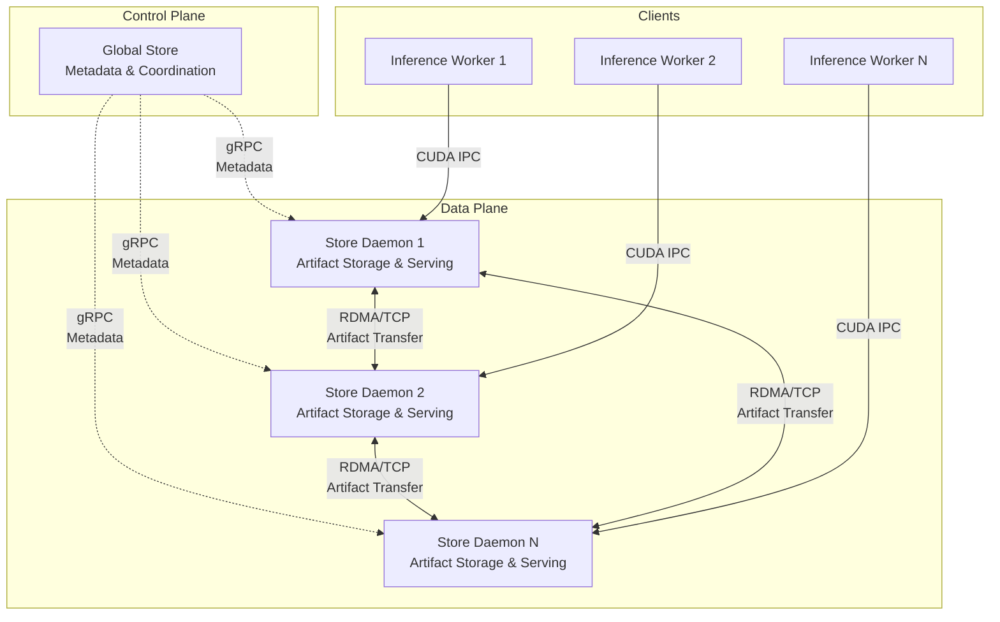

# Architecture Overview

This document provides a high-level overview of the distributed artifact storage system's architecture. For detailed information about specific components, please refer to the dedicated guides.

## System Architecture

The system comprises a control plane (Global Store), a data plane (Store Daemons), and clients (User Process Workers) working together to provide efficient artifact storage and serving across a cluster:



## Core Components

### 1. Global Store
**Role**: Centralized metadata service and coordination layer

- **Responsibility**: Manages artifact registry, replica locations **and per-chunk directory metadata**, coordinates transfers
- **Technology**: gRPC service with DuckDB persistence
- **Key Feature**: Artifact data never flows through Global Store — only metadata (including chunk directory)
- **Chunk Directory**: Tracks residency/state for every chunk across the cluster
- **Documentation**: [Global Store Development Guide](./global-store.md)

### 2. Store Daemon
**Role**: Distributed artifact storage and serving engine

- **Responsibility**: Stores artifacts locally, serves them to clients, handles P2P transfers
- **Technology**: C++ service with gRPC interface (high-performance StoreEngine core)
- **Key Feature**: Zero-copy GPU memory sharing via CUDA IPC
- **Implementation Notes**: Thin gRPC layer over `StoreEngine`; manages sessions, PID references, and transport locks; exports CUDA IPC handles to clients
- **Registration Path**: The RFC-0006 lifecycle (Begin → TTL → Commit/Abort) lives in the Runtime metadata stack (`core/store/runtime/metadata/registration_backend.*`), which maintains pending state, view ingestion, hashes, and emits registration events. `runtime::metadata::MetadataGateway` consumes those callbacks along with direct ingestion completions to publish replicas and variant metadata to Global Store without routing through `StoreEngine`, deduping auto-publish and synchronous calls via the shared `publish_context_id`.
- **Runtime Modules**: `RuntimeEnv` owns lifecycle wiring and worker identity; `RuntimeContext` initializes shared services plus the event dispatcher; `ReplicaRuntime` encapsulates replica lifecycle APIs; `IngestionRuntime` unifies ingestion + registration flows; and `MetadataGateway` is the only component touching the Global Store client. `StoreEngine` now delegates to these modules instead of manually orchestrating catalog/telemetry wiring.
- **Documentation**: [Store Daemon Architecture](../../daemon/README.md)

> See also: [Store Daemon (C++) Internals](../../daemon/README.md) — thin gRPC layer over the StoreEngine with session/ref tracking, transport locks, lifecycle management, and background sweepers.

### 3. User Process Worker
**Role**: PyTorch client process accessing artifacts

- **Interface**: Uses the handle-first facade (`tensorcast.artifact(...).tensor_dict` / `.tensor_into`) backed by the shared Store to request artifacts via daemon `MaterializeByKey` (RFC‑0017).
- **Memory Access**: Maps CUDA IPC handles for zero‑copy GPU access; falls back to RAM/DISK as needed
- **Lifecycle**: Confirms, references, and unloads replicas via daemon RPCs
- **Lazy Handles**: `tensorcast.artifact(...)` returns a store-bound handle that
  exposes metadata (`tensor_names`, `describe`) and selective tensor fetch; it
  surfaces `FAILED_PRECONDITION` if used after `Store.close()`.
- **Disk-backed Handles**: `tensorcast.from_disk(path)` routes through the
  daemon (`ResolveArtifactFromDisk`) so disk paths stay daemon-owned. The RPC
  enforces whitelist entries, validates descriptor multihashes when requested
  (`verify_checksums=true`), returns canonical index bytes + generation, and
  seeds the SDK cache with `{artifact_id, disk_path}` for reuse across
  materialization, views, and unloads.
- **Metadata Cache**: A process-wide `ArtifactCache` stores canonical indices
  (default TTL 600s, max 1000 entries) to avoid repeated daemon lookups.
  Tunables: `TENSORCAST_STORE_INDEX_CACHE_TTL_SECONDS`,
  `TENSORCAST_STORE_CACHE_MAX_ENTRIES`.
- **View Composition**: `.view()/.subset()/.slice()` derive child handles via a
  pure composer (no daemon RPCs) with per-handle view-index caches so repeated
  calls avoid recomputing planners.
- **Batching & Async**: `BatchContext` batches sync fetches; async
  `.tensor_async()`/`.tensor_dict_async()` coalesce via `MaterializationBatcher`
  on the store event loop.
- **Prefetch Tickets**: `prefetch(wait_for_completion=False)` returns a cloned
  handle plus a replica ticket. The clone carries the ticket’s
  `replica_uuid` hint while the original handle remains untouched; callers use
  the ticket to `wait()` or `cancel()` the staged replica before materializing.

## Key Design Principles

### 1. Separation of Control and Data Planes
- **Control Plane** (Global Store): Handles metadata, coordination, and decision-making
- **Data Plane** (Store Daemons): Handles actual artifact storage and high-speed transfers
- **Benefit**: Scalability and performance - metadata operations don't interfere with data transfers

### 2. Zero-Copy Artifact Serving
- Artifacts are loaded once into GPU memory by Store Daemon
- Multiple client processes access the same GPU memory via CUDA IPC handles
- Eliminates redundant memory copies and reduces GPU memory usage

### 3. Peer-to-Peer Artifact Transfers
- Artifacts transfer directly between Store Daemons
- Uses RDMA for high-speed transfers when available, falls back to TCP
- Global Store coordinates transfers but doesn't handle artifact data

### 4. High Availability
- Global Store uses persistent database for recovery
- Store Daemons can reconnect and resynchronize state
- System designed for eventual consistency
- **Documentation**: [High Availability Design](./high-availability-design.md)

## Artifact Load Paths (Key‑based)

### P2P‑first Loading (Preferred)
```
Client                                 Store Daemon                        Global Store
   |                                         |                                   |
   |-- MaterializeByKey(key, device, uuid) ->|                                   |
   |                                          |-- ResolveKeyMapping(key) ------->|
   |                                          |<----------- artifact_id ---------|
   |                                          |-- Request Transport ------------>|
   |                                          |<------ Transport Grant ----------|
   |                                          |   (RDMA/TCP transfer from peer) |
   |                                          |-- Complete Transport ----------->|
   |                                          |<------ Confirmation -------------|
   |<- ALLOCATED + CUDA IPC handle -----------|                                   |
```

### Disk Fallback
```
Client                                 Store Daemon                        Global Store
   |                                         |                                   |
   |-- MaterializeByKey(key, device, uuid) ->|                                   |
   |                                          |-- ResolveKeyMapping(key) ------->|
   |                                          |<-- artifact_id (+ disk_path) ----|
   |                                          |   (Load from local disk)         |
   |                                          |-- Register Local Replica ------->|
   |                                          |<------ Replica ID ---------------|
   |<- ALLOCATED + CUDA IPC handle -----------|                                   |
```

## Load Balancing & Concurrency
- Prioritization: GPU > RAM > DISK, then by per‑replica load ratio
- Each replica tracks `max_concurrency` and `current_requests`; selection is atomic
- Daemon enforces transport locks; engine limits per‑GPU active transfers (1/session)
- **Further reading**: [P2P Transfer Strategies](./p2p-transfer-strategies.md)

## VRAM Leased-In-Place (RFC‑0014)

LIP adds a replica mode where a producer process exposes its existing GPU memory to the daemon with a time‑bounded lease, avoiding copies into daemon‑owned VRAM at Commit.

- Registration: Begin with `LeaseOptions.in_place=true` and `owner_pid`; Commit computes `mi2:` by linearizing lease segments with PAD=0.
- Local consumption: same‑device consumers are rejected; cross‑device consumers are served via a D2D copy into a new coalesced replica on the target GPU.
- P2P: staged‑only (no direct MR on leased memory); sender stages GPU→host‑pinned buffers before network.
- Lifecycle: leases require KeepAlive at TTL/2 cadence post‑Commit; TTL expiry removes from selection; leases auto‑revoke when `owner_pid` exits.
- Verification: lightweight KEY_POINTS metadata is generated and stored at Commit for later offer attachment.

This preserves staged-only safety and the zero-copy invariant for daemon-owned coalesced replicas while enabling low-latency in-place sharing and fast cross-device replication.

## Store Session Observability

The Store client (Python SDK) follows [Design 0010](../designs/0010-opentelemetry-unified-observability-design.md) and exports OpenTelemetry signals for every verb:

- **Spans**: `Store/Register`, `Store/Put`, `Store/Get`, and `Store/GetInto` wrap daemon RPC sequences and carry low-cardinality attributes (`tc.store.daemon`, `tc.store.session_id`, `tc.store.status`, retry attempt counts, fallback decisions). Retry cycles add `store.retry` events so traces surface deadline churn without exploding span fanout.
- **Metrics**: Histogram `tc_store_operation_latency_seconds` plus counters `tc_store_operation_errors_total` and `tc_store_operation_retries_total` record latency, failures, and retry attempts per verb with `verb` and `daemon` labels. Metrics emit only when OpenTelemetry is configured, keeping zero-cost semantics otherwise.
- **Cardinality guardrails**: High-cardinality attributes (replica UUIDs, disk paths, request UUIDs) are filtered by default to keep backend cost predictable. Enable `TC_OTEL_ALLOW_HIGH_CARDINALITY_ATTRS=1` locally to debug with full attribute sets.

Keepalive activity and cancellation outcomes are captured inside the same spans so operators can correlate lease churn, fallback causes, and daemon retries on a single trace.

### Store Session Registry

The Python SDK persists lightweight session manifests under `~/.tensorcast/store_sessions/<session_id>.json`. Each file records the daemon endpoint, client PID, capabilities summary (`mem_pool_bytes`, `tx_slice_bytes`, transfer slice size), plus rolling counts of active leases and pending futures. Entries are refreshed whenever a verb executes, ensuring operators can audit abandoned leases or hung futures even if the client process exits unexpectedly.

Running `uv run tensorcast status` now prints this registry after the daemon health report:

```
$ uv run tensorcast status
...
==============================
Store Sessions
==============================
Session ID: 20251001-abcd
  Daemon Endpoint: 127.0.0.1:50052
  PID: 42281
  Status: ACTIVE
  Created: 2025-10-03 09:12:14
  Last Activity: 2025-10-03 09:15:41
  Active Leases: 2
  Pending Futures: 0
  Capabilities:
    mem_pool_bytes: 4294967296
    tx_slice_bytes: 67108864
    supports_coalesced: True
    supports_lease: True
```

Operators can prune stale entries manually or rely on the CLI output to identify orphaned sessions before triggering lease revocation from the daemon.

## Store Session Rollout & Backout

### Rollout procedure

1. **Stage the release**: Deploy the aligned Global Store migration, Store Daemon binary, and Python SDK wheel to staging. Check the triplet by running `uv run tensorcast --version` and confirm the staged daemon advertises the expected build in `uv run tensorcast status`.
2. **Run integration validation**: Execute `uv run pytest tests/python/test_register_lease_in_place_helper.py`, `uv run pytest tests/python/test_register_vram_leased_and_dvmp_stream.py`, and `bazel test //daemon:session_lifecycle_test --define=use_fake_cuda=true` against the staged environment. These suites cover lease timers, LIP flows, and daemon session lifecycle with the Store-centric API.
3. **Observe telemetry**: Monitor the OpenTelemetry metrics from [Design 0010](../designs/0010-opentelemetry-unified-observability-design.md) while gradually shifting traffic. Track `tc_store_operation_latency_seconds`, `tc_store_operation_errors_total`, and `tc_store_operation_retries_total` per verb in Grafana to ensure latency, error, and retry rates stay within historical limits.
4. **Promote to production**: Roll the SDK wheel to production workers and restart clients. Use `uv run tensorcast status` to verify Store sessions register with accurate lease counts before decommissioning any remaining legacy helper usage.
5. **Reference the release checklist**: Follow the detailed steps in the [Store Session Release Checklist](../deployment/store-session-release-checklist.md) to coordinate broader launches and communications.

### Backout procedure

- **Immediate revert**: If regressions appear, redeploy the previous SDK wheel and daemon binary from before the Store-session rollout. The persisted session manifests under `~/.tensorcast/store_sessions` are backward compatible and will be ignored by older clients.
- **Post-revert validation**: Re-run the integration suites above to confirm behaviour is restored, and watch `tc_store_operation_errors_total` to verify failure rates return to steady state.
- **Communication loop**: Notify downstream teams when rollout halts, capture the blocking issues, and resume after fixes pass staging validation.
