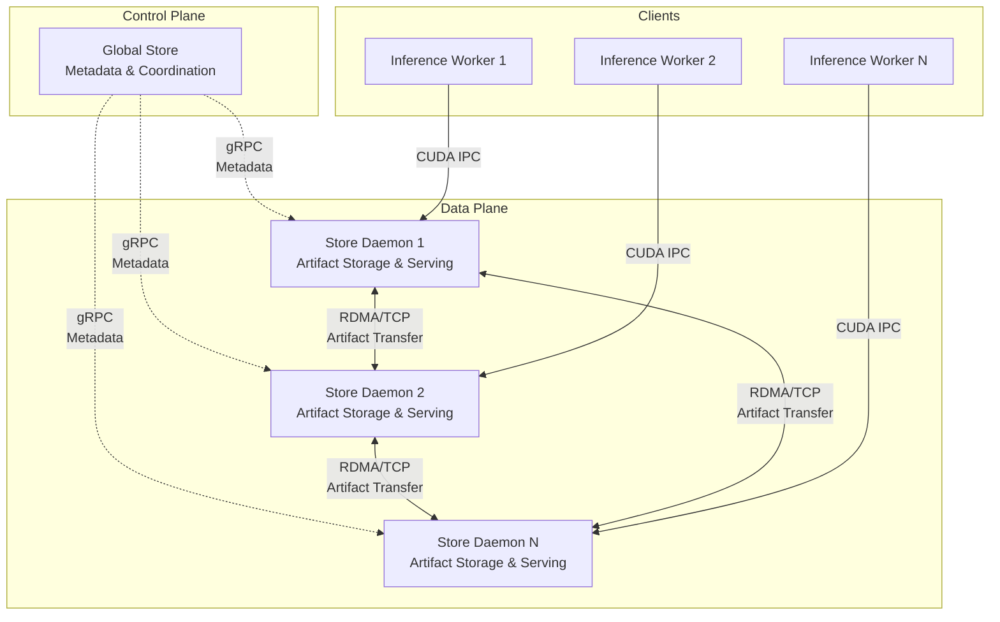

# Architecture Overview

This document provides a high-level overview of the distributed artifact storage system's architecture. For detailed information about specific components, please refer to the dedicated guides.

## System Architecture

The system comprises a control plane (Global Store), a data plane (Store Daemons), and clients (User Process Workers) working together to provide efficient artifact storage and serving across a cluster:



## Core Components

### 1. Global Store
**Role**: Centralized metadata service and coordination layer

- **Responsibility**: Manages artifact registry, replica locations **and per-chunk directory metadata**, coordinates transfers
- **Technology**: gRPC service with DuckDB persistence
- **Key Feature**: Artifact data never flows through Global Store — only metadata (including chunk directory)
- **Chunk Directory**: Tracks residency/state for every chunk across the cluster
- **Documentation**: [Global Store Development Guide](./global-store.md)

### 2. Store Daemon
**Role**: Distributed artifact storage and serving engine

- **Responsibility**: Stores artifacts locally, serves them to clients, handles P2P transfers
- **Technology**: C++ service with gRPC interface (high-performance StoreEngine core)
- **Key Feature**: Zero-copy GPU memory sharing via CUDA IPC
- **Implementation Notes**: Thin gRPC layer over `StoreEngine`; manages sessions, PID references, and transport locks; exports CUDA IPC handles to clients
- **Documentation**: [Store Daemon Architecture](../../daemon/README.md)

> See also: [Store Daemon (C++) Internals](../../daemon/README.md) — thin gRPC layer over the StoreEngine with session/ref tracking, transport locks, lifecycle management, and background sweepers.

### 3. User Process Worker
**Role**: PyTorch client process accessing artifacts

- **Interface**: Uses `tensorcast.api.get_artifact_sync(key, ...)` to request artifacts via daemon `MaterializeByKey` (RFC‑0017)
- **Memory Access**: Maps CUDA IPC handles for zero‑copy GPU access; falls back to RAM/DISK as needed
- **Lifecycle**: Confirms, references, and unloads replicas via daemon RPCs

## Key Design Principles

### 1. Separation of Control and Data Planes
- **Control Plane** (Global Store): Handles metadata, coordination, and decision-making
- **Data Plane** (Store Daemons): Handles actual artifact storage and high-speed transfers
- **Benefit**: Scalability and performance - metadata operations don't interfere with data transfers

### 2. Zero-Copy Artifact Serving
- Artifacts are loaded once into GPU memory by Store Daemon
- Multiple client processes access the same GPU memory via CUDA IPC handles
- Eliminates redundant memory copies and reduces GPU memory usage

### 3. Peer-to-Peer Artifact Transfers
- Artifacts transfer directly between Store Daemons
- Uses RDMA for high-speed transfers when available, falls back to TCP
- Global Store coordinates transfers but doesn't handle artifact data

### 4. High Availability
- Global Store uses persistent database for recovery
- Store Daemons can reconnect and resynchronize state
- System designed for eventual consistency
- **Documentation**: [High Availability Design](./high-availability-design.md)

## Artifact Load Paths (Key‑based)

### P2P‑first Loading (Preferred)
```
Client                                 Store Daemon                        Global Store
   |                                         |                                   |
   |-- MaterializeByKey(key, device, uuid) ->|                                   |
   |                                          |-- ResolveKeyMapping(key) ------->|
   |                                          |<----------- artifact_id ---------|
   |                                          |-- Request Transport ------------>|
   |                                          |<------ Transport Grant ----------|
   |                                          |   (RDMA/TCP transfer from peer) |
   |                                          |-- Complete Transport ----------->|
   |                                          |<------ Confirmation -------------|
   |<- ALLOCATED + CUDA IPC handle -----------|                                   |
```

### Disk Fallback
```
Client                                 Store Daemon                        Global Store
   |                                         |                                   |
   |-- MaterializeByKey(key, device, uuid) ->|                                   |
   |                                          |-- ResolveKeyMapping(key) ------->|
   |                                          |<-- artifact_id (+ disk_path) ----|
   |                                          |   (Load from local disk)         |
   |                                          |-- Register Local Replica ------->|
   |                                          |<------ Replica ID ---------------|
   |<- ALLOCATED + CUDA IPC handle -----------|                                   |
```

## Load Balancing & Concurrency
- Prioritization: GPU > RAM > DISK, then by per‑replica load ratio
- Each replica tracks `max_concurrency` and `current_requests`; selection is atomic
- Daemon enforces transport locks; engine limits per‑GPU active transfers (1/session)
- **Further reading**: [P2P Transfer Strategies](./p2p-transfer-strategies.md)

## VRAM Leased-In-Place (RFC‑0014)

LIP adds a replica mode where a producer process exposes its existing GPU memory to the daemon with a time‑bounded lease, avoiding copies into daemon‑owned VRAM at Commit.

- Registration: Begin with `LeaseOptions.in_place=true` and `owner_pid`; Commit computes `mi2:` by linearizing lease segments with PAD=0.
- Local consumption: same‑device consumers are rejected; cross‑device consumers are served via a D2D copy into a new coalesced replica on the target GPU.
- P2P: staged‑only (no direct MR on leased memory); sender stages GPU→host‑pinned buffers before network.
- Lifecycle: leases require KeepAlive at TTL/2 cadence post‑Commit; TTL expiry removes from selection; leases auto‑revoke when `owner_pid` exits.
- Verification: lightweight KEY_POINTS metadata is generated and stored at Commit for later offer attachment.

This preserves staged-only safety and the zero-copy invariant for daemon-owned coalesced replicas while enabling low-latency in-place sharing and fast cross-device replication.

## Store Session Observability

The Store client (Python SDK) follows [Design 0010](../designs/0010-opentelemetry-unified-observability-design.md) and exports OpenTelemetry signals for every verb:

- **Spans**: `Store/Register`, `Store/Put`, `Store/Get`, and `Store/GetInto` wrap daemon RPC sequences and carry low-cardinality attributes (`tc.store.daemon`, `tc.store.session_id`, `tc.store.status`, retry attempt counts, fallback decisions). Retry cycles add `store.retry` events so traces surface deadline churn without exploding span fanout.
- **Metrics**: Histogram `tc_store_operation_latency_seconds` plus counters `tc_store_operation_errors_total` and `tc_store_operation_retries_total` record latency, failures, and retry attempts per verb with `verb` and `daemon` labels. Metrics emit only when OpenTelemetry is configured, keeping zero-cost semantics otherwise.
- **Cardinality guardrails**: High-cardinality attributes (replica UUIDs, disk paths, request UUIDs) are filtered by default to keep backend cost predictable. Enable `TC_OTEL_ALLOW_HIGH_CARDINALITY_ATTRS=1` locally to debug with full attribute sets.

Keepalive activity and cancellation outcomes are captured inside the same spans so operators can correlate lease churn, fallback causes, and daemon retries on a single trace.
