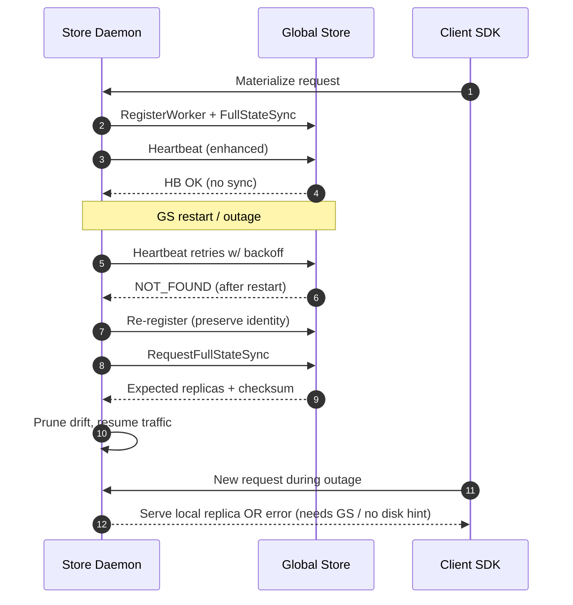

# High Availability — Developer Guide

## Overview

This document explains High Availability (HA) as implemented in code: startup recovery, enhanced heartbeat, state synchronization, and daemon lifecycle behavior. It links directly to source files and proto definitions used in production.

## TODO

- Add persistence-task durability/resume plan for distributed persistence (daemon-local journal + recovery flow). See `docs/architecture/api/policy-persistence.md` for the current model.

## Key Components (sources)

- Global Store
  - Recovery/state sync service: `tensorcast/global_store/services/recovery_service.py`
  - gRPC surface (registration, heartbeat, sync, health): `tensorcast/global_store/grpc_service.py`
- Store Daemon (C++)
  - Lifecycle + heartbeat + sync + drift eviction: `daemon/ha/worker_lifecycle_manager.cc`
  - Global Store client + retries/backoff: `core/store/components/global_store_client.{h,cc}`
  - HA wiring + endpoint selection: `daemon/app/server_main.cc`
- Protocol buffers
  - Enhanced heartbeat and sync: `proto/tensorcast/global_store/v1/global_store.proto`

Materialization HA invariant: v2 descriptor streaming in the daemon uses UMA view plans when a view is requested and always routes disk fallbacks through `DiskFallbackHint` (including `verify_checksums`). SDKs never read disk directly for retrieval, so selective tensor loads and disk-sourced replicas share the same daemon-managed buffer layout.

## Registration & Identity

- The daemon must advertise a routable address (non-loopback, non-unspecified). `server.advertise.host` overrides `server.listen.host`; `RegisterWorker` rejects loopback/unspecified IPs.
- `daemon_id` is required and is the stable identity used for Global Store registration; when omitted in config it is auto-generated and persisted under the host-scoped runtime root. `worker_id` is an assigned row id and may change across re-registrations.
- HA requires `server.p2p_listen.port` to be non-zero; startup aborts otherwise.
- Recovery registration preserves `worker_id` when possible and always requests a state sync; stale replicas owned by the previous worker id are reassigned or marked unavailable.

## Startup Recovery (Global Store)

On startup the Global Store runs a guarded recovery pass; state stays marked stale until workers re-confirm via registration or heartbeat.

- `RecoveryService.initiate_recovery` short-circuits if already running so only one pass executes.
- The pass validates the DuckDB backing store, marks every worker and replica as stale, preserves persisted state versions/checksums, and records the recovery timestamp.
- Keeping the stale flag forces each daemon to re-register and re-sync before it can serve traffic, ensuring registry drift does not leak into routing.

## Enhanced Heartbeat

Heartbeats are always enhanced and must include a non-zero `state_version` so the Global Store can detect drift. Legacy heartbeats (`state_version == 0`) are rejected.

- Request payload: worker id, available memory, acceptance flag, current `state_version`, computed `state_checksum`, the set of registered artifact ids (publishable + resident only), last successful sync timestamp, daemon→Global Store connection status, and `capability_flags` (bitset) when capability directory publishing is enabled.
- Global Store handling (`grpc_service._handle_enhanced_heartbeat`):
  - Compares the sent version with the persisted `state_version` and compares the worker checksum with the cached global checksum (recomputed only when missing).
  - Marks `state_sync_required` when versions or checksums diverge, or when obsolete replicas are detected.
  - Returns the server timestamp, the expected version, and the list of obsolete replicas (diagnostic only; daemons use it to request a sync, not to unload directly).
  - Updates `capability_flags` only when the value changes to avoid per-heartbeat writes.
- Registration initializes each worker’s `state_version` to 1; the daemon seeds its local `state_version` from `RegisterWorkerResponse.expected_state_version` and treats missing/zero versions as an error.
- Daemon behavior (`WorkerLifecycleManager` + `GlobalStoreClient`):
  - Collects publishable, resident replicas, computes a checksum, and calls `send_heartbeat_enhanced`.
- Heartbeat is lightweight and only queues sync work; state synchronization runs in a separate loop with a single in-flight sync, and the monitor requests cancel only when progress exceeds the configured RPC-timeout budget, restarting after the thread exits to avoid overlap.
  - If the RPC returns `NOT_FOUND` while the channel is healthy, the daemon re-registers with the preserved identity and triggers a full-state sync before resuming heartbeats.

## State Synchronization

When `state_sync_required` is returned (or the daemon detects its version/checksum diverged), the daemon submits its full inventory through `SynchronizeWorkerState`.

- Global Store computes diffs with “addition over removal” semantics: additions are always applied, removals are only applied when the daemon provided a non-empty inventory to avoid deleting during partial reports.
- Synchronization applies changes transactionally and only bumps `state_version` + checksum when all changes succeed.
- No-op sync keeps the version and refreshes the persisted checksum if it is stale.
- The daemon stores the returned version and checksum so subsequent heartbeats can short-circuit unnecessary syncs.
- `StateChange` removals are applied per replica key `(artifact_id, memory_type, device_id)` so GPU/CPU tiers are reconciled independently.
- The daemon’s inventory is publishable + resident only; non-resident replicas are never mapped to DISK.
- `StateChange` removals enqueue a safe-retire flow; unload happens only after ref counts, use leases, placement pins, and transport locks clear.
- `StateChange` updates propagate endpoint metadata drift (node address/port, memory size, and transport keys when reported) so routing stays accurate.
- Checksum parity: both sides compute a stable FNV-1a hash over a sorted inventory of `(artifact_id, node_id, node_address, node_port, memory_type, device_id, availability)`. Order never changes the checksum, and availability or endpoint drift intentionally mutates it to trigger reconciliation.
- Authoritative empties: when `high_availability.force_full_sync_on_empty_inventory=true`, an empty inventory is treated as authoritative and removals are applied (for drains/retirements). Default keeps the conservative behavior (empty = “unknown”, no removals).

## Full-State Sync

The daemon requests the authoritative replica set after cold start, re-registration, or when drift is suspected. Full-state sync returns the current checksum and expected set without bumping versions (and refreshes the cached checksum if stale).

- `request_full_state_sync` provides a complete snapshot the daemon treats as source of truth.
- During startup, `WorkerLifecycleManager::start` performs this call once, enqueues retire for any local replicas not present in the expected set (keyed by `(artifact_id, memory_type, device_id)`), and only then starts serving traffic.

## Connection Management & Retries (Daemon)

All Global Store RPCs use bounded retries with exponential backoff and jitter (`max_retries=3`, initial backoff 100ms, doubled per attempt with ±50% jitter). Each call also sets deadlines so stalled channels fail fast.

- The retry helper is centralized in `GlobalStoreClient::execute_rpc_with_retry`, so heartbeat, registration, sync, and health probes share the same policy.
- HA config can override heartbeat/state sync/full sync RPC timeouts and retry limits to bound recovery latency without affecting other calls.
- Endpoint selection: the daemon currently uses the first entry in `high_availability.global_store_endpoints` as `global_store_address` (single Global Store only; additional endpoints are ignored for now).
- Advertise constraints: `RegisterWorker` rejects loopback or unspecified addresses; `resolve_advertised_address` prefers `server.advertise.host`, then a routable `server.listen.host`, then the outbound route IP to the configured Global Store endpoint, and finally the default interface IP.
- Health check: `GlobalStoreClient::initialize` issues a `HealthCheck` before registration; failing the probe aborts HA startup early instead of hanging during registration. When a `meta.cluster_token` is configured, the daemon refuses to proceed unless the HealthCheck token matches, preventing accidental cross-cluster registration. Endpoint metadata (bind/advertise) is returned by `GetServerInfo` for operators and CLI tooling.

## Responsibilities

- Global Store: persist registry; accept heartbeats and synchronize state; compute/apply changes; serve expected state for full sync; reject ambiguous loopback registrations; expose cluster token via HealthCheck and endpoints via GetServerInfo.
- Store Daemon: maintain authoritative publishable inventory; send enhanced heartbeats; perform incremental/full syncs; enqueue safe retire for drift/removals; re-register on desync; prefetch adds returned by sync; never unload directly from heartbeat obsolete hints.

## Failure Modes and Recovery Behavior

- **Global Store outage/restart**
  - Heartbeats log warnings and retry with backoff; `is_connected()` flips false when the gRPC channel is not READY, so P2P transports and registrations reject with `FailedPrecondition` unless a disk hint is provided.
  - Store Daemons continue serving already-materialized replicas locally; inventory remains authoritative on the node, but new replicas are not registered while the outage lasts.
  - In-flight transports keep streaming because the data plane is daemon-to-daemon; the follow-up `complete_replica_transport` call may fail and leak counters temporarily, but `cleanup_expired_transports()` on the Global Store cleans them up.
  - When the Global Store comes back, the next enhanced heartbeat can return `NOT_FOUND`; the daemon automatically re-registers with preserved identity and performs a full-state sync to reconcile drift before resuming normal heartbeats.

- **Store Daemon crash or shutdown**
- Heartbeats stop; Global Store marks the worker stale after `heartbeat_timeout`, sets it inactive, and removes it from transport selection. Existing replicas remain in the registry but are not assigned because `find_available_for_transport()` filters by heartbeat freshness and inactivity.
  - Stuck transports sourced from the crashed daemon are force-completed by the Global Store sweeper; P2P sessions targeting the crashed daemon fail at connection time and surface an error to callers.
  - On restart, the daemon re-registers, runs full-state sync, and prunes obsolete replicas locally so it rejoins routing without manual cleanup.

- **Network partition between daemon and Global Store**
  - RPCs exhaust retry budgets (`execute_rpc_with_retry`), heartbeats record failures, and the daemon eventually considers the channel disconnected. Local reads still succeed; any operation requiring coordination (registration, transport request, chunk sync) fails fast to clients with the underlying gRPC status.
  - When connectivity resumes, the daemon resumes heartbeats, re-registers if needed, and performs an incremental or full sync depending on version drift.

- **P2P transport failure (network or source-side)**
  - `MaterializeOrchestrator` always calls `complete_replica_transport()` even when `ingest_from_p2p()` fails, releasing source-side counters promptly.
  - If a disk hint exists, the orchestrator retries via `ingest_from_disk()`; otherwise the error propagates to the client SDK. GPU memory pressure triggers an eviction + single retry before failing.
  - Transport cleanup on the Global Store prevents long-lived counter leaks when either side dies mid-transfer.

- **Client SDK visibility**
  - Requests served from a healthy local replica succeed even during Global Store outages.
  - Missing replicas with no disk hints return `FailedPrecondition` when the Global Store is unreachable; P2P failures surface the transport error unless disk fallback succeeds.
  - After a daemon restart or reconnection, the first successful sync re-enables normal routing; clients see transient failures only during the gap.

### HA Event Timeline (heartbeat, re-registration, sync)



### Transport Failure and Fallback Path

```mermaid
flowchart TD
    RQ[Client materialize request] --> LCL{Local replica present?}
    LCL -- Yes --> SERVE[Serve immediately]
    LCL -- No --> GSOK{Global Store reachable?}
    GSOK -- No --> DISKHINT{Disk hint provided?}
    DISKHINT -- Yes --> DISK[ingest_from_disk()]
    DISKHINT -- No --> ERR1[Fail: FailedPrecondition]
    GSOK -- Yes --> P2P[RequestReplicaTransport()]
    P2P -- Granted --> COPY[ingest_from_p2p()]
    COPY -- Success --> COMPLETE[complete_replica_transport()]
    COMPLETE --> REG[register_replica_with_global_store()]
    COPY -- Failure --> CLOSE[complete_replica_transport()]
    CLOSE --> DISKFALL{Disk hint available?}
    DISKFALL -- Yes --> DISK
    DISKFALL -- No --> ERR2[Fail with transport error]
    DISK --> SERVE
```

## Protocols (authoritative)

From `proto/tensorcast/global_store/v1/global_store.proto`:

- `WorkerLocalState`: worker id, state version, checksum, full `ReplicaInfo` list, and last update timestamp.
- `SynchronizeWorkerStateRequest`: worker id plus `WorkerLocalState`, with `force_full_sync` to bypass diffing if needed; `sync_epoch` and `sync_request_id` must be monotonic per worker to reject stale updates.
- `SynchronizeWorkerStateResponse`: status, new state version, new checksum, and a list of `StateChange` entries describing applied add/update/remove operations (with reasons).

## End-to-End Flows

- Startup recovery: validate DB, mark stale, preserve persisted versions/checksums → workers re-register/heartbeat → server may request sync.
- Heartbeat loop: daemon sends enhanced heartbeat → server compares version/checksum and obsolete set → may request sync.
- Incremental sync: daemon sends `WorkerLocalState.local_replicas` snapshot → server computes StateChange list and applies → returns new version/checksum.
- Full-state sync: daemon requests expected replicas (also carrying sync tokens) → prunes drift locally → resumes incremental syncs.

## Reconciliation Invariants

- Authoritative inventory: daemon’s `local_replicas` is the source of truth for local presence.
- Addition over removal: removals are suppressed if the daemon provides no inventory; only add/remove based on explicit differences, and state versions bump only when changes are applied.
- Idempotency: repeated adds resolve to the same replica logically; sync tokens ensure stale requests are ignored; full-state sync is informational and does not mutate versions.
- Publishable-only visibility: only resident replicas marked publishable are advertised; non-resident replicas are never mapped to DISK.
- Safe retire: unload only after ref counts, use leases, placement pins, and transport locks clear; heartbeat obsolete hints never trigger unload directly.

## Configuration

### Global Store (Unified Config)

Use `tensorcast.config.v1.GlobalStoreConfig` (YAML/JSON → proto with strict validation):

```yaml
database:
  db_file: /var/lib/tensorcast/global_store.duckdb   # persistent for HA
server:
  listen:
    host: 0.0.0.0
    port: 50051
  advertise:
    host: 10.0.0.5            # routable address for clients/GetServerInfo
  max_workers: 20
worker_policy:
  heartbeat_timeout: 30s
  cleanup_interval: 60s
  default_heartbeat_interval: 5s
  memory_tiers:
    snapshot_retention: 10m
    snapshot_max_rows: 200
    publish_interval: 5s
meta:
  cluster_token: <optional-cluster-id>               # propagated via HealthCheck
```

If `server.advertise.host` is set, it must be routable (non-loopback/unspecified) or Global Store startup fails. When unset, the server auto-detects a routable IPv4 address and logs it.

### Store Daemon

```yaml
high_availability:
  enabled: true
  global_store_endpoints:
    - host: 10.0.0.5          # first entry is used
      port: 50051
  heartbeat_interval: 5s      # defaults to 5s if omitted
  periodic_sync_interval: 10s # drives chunk_sync_loop; 0 disables
  force_full_sync_on_empty_inventory: false # set true to drain/retire nodes
  heartbeat_rpc_timeout: 2s   # optional per-RPC overrides
  state_sync_rpc_timeout: 5s
  full_sync_rpc_timeout: 10s
server:
  listen:
    host: 0.0.0.0
    port: 50052
  advertise:
    host: 10.0.0.20           # must be routable (non-loopback)
  p2p_listen:
    host: 0.0.0.0
    port: 65090               # required for HA registration
```

Set `meta.cluster_token` in the daemon config to guard against cross-cluster connections: the daemon’s HealthCheck will fail fast when the Global Store advertises a different token.

## Observability

- Global Store Prometheus metrics (see `tensorcast/global_store/metrics.py`):
  - `tc_state_sync_total{result=success|error}`, `tc_state_sync_seconds`
  - `tc_active_workers`, `tc_replicas_total`, `tc_replicas_per_memtype`
  - gRPC interceptors export `tc_grpc_server_handled_total` and latency histograms
- Daemon: OTEL spans around all RPCs plus HA counters exported through OTEL (`tc_daemon_ha_heartbeat_success_total`, `tc_daemon_ha_heartbeat_failure_total`, `tc_daemon_ha_sync_success_total`, `tc_daemon_ha_sync_failure_total`).
- Health check: `tensorcast.global_store.v1.ClusterAdminService/HealthCheck` returns `cluster_token` plus status; `GetServerInfo` returns bind (`listen_*`) and routable (`advertise_*`) endpoints, metrics_port, and version.

## Troubleshooting

- Registration rejected: ensure `server.advertise.host` (or listen host) is routable and `server.p2p_listen.port` is non-zero.
- Heartbeat OK but frequent sync requests: verify checksum computation on daemon; check for rapidly changing inventories or missing replicas in `local_replicas`.
- Unexpected removals: ensure daemon includes full `local_replicas`; server suppresses removals if inventory is empty.
- RPC failures: inspect OTEL traces and Global Store metrics; adjust network and retry settings if the first endpoint is unreachable.

## References

- `docs/architecture/architecture-overview.md`
- `docs/architecture/p2p-transfer-strategies.md`
- `docs/deployment/global-store-deployment.md`
