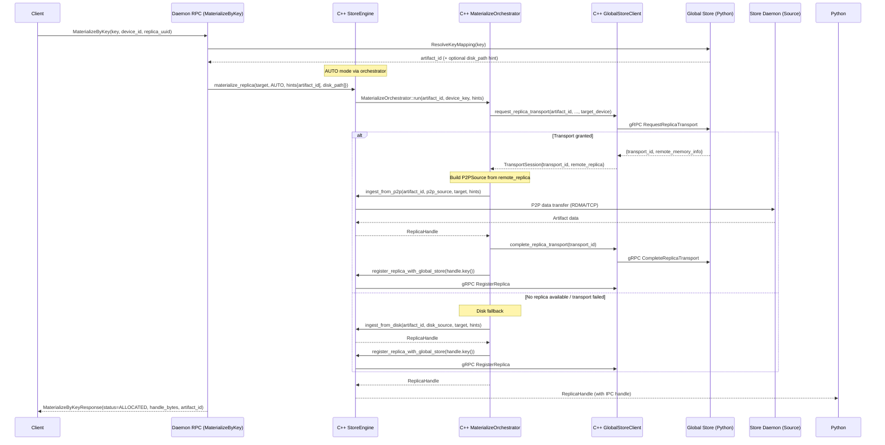

# P2P Transfer Strategies and Load Balancing

This document describes the peer-to-peer (P2P) artifact transfer strategies and load balancing mechanisms used when Store Daemons operate in Global Store mode. The system implements sophisticated routing and balancing algorithms to optimize artifact distribution across the cluster.

## Overview

In Global Store mode, artifact weights are transferred directly between Store Daemon nodes using RDMA or TCP, while the Global Store coordinates these transfers without handling the actual artifact data. This architecture provides high-performance artifact distribution with intelligent load balancing.

```mermaid
graph TB
    subgraph "Global Store (Coordinator)"
        GS[Global Store Service]
        TR[Transport Service]
        LB[Load Balancer]
        REG[Artifact Registry]
    end

    subgraph "Store Daemon Cluster"
        SD1[Store Daemon 1<br/>GPU Artifacts: A, B<br/>Load: 2/5]
        SD2[Store Daemon 2<br/>RAM Artifacts: B, C<br/>Load: 1/3]
        SD3[Store Daemon 3<br/>DISK Artifacts: A, C<br/>Load: 0/4]
    end

    Client[Client Request<br/>Key: k(A), Target: GPU]

    Client -->|1. MaterializeByKey| SD1
    SD1 -->|2. ResolveKeyMapping| GS
    GS -->|3. artifact_id| SD1
    SD1 -->|4. RequestTransport| TR
    TR -->|5. Optimal replica| SD1
    SD1 -.->|6. RDMA Transfer| SD3
    SD1 -->|7. CompleteTransport| TR
    SD1 -->|8. RegisterReplica| REG
```

## Unified Staging Flow Control

All transports now use a common staging controller to guarantee progress even when artifacts are larger than the staging pool:

- **Flow credit ledger** &mdash; each channel owns a `FlowCreditLedger` sized from `stager.buffers_per_flow`. Windows may only stage when credit is granted, preventing deadlocks when tensors exceed pool capacity.
- **Windowed staging** &mdash; `StagingWindow` slices RDMA and MTCP responses into credit-bounded windows (`stager.max_window_segments` caps the per-window grant when non-zero). StageLeases carry offsets, window sequence numbers, and transport metadata.
- **Non-blocking refill** &mdash; RDMA read handlers enqueue staging sessions and call `resume_rdma_reads()` to drain credit opportunistically. If staging hits a credit or buffer wall the control loop returns to processing TCP messages; RDMA ACKs and the GC reaper re-invoke the helper so credit recirculates without deadlocking the receive thread.
- **Lease tracking** &mdash; active leases live in a `StageLeaseRegistry` so RDMA ACKs, MTCP send completions, and the GC reaper can all reclaim buffers safely. Completion handlers emit `[staging_credit]` logs showing grant size, outstanding credit, and transport.
- **Per-transport release** &mdash; RDMA clients return credit via `ENGINE_OP_RDMA_READ_DONE_EX`, while MTCP release hooks fire on socket completion. Both paths recycle pinned buffers automatically and unblock the next window.

### Benchmark Quickstart

1. Build the communicator with fake CUDA so tests can run locally:
   ```bash
   USE_FAKE_CUDA=1 BUILD_CORE=1 BUILD_EXTENSION=1 uv run -vvv setup.py build_ext
   ```
2. Exercise the RDMA window flow with logs enabled:
   ```bash
   bazel test //core/communicator:rdma_engine_test --test_output=all --define=use_fake_cuda=true
   ```
   Inspect `[staging_credit]` lines to verify window grant/release cadence.
3. Stress the MTCP path and observe staged completions:
   ```bash
   bazel test //core/communicator:tcp_engine_test --test_output=all --define=use_fake_cuda=true
   ```
   Adjust `stager.buffers_per_flow` or `stager.max_window_segments` in a test config snippet to evaluate different credit budgets.
4. For mixed transport scenarios, run both tests back-to-back while tailing server logs; use the emitted outstanding-credit gauges to identify tuning opportunities before running large-scale soak tests.
5. To validate the unified flow controller end-to-end, run `bazel test //core/communicator:cross_transport_soak_test --define=use_fake_cuda=true`; on hosts with RDMA hardware this target issues concurrent RDMA+MTCP reads against a 128 MiB tensor and surfaces `[staging_credit]` activity across transports (it exits early with a success note when verbs support is unavailable).

## Load Balancing Strategy

### Replica Prioritization Algorithm

The Global Store uses a multi-tier prioritization system to select the optimal replica for P2P transfers:

#### 1. Memory Type Priority (Primary)
```
GPU > RAM > DISK
```
- **GPU replicas**: Highest priority for fastest access
- **RAM replicas**: Medium priority for good performance
- **DISK replicas**: Lowest priority, used as fallback

#### 2. Capacity Priority (Secondary)
```
max_concurrency ASC  # smaller capacity first
```
- **Smaller `max_concurrency` values** are preferred so low-capacity GPUs are filled before larger ones

#### 3. Load Ratio Priority (Tertiary)
```
load_ratio = current_requests / max_concurrency
```
- Lower load ratios get higher priority
- Prevents overloading high-capacity nodes
- Ensures even distribution across replicas with the same capacity

#### 4. Freshness Priority (Quaternary)
```
ORDER BY updated_at ASC  # older first for deterministic tie-break
```
- Older replicas are chosen last to keep ordering deterministic when all other keys tie

### Load Balancing Implementation

The load balancing logic is implemented in `ReplicaRepository.find_available_for_transport()`. This method performs an atomic operation that both selects the best available replica and increments its request counter in a single transaction (using the `artifact_replicas` table):

```sql
WITH candidate AS (
    SELECT r.replica_id
    FROM artifact_replicas r
    LEFT JOIN replica_counters rc ON rc.replica_id = r.replica_id
    LEFT JOIN workers w ON r.worker_id = w.worker_id
    WHERE r.artifact_id = ?
      AND COALESCE(rc.current_requests, 0) < r.max_concurrency
      AND r.is_available = TRUE
      AND w.accepting_new_requests = TRUE
      AND EXTRACT(epoch FROM w.last_heartbeat) > ?
    ORDER BY
        -- Memory type priority
        CASE
            WHEN r.memory_type = 'GPU' THEN 0
            WHEN r.memory_type = 'RAM' THEN 1
            WHEN r.memory_type = 'DISK' THEN 2
            ELSE 3
        END,
        -- Capacity priority – fill small GPUs first
        r.max_concurrency ASC,
        -- Load ratio priority (ties within same capacity)
        (COALESCE(rc.current_requests, 0) * 1.0 / GREATEST(r.max_concurrency, 1)),
        -- Freshness priority – older replicas first for determinism
        r.updated_at ASC
    LIMIT 1
)
UPDATE replica_counters
SET current_requests = current_requests + 1,
    last_assigned_at = CURRENT_TIMESTAMP
WHERE replica_id = (SELECT replica_id FROM candidate)
RETURNING replica_id
```

Key design decisions:
- **Atomic Selection**: The CTE (Common Table Expression) with UPDATE ensures atomic replica selection and counter increment
- **Separate Counter Table**: The `replica_counters` table isolates high-frequency counter updates from the main `artifact_replicas` table, reducing lock contention
- **Worker Health Check**: Only considers replicas from workers that are accepting requests and have recent heartbeats
- **Capacity-Driven Fill**: Smaller `max_concurrency` replicas are saturated first so that limited-capacity GPUs are utilised efficiently before larger ones
- **Load Ratio Calculation**: The load-ratio expression breaks ties among replicas that share the same capacity, ensuring even distribution

### Concurrency Control

The system implements atomic concurrency control to prevent overloading:

- **Atomic Request Allocation**: Uses SQL transactions to atomically check and increment request counters
- **Request Limiting**: Each replica has a `max_concurrency` limit that cannot be exceeded
- **Load Tracking**: Real-time tracking of `current_requests` per replica
- **Graceful Degradation**: Falls back to less optimal replicas when preferred ones are at capacity

### Replica Counters Table Design

The system uses a separate `replica_counters` table to optimize high-frequency counter updates:

```sql
CREATE TABLE IF NOT EXISTS replica_counters (
    replica_id UUID PRIMARY KEY,
    current_requests INTEGER NOT NULL DEFAULT 0,
    last_assigned_at TIMESTAMP WITH TIME ZONE DEFAULT CURRENT_TIMESTAMP
);
```

Key benefits of this design:
- **Reduced Lock Contention**: Isolates frequent counter updates from the main `replicas` table
- **Optimized Indexes**: Dedicated indexes for load balancing queries
- **Atomic Operations**: Enables lock-free concurrent counter updates
- **Performance**: Counter updates don't trigger updates to the main replica metadata

The repository ensures counter records exist when creating/updating replicas:
```python
# From ReplicaRepository.create()
cursor.execute("""
    DELETE FROM replica_counters WHERE replica_id = ?
""", [str(replica.replica_id)])

cursor.execute("""
    INSERT INTO replica_counters (replica_id, current_requests, last_assigned_at)
    VALUES (?, ?, CURRENT_TIMESTAMP)
""", [str(replica.replica_id), replica.current_requests])
```

## Store Daemon Implementation

### Materialization Behavior (current implementation)

- **AUTO mode orchestration**: `MaterializeOrchestrator::run()` first requests a transport from Global Store. If granted, it builds a `P2PSource` and calls the backend’s `ingest_from_p2p()` implementation (StoreEngine now implements the `loading::MaterializationBackend` interface); otherwise it falls back to disk via `ingest_from_disk()`.
- **P2P path (synchronous in engine)**: `ingest_from_p2p()` delegates to `StoreEngine::ingest_from_p2p_internal()`, performing the transfer synchronously (waits for load to complete). On GPU memory pressure it attempts eviction and retries once. It then returns a `ReplicaHandle` with `ready_future` already resolved.
- **Disk path**: `ingest_from_disk()` forwards to `ingest_from_disk_internal()`, which starts an async load and waits until the target memory location reaches `LOADED` before returning. The returned `ReplicaHandle` includes the loading future (already completed on success) and CUDA IPC handle for GPU targets.
- **Registration**: On successful P2P or disk load, the orchestrator finalizes the transport with Global Store and registers the local replica via the StoreEngine helper.
- **Lease-in-place payloads**: Registration feeds now include `storage_entries` and `tensor_aliases` so the daemon can rebuild the canonical tensor index without reopening CUDA IPC handles for every tensor. Metrics (`tc_register_storage_count`, `tc_register_tensor_count`) expose the number of unique storages and logical tensors processed per commit to validate deduplication.
- **Failure handling**: If a transport is granted but P2P ingestion fails, the orchestrator still calls `complete_replica_transport()` to release capacity on the source, then attempts disk fallback when `hints.disk_path` is provided. If no `disk_path` is available, the error is propagated.


## P2P Transfer Workflow (Key-based)

### Complete Transfer Sequence



### Key Components and File Locations

#### Python Layer
- Thin CLI and daemon manager used to configure and launch the C++ daemon

#### C++ Core Components
- **StoreEngine** (`core/store/store_engine.h/cc`)
  - `materialize_replica()`: Entry point that delegates to MaterializeOrchestrator for AUTO mode
  - `ingest_from_p2p_internal()`: Internal method for P2P transfers
  - `ingest_from_disk_internal()`: Internal method for disk loading

- **MaterializeOrchestrator** (`core/store/loading/materialization/materialize_orchestrator.h/cc`)
  - `run()`: Implements the decision tree (P2P first, disk fallback)
  - Coordinates with GlobalStoreClient for transport management
  - Handles replica registration after successful load

- **GlobalStoreClient** (`core/store/components/global_store_client.h/cc`)
  - `request_replica_transport()`: Request P2P transport session
  - `complete_replica_transport()`: Mark transport as complete
  - `register_replica()`: Register local (disk/P2P-loaded) replica with Global Store

- **ReplicaRegistrationHelper** (`core/store/loading/replica_registration_helper.h/cc`)
  - `register_local_replica()`: Helper to register replicas with Global Store


## Transport Lifecycle and Failure Handling

### Request phase (server)

- Global Store loops until timeout to find a candidate via `ReplicaRepository.find_available_for_transport()`; on success it creates a `Transport` row and increments a per-replica counter atomically.
- Retry cadence is controlled by `transport_wait_retry_interval_ms`. The heartbeat staleness cutoff uses `heartbeat_timeout_ms`.
- Metrics recorded: `inc_transport_request(artifact_id, "success"|"timeout")`, `observe_transport_wait(artifact_id, seconds)`, `inc_active_transports()`.

### Completion phase (server)

- `CompleteReplicaTransport` decrements `replica_counters.current_requests` and marks the transport as completed. Metric: `dec_active_transports()`.
- Safety-net: `cleanup_expired_transports()` periodically force-completes stuck transports to prevent counter leaks if a daemon crashes or loses connectivity.

### Client-side retries/timeouts

- All Global Store RPCs from the daemon use an exponential backoff helper with jitter (`execute_rpc_with_retry`) and respect `GlobalStoreClientConfig` fields: `max_retries`, `retry_backoff`, and `rpc_timeout`.

## Chunk-aware Remote Memory Export

- The source replica exports chunk metadata from the VS-backed CPU region and registers remote-access handles via `Replica::enable_remote_memory_access()` which internally calls `export_chunks_for_p2p(...)`.
- The Global Store carries these as `remote_memory_keys` and `buffer_sizes` in `MemoryInfo`. The orchestrator passes them into `P2PSource` so the engine can fetch efficiently.
- When RDMA is disabled, GPU→GPU transfers over TCP use staging buffers and mark registration options with `needs_staging=true`.


## Performance Optimizations

### RDMA-First Strategy

The system prioritizes RDMA transfers for optimal performance:

1. **RDMA Detection**: Check if both source and target support RDMA
2. **Connection Establishment**: Create RDMA connections between nodes
3. **Direct Memory Transfer**: Bypass CPU for memory-to-memory transfers
4. **Fallback Mechanism**: Fall back to TCP if RDMA fails

Implementation notes:
- RDMA/TCP is selected by `enable_rdma` in the `CommunicatorConfig` used to initialize `Communicator` on each side.
- GPU over TCP requires staging buffers (`needs_staging=true`), while RDMA can register memory regions directly when supported.
- Remote access uses exported `remote_memory_keys` and `buffer_sizes` provided by the source replica.

### Memory Pool Management

Efficient memory allocation strategies:

- **Pre-allocated Pools**: Pinned memory pools for zero-copy transfers
- **Chunked Transfers**: Support for artifacts larger than available memory
- **Memory Type Awareness**: Optimize transfers based on target memory type

### Connection Pooling

Reuse connections for multiple transfers:

- **Persistent Connections**: Maintain RDMA/TCP connections between frequent pairs
- **Connection Caching**: Cache connection state to avoid setup overhead
- **Health Monitoring**: Monitor connection health and recreate as needed

## Monitoring and Metrics

### Key Metrics

- **Transport Success Rate**: Ratio of successful to failed transfers
- **Load Distribution**: Request distribution across replicas
- **Transfer Latency**: Time from request to completion
- **RDMA Utilization**: Percentage of transfers using RDMA vs TCP

Concrete metrics and emitters:
- Global Store: `inc_transport_request`, `observe_transport_wait`, `inc_active_transports`, `dec_active_transports`.
- Store Engine: `record_p2p_transfer(bytes, success)`, `record_artifact_load(source, device, phase, seconds)`.

### Health Checks

- **Replica Availability**: Regular heartbeat monitoring
- **Capacity Monitoring**: Track request counts vs limits
- **Network Connectivity**: RDMA/TCP connection health

## Configuration Parameters

### Global Store Settings

```yaml
# Load balancing configuration
heartbeat_timeout_ms: 30000              # Worker heartbeat timeout (30s)
transport_wait_retry_interval_ms: 200    # Retry interval for replica availability
cleanup_interval_ms: 60000               # Stale replica cleanup interval (1 min)
optimize_interval_ms: 3600000            # Database optimization interval (1 hour)

# Worker management
heartbeat_interval_ms: 5000              # Worker heartbeat interval (5s)
max_workers: 10                          # Max gRPC worker threads
```

### Store Daemon Settings

```yaml
# Communication settings
enable_p2p_access: true                  # Require artifact registration before load
enable_p2p_engine: true                  # Enable communication manager
enable_rdma: false                       # Toggle RDMA support independently
p2p_port: 9090                          # RDMA/TCP communication port (must be non-zero)
grpc_port: 50052                        # Local gRPC port

# Memory settings
mem_pool_size: 8589934592               # Memory pool size (8GB)
tx_slice_bytes: 134217728               # Transfer slice/window size (128MB)
pinned_memory_timeout_ms: 30000         # Pinned memory timeout (30s)

# Lifecycle settings
gpu_memory_limit_fraction: 0.60         # GPU memory threshold before eviction
global_cache_fraction: 0.20             # Fraction for global cache
eviction_check_interval_s: 30.0         # Eviction check interval
proc_check_interval_s: 10.0             # Process watcher interval

# High availability settings
high_availability:
  enabled: true
  heartbeat_enhanced: true               # Enhanced heartbeat with state info
  connection_retry:
    enabled: true
    max_retries: 10
    initial_delay_ms: 1000
    max_delay_ms: 30000
  state_sync:
    enabled: true
    batch_size: 100
    sync_interval_ms: 5000
```
Integrity verification metadata:
- When a sender has precomputed lightweight verification (e.g., KEY_POINTS or SEGMENT_HASHES), it includes `verification_json` in the registered memory replica (Global Store `MemoryInfo`).
- Global Store propagates `verification_json` in `RequestReplicaTransportResponse.remote_memory_info`.
- The receiver (StoreEngine) consumes `verification_json` via `P2PSource` and validates the loaded replica before completing materialization. On mismatch, the operation fails with a DataLoss error.
