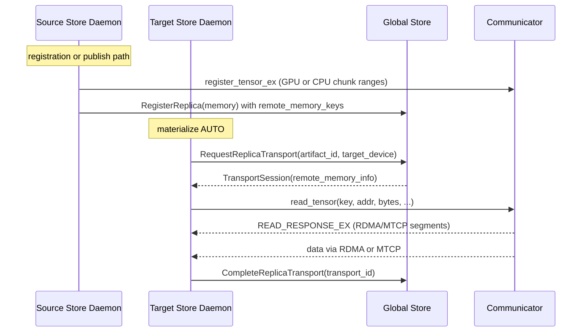
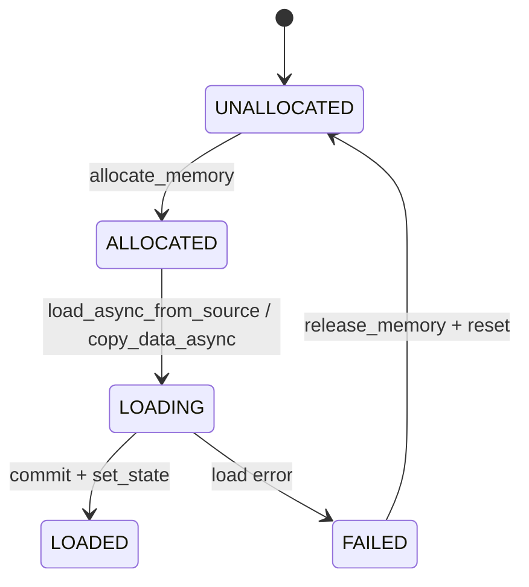

# P2P Transfer Strategies and Load Balancing

This document explains how P2P transfers work in Global Store mode. It is code-derived and focuses on control flow, data flow, memory and VRAM movement, and the thread model that drives transfers.

Related docs:
- `docs/architecture/artifact-views-and-retrieval.md`
- `docs/architecture/view-replicas-and-assembly.md`

## Scope and terminology

- P2P transfer happens between Store Daemons; Global Store only coordinates.
- Control plane: gRPC to Global Store and key mapping.
- Data plane: `communicator::engine::Communicator` over RDMA or MTCP (multi-TCP).
- Remote access uses memory keys registered for coalesced chunk ranges.

## End-to-end lifecycle (control + data)



## Source-side memory export and registration

- `RegistrationBackend::commit` optionally calls `Replica::enable_remote_memory_access`, which uses `MemoryExportRegistry::export_chunks` to coalesce chunk ranges and register them with the communicator (`core/store/replica/memory_export_registry.cc`).
- CPU exports register tensors without MR (`register_mr=false`) and hold UMA keepalive + stable leases; GPU exports register MR when RDMA is enabled and set `direct_rdma_enabled` when staging is not required.
- When `enable_p2p` is true, registration publishes a memory replica via `GlobalStoreClient::register_memory_replica` including `remote_memory_keys`, `buffer_sizes`, and optional `verification_json` (`core/store/runtime/metadata/registration_backend.cc`, `core/store/runtime/metadata/metadata_gateway.cc`).
- `WorkerLifecycleManager` toggles local export on availability changes via `enable_remote_replica_access` and `disable_remote_replica_access`, and includes existing `remote_memory_keys`/`buffer_sizes` in HA state sync when available; it does not mint new keys on its own (`daemon/ha/worker_lifecycle_manager.cc`).

## Transport request and replica selection (Global Store)

Global Store selects a source replica with an atomic claim in `ReplicaRepository.find_available_for_transport`:

```sql
WITH candidate AS (
    SELECT r.replica_id
    FROM artifact_replicas r
    LEFT JOIN replica_counters rc ON rc.replica_id = r.replica_id
    LEFT JOIN workers w ON r.worker_id = w.worker_id
    WHERE r.artifact_id = ?
      AND COALESCE(rc.current_requests, 0) < r.max_concurrency
      AND r.is_available = TRUE
      AND w.accepting_new_requests = TRUE
      AND w.inactive_at IS NULL
      AND EXTRACT(epoch FROM w.last_heartbeat) > ?
    ORDER BY
        CASE
            WHEN r.memory_type = 'GPU' THEN 0
            WHEN r.memory_type = 'RAM' THEN 1
            WHEN r.memory_type = 'DISK' THEN 2
            ELSE 3
        END,
        r.max_concurrency ASC,
        (COALESCE(rc.current_requests, 0) * 1.0 / GREATEST(r.max_concurrency, 1)),
        r.updated_at ASC
    LIMIT 1
)
UPDATE replica_counters
SET current_requests = current_requests + 1,
    last_assigned_at = now()
WHERE replica_id = (SELECT replica_id FROM candidate)
RETURNING replica_id
```

Notes:
- Selection prefers GPU over RAM over DISK, then smaller `max_concurrency`, then load ratio, then oldest `updated_at`.
- The increment is atomic; failures to find a replica are retried until timeout in `TransportService.request_transport`.
- `request_view_transport` currently falls back to canonical routing in `GlobalStoreClient` (view-aware routing is not implemented yet).

## Target-side orchestration and pipeline

### Materialization control flow

- `MaterializationService` tries in-order: reuse existing replica, local CPU to GPU copy, then P2P in AUTO mode (`core/store/runtime/ingestion/materialization_service.cc`).
- `MaterializeOrchestrator::run` requests a transport, rejects stale local routes, builds a `P2PSource`, and falls back to disk when the daemon resolves a disk source binding (managed shared-disk or local import) (`core/store/materialization/control/materialize_orchestrator.cc`).
- The orchestrator always calls `complete_replica_transport` on success or failure; once a disk source is resolved, disk fallback does not require additional Global Store calls.

### Entry points used by the daemon

- `ResolveKeyMapping` remains the control-path lookup for `key -> artifact_id` when callers start from keys.
- `MaterializeReplica` consumes `ArtifactSelection` and calls `materialize_replica` with AUTO or LOAD_ONLY depending on preference and inputs.

### Ingestion pipeline stages

`IngestionPipeline::ingest_from_p2p` drives the runtime pipeline:

- `P2PSourceAdapter::prepare` attaches the shared communicator engine and sets `fallback_disk_dir` unless preference is `kPreferP2P`.
- `MetadataStage` plans view transforms if needed; for view loads, it fetches the canonical index from Global Store.
- `AllocationStage` creates the replica and blocks on `ReplicaLoadController::load_async_from_source`. GPU loads retry after eviction on `ResourceExhausted`.
- `VerificationStage` validates `verification_json` key points and computes optional view hashes.
- `HandleStage` builds `ReplicaHandle`.

### Publish and registration after load

- `IngestionRuntime` calls `ingest_from_p2p` with `publish_to_global_store=true`; `MaterializationFacade` mints a `publish_context_id` and emits started and completed events.
- `MetadataGateway` consumes completion events and calls `register_replica` (presence only).
- `MaterializeOrchestrator` also calls `register_replica_with_global_store` after successful P2P or disk loads; the cached `publish_context_id` dedupes duplicate publishes.
- Memory-replica publication with remote keys is only done by the registration backend (see source-side registration above).

## Data plane: loaders and transfer pipeline

### P2PLoader and sources

- `P2PLoader` requires `memory_keys`, `buf_sizes`, `size_bytes`, and a communicator engine. It builds a `RemoteKeySource` which maps global offsets to per-key offsets (`core/store/materialization/dataplane/loaders/p2p_loader.cc`, `core/store/materialization/dataplane/sources/remote_key_source.cc`).
- `RemoteKeySource::read_at` issues `Communicator::read_tensor` calls and blocks on the returned future; this is why the pipeline runs on the blocking executor.
- If `fallback_disk_dir` is set, `P2PLoader` wraps the remote source in `MuxSeekableSource`, which falls back on short reads or remote errors (`core/store/materialization/dataplane/sources/mux_seekable_source.cc`).

### TransferService and pump_ranges

- `ReplicaLoadController::load_async_from_source` delegates to `TransferService::execute` on the blocking executor and uses a per-GPU gate to serialize GPU sessions (`core/store/replica/replica_load_controller.cc`).
- `TransferService` creates a per-session `StreamingPinnedBuffer` backed by the shared `PinnedBufferPool`. The pool slice size must divide `artifact_chunk_bytes` to avoid cross-chunk slices.
- `pump_ranges` drives a producer/consumer pipeline:
  - Producers run on the blocking executor and call `SeekableSource::read_at` into pinned slots.
  - The consumer writes to a `PositionedSink`. For GPU sinks, `AsyncPositionedSink::write_at_async` schedules H2D copies via `AsyncCopyManager` and returns slots only after completion.
- Direct-write fast path: when the source supports direct write (RDMA enabled) and the sink implements `DirectWriteCapable` (CPU sink), `pump_ranges` requests `DirectWriteGrant` windows from UMA and calls `RemoteKeySource::read_into` to RDMA-read directly into CPU VA ranges. Failures fall back to staged reads.

### CPU vs GPU sinks

- CPU target uses `CpuVaSink` to write into UMA CPU VA and exposes `plan_direct_write`.
- GPU target uses `GpuMemorySink` with per-GPU inflight limits (bytes and copy counts) and H2D submission via `AsyncCopyManager`. The sink does not implement direct write.

## Network transport internals

### RDMA (pull model)

- Control channel: TCP `ENGINE_OP_READ_REQUEST` and `ENGINE_OP_READ_RESPONSE_EX`.
- The server stages or exposes memory and replies with RDMA segments (addr, rkey, bytes, window_seq).
- The client posts RDMA READs via `RdmaTransport::read_multi`. On completion it triggers window ACKs (`ENGINE_OP_RDMA_READ_DONE_EX`) so the server can release staging credit.
- Zero-copy RDMA: when GPU memory was registered with `direct_rdma_enabled`, the server uses the original MR as the stage window (no staging buffer).
- Staged RDMA uses a `MemoryStager`:
  - `HostPinnedGpuStager` performs D2H into pinned buffers.
  - `GpuVramRdmaStager` performs D2D into a per-GPU VRAM pool when `rdma.staging_backend=GPU_VRAM`.
  - `HostPinnedCpuStager` copies into pinned host buffers.

### MTCP (push model)

- MTCP is used when `enable_rdma=false` or when a request uses MTCP explicitly.
- The server sends `READ_RESPONSE_EX` (transport=MTCP) and enqueues a staging task on `mtcp_staging_thread_`.
- `MTcpTransport` manages multiple sockets (`tcp_conn_count`) plus a staged-send thread. Stage windows are sliced across lanes and each segment completion releases staging credit.
- GPU receives: MTCP reads into pinned staging buffers (`StreamingPinnedBuffer`) and schedules H2D copies via `AsyncCopyManager`. Each sub-chunk returns its slot on copy completion.
- CPU receives: MTCP reads directly into the CPU destination buffer, no extra copy.

## Staging flow control and credit

- `FlowCreditLedger` is per-channel and sized by `stager.buffers_per_flow`. It grants window credit for both RDMA and MTCP.
- `StagingWindow` slices each request into credit-bounded windows; `stager.max_window_segments` caps window size.
- `StageLeaseRegistry` tracks active staged segments. RDMA ACKs, MTCP send completions, and the GC reaper reclaim leases and return credit.
- `Communicator` enforces a GPU MTCP channel limit based on `stager.expected_gpu_channels` and pinned pool capacity to prevent unbounded staging.

## Replica memory state flow (target)



Notes:
- P2P loads call `ensure_loaded_async` and block on the load future in `AllocationStage`.
- GPU loads may retry after eviction when `ResourceExhausted` is returned.

## Thread model (hot paths)

- `Communicator` threads: request loop (`do_read_request_loop`), channel GC (`do_channel_gc_loop`), handshake retry, and MTCP staging loop.
- RDMA IO: per-device `RdmaThread` with send, poll, and recv threads.
- MTCP IO: `MTcpTransport` has server/client loops plus send, recv, and staged-send threads. Each connection uses `MTcpTransportTask` send/recv threads.
- P2P ingestion: `pump_ranges` producers run on the blocking executor; the consumer runs in the caller thread. GPU sessions are serialized by `GpuSchedHandle`.

## Failure handling and fallbacks

- `MaterializeOrchestrator` always calls `complete_replica_transport`. On P2P failure, it falls back to disk when a daemon-resolved disk source is available.
- `P2PLoader` fallback is per-read: `MuxSeekableSource` completes remaining bytes from disk on short reads or remote errors.
- RDMA handshake failures surface as transport errors; no automatic MTCP fallback is performed.
- MTCP staging waits for credit up to `staging_wait_timeout` and fails with `ResourceExhausted` when the deadline is exceeded.
- `do_channel_gc_loop` reaps stale `StageLease` entries when ACKs are missing (`ack_ttl_ms`).

## View-aware routing and verification

- `request_view_transport` is invoked when `view_id` is present. The client falls back to canonical routing when the server is view-unaware.
- `MetadataStage` fetches the canonical index from Global Store when a view needs planning.
- `VerificationStage` validates P2P transfers using `verification_json` (key-point verification) and computes optional view hashes.

## View Registration Telemetry

- View registrations are handled by `RegistrationController` and `RegistrationBackend`, which build a bidirectional view plan and stream view writes into the target replica (`core/store/runtime/metadata/registration_backend.cc`).
- On commit, the backend computes view hash and optional leaf digests (when a canonical `ByteRangeMap` is available) and publishes a `ViewStateUpdate` via `RegistrationPublisher::update_view_state`.
- `GlobalStoreRegistrationPublisher` calls `GlobalStoreClient::update_artifact_view_state` to persist view metadata; failures are logged and treated as best-effort when the server does not support the RPC.
- For view materialization via P2P, `MetadataGateway::register_replica` also calls `record_view_residency` (currently `Unimplemented` in the client), so view residency updates are best-effort until the server RPC lands.

## Observability

- Global Store metrics: `inc_transport_request`, `observe_transport_wait`, `inc_active_transports`, `dec_active_transports`.
- Store runtime metrics: `tc_p2p_bytes_total`, `tc_tx_duration_ms`, `tc_tx_inflight_copies_gauge`, `tc_tx_inflight_bytes_gauge`, `tc_tx_direct_window_*`.
- P2P staging logs: `[staging_credit]` lines identify window grants, outstanding credit, and ACK release paths.

## Benchmark quickstart

1. Exercise the RDMA window flow with logs enabled:
   ```bash
   bazel test //core/communicator:rdma_engine_test --test_output=all --test_env=TENSORCAST_CUDA_BACKEND=fake
   ```
2. Stress the MTCP path and observe staged completions:
   ```bash
   bazel test //core/communicator:tcp_engine_test --test_output=all --test_env=TENSORCAST_CUDA_BACKEND=fake
   ```
3. Validate unified flow control across transports:
   ```bash
   bazel test //core/communicator:cross_transport_soak_test --test_env=TENSORCAST_CUDA_BACKEND=fake
   ```
