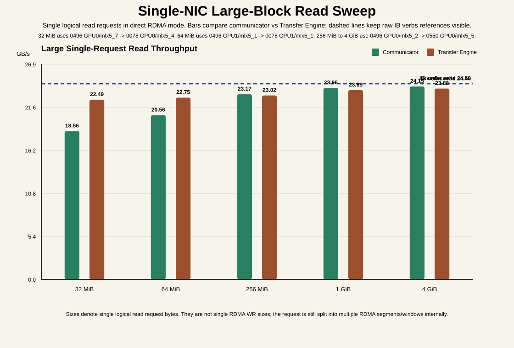
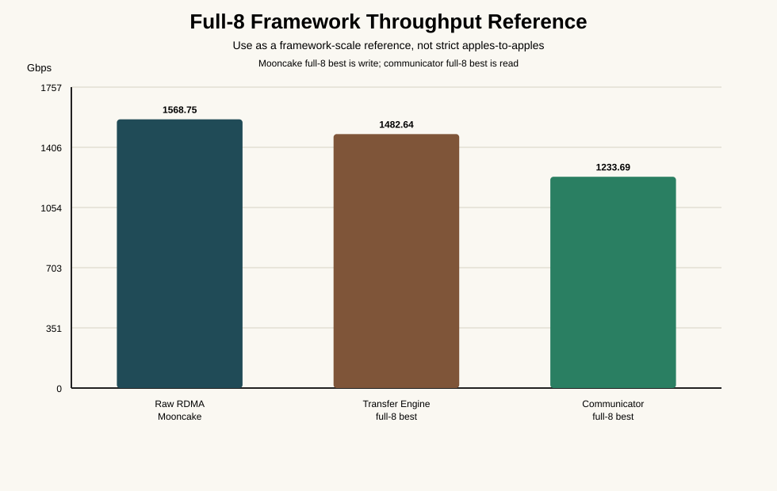
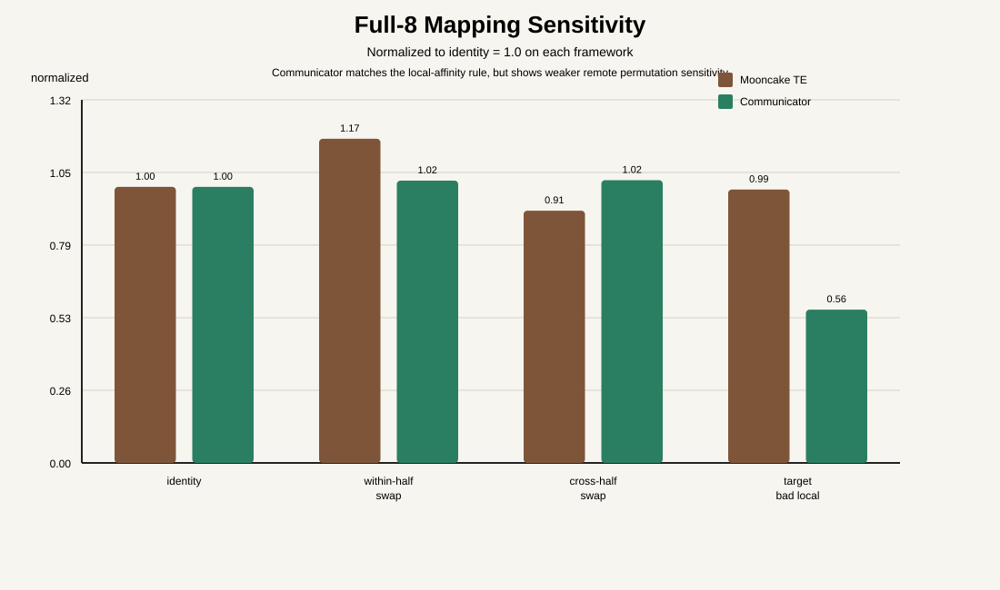

# Communicator vs Transfer Engine Comparison

Date: 2026-03-16  
Status: Active

## 1. Goal

This document defines a chart set that makes TensorCast communicator and
Mooncake Transfer Engine performance easy to compare without hiding the
remaining caveats.

The output is intentionally split into:

1. a single-NIC aligned reference chart
2. a framework-scale full-8 reference chart
3. a topology-sensitivity chart

That is necessary because not all available results are perfect
apples-to-apples.

## 2. Generated Figures

### 2.1 Single-NIC Aligned Reference

What it is for:

1. show the strongest currently aligned single-NIC reference on one matched
   physical `GPU <-> NIC` pair
2. keep raw verbs, Mooncake TE, and communicator on one visual axis

What it is **not**:

1. not a strict same-workload communicator vs Mooncake benchmark
2. the Mooncake and raw verbs bars are matched on one aligned physical pair
3. the communicator bars are reference points with explicit caveats

Use it to answer:

1. does Mooncake's reported `~24.4 GB/s` single-NIC GDR result make sense
   against raw verbs?
2. where does communicator currently sit relative to that aligned single-NIC
   reference?

Current reading:

1. aligned raw verbs on `0496 GPU2/mlx5_2 -> 0078 GPU2/mlx5_2` are about
   `24.46 ~ 24.50 GB/s`
2. aligned Mooncake TE on the same physical pair reaches
   `24.44 ~ 24.45 GB/s`
3. communicator best-known strict-direct single-big-read remains
   `20.25 GB/s`
4. a fresh communicator aligned single-NIC probe on
   `0496 GPU1/mlx5_1 -> 0078 GPU1/mlx5_1` was `20.56 GB/s`

### 2.2 Full-8 Framework Throughput Reference

What it is for:

1. show whether each framework can approach the full-8 hardware envelope
2. keep raw fabric ceiling visible

What it is **not**:

1. not a strict apples-to-apples chart
2. Mooncake full-8 best is write-path
3. communicator full-8 best is read-path

Use it to answer:

1. can communicator now enter the same full-8 performance class as Transfer
   Engine?

Current reading:

1. raw RDMA: `1568.75 Gbps`
2. Transfer Engine full-8 best: `1482.64 Gbps`
3. communicator full-8 best: about `1233.68 Gbps`

### 2.3 Full-8 Mapping Sensitivity

This is the most important topology comparison chart.

Why it uses normalized values:

1. Mooncake mapping data and communicator mapping data are not the same
   absolute workload
2. normalized values let readers compare *direction* rather than raw level

Use it to answer:

1. does communicator show the same mapping sensitivity trend as Mooncake?

Current reading:

1. both frameworks agree that breaking destination local GPU/NIC affinity is
   bad
2. communicator shows much weaker sensitivity to pure remote permutation than
   Mooncake

## 3. Comparison Data

The chart source snapshot is:

- [20260316-communicator-vs-te-comparison.json](./data/20260316-communicator-vs-te-comparison.json)

The chart generator is:

- [render_te_comparison_charts.py](/data/workspace/tensorcast-280/tools/communicator/render_te_comparison_charts.py)

## 4. Metric Definitions

For communicator-generated data, prefer the explicit `bw_GBps` / `bw_GBps_*`
fields when present. Older result files still carry the legacy field name
`bw_gbps`, which represents the same decimal `GB/s` quantity.

### 4.1 Single-NIC Aligned Reference

This chart intentionally uses the strongest currently aligned single-NIC
comparison we have:

1. raw verbs `ib_write_bw` / `ib_read_bw`
2. Mooncake TE `read` / `write`
3. communicator best-known strict-direct single-big-read
4. communicator fresh same-pair probe

Aligned pair used for raw verbs and Mooncake:

1. initiator: `gpu-h800-0496.host.platform.shaipower.com`
2. target: `gpu-h800-0078.host.platform.shaipower.com`
3. physical pair: `GPU2 <-> mlx5_2` on both hosts

Values used:

1. `ib_write_bw`: `196.00 Gbps` = `24.50 GB/s`
2. `ib_read_bw`: `195.72 Gbps` = `24.46 GB/s`
3. Mooncake TE write: `24.45 GB/s`
4. Mooncake TE read: `24.44 GB/s`
5. communicator best-known strict-direct read: `20.25 GB/s`
6. communicator fresh aligned `0496 -> 0078` probe: `20.56 GB/s`

Evidence:

1. [/data/tc/single-nic-compare-20260316-161728/ib_write_bw_client_run_nopin.json](/data/tc/single-nic-compare-20260316-161728/ib_write_bw_client_run_nopin.json)
2. [/data/tc/single-nic-compare-20260316-161728/ib_read_bw_client_run_nopin.json](/data/tc/single-nic-compare-20260316-161728/ib_read_bw_client_run_nopin.json)
3. [/data/tc/single-nic-compare-20260316-161728/te_write_mlx5_2.json](/data/tc/single-nic-compare-20260316-161728/te_write_mlx5_2.json)
4. [/data/tc/single-nic-compare-20260316-161728/te_read_mlx5_2.json](/data/tc/single-nic-compare-20260316-161728/te_read_mlx5_2.json)
5. [/data/tc/comm-tune-0360-0496-bigread-t1-qp4-latfix-attempt1-025158/result.json](/data/tc/comm-tune-0360-0496-bigread-t1-qp4-latfix-attempt1-025158/result.json)
6. [/data/tc/single-nic-compare-20260316-161728/comm_initiator_run_aligned_mlx5_1.json](/data/tc/single-nic-compare-20260316-161728/comm_initiator_run_aligned_mlx5_1.json)

### 4.2 Communicator Full-8 Aggregate

For communicator full-8 mapping cases, the chart uses:

1. `sum(lane bytes) / max(lane wall_us)`

This is the correct data-plane wall for a lane-parallel benchmark.

We do **not** use:

1. the whole case wall

because whole-case wall includes:

1. detached worker orchestration
2. target bring-up
3. sequential lane startup

Those inflate the denominator and understate the real full-8 data-plane
throughput.

### 4.3 Communicator Single Big Read

For communicator's best-known single-artifact reference, we use the strict
direct RDMA case:

1. `64 MiB`
2. `threads=1`
3. `batch_size=1`
4. `qp_count=4`
5. `outstanding_wr=256`

Case:

- [/data/tc/comm-tune-0360-0496-bigread-t1-qp4-latfix-attempt1-025158/result.json](/data/tc/comm-tune-0360-0496-bigread-t1-qp4-latfix-attempt1-025158/result.json)

### 4.4 Mooncake Full-8 Best

Mooncake full-8 framework best comes from:

- `/data/workspace/Mooncake/docs/source/performance/transfer-engine-full8-rdma-best-practices-20260316.md`

Value used:

1. `1482.64 Gbps`

### 4.5 Mooncake Mapping Sensitivity

Mooncake mapping values come from:

- `/data/workspace/Mooncake/docs/source/performance/transfer-engine-gdr-mapping-20260315.md`

Values used:

1. `map8_id`
2. `map8_within_swap`
3. `map8_half_swap`
4. `map8_target_bad_local`

## 5. Caveats

These caveats must remain attached to the figures.

### 5.1 Single-NIC Caveat

1. raw verbs and Mooncake TE bars in the single-NIC chart are physically
   aligned on the same `GPU2 <-> mlx5_2` pair
2. communicator best-known single-big-read is still from a different host pair
3. communicator fresh same-pair probe is now aligned on a different good local
   pair (`GPU1 <-> mlx5_1`), so the chart should be read as "same host pair,
   aligned single-NIC references", not "identical GPU ordinal on every bar"

### 5.2 Operation Direction

1. Mooncake full-8 best is a write-path best practice result
2. communicator full-8 best currently comes from read-path mapping results

Therefore:

1. the framework-scale ceiling chart is a *reference comparison*, not a strict
   apples-to-apples benchmark

### 5.3 Framework Behavior vs Framework Capability

Communicator capability and current TensorCast framework behavior are different.

Communicator capability:

1. communicator can now drive one large strict-direct `read_tensor()` to about
   `20.25 GB/s`
2. communicator can also drive `8` explicit lane-parallel transfers to about
   `150 ~ 154 GB/s` data-plane aggregate

Current TensorCast framework behavior:

1. `RemoteKeySource` binds to one `ip:port`
2. one artifact load is still single-source-session oriented
3. one artifact does not automatically stripe itself over `8` source GPUs/NICs

So when presenting the figures, say this explicitly:

1. the communicator charts show what the current communicator can do
2. they do not mean the current TensorCast artifact load path automatically
   uses all `8` NICs for one artifact

### 5.4 Mapping Conclusion Scope

Mooncake and communicator currently agree on:

1. local GPU/NIC pairing matters a lot

They do not currently agree on:

1. how strongly remote one-to-one permutation matters after both hosts already
   preserve good local pairs

That difference should be presented as:

1. a real behavioral difference between the two systems today
2. not as a charting artifact

## 6. Recommended Reader Flow

When presenting these charts to others, use this order:

1. show the single-NIC aligned reference chart first
2. then show the full-8 framework reference chart
3. then show the normalized mapping chart
4. finally explain whether the current TensorCast framework will naturally
   expose enough independent transfers to realize communicator's full-8
   capability
