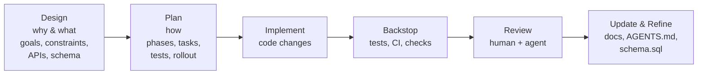

# Summary

Define the documentation model centered on `docs/designs/` (why/what) and `docs/plans/` (how). It standardizes directory semantics, required content, and metadata so designs and plans are consistent, discoverable, and enforce a clear separation of concerns.

This document specifies the directory semantics, required sections, and metadata schema for designs and plans.



# Goals (Why)

- Durable context: Make architectural intent, invariants, and interfaces discoverable and enforceable.
- Speed with safety: Enable agents to operate top‑down with human review, reducing rework.
- Clear separation of concerns: Designs (why/what) vs. Plans (how) vs. Guides (how‑to/tutorials).
- Localized guidance: README.md and AGENTS.md provide precise, directory‑scoped instructions.
- Canonical data source: `schema.sql` is the single source of truth for data structures.
- Guardrails: CI enforces metadata, cross‑linking, and the “doc sync” rule for code changes.

# Information Architecture (What)

## Directories and Semantics

- `docs/designs/` — Product requirements, goals, constraints, normative schemas and APIs, trade‑offs, risks, and acceptance criteria. Authoritative “why and what.”
- `docs/plans/` — Phased, actionable implementation plans with milestones, testing, rollout and backout. The “how.”
- `docs/guides/` — Tutorials and how‑tos for APIs/tools, often drafted by agents after reading source/docs.
- `schema.sql` (repo root) — Canonical, versioned relational schema for the project’s persistent data; designs that change data must reference and modify this file.
- `README.md` and `AGENTS.md` — Placed at meaningful boundaries (module roots, service dirs, tools). These files give localized guidance to humans and agents. See “Localized Guidance” below.

## File Naming

- `docs/designs/` and `docs/plans/` filenames begin with a zero-padded sequence number: `0001-<slug>.md`, `0002-<slug>.md`, etc.
- The numeric prefix increments monotonically; do not reuse or skip numbers except when explicitly superseding a document (record the relationship in frontmatter).
- Companion designs and plans share the same sequence number to make the pairing obvious (e.g., `docs/designs/0015-foo.md` ↔ `docs/plans/0015-foo.md`).
- The `<slug>` portion of the filename is a descriptive string reused in the frontmatter `slug` field without the numeric prefix.

## Document Types and Required Content

Design (docs/designs/<slug>.md)
- Problem statement, scope, goals/non‑goals
- Interfaces and schemas (include diffs against `schema.sql` when applicable)
- Invariants and error model
- Alternatives and rationale
- Risks, success criteria, and compatibility
- Cross‑links: owning code, related plans, and guides
 - Visualization: Prefer Mermaid diagrams for structured, graphical, flow, and hierarchical information (e.g., flowcharts, sequence diagrams, class diagrams, state diagrams, ER/graph diagrams).
  - Mermaid guidance:
    - You can use Mermaid to algorithmically express and emulate more complex cognitive processes (e.g., decision pipelines, concurrent branches, feedback loops).
    - For line breaks inside node labels, use `<br>` instead of `</n>`.
    - Avoid using `:` inside plain node text; colons can be interpreted as Mermaid syntax tokens in certain contexts.
    - Parentheses can also trigger syntax. When you need parentheses in text, wrap the entire label in quotes. Example: `A["Reclaimer<br>(idempotent cleanup)"]`.
    - Example (correct):
      ```mermaid
      flowchart LR
        A["Reclaimer<br>(idempotent cleanup)"] --> B["Done"]
      ```
    - Example (incorrect; will error due to `</n>` and unquoted parentheses):
      ```mermaid
      flowchart LR
        A[Reclaimer</n>(idempotent cleanup)] --> B[Done]
      ```

Plan (docs/plans/<slug>.md)
- Phases/milestones and tasks
- Acceptance checks, test plan, rollout/backout
- Risk tracking and owner checklist
 - Phases & Milestones MUST use Markdown checkboxes (`- [ ]`) for progress tracking

Guides (docs/guides/<topic>.md)
- Goal‑oriented, concise steps with code references
- Drafted/updated after code or design changes land

# Metadata Schema (Frontmatter)

Each document starts with YAML frontmatter. Minimal required keys:

```yaml
title: <Human readable title>
links:
  design: ../designs/<slug>.md        # for plans. (designs don't need a plan link)
```

Optional keys:
- `areas`: ["core", "daemon", "global_store", "sdk", "infra"]
- `related_code`: ["paths/glob"]

# Localized Guidance (README.md & AGENTS.md)

Purpose
- README.md: What this directory contains, how to build/test/run, quick links, local invariants, and owner contacts.
- AGENTS.md: Directory‑scoped rules and tips for agents, including code style and naming, build/test commands, layout, and precedence. Aligns with the root AGENTS.md spec and inherits its semantics.

Placement and Precedence
- Place at every module/service boundary and any directory where special rules apply.
- Precedence: deeper AGENTS.md overrides parent; direct human/developer/user instructions override AGENTS.md. Scope is limited to the directory subtree.
- Doc Sync Rule: Any code change that modifies behavior must update the nearest README/AGENTS.md and relevant design/plan.

Recommended Structure
- README.md: Overview, Setup, Commands, Layout, Key Links, Owner
- AGENTS.md: Scope, Coding Standards (local deltas only), Build/Run/Lint/Test, Do/Don’t, Common Pitfalls, Update Obligations

Required Philosophy Anchors (inherit from root AGENTS.md)
- Local `AGENTS.md` files must include and not contradict these anchors (see `../../AGENTS.md`, “Software Design Philosophy”).
- Complexity Reduction:
  - Strategic Programming; Deep Modules; Minimize Optional Types; Layer Architecture; Information Hiding
- Comment‑First Development:
  - Write the interface comment first; describe the “what” and “why,” not the “how”
- Error Handling Philosophy:
  - Define errors out of existence when possible; use exceptions for exceptional cases; make common errors impossible via API design; avoid partial failures—operations should be atomic

# Schema Governance (`schema.sql`)

- Acts as canonical ground truth for persistent data structures across components.
- Any design that changes data must include a “Schema Changes” section describing rationale and impact, and must propose a synchronized patch to `schema.sql`.
- Ownership: global_store owners maintain `schema.sql` with review from affected areas.
- Compatibility: migrations and backfills are tracked in plans; designs must specify compatibility strategy and versioning.

# Ownership, Reviews, and Status Lifecycle

- Status:
  - draft → proposed → accepted → (deprecated|superseded|retired)
  - Plans track execution; designs capture intent and compatibility commitment.
- Decision Records: When a design is accepted, capture the final decision and key rationale; link commits that implement it.

# Guardrails (What must be true)

- Frontmatter validation: required keys present; status is valid; cross‑links resolve.
- 1:1 linkage: every plan points to exactly one design and vice versa.
- Link hygiene: CI link checker passes.
- Doc Sync: PRs that change code touching an owned area must link a design/plan and update localized README/AGENTS.md.
- Schema discipline: designs referencing data models must link `schema.sql`; plans must include migration/testing steps.
- Local `AGENTS.md` include the repository’s Software Design Philosophy anchors (Complexity Reduction, Comment‑First Development, Error Handling Philosophy).

# Discoverability and Navigation

- Indexes: `docs/README.md` lists designs, plans, and guides by area and status with short descriptions.
- Stable slugs and IDs for deep links; filenames mirror `<slug>.md`.
- Cross‑linking: designs link to plans and owning code; plans link back to designs and tests.

# How to Write a Plan

- Use concise, outcome‑oriented titles for phases and milestones.
- Phases & Milestones MUST use Markdown checkboxes (`- [ ]`) so progress is visible in diffs and reviews.
- Link each milestone to owning code/tests where applicable.
- Keep tasks small, actionable, and verifiable.

# Templates (Authoring Aids)

Design (minimal)
```md
---
slug: <slug>
title: <Title>
links:
---

# Summary

# Goals / Non‑Goals

# Architecture & Interfaces

# Schema Changes (if any)

# Trade‑offs & Risks

# Compatibility & Acceptance Criteria

# References
```

Plan (minimal)
```md
---
slug: <slug>
title: <Title>
links:
  design: ../designs/<slug>.md
---

# Objective

# Phases & Milestones

- [ ] Phase 1: <name>
  - [ ] Milestone 1: <outcome>
  - [ ] Milestone 2: <outcome>
- [ ] Phase 2: <name>
  - [ ] Milestone 1: <outcome>

# Tasks

# Test / Rollout / Backout

# Risks & Tracking
```

# Open Questions

- Should we add an `internal: true|false` flag in frontmatter for possible external publishing later?
- Do we want a repo script to auto‑generate design/plan indexes and badges by status?
- What’s the exact ownership for `schema.sql` across teams (single team, or joint ownership with codeowners by table)?

