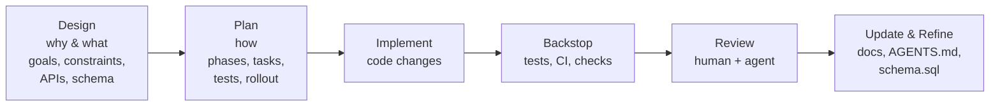

# Summary

Restructure the repository documentation into a hierarchical, human–AI collaborative workspace that preserves context and accelerates delivery. The system separates “why/what” (designs) from “how” (plans) and codifies localized guidance via README.md and AGENTS.md files placed throughout the repo. A single canonical `schema.sql` acts as the ground truth for project‑wide data structures.

This document specifies the purpose, scope, information architecture, metadata schema, ownership/governance, and success criteria. The step‑by‑step migration is covered by the linked plan.



# Goals (Why)

- Durable context: Make architectural intent, invariants, and interfaces discoverable and enforceable.
- Speed with safety: Enable agents to operate top‑down with human review, reducing rework.
- Clear separation of concerns: Designs (why/what) vs. Plans (how) vs. Guides (how‑to/tutorials).
- Localized guidance: README.md and AGENTS.md provide precise, directory‑scoped instructions.
- Canonical data source: `schema.sql` is the single source of truth for data structures.
- Guardrails: CI enforces metadata, cross‑linking, and the “doc sync” rule for code changes.

# Non‑Goals (Out of Scope)

- Rewriting technical content of individual RFCs beyond structural split.
- Changing core build/test systems (beyond adding docs checks and PR templates).
- Publishing an external site. This design targets the in‑repo workspace.

# Information Architecture (What)

## Directories and Semantics

- `docs/designs/` — Product requirements, goals, constraints, normative schemas and APIs, trade‑offs, risks, and acceptance criteria. Authoritative “why and what.”
- `docs/plans/` — Phased, actionable implementation plans with milestones, testing, rollout and backout. The “how.”
- `docs/guides/` — Tutorials and how‑tos for APIs/tools, often drafted by agents after reading source/docs.
- `schema.sql` (repo root) — Canonical, versioned relational schema for the project’s persistent data; designs that change data must reference and modify this file.
- `README.md` and `AGENTS.md` — Placed at meaningful boundaries (module roots, service dirs, tools). These files give localized guidance to humans and agents. See “Localized Guidance” below.

## Document Types and Required Content

Design (docs/designs/<slug>.md)
- Problem statement, scope, goals/non‑goals
- Interfaces and schemas (include diffs against `schema.sql` when applicable)
- Invariants and error model
- Alternatives and rationale
- Risks, success criteria, and compatibility
- Cross‑links: owning code, related plans, and guides
 - Visualization: Prefer Mermaid diagrams for structured, graphical, flow, and hierarchical information (e.g., flowcharts, sequence diagrams, class diagrams, state diagrams, ER/graph diagrams).

Plan (docs/plans/<slug>.md)
- Phases/milestones and tasks
- Acceptance checks, test plan, rollout/backout
- Risk tracking and owner checklist

Guides (docs/guides/<topic>.md)
- Goal‑oriented, concise steps with code references
- Drafted/updated after code or design changes land

# Metadata Schema (Frontmatter)

Each document starts with YAML frontmatter. Minimal required keys:

```yaml
id: design-YYYYMMDD-<slug> | plan-YYYYMMDD-<slug>
slug: <slug>
title: <Human readable title>
status: draft | proposed | accepted | deprecated | superseded | retired
owners: ["team-or-individual"]
reviewers: ["areas or individuals"]
created: YYYY-MM-DD
last_updated: YYYY-MM-DD
links:
  design: ../designs/<slug>.md        # for plans
  plan: ../plans/<slug>.md            # for designs
  schema: ../../schema.sql            # if applicable
```

Optional keys:
- `areas`: ["core", "daemon", "global_store", "sdk", "infra"]
- `related_code`: ["paths/glob"]
- `supersedes` / `superseded_by`: id(s)
- `decision_record`: true/false (use for final, accepted designs)

# Localized Guidance (README.md & AGENTS.md)

Purpose
- README.md: What this directory contains, how to build/test/run, quick links, local invariants, and owner contacts.
- AGENTS.md: Directory‑scoped rules and tips for agents, including code style and naming, build/test commands, layout, and precedence. Aligns with the root AGENTS.md spec and inherits its semantics.

Placement and Precedence
- Place at every module/service boundary and any directory where special rules apply.
- Precedence: deeper AGENTS.md overrides parent; direct human/developer/user instructions override AGENTS.md. Scope is limited to the directory subtree.
- Doc Sync Rule: Any code change that modifies behavior must update the nearest README/AGENTS.md and relevant design/plan.

Recommended Structure
- README.md: Overview, Setup, Commands, Layout, Key Links, Owner
- AGENTS.md: Scope, Coding Standards (local deltas only), Build/Run/Lint/Test, Do/Don’t, Common Pitfalls, Update Obligations

Required Philosophy Anchors (inherit from root AGENTS.md)
- Local `AGENTS.md` files must include and not contradict these anchors (see `../../AGENTS.md`, “Software Design Philosophy”).
- Complexity Reduction:
  - Strategic Programming; Deep Modules; Minimize Optional Types; Layer Architecture; Information Hiding
- Comment‑First Development:
  - Write the interface comment first; describe the “what” and “why,” not the “how”
- Error Handling Philosophy:
  - Define errors out of existence when possible; use exceptions for exceptional cases; make common errors impossible via API design; avoid partial failures—operations should be atomic

# Schema Governance (`schema.sql`)

- Acts as canonical ground truth for persistent data structures across components.
- Any design that changes data must include a “Schema Changes” section describing rationale and impact, and must propose a synchronized patch to `schema.sql`.
- Ownership: global_store owners maintain `schema.sql` with review from affected areas.
- Compatibility: migrations and backfills are tracked in plans; designs must specify compatibility strategy and versioning.

# Ownership, Reviews, and Status Lifecycle

- Owners: Each design/plan lists responsible owner(s); codeowners of affected areas are mandatory reviewers.
- Status:
  - draft → proposed → accepted → (deprecated|superseded|retired)
  - Plans track execution; designs capture intent and compatibility commitment.
- Decision Records: When a design is accepted, capture the final decision and key rationale; link commits that implement it.

# Guardrails (What must be true)

- Frontmatter validation: required keys present; status is valid; cross‑links resolve.
- 1:1 linkage: every plan points to exactly one design and vice versa (except umbrella designs/plans which declare `is_umbrella: true`).
- Link hygiene: no references to `./rfcs` after migration; CI link checker passes.
- Doc Sync: PRs that change code touching an owned area must link a design/plan and update localized README/AGENTS.md.
- Schema discipline: designs referencing data models must link `schema.sql`; plans must include migration/testing steps.
- Local `AGENTS.md` include the repository’s Software Design Philosophy anchors (Complexity Reduction, Comment‑First Development, Error Handling Philosophy).

# Discoverability and Navigation

- Indexes: `docs/README.md` lists designs, plans, and guides by area and status with short descriptions.
- Stable slugs and IDs for deep links; filenames mirror `<slug>.md`.
- Cross‑linking: designs link to plans and owning code; plans link back to designs and tests.

# Success Metrics

- 100% of active RFCs split and migrated; `./rfcs` frozen with a pointer.
- 0 broken internal links; CI `docs-check` enforces frontmatter and link hygiene.
- PR adoption: ≥90% of feature PRs link to a design/plan after one sprint.
- Reduced onboarding time: contributors can find the right doc within 2 clicks from repo root.

# Risks and Mitigations

- Ambiguous splits of older RFCs → Provide clear split heuristics and manual curation list in the plan.
- Drift between code and docs → Enforce Doc Sync in PR template and CI; owners approve changes.
- Overhead for small changes → Allow “lite” designs/plans for trivial updates with minimal required sections.
- Multiple truth sources → Schema governance and required cross‑links keep data models centralized.

# Split Heuristics (from RFC → design/plan)

- Design picks up: Motivation, Goals/Non‑goals, Overview, APIs, Data/Schemas, Invariants, Trade‑offs, Risks, Compatibility.
- Plan picks up: Implementation details, Phases/Milestones/Tasks, Testing/Validation, Rollout/Backout, Tracking and execution notes.
- Keep review history in design; keep execution status in plan.

# Acceptance Criteria

- The repository contains the directories and conventions described herein.
- A migration plan exists and is linked (this doc’s frontmatter).
- CI guardrails (frontmatter + linking + rfcs references) are specified and scheduled for rollout in the plan.

# Templates (Authoring Aids)

Design (minimal)
```md
---
id: design-YYYYMMDD-<slug>
slug: <slug>
title: <Title>
status: draft|proposed|accepted|...
owners: ["..."]
reviewers: ["..."]
created: YYYY-MM-DD
last_updated: YYYY-MM-DD
links:
  plan: ../plans/<slug>.md
  schema: ../../schema.sql
---

# Summary

# Goals / Non‑Goals

# Architecture & Interfaces

# Schema Changes (if any)

# Trade‑offs & Risks

# Compatibility & Acceptance Criteria

# References
```

Plan (minimal)
```md
---
id: plan-YYYYMMDD-<slug>
slug: <slug>
title: <Title>
status: draft|proposed|accepted|...
owners: ["..."]
reviewers: ["..."]
created: YYYY-MM-DD
last_updated: YYYY-MM-DD
links:
  design: ../designs/<slug>.md
---

# Objective

# Phases & Milestones

# Tasks

# Test / Rollout / Backout

# Risks & Tracking
```

# Open Questions

- Should we add an `internal: true|false` flag in frontmatter for possible external publishing later?
- Do we want a repo script to auto‑generate design/plan indexes and badges by status?
- What’s the exact ownership for `schema.sql` across teams (single team, or joint ownership with codeowners by table)?

