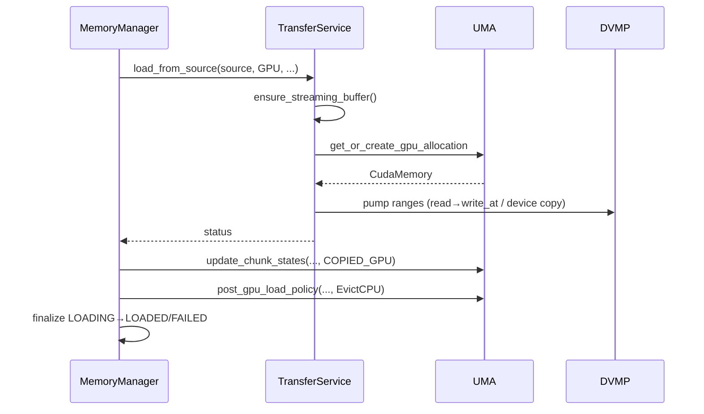
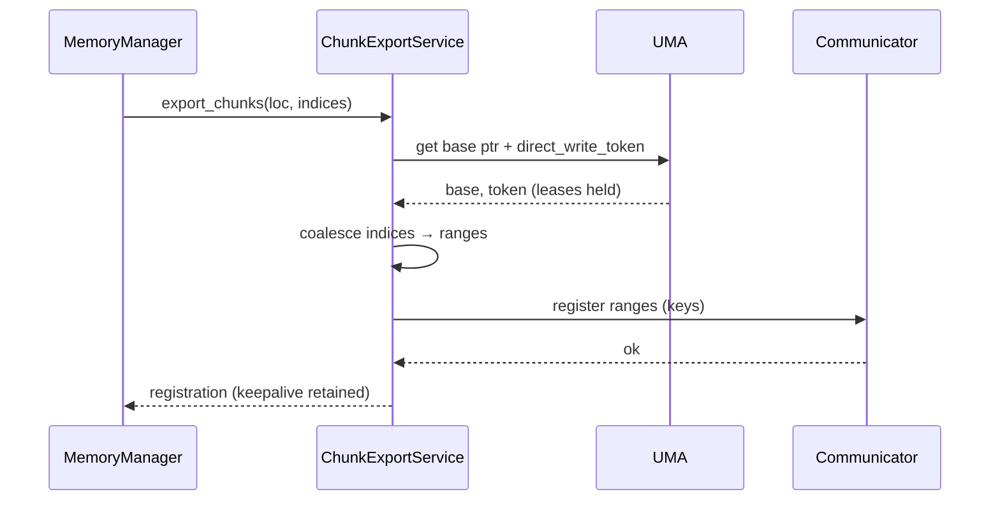

# Summary

This design consolidates the memory and data‑movement architecture across DVMP (Distributed Virtual Memory Pool), UMA (ReplicaMemoryCoordinator), MemoryManager (façade), a new TransferService, and a ChunkExportService. It formalizes DVMP 2.0 semantics, a unified loader sink contract, UMA’s sole ownership of VRAM and chunk state, and centralizes P2P export/unexport. The design aims for correctness under concurrency, clear ownership, low contention, and robust observability.

Key outcomes:
- DVMP 2.0: per‑artifact region handles, coherent per‑chunk state, DVMP‑owned IO (`write_at`, `map_file_segments`), and pin leases for safe external exposure.
- Unified loader contract: all data paths pump via `pump_ranges(...)` into `PositionedSink::write_at(offset, ...)` sinks; optional capability negotiation via `DirectWritableSink` with automatic staged fallback.
- UMA authority: single source of truth for DRAM/VRAM base pointers and chunk states; sole owner of VRAM allocations via `get_or_create_gpu_allocation`.
- MemoryManager becomes a thin orchestration façade (capture → delegate → finalize) without long‑running work under its mutex.
- TransferService: owns CPU↔GPU copies and DISK/REMOTE→CPU/GPU pumping, plus StreamingPinnedBuffer (SPB) lifecycle, sizing, and alignment.
- ChunkExportService: centralizes P2P export/unexport with UMA‑provided pin/translation helpers; maintains registrations and leases.

```mermaid
flowchart LR
  subgraph Loaders
    S1[FilePartitionSource]
    S2[RemoteKeySource]
    MUX[MuxSeekableSource]
    S1 --> MUX
    S2 --> MUX
    PUMP[Pump Ranges]
    BUF[StreamingPinnedBuffer\n(BufferPool via Adapter)]
    MUX --> PUMP
    PUMP -.producers/consumer.-> BUF
  end

  subgraph Sinks
    DVS[DVMPRegionSink\n(PositionedSink + DirectWritableSink)]
    GPS[GPUMemorySink\n(PositionedSink)]
  end

  subgraph Memory
    UMA[ReplicaMemoryCoordinator]
    MM[MemoryManager]
    DVMP[Distributed Virtual Memory Pool]
  end

  PUMP -->|Positioned writes| DVS
  PUMP -->|Positioned writes| GPS
  DVS -->|DVMP write_at| DVMP
  MM <-->|alloc/export/evict| DVMP
  MM -->|provide DVMP region/base| DVS
  MM -->|GPU ptr/stream| GPS
  PUMP -->|after close(): finalize_load()| MM
```

# Goals / Non‑Goals

Goals
- Unified, coherent memory and IO policy centered on DVMP and UMA.
- Clear separation: façade (orchestration) vs. execution (DVMP/UMA/transfer/export).
- Correctness for partial/range loads under concurrency via positioned writes.
- Safe external exposure with pin leases and deterministic lifetimes.
- Low contention via per‑artifact handles and local locking.
- Preserve external `Artifact` API and enable incremental migration.

Non‑Goals / Constraints
- No new “runtime engine” layers beyond TransferService and ChunkExportService.
- No public loader API changes beyond the unified sink contract.
- No separate HostStagingManager; staging resides in TransferService.

# Architecture & Interfaces

Ownership boundaries
- DVMP
  - CPU VA reservation and per‑chunk metadata/state.
  - Performs `write_at` and `map_file_segments` (DVMP‑owned IO) and issues/resolves pin leases.
  - Exposes per‑artifact `DvmpRegion` handles for low‑contention operations.
- UMA (ReplicaMemoryCoordinator)
  - Sole owner of VRAM allocations on each device; returns base pointers and streams.
  - Owns chunk‑level state for CPU/GPU and direct‑write tokens for sinks.
  - Synchronizes CPU chunk states from DVMP after loads: `sync_cpu_chunk_states(ranges)`.
- MemoryManager (façade)
  - Capture inputs and set destination LOADING under lock, delegate out‑of‑lock to services, finalize LOADED/FAILED.
  - Provides small pass‑through helpers to UMA/Transfer/Export (no long operations under `mutex_`).
- TransferService
  - Owns SPB lifecycle: sizing, alignment (SPB chunk divides DVMP chunk; 4KiB multiple), back‑pressure.
  - Executes data paths:
    - DISK/REMOTE → CPU: `DVMPRegionSink` + `pump_ranges` into `write_at`.
    - DISK/REMOTE → GPU: ensure UMA GPU allocation; `GPUMemorySink` + `pump_ranges`.
    - CPU↔GPU streaming copies.
- ChunkExportService
  - Centralizes CPU/GPU export/unexport for P2P, coalesces indices into DVMP‑aligned ranges.
  - Acquires UMA leases/tokens and registers ranges with the Communicator; retains keepalives.

Unified loader contract
- A single pumping API: `pump_ranges(...)`.
- All sinks implement `PositionedSink::write_at(offset, data)` to guarantee placement.
- `DirectWritableSink` capability negotiates remote→destination direct writes with automatic fallback to staging.
- Loaders call `MemoryManager::finalize_load(...)` after `sink->close()`.

# DVMP Preemptibility (CPU memory)

Semantics
- DVMP regions/chunks can be marked preemptible to allow the system to reclaim CPU RSS without giving up the virtual address reservation or artifact metadata.
- Preemption converts a resident, writable anonymous mapping into a non‑resident or file‑backed, read‑only placeholder for the affected range. VA, chunk layout, and offsets remain stable.
- Any consumer write (e.g., via `write_at`) transparently re‑hydrates the affected pages by remapping to writable anonymous memory for the minimal subrange needed.

State and transitions (per chunk)
- ResidentHot (anon RW) → MarkPreemptible → EligiblePreemptible
- EligiblePreemptible → Preempt → PlaceholderRO (file‑mapped) | Unmapped (if no durable file); remains logically present in DVMP
- PlaceholderRO/Unmapped → RehydrateOnAccess → ResidentHot (anon RW)
- Pinned (lease count > 0) is an attribute that forbids Preempt while active; it coexists with ResidentHot and PlaceholderRO but blocks transitions to Preempt.

Pin leases and safety
- Pin leases (issued by DVMP) prevent preemption of leased ranges. UMA and services must acquire leases for external exposure (P2P export, IPC) and direct‑write windows.
- `preempt(ranges)` skips or errors on pinned subranges; the operation is idempotent on already‑preempted ranges.
- UMA is responsible for acquiring/releasing leases when orchestrating flows that require stability.

Triggers and policy (owned by UMA)
- After GPU load: default policy is `EvictCPU`; alternative is `MarkPreemptible` to keep a low‑cost rehydrate path. Policy is configurable per workload.
- Memory pressure: UMA may invoke `preempt(ranges, reason=MEM_PRESSURE)` based on RSS budget, high‑water marks, or aging (LRU) tracked via DVMP chunk touch time.
- Fairness: UMA enforces per‑artifact and global budgets; preemption candidates are chosen among `EligiblePreemptible` chunks by age/size.

Interactions with IO and loaders
- `write_at` on PlaceholderRO re‑maps the specific subrange to anonymous RW and updates chunk heat/timestamps.
- `map_file_segments` may materialize RO placeholders; `ensure_writable_mapping` upgrades on demand.
- TransferService DISK/REMOTE→CPU writes simply call `write_at`; demand rehydrate occurs inside DVMP.

APIs (illustrative)
- DVMP
  - `mark_preemptible(region, ranges)` → mark chunks eligible; does not reclaim RSS by itself.
  - `preempt(region, ranges, reason)` → convert eligible ranges to placeholders/unmapped; returns bytes reclaimed.
  - `ensure_writable_mapping(region, offset, len)` → internal helper for `write_at` to rehydrate minimal subrange.
- UMA
  - `post_gpu_load_policy`: `EvictCPU` (call `preempt`), or `MarkPreemptible`.
  - `ensure_cpu_resident(region, ranges)` when a caller requires CPU residency prior to an operation.

Observability
- Metrics
  - `dvmp_preempt_bytes_total`, `dvmp_preempt_events_total{reason}`
  - `dvmp_rehydrate_bytes_total`, `dvmp_rehydrate_events_total{path∈{write_at,map_file_segments}}`
  - `dvmp_preempt_blocked_total` (attempts blocked by leases)
- Logging
  - VLOG(1) for policy decisions; VLOG(2) for reclaimed ranges; LOG(ERROR) on partial failures with affected ranges.

Failure modes and guarantees
- Preemption never breaks leases: leased ranges remain resident; operations return `FAILED_PRECONDITION` when a forced preempt is attempted on pinned chunks.
- If no durable file‑backing exists for a range, UMA must not preempt unless it guarantees re‑materialization from a source (disk/remote). Otherwise the chunk must remain ResidentHot or be explicitly reloaded.
- VA stability is guaranteed: addresses and offsets do not change due to preemption/rehydration.

Concurrency and locking
- DVMP: global map mutex for model registry and per‑artifact mutex for region operations.
- MemoryManager: never hold its mutex while invoking UMA/DVMP/Communicator operations that may block.
- UMA: avoid holding DVMP locks across external calls; if unavoidable, acquire UMA → DVMP and release in reverse.
- RAII finalizer ensures exactly‑once LOADING→LOADED/FAILED transition per async path.

Observability and metrics
- DVMP: `dvmp_write_bytes_total`, `dvmp_map_bytes_total`, `dvmp_pin_leases_total{reason}`.
- Loader/transfer: `loader_bytes_total{source,location,mode∈{staged,direct}}`, `transfer_bytes_total{direction}`, `transfer_latency_ms{path}`.
- Export: `chunk_exports_total{location}`; registration keys logged at VLOG(2).
- UMA state telemetry: `artifact{location,state}` and transition logs.

Representative interfaces (illustrative)
- UMA
  - `get_or_create_gpu_allocation(device)`
  - `sync_cpu_chunk_states(ranges)`
  - `update_chunk_states(..., COPIED_GPU)`
- MemoryManager
  - `load_async_from_source(source, target, concurrency, chunk_indices)`
  - `finalize_load(location, ranges)`
- TransferService
  - `ensure_streaming_buffer(capacity_chunks)` / `release_streaming_buffer()`
  - `load_from_source(source, Dst)` / `copy_cpu_to_gpu_streaming` / `copy_gpu_to_cpu_streaming`
- ChunkExportService
  - `export_chunks(location, indices)` / `unexport_chunks(location, indices)`

# Schema Changes

None. This design covers in‑process memory management, IO paths, and P2P export; it does not introduce or alter persisted schemas.

# Trade‑offs & Risks

Risks and mitigations
- Hidden DVMP semantic dependencies → Centralize DVMP‑affecting ops in UMA; IO in TransferService; export in ChunkExportService.
- Missed async finalization → RAII finalizer enforces LOADING→LOADED/FAILED exactly once.
- Performance regressions from additional layers → Services are in‑process; zero‑copy preserved; positioned writes avoid rework.

Alternatives considered
- Keeping staging/export logic in MemoryManager increased lock coupling and deadlock risk; rejected in favor of clear service ownership.

# Compatibility & Acceptance Criteria

Compatibility
- External `Artifact` API remains unchanged.
- Internal façades keep method signatures while delegating to UMA/Transfer/Export.

Acceptance criteria
- All loader paths pump via `pump_ranges(...)` into positioned sinks with capability negotiation.
- UMA exclusively owns VRAM allocations and chunk state updates; CPU chunk state sync occurs after DVMP writes.
- TransferService manages SPB lifecycle and executes DISK/REMOTE→CPU/GPU and CPU↔GPU copies.
- ChunkExportService centralizes export/unexport and maintains leases/registrations.
- Concurrency rules and metrics are implemented as specified.

# References

- Owning code paths: see `related_code` in frontmatter.
- Architecture docs: [Architecture Overview](../architecture/architecture-overview.md), [P2P Transfer Strategies](../architecture/p2p-transfer-strategies.md), [Artifact Loading Workflow](../internals/model-loading.md).
 

## Appendix

DISK/REMOTE → GPU (streaming)



P2P Export


