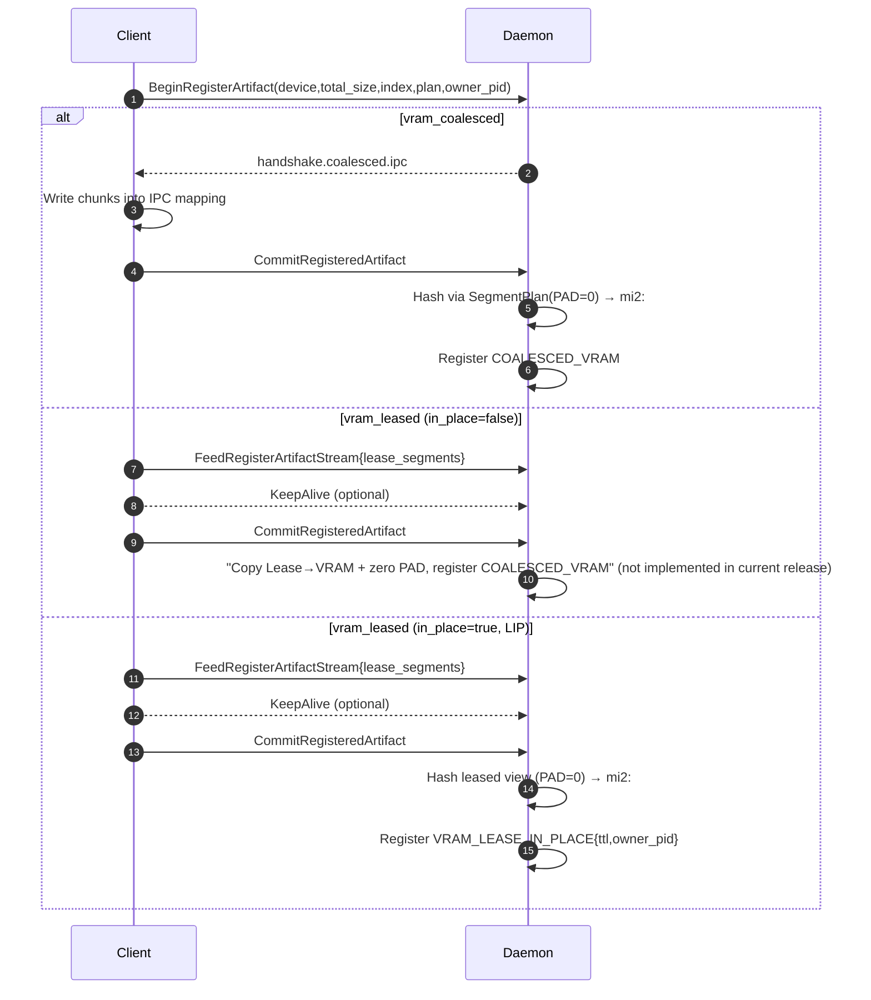
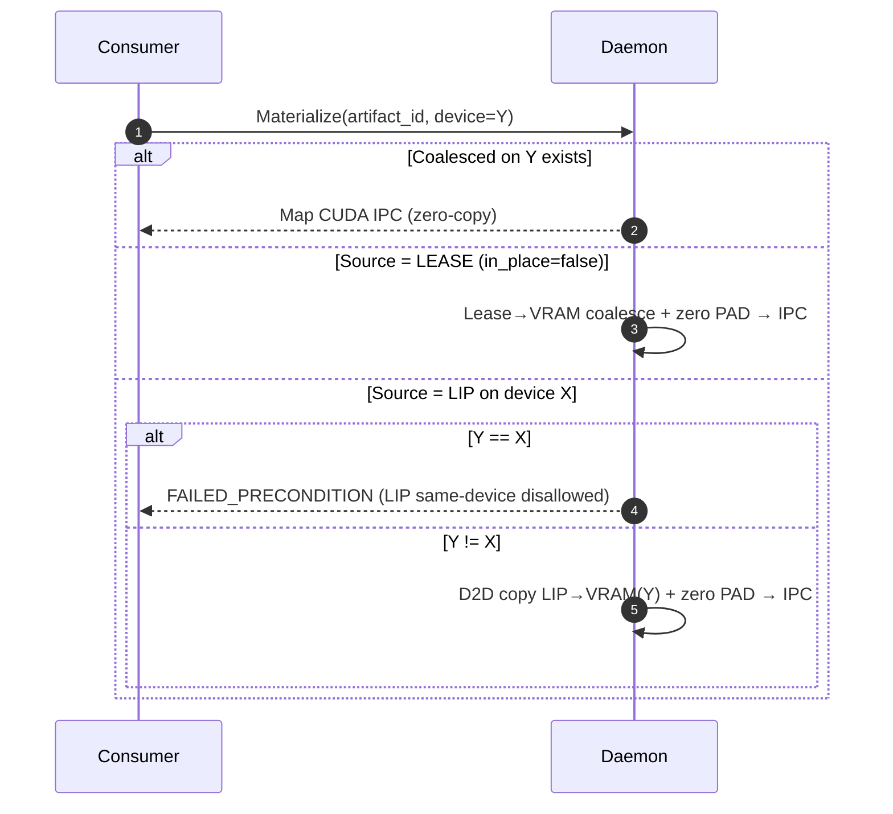

# Summary

This design consolidates prior proposals into a single, safe, and performant model for registering in‑memory artifacts in TensorCast. It unifies identity, control‑plane RPCs, data‑plane semantics, and lifecycle management across registration plans while preserving the same‑machine zero‑copy invariant and enforcing staged‑only cross‑machine transfers.

Core elements:
- AVBS (Artifact Virtual Byte Stream) as the canonical linearization of artifact bytes, driven by Canonical Index v2 and a SegmentPlan of DATA and PAD segments.
- Unified identity: `mi2:` IDs computed over canonical index and AVBS bytes (with PAD=0) that are invariant across plans.
- One RPC family for Begin/Feed/KeepAlive/Commit/Abort/Revoke across all plans.
- Clear plan behaviors: Coalesced VRAM, Lease (materialize‑on‑Commit), and Lease‑In‑Place (LIP, ephemeral, TTL‑bound).

## Implementation status (current release)

- Supported:
  - vram_coalesced
  - vram_leased with in_place=true (LIP)
- Not yet implemented:
  - vram_leased with in_place=false ("materialize on Commit" to daemon VRAM). The current daemon implementation always treats Lease as in-place at Commit.

# Goals / Non‑Goals

Goals
- Provide a single registration model that covers VRAM coalescing and lease workflows with consistent identity and RPCs.
- Preserve same‑machine zero‑copy via daemon‑owned coalesced VRAM; make cross‑machine transfers staged‑only.
- Ensure byte‑equivalence of identities across plans via SegmentPlan(PAD=0) hashing.
- Establish clear liveness, ownership, and safety properties (PID‑bound KeepAlive; TTL‑gated LIP).

Non‑Goals
- Multi‑device single‑artifact layouts (left for a future revision).
- Direct RNIC memory registration on non‑daemon‑owned memory.
- Identity for sparse/quantized/special layouts beyond the covered dense strided tensors.

# Architecture & Interfaces

## Concepts & Terminology

- Canonical Index v2: Each tensor entry includes `offset (u64)`, `size (u64)`, `shape (u64[])`, `stride (u64[])`, `dtype (string)`, and `storage_offset (u64)`. `offset` values are 8‑byte aligned.
- AVBS (Artifact Virtual Byte Stream): Canonical linearization defined by the index and a SegmentPlan over DATA and PAD ranges. PAD ranges are conceptually zero‑filled and never transmitted.
- SegmentPlan(PAD=0) hashing: Identity is computed over the AVBS linearization with PAD treated as zeros, ensuring equivalence across plans that differ only in placement.
- Unified identity (mi2): `artifact_id = "mi2:" + index_multihash + ":" + data_multihash`.
- Replica types:
  - COALESCED_VRAM: Daemon‑owned contiguous GPU memory (zero‑copy via CUDA IPC on the same machine).
  - VRAM_LEASED: Lease plan materialized to daemon VRAM at Commit (`in_place=false`).
  - VRAM_LEASE_IN_PLACE (LIP): Ephemeral, post‑Commit lease over producer VRAM; TTL‑bound, PID‑owned; same‑device consumption disallowed.

## SDK API (Python)

Single entry point; the SDK chooses the plan and handles IPC details.

```
def register_artifact(
    state_dict: dict[str, "torch.Tensor"],
    artifact_key: str | None = None,
    *,
    plan: Literal["vram_coalesced", "vram_leased"] = "vram_coalesced",
    enable_p2p: bool = True,
    lease_in_place: bool = False,
    ttl_ms: int | None = None,
) -> "RegisteredArtifact":
    ...
```

Behavioral notes
- Builds Canonical Index v2 (8‑byte alignment) and computes index key.
- Computes AVBS SegmentPlan; zero‑fills PAD for hashing and materialization.
- Runs Begin → Feed (for Lease) → optional KeepAlive → Commit.
- vram_coalesced: Daemon allocates coalesced VRAM; client writes via IPC; Commit registers COALESCED_VRAM.
- vram_leased: Currently only `lease_in_place=True` (LIP) is implemented and registered at Commit (ephemeral, TTL/KeepAlive). The `lease_in_place=False` (materialize to COALESCED_VRAM at Commit) variant is not implemented in this release.
- API users must call `tensorcast.init()` before invoking registration helpers; the runtime reuses the singleton daemon client established during initialization.

## Control Plane RPCs (Unified)

The daemon exposes one RPC family shared across plans:
- BeginRegisterArtifact
- FeedRegisterArtifactStream (streaming; plan‑specific payloads)
- KeepAliveRegisterArtifact (pre‑Commit registration liveness; post‑Commit LIP lease liveness)
- CommitRegisteredArtifact
- AbortRegisteredArtifact (idempotent pre‑Commit cleanup)
- RevokeRegisteredArtifact (idempotent post‑Commit lease revoke)

Key fields and behaviors
- Begin validates device/size/index and emits plan‑specific handshakes (e.g., IPC mapping for coalesced VRAM).
- Feed for Lease provides `lease_segments(dst_offset,len,...)` covering DATA ranges; PAD is implicit and zero‑filled by the daemon.
- KeepAlive requires `owner_pid` matching Begin; extends registration or LIP lease.
- Commit computes `mi2:` over AVBS with PAD=0 and registers the replica type.

## Data Plane & Materialization

Principles
- Same‑machine zero‑copy: consumers map daemon‑owned COALESCED_VRAM via CUDA IPC.
- Cross‑machine transfers: staged‑only (per unified stagers); PAD is not transmitted and is zero‑filled by receivers.

Plan behaviors
- vram_coalesced: Client writes into daemon allocation via IPC; Commit registers COALESCED_VRAM.
- vram_leased (in_place=false): Not implemented in current release (planned); would materialize Lease→VRAM; P2P remains staged‑only.
- vram_leased (in_place=true, LIP): Commit registers VRAM_LEASE_IN_PLACE with TTL/KeepAlive; same‑device consumption is rejected; cross‑device local materialization copies device‑to‑device into new COALESCED_VRAM; P2P staged‑only with optional receiver‑side verification.

### Registration Flow (Mermaid)



Note: The `vram_leased (in_place=false)` branch is not implemented in the current release; the daemon executes the LIP branch for Lease.

### Same‑Machine Materialization (Mermaid)



# Invariants & Error Model

Invariants
- Identity invariance: `mi2:` computed from Canonical Index v2 and AVBS with PAD=0 is identical across plans.
- Same‑machine zero‑copy: Only daemon‑owned COALESCED_VRAM is exported via CUDA IPC to consumers.
- Staged‑only cross‑machine: No direct RNIC MR on lease/LIP memory.
- Liveness and ownership: `owner_pid` is required on Begin/KeepAlive; LIP leases are TTL‑bound and PID‑owned.
- Safety: LIP same‑device consumption is rejected; PAD is never transmitted and is zero‑filled by receivers.

Error taxonomy
- INVALID_ARGUMENT (bad index/args, out‑of‑bounds)
- FAILED_PRECONDITION (plan constraints such as LIP same‑device)
- DEADLINE_EXCEEDED (registration/lease expired)
- NOT_FOUND (unknown/expired registration/lease)
- RESOURCE_EXHAUSTED (pool/memory caps)
- PERMISSION_DENIED (IPC open failure/policy/PID mismatch)
- DATA_LOSS (receiver‑side verification mismatch)

# Schema Changes (if any)

- Introduce (or confirm) an `artifact_index` table in the Global Store to persist canonical index blobs by key. Replicas reference the `tensor_index_key` only.
- Server computes and returns unified `mi2:` identity at Commit; clients do not provide artifact IDs on Begin.
- No other schema changes are required by this design.

# Trade‑offs & Risks

Trade‑offs
- SegmentPlan(PAD=0) hashing vs. scanning raw memory: only the former ensures cross‑plan byte equivalence and prevents cache fragmentation.
- Server‑computed identity at Commit centralizes authority and simplifies retries but requires consistent server‑side hashing logic.
- Materialize‑to‑VRAM preserves zero‑copy at the cost of an extra copy in some flows; LIP avoids copies for ephemeral sharing but forbids same‑device aliasing and relies on TTL/verification.

Risks and mitigations
- Wide memory pinning or NUMA penalties: avoided by prohibiting direct RNIC MR on non‑owned memory.
- Lease misuse or leak: TTL‑gated leases, PID ownership checks, idempotent revoke.
- P2P data integrity: optional receiver‑side verification for LIP; DATA_LOSS on mismatch.

# Compatibility & Acceptance Criteria

Compatibility
- Unified identity at Commit; clients no longer supply `artifact_id` on Begin.
- Wire addition: `owner_pid` required on Begin/KeepAlive.
- Legacy clients embedding index blobs may upsert once; replicas continue to reference only the key.

Acceptance criteria
- Identity equivalence across plans validated by hashing equivalence tests.
- Same‑machine zero‑copy observed for COALESCED_VRAM; cross‑machine paths use staged transfers only.
- LIP enforces TTL gating, PID ownership, and same‑device prohibition.
- Canonical Index v2 invariants (8‑byte alignment, dtype/shape/stride/storage_offset validity) pass validation.

# Observability & Security

Observability
- Counters/latency for Begin, Feed, Commit, Abort, KeepAlive, Revoke.
- Staging metrics: staged bytes, pool occupancy, release queues.
- Lease/LIP: export/unlock totals, verification failures, TTL expirations, PID auto‑revokes.

Security & policy
- Same‑process CUDA IPC fallback is disabled.
- No direct RNIC MR on lease/LIP memory; cross‑machine is staged‑only.
- LIP exports use short‑lived IPC mappings; policy may require receiver‑side verification for P2P.
- Access control and audit logging on index retrieval, replica registration, and transport key export.

# References

- Canonical index and AVBS linearization within TensorCast Store Engine (core/store).
- Unified stagers for P2P (GPU/DRAM) and staged‑only transfer policy (daemon, communicator).
- Global Store key‑first indices, descriptors, replicas; index lookup via `GetArtifactIndex`.
