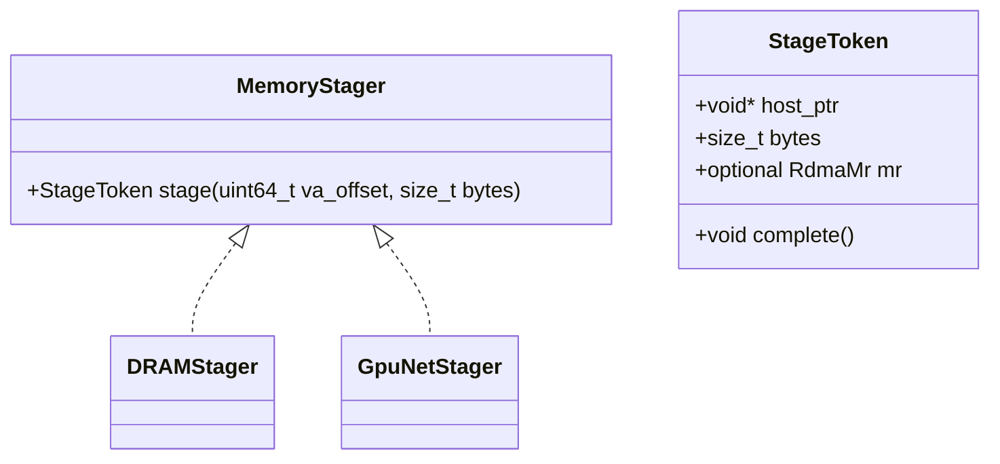
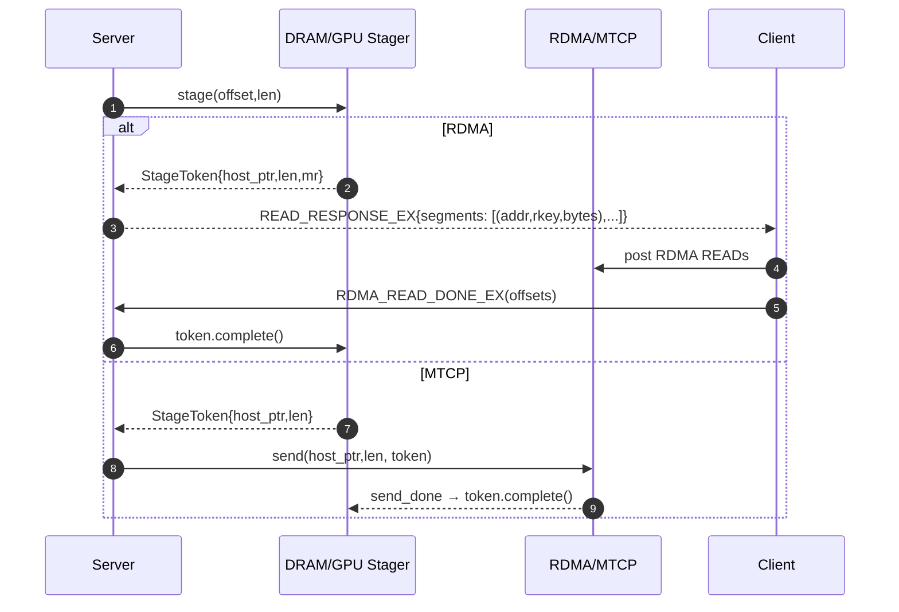

# Summary

Unify CPU/GPU staging for network transfers behind a single MemoryStager interface and make cross-machine transfers staged-only. Instead of registering DVMP (UMA) virtual addresses or producer VRAM directly with the RNIC, the system stages requested ranges into small, reusable host‑pinned buffers. RDMA paths advertise the pre‑registered MR of those pool buffers; MTCP paths use the same buffer for socket I/O. Staging tokens are reference‑counted/RAII and are released on explicit ACK (RDMA) or send completion (MTCP). This design removes large‑region pinning, aligns with DVMP eviction policy, and provides NUMA‑aware pool selection.

# Goals / Non‑Goals

Goals
- Unified staging abstraction that hides CPU/GPU and RDMA/TCP differences.
- Eliminate direct RDMA over DVMP VA and producer VRAM; use staged‑only responses for safety and performance predictability.
- Bound memory and pinning: small chunked staging, immediate DVMP lease release after memcpy, and permanent MR registration only on stable pool buffers.
- NUMA‑aware pool selection for better locality to NICs and GPUs.
- Protocol evolution using EX variants and ACKs for staged RDMA.

Non‑Goals
- Automatic NUMA discovery or distance scoring beyond an initial configurable mapping.
- End‑to‑end transfer planning, fairness, or autotuning policies (left to higher layers/planners).
- Changing client SDK APIs; this is an internal transport/runtime design.

# Architecture & Interfaces

## Concepts

- MemoryStager: component that produces host‑pinned slices suitable for transport from either DVMP (CPU) or VRAM (GPU) sources.
- StageToken: scoped handle carrying `host_ptr`, `bytes`, and optional `RdmaMr`, plus `complete()` to return resources.
- DRAMStager: DVMP VA → host‑pinned copy; holds a DVMP lease only for the duration of memcpy and then releases it.
- GpuNetStager: VRAM → host‑pinned D2H via `cudaMemcpyAsync`; emits token upon completion.
- PinnedMemoryPool: per‑NUMA pools of pinned buffers; each buffer is permanently registered per RNIC PD with cached `ibv_mr`.

## Class model (Mermaid)



## Transport semantics
- RDMA server READ handling returns staged segments whose addresses/rkeys point to pool MRs. The client posts READs against those MRs and must send `RDMA_READ_DONE_EX` to allow buffer reclamation.
- MTCP uses the same staged buffers for socket I/O and returns tokens on send completion.
- All staged responses are EX‑variant messages; legacy single‑segment messages are deprecated.

## Protocol (EX variants)

- READ_RESPONSE_EX: server can return multiple staged segments `(addr, rkey, bytes)` for a request slice.
- RDMA_READ_DONE_EX: client ACKs one or more completed segments by offsets; server releases tokens.
- TTL reaper: staged tokens are reaped if ACKs are missing after `ack_ttl_ms`.

## Configuration (Unified)

Typed, layered config is shared across C++ and Python (mirrored by proto):

- stager:
  - `stage_cpu_for_rdma: bool` (default true)
  - `stage_chunk_mb_cpu: uint32` (default 4)
  - `stage_chunk_mb_gpu: uint32` (default 16)
  - `buffers_per_flow: int` (default 4)
- rdma:
  - `outstanding_wr: int` (default 64)
  - `ack_ttl_ms: int` (default 30000)
  - `traffic_class: int` (default 186)
  - `qp_timeout: int` (default 20), `qp_retry: int` (default 7)
- pool:
  - `preregister_mr: bool` (default true)
  - `pool_size_bytes: uint64` (default 8 GiB)
  - `chunk_bytes: uint64` (default 64 MiB)
  - `simple_numa.enable: bool` and `simple_numa.nodes[]` mapping `{id, nics[], gpus[], default?}`
- transport:
  - `tcp_conn_count: int` (default 8), `connect_timeout_sec: int` (default 10), `tcp_tos: int` (default 0)
- affinity:
  - `enable: bool` (reserved)

Selection rules
- GPU staging → pool for the NUMA node that lists the GPU id.
- CPU staged RDMA → pool for the NUMA node that lists the NIC name.
- CPU staged MTCP → default node (or NIC‑local if configured).

# Invariants & Error Model

Invariants
- DVMP leases are held only during memcpy in DRAMStager; leases are released before tokens are returned to callers.
- MR registration never occurs over DVMP VA or producer VRAM; only over pool buffers.
- StageToken must be completed exactly once. RDMA tokens require ACK; MTCP tokens are completed upon send completion.
- Staged‑only across machines: PAD bytes are never transmitted and are zero‑filled by receivers.

Error model
- Submission errors surface as immediate status failures (e.g., DVMP lease failure, CUDA copy launch failure).
- Runtime failures propagate via transport completion paths; tokens are still completed or reaped by TTL.
- Missing ACKs trigger TTL reaping; repeated occurrences are logged and metered.

# Trade‑offs & Risks

Trade‑offs
- Adds one memcpy for CPU staged RDMA but avoids large‑region pinning and MR churn; overall more predictable.
- Requires explicit ACKs on RDMA staged segments, introducing a small control overhead.
- NUMA mapping is manual initially; misconfiguration falls back to a default pool.

Risks and mitigations
- Pool exhaustion under bursty loads → back‑pressure and configurable chunk sizes/buffers per flow limit memory use.
- Incomplete ACKs causing buffer leaks → TTL reaper and metrics for `ack_pending_total` with alerts.
- Throughput regressions from chunk sizing → configurable defaults with headroom; later autotune can adjust at runtime.

# Acceptance Criteria
- No RDMA MRs over DVMP VA or producer VRAM; MRs only on pool buffers.
- No DVMP leases held beyond memcpy duration.
- End‑to‑end throughput within ±5% of baseline for 10–50 GB and scalable without pinning blowups; staged RDMA shows stable latency distribution.
- Bounded pool memory and observed back‑pressure instead of system‑wide pin growth.

# References

- Related designs: `docs/designs/0002-dvmp-uma-transfer-architecture.md`, `docs/designs/0004-unified-runtime-config.md`
- Key code paths:
  - `core/store/replica/chunk_export_service.*` (window export and registration behavior)
  - `core/communicator/engine/engine.*` (registration options, staged READ path, inflight tracking)
  - `core/common/memory/pinned_memory_pool.*` (pinned pools, MR registry)
  - `core/communicator/transport/mtcp_transport.*` (staged send path)

# Appendix — Proposed Interfaces (sketch)

```cpp
// memory_stager.h
struct StageToken {
  void* host_ptr;
  size_t bytes;
  struct ibv_mr* mr; // optional
  std::function<void()> complete; // RAII/explicit
};

class MemoryStager {
 public:
  virtual ~MemoryStager() = default;
  virtual absl::StatusOr<StageToken> stage(const communicator::tensor_t& t,
                                           uint64_t offset,
                                           size_t bytes) = 0;
};

struct RegisterTensorOptions {
  bool register_mr = true;    // false for DVMP/GPU logical windows
  bool needs_staging = false; // true for GPU; true for CPU when policy requires
  int device_id = -1;
};
```


