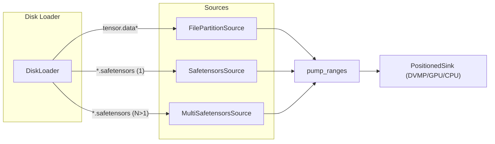

# Summary

Provide first-class, high-performance loading from `.safetensors` artifacts while preserving the unified loader pipeline: `SeekableSource → pump_ranges → PositionedSink`. The design introduces `SafetensorsSource` (single-file) and `MultiSafetensorsSource` (multi-file concatenation of payloads) that present only the binary payload as a contiguous logical byte space, hiding the format header. Python builds a canonical v2-style index from safetensors headers to keep metadata handling uniform. Direct I/O is disabled for safetensors sources to avoid alignment pitfalls; performance relies on the page cache. Verification hashes only the data payload(s), excluding headers.

# Goals / Non‑Goals

Goals
- Load directly from one or more `.safetensors` files with no changes to `pump_ranges` or sinks.
- Keep a single, uniform data path (seekable source → ranges pump → positioned sink).
- Preserve performance parity with the existing partitioned format; avoid extra copies.
- Normalize metadata to the existing v2 index semantics (offset, size, shape, stride, dtype, storage_offset).
- Maintain verification support with hashing over the true tensor payload bytes only.

Non‑Goals / Constraints
- Do not materialize or rewrite `tensor_index.json`/`cbor` on disk for safetensors inputs.
- Do not change the `SeekableSource` interface (no new pure virtuals).
- Do not support sub‑byte dtypes (e.g., 4‑bit) under this design; raise a clear error.
- Do not use O_DIRECT for safetensors payload reads due to unaligned data starts.

# Architecture & Interfaces

## Source layer (C++)

- SafetensorsSource: `SeekableSource` that exposes the payload of a single `.safetensors` file as a contiguous byte space starting at logical offset 0. Internally parses the 8‑byte little‑endian header length, validates the JSON header, computes `data_start = 8 + header_length`, and sets `data_size = file_size - data_start`. Implements `read_at` via `pread(fd, data_start + off, ...)`. Provides a concrete `total_size()` accessor. Sequential `read()` maintains an internal offset guarded by a mutex. Direct write is disabled.
- MultiSafetensorsSource: `SeekableSource` that concatenates the payloads from multiple `.safetensors` files, sorted lexicographically by filename. Pre‑parses all headers to build segments `(fd, data_start, data_size, base_offset)` and maintains prefix sums for O(log N) segment location. Implements `read_at` spanning segments. Provides `total_size()`. Sequential `read()` is guarded by a small mutex. Direct write is disabled.
- Shared utility: `ParseSafetensorsHeader(fd)` validates header length and returns `{header_length, data_start, data_size}`. `BuildCanonicalIndexFromSafetensors(files)` constructs canonical v2 index JSON from one or more safetensors headers.

## DiskLoader detection (C++)

- Initializes by scanning the artifact directory:
  - Prefer the standard partitioned format if `tensor.data` or `tensor.data_*` exist (current behavior).
  - If no partitions are found, probe for `*.safetensors`. Sort by filename. For each file, parse the header to compute `data_size_i`; set `artifact_size = Σ data_size_i` and memoize ordered paths.
- `open_source()` returns `SafetensorsSource` for one file or `MultiSafetensorsSource` for multiple files; otherwise returns `FilePartitionSource`.
- Descriptor enforcement stays on for the standard format; safetensors inputs are exempt from `artifact_descriptor.json`/`tensor_index.(json|cbor)` checks (may be backfilled separately per design‑0007).

## TransferService size fallback (C++)

- UMA remains authoritative for total size when available. Fallbacks read `total_size()` from `FilePartitionSource`, `SafetensorsSource`, or `MultiSafetensorsSource` when UMA lacks a value.

## Canonical index for safetensors (C++/Python)

- C++ builds canonical v2 index bytes from one or more safetensors headers: entries are sorted by tensor name with fixed field order `[offset, size, shape, stride, dtype, storage_offset]`. Offsets are relative to the concatenated payload space (`base_offset_i + begin`). Storage offset is always 0 for safetensors.
- Python (`tensorcast/api/_indices.py`) calls into the C++ binding (`build_canonical_index_from_safetensors(...)`) and decodes the JSON to produce:
  - TensorMetaIndex: `(shape, stride, torch_dtype, storage_offset)`
  - TensorDataIndex: `(offset, size)`
- Dtype mapping covers `F16/F32/F64/BF16`, `I8/I16/I32/I64`, `U8`, and `BOOL` (mapped to `torch.uint8`). Sub‑byte dtypes are rejected.
- Duplicate tensor keys across files are rejected (strict mode by default). `__metadata__` is ignored for tensor indices.

## Invariants

- Logical byte space for safetensors sources includes only payload bytes; headers are never exposed to the loader pipeline.
- File ordering is deterministic (lexicographic by filename) for both indexing and concatenation.
- Canonical v2 index ordering and field semantics are preserved; `storage_offset == 0` for all safetensors tensors.
- `pump_ranges` and all sinks operate unchanged; direct‑write paths remain opt‑in and are disabled for safetensors sources.
- Verification, when applied to safetensors, hashes only payload bytes in filename order.

# Schema Changes

No repository‑wide schema changes are required. This design does not modify `schema.sql`. When adopting content‑addressed IDs (design‑0007), safetensors directories may be backfilled with `artifact_descriptor.json`; that is orthogonal to this design.

# Alternatives & Rationale

- Write a `tensor_index.json` to disk from safetensors headers: rejected to avoid extra I/O, on‑disk churn, and drift. Building the canonical index in memory keeps the loader stateless and fast.
- Extend `SeekableSource` with a virtual `logical_size()`: deferred. Targeted `total_size()` accessors and type‑specific fallbacks avoid interface changes.
- Insert an index adapter layer above sources: unnecessary given the uniform source abstraction; hiding headers at the source keeps the pipeline unchanged.

# Trade‑offs & Risks

- O_DIRECT disabled: Unaligned payload starts make direct I/O fragile; relying on page cache is simpler and sufficiently fast in practice.
- Header parsing overhead: Single pass per file on initialization; negligible vs. payload size. Guarded by basic JSON shape checks.
- Duplicate keys: Strict rejection by default may surprise users with heterogeneous shards; can be relaxed later behind a flag if needed.
- Sub‑byte dtype rejection: Explicitly unsupported to avoid stride/packing complexity; can be added in a follow‑on design.
- Deterministic ordering: Filename order is stable but may differ from external conventions; document and enforce within the repo.

# Compatibility & Acceptance Criteria

Compatibility
- Safetensors path is engaged only when no `tensor.data*` is present.
- Preserves v2 index semantics so downstream consumers and P2P paths operate unchanged.
- Works in CPU‑only environments (fake CUDA backend) and real GPU setups.

Acceptance criteria
- Functional: Single‑ and multi‑file safetensors artifacts load correctly; tensors match byte‑for‑byte vs. PyTorch baseline.
- Performance: Throughput within ±5% of partitioned format on representative 4–20 GB payloads.
- Robustness: Cross‑file `read_at` spanning, EOF behavior, and concurrency correctness covered by unit tests; duplicate key detection validated.
- Observability: DiskLoader logs partition counts and computed payload sizes for safetensors inputs.

# References

- Architecture: docs/architecture/architecture-overview.md, docs/internals/model-loading.md.
- Related code: `core/store/loader/*`, `core/store/replica/*`, `tensorcast/api/_indices.py`.
 
