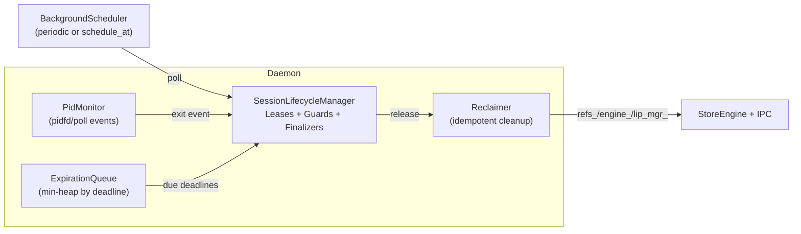
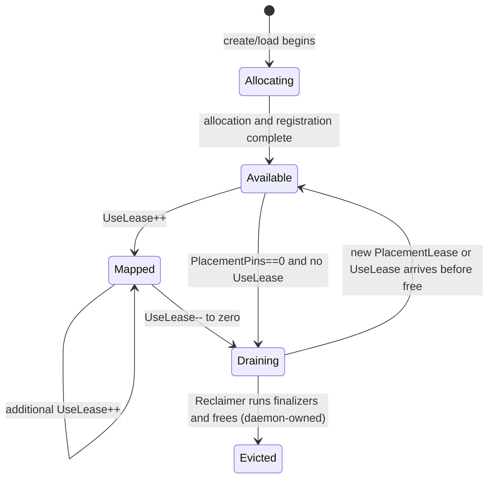

# Summary

Unify the daemon’s session‑related background tasks — `SessionTtlTask`, `RegJoinTtlTask`, and `PidWatchTask` — under a single lifecycle system based on three primitives: Leases, Guards, and Finalizers. A Lease represents a unit of liveness protecting a resource (e.g., a replica) while any Lease remains active. Guards are composable conditions that must hold for the Lease to be active (e.g., heartbeat TTL, absolute deadline TTL, PID liveness). Finalizers are idempotent cleanup actions invoked exactly once when a Lease transitions to retired.

This design removes duplicated scan logic, unifies semantics across registration/join and client liveness, improves latency via event‑driven PID handling, and shifts from full‑table sweeps to O(log n) deadline‑driven expiration. It targets an optimal, compatibility‑free implementation at the daemon runtime level: legacy sweepers are deleted, ad‑hoc pins are replaced by explicit PlacementLeases, and PID scanning is replaced by an event‑driven monitor.

# Problem Statement & Scope

Multiple overlapping background sweepers manage TTLs and liveness today: session TTL, registration join TTL, and PID scanning. Their semantics partly overlapped with ad‑hoc pins and implicit reference counting via `RefTracker`. This led to duplicate scans, unclear ownership, and delayed reclamation under multi‑tenant pressure. The new design removes ad‑hoc pin fields entirely and expresses liveness solely via leases.

Scope: unify all ephemeral lifecycle into a single Lease/Guard/Finalizer system inside the daemon; delete legacy sweepers; make reclamation immediate when safe; add explicit ownership modes; and express prefetch pins via TTLs. No protocol buffer or persistent schema changes are required.

# Terminology & Ownership Modes

We standardize artifact replica lifecycle across two ownership modes and three reference classes created by different call paths (register/put/get) so that a single abstraction can drive correct cleanup and eviction decisions.

- Ownership modes
  - Daemon‑owned (VRAM_COALESCED / CPU): daemon owns the VRAM allocation and exports CUDA IPC handles to clients. Clients only hold mappings; daemon decides placement and eviction.
  - Client‑owned (VRAM_LEASED): a user process owns the VRAM allocation; daemon tracks the commit as a unique, device‑level ownership record and does metadata/book‑keeping. Memory itself is freed by the OS/driver when the process exits.

- Reference classes (all modeled as Leases; see below)
  - PlacementLease: protects the existence of a daemon‑owned replica on a device (pin). May be TTL‑bound (prefetch pin) or Manual (explicit release).
  - UseLease: protects an exported mapping while a process is actively using it (IPC mapping or in‑process handle); PID‑bound.
  - CommitLease: records client‑owned commit (VRAM_LEASED) on a device; PID‑bound and device‑unique per artifact.

These three map 1:1 to Lease kinds composed from Guards and Finalizers; they unify behaviors from register/put/get while allowing mode-specific policies.

# Goals / Non‑Goals

Goals
- Single lifecycle abstraction for session‑related liveness: registration join TTL, session TTL/keepalive, and PID liveness.
- Reduce scanning and lock contention: O(log n) insert/renew/cancel; process only due expirations.
- Event priority: PID exit triggers immediate cleanup; TTL is the safety net.
- Clear invariants and concurrency semantics with idempotent cleanup.
- Unified metrics and tracing for observability and SLOs.
- Optimal path: delete legacy sweepers, integrate a single lifecycle task, replace ad‑hoc pins with explicit leases, and reclaim immediately when eligible.

Non‑Goals
- Changing `VerificationTask` or `EvictionTask` semantics.
- Altering StoreEngine memory model or Global Store APIs.
- Modifying protocol buffers or persistent schemas (no `schema.sql` changes).

# Unifying Model: Session as Principal + Lease Set

- Session
  - A Session is the principal identity and container for all Leases created by a client or a system actor (e.g., manual prefetch). Sessions can be human/app clients, batch jobs, or daemon‑internal actors.
  - API touchpoints (logical): begin_session(), keepalive_session(), end_session(). Existing RPCs bind to or implicitly create Sessions as needed; keepalive refreshes the Session’s HeartbeatGuard where applicable.

- Lease kinds
  - PlacementLease(subject=replica_uuid, principal=sess:<uuid>)
    - Guards: HeartbeatGuard or DeadlineGuard (for TTL prefetch), optional ManualGuard
    - Finalizers: detach IPC exports, decrement pin in refs_, free replica in engine_ if UseCount==0
  - UseLease(subject=replica_uuid, principal=pid:<pid> or sess:<uuid>)
    - Guards: PidLivenessGuard or HeartbeatGuard (non‑PID clients)
    - Finalizers: unmap IPC from client, dec UseCount; if PlacementPins==0 and UseCount==0, reclaim
  - CommitLease(subject=device_commit_key, principal=pid:<pid>)
    - Guards: PidLivenessGuard
    - Finalizers: release device‑unique ownership record; revoke joinable handles, notify engine_ to drop any cross‑process linkage metadata

Note: device_commit_key encodes (artifact_id, device_uuid|ordinal). The daemon enforces single commit per device for VRAM_LEASED via this key.

# Ownership‑Specific Semantics

## Daemon‑owned (VRAM_COALESCED / CPU)

- Register/Load paths
  - register/put: creates PlacementLease per target device, optionally with ManualGuard or TTL via DeadlineGuard.
  - get or get_into: creates UseLease(s) for the caller’s process and, if required, implicitly ensures a PlacementLease exists (create if absent) to back the mapping.

- Eviction policy
  - A replica is eligible for reclamation when: UseCount == 0 AND PlacementPins == 0.
  - PlacementPins is the count of active PlacementLeases; UseCount is the count of active UseLeases.
  - Memory pressure reclaimer prefers:
    1) Expired TTL PlacementLeases with UseCount==0
    2) Idle replicas by LRU of last UseLease end
    3) Otherwise, policy‑driven choices (size, temperature)

- Manual scheduling with TTL (prefetch)
  - Creating a PlacementLease with DeadlineGuard(ttl) “pins warm”. If no UseLease attaches before TTL expiry, the replica is reclaimed at expiry.
  - If a UseLease exists at TTL expiry, only the pin is dropped; replica remains protected by UseCount until uses end.
  - Optional auto‑demote: when the last UseLease ends, if policy allows, keep a short grace pin (e.g., tail TTL) to absorb immediate reuse bursts.

- No‑process case
  - If all processes exit and no PlacementLease remains (i.e., only daemon‑internal pins expired), the replica is reclaimed even if VRAM still holds bytes. This prevents unintended interference with new tenants.

## Client‑owned (VRAM_LEASED)

- Device‑unique commit
  - The daemon maintains `CommitIndex` keyed by device_commit_key. Creating a CommitLease fails with `AlreadyExists` if the key is held by a live PID.
  - No duplicate commit on the same device for the same artifact. A client wanting read‑only access must not “commit”; it should map via daemon‑owned replicas or other allowed mechanisms.

- Lifecycle
  - CommitLease is bound to PidLivenessGuard; on PID exit, the Finalizer drops the ownership record and associated metadata. VRAM is freed by the driver with process teardown.
  - UseLease is generally unnecessary for the owning process; if non‑owners can access client‑owned memory, they must create UseLeases bound to their own PID, and those are invalidated automatically when CommitLease retires.

- TTL and manual pins do not apply to VRAM_LEASED memory as the daemon does not own the bytes; the daemon only tracks ownership and access metadata.

# Replica Lifecycle Model

We model per‑replica counters and states derived from Lease activity. The lifecycle is unified across ownership modes; actions differ in finalizers.

Derived invariants
- EligibleForEviction = (UseCount==0 && PlacementPins==0 && Ownership==Daemon)
- VRAM_LEASED replicas are not freed by daemon; only metadata is cleaned up when CommitLease retires.

# Key Scenarios (Behavior)

- get/get_into → UseLease
  - Successful materialization establishes a UseLease bound to the caller PID. While active, the replica remains mapped for that process. When the process exits or explicitly unmaps, the UseLease retires; if there is no placement pin, the replica becomes reclaimable.

- register_artifact (daemon‑owned) → PlacementLease (+ optional UseLease)
  - Committing to an existing replica establishes a PlacementLease with either a fixed TTL or manual release. TTL expiry removes the pin; if no active uses remain, the replica is reclaimed. If uses remain, memory persists until they end.

- VRAM_LEASED commit → CommitLease (device‑unique)
  - In‑place commits establish a device‑unique CommitLease bound to the owner PID. Duplicate commits on the same (artifact, device) are rejected. When the owner process exits or TTL elapses, only ownership and access metadata are revoked; memory is not freed by the daemon.

- TTL prefetch
  - Creating a PlacementLease with a deadline pre‑positions the replica. If no UseLease arrives within the TTL, the replica is reclaimed; otherwise the pin is dropped while uses continue.

# API Binding (logical mapping)

- register_artifact (daemon‑owned)
  - Create PlacementLease per device with ManualGuard or DeadlineGuard(ttl) if specified.
  - Optionally return immediate mapping which creates a UseLease for the caller’s PID.

- get / get_into (daemon-owned)
  - Ensure PlacementLease for target device (create if needed, policy‑driven lifetime).
  - Create UseLease bound to PID; map IPC; refresh on keepalive; retire on unmap/PID exit.

- commit (VRAM_LEASED)
  - Create CommitLease (PidLivenessGuard). Enforce device‑unique constraint.
  - Optionally publish limited metadata for discovery; no TTL pins.

- prefetch_to(node/device, ttl)
  - Create PlacementLease with DeadlineGuard(ttl) only; no UseLease until a client maps.

# Data Structures & Indices

Extend the Manager with indices to support uniqueness and efficient reclamation decisions.

- `by_subject`: includes both replica_uuid and device_commit_key subjects.
- `commit_index`: map device_commit_key → CommitLease (to enforce uniqueness).
- `replica_stats`: last_use_end_ts, size bytes, temperature used by reclaimer heuristics.

# Finalizers per Lease Kind

- PlacementLease (daemon‑owned)
  - If UseCount==0: detach IPC exports (if any), free memory in engine_, drop refs_.
  - Else: only drop pin; replica remains by virtue of UseLease; reclaimer will retry when UseCount falls to zero.

- UseLease
  - Unmap IPC for that PID, dec UseCount. If now UseCount==0 && PlacementPins==0, schedule free.

- CommitLease (VRAM_LEASED)
  - Remove device‑unique key from `commit_index`.
  - Revoke any cross‑process access records; inform engine_ to drop joinable metadata.
  - Do not touch VRAM; rely on process teardown.

# Failure Cases & Races (mode‑specific)

- Duplicate commit attempt (VRAM_LEASED)
  - Returns `AlreadyExists` with the current holder PID and since timestamp for diagnostics.

- Load races with reclaim (daemon‑owned)
  - If a PlacementLease expired and the reclaimer entered Draining, a new UseLease arrival races the finalizer. Generation tokens ensure either: the finalizer observes new generation and aborts, or the new lease re‑creates placement if finalizer completed.

- PID exit during mapping
  - PidMonitor emits exit; UseLease Finalizer runs and unmaps. Any in‑flight keepalive for the old generation fails with `FailedPrecondition`.

# Observability Additions

- Gauges
  - `tensorcast.daemon.replicas_use_count{artifact_id,device}`
  - `tensorcast.daemon.replicas_placement_pins{artifact_id,device}`
  - `tensorcast.daemon.vram_leased_commits{device}`

- Counters
  - `tensorcast.daemon.commit_denied{reason=duplicate}`
  - `tensorcast.daemon.prefetch_expired_without_use`

- Attributes
  - Add `ownership={daemon|client}` and `lease_kind={placement|use|commit}` to existing lease metrics.

# Policy Hooks

- Prefetch pin policy: default TTL; optional tail‑TTL after last use; per‑artifact overrides.
- Reclaimer policy: LRU within ownership==daemon and UseCount==0; optionally size‑aware.
- Admission control: deny PlacementLease under severe pressure unless caller is priority class.

# Compatibility Notes

- This is a compatibility‑free refactor at the daemon runtime level. Legacy sweepers are deleted and replaced by a single lifecycle task. External RPC surfaces and persistent schema remain unchanged.

# Architecture & Interfaces

## Core Concepts

- Lease
  - Describes a unit of liveness for a subject resource while its Guards hold.
  - Key fields: `lease_id` (opaque), `subject` (e.g., `replica_uuid` with optional `resource_type`), `principal` (e.g., `sess:<uuid>`, `pid:<int>`), `labels` (freeform for metrics), `state` (active → retiring → retired), `generation` (monotonic, avoids ABA), `finalizers` (idempotent cleanup steps).
  - Active iff all Guards hold. Losing any Guard moves the Lease to retiring and schedules cleanup.

- Guards (AND semantics; composable)
  - HeartbeatGuard(ttl): keepalive‑refreshable TTL. Keepalive updates deadline and bumps generation.
  - DeadlineGuard(deadline): fixed absolute TTL used by temporary “join light” references.
  - PidLivenessGuard(pid): true while the process is alive; fed by `pidfd`/poll events; periodic fallback allowed.
  - ManualGuard(): requires explicit `release()`.
  - DependencyGuard(lease_id): optional, holds while another Lease remains active.

- Finalizers
  - Idempotent cleanup actions executed once when a Lease retires: release from `refs_`, detach IPC via `lip_mgr_`, notify `engine_`, and any per‑resource tear‑downs. Finalizers must be callable outside mutexes and return `absl::Status`.

## Manager, Queues, and Monitors

- SessionLifecycleManager
  - Responsibilities: own Leases and their Guards; maintain indices; coordinate expiration and reclamation; expose API for session keepalive, join light refs, and PID‑bound refs.
  - Sharding: partition by `replica_uuid` or `session_uuid` to minimize lock contention; each shard has an `absl::Mutex`.
  - Indices:
    - `by_subject`: resource → set of active Leases.
    - `by_principal`: principal → set of Leases (bulk release on session end).
    - `by_pid`: pid → set of PidLivenessGuards.
    - `time_heap` (ExpirationQueue): min‑heap over guards with deadlines (Heartbeat/Deadline).

- ExpirationQueue
  - Min‑heap of `(deadline, guard_id, generation)`; operations are O(log n) insert/renew/cancel.
  - `expire_due(now)`: pops due entries; validates generation; for valid hits, marks guard failed and enqueues the Lease for reclamation.

- PidMonitor
  - Prefers Linux `pidfd_open` + `pidfd_poll` for event‑driven liveness. If unavailable, falls back to periodic `/proc/<pid>` checks at `opts_.proc_check_interval`.
  - On exit event, marks corresponding PidLivenessGuard failed (by id + generation) and enqueues Lease reclamation.

- Reclaimer
  - Consumes retiring Leases; executes finalizers off lock; retries with bounded backoff on transient errors; logs and emits metrics.
  - Idempotent by construction: if a Lease is already retired, no‑ops.

<!-- Intentionally no daemon-internal method signatures; the design specifies the architectural roles, invariants, and behaviors (“what”), not the exact function shapes (“how”). See the plan for implementation details. -->

## Runtime Positioning (What Runs)

- A single lifecycle task manages lease expirations and PID events for all resources.
- Verification and optional eviction remain separate tasks.
- All references are expressed as leases with guards; existing RPCs continue to drive the creation and renewal of these leases. Internal wiring belongs in the plan (how).

## Invariants

- Lease activity: A Lease is active if and only if all of its Guards hold.
- Resource protection: A subject resource remains protected from reclamation while there exists at least one active Lease for that subject.
- Single retirement: Each Lease runs its finalizers at most once (guarded by `generation`/state).
- Ordering: Cleanup does not depend on ordering of different Leases; finalizers are independently idempotent.
- No long blocking under locks: External calls into `engine_`, `lip_mgr_`, or `refs_` are done outside shard locks.

## Concurrency & Locking

- Shards by `replica_uuid` or `session_uuid`. Each shard has an `absl::Mutex` (`ABSL_GUARDED_BY`).
- Lock order: shard lock → local indices → schedule reclamation (without holding locks) → run finalizers.
- ABA prevention: all Guards and Leases carry a `generation` token; expirations/events validate generation before effect.
- Race outcomes:
  - PID exit vs keepalive: exit wins; once PidLivenessGuard fails, subsequent keepalive attempts for that Lease fail (stale generation).
  - Expire vs renew: expiration only succeeds for matching generation; a renewal that increments generation renders prior heap entries stale.
  - Session destroy vs join light: releasing a session principal releases all its Leases, including temporary join light ones.

## Error Model

- Finalizers return `absl::Status`.
  - Transient errors → retry with exponential backoff (bounded) and `VLOG` diagnostics.
  - Permanent errors → log with `PLOG`/`LOG(ERROR)` as appropriate, mark Lease retired to avoid livelock, and surface counters.
- Keepalive semantics: returns `absl::Status` with `FailedPrecondition` if the Lease already retired or a guard failed.
- PID monitor errors: if `pidfd` setup fails, fallback to periodic checks; failures to read `/proc` treated as exit on repeated occurrences with jittered rechecks.

## Observability

- Gauges
  - `tensorcast.daemon.leases_active{resource_type,labels...}`
  - `tensorcast.daemon.guards_timebased`
  - `tensorcast.daemon.guards_pid`
  - `tensorcast.daemon.expiration_queue_size`
- Counters
  - `tensorcast.daemon.lease_expired{reason=deadline|heartbeat|pid|manual}`
  - `tensorcast.daemon.lease_reclaim_errors{component=engine|ipc|refs}`
  - `tensorcast.daemon.pid_events`
- Histograms
  - `tensorcast.daemon.reclaim_latency_ms`
  - `tensorcast.daemon.expiry_drift_ms` (deadline → actual reclaim)

Integrate with the existing OpenTelemetry design (see `0010-opentelemetry-unified-observability-design.md`) by using consistent attribute keys and spans around reclamation.

## Configuration

- Reuse existing intervals as safe defaults when dynamic scheduling is disabled:
  - `sessions_sweep_interval` for time‑based poll minimum
  - `proc_check_interval` for PID fallback polling
- Knobs:
  - `enable_dynamic_lifecycle_scheduling` (use `schedule_at(next_deadline)`)
  - `pidfd_preferred` (default true on Linux)
  - `lease_reclaim_retry_budget` and `lease_reclaim_retry_backoff`

# Schema Changes (if any)

None. No changes to persistent data structures; this is a daemon runtime refactor.

# Trade‑offs & Risks

- Added abstraction cost: introducing Leases/Guards increases code surface, but removes three bespoke scanners and unifies semantics.
- OS feature variability: `pidfd` availability may vary; mitigated by clean fallback to polling.
- Priority inversion risk: if many expirations arrive at once, finalizers could contend on underlying resources; mitigated via batching and backoff.
- Memory footprint: per‑Lease/Guard metadata increases memory vs ad‑hoc entries; mitigated by reclaiming promptly and compact representations.

# Compatibility & Acceptance Criteria

Compatibility
- Replace multiple sweepers with one lifecycle task; delete legacy code.
- External RPCs unchanged; persistent schema unchanged.
Acceptance
- Unit/integration tests cover: keepalive wins vs expiry, PID exit precedence, concurrent renew/expire races, idempotent finalizers.
- Observability: metrics emit correctly; `expiry_drift_ms` bounded by scheduling precision.
- Redundant code removed: SessionTtlTask, RegJoinTtlTask, PidWatchTask; ad‑hoc pins replaced by PlacementLease.

# Alternatives Considered

- Keep `refKind` (kSession/kJoinLight/kPid) with three codepaths: retains duplication, harder to reason about races and ordering.
- Only optimize scans (priority queue) without unifying semantics: reduces CPU but keeps semantic drift.
- Push all liveness to Global Store: increases cross‑service coupling and critical path latency; not aligned with local IPC/resource cleanup needs.

# References

- Existing tasks and entrypoints: `SessionTtlTask`, `RegJoinTtlTask`, `PidWatchTask`, `start_sweepers()` in daemon service.
- Observability: `0010-opentelemetry-unified-observability-design.md`.
- Repository guidelines and coding standards: root `AGENTS.md`.
