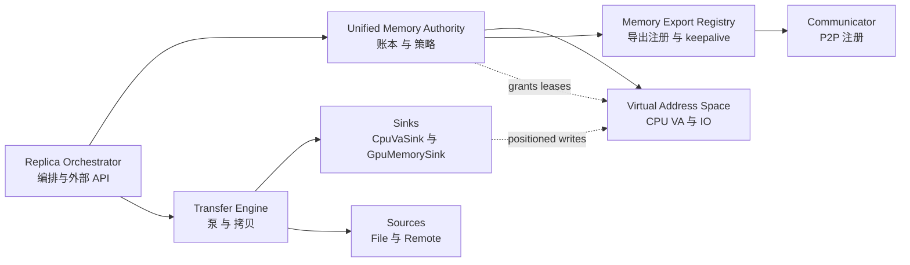
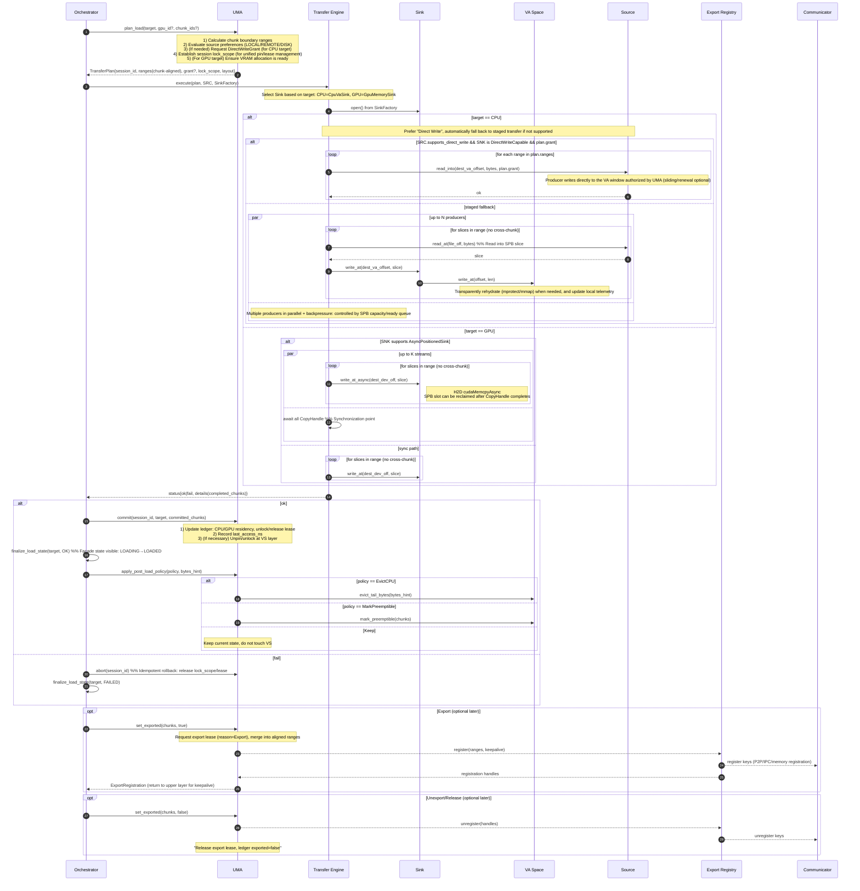
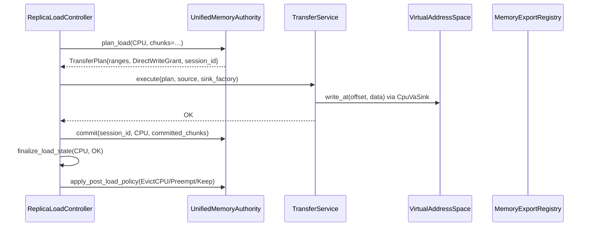

# Summary

本设计定义面向未来的**统一内存权威 V3**（Unified Memory Authority，UMA）与围绕其展开的系统重构。核心思想是：  
- **UMA 成为唯一权威账本**，掌管块级驻留、传输锁、租约、导出等状态与策略；  
- **Virtual Address Space（VS）** 收敛为 CPU 侧 **VA 与 IO 基座**，不再维护权威状态；  
- 引入**传输会话事务** `Plan → Execute → Commit or Abort`；  
- 以 `ArtifactLayout` 统一 **Chunk 与 Slice** 对齐；  
- 数据面由 **Transfer Engine** 承担，支持直写授权（DirectWriteGrant）与自动回退；  
- **Replica Orchestrator** 仅负责编排，不做长耗时与状态变更；  
- 导出能力集中在 **Memory Export Registry**，租约与导出标志由 UMA 托管。

该设计明确接口、并发与错误模型、可观测性与验收标准，并给出与现有实现的对应关系与迁移要求。



---

# Goals / Non‑Goals

## Goals

* **单一事实来源**：UMA 为唯一权威账本，消除 UMA 与 VS 的双写与同步漂移。
* **事务化传输**：传输会话具备计划、执行、提交与回滚，幂等可重试。
* **统一对齐**：以 `ArtifactLayout` 统一 `artifact_chunk_bytes` 与 `transfer_slice_bytes`，Pump 不跨 Chunk。
* **明确职责**：Orchestrator 仅编排；UMA 管账本与策略；VS 管 VA 与 IO；TE 管数据面；Export 只做注册。
* **可观测性**：端到端会话 ID，统一指标与结构化日志。
* **可扩展性**：直写授权滑窗化、GPU 复制调度，预留 GDS 与 RDMA 直写后端。

## Non‑Goals

* 不引入新外部公共 API（保持 Artifact 外部接口语义不变）。
* 不在本设计中定义持久化数据库或远端全局目录（无 schema 变更）。
* 不实现新的全局作业调度器与跨节点数据分发。

---

# Current Snapshot (Reality)

为确保方案可落地，先给出现状与命名映射：

- VS（Virtual Address Space）已为最终命名；对外提供 `write_at`、`map_file_segments`、`pin_range` 等。`lock_chunks/unlock_chunks` 已弃用并实现为无副作用（no‑op）。
- UMA 仍以 `ReplicaMemoryCoordinator` 命名，持有部分账本；CPU 块状态在多处有“同步”路径；GPU 状态在 UMA 更新。
- Orchestrator 命名为 `ReplicaLoadController`（原 MemoryManager，已完成更名），承担编排和部分状态门面；历史上存在对 VS 的直连（如锁），现已移除。
- Transfer 数据面以 `TransferService` + `pump_ranges()` 实现；会话内使用 `StreamingPinnedBuffer` + `PinnedBufferPool`。
- 直写授权统一为 `DirectWriteGrant`，承载 `Window{va_offset, local_addr, length}` 与 `keepalive`（滑动窗口）。
- 导出路径命名为 `MemoryExportRegistry`，注册信息通过 Communicator；UMA 托管导出标志与 CPU 导出租约（keepalive）。
- `MemoryLocation` 包含 `CPU`（而非最终方案中的 `CPU` 简化名）；广泛使用 `device_id` 标识 GPU。

本设计在不打断现有路径的前提下，定义目标命名与边界，同时通过两个子计划（Sub‑0/1）完成“别名→落地→清理”的迁移闭环。

---

# Naming & Structure

## UMA 的全称与定位

- UMA = Unified Memory Authority（统一内存权威）
  - Unified：统一 CPU/VRAM/导出/直写授权等跨位置的逻辑账本。
  - Memory：覆盖驻留（residency）、锁、租约、导出等内存语义。
  - Authority：唯一事实来源（Single Source of Truth）；所有状态更改通过它的事务提交。

说明：旧名 `ReplicaMemoryCoordinator` 更像“调度/协商者”，而不是“权威/账本”。重构后 UMA 直指职责本质。

## 命名原则（适用于所有模块）

- 职责优先：类名反映“它对外提供什么”，方法名反映“它改变了什么”。
- 后缀语义统一：
  - Authority：唯一权威账本/策略执行者（可持久化/事务）。
  - Orchestrator：编排/粘合层，不持久化状态，不做重工作。
  - Engine：执行数据面或算法（传输/拷贝/调度）。
  - Registry：注册/反注册与 keep‑alive。
  - Sink/Source：字节流的目标/来源；`Positioned` 表示有全局偏移写能力；`Async` 表示异步。
  - Grant/Lease/Token：Grant（写授权）、Lease（驻留/Pin 生命周期）、Token（可携带序列化信息的授权载体）。
  - Layout/Record/Plan/Session：Layout（结构），Record（账本行），Plan（不可执行蓝图），Session（一次执行上下文）。
- 名词单义化：Chunk 指 Artifact 的对齐分片；Slice 指传输小块（不跨 Chunk）。
- 跨模块前缀：统一以功能做前缀，避免历史缩写（如 DVMP）造成误解。
- 尽量避免技术泄露：如不必要，不在顶层对外暴露 Cuda，而暴露 Gpu 抽象。

## 统一术语词汇表（面向代码）

- ArtifactLayout：Artifact 总大小、Chunk 大小（artifact_chunk_bytes）、传输 Slice 大小（transfer_slice_bytes，整除 chunk）。
- Chunk：UMA 账本的基本对齐单位（如 256MiB），所有锁、导出、直写授权均以 Chunk 为边界。
- Slice：Pump 生产消费的小粒度传输块（如 16–64MiB），不跨 Chunk。
- ChunkRecord：UMA 账本记录：CpuResidency、GpuResidency[dev]、Lock、PinRefcnt、Exported、LastAccess。
- TransferPlan：UMA 生成的不可执行计划（含 ranges、来源偏好、授权 Grant、锁域）。
- TransferSession：一次执行上下文（Plan 的 SessionId + 执行期度量）。
- DirectWriteGrant：对 VA 区间的直写授权（带滑窗/keepalive），由 UMA 签发。
- PinLease：对 Chunk 的驻留/页面 pin 租约（RAII），由 VS 执行，UMA 统一持有与释放。

## 旧名 → 新名（分层改名清单）

权威与编排层
- ReplicaMemoryCoordinator → UnifiedMemoryAuthority（权威账本）
- MemoryManager → ReplicaLoadController（编排门面）
- MemoryState → ReplicaLoadState（副本在某位置的加载状态）

VA 与底座层（VS）
- DistributedVirtualMemoryPool → VirtualAddressSpace（VaSpace）
- DvmpRegion → VaRegion
- ChunkResidencyLease → CpuPinLease
- chunk_snapshot/ChunkMeta.state → chunk_telemetry_snapshot（ChunkTelemetry）
- lock_chunks/unlock_chunks → 弃用；UMA 账本记录锁，VS 仅做 pin_range

传输与泵
- TransferService（保留）
- pump_ranges（函数）→ RangePump::run（类化）
- StreamingPinnedBuffer（保留）
- PinnedMemoryPool → PinnedBufferPool
- GPUMemorySink → GpuMemorySink
- DVMPRegionSink → CpuVaSink
- DirectWritableSink → DirectWriteCapable
- DirectWriteToken → DirectWriteGrant（内部可携 GrantToken）

导出与通信
- ChunkExportService → MemoryExportRegistry 或 P2PExportRegistry
- CommRegistrationInfo → ExportRegistration
- Communicator → CommEngine 或 Communicator

Loader / Source / Sink
- IArtifactLoader → ArtifactLoader（纯虚接口）
- SeekableSource/PositionedSink/AsyncPositionedSink（保留）
- FilePartitionSource/SafetensorsSource（保留）
- MultiSafetensorsSource → MultiFileSafetensorsSource

GPU 内存
- GpuDeviceMemory → GpuDeviceMemory（内部实现可为 CudaDeviceMemory）
- get_ipc_handle → get_ipc_handle
- device_id → gpu_id

交叉结构与模型
- ChunkState（单枚举）→ 拆分为 CpuResidency/GpuResidency/TransferLockState/exported/pin_refcnt
- ChunkMeta → ChunkTelemetry（VS 仅保留热度/时间戳等遥测）
- MemoryLocation::CPU/GPU → MemoryLocation::CPU/GPU（对外简化；内部实现体现 pageable）
- VaRange（保留）与 ByteRange（源侧）

## 目录与命名空间建议

```
core/
  memory/
    virtual_address_space.{h,cc}
    pinned_buffer_pool.{h,cc}
    streaming_pinned_buffer.{h,cc}
    gpu_device_memory.{h,cc}

  store/
    replica/
      unified_memory_authority.{h,cc}
      replica_load_controller.{h,cc}
      memory_export_registry.{h,cc}
      transfer/
        transfer_engine.{h,cc}
        range_pump.{h,cc}
        sinks/
          cpu_va_sink.{h,cc}
          gpu_memory_sink.{h,cc}
        sources/
          file_partition_source.{h,cc}
          safetensors_source.{h,cc}
          multi_file_safetensors_source.{h,cc}
      types/
        artifact_layout.h
        chunk_record.h
        direct_write_grant.h
        export_registration.h
```

命名空间：`tensorcast::common::memory`（底座）与 `tensorcast::store::replica`（账本/编排/导出/传输）。

---

## 不合理命名点（点名并修复）

- DVMP（DistributedVirtualMemoryPool）：误导“分布式/池”，职责是单机 CPU VA；改为 `VirtualAddressSpace`。
- ReplicaMemoryCoordinator：不是“协调者”，而是“权威账本 + 策略执行者”；改为 `UnifiedMemoryAuthority`。
- MemoryManager：职责是编排门面，不“管理内存”本体；改为 `ReplicaLoadController`。
- ChunkState（单枚举）：把锁/导出/驻留绑死在一起，易形成非法组合；改为正交维度 `ChunkRecord`。
- GPUMemorySink 大小写与抽象不一致；改为 `GpuMemorySink`。
- DVMPRegionSink 暗含 DVMP 缩写，且强调实现细节；改为 `CpuVaSink`。
- PinnedMemoryPool 名称中没有“Buffer”；与 `StreamingPinnedBuffer` 不对齐；改为 `PinnedBufferPool`。
- DirectWriteToken 的“Token”更像凭据，不像权限；改为 `DirectWriteGrant`（授权），内部可携 `GrantToken`。
- lock_chunks/unlock_chunks 容易与 OS mlock 混淆、与 UMA 锁语义冲突；弃用，统一由 UMA 账本记录锁，VS 只负责 `pin_range`。

---

# Architecture & Interfaces

## 1. 模块边界与交互



### 职责对齐

* **Unified Memory Authority（UMA）**：唯一账本与策略；生成 `TransferPlan`；在 `commit/abort` 内集中修改状态与释放锁租。
* **Virtual Address Space（VS）**：CPU 侧 VA 与 IO；`write_at` 与 `map_file_segments`；`pin_range`；保留遥测，不持权威状态。
  - API 命名：对外仅暴露“遥测”语义的读取接口，例如 `StoreEngine::get_chunk_states_telemetry(artifact_id)` 与 `ReplicaLoadController::chunk_telemetry_snapshot()`；不再保留旧名兼容层。
* **Transfer Engine（TE）**：执行字节流传输；定位写入 sink；支持异步写与在飞复制调度；不触碰状态。
* **Replica Orchestrator（RO）**：捕获请求，调用 UMA 与 TE，处理最终 `finalize_load_state` 与策略。
* **Memory Export Registry（REG）**：用 UMA 的导出标志与租约进行注册与 keepalive；与 Communicator 对接。

## 2. 数据模型

### 2.1 ArtifactLayout

```c++
struct ArtifactLayout {
  uint64_t artifact_bytes;
  size_t artifact_chunk_bytes;     // 例如 256 MiB（遵循 VS 配置）
  size_t transfer_slice_bytes;     // 例如 16~64 MiB，必须整除 artifact_chunk_bytes
};
```

### 2.2 ChunkRecord（正交维度）

```c++
struct ChunkRecord {
  enum class CpuResidency : uint8_t { Absent, ResidentRW, PlaceholderRO, Preemptible };
  enum class GpuResidency : uint8_t { Absent, Present };          // 每设备一份
  enum class TransferLockState : uint8_t { Unlocked, LockedTx };
  uint16_t pin_refcnt{0};                                         // 累积租约
  bool exported{false};                                           // 是否处于导出注册
  uint64_t last_access_ns{0};
  uint32_t version{0};                                            // 乐观并发
};
```

> 说明：VS 的 `ChunkMeta.state` 仅保留为**遥测**，账本以 UMA 为准。

## 3. 关键接口

### 3.1 UMA（Unified Memory Authority）

```c++
class UnifiedMemoryAuthority {
public:
  absl::Status allocate(const ReplicaKey&, uint64_t bytes);
  ArtifactLayout get_layout(const ReplicaKey&) const;

  struct TransferPlan {
    uint64_t session_id;
    // Chunk 对齐范围（offset, length）
    std::vector<std::pair<uint64_t, size_t>> ranges;
    // 参与会话的 Chunk 索引
    std::vector<uint32_t> chunk_indices;
    // CPU 目标可选直写授权（由 UMA 内部保持租约生命周期）
    std::optional<DirectWriteGrant> cpu_direct_grant;
  };

  absl::StatusOr<TransferPlan> plan_load(const ReplicaKey&,
                                         common::memory::MemoryLocation target,
                                         std::optional<int> gpu_id,
                                         std::optional<absl::Span<const uint32_t>> chunk_indices);

  absl::Status commit(uint64_t session_id,
                      common::memory::MemoryLocation target,
                      absl::Span<const uint32_t> committed_chunks,
                      std::optional<int> device_id); // 幂等
  absl::Status abort(uint64_t session_id);              // 幂等

  absl::Status set_exported(const ReplicaKey&, absl::Span<const uint32_t> chunks, bool on);
  absl::Status apply_post_load_policy(const ReplicaKey&,
                                      common::memory::MemoryLocation target,
                                      PostGpuLoadPolicy policy,
                                      size_t bytes_hint);
};
```

实现与兼容性说明
- UMA::lock_chunks_for_transfer() 在 V3 中保持存在但为 no-op（仅更新 last_access/version），接口已标注 [[deprecated]]；当所有调用方切换到 plan_load/commit 后（P3）删除。
- Orchestrator 在需要生成 [0..N-1] chunk 列表时，改用 UMA 的 get_artifact_size() 与 get_chunk_size()（或 get_layout()）计算总块数，不再依赖 VS 的 chunk_snapshot 尺寸，确保与 VS 实际 chunk_size 对齐一致。
- 测试命名保留历史：如 replica_memory_coordinator_test.cc、MockDistributedVirtualMemoryPool 等，归为 P3 清理项。

接口与现状的差异/对齐说明
- `DirectWriteGrant` 当前代码命名为 `DirectWriteToken`；在 Sub‑1 中切换命名并引入滑动窗口。
- `MemoryLocation::CPU` 在现实现中为 `CPU`；Sub‑1 清理阶段统一外显枚举名。
- UMA 的 `plan/commit/abort` 以轻量会话表与幂等语义实现；UMA 内部持有会话期的锁域与租约（不随计划返回“lock_scope”给调用方）。
- 直写授权粒度：设计允许在 `plan_load()` 随计划携带 `DirectWriteGrant`；当前实现也支持在泵的窗口化阶段（per‑window）由 Sink→UMA 动态申请授权，功能等价且粒度更细。

### 3.2 VS（Virtual Address Space）

```c++
class VirtualAddressSpace {
public:
  struct VirtualRegion { void* cpu_base; size_t bytes; };
  absl::StatusOr<VirtualRegion> allocate(std::string_view artifact_id, size_t bytes);
  absl::StatusOr<class VaRegion> open(std::string_view artifact_id);
  absl::StatusOr<VirtualRegion> region_info(std::string_view artifact_id) const;

  // Expose the configured CPU chunk size (bytes) used for VS alignment
  size_t chunk_size() const;

  absl::Status write_at(std::string_view artifact_id, uint64_t va_off, const void* src, size_t bytes);
  absl::Status map_file_segments(std::string_view artifact_id, absl::Span<const FileSegment> segs);

  absl::StatusOr<class CpuPinLease> pin_range(std::string_view artifact_id, uint64_t off, uint64_t bytes,
                                             std::string_view reason);

  // 预抢占与尾部回收
  absl::Status mark_preemptible(std::string_view artifact_id, absl::Span<const uint32_t> chunks);
  size_t evict_tail_bytes(std::string_view artifact_id, size_t bytes);

  // 可选：写入回调用于 UMA 更新 last_access
  void register_write_hook(std::function<void(uint64_t off, uint64_t len)> cb);
};
```

### 3.3 Transfer Engine 与 Sink

```c++
class TransferEngine {
public:
  absl::Status execute(const UnifiedMemoryAuthority::TransferPlan& plan,
                       loader::SeekableSource& source,
                       PositionedSinkFactory& sink_factory); // 仅数据面

  // 内部：GPU 复制调度，限制在飞字节与在飞拷贝数，广泛使用 write_at_async
};
```

* **CpuVaSink**：定位写入 VS 的 VA 范围；支持 `DirectWriteCapable` 接口，承接 `DirectWriteGrant`。
* **GpuMemorySink**：定位写入 GPU base + offset；支持 `AsyncPositionedSink`。

### 3.4 DirectWriteGrant（直写授权）

```c++
struct DirectWriteGrant {
  struct Window { uint64_t va_offset; uint64_t local_addr; uint64_t length; };
  std::vector<Window> windows;             // 可滑窗
  std::shared_ptr<void> keepalive;         // 持有租约与必要注册
};
```

### 3.5 Replica Orchestrator

```c++
class ReplicaLoadController {
  std::future<absl::Status> ensure_loaded_async(common::memory::MemoryLocation target,
                                                int concurrency,
                                                std::optional<int> device_id);
  absl::Status finalize_load_state(common::memory::MemoryLocation target,
                                   const absl::Status& final_status); // 仅门面状态
};
```

### 3.6 Export Registry

```c++
class MemoryExportRegistry {
public:
  absl::StatusOr<ExportRegistration> register_ranges(const ReplicaKey&,
                                                     common::memory::MemoryLocation,
                                                     absl::Span<const std::pair<uint32_t,uint32_t>> chunk_ranges);
  absl::Status unregister(const ExportRegistration&);
};
```

### 3.7 典型流程（可读性示例）



## 4. 并发、锁序与事务

* **全局锁序**：UMA → VS → Export Registry → Communicator。
* **会话事务**：`plan_load` 内 UMA 统一获取需要的锁与租约（UMA 内部持有），在 `commit` 或 `abort` 释放。
* **Orchestrator** 不在持锁时调用外部；**Transfer** 不触碰状态与锁。
* **幂等**：`commit` 可多次提交同一子集；`abort` 对同一会话可重复调用。

## 5. 错误模型

* 源或泵错误 → `execute` 返回非 OK → Orchestrator **只调用一次** `abort(session)`。
* 部分成功：允许对已完成块多次 `commit(session, subset)`，最终以 `finalize_load_state` 的返回作为对外结果。
* VS `write_at` 出界与不可写 → `InvalidArgument` 或 `FailedPrecondition`；异常会传导至 `execute`。
* 租约不足或导出注册失败 → `ResourceExhausted` 或 `Unavailable`，不改变账本，`abort` 清理。

错误映射与重试策略（幂等键：`session_id + sorted(chunks)`）

| 错误类型 | 典型场景 | 建议重试策略 | 幂等键 |
|---|---|---|---|
| ResourceExhausted | UMA 租约不足（`pin_range` 失败）；`DirectWriteGrant` 窗口不足/续期失败；GPU 在飞拷贝/字节达上限 | 短暂退避（jitter）+ 有界重试；直写同一窗口连续失败 M 次→会话内粘性降级至 staged；必要时缩小窗口或降低并发 | `session_id + sorted(chunk 集合)` |
| Unavailable | Export 注册失败；Communicator 暂不可用；远端 P2P 键失效/超时 | 指数退避重试；超过阈值对本会话切本地/磁盘回退；仅对已完成块执行 `commit` | `session_id + sorted(chunk 集合)` |
| FailedPrecondition | VS 写入越界/不可写；VA 未分配/已释放 | 不重试；立即 `abort(session)`；修正调用方参数或状态机 | `session_id + sorted(chunk 集合)` |

---

# Trade‑offs & Risks

* **VS 去权威化**带来一次性较大改动
  取舍：中长期降低复杂度和竞态风险；历史阶段通过灰度与审计控制迁移风险（现已处于最终态，无需开关）。
* **事务化引入的控制路径**增加
  取舍：换取状态幂等与错误语义清晰；微小的编排开销可忽略。
* **GPU 并发调度**可能在极端下放大在飞内存
  缓解：限额可配；以 conservative 默认起步；指标可观测并快速回退。
* **直写滑窗**窗口过小影响吞吐
  缓解：窗口大小与 Pump 批次对齐，允许按设备类型自适应。

---

# Compatibility & Acceptance Criteria

## 兼容性

* 外部 Artifact API 行为保持；内部类名与接口按本设计统一，**不保留最终兼容层**。
* 迁移期以别名与编译开关过渡，最终在收尾阶段移除。

## 验收标准

* **一致性**：不存在任何从 VS 读取权威块状态的代码路径；账本仅在 UMA。
* **对齐**：Pump 生成的 Slice 不跨 Chunk；`artifact_chunk_bytes` 与 `transfer_slice_bytes` 一致生效。
* **事务**：三条路径 DISK→CPU、DISK→GPU、CPU↔GPU 均走 `Plan→Execute→Commit or Abort`，且幂等。
* **性能**：GPU 在飞复制调度上线后吞吐不低于基线，p99 延迟下降或持平；RSS 峰值不高于基线。
* **导出**：导出注册与反注册幂等，无租约泄漏；崩溃恢复不悬挂。
* **可观测性**：会话级指标与日志完整；核心仪表盘齐备。
* **清理**：别名与过渡开关全部移除；目录与命名一致。

---

# Observability

* **计量前缀**

  * UMA：`tc_um_*`；VS：`tc_va_*`；Transfer：`tc_tx_*`；Export：`tc_ex_*`。
* **建议指标**

  * `tc_um_commit_duration_ms{target}`、`tc_um_commit_chunks_total{target}`
  * `tc_tx_bytes_total{path,mode}`、`tc_tx_duration_ms{path}`、`tc_tx_inflight_bytes_gauge{gpu}`
  * `tc_va_write_bytes_total`、`tc_va_pin_leases_total{reason}`
  * `tc_ex_registrations_total{location}`、`tc_ex_keepalive_gauge`
* **日志键**：`artifact_id, session_id, gpu_id, range_id, target, status, latency_ms, bytes, chunks`.

---

# Migration Status（已完成 / 最终态）

- 本设计对应的迁移已完成，当前代码处于最终态：
  - VS 完成重命名与收敛：`DistributedVirtualMemoryPool` → `VirtualAddressSpace`，删除旧 BUILD 目标与头文件；
  - UMA 文件命名完成：`replica_memory_coordinator.{h,cc}` → `unified_memory_authority.{h,cc}`，删除 `core/store/uma/*` 别名头；
  - 导出路径收敛为 `MemoryExportRegistry`，导出租约由 UMA 托管；
  - 事务化传输 `Plan → Execute → Commit/Abort` 全路径生效，幂等可重试；
  - 删除全部 `TCAST_V3_*` 环境开关与桥接逻辑，最终态逻辑常开；
  - 指标命名统一（`tc_va_*`、`tc_um_*`、`tc_tx_*`、`tc_ex_*`），日志键一致。

回退：采用 Git revert 对应提交集；无运行时灰度/开关。

---

# Alternatives and Rationale

* **保留 VS 为权威**：继续在 UMA 与 VS 双边同步

  * 否决：同步与并发复杂度过高，错误难以界定。
* **不做事务**：在 Transfer 中直接改状态

  * 否决：错误路径杂糅，无法保证幂等；回滚困难。
* **继续单 GPU 单会话门闩**

  * 否决：吞吐与覆盖受限，难以吃满硬件能力。

---

# Ownership, Reviews, and Status Lifecycle

* **Owners**：store‑runtime 负责 Orchestrator 与 Transfer；memory‑systems 负责 UMA 与 VS；communicator 负责 Export 对接。
* **评审**：涉及区域的 codeowners 为必选评审。
* **状态流转**：`draft → proposed → accepted → retired`；设计被接受后在迁移计划全部完成时置为 `accepted` 并记录决策要点。

---

# Decision Summary (Accepted)

- UMA 作为唯一账本落地：`plan → execute → commit/abort` 事务在 CPU/GPU 路径均生效，Transfer 与 Orchestrator 不直接改账本。
- 导出租约归 UMA 托管：Registry 仅做注册与 keepalive；计量与结构化日志齐备。
- 数据面异步化：Pump 基于 `AsyncPositionedSink` + `AsyncCopyManager`，GPU 在飞/限流由调度器与 Sink 协同完成。
- 直写授权 V2：引入 `DirectWriteGrant` 与滑动窗口；能力协商与自动回退落地；指标与日志完善。
- VS 去权威化：UMA 账本为唯一事实来源；与 VS 的同步路径已删除，UMA 为唯一权威。
- 命名收敛：引入 `MemoryLocation::CPU`（兼容 `CPU`），别名头到目标命名保持一致；目录重构计划纳入下一轮清理窗口。

---

# Guardrails

* **锁序**：UMA 先于 VS；禁止在持 VS 锁时对外调用；Transfer 不得直接操作 UMA 或 VS 的锁。
* **不变量**：账本仅在 UMA；所有状态变更只发生在 `commit` 或 `abort`；Slice 不跨 Chunk。
* **文档同步**：任何改变行为的 PR 必须更新最近的 README 与本设计或对应计划。

---

# References

* 现有实现与接口：`virtual_address_space.*`、`unified_memory_authority.*`、`memory_manager.*`、`transfer_service.*`、`memory_export_registry.*`、`loader/*`、`sink.*`、`pump.*`
* 子计划：`../plans/0012-sub-0-unified-memory-architecture-v3.md`、`../plans/0012-sub-1-unified-memory-architecture-v3.md`

# Open Questions

* VS 的 `write_at` 写入回调是否需要批量聚合与节流，以降低 UMA 端锁竞争。
* 是否需要在 UMA 侧引入轻量的会话状态持久化以在崩溃后恢复未提交的锁域清理。
