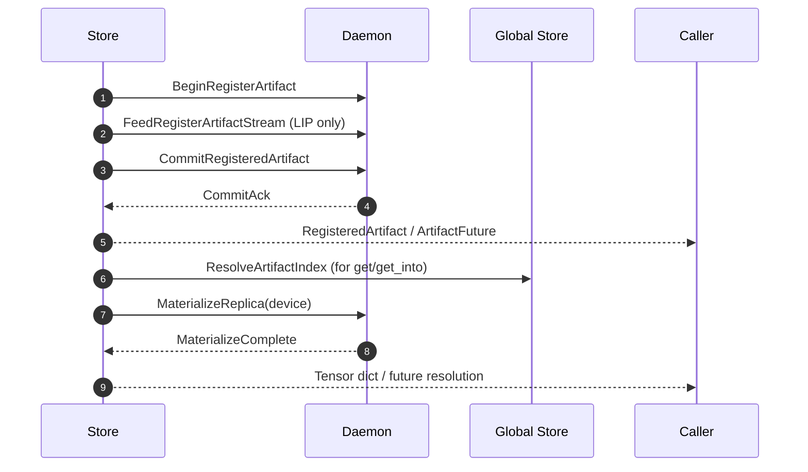

# Summary

We evolve the TensorCast client API from a monolithic `register_artifact()` function into an explicit Store session object that owns the daemon connection and surfaces four verbs: `register`, `put`, `get`, and `get_into`. The first release keeps the public surface minimal: the `Store` constructor requires the daemon endpoint (`tcp://ip:port` or `unix://` socket) plus an optional `StoreOptions` bundle, and each verb exposes a concise signature with optional key-based addressing. All lease duration, keepalive cadence, caching, and device selection policies are centrally managed by the Store using repository defaults so that users do not supply per-call tuning parameters, while retrieval verbs can describe disk and P2P fallback behavior explicitly when VRAM replicas are unavailable.

The shipping SDK exposes these capabilities through functional module-level helpers (`tensorcast.init`, `tensorcast.register`, `tensorcast.put`, `tensorcast.get`, `tensorcast.get_into`). Those helpers delegate to a single process-wide Store instance managed by the runtime; the Store remains an internal session holder that advanced users may access via `tensorcast.store()` for asynchronous verbs or diagnostics, but typical workflows never construct it directly.

The API provides paired synchronous and asynchronous methods (e.g., `register` / `register_async`) backed by the same future infrastructure introduced in Design 0005, avoiding flag-based mode switches and improving type safety. The design reuses the AVBS/Canonical Index/lease semantics from Design 0003 while giving the SDK a clearer ownership boundary over daemon sessions and replica coordination.

# Goals / Non-Goals

Goals
- Introduce a `Store` session object that encapsulates daemon connectivity and policy enforcement while exposing a minimal constructor (`daemon_endpoint: str`, `opts: StoreOptions | None`).
- Define concise method signatures for `register`, `put`, `get`, and `get_into` that hide lease TTLs, keepalive configuration, and cache policies behind defaults while allowing explicit fallback instructions.
- Support addressing by artifact `key` or `artifact_id` for retrieval APIs with device selection handled automatically and per-call overrides limited to essential arguments.
- Preserve existing disk-read and P2P bypass workflows through structured fallback options without forcing users to coordinate multiple subsystems manually.
- Provide separate synchronous and asynchronous entry points for each verb (e.g., `get` and `get_async`) to give clear type semantics without boolean flags.
- Document exact type hints, parameter semantics, and return types so the SDK implementation and downstream users share the same contract.

Non-Goals
- Altering Canonical Index v2, AVBS hashing, or the unified Begin/Feed/Commit/Revoke RPC flow from Design 0003.
- Exposing user-configurable lease TTLs, keepalive intervals, or cache policies in the initial release; these remain system-configured and may surface later via structured option objects if proven necessary.
- Introducing asyncio integration or callback-style APIs; futures and synchronous wrappers remain the execution model.
- Changing daemon or Global Store RPC schemas; this design is an SDK-layer evolution.
- Modeling Fake-CUDA specific behaviors; the fallback design assumes production CUDA hardware.

# Architecture & Interfaces

## Public facade

```python
import tensorcast as tc

tc.init(mode="connect", address="auto")
artifact = tc.register(tensors=model_state_dict, key="model/latest")
latest = tc.get(key="model/latest", device="cuda:0")
tc.get_into(buffers, artifact_id=artifact.artifact_id, device="cuda:0")
```

- `tc.init(mode=...)` establishes the daemon session and creates the shared Store.
- `tc.register`, `tc.put`, `tc.get`, and `tc.get_into` are thin wrappers that route to the Store while keeping the API surface functional and stateless for callers.
- `tc.store()` exposes the underlying Store when advanced integrations need asynchronous verbs, telemetry, or direct lease management; routine code should not instantiate `Store` manually.
## Type aliases and helper classes

```python
from collections.abc import Mapping
from dataclasses import dataclass
from typing import Callable, Literal, Protocol, TypeVar

import torch

T = TypeVar("T")

TensorDict = Mapping[str, torch.Tensor]
DeviceTarget = str | torch.device
DeviceSelector = str | torch.device | None

ArtifactStatusCode = Literal[
    "OK",
    "CANCELLED",
    "UNKNOWN",
    "INVALID_ARGUMENT",
    "DEADLINE_EXCEEDED",
    "NOT_FOUND",
    "ALREADY_EXISTS",
    "PERMISSION_DENIED",
    "RESOURCE_EXHAUSTED",
    "FAILED_PRECONDITION",
    "ABORTED",
    "OUT_OF_RANGE",
    "UNIMPLEMENTED",
    "INTERNAL",
    "UNAVAILABLE",
    "DATA_LOSS",
    "UNAUTHENTICATED",
]

class ArtifactFuture(Protocol[T]):
    def result(self, timeout: float | None = None) -> T: ...
    def done(self) -> bool: ...
    def add_done_callback(self, callback: Callable[["ArtifactFuture[T]"], None]) -> None: ...
    def cancel(self) -> bool: ...

class ArtifactError(RuntimeError):
    """Raised when daemon or Global Store operations fail with a structured status code."""

    status_code: ArtifactStatusCode
    retryable: bool


@dataclass(frozen=True)
class RetryPolicy:
    deadline_seconds: float
    max_attempts: int
    base_backoff_seconds: float
    backoff_multiplier: float
    jitter: float


@dataclass(frozen=True)
class FallbackOptions:
    disk_path: str | None = None
    prefer_disk: bool = False
    allow_p2p: bool = True
    verify_checksums: bool = True


@dataclass(frozen=True)
class StoreOptions:
    fallback: FallbackOptions | None = None
    retry_overrides: Mapping[str, RetryPolicy] | None = None

```

`ArtifactError` mirrors the daemon's status taxonomy (`INVALID_ARGUMENT`, `FAILED_PRECONDITION`, `RESOURCE_EXHAUSTED`, `DATA_LOSS`, `UNAVAILABLE`, etc.) and carries a `retryable` hint aligned with SDK backoff policy. All Store verbs raise this exception type for failure cases, including indirect errors surfaced through futures.

`TensorDict` is any mapping from string keys to `torch.Tensor` instances. The Store will materialize tensors in-place when the mapping provides mutable buffers (e.g., `dict[str, torch.Tensor]`). `DeviceTarget` requires a concrete CUDA device specification ("cuda:0" or `torch.device("cuda:1")`). `DeviceSelector` accepts the same values plus `None` and is used where the destination can be inferred from caller-provided tensors. `ArtifactStatusCode` is a closed set aligned with gRPC canonical codes; the SDK never surfaces arbitrary strings. `RetryPolicy` describes deadline and backoff characteristics, `FallbackOptions` configures disk/P2P behavior for retrieval verbs, and `StoreOptions` lets callers specify process-wide defaults for both.

## Structured Data Types

```python
from dataclasses import dataclass
from typing import Literal

from tensorcast.api._config import PlanType

ReplicaType = Literal["COALESCED_VRAM", "VRAM_LEASE_IN_PLACE", "VRAM_LEASED"]

@dataclass(frozen=True)
class CanonicalIndexEntry:
    name: str
    dtype: torch.dtype
    shape: tuple[int, ...]
    stride: tuple[int, ...]
    storage_offset: int
    segment_offset: int  # byte offset within the AVBS
    size_bytes: int      # bytes occupied by DATA segments only

@dataclass(frozen=True)
class CanonicalIndex:
    entries: tuple[CanonicalIndexEntry, ...]
    total_size_bytes: int  # sum of DATA bytes (excludes PAD)
    avbs_hash: str         # Hex digest used in mi2 identity computation

@dataclass(frozen=True)
class ReplicaInfo:
    replica_id: str
    replica_type: ReplicaType
    device: torch.device
    plan: PlanType
    size_bytes: int

@dataclass(frozen=True)
class LeaseHandle:
    lease_id: str
    ttl_ms: int
    expires_at_monotonic: float
    owner_pid: int

@dataclass(frozen=True)
class RegisteredArtifact:
    artifact_id: str
    replica: ReplicaInfo
    canonical_index: CanonicalIndex
    lease: LeaseHandle | None
```

- `CanonicalIndexEntry.segment_offset` is the byte offset within the Artifact Virtual Byte Stream (AVBS) defined in Design 0003. PAD segments are implied (not listed) and always zero-filled.
- `CanonicalIndex.avbs_hash` is the PAD-zeroed multihash stored alongside the artifact in the Global Store; it must match the daemon-computed hash returned on Commit.
- `ReplicaInfo.device` is the CUDA device where the replica currently resides. For staged copies the Store selects and records the destination device on completion.
- `ReplicaInfo.plan` is expressed with the shared `PlanType` enum so call sites no longer need to compare raw string identifiers when branching on storage semantics.
- `LeaseHandle.expires_at_monotonic` uses the host monotonic clock (`time.monotonic()`) to avoid skew when coordinating keepalive timers.
- `RegisteredArtifact.lease` is `None` for daemon-owned replicas; callers retain the object while they intend to use the lease.

## Store

```python
class Store:
    def __init__(self, daemon_endpoint: str, *, opts: StoreOptions | None = None) -> None: ...
```

Parameters
- `daemon_endpoint` (`str`): Hostname/IP and port (`"localhost:50051"`) or Unix domain socket path (`"unix:///tmp/tensorcastd.sock"`). The Store inspects the endpoint to configure secure vs. insecure channels and reuses pooled connections across operations.
- `opts` (`StoreOptions | None`): Optional session-wide configuration, including fallback defaults and retry overrides. When `None`, SDK defaults apply.

Responsibilities
- Create/own the gRPC channel pool to the daemon at construction time; share channels across threads via reference counting.
- Discover daemon capabilities (coalesced VRAM availability, LIP support) once and cache them for subsequent operations.
- Enforce repository-wide defaults for lease TTL, keepalive cadence, and cache policy when interacting with the daemon and Global Store.
- Track outstanding operations to manage background keepalive and automatic lease revocation when futures complete or cancel.
- Provide metrics hooks (latency, bytes, retries) tagged by the daemon endpoint and method name.
- Persist process-level fallback and retry policies derived from `opts`, making them the baseline for subsequent method calls (per-call options override these defaults).
- Resolve disk and P2P fallback strategy centrally so that retrieval verbs share consistent behavior when VRAM replicas are unavailable.

`StoreOptions` supply defaults so individual calls stay minimal:
- `fallback`: a `FallbackOptions` instance applied whenever a verb omits its `fallback` parameter. Setting `prefer_disk=True` mirrors the legacy `prefer=disk` path, and `disk_path` pins a specific directory for direct reads.
- `retry_overrides`: mapping from method name (`"register"`, `"get"`, etc.) to `RetryPolicy` to adjust deadlines/backoff without rewriting the built-in policy tables.

The first-version Store treats all local CUDA devices as in-scope; explicit device scoping is deferred. When new GPUs appear, the Store refreshes device metadata lazily on demand.

While the Store remains the canonical implementation of the session API, production callers acquire the shared instance through `tensorcast.init(mode=...)` / `tensorcast.store()` rather than constructing it directly.

## Register (by-reference registration)

```python
def register(self, tensors: TensorDict, *, key: str | None = None) -> RegisteredArtifact: ...
def register_async(self, tensors: TensorDict, *, key: str | None = None) -> ArtifactFuture[RegisteredArtifact]: ...
```

Parameters
- `tensors` (`TensorDict`): Mapping of artifact tensor names to resident GPU tensors. The Store validates Canonical Index v2 constraints and ensures buffers remain alive until Commit.
- `key` (`str | None`): Optional semantic key associated with the artifact. When provided, the Store upserts the key in the Global Store alongside the computed `artifact_id`.

Behavior
1. Build Canonical Index v2 and AVBS SegmentPlan (PAD segments zero-filled for hashing) without copying caller memory.
2. Select plan: coalesced VRAM when the tensors occupy a contiguous allocation already owned by the daemon; otherwise use lease-in-place (LIP) semantics defined in Design 0003.
3. Issue `BeginRegisterArtifact`, stream lease segments only when LIP is required, and complete with `CommitRegisteredArtifact`.
4. Return a `RegisteredArtifact` containing `artifact_id`, replica metadata, and a lease handle when applicable. Lease TTLs and keepalive timers follow Store defaults; users do not specify them per call.

`register_async` returns immediately with a future that resolves on Commit. Cancellation triggers `AbortRegisteredArtifact` and cleans up any pending keepalive tasks.

Failure modes
- Canonical index validation failure → raise `ArtifactError(status_code="INVALID_ARGUMENT", retryable=False)`.
- Daemon rejects Begin/Commit due to capacity (e.g., coalesced pool exhausted) → `ArtifactError(status_code="RESOURCE_EXHAUSTED", retryable=True)`.
- Lease expires before Commit (client stalled) → `ArtifactError(status_code="FAILED_PRECONDITION", retryable=True)`.
- Transport interruption (gRPC timeout, channel drop) → `ArtifactError(status_code="UNAVAILABLE", retryable=True)` with retry metadata.

## Put (by-copy materialization)

```python
def put(self, tensors: TensorDict, *, key: str | None = None) -> RegisteredArtifact: ...
def put_async(self, tensors: TensorDict, *, key: str | None = None) -> ArtifactFuture[RegisteredArtifact]: ...
```

Parameters
- `tensors` (`TensorDict`): Mapping of tensors that may reside on GPU or CPU memory. The Store stages host tensors via the loaders described in Design 0006 and performs CUDA IPC copies for GPU tensors.
- `key` (`str | None`): Optional semantic key to associate with the resulting artifact.

Behavior
1. Canonicalize shapes/strides/dtypes and compute the Canonical Index v2.
2. Request daemon-owned coalesced VRAM via `BeginRegisterArtifact(plan=vram_coalesced)`.
3. Copy tensor bytes into daemon storage, zero-filling PAD segments as required.
4. Commit and return the resulting `RegisteredArtifact`. Because the daemon owns the backing memory, no lease handle is needed and no keepalive is scheduled.

Async semantics mirror `register_async`; cancellation aborts the registration and releases staging buffers.

Failure modes
- Canonicalization mismatch (dtype/stride) → `ArtifactError("INVALID_ARGUMENT", retryable=False)`.
- Daemon allocation failure or insufficient VRAM → `ArtifactError("RESOURCE_EXHAUSTED", retryable=True)`.
- Staging path failure (host staging disabled or copy error) → `ArtifactError("FAILED_PRECONDITION", retryable=True)` with diagnostic context.
- Data verification mismatch during Commit → `ArtifactError("DATA_LOSS", retryable=False)`; client should surface telemetry before retrying.
- Transport interruption → `ArtifactError("UNAVAILABLE", retryable=True)`.

## Get (materialize new tensor dict)

```python
def get(
    self,
    *,
    artifact_id: str | None = None,
    key: str | None = None,
    device: DeviceTarget,
    fallback: FallbackOptions | None = None,
) -> dict[str, torch.Tensor]: ...

def get_async(
    self,
    *,
    artifact_id: str | None = None,
    key: str | None = None,
    device: DeviceTarget,
    fallback: FallbackOptions | None = None,
) -> ArtifactFuture[dict[str, torch.Tensor]]: ...
```

Parameters
- `artifact_id` (`str | None`): Content-addressed identifier returned by `register`/`put`. Either `artifact_id` or `key` must be provided.
- `key` (`str | None`): Semantic key used during registration. When both `artifact_id` and `key` are supplied, `artifact_id` takes precedence.
- `device` (`DeviceTarget`): Destination CUDA device. This argument is required so callers explicitly control placement; CPU retrieval will be supported in a follow-up revision.
- `fallback` (`FallbackOptions | None`): Optional override to prefer disk reads or disable P2P bypass for this call. When `None`, the Store relies on `StoreOptions.fallback` or the built-in policy hierarchy. Setting `disk_path` pins the direct-read location for this materialization.

Behavior
1. Resolve the Canonical Index via the Global Store if not cached locally.
2. Pick the best replica: prefer daemon-owned coalesced VRAM on the requested device; if none is available and `fallback.allow_p2p` is true, request a P2P or staged copy from another daemon replica. When in-memory paths are exhausted or `fallback.prefer_disk` is set, materialize by directly reading from `fallback.disk_path` (if provided) or the Global Store's configured artifact cache and register a transient local replica.
3. Allocate fresh tensors according to the Canonical Index on the destination device and populate them via zero-copy (IPC) or staged transfer.
4. If disk fallback provided the bytes and `verify_checksums` is true, compute and compare hashes against the Canonical Index metadata before exposing the result to the caller.
5. Return a mutable `dict[str, torch.Tensor]` representing the artifact contents on the requested device. If a lease-backed replica was used, the Store automatically maintains keepalive until population completes.

`get_async` returns a future; calling `.result()` yields the populated tensor dict, while cancellation triggers lease revocation (if any) and releases staging resources.

Failure modes
- Missing `artifact_id`/`key` or `device` → `ArtifactError("INVALID_ARGUMENT", retryable=False)`.
- Artifact missing or key unresolved → `ArtifactError("NOT_FOUND", retryable=False)`.
- No eligible replica for requested device and staging disabled → `ArtifactError("FAILED_PRECONDITION", retryable=True)` with remediation hints.
- Lease expires mid-transfer → `ArtifactError("FAILED_PRECONDITION", retryable=True)`.
- Integrity check mismatch after transfer → `ArtifactError("DATA_LOSS", retryable=False)`.
- Transport interruption or Global Store timeout → `ArtifactError("UNAVAILABLE", retryable=True)` or `ArtifactError("DEADLINE_EXCEEDED", retryable=True)`.
- Disk fallback path unavailable (`fallback.disk_path` missing) → `ArtifactError("NOT_FOUND", retryable=False)`.
- Disk read error or checksum mismatch → `ArtifactError("DATA_LOSS", retryable=False)`.

## Get Into (in-place population)

```python
def get_into(
    self,
    target: dict[str, torch.Tensor],
    *,
    artifact_id: str | None = None,
    key: str | None = None,
    device: DeviceSelector = None,
    fallback: FallbackOptions | None = None,
) -> None: ...

def get_into_async(
    self,
    target: dict[str, torch.Tensor],
    *,
    artifact_id: str | None = None,
    key: str | None = None,
    device: DeviceSelector = None,
    fallback: FallbackOptions | None = None,
) -> ArtifactFuture[None]: ...
```

Parameters
- `target` (`dict[str, torch.Tensor]`): Mutable tensor dict whose buffers will be populated in-place. Each tensor must have capacity ≥ the Canonical Index requirement, matching dtype, shape, and stride.
- `artifact_id`, `key`: Same semantics as `get`; at least one identifier must be supplied.
- `device` (`DeviceSelector`): Optional override for destination device. When omitted, the Store infers the device from the provided tensors and validates compatibility with the selected replica.
- `fallback` (`FallbackOptions | None`): Optional override to request disk/P2P behavior specific to this call. Defaults to the Store-level configuration when `None`. A per-call `disk_path` allows the caller to choose a specific artifact cache directory. When a disk path is used the Store performs canonical-index validation (and optional checksum verification) before exposing tensors to the caller and logs a structured fallback event for observability.

Behavior
- Validate target compatibility before mutating any buffer. On mismatch the method raises `INVALID_ARGUMENT` without partial writes.
- Use CUDA IPC aliasing when a coalesced replica matches the target device to avoid copies; otherwise perform staged transfers into the provided buffers.
- Zero-fill PAD segments directly in the caller’s tensors.
- When no in-memory replica is usable and disk fallback is configured, stream from the specified `disk_path` (or Store default) into temporary buffers before copying into `target`. P2P transfers run only if `fallback.allow_p2p` remains true.
- When disk bytes are used and `verify_checksums` is true, validate hashes before completing the in-place write.

`get_into_async` resolves to `None` when in-place population completes. Cancellation halts transfers and leaves the caller’s buffers unmodified except for zeroed PAD segments that already finished writing.

Failure modes
- Layout mismatch (capacity, dtype, stride) detected during validation → `ArtifactError("INVALID_ARGUMENT", retryable=False)`; no buffers mutated.
- Target tensors live on an unsupported device → `ArtifactError("FAILED_PRECONDITION", retryable=True)` with alternative device hint.
- Lease expiration or replica loss mid-transfer → `ArtifactError("FAILED_PRECONDITION", retryable=True)`; partial writes are rolled back by zeroing only PAD segments already written.
- Integrity verification failure → `ArtifactError("DATA_LOSS", retryable=False)`.
- Transport interruption → `ArtifactError("UNAVAILABLE", retryable=True)`.
- Disk fallback path missing or unreadable → `ArtifactError("NOT_FOUND", retryable=False)` or `ArtifactError("DATA_LOSS", retryable=False)` depending on failure mode.

## Error Codes and Retry Policy

The SDK constrains `ArtifactError.status_code` to the closed set defined by `ArtifactStatusCode`, mapped 1:1 to gRPC canonical codes. `UNKNOWN` covers unexpected daemon failures and is treated as non-retryable. `OK` never surfaces as an exception.

| Status code           | gRPC canonical | Retryable? | Notes |
|-----------------------|----------------|------------|-------|
| `INVALID_ARGUMENT`    | INVALID_ARGUMENT | No | Input validation failure on client or daemon. |
| `FAILED_PRECONDITION` | FAILED_PRECONDITION | Yes (manual) | Operation can succeed after state change (e.g., renew lease). SDK surfaces exception without auto retry. |
| `NOT_FOUND`           | NOT_FOUND | No | Artifact/key missing or disk fallback path unavailable. |
| `RESOURCE_EXHAUSTED`  | RESOURCE_EXHAUSTED | Yes (manual) | Requires caller-driven backoff (e.g., free VRAM). |
| `DEADLINE_EXCEEDED`   | DEADLINE_EXCEEDED | Yes | SDK retries with exponential backoff within remaining budget. |
| `UNAVAILABLE`         | UNAVAILABLE | Yes | Connection/transient outage; auto retry. |
| `ABORTED`             | ABORTED | Yes | Daemon restarted mid-flight; auto retry. |
| `DATA_LOSS`           | DATA_LOSS | No | Integrity mismatch (VRAM or disk); caller must inspect logs. |
| `CANCELLED`           | CANCELLED | No | Raised only on explicit cancellation. |
| `UNKNOWN`             | UNKNOWN | No | Unexpected daemon error; surfaced directly. |

Default deadlines and SDK-managed retries:

| Verb            | Default deadline | Auto-retry statuses | Max attempts (incl. original) | Backoff strategy |
|-----------------|------------------|---------------------|-------------------------------|------------------|
| `register` / `register_async` | 30s | `UNAVAILABLE`, `DEADLINE_EXCEEDED`, `ABORTED` | 2 | Exponential: base 0.2s, factor 2.0, jitter ±50% |
| `put` / `put_async` | 45s | `UNAVAILABLE`, `DEADLINE_EXCEEDED`, `ABORTED` | 2 | Same as `register` |
| `get` / `get_async` | 40s | `UNAVAILABLE`, `DEADLINE_EXCEEDED`, `ABORTED` | 3 | Base 0.1s, factor 2.0, capped at 1.6s |
| `get_into` / `get_into_async` | 40s | `UNAVAILABLE`, `DEADLINE_EXCEEDED`, `ABORTED` | 3 | Same as `get` |

- Automatic retries are disabled once the daemon acknowledges streaming payloads (e.g., after `FeedRegisterArtifactStream` transfers complete for LIP). At that point repeated attempts could duplicate side effects.
- When auto retries are exhausted the final `ArtifactError.retryable` remains `True` for transient codes so callers may implement extended backoff.
- Default deadlines can be overridden internally when an option object is introduced; for the first revision the values above are constants baked into the Store implementation.
- `StoreOptions.retry_overrides`, when provided, replaces the row for the corresponding verb (keyed by method name) with a caller-supplied `RetryPolicy` while preserving the same retryable status set.

## Future Execution and Cancellation

- `ArtifactFuture.add_done_callback` executes callbacks on the Store's completion executor, a single-threaded event loop shared by all futures originating from that Store. Callbacks run in completion order; no callback pre-empts another.
- `ArtifactFuture.cancel()` is idempotent. If invoked before completion, the SDK:
  1. marks the future as cancelled and prevents subsequent callbacks from observing success,
  2. issues `AbortRegisteredArtifact` (for register/put) or `RevokeRegisteredArtifact` / in-flight materialization cancellation RPCs (for get/get_into),
  3. waits for daemon acknowledgement or a timeout (5s) before releasing local resources.
- DMA or CUDA IPC transfers are cancelled at chunk boundaries. The SDK never force-terminates an in-flight CUDA memcpy; instead it stops scheduling additional segments and zeroes any partially populated buffers before resolving the future with `CANCELLED`.
- Staging buffers, CUDA event handles, and keepalive timers are released before the completion callback fires. This guarantees that user callbacks observe a quiescent state without dangling allocations.
- If cancellation races with daemon completion, the first terminal event wins. A successful Commit arriving after cancellation will be downgraded to `CANCELLED`; the Store triggers an idempotent revoke so the server discards the replica.

## Usage example

```python
import tensorcast as tc

tc.init(mode="connect", address="auto")
artifact = tc.register(tensors=model_state_dict, key="model/latest")
restored = tc.get(key="model/latest", device="cuda:0")
tc.get_into(buffers, artifact_id=artifact.artifact_id, device="cuda:1")

# Advanced: access async verbs through the shared Store when needed.
store = tc.store()
future = store.get_async(artifact_id=artifact.artifact_id, device="cuda:1")
next_state = future.result()
```

These helpers reuse the single process-wide Store instance created by `tc.init(mode=...)`. Advanced callers
can drop down to `tc.store()` for asynchronous operations, telemetry, or fine-grained lease control,
but the public contract exposed to applications is the functional interface shown above.

## Key mapping cache

- `Store` caches key→artifact-id resolutions (including `disk_path` hints) for 30 seconds by default to avoid hammering Global Store during repeated disk fallbacks. Set `TENSORCAST_STORE_KEY_CACHE_TTL_SECONDS` to tune the expiry; values ≤ 0 disable the cache entirely.
- Cache entries are refreshed after successful materialization so future lookups reuse the latest daemon-provided hints even when the disk path is not exercised.

# Async Coordination Model

All asynchronous methods return an `ArtifactFuture[T]` that resolves when the daemon signals Commit or when materialization completes. Synchronous methods delegate to the async implementation and call `.result()` internally, ensuring identical code paths and error propagation. Futures carry structured status codes (`FAILED_PRECONDITION`, `NOT_FOUND`, etc.), emit metrics tagged with the originating verb, and coordinate background keepalive timers for lease-backed replicas. Cancellation requests propagate to the daemon via `AbortRegisteredArtifact` (pre-Commit) or `RevokeRegisteredArtifact` (post-Commit) using the policies defined in Design 0003.

`ArtifactFuture.result()` returns the payload on success or raises `ArtifactError`, preserving the status code surfaced by the daemon or Global Store. Callers SHOULD rely on the `retryable` flag when implementing custom retry loops; synchronous wrappers follow the same rule.



# Invariants & Error Model

Invariants
- AVBS hashing and `mi2:` identity continue to follow Design 0003; the Store never accepts caller-provided identities.
- Synchronous methods are thin wrappers over their async counterparts; there is no divergence in control flow or error handling.
- Lease TTLs, keepalive cadence, and cache policy remain centrally configured; user code cannot silently bypass policy.
- `get_into` mutates caller buffers only after validation; PAD segments are zero-filled deterministically.

Error semantics
- All SDK methods raise `ArtifactError`, carrying `status_code` (matching daemon/global store status) and `retryable` guidance.
- Invalid argument combinations (missing `artifact_id`/`key`, target mismatch) map to `ArtifactError` with `INVALID_ARGUMENT`.
- Lease expiry during materialization yields `FAILED_PRECONDITION`; futures surface retry hints in their exception payloads.
- Cancellation raises `ArtifactError(status_code="CANCELLED", retryable=False)`; the Store best-effort revokes or aborts server-side state and records telemetry.
- Transport failures (`UNAVAILABLE`, `DEADLINE_EXCEEDED`) propagate through the future and emit structured logs for observability.
- Disk fallback failures map to `NOT_FOUND` when paths are absent and `DATA_LOSS` when checksum validation fails, preserving compatibility with legacy loaders.

# Trade-offs & Risks

- Minimal constructor hides advanced tuning (device scoping, cache policy). Should future workloads require overrides, we will introduce structured `StoreOptions` without expanding the core signature.
- Hiding lease TTLs simplifies usage but may increase reliance on global defaults; telemetry must surface whether defaults suffice for long-running async consumers.
- Supporting both artifact ID and key lookups complicates caching in the SDK; we mitigate by normalizing to artifact ID internally and caching key→ID resolutions with TTLs aligned to Global Store invalidation hints.
- Ensuring in-place `get_into` correctness requires strict validation; we rely on the canonical index to guarantee layout safety.

# Compatibility & Acceptance Criteria

Compatibility
- Module-level helpers such as `register_artifact`, `get_artifact_sync`, and `get_artifact_async` have been removed. The supported public surface is the functional facade (`tensorcast.init/register/put/get/get_into`), which delegates to the shared Store. Direct `Store` construction remains available for advanced scenarios but is no longer required.
- No daemon or Global Store RPC changes are required; wire compatibility is preserved.

Acceptance Criteria
- Integration tests cover sync and async variants of all four verbs across coalesced VRAM and lease-in-place replicas, including key- and artifact-id-based lookups.
- Benchmark suites show ≤2% regression for synchronous workflows relative to the legacy API.
- Telemetry confirms lease management defaults (TTL, keepalive) keep async operations healthy without user-supplied parameters.
- `get_into` passes zero-allocation assertions and maintains correctness when PAD segments are present.
