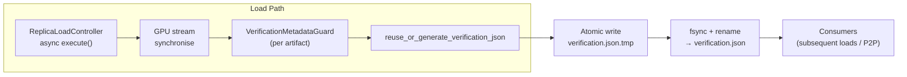

# Summary

Concurrent GPU materialisations used to race when persisting or consuming `verification.json`: one replica could emit a partially written file while another parsed it immediately and raised `DataLoss` despite identical device memory. This change introduces a per-artifact guard, atomic persistence helper, and explicit GPU completion barrier so verification metadata becomes deterministic, atomic, and contention-safe across the Store Engine. Regression tests exercise the guard under concurrent workloads and ensure logs expose the relevant coordination signals.

# Problem Statement

- `reuse_or_generate_verification_json()` writes JSON directly to the canonical path with no guard or atomic rename.
- Parallel `materialize_replica(..., LOAD_ONLY)` calls targeting different GPUs for the same artifact reuse the helper without coordination.
- A second load can open the file mid-write, parse incomplete payloads, and compare against hashes computed before the first load drains its CUDA stream, yielding false `DataLoss`.
- Disk + P2P fan-in and daemon-driven rebalances trigger the same race because all flows converge on the shared metadata file.

# Goals / Non-Goals

**Goals**
- Guarantee that readers observe only complete, finalised verification blobs.
- Prevent metadata verification from running before the producing transfer finishes on the GPU.
- Make metadata generation idempotent and shareable across replicas to avoid redundant hashing.
- Provide regression coverage and structured logging for concurrent load scenarios.

**Non-Goals**
- Changing the verification format or hash algorithm (xxHash64 segment rolling hash remains).
- Replacing RFC-0007 descriptor semantics or Global Store propagation contracts.
- Broader Store Engine modularisation (tracked in `0019-store-engine-modularization`).

# Architecture & Interfaces

## Guarded Metadata Pipeline

- `VerificationMetadataGuard` in `core/store/materialization/dataplane/verification/verification_utils.{h,cc}` provides `ScopedLock` backed by an `absl::Mutex` keyed on canonical artifact identifiers (recovered from `artifact_descriptor.json` when present, otherwise the canonicalised artifact path). Guard instances warn once when wait time exceeds 100 ms.
- `reuse_or_generate_verification_json` acquires the guard before reads/writes so only one load manipulates metadata at a time. In-process cache entries (keyed by artifact + byte_space) eliminate redundant hashing inside a single process; `ClearVerificationMetadataCacheForTesting()` resets the cache for stress tests.
- Atomic persistence uses a deterministic temp path `<name>.tmp.<pid>.<nonce>`, writes via POSIX `open`/`write`, flushes with `fsync`, closes the descriptor, and atomically renames to the final target. The parent directory is `fsync`-ed to guarantee durability. Guard RAII ensures readers either see the previous valid file or block until the new blob commits.

## GPU Completion Barrier

- `TransferService::{load_from_source,execute}` now synchronise the per-device H2D stream by calling `AsyncCopyManager::synchronize_h2d_stream(device_id)` followed by `cuda::device_synchronize()`. Synchronisation failures abort the transfer and propagate upstream.
- `ReplicaLoadController::load_async_from_source` continues to run post-load hooks only after `TransferService` reports success, which now implies GPU completion. Any sync failure aborts UMA commit and metadata generation, preserving on-disk state.

## Metadata Determinism & Caching

- The loader caches the most recent `ArtifactVerificationInfo` payload per artifact+byte-space in-process to cut guard hold time for repeat loads.
- Cache entries are invalidated automatically when the on-disk file is incompatible (byte-space mismatch) or verification fails; tests can clear the cache explicitly to force regeneration.
- Metadata structure remains unchanged; atomically persisted files always contain a full `ArtifactVerificationInfo` JSON blob associated with the expected `byte_space_id`.

## Logging

- Structured logs expose guard wait duration, write latency, artifact identifier (or path fallback), and byte space under the `verification_metadata_write_{succeeded,failed}` events.
- Guard wait warnings are emitted once per artifact when the wait threshold is exceeded, avoiding noisy log streams.
- File persistence failures fall back to the cached payload in memory and emit an `ERROR` log with the captured status for observability.

# Invariants & Error Model

- Metadata transitions are atomic: consumers either read the previously committed blob or the latest fully written blob; temp files are never visible.
- Metadata generation only commences once GPU transfers are confirmed complete; any CUDA failure aborts the entire load and leaves metadata untouched.
- Guard acquisition order is scoped per artifact, preventing cross-artifact deadlocks and ensuring liveness under high fan-in.
- Filesystem failures (`open`, `write`, `fsync`, `rename`, directory `fsync`) return `Status` to callers and surface via structured logs, never silently downgrading guarantees.

# Alternatives Considered

- **File-system advisory locks only:** Relying solely on `flock`/`fcntl` was rejected because we need in-process coordination even when metadata stays on object storage or non-POSIX filesystems; keyed mutexes give deterministic behaviour regardless of backend.
- **Global Store–mediated coordination:** Leveraging Global Store leases would have introduced cross-service round trips on every load and tightened coupling between runtime and control plane. The chosen guard is local, cheap, and keeps the Global Store uninvolved in data-path mutexing.
- **Eager metadata precomputation per device:** Precomputing verification JSON during artifact ingest would avoid runtime contention but multiplies write amplification and diverges the store from actual on-device bytes. Keeping generation near the replica ensures hashes reflect the loaded buffers and works for on-demand replicas.

# Trade-offs & Risks

- **Throughput hit:** Serialising metadata access introduces brief critical sections. Mitigated by the short hashing window plus in-process caching.
- **Atomic rename portability:** Linux `rename(2)` suffices; for exotic filesystems, failures log warnings and fall back to cached payloads to avoid serving partial files.
- **Deadlock potential:** Keyed mutexes must only lock per artifact; guard implementation rejects nested lock attempts and reports programming errors.
- **Cache staleness:** In-process caching must be invalidated on mismatched byte space or verification failure; explicit test hook ensures deterministic stress coverage.

# Compatibility & Acceptance Criteria

- Concurrent loads (disk or P2P) to multiple GPUs complete without false `DataLoss`.
- `verification.json` remains valid JSON with deterministic content for a given artifact; no consumer observes truncated or stale hashes.
- Single-threaded load latency regression remains within ±5% of baseline.
- Structured logs capture guard wait time, byte-space identifier, artifact reference, and metadata write latency without overwhelming output volume.

# Testing

- `bazel test //core/store/materialization/dataplane:verification_utils_test` — adds atomic persistence stress, logging assertions, and cache-clear hooks.
- `bazel test //core/store:multi_gpu_verification_race_test` — multi-threaded guard contention regression that mirrors concurrent GPU loads.

# References

- `core/store/materialization/dataplane/verification/verification_utils.cc`
- `core/store/replica/transfer_service.cc`
- `core/store/materialization/dataplane:verification_utils_test`
- `core/store:multi_gpu_verification_race_test`
- `core/common/artifact_verification.cc`

# References

- `core/store/materialization/dataplane/verification/verification_utils.cc`
- `core/store/replica/replica.cc`
- `core/common/artifact_verification.cc`
- `docs/designs/0019-store-engine-modularization.md`
