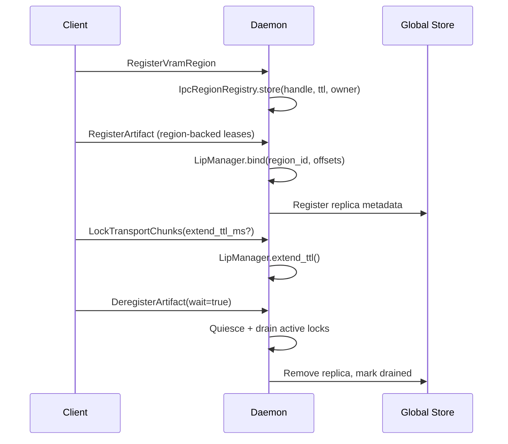

# Summary

Lease-in-place (LIP) registration currently exports a CUDA IPC handle for every page of the paged-attention KV cache. That per-page export dominates registration latency, wastes daemon-side mapping work, and offers no clean way to quiesce replicas before teardown. Region-backed registration introduces three capabilities:

- **Region registration**: clients pre-register large VRAM slabs once per device, yielding a reusable region identifier while the daemon tracks handle ownership and TTL.
- **Region-referenced leases**: LIP payloads reference a region identifier plus offsets and lengths, removing per-page handle exports without changing the existing CGID and lease model.
- **Quiesced deregistration**: an explicit `deregister_artifact` flow blocks new staged exports, waits for active transfers to drain, and then synchronizes replica removal with Global Store metadata.

Together these changes cut KV registration CPU cost, align daemon/runtime ownership of CUDA mappings with region lifetime, and provide an operator-friendly teardown story while remaining backward compatible with legacy clients.

# Goals

- Reduce registration latency for workloads that register thousands of KV segments by reusing a single CUDA IPC export per VRAM slab.
- Preserve the LIP client contract (register → get/get_into → deregister) while adding optional knobs for region reuse and TTL extension.
- Guarantee correctness: never tear down storage that is in use, maintain GS ↔ daemon replica consistency, and fail clearly when region preconditions are violated.
- Provide observability for region reuse, TTL extension, and deregister drain timing to support rollout and on-call debugging.

# Non-Goals

- Introduce new transport protocols or change staged export semantics; existing P2P/TCP/RDMA stacks remain untouched.
- Alter the UMA/VAS memory model or replicator path beyond accepting region identifiers.
- Require schema changes in Global Store; existing replica tables continue to model residency.
- Force immediate adoption: legacy clients that only send CUDA handles must continue to work unchanged.

# Architecture & Interfaces

## Flow Overview

## Protocol Additions (`proto/tensorcast/daemon/v1/store_daemon.proto`)

- New RPCs:
  - `RegisterVramRegion`: name, device ordinal, CUDA handle bytes, size, owner PID, ttl_ms → `region_id`.
  - `UnregisterVramRegion`: releases a region once no active references remain.
  - `DeregisterArtifact`: initiates a quiesce phase, waits for active locks (bounded by `drain_timeout_ms`), tears down lease state, and acknowledges completion.
- Existing RPC updates:
  - `RegisterStorageMeta`: add `oneof storage_source { bytes cuda_ipc_handle; string vram_region_id; }`, `uint64 region_base_offset`, and `string storage_id`. Handle bytes remain for legacy clients.
  - `LeaseSegment`: reference `storage_id` rather than raw handle bytes.
  - `LockTransportChunksRequest`: add optional `extend_ttl_ms` to let clients request a TTL bump while a transfer is in flight.
- Messages include explicit `FAILED_PRECONDITION` error codes when region ownership or offsets are invalid, and `INVALID_ARGUMENT` when both sources are supplied.

Regeneration requirements:

- `bash tools/build_proto_python.sh`
- `bazel build //proto/...`

The design maintains backward compatibility by marking new fields as optional and leaving legacy handle fields untouched when `storage_source` is not set.

## Identity Policy (0017 alignment)

- Region-backed registration continues to rely on client-generated IDs for KV pages: `artifact_id = "cgid:kv:<block_hash_hex>"`.
- Both daemon and Global Store honour `artifact_id` and `key` fields, mirroring the guidance from `docs/designs/0017-client-generated-artifact-id.md`.
- Legacy keyed registrations remain accepted; when both are provided, the daemon asserts they resolve to the same CGID.

## Daemon Runtime (`daemon/`)

### IpcRegionRegistry

- Tracks `{region_id, device_id, owner_pid, ttl_deadline, size_bytes, handle_bytes, refcount, opened_map}`.
- Lazily opens CUDA mappings on first use, pinning them until refcount drops to zero.
- Validates that the registering PID matches the session emitting leases; mismatches fail with `FAILED_PRECONDITION`.
- Enforces TTL by evicting expired regions and refusing new references.
- Integrates with OpenTelemetry counters:
  - `tensorcast.daemon.region.registered_total`
  - `tensorcast.daemon.region.reuse_total`
  - `tensorcast.daemon.region.evicted_total`
  - `tensorcast.daemon.region.ttl_extension_total`

### LIP Manager Enhancements

- Accepts region-backed storages; resolves region metadata via the registry, validates `region_base_offset + length` against `size_bytes`, and shares the opened mapping across segments.
- Maintains compatibility by falling back to the existing CUDA handle opening path when `storage_source` is unset.
- Stores a per-lease reference list so `deregister_artifact` can decrement region refcounts.
- Adds TTL bookkeeping that tracks the furthest expiration for all storages backing a lease. `extend_ttl_ms` is applied atomically to both lease metadata and each referenced region.

### Quiesced Deregistration

- `deregister_artifact(wait=true)` transitions the lease into a `QUIESCE_PENDING` state:
  - Block new staged exports and transport locks.
  - Wait for existing locks to finish, bounded by `drain_timeout_ms`. On timeout, return `DEADLINE_EXCEEDED` but keep the lease quiesced; operators may retry or force delete.
  - After drain, release staged exports, decrement region references, and notify Global Store to remove the replica.
- `wait=false` is a best-effort fire-and-forget option for emergencies; it skips waiting but still schedules background cleanup.
- Lip manager emits histograms for wait duration and counters for forced/timeout cases.
- `TransportController::lock` uses the new `extend_ttl_ms` hint when producing staged exports, ensuring TTL extensions apply before remote readers begin consuming data.

## SDK (`tensorcast/api/`, `tensorcast/api/_register.py`, `tensorcast/store.py`)

- Introduce `VramRegion` data class capturing `region_id`, `device`, `size_bytes`, `ttl_ms`.
- New API surface:
  - `Store.register_vram_region(...) -> VramRegion`
  - `Store.unregister_vram_region(region_id: str) -> None`
  - `Store.deregister_artifact(..., wait: bool = True, drain_timeout_s: float = 30.0)`
  - Module-level helpers mirror these APIs under `tensorcast.api.store` for clients using the process-scoped store façade.
- Extended APIs:
  - `Store.register(..., artifact_id: str | None = None, key: str | None = None, ttl_ms: int | None = None)`:
    - When `artifact_id.startswith("cgid:")`, skip hashing and send the CGID path introduced in design 0017.
    - Lease uploads reference regions when storages fall inside registered slabs, otherwise fall back to legacy handle exports.
  - `Store.get` / `Store.get_into` gain `transport_hold_ms` to request TTL extensions.
- `_LeaseUploader` inspects tensor storages:
  - Maintains a local index of registered regions keyed by `(device, base_ptr, size_bytes)`.
  - When `base_ptr` and `length` fall inside a known region, emit `storage_source = vram_region_id` plus `region_base_offset`; skip handle export.
  - Falls back to per-storage handle export when no region covers the storage.
- `Store.get` and `Store.get_into` accept `transport_hold_ms`; values are passed to the transport lock RPC as `extend_ttl_ms`.
- Errors from the daemon bubble up as typed Python exceptions with actionable context.
- Capability negotiation:
  - During session establishment, clients detect whether the daemon advertises `region_registration_capability`.
  - When absent, SDK silently keeps the legacy handle path and hides region APIs behind a runtime check (raising `UnsupportedFeatureError` if invoked).
- Convenience helper (removed in 0039): instead of `Store.register_kv_block(...)`, rely on standard `register(...)` with region reuse and consistent `artifact_id`/`key` conventions for KV layouts.

## Global Store (`tensorcast/global_store/`)

- Daemon RPC client adds a `deregister_artifact` call that carries quiesce outcomes.
- `ArtifactService` marks replicas as `draining` during quiesce, prevents new registrations while draining, and drops the replica after confirmation.
- Metrics:
  - `tensorcast.global_store.artifact.deregister_started_total`
  - `tensorcast.global_store.artifact.deregister_completed_total`
  - `tensorcast.global_store.artifact.deregister_failed_total`
- No schema changes are required; existing columns (`id_kind`, TTL) remain sufficient.

## Observability

- OpenTelemetry counters/histograms on both daemon and SDK error paths.
- Structured logs:
  - Region register/unregister success/failure with owner PID.
  - Deregister state transitions with artifact identifiers.
  - TTL extension rejections.

# Schema Changes

None. Existing Global Store tables and daemon metadata structures accommodate the new state. The design requires validation-only updates to confirm CGID handling and TTL semantics.

# Invariants & Error Model

- A region is owned by exactly one session (enforced by owner PID). Attempts to reuse by a different PID fail.
- `region_base_offset + segment_length <= size_bytes` must hold; violations raise `FAILED_PRECONDITION`.
- Deregistration may only complete when:
  - No active transport locks exist.
  - All referenced regions have decremented to zero refcount.
  - Global Store acknowledges replica removal.
- TTL extension requests shorter than the existing deadline are ignored; longer requests update both region and lease expiration.
- Region unregister attempts fail with `FAILED_PRECONDITION` when refcount > 0 or when the region is mid-deregister.

# Compatibility & Migration

- Proto changes rely on optional fields; older daemons will ignore new fields, and older clients can continue to send CUDA handles.
- SDK detects daemon capability before exposing region APIs. If unsupported, it raises `UnsupportedFeatureError`.
- Rolling upgrade path:
  1. Upgrade Global Store (new deregister flows).
  2. Upgrade daemon; region-backed RPCs are available immediately.
  3. Upgrade SDK; clients negotiate capability and fall back to handle-based flow when unavailable.

# Trade-offs & Alternatives

- **Canonical region registry vs. per-lease caching**: chosen to centralize handle ownership, simplify TTL enforcement, and avoid memory duplication. Alternative (cache per lease) would duplicate CUDA mappings and complicate eviction.
- **TTL extension via lock RPC**: avoids a new RPC and keeps semantics close to existing staged export lifecycle. Alternative (separate keepalive RPC) increases surface area without functional benefit.
- **Capability gating**: runtime negotiation avoids version skew-induced failures. Alternative (hard fail when daemon lacks support) would block staged rollouts.
- **Region identifiers scoped to session**: we prefer session scoping to avoid stale references after crash/restart. A global namespace would require cross-daemon coordination and complicate GC.

# Risks & Mitigations

- **Dangling regions after client crash**: TTL enforcement plus owner PID checks ensure regions expire; daemon periodically sweeps expired regions and emits alerts.
- **Transport stall if TTL extension fails**: SDK surfaces rejection immediately; operators can tune `transport_hold_ms`. Daemon logs warnings with root cause.
- **Global Store divergence**: deregister API uses transactional removal, and retries keep draining state consistent. Metrics and alerts on stalled drains provide visibility.
- **Daemon memory pressure**: registry enforces per-device refcount caps and optional LRU eviction (oldest idle region). Pressure triggers `RESOURCE_EXHAUSTED` errs instead of silent failure.

# Acceptance Criteria

- Region-backed registration shows ≥5× reduction in daemon CUDA IPC open operations for KV workloads measured by benchmark.
- Deregistration with `wait=true` blocks new locks, drains existing locks, and removes replicas from both daemon and Global Store within configured timeout.
- Legacy clients continue to register artifacts via CUDA handles without code changes.
- Telemetry dashboards include region reuse counters, deregister latency, and TTL extension outcomes.

# Rollout Plan

1. Merge proto, daemon, and SDK changes.
2. Regenerate protobuf stubs and ensure both Python and C++ builds pass.
3. Land unit and integration tests (Catch2 for daemon, pytest for SDK).
4. Register KV slabs in staging and monitor metrics.
5. Run microbenchmark comparing per-page and region-backed registration; document results in `docs/internals/model-loading.md`.
6. Update operator runbooks and module READMEs (Store Engine, daemon, API).

# References

- `docs/plans/0021-region‑backed-registration.md`
- `docs/designs/0014-lease-in-place-registration.md`
- `docs/designs/0017-client-generated-artifact-id.md`
- `tensorcast/api/_register.py`
- `daemon/lip_manager.cc`
- `tensorcast/global_store/services/artifact_service.py`
- `proto/tensorcast/daemon/v1/store_daemon.proto`
