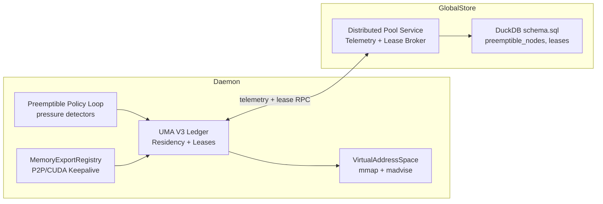

# Summary

TensorCast 现有的可抢占内存仅在单个 daemon 内以“best effort” 方式运行：`UnifiedMemoryAuthority::mark_cpu_chunks_preemptible` 只是在 VS 上调用 `madvise` 并把 chunk 记为 `PREEMPTIBLE`（`docs/internals/preemptible-memory.md:39-43`），`get_missing_chunks_locked_` 又把该状态视为“可用”，导致内核实际回收后也不会触发再水化。与此同时，设计文档 `docs/designs/0012-uma-dvmp-transactional-transfer.md` 把 UMA V3 定位为唯一权威账本，但尚未对可抢占内存给出全局方案。本设计提供一个分阶段的全景架构：先在每个 daemon 内完成 UMA 事务化、租约化的本地可抢占池，再把这些池通过 global store 组合成稳定的分布式内存租约服务，最终让上层任务像使用 RAII 资源一样使用“稳定内存”。

# Problem & Context

## 现状（grounding）

- 可抢占标记以 chunk 前缀方式执行，UMA 与 VS 没有事务，失败不会回滚（`docs/internals/preemptible-memory.md:39-41`）。
- VS `chunk_meta` 不更新状态，Telemetry 无法看到 resident/preemptible 分布（`docs/internals/preemptible-memory.md:41,43`）。
- 导出路径和传输层在标记可抢占时没有租约保护，P2P/IPC 需要手动确保数据仍在（`docs/internals/preemptible-memory.md:30-33,43`）。
- 设计 `docs/designs/0012-uma-dvmp-transactional-transfer.md:18-55` 已要求 UMA 事务化、分离 `ChunkState` 字段，但尚未落实到可抢占策略、global store 接口。

## 核心问题

1. **缺乏可信账本**：daemon 内 UMA 与 VS 状态漂移，无法判断 chunk 是否真的可读。
2. **无租约模型**：导出、传输和客户端对稳定内存没有契约，导致在压力下不可预测。
3. **全局视角缺失**：global store 看不到各节点的 preemptible/ stable 供给，更无法统筹调度或迁移。

# Goals / Non-Goals

## Goals

- 让 UMA V3 成为 daemon 内可抢占内存的唯一权威：引入 `CpuResidency = {Resident, StableLease, Preemptible, Rehydrating, Evicted}`、事务化 `Plan → Execute → Commit`。
- 建立租约 API（`StableLease`、`ElasticLease`）供 loader、export registry、communicator、worker 使用，实现 RAII 释放与指标可观测。
- 采集并发布 per-daemon Telemetry（可抢占比率、缺页率、rehydration 延迟、租约占用）给 global store。
- 在 global store 内实现“分布式稳定内存池”服务：根据 Telemetry 和策略分配/撤销跨节点 lease，支持回退、TTL、优先级。
- 保持 daemon 独立可运转：即便 global store 离线，local UMA 也能继续执行策略和租约。

## Non-Goals

- 不在本设计中定义新的 artifact 对外 API；客户端仍通过现有 `tensorcast.get()` 等接口访问。
- 不在此处实现 GPU 侧的抢占/泄压；聚焦 CPU RSS 管控与相关租约。
- 不修改 Artifact 传输格式、Chunk 尺寸；仍使用既有 `ArtifactLayout`。

# Architecture & Interfaces

## 分层概览



### 1. 本地 UMA 事务化

- **Residency 拆分**：按 `docs/designs/0012-uma-dvmp-transactional-transfer.md:157-159` 定义 `ChunkRecord` 字段。`mark_cpu_chunks_preemptible` 不再直接操作 VS；改为生成 `PreemptPlan{id, chunk_ids, target_state}`，只有 VS 回传成功结果后才提交。
- **缺页感知**：在 VS 中添加 `fault_event_cb`（或透传 `mincore`/`userfaultfd` 统计）。UMA 监听并把 `Preemptible` → `Rehydrating`，再调 `TransferPlan` 从磁盘或远端加载，完成后记为 `Resident`。
- **导出租约**：`MemoryExportRegistry` / `Communicator` 在导出 chunk 时必须调用 `UMA::AcquireStableLease(chunk_span, purpose)`，失败时回退导出。Lease 释放后 UMA 才能把 chunk 重新纳入 preemptible 选择。

### 2. daemon 级策略循环

- **Pressure Sensors**：从 VS（RSS、`evict_tail_bytes`、`madvise` 回退）、内核 (`/proc/pressure/memory`)、堆栈计数收集信号。
- **Selector**：替换“前缀”策略为得分队列（age、pin_refcnt、exported、gpu_touch）。实现位于 `core/store/replica/preemptible_policy.{h,cc}`。
- **Telemetry**：定期生成结构化快照 `PreemptibleSnapshot`，包括：
  - `stable_bytes`, `preemptible_bytes`, `leases_active`；
  - `faults_per_sec`, `rehydration_p50/p99`, `export_protected_bytes`；
  - 节点硬件指纹（NUMA, memory pressure）。

### 与现有组件的对齐（面向最终状态的重构）

- **Leases 语义升级**：沿用 `docs/designs/0011-unified-session-lifecycle-leases.md` 中的架构，但把 `PlacementLease/UseLease` 等旧常量重命名并内联为 `StableLease`、`ElasticLease`、`DistributedLease`。旧名称直接删除，不保留别名或兼容层。
- **VS/UMA 代码路径**：`core/store/replica/unified_memory_authority.*` 与 `core/common/memory/virtual_address_space.*` 中所有 `mark_cpu_preemptible`、`post_gpu_load_policy`、`get_missing_chunks_locked_` 等函数被重构为新的事务 API：`PlanPreemptChunks`、`CommitPreemptPlan`、`AbortPreemptPlan` 与 `PlanRehydrateChunks`。历史入口会被移除，避免双写。
- **chunk_directory 演进**：表结构将新增 `cpu_residency`, `lease_kind`, `pressure_score` 字段并删除 `chunk_state`。`ChunkService`/`ChunkDirectoryRepository` 的 upsert 与查询逻辑改为写入这些新列，同时废弃 `node_load_ratio` + 旧状态的组合语义。
- **Worker 心跳通道**：`WorkerService` 的批处理线程保留，但 gRPC proto 与 DuckDB 的 `workers` 表将改写为：`available_stable_bytes`, `available_elastic_bytes`, `faults_per_sec`, `rehydrate_p99_ns`, `lease_revocations_pending` 等字段，完全替代旧的 `mem_pool_*` 指标。
- **Proto 类型**：`proto/tensorcast/global_store/v1/global_store.proto` 将删除 `ChunkState`，新增 `ResidencyState`, `LeaseKind`, `TelemetryDelta` 等消息。由于没有历史兼容包袱，所有组件一次性 bump 版本号并更新生成代码。

### 3. global store 协调

- **Telemetry 表**：在 `schema.sql` 中新增 `preemptible_nodes(node_id, epoch_ns, stable_bytes, preemptible_bytes, faults_per_sec, rehydrate_p99_ns, leases_json)`。
- **Lease Broker**：
  - API：`RequestDistributedLease(workload_id, min_stable_bytes, elastic_ratio, affinity)`。
  - Broker 查询 Telemetry、选出候选 daemon，通过 RPC `ReserveLease` 与 UMA 协商子租约，并把 lease token 写入 `distributed_leases` 表。
  - Token 结构：`{lease_id, node_id, chunk_span_or_bytes, type=Stable|Elastic, ttl_s, revoke_url}`。
- **Revocation & Rebalance**：daemon 在压力升高时调用 `ReportRevocationIntent(lease_ids)`；global store 决定是否迁移或降级。若控制面不可用，daemon 本地 TTL 到期即视为允许回收。

#### 通信频率与负载策略

- **单实例约束**：global store 为单实例部署，所有 daemon 推送 Telemetry 或申请租约都命中该节点，因此必须避免 N×M 的风暴。采用“baseline + delta”策略：  
  - Baseline 心跳周期（默认 5s，可通过配置下发）携带完整快照；  
  - 中间 delta 心跳仅包含改变的字段，并允许 daemon 合并多条事件再上报。  
 这样 global store 仍能以秒级粒度看到趋势，而不会被毫秒级噪声淹没。
- **事件驱动优先级**：当 daemon 触发重大事件（如 `faults_per_sec` 超阈、即将回收 stable lease）时，发送高优先级“intent” RPC，并附带节流令牌（token bucket）。global store 根据 token 速率限制每节点每分钟的突发次数，确保单实例 CPU 可控。
- **拉/推混合**：global store 在处理租约请求时可回读最近一次心跳时间戳；若距今超过 `stale_heartbeat_threshold`（默认 15s），则主动向 daemon 触发一次“pull” RPC 获取最新数据或拒绝请求。这样即便心跳周期较大，也能在交互式操作前刷新一次。
- **批量调度**：租约 Broker 每个调度周期（例如 500ms）把所有 pending 请求批量求解，并按 daemon 可用容量排序，减少单请求/单 RPC 的开销。
- **自适应周期**：daemon 的策略循环根据本地压力调整 delta 心跳频率：压力低时扩大到 10–15s；压力高（RSS>阈值或存在大量 rehydration）时缩到 1–2s，以便 global store 更快得知瓶颈。这一逻辑位于 daemon 端 `telemetry_publisher` 中，不增加 global store 复杂度。

### 4. 升级策略（无历史兼容需求）

- **同步切换**：所有 daemon、global store、SDK 在同一 release 中升级到新 proto/schema/API。禁止在集群中混跑旧版本。
- **立即清理**：每个子设计落地后立刻删除旧函数、旧枚举、旧字段（如 `ChunkState`、`mem_pool_*`），不保留 shim。
- **客户端交互**：上层 worker/SDK 继续通过 daemon 访问，无需直接感知分布式租约，但必须依赖最新 daemon 才能正常工作。

# Concept & Ownership Evolution

项目 owner 视角下，需要明确哪些概念是新增、哪些是沿用，以及旧抽象如何演进以承载本方案：

| 现有概念 / 模块 | 目标状态 | 说明 |
| --- | --- | --- |
| `ChunkState`（单枚举） | 更名并拆分为 `ResidencyState`, `LeaseState`, `GpuResidency` | 全栈（UMA + global store + proto）统一采用新字段，旧 `ChunkState` 完全删除。 |
| `PlacementLease` / `UseLease`（0011） | 重命名为 `StableLease` / `ElasticLease`，新增 `DistributedLease` | `SessionLifecycleManager` 的 `LeaseKind` 列表重写；老常量和别名全部移除。 |
| `ReplicaLoadController::mark_cpu_preemptible` | 替换为 `PlanPreemptChunks` + `Commit/Abort` | 旧函数删除；所有调用者直接使用新事务 API。 |
| `chunk_directory` + `ChunkService` | 升级 schema（`cpu_residency`, `lease_kind`, `pressure_score`） | 重新实现 repository/service，使其只理解新列；原 `node_load_ratio`/`chunk_state` 字段移除。 |
| `WorkerService` 心跳 | 指标定位为租约/压力 | 心跳消息输出 `available_stable_bytes`, `available_elastic_bytes`, `faults_per_sec`, `rehydrate_p99_ns`，不再暴露 `mem_pool_*`。 |
| `global_store.services.chunk_service` | 扩展含 lease 维度 | 新增 `PublishPreemptibleSnapshot`、`ListDistributedLeases` 等方法，直接与 `distributed_leases` 表协同。 |
| `schema.sql` | 新增/修改表 | 增加 `preemptible_nodes`, `distributed_leases`，并重写 `chunk_directory` 列定义。 |
| `docs/internals/preemptible-memory.md` | 全量重写 | 反映新的租约、Telemetry、全局池逻辑，旧章节删除或迁移到历史记录。 |

整个设计以最终架构为准，不保留兼容层：抽象名字可复用，但实现直接升级，不引入临时桥接。核心新增组件如下：

- `PreemptPlan`：UMA 内部事务对象，由 `core/store/replica/unified_memory_authority.*` 管理，负责 `Plan/Commit/Abort`。
- `TelemetryPublisher`：daemon 级组件，挂在 `ReplicaLoadController`/`DaemonRuntime`，周期性聚合并推送 `PreemptibleSnapshot`。
- `DistributedLease`：global store 的新业务实体（DuckDB 表 + service + proto），由 control-plane 团队负责，与 `RequestDistributedLease`/`ReserveLease` RPC 对应。

三个 owner 分区明确后，每个子设计可在自己的范围内演进，而顶层设计在此文档中约束它们的接口契约与术语，避免未来出现第三套租约或平行目录。

# Schema Changes

（草案，待实现设计/计划细化）

```sql
CREATE TABLE IF NOT EXISTS preemptible_nodes (
  node_id TEXT NOT NULL,
  epoch_ns BIGINT NOT NULL,
  stable_bytes BIGINT NOT NULL,
  preemptible_bytes BIGINT NOT NULL,
  faults_per_sec REAL NOT NULL,
  rehydrate_p99_ns BIGINT NOT NULL,
  leases_json TEXT NOT NULL,
  PRIMARY KEY (node_id, epoch_ns)
);

CREATE TABLE IF NOT EXISTS distributed_leases (
  lease_id TEXT PRIMARY KEY,
  workload_id TEXT NOT NULL,
  node_id TEXT NOT NULL,
  bytes BIGINT NOT NULL,
  kind TEXT CHECK (kind IN ('stable', 'elastic')) NOT NULL,
  ttl_s BIGINT NOT NULL,
  state TEXT CHECK (state IN ('active', 'revoking', 'expired')) NOT NULL,
  issued_at_ns BIGINT NOT NULL,
  revoked_at_ns BIGINT
);
```

此外需要重写 `chunk_directory` 定义，移除 `chunk_state`/`node_load_ratio`，新增：

```sql
ALTER TABLE chunk_directory
    DROP COLUMN chunk_state,
    DROP COLUMN node_load_ratio,
    ADD COLUMN cpu_residency TEXT NOT NULL DEFAULT 'resident',
    ADD COLUMN lease_kind TEXT NOT NULL DEFAULT 'stable',
    ADD COLUMN pressure_score REAL NOT NULL DEFAULT 0.0;
```

最终实现前需与 `schema.sql` 对齐，并在子设计中定义迁移/索引。

# Sub-design & Plan Breakdown

为降低复杂度，本总设计拆分为三个子设计/计划（编号占位，后续文档需按顺序提交）：

1. **0022A – UMA 事务化可抢占账本**  
   - 文件：`docs/designs/0022a-uma-transactional-preemption.md`（待撰写）  
   - 关注点：`ChunkRecord` 拆分、`PreemptPlan` 事务 API、VS 回调、缺页触发再水化。  
   - 实施计划：`docs/plans/0022a-uma-transactional-preemption.md`。

2. **0022B – daemon 租约接口与 Telemetry**  
   - 文件：`docs/designs/0022b-daemon-preemptible-telemetry.md`  
   - 关注点：租约 API（`StableLease`, `ElasticLease`）、 pressure loop、统计导出、与 loader/export/communicator 的整合。  
   - 实施计划：`docs/plans/0022b-daemon-preemptible-telemetry.md`。

3. **0022C – global store 分布式租约服务**  
   - 文件：`docs/designs/0022c-global-preemptible-pool.md`  
   - 关注点：schema 扩展、Telemetry RPC、Lease Broker、回收与客户端交互。  
   - 实施计划：`docs/plans/0022c-global-preemptible-pool.md`。

每个子设计完成后需更新本文的“Status”字段，并在 References 中记录链接。

# Trade-offs & Risks

- **复杂度上升**：引入多层租约与事务，需要严密错误处理。通过 RAII handle +细粒度测试缓解。
- **Telemetry 延迟**：global store 依赖心跳，若延迟过大，分布式池可能基于过期数据分配。需在计划中定义心跳频率与超时策略。
- **回收风暴**：多个 daemon 同时压力升高可能导致全局租约快速收缩。需在 Broker 中实现节流与优先级降级策略。
- **Backward Compatibility**：旧版本 daemon 不支持租约 RPC。方案是让 global store 根据 `capabilities` 字段选择性启用功能。

# Performance & Scaling Considerations

- **单实例 global store**：根据 `tensorcast/global_store/README.md`，当前部署为单实例 DuckDB 服务。所有心跳、chunk 更新、租约 RPC 都共享同一 gRPC 监听进程，因此本文方案刻意复用现有批处理路径（`WorkerService._heartbeat_buffer`, `ChunkDirectoryRepository.batch_update_chunk_states`）并引入增量字段，避免再创建新的高频 RPC。
- **批处理/合并**：与现有 `worker_repository.batch_update_heartbeats` 类似，新的 Telemetry/Lease RPC 需支持 `UPDATE … FROM (VALUES …)` 形态，让一次 round trip 更新多个 daemon 指标；global store 端以 500 ms 周期调度批量 Lease Broker 以减少 DuckDB 写入放大。
- **索引与查询模式**：`chunk_directory` 已存在按 `(artifact_id, chunk_idx, chunk_state)` 的多列索引（`schema.sql:155-159`）。分布式池的选点逻辑将优先使用这些现有索引，新增的 `preemptible_nodes` 表需要类似的 `(node_id, epoch_ns)` 复合主键与 `epoch_ns` 降序索引以支持最新快照查询。
- **回传过滤**：Daemon 在发送 delta 心跳时只报告发生变化的指标，并在本地维护 `last_published_snapshot` 缓存，减少带宽。global store 端通过 `stale_heartbeat_threshold` 判定是否需主动 `pull`，防止过期数据。
- **背压策略**：当 global store CPU/IO 飙升（可复用 `tensorcast/global_store/metrics.py` 暴露的 Prometheus 指标）时，可由服务端调低 `telemetry_config.push_interval_ms`，并通过 gRPC 配置推送下发。daemon 侧的自适应发行逻辑可根据 server-side `ResourceExhausted`/`Unavailable` 响应自动延长心跳。

# Compatibility & Acceptance Criteria

1. **Local authority completion**：每个 daemon 提供自洽的 `StableLease/ElasticLease` API，并通过压测证明在压力场景下可以自动再水化且不中断导出（tests under `tests/python/daemon/test_preemptible_policy.py`，待新增）。
2. **Telemetry correctness**：global store 接收至少年化 3 个 daemon 的快照，比较 VS/UMA 统计与报表一致性（误差 <5%）。
3. **Distributed leases**：一个端到端演示：workload 请求 2 个节点的 stable pool，global store 分配子租约，随后其中一个 daemon 触发回收，global store 自动迁移或降级，客户端无感知失败。
4. **Failover behavior**：拔掉 global store，daemon 继续执行本地策略且保持 API 可用；重新连接后能够重新注册 Telemetry。

# References

- `docs/internals/preemptible-memory.md` — 现状、触发点、缺陷。
- `docs/designs/0012-uma-dvmp-transactional-transfer.md` — UMA V3、事务模型、ChunkRecord 拆分。
- `core/store/replica/unified_memory_authority.*`, `core/common/memory/virtual_address_space.*` — 当前实现。
- `tensorcast/global_store/README.md`, `schema.sql` — global store 持久化与 API 入口。 
