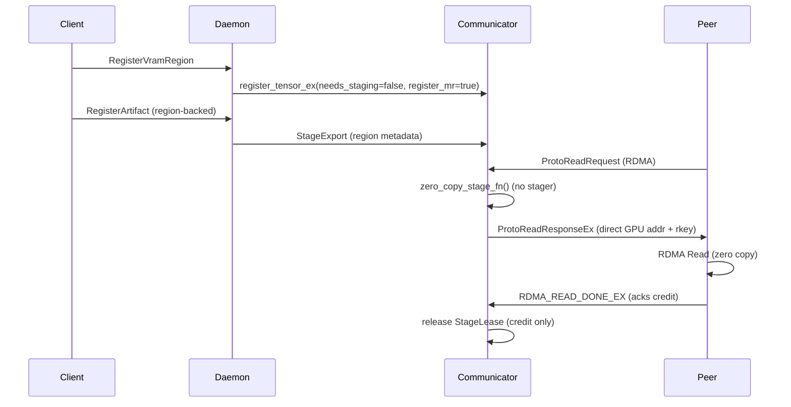

# Summary

Region-backed registrations (see [region-backed](../architecture/api/region-backed.md)) eliminate CUDA IPC handle fan-out but today still stage GPU memory through host buffers before every RDMA transfer. This design removes the extra copy by teaching the communicator to reuse the pre-registered GPU memory regions, exposing the existing Memory Region (MR) directly to peers while retaining the current credit-based flow control, synchronously confirming MR readiness, and keeping staged fallbacks for compatibility.

# Goals

- Deliver true zero-copy RDMA reads for region-backed artifacts when communicator RDMA is enabled and MR registration succeeds.
- Preserve current flow-control semantics (window sequencing, credit accounting, ACK protocol) so clients and transports remain unchanged.
- Provide deterministic fallback to the existing staging path when preconditions fail (e.g., MR not ready, non-region storage).
- Instrument observability to track zero-copy usage, fallback frequency, and outstanding credit.

# Non-Goals

- Alter client protocol messages or require new API fields on the wire.
- Change MTCP/TCP staging behavior or disable staging for legacy CUDA-handle leases.
- Redesign `StagingWindow` or FlowCreditLedger algorithms beyond allowing zero-copy StageLeases.

# Architecture & Interfaces

## Communicator Zero-Copy Eligibility

- Extend `Communicator::handle_rdma_read_request` to detect direct-ready tensors:
  - `enable_rdma_ == true`
  - `tensor->get_mem_type() == COMMUNICATE_ENGINE_DEV_GPU`
  - `tensor->needs_staging() == false`
  - `tensor->get_mr() != nullptr`
  - `request.offset + request.bytes <= tensor->get_bytes()`
  - `PartitionTensor` gains `bool direct_rdma_enabled()` to allow daemon policy toggles without overloading `needs_staging`.
  - `register_tensor_ex` continues to set `register_mr = true`; introduce `PartitionTensor::wait_mr_ready()` and invoke it for zero-copy tensors so MR registration completes synchronously before the address is exposed. Staged tensors retain the existing async registration path.

## Stage Function Variants

- Introduce helper `MakeStageFunction(const std::shared_ptr<PartitionTensor>& tensor, FlowCreditLedger* ledger)`.
  - **Direct path:** returns a lambda that creates `StageLease{stager=nullptr, ledger, exposed_ptr=tensor_base+offset, mr=tensor->get_mr(), deregister_mr=false}`.
  - **Fallback path:** retains current staging lambda using `MemoryStager::stage`.
- `StagingWindow` continues to drive chunking. Add configuration knob `stager().direct_chunk_mb` (defaults to `stage_chunk_mb_gpu`) to tune zero-copy window size without affecting staging chunking.

## Response & ACK Semantics

- `DriveRdmaSession` emits segments using the StageLease metadata unmodified. `hdr->staged` remains `1`, indicating peers must send `RDMA_READ_DONE_EX` to release credit even for zero-copy segments.
- The ACK handler already releases `StageLease` objects via the registry. With zero-copy leases the release reduces to returning credit.
- Add guard rails: if ACK is missing beyond `ack_ttl_ms`, sweep tasks revoke region references similar to existing staged leases.

## Fallback Handling

- When eligibility fails or `MakeStageFunction` returns error:
  - Log `LOG_FIRST_N(WARNING, 1)` with reason.
  - Increment counter `tc_rdma_direct_fallback_total`.
  - Call existing staging helper.
- During runtime failures (e.g., RDMA read errors), engine already sends `READ_FAILED`; no new control messages required.

## Observability

- Prometheus counters:
  - `tc_rdma_direct_segments_total{device_id}` — segments served via zero-copy.
  - `tc_rdma_direct_bytes_total{device_id}` — bytes served via zero-copy.
  - `tc_rdma_direct_fallback_total{reason}` — fallbacks enumerated by cause.
- Gauge `tc_rdma_credit_outstanding` already exists; add histogram `tc_rdma_direct_window_bytes` for window sizing insight.

# Daemon Integration

- `LipManager` already sets `needs_staging=false` for region-backed storage; ensure staged exports propagate `direct_rdma_enabled=true`.
- Region TTL refresh and `release_staged_export` remain unchanged; they release communicator tensors which now may hold GPU MR references.
- Add defensive check before `comm_engine.unregister_tensor` to ensure zero-copy exports are released prior to region deregistration.

# Compatibility & Acceptance Criteria

- Legacy clients and CUDA-handle-based registrations continue to stage; no protocol bump.
- Zero-copy path must pass existing RDMA integration tests plus new coverage:
  - Direct path end-to-end returns correct payload and keeps CPU staging counters unchanged.
  - Fallback path triggers when MR absent.
  - Credit ledger balanced after draining many windows (no outstanding credit leaks).
- Performance acceptance: benchmark should show ≥1.7× throughput improvement vs. staged path on 128 MiB artifact, 100 Gb RDMA.

# Trade-offs & Risks

- **MR lifetime coupling:** communicator now depends on timely region deregistration. Risk mitigated by keeping fallback and error logs.
- **Synchronous MR readiness:** zero-copy tensors incur a registration barrier; latency hit is limited to once-per-region registration and deemed acceptable for correctness.
- **Telemetry overhead:** additional counters must be lightweight; use atomic increments.
- **Chunk configuration sprawl:** introducing `direct_chunk_mb` adds complexity; default to existing chunk size and document tuning guidance.
- **ACK load:** zero-copy still requires ACK per window; future work could explore multi-window outstanding support.
- **Transport retries:** failure surfaces are unchanged; RDMA errors in zero-copy mode propagate as hard failures (same as staged path) and callers must reissue via fallback if needed.

# Implementation Notes

- Communicator now exposes `PartitionTensor::direct_rdma_enabled()` plus `wait_mr_ready()` so region-backed tensors synchronously gate MR visibility before answering RDMA reads. Region export paths (`daemon/lip_manager`, UMA-backed exports, and ad-hoc communication manager registrations) set the flag only when RDMA is active.
- `handle_rdma_read_request` selects between a zero-copy `StageLease` (MR + raw GPU pointer, no stager) and the existing staging lambda. When eligibility fails, `record_direct_fallback_metric` increments `tc_rdma_direct_fallback_total{reason}` and the request transparently reverts to staging.
- `direct_chunk_mb` in `CommunicatorConfig.stager` decouples zero-copy window sizing from staging chunk size. Defaults inherit `stage_chunk_mb_gpu` so existing deployments remain unchanged.
- Observability is implemented via OpenTelemetry counters/histogram: `tc_rdma_direct_segments_total`, `tc_rdma_direct_bytes_total`, `tc_rdma_direct_window_bytes`, and fallback attribution. These record per-window activity inside `DriveRdmaSession`.
- StageLease metadata carries a `zero_copy` flag and unit tests cover the new toggles/regression paths (`staging_flow_controller_test`).
- Validation to date: `bazel test //core/communicator:staging_flow_controller_test`. End-to-end RDMA soak & perf benchmarks remain scheduled ahead of rollout.

# References

- `docs/architecture/api/region-backed.md`
- `core/communicator/README.md`
- `core/communicator/engine/engine.cc`
- `daemon/lip_manager.cc`
