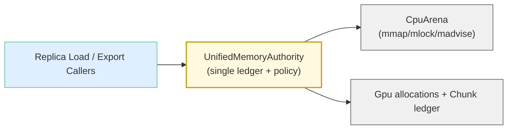

# Summary

Create a single-layer UnifiedMemoryAuthority (UMA) subsystem that owns CPU virtual address reservations, chunk ledger state, export bookkeeping, and telemetry. UMA’s internal `CpuArena` handles mmap/mlock/madvise while the outer UMA surface exposes allocation, plan/commit, export, and snapshot APIs. StoreEngine and daemon observers consume these UMA snapshots directly, so there is no auxiliary virtual-address component or duplicated metadata, and lock ordering is simplified.

# Goals / Non-Goals

## Goals

- Single source of truth for chunk state, telemetry, and export bookkeeping inside UMA.
- Ensure UMA is the only public surface for CPU virtual-address management and chunk telemetry.
- Provide clear, minimal UMA APIs for callers (replica loading, export, direct write, telemetry).
- Simplify lock ordering by keeping all CPU residency operations under UMA’s control.
- Update documentation to reflect the new layering and responsibilities.

## Non-Goals

- Introducing new runtime tiers (pmem, RDMA) beyond existing CPU/GPU targets.
- Redesigning UMA’s transactional transfer protocol (plan/commit/abort).
- Changing external StoreEngine or daemon RPC surfaces beyond pointing them to UMA snapshots.
- Implementing new eviction policies; we only re-home existing mechanisms.

# Architecture & Interfaces

## UMA as Sole Memory Authority

- UMA exposes methods for allocation, plan/commit, chunk snapshots, export toggles, direct-write grants, and CPU residency advisories. These functions execute against UMA’s internal arena without delegating to another abstraction.
- StoreEngine construction (`core/store/store_engine.cc`) instantiates UMA directly, so headers and BUILD targets no longer depend on an external virtual-address API.

## Internal CpuArena

- UMA embeds a private `CpuArena` type responsible for:
  - Reserving contiguous VA regions via `mmap` and releasing via `munmap`.
  - Tracking per-chunk pin references and issuing scoped pin leases (now internal `ScopedCpuPin` objects).
  - Applying `madvise` (`PAGEOUT`, `FREE`, `DONTNEED`) and `mlock/munlock`.
  - Mapping files and servicing `write_at` calls.
- Chunk indexing and telemetry become UMA responsibilities; `CpuArena` only understands byte ranges and page operations. It never stores `ChunkState`.

## Single Chunk Ledger

- UMA’s existing `ReplicaAllocation::ChunkRecord` is the sole chunk ledger.
- UMA exposes read-only snapshot helpers returning spans of lightweight `ChunkRecordView` structs (artifact id, chunk index, CPU/GPU state, export flags, timestamps). StoreEngine and daemon observers rely on these functions.
- Telemetry code (`StoreEngine::get_chunk_states_telemetry`) reads UMA snapshots instead of maintaining separate metadata.

## API Adjustments

- `UnifiedMemoryAuthority::allocate` uses `CpuArena::allocate` and enforces duplicate protection via UMA’s allocations map.
- `mark_cpu_chunks_preemptible`, `post_gpu_load_policy`, `set_exported`, `grant_direct_write`, and `plan_load` call internal helpers that manipulate `ChunkRecord` entries and request the corresponding byte-range operations from `CpuArena`.
- Pin leases use opaque `std::shared_ptr<void>` keepalives sourced from `CpuArena`; no external code receives type-specific pin handles.
- `core/common/memory` hosts only shared utilities required by both UMA and other subsystems (e.g., `cuda_memory.h`).

## Documentation

- Update `docs/internals/preemptible-memory.md`, `docs/architecture/architecture-overview.md`, and module READMEs under `core/store/` to depict UMA as the only memory authority.

# Schema Changes

None. The design does not introduce or modify persistent schemas.

# Trade-offs & Risks

- **Reduced layering**: Collapsing to a single UMA layer means UMA directly manages mmap/mlock, slightly increasing its size. Mitigation: keep `CpuArena` as an internal helper struct to constrain surface area and maintain testability.
- **Testing gap**: UMA-focused unit tests must cover allocation, pinning, `mark_preemptible`, and `write_at`. Port meaningful cases into `core/store/replica/unified_memory_authority_test.cc`.
- **Large diff surface**: The refactor touches many files. Mitigation: stage work in self-contained commits (ledger migration → CPU arena embedding → telemetry rewrite) while maintaining buildability.

# Acceptance Criteria

1. UMA exposes the only CPU-virtual-address allocation and telemetry APIs, and StoreEngine builds without auxiliary VA dependencies.
2. StoreEngine and daemon telemetry call UMA snapshot helpers exclusively and assert on `ChunkRecordView` data.
3. CPU pin/export flows operate solely through UMA; direct-write grants and exports keep working in unit and integration tests.
4. Documentation under `docs/architecture/`, `docs/internals/preemptible-memory.md`, and `core/store/README.md` presents UMA as the sole memory authority.
5. Unit/integration tests covering CPU residency, export pinning, and plan/commit pass with the new architecture (`bazel test --test_env=TENSORCAST_CUDA_BACKEND=fake //core/store/replica:unified_memory_authority_test //core/store/replica:unified_memory_authority_plan_commit_test`, plus daemon telemetry tests).

# References

- `core/store/replica/unified_memory_authority.h` — consolidated UMA interface.
- `core/store/store_engine.cc:2683` — telemetry path consuming UMA snapshots.
- `docs/internals/preemptible-memory.md` — details on UMA-led preemptible memory behavior.
- `docs/architecture/architecture-overview.md` — top-level depiction of UMA in the runtime.
