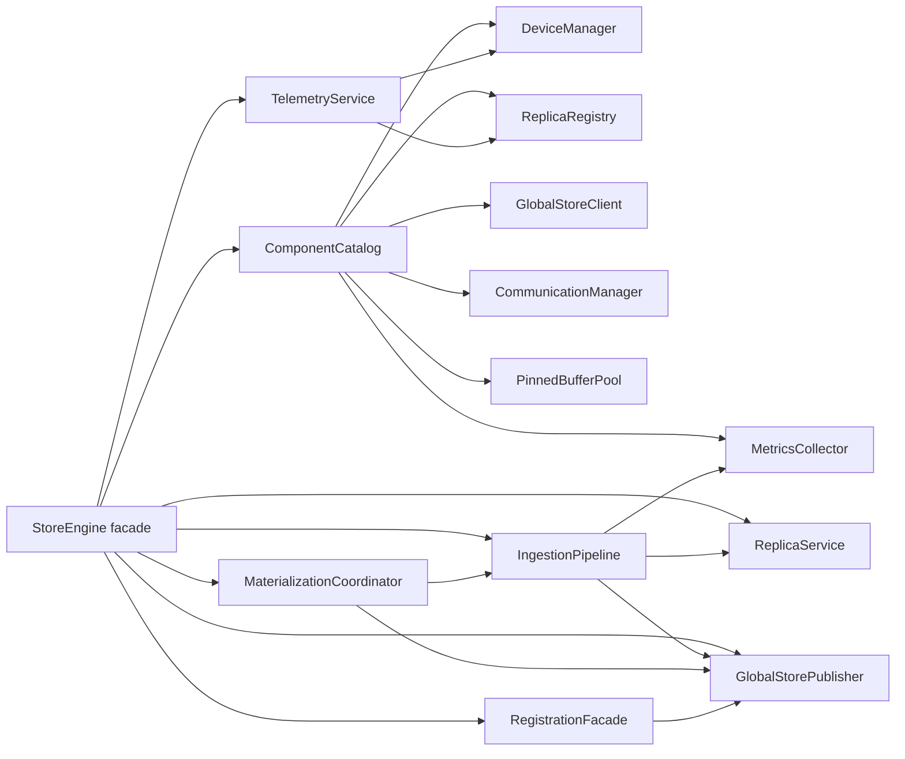

# Summary

`StoreEngine` currently owns device/bootstrap wiring, ingestion logic, Global Store publication, registration, metrics, and telemetry within a single class that exceeds 1.8K LOC. This design finishes the modularization line started in designs 0019/0024/0025 by turning StoreEngine into a facade that delegates to dedicated services backed by a shared ComponentCatalog. The split enables disk and P2P ingestion to share a staged pipeline, allows registration and telemetry to react to lifecycle events without duplicated boilerplate, and makes per-area testing feasible without spinning up the entire engine. Because TensorCast has not launched yet, we explicitly remove compatibility/legacy shims instead of preserving duplicated flows.

# Goals / Non-Goals

Goals
- Define concrete runtime components (catalog, ingestion pipeline, replica service, materialization coordinator, publisher, telemetry) with clear dependencies and ownership.
- Eliminate duplicated ingestion logic between disk and P2P paths by introducing shared pipeline stages with typed contexts.
- Trim the StoreEngine public API down to the minimal facade surface and update daemon/Python callers accordingly, deleting legacy entry points and adapters.
- Make metrics/Global Store/registration updates event-driven rather than "remember to call update_all_metrics".
- Provide scaffolding for future sources (inline buffer) and orchestrator behaviors without touching StoreEngine directly.

Non-Goals
- No new artifact formats, hashing schemes, or UMA semantics.
- Allowing Bazel targets, proto contracts, or Python bindings to evolve is within scope whenever it helps remove legacy code; such changes will be documented alongside this refactor rather than deferred.
- Not redesigning eviction or replica data structures beyond delegating to existing components.

# Legacy Removal Scope

TensorCast has not launched yet, so the facade split lands together with a full removal of the remaining compatibility/legacy flows. We delete them in the same change list as the new services to avoid carrying both paths.

### Deletion checklist
- Remove `StoreEngine::ingest_from_disk_internal` and `StoreEngine::ingest_from_p2p_internal` (declared in `core/store/store_engine.h`, implemented in `core/store/store_engine.cc`). Their logic moves wholesale into `IngestionPipeline` stages; the public `ingest_from_disk/p2p` methods forward to the pipeline and no longer expose the internal helpers or their tracing enums.
- Delete the P2P-only StoreEngine tests that exercise the internal helpers (`core/store/store_engine_p2p_loader_test.cc` and `core/store/store_engine_p2p_verification_fail_test.cc`). Equivalent coverage migrates to `core/store/materialization/runtime/pipeline/tests/*` so the pipeline stays the single ingestion surface.
- Drop the temporary loader registry bridge (`core/store/materialization/control/loader_registry_adapter.{h,cc}`) and its wiring in `materialization_service.cc`, `materialize_orchestrator.cc`, and `store_engine.cc`. Pipeline stages now ask the dataplane registries for loaders directly, so no adapter is required.
- Remove doc/help text that references the internal helpers (`docs/architecture/p2p-transfer-strategies.md`, `core/store/README.md`, and `docs/plans/0027-materialization-unification.md`) so the only documented ingestion path is via the facade + pipeline.

### Validation & test updates
- Port the remaining StoreEngine ingestion tests (`core/store/store_engine*_test.cc` and `core/store/materialization/contracts/materialization_request_test.cc`) to construct the pipeline + services via `ComponentCatalog`. The daemon- and Python-level contract tests keep using `StoreEngine`, but they no longer reference deleted helpers.
- Add new service-level suites under `core/store/materialization/runtime/pipeline/tests/` that cover disk, P2P, and inline-buffer scenarios, including verification failures and eviction retries. These suites replace the deleted StoreEngine tests and keep coverage close to the new implementation.

# Architecture & Interfaces

## Component overview

### ComponentCatalog
Central registry that owns initialization and shutdown for DeviceManager, ReplicaRegistry, MetricsCollector, CommunicationManager, PinnedBufferPool, and the optional Global Store client. Responsibilities:
- Validate StoreEngineOptions invariants (chunk alignment, pinned pool alignment, fake CUDA toggles).
- Provide typed getters plus `with_*` hooks so services can register callbacks (e.g., `on_worker_identity_changed`).
- Keep worker identity, node address, and ports in one location and propagate updates to both GlobalStoreClient and RegistrationFacade.

### ReplicaService
Encapsulates ReplicaRegistry interactions:
- `find_or_create_replica(const ReplicaConfig&)` (wraps the current `get_or_create_replica` and handles AlreadyExists races).
- `ensure_loaded_async(DeviceType)` plus eviction retry logic by calling `components::evict_for_gpu`/`evict_for_cpu`.
- `release_replica_memory`, `wait_replica_ready`, `list_replicas_by_device`, `resident_devices`, chunk state snapshots, and remote access enable/disable.
The service exposes observability hooks so TelemetryService and GlobalStorePublisher can subscribe to load/unload events.

### IngestionPipeline
Disk, P2P, and future InlineBuffer ingestion share a staged pipeline. Each stage consumes/produces a `IngestionContext` holding source metadata, resolved view plan, replica pointer, verification results, and timing info.
Stages:
1. **SourceAdapter** – normalizes `DiskSource`, `P2PSource`, etc., resolves canonical paths, and fetches canonical index JSON when hints request variants.
2. **MetadataStage** – extracts descriptor info, view hints, and decides safetensors/backfill requirements.
3. **AllocationStage** – requests replicas from ReplicaService, waits for state transitions, retries via eviction, and records pinned buffer waits.
4. **VerificationStage** – reuses loader verification helpers to compute hashes, reuse descriptor metadata, and write descriptor back for safetensors.
5. **HandleStage** – constructs `ReplicaHandle`, copies CUDA IPC handles, attaches view plan/hash, and emits metrics/tracing events.
Pipeline stages emit structured events consumed by TelemetryService; disk and P2P adapters only differ in SourceAdapter configuration (e.g., comm engine handle, fallback disk directory).

### MaterializationCoordinator
- Wraps `materialization::control::MaterializationService` and `MaterializeOrchestrator`.
- Holds prebuilt `MaterializationDeps` referencing IngestionPipeline, ReplicaService, and GlobalStorePublisher so `materialize_replica` no longer rebuilds lambdas per call.
- Propagates tracing context and metrics for AUTO vs. explicit loads.

### GlobalStorePublisher
- Owns all interactions with GlobalStoreClient: replica register/unregister, variant residency, key mapping CRUD, and canonical index lookups.
- Receives events from IngestionPipeline (successful load) and RegistrationFacade commits to publish metadata exactly once.
- Provides identity-aware helpers so services never touch worker/node identifiers directly.

### RegistrationFacade
- Wraps the renamed `components::RegistrationFacade` (formerly ArtifactRegistrationManager), wiring worker identity and Global Store callbacks automatically.
- Provides `begin_register_artifact`, `commit_registered_artifact`, `abort_registered_artifact`, `ingest_view_registration_chunk`, `keep_alive_registered_artifact`, and `get_view_registration_ingested_bytes` with consistent telemetry and TTL warnings.

### TelemetryService
- Consumes events from ReplicaService/IngestionPipeline to update MetricsCollector incrementally.
- Surfaces read-only queries (`get_all_replicas_info`, `get_available_memory`, chunk states, device memory usage) by delegating to ReplicaService and DeviceManager but enforces consistent snapshot semantics.

### Module placement & directory changes

| Service | Current sources to extract | Target home | Notes |
| --- | --- | --- | --- |
| ComponentCatalog | StoreEngine ctor/shutdown sequences, plus `core/store/components/{device_manager,replica_registry,metrics_collector,communication_manager,global_store_client}.cc` ownership wiring | `core/store/components/runtime/component_catalog.{h,cc}` (new `sc_cc_library`) | Catalog owns creation order, fake-CUDA checks, worker identity, and the shared `PinnedBufferPool` currently created in `store_engine.cc`. |
| ReplicaService | Replica management methods in `StoreEngine` (`get_resident_devices`, `list_device_replicas`, `wait_replica_ready`, etc.), `core/store/components/replica_registry.*`, `core/store/components/eviction_service.*`, `core/store/replica/memory_export_registry.*` | `core/store/components/runtime/replica_service.{h,cc}` | Encapsulates eviction retries, UMA coordination, and remote-access toggles. Telemetry subscribes to its events. |
| IngestionPipeline | `StoreEngine::ingest_from_disk_internal`, `StoreEngine::ingest_from_p2p_internal`, `core/store/materialization/planning/chunk_aware_strategy.*`, dataplane loaders/sources/verification helpers | `core/store/materialization/runtime/pipeline/*` (new Bazel target) | Stages reuse existing planning + dataplane code but live in one pipeline namespace shared by disk and P2P. |
| MaterializationCoordinator | `materialization/control/materialization_service.*`, `materialize_orchestrator.*`, `core/store/store_engine.cc` glue that rebuilds deps per call | Remains under `core/store/materialization/control/`, but the coordinator becomes a thin wrapper over prebuilt `MaterializationDeps` injected from the facade | `StoreEngine` ctor builds the coordinator once using services from the catalog. |
| GlobalStorePublisher | `StoreEngine::register_replica_with_global_store`, `unregister_replica_from_global_store`, key-mapping helpers, `core/store/components/global_store_client.*` | `core/store/components/runtime/global_store_publisher.{h,cc}` | Publisher is the only code touching worker identity and Global Store RPCs; all other services fire events. |
| RegistrationFacade | `core/store/components/registration/artifact_registration_manager.{h,cc}` plus the StoreEngine wrapper methods (`begin/commit/abort/keep_alive`) | Rename directory to `core/store/components/registration/registration_facade.{h,cc}` and expose a dedicated service header | Facade receives worker identity + Global Store hooks from the catalog; StoreEngine forwards the API unchanged. |
| TelemetryService | `StoreEngine` status/query helpers, `core/store/components/metrics_collector.*`, `core/store/components/device_manager.*` gauges | `core/store/components/runtime/telemetry_service.{h,cc}` | Service keeps snapshots thread-safe and unsubscribes from catalog events on shutdown. |

`core/store/BUILD` adds one `sc_cc_library` per service plus `component_catalog_lib`. Each new target is dependency-injected into `StoreEngine` so unit tests can construct services in isolation.

## Ingestion & materialization migration plan

### Stage-to-source mapping
1. **SourceAdapter** – Moves the source-normalization logic from `ingest_from_disk_internal()`/`ingest_from_p2p_internal()` (path expansion, request id tracing, remote sender metadata) into `pipeline/source_adapter.{h,cc}`. It composes the existing dataplane sources in `core/store/materialization/dataplane/sources/*` and retains the canonical-index fetch that currently happens in `store_engine.cc`.
2. **MetadataStage** – Reuses `core/store/materialization/dataplane/metadata/{canonical_index,disk_dir_hash,safetensors_util}.cc` and the view-planning helpers in `core/store/materialization/planning/chunk_aware_strategy.*`. The stage computes view plans and safetensors requirements once and stores them on the shared `IngestionContext`.
3. **AllocationStage** – Lifts the replica allocation code (calls to `replica_registry_`, `components::evict_for_gpu`, and `PinnedBufferPool` wait metrics) from both internal helpers into `ReplicaService::AllocateForIngestion`. This keeps all UMA interactions in one spot and lets both disk and P2P reuse the same eviction retry loop.
4. **VerificationStage** – Relies on `core/store/materialization/dataplane/verification/verification_utils.*` and replaces the bespoke verification branches inside `StoreEngine`. The stage publishes structured success/failure events so TelemetryService and GlobalStorePublisher can react without additional hooks.
5. **HandleStage** – Creates the `ReplicaHandle`, mirrors the CUDA IPC export performed in `store_engine.cc`, and emits metrics. It also owns the final event that triggers `GlobalStorePublisher` updates.

### MaterializationCoordinator integration
- The coordinator instantiates once inside `StoreEngine` using services pulled from the catalog (`ReplicaService`, `IngestionPipeline`, `GlobalStorePublisher`). It feeds those into `materialization::control::MaterializationService` and `MaterializeOrchestrator` so `materialize_replica()` no longer rebuilds lambdas per call.
- `MaterializationBackend` remains the thin interface required by `MaterializationService`, but its implementation moves from `StoreEngine` to the new coordinator facade. This allows daemon tests to exercise the backend without constructing the full engine.

### Test migration order
- First, port `core/store/materialization/control/materialization_service_test.cc` to inject the new pipeline + replica service fakes, ensuring AUTO mode still drives disk vs. P2P.
- Next, add targeted pipeline tests (disk happy path, P2P retry, verification failure, eviction exhaustion) under `core/store/materialization/runtime/pipeline/tests/`. These mirror the scenarios that were previously covered by `store_engine_p2p_loader_test.cc` and `store_engine_p2p_verification_fail_test.cc`.
- Finally, update the integration suites (`core/store/store_engine*_test.cc`, `core/store/components/registration/artifact_registration_manager_test.cc`) to construct services through `ComponentCatalog`. Once they pass, delete the legacy helpers and doc references listed in the deletion checklist.

### Documentation touchpoints
- Update `core/store/README.md` (ingestion flow diagrams) and `docs/architecture/p2p-transfer-strategies.md` to point to the new pipeline stages instead of `ingest_from_*_internal`. Include a short summary in `docs/plans/0027-materialization-unification.md` to keep the plan/design pair in sync.
- Record the module moves (new runtime services, renamed registration facade) in `docs/architecture/architecture-overview.md` so downstream contributors know where ownership lives after the refactor.

## Updated StoreEngine API flow

| Operation | Delegation |
| --- | --- |
| `materialize_replica` | MaterializationCoordinator |
| `ingest_from_disk/p2p` | IngestionPipeline via SourceAdapter |
| `register_replica_with_global_store` | GlobalStorePublisher |
| `begin/commit/abort registration` | RegistrationFacade |
| `get_resident_devices/list_device_replicas` | ReplicaService |
| Telemetry queries | TelemetryService |

StoreEngine keeps the same method signatures but now becomes a thin orchestration layer that wires these collaborators in its constructor and forwards calls.

# Schema Changes (if any)

None. All work is confined to in-memory services; persistent formats and proto contracts remain unchanged.

# Trade-offs & Risks

- **Additional indirection:** Introducing multiple services increases the number of files and classes. Mitigation: keep each service header focused, colocate with owning module (`core/store/components` vs. `materialization`) to maintain discoverability.
- **Event propagation correctness:** Moving metrics/GS updates to event listeners risks missing edge cases (e.g., failed loads). Mitigation: pipeline stages emit success/failure callbacks; unit tests cover disk, P2P, and view variants.
- **Initialization order:** ComponentCatalog must sequence device manager init before services request GPU info. We enforce this in catalog construction and add integration tests that simulate missing components.
- **Documentation drift:** Multiple services require consistent README/docs updates. Mitigation: update `core/store/README.md`, `docs/architecture/architecture-overview.md`, and module-specific docs within the implementation change.

# Compatibility & Acceptance Criteria

- Zero public API changes for StoreEngine consumers (daemon RPC handlers, Python bindings, tests).
- Existing tests under `core/store/store_engine*_test.cc`, `multi_gpu*_test.cc`, and registration/materialization suites continue to pass without modification other than dependency injection updates.
- Disk and P2P ingestion share >90% of logic through the pipeline; code duplication between the paths is removed.
- Metrics, Global Store registration, and telemetry happen automatically via events (no manual `update_all_metrics` calls remain in ingestion methods).
- Documentation updates land alongside the code change (core/store README, docs/architecture overview, and any referenced design docs).

# References

- `core/store/store_engine.h`, `core/store/store_engine.cc`
- `core/store/components/eviction_service.{h,cc}`
- Designs: [0019-store-engine-modularization](0019-store-engine-modularization.md), [0024-store-engine-registration-manager](0024-store-engine-registration-manager.md), [0025-store-engine-materialization-service](0025-store-engine-materialization-service.md), [0027-materialization-unification](0027-materialization-unification.md)
