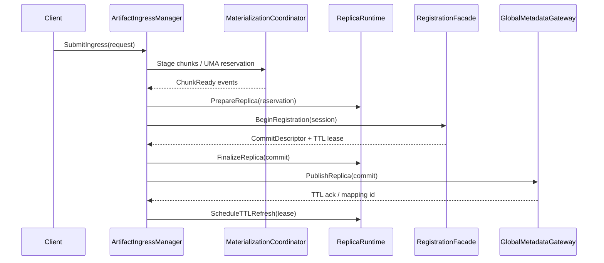
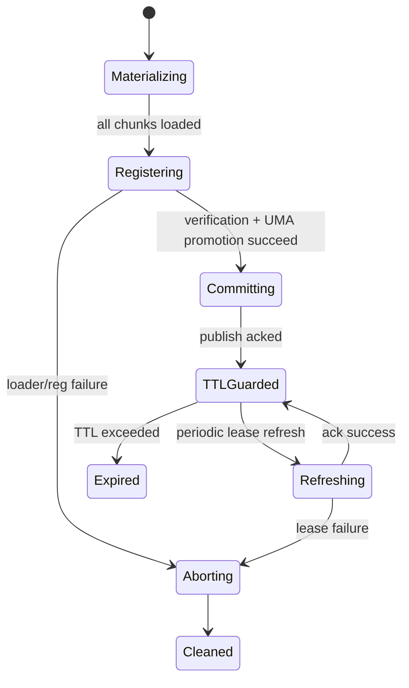
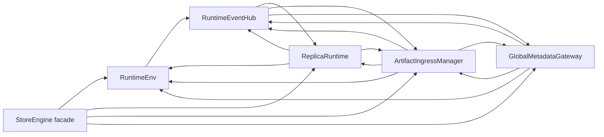

# Summary

`StoreEngine` still owns lifecycle wiring, ingestion orchestration, replica telemetry, registration, and Global Store updates inside a single translation unit. Earlier designs (0019/0024/0025/0028) carved out specific helpers, but the runtime remains a shallow façade that forwards to ad‑hoc services. This document proposes a deeper restructuring:

- introduce `RuntimeEnv` to own initialization/shutdown, worker identity, and dependency injection for all runtime services;
- merge replica lifecycle + telemetry into `ReplicaRuntime` so operational and observability concerns stay in one module;
- unify all data ingress (disk, P2P, in‑memory registration) inside `ArtifactIngressManager`, eliminating duplicated registrar/materialization glue;
- centralize Global Store/key-mapping/view metadata flows inside `GlobalMetadataGateway`;
- add a `RuntimeEventHub` for event-driven collaboration instead of manual cross-calls inside `StoreEngine`;
- keep `StoreEngine` as a thin shell that wires these modules and exposes the public API, while documentation and directory structure reflect the new layering.

# Background & Problem Statement

## Current state

- `core/store/store_engine.cc` (≈1.9 KLOC) still instantiates and coordinates every runtime subsystem directly (ComponentCatalog, ReplicaService, TelemetryService, GlobalStorePublisher, MaterializationCoordinator, IngestionPipeline, RegistrationFacade). The constructor (`core/store/store_engine.cc:42-124`) must understand ordering, error handling, and metrics bootstrapping.
- Telemetry depends on ReplicaService yet lives in a separate class, so functions like `get_resident_devices`, `get_available_memory`, and chunk-state queries bounce through `StoreEngine` even though they fetch from the same registry.
- Registration, ingestion, and Global Store publication are connected through imperative steps inside `StoreEngine`, which must remember to update metrics, publish replicas, and refresh TTLs in lockstep.
- Directory layout (`core/store/components/runtime/*`, `core/store/components/registration/*`, `core/store/materialization/*`) no longer matches the conceptual modules and forces consumers to know low-level wiring details.

## Resulting issues

- **Lifecycle coupling**: Worker identity updates (`store_engine.h:332-356`) and shutdown sequences must touch every component manually.
- **Shallow modules**: The components introduced by 0019/0028 remain thin—e.g., TelemetryService only forwards to ReplicaService—so understanding real behavior still requires reading `StoreEngine`.
- **Testing pain**: Any test that needs ingestion + registration + telemetry must spin up the entire engine because no single module owns the flow end-to-end.
- **Documentation drift**: `core/store/README.md` and architecture docs describe a modular runtime that the code does not actually embody; new contributors see seven namespaces for what is effectively one monolith.

# Goals / Non-Goals

## Goals

1. Establish runtime modules that encapsulate full areas of behavior (lifecycle, replica ops + telemetry, ingress, metadata), not just forwarding layers.
2. Create a directory layout that mirrors runtime boundaries without increasing depth (`core/store/runtime/*`, `core/store/registration/*`).
3. Support event-driven cooperation between modules so new flows (e.g., inline buffer ingress, new telemetry exporters) plug in without touching `StoreEngine`.
4. Deliver the final runtime architecture in one cut; compatibility shims and phased rollouts are explicitly out-of-scope because the service is still pre-production.
5. Preserve existing public APIs and semantics when they remain sensible while rebaselining observability metrics/log templates and updating their golden tests in the same change.
6. Enable targeted tests per module (ReplicaRuntime tests GPU eviction + telemetry; ArtifactIngressManager tests disk/P2P/registration paths).

## Non-goals

- No changes to wire formats, protobufs, UMA ledger structures, or Global Store RPC contracts.
- Eviction algorithms, loader pipelines, and materialization hints remain as currently defined; the proposal only rehouses them.
- Not covering daemon/Python CLI API redesign (handled by design 0014).

# Architecture & Interfaces

## Module overview

```
core/store/
├─ runtime/
│  ├─ runtime_env.{h,cc}
│  ├─ replica_runtime.{h,cc}
│  ├─ artifact_ingress_manager.{h,cc}
│  ├─ global_metadata_gateway.{h,cc}
│  ├─ runtime_event_hub.{h,cc}
│  └─ Bazel targets & tests
├─ registration/
│  └─ registration_facade.{h,cc} (moved from components/)
├─ materialization/
│  └─ ... (existing planners, pipelines, coordinator)
└─ store_engine.{h,cc}
```

## RuntimeEnv

- **Responsibilities**: validate `StoreEngineOptions`; own `ComponentCatalog`; expose accessors for `DeviceManager`, `ReplicaRegistry`, `MetricsCollector`, `PinnedBufferPool`, `CommunicationManager`, `ViewHashComputer`; manage worker identity propagation to catalog + Global Store client; orchestrate startup/shutdown order.
- **Public API**:
  - `static absl::StatusOr<std::shared_ptr<RuntimeEnv>> create(const StoreEngineOptions&, RuntimeEnv::Dependencies deps);`
  - `void update_worker_identity(const components::WorkerIdentity&);`
  - `void shutdown();`
  - Accessors for catalog-owned dependencies.
- **Deep logic**: owns error handling for device discovery, communication manager initialization, TLS/credential wiring for Global Store client so `StoreEngine` does not duplicate it.
- **Concurrency & lifetime contract**:
  - Accessors that return shared services (`DeviceManager`, `MetricsCollector`, `PinnedBufferPool`, etc.) hand out `std::shared_ptr<const T>` handles that stay valid until `RuntimeEnv::shutdown()` completes; callers must not store raw pointers.
  - Accessors that expose mutable catalog state (`ReplicaRegistry`, UMA allocators) instead return RAII guards that hold the underlying `ComponentCatalog` lock; callers cannot mutate shared state without the guard, eliminating undocumented locking disciplines.
  - `update_worker_identity` acquires an internal `absl::Mutex` (`identity_mu_`) to serialize identity transitions, updates the catalog, then synchronously notifies subscribers on the `RuntimeEventHub` so subscribers see a globally ordered worker identity.
  - `shutdown()` blocks until all registered modules deregister their event-hub callbacks and release catalog guards. The method waits for the hub to drain (no in-flight callbacks) before destroying dependencies, preventing dangling references on long-lived background threads.
  - Modules register shutdown hooks through `RuntimeEnv::register_shutdown_dependency(name, absl::AnyInvocable<void()>)`. Hooks execute in reverse order of registration under the lifecycle mutex, guaranteeing that consumers (ReplicaRuntime/ArtifactIngressManager) finish before providers (RuntimeEventHub/ComponentCatalog) go away.

## ReplicaRuntime

- Combines `ReplicaService` + `TelemetryService`.
- **Responsibilities**: create/lookup replicas, handle GPU/CPU eviction (`try_evict_memory_for_replica`), manage remote export registrations, serve telemetry queries (resident devices, chunk states, memory stats), and record ingestion events.
- **Interactions**: depends only on `RuntimeEnv` accessors. Publishes events (e.g., `ReplicaLoaded`, `ReplicaUnloaded`) to `RuntimeEventHub`.
- **Why deep**: includes concrete logic for waiting, unloading, state transitions, metric updates, and chunk-state snapshots—no longer just pass-through wrappers.

## ArtifactIngressManager

- Unifies MaterializationCoordinator, IngestionPipeline, and RegistrationFacade flows.
- **Responsibilities**:
  - Accept disk/P2P/materialize requests, select pipeline stages/hints, interact with ReplicaRuntime for allocation and eviction;
  - Orchestrate registration begin/commit/abort, manage TTL keep-alives, ingest view chunks, compute verification data via existing loader utilities;
  - Emit ingress events (success/failure) to EventHub for telemetry + GlobalMetadata updates.
- **Internal structure**:
  - Embeds the existing `materialization::control::MaterializationCoordinator` and `materialization::runtime::pipeline::IngestionPipeline`;
  - Holds a `registration::RegistrationFacade` instance configured via RuntimeEnv resources (device manager, replica registry, metrics, pinned pool, communication manager).
- **Outputs**: returns `loading::ReplicaHandle` objects and commit descriptors identical to today, keeping daemon/Python APIs intact.
- **Ingress pipeline stages**:
  1. **Intent resolution** – request metadata is normalized into a `RegistrationSession` (`struct RegistrationSession { absl::Time created_at; ReplicaDescriptor descriptor; UmaReservation reservation; metrics::IngressSpan span; }`). UMA reservations remain private to ArtifactIngressManager until the session transitions out of `kMaterializing`.
  2. **Materialization** – the embedded coordinator streams disk/P2P chunks and emits `MaterializationProgress` records. When a chunk is ready, the UMA reservation receives a staged buffer credited to `ReplicaRuntime` but still hidden from telemetry to avoid “double counting”.
  3. **Registration** – once all chunks land, the session hands off to `registration::RegistrationFacade` which patches replica metadata, computes digest verification, and allocates TTL leases via `GlobalMetadataGateway::lease_policy()`.
  4. **Commit/abort** – on success, ArtifactIngressManager atomically (a) exposes UMA allocations to `ReplicaRuntime`, (b) publishes `RegistrationCommitted`, and (c) schedules TTL refresh jobs; on error, staged allocations are dropped, `RegistrationAborted` is emitted, and the UMA reservation is freed.
  5. **TTL refresh** – each session stores the authoritative TTL cadence (`min(worker_identity.lease_ttl, descriptor.override_ttl)`), and a per-session task refreshes both ReplicaRuntime and GlobalMetadataGateway leases with a jittered 0.6 × TTL interval to avoid herd effects.

### Ingress pipeline sequence



### Registration session state machine



- **Failure handling**:
- **Materialization failures** trigger immediate UMA rollback and a `ReplicaRuntime::evict_if_reserved(session_id)` call so partially staged replicas never surface.
  - **Registration failures** keep UMA reservations intact until cleanup completes; ArtifactIngressManager emits `RegistrationAborted` with reason codes for telemetry and notifies GlobalMetadataGateway to retract any speculative key mappings.
  - **Publish/TTL failures** cause the session to park in `Refreshing` with exponential backoff. While parked, ReplicaRuntime keeps the replica in “pending TTL” state and refuses new exports to avoid clients reading soon-to-expire replicas.
  - **GlobalMetadataGateway outages** are isolated via a retry budget; once exhausted, ArtifactIngressManager aborts the session and asks ReplicaRuntime to drop telemetry for the orphaned replica to avoid duplicate commits.

## GlobalMetadataGateway

- Wraps current `GlobalStorePublisher` plus key-mapping helpers.
- **Responsibilities**: register/unregister replicas, resolve/upsert/revoke key mappings, fetch canonical indexes, compute/publish variant view updates, manage override clients for testing.
- **Identity flow**: subscribed to RuntimeEnv worker identity updates so it can refresh override endpoints in one place.
- **Event handling**: listens for ingress + eviction events to ensure Global Store reflects the runtime state without ad-hoc calls.

## RuntimeEventHub

- Lightweight observer hub that lets modules publish structured events without compile-time cycles.
- Events (initial list):
  - `ReplicaLoaded`, `ReplicaEvicted`, `ReplicaExportEnabled/Disabled`
  - `RegistrationCommitted`, `RegistrationAborted`
  - `IngressCompleted` (with success/failure metadata)
  - `KeyMappingChanged`
- Subscribers:
  - ReplicaRuntime subscribes to registration events to refresh telemetry;
  - GlobalMetadataGateway subscribes to ingress + eviction to publish/unpublish;
  - ArtifactIngressManager subscribes to key-mapping updates when a disk/P2P load references logical keys.
- Implementation: small dispatcher (vector of callbacks) living under `core/store/runtime/`. Thread-safety via absl::Mutex and `absl::AnyInvocable` to avoid template bloat.
- **Delivery semantics & ordering**:
  - `publish(event)` executes synchronously on the caller’s thread until every synchronous subscriber acknowledges; the function returns only after the callbacks finish so ArtifactIngressManager can guarantee replica publication precedes TTL refresh scheduling.
  - Each event carries `worker_instance_id` and `sequence_id`. The hub maintains a per-worker, per-event-type FIFO queue, ensuring subscribers observe events in the order emitted by the worker. Sequence ids reset on worker identity changes, so subscribers can detect missed events and trigger recovery.
  - Subscribers opt into `DispatchMode::kSync` (default) or `DispatchMode::kAsync`. Async subscribers use a bounded queue per worker and an executor from RuntimeEnv; backpressure is applied by blocking `publish` when a queue is full, preventing unbounded memory growth.
- **Failure & retry policy**:
  - Subscribers declare a `ReliabilityClass`: `kCritical` (ReplicaRuntime + GlobalMetadataGateway) or `kBestEffort` (metrics exporters). When a critical subscriber throws or returns a non-OK status, the hub automatically schedules a retry with exponential backoff (200 ms → 2 s) and keeps the event at the head of the queue until it succeeds, guaranteeing at-least-once delivery.
  - If a best-effort subscriber throws, the hub logs via `LOG(WARNING)` and drops the event to avoid deadlocks. A per-subscriber counter is exposed via metrics so observability pipelines can alert on repeated drops.
  - Backpressure metrics (queue depth, retry latency) flow into ReplicaRuntime telemetry, enabling integration tests to assert no starvation during stress.
- **Callback lifetime management**:
  - `subscribe()` returns a `SubscriptionToken` storing the callback and dispatch metadata. Tokens are tied to module lifetimes; destroying the token removes the callback atomically so no in-flight dispatch references freed objects.
  - `RuntimeEnv::shutdown()` first blocks new subscriptions, then waits for `RuntimeEventHub::drain()` to finish. Drain waits for asynchronous queues to empty and ensures no subscriber thread still references shared dependencies before proceeding with teardown.

## StoreEngine façade

- Fields: `std::shared_ptr<RuntimeEnv> env_; std::unique_ptr<ReplicaRuntime> replica_runtime_; std::unique_ptr<ArtifactIngressManager> ingress_manager_; std::unique_ptr<GlobalMetadataGateway> metadata_gateway_; std::unique_ptr<RuntimeEventHub> event_hub_;`
- Methods simply translate public API types to the corresponding module calls; they also expose aggregated status (e.g., `get_shared_comm_manager()` delegates to RuntimeEnv).
- Because modules are deep (lots of business logic), `StoreEngine` becomes truly thin without sacrificing readability or requiring callers to know submodule layout.

## Interaction diagram



## Interfaces & API Notes

- Public `StoreEngine` signatures remain identical (C++ ABI + Python bindings unaffected). Internally they now call a module method with the same name (e.g., `ReplicaRuntime::get_resident_devices`). Status codes/log text stay unchanged.
- Module APIs follow AGENTS.md guidelines (C++ namespaces derived from path, canonical UMA headers). Example namespace: `tensorcast::store::runtime`.
- Key struct definitions:
  - `struct RuntimeEnv::Dependencies { std::shared_ptr<components::IGlobalStoreClient> client_override; ... };`
  - `struct RuntimeEvent { enum class Type; absl::flat_hash_map<std::string, std::string> attrs; };`
- Telemetry queries now come from `ReplicaRuntime`, so `StoreEngine::get_available_memory` simply returns `replica_runtime_->get_available_memory()`.
- Registration commit path:
  1. `ArtifactIngressManager::commit_registered_artifact()` finalizes UMA allocations and emits `RegistrationCommitted`.
  2. Event hub notifies GlobalMetadataGateway to publish and ReplicaRuntime to refresh chunk telemetry.

## Naming Compliance

| Symbol | Kind | Compliance rationale |
| --- | --- | --- |
| `RuntimeEnv` | Class | PascalCase root of `tensorcast::store::runtime` per AGENTS.md |
| `ReplicaRuntime` | Class | PascalCase owner for replica lifecycle + telemetry |
| `ArtifactIngressManager` | Class | PascalCase ingress coordinator |
| `GlobalMetadataGateway` | Class | PascalCase metadata bridge between runtime and Global Store |
| `RuntimeEventHub` | Class | PascalCase event dispatcher |
| `RuntimeEnv::create` / `update_worker_identity` / `shutdown` / `register_shutdown_dependency` | Methods | snake_case lifecycle + DI helpers |
| `ReplicaRuntime::get_resident_devices` / `evict_if_reserved` | Methods | snake_case replica/telemetry APIs |
| `ArtifactIngressManager::commit_registered_artifact` | Method | snake_case ingress commit entry point |
| `GlobalMetadataGateway::lease_policy` | Method | snake_case TTL helper |
| `RuntimeEventHub::publish` / `subscribe` / `drain` | Methods | snake_case event entry points; align with AGENTS.md |

# Schema Changes

No new metadata tables, indexes, or contract updates are required. RuntimeEnv, ReplicaRuntime, ArtifactIngressManager, GlobalMetadataGateway, and RuntimeEventHub reorganize in-memory coordination only, so `schema.sql` remains unchanged and no migrations are proposed.

# Invariants & Observability

- Memory ownership, UMA chunk size, and `ReplicaHandle` semantics do not change. `ReplicaService` APIs remain but live inside ReplicaRuntime.
- Worker identity updates remain idempotent: RuntimeEnv writes to ComponentCatalog, notifies GlobalMetadataGateway, and all dependent modules read from RuntimeEnv.
- Observability is rebaselined intentionally: we lock in the new metrics/log templates by capturing golden artifacts (see below) rather than promising identity with the previous monolith.
- Doc sync rule: `core/store/README.md`, `docs/architecture/architecture-overview.md`, and `docs/internals/model-loading.md` will mention RuntimeEnv/ReplicaRuntime/ArtifactIngress/GlobalMetadata layout.

## Observability validation plan

- **Metric snapshot diffing** – extend `//core/store:store_engine_test` with a `--dump_metrics` flag that writes the aggregated `MetricsCollector` tree to `bazel-testlogs/.../metrics_golden.json`. CI compares the JSON (counter names, units, labels) against the checked-in baseline so the re-architecture cannot unintentionally rename metrics.
- **Log template verification** – add a log-capture sink in `ReplicaRuntime` tests that asserts key lifecycle templates (`"replica registered"`, `"ttl refreshed"`, etc.) still exist and include the same structured KV pairs. The sink outputs a templated text (without variable values) so diffs flag format changes while allowing different values.
- **Python API call-graph regression** – create `tests/python/runtime/test_call_graph.py` that imports the Python binding, issues a `tensorcast.get()` request, and records the C++ symbol sequence via the tracing shim. The test is executed with `uv run pytest tests/python/runtime/test_call_graph.py` and compared to a golden call graph to prove the daemon’s observability stack keeps seeing the same progression of stages.

# Trade-offs & Risks

## Trade-offs

- Accept slightly higher module count and event-hub complexity in exchange for deep modules with single ownership of lifecycle, telemetry, and ingress invariants.
- Rebaseline observability (metrics/log templates) once, intentionally breaking golden parity with the monolithic StoreEngine, to ensure the new layout has authoritative telemetry.

## Alternatives Considered

1. **Reuse 0028 (facade split) without new modules**  
   - Rejected: still yields shallow services that just forward to existing components; does not solve lifecycle coupling or telemetry/replica split.
2. **Introduce micro-modules per API** (e.g., `MaterializationModule`, `RegistrationModule`)  
   - Rejected: increases file count with thin wrappers, violates request to avoid shallow modules, and makes reasoning harder.
3. **Move everything into Bazel packages only** (no code change)  
   - Rejected: directory moves alone do not deliver lifecycle unification or event-driven updates.

## Risks & Mitigations

| Risk | Impact | Mitigation |
|------|--------|------------|
| Misordered shutdown or worker identity updates in RuntimeEnv | dangling pointers or stale metadata | Centralize ordering, add regression tests covering identity injection and shutdown |
| Event hub introduces deadlocks if callbacks re-enter publishers | runtime stalls | Keep hub callbacks lightweight, document thread ownership, use async dispatch where necessary |
| Bazel/Include churn | build breaks downstream | Execute a single mechanical rename (scripts/tools/refactor_runtime_layout.py) that updates includes + Bazel deps atomically, then gate the change on `bazel query 'kind(cc_library, //core/store/... )'` + `bazel test //core/store:all` so no partial state lands |
| Telemetry merge changes metrics semantics | dashboards regress | Snapshot current metrics before merge, add verification tests on metrics collector outputs |

# Testing & Validation

- **RuntimeEnv tests**: device-manager init failure, worker identity propagation, override client injection.
- **ReplicaRuntime tests**: GPU eviction triggers, chunk-state snapshots, telemetry-consistency when multiple devices load in parallel.
- **ArtifactIngressManager tests**: disk and P2P ingestion success/failure, registration commit/abort, TTL keep-alive enforcement.
- **GlobalMetadataGateway tests**: register/unregister flows, key mapping TTL-handling, view alias logic.
- **Integration smoke**: existing daemon integration tests run against the refactored StoreEngine; no behavior drift allowed.
- **RuntimeEventHub tests**: synthetic event storms verifying per-worker ordering, synchronous delivery before TTL refresh, retry-with-backoff after injected subscriber exceptions, and queue backpressure behavior under stalled subscribers.
- **Cross-module failure drills**: simulate “ingress success but metadata publish fails” by forcing GlobalMetadataGateway to reject publishes and ensuring ArtifactIngressManager rolls back UMA + telemetry without leaking TTL keep-alives. Repeat for worker-identity rotation while registrations are active to prove subscriptions are re-bound without losing events.
- **Shutdown ordering tests**: orchestrated tests that start long-running ingress operations, issue `RuntimeEnv::shutdown()`, and assert the event hub drains, ReplicaRuntime rejects new exports, and the metadata gateway flushes outstanding publishes before returning.

# Compatibility & Acceptance Criteria

- `StoreEngine` public APIs and status semantics remain stable: daemon bindings and Python clients cannot observe signature or error-code changes; tests covering `tensorcast.get()` and daemon integration stay green.
- Compatibility with telemetry/metrics is guaranteed via the golden JSON + log template tests described earlier; acceptance requires updating goldens intentionally with sign-off from observability owners.
- Because no persistent schema changes occur, `schema.sql` remains untouched and Global Store consumers keep their existing RPC contracts.
- Module-level unit tests plus `bazel test //core/store:store_engine_test` and `uv run pytest tests/python/runtime/test_call_graph.py` serve as acceptance gates; re-architecture is done only when these suites pass with the new layout.
- Documentation sync (core/store/README.md, docs/architecture, docs/internals) is mandatory before marking the design accepted, satisfying the AGENTS.md doc-sync rule.

# Rollout & Documentation

- Single-cut rollout: RuntimeEnv, ReplicaRuntime, ArtifactIngressManager, GlobalMetadataGateway, and RuntimeEventHub land in the same change set that deletes the legacy wiring. No compatibility shim or staggered deployment is maintained because TensorCast has not shipped yet.
- `docs/plans/0029-store-runtime-rearchitecture.md` now tracks implementation tasks (code moves, new tests, observability snapshots) instead of rollout phases. Each task references the relevant module docs so reviewers can verify doc-sync requirements inline.
- Immediately update `core/store/README.md`, `docs/architecture/architecture-overview.md`, `docs/internals/model-loading.md`, and `docs/internals/save_dict_flow.md` in the same change to reflect the final runtime layering. The doc updates include the new ingress sequence + state diagrams so downstream contributors have a canonical reference once the cutover merges.
- Notify daemon/Python owners through the shared design channel with a “final state” migration note that links to the updated StoreEngine header. Because there is no compatibility window, the note doubles as the single source of truth for new API locations.

# References

- `docs/designs/0019-store-engine-modularization.md`
- `docs/designs/0024-store-engine-registration-manager.md`
- `docs/designs/0025-store-engine-materialization-service.md`
- `docs/designs/0028-store-engine-facade-refactor.md`
- `core/store/store_engine.cc`, `core/store/components/runtime/*`, `core/store/components/registration/*`
