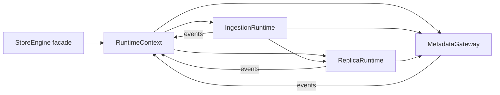
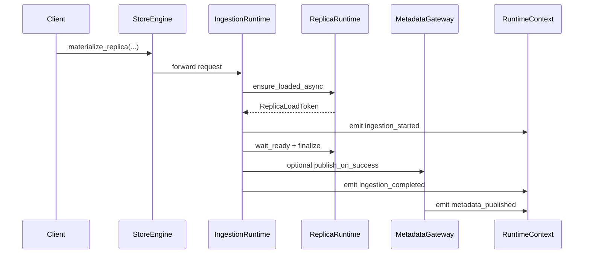

# Summary

`StoreEngine` still exposes more than a dozen runtime collaborators (ArtifactIngressManager, MaterializationCoordinator, MaterializationService, RegistrationFacade, GlobalMetadataGateway, RuntimeEventHub, etc.) that reference each other as peers. The current layering (`core/store/docs/architecture.md`) shows cyclic dependencies among ArtifactIngressManager, RuntimeEventHub, GlobalMetadataGateway, and ReplicaRuntime, which prevents incremental testing and forces every change to materialization or metadata publishing to touch multiple singleton services.

This design consolidates the runtime into three top-level services — **ReplicaRuntime**, **IngestionRuntime**, and **MetadataGateway** — all backed by a lightweight **RuntimeContext** that embeds the event system. The consolidation removes redundant abstractions (e.g., ArtifactIngressManager vs. MaterializationCoordinator vs. MaterializationService) and merges metadata/registration code paths, turning the dependency graph into a straightforward tree:

```
StoreEngine facade
  ├─ RuntimeContext (ComponentCatalog + Event dispatch)
  ├─ ReplicaRuntime  (state/control plane for replicas)
  ├─ IngestionRuntime (disk/P2P/materialize/inline)
  └─ MetadataGateway  (registration + Global Store RPCs)
```

By eliminating extra layers, the runtime regains the “single owner per behavior” invariant, cyclic dependencies disappear, and documentation/test entry points become easier to reason about.

# Goals / Non-Goals

## Goals

- Replace the ArtifactIngressManager/MaterializationCoordinator/MaterializationService trio with `IngestionRuntime`, a single API surface that orchestrates pipelines, planners, and data-plane callbacks.
- Merge RegistrationFacade and GlobalMetadataGateway responsibilities so metadata publication, CUDA IPC export, TTL refresh, and Global Store RPCs are exposed through one `MetadataGateway`.
- Embed the event bus inside `RuntimeContext` so ReplicaRuntime, IngestionRuntime, and MetadataGateway exchange structured events without referencing each other directly.
- Refactor the directory structure so each runtime lives under `core/store/runtime/<area>/`, reducing the number of top-level concepts explained in `core/store/docs/architecture.md`.

## Non-Goals

- No changes to UMA semantics, communicator transports, or data-plane loader behavior; those remain governed by their existing designs.
- No redefinition of StoreEngine’s public facade API—the goal is to rewire internals while keeping client-facing headers stable.
- No schema or protocol changes for the Global Store component; MetadataGateway reuses existing RPC messages.

# Architecture & Interfaces

## Component Overview



### RuntimeContext

`RuntimeContext` replaces the ad-hoc `ComponentCatalog + RuntimeEventHub` pairing. It owns:

- Initialization/shutdown order for DeviceManager, ReplicaRegistry, MetricsCollector, CommunicationManager, PinnedBufferPool, GlobalStoreClient, ViewHashComputer.
- The event dispatcher, implemented via `folly::MPMCQueue<RuntimeEvent>` (Bazel target `@folly//folly:mpmc_queue`, implementation under `external/folly+/folly/synchronization/MPMCQueue.h` in the Bazel sandbox), with subscription handles injected into runtimes at construction.
- Worker identity propagation to Global Store, communicator endpoints, and MetadataGateway.

Files move to `core/store/runtime/context/`:

- `component_catalog.{h,cc}` (renamed to `runtime_context_catalog.*`).
- `runtime_event_hub.{h,cc}` (folded into `runtime_context_events.*`).

### ReplicaRuntime

Responsibilities stay focused on replica lifecycle (find/create, load readiness, eviction retries, UMA telemetry, remote access toggles). The service emits “replica_loaded”, “replica_evicted”, “remote_access_toggled” events through its injected publisher but no longer subscribes directly to ArtifactIngressManager or MetadataGateway.

Key interfaces (existing names retained unless noted):

- `ReplicaRuntime::get_or_create_replica(const ReplicaLocator&) -> ReplicaHandle`
- `ReplicaRuntime::ensure_loaded_async(const loading::Location&) -> ReplicaLoadToken`
- `ReplicaRuntime::wait_ready(ReplicaHandle)`
- `ReplicaRuntime::toggle_remote_access(ReplicaId, RemoteAccessMode)`

### IngestionRuntime

New façade that replaces ArtifactIngressManager + MaterializationCoordinator + MaterializationService. It exposes StoreEngine’s ingestion APIs (`materialize_replica`, `ingest_from_disk`, `ingest_from_p2p`, `register_inline_buffer`) and internally composes:

- Stage-based pipeline (disk, P2P, inline buffer share adapters).
- Materialization planner heuristics (AUTO vs. explicit modes).
- UMA allocation and TransferService bindings.
- Structured event emission (“ingestion_started”, “ingestion_completed”, “ingestion_failed”) for observability and MetadataGateway notifications.

It depends on ReplicaRuntime (for allocation/load) and MetadataGateway (for optional publish-on-success) via interfaces, avoiding RuntimeEventHub’s circular references. Tests and profiling tools access the same façade through the `IngestionRuntimeDependencies` bundle, which carries injectable pipeline/coordinator factories, optional `IngestionEventSink` overrides, and structured test hooks so they can observe request metadata or short-circuit replicas without modifying production configuration.

Each ingestion request carries a `publish_context_id` minted by RuntimeContext; IngestionRuntime forwards that identifier to any synchronous `MetadataGateway::publish_on_success(...)` call and includes it in the emitted `ingestion_completed` event so MetadataGateway can deduplicate explicit and auto-publish flows.

### MetadataGateway

Combines the current GlobalMetadataGateway and RegistrationFacade into a single service. Responsibilities:

- Register, update, keep-alive, and revoke artifact exports (including CUDA IPC metadata).
- Publish ingestion outcomes and variant residency to the Global Store.
- Emit TTL/verification metrics through RuntimeContext events.

MetadataGateway subscribes to `ingestion_completed` events to perform auto-registration when requested but exposes synchronous APIs for explicit registration flows.

When MetadataGateway receives an event and finds a matching `publish_context_id` that was already published synchronously, it performs a lightweight TTL refresh instead of issuing a second publish RPC. If the event arrives first, the explicit call observes the same context and becomes a no-op. This guarantees “exactly-once” Global Store effects even when callers mix synchronous and auto-publish modes.

### Naming Compliance

| Symbol | Kind | Compliance proof |
| --- | --- | --- |
| `RuntimeContext` | class | Upper Camel/Pascal case per C++ guideline. |
| `ReplicaRuntime::get_or_create_replica` | method | `snake_case` verb phrase. |
| `ReplicaRuntime::wait_ready` | method | `snake_case`. |
| `IngestionRuntime::materialize_replica` | method | `snake_case` and consistent with current facade. |
| `MetadataGateway::publish_ingestion_event` | method | `snake_case`. |
| `REMOTE_ACCESS_TOGGLE_LOG` (existing constant) | macro/constant | ALL_CAPS (no rename needed). |

### File & Directory Layout

The runtime root becomes:

```
core/store/runtime/
  context/
    runtime_context.h
    runtime_context.cc
    runtime_context_events.h
  replica/
    replica_runtime.h
    replica_runtime.cc
    replica_load_controller.h
  ingestion/
    ingestion_runtime.h
    ingestion_runtime.cc
    pipeline/
      stages/*
      loaders/*
  metadata/
    metadata_gateway.h
    metadata_gateway.cc
    registration_helpers/*
```

Data-plane loaders and TransferService stay under `core/store/materialization/dataplane/` but their integration points move into `ingestion_runtime.cc`.

### Event Flow



The event bus lives entirely inside RuntimeContext (`RC`), so none of the runtimes keep direct references to each other beyond the explicit method calls shown. Direct synchronous calls (IR→RR, IR→MG) remain allowed for request-scoped orchestration, while cross-cutting notifications and observability hop through events only; this prevents new cyclic ownership while still letting StoreEngine satisfy synchronous contract points.

### Runtime Events & Dispatch Semantics

RuntimeContext exposes a multi-producer queue (backed by `folly::MPMCQueue`) that accepts structured events from every runtime. Events are fanned out to per-subscriber queues that execute handlers on a dedicated worker, guaranteeing in-order delivery per event type. If a handler returns failure, RuntimeContext logs the error, increments the `tc_runtime_event_handler_errors_total` metric, and retries with exponential backoff so producers never need to re-send manually.

| Event | Payload Fields | Producer | Consumers | Handling Logic |
| --- | --- | --- | --- | --- |
| `replica_loaded` | `replica_id`, `variant_id`, load latency stats | ReplicaRuntime after UMA admits the replica | MetadataGateway (observability), IngestionRuntime (pipeline scheduling) | MetadataGateway records the replica residency and emits TTL hints; IngestionRuntime uses the signal to unblock dependent ingestion stages. |
| `replica_evicted` | `replica_id`, eviction_reason | ReplicaRuntime when UMA evicts | MetadataGateway | MetadataGateway revokes CUDA IPC exports and updates Global Store residency to evicted. |
| `remote_access_toggled` | `replica_id`, `mode` | ReplicaRuntime when remote access flips | IngestionRuntime, MetadataGateway | IngestionRuntime may replan inflight materializations; MetadataGateway publishes the remote access mode to Global Store. |
| `ingestion_started` | `request_id`, `artifact_id`, ingest_mode | IngestionRuntime before the pipeline runs | MetadataGateway, ReplicaRuntime (for telemetry) | MetadataGateway marks the artifact as “in-progress”; ReplicaRuntime increments UMA telemetry counters. |
| `ingestion_completed` | `request_id`, `artifact_id`, success flag, output replicas, `publish_context_id` | IngestionRuntime at successful completion | MetadataGateway (primary), ReplicaRuntime | MetadataGateway performs auto-registration using the `publish_context_id` (shared with explicit publish calls) so duplicate publications collapse; ReplicaRuntime updates its residency metrics. |
| `ingestion_failed` | `request_id`, `artifact_id`, failure status | IngestionRuntime on terminal errors | MetadataGateway, ReplicaRuntime | MetadataGateway records the failure for eventual consistency reporting; ReplicaRuntime schedules retries based on policy. |
| `metadata_published` | `artifact_id`, `variant_id`, publish target, `publish_context_id` | MetadataGateway after a Global Store RPC succeeds | ReplicaRuntime, IngestionRuntime | ReplicaRuntime records that replicas are globally visible; IngestionRuntime advances planner heuristics for future ingestions. |

Because all runtimes publish through the same dispatcher, RuntimeContext enforces backpressure by pausing publishers once the shared queue exceeds a configurable watermark. This keeps ingestion hot paths bounded while guaranteeing every consumer observes the events listed above exactly once in publish order.

# Schema Changes

None.

# Trade-offs & Risks

- **Migration risk**: Collapsing multiple services into fewer runtimes requires careful test coverage to ensure disk and P2P pipelines still execute the same stages. Mitigation: re-use existing pipeline tests (`core/store/materialization/runtime/pipeline/tests/*`) while gradually switching their fixture wiring to `IngestionRuntime`.
- **Documentation churn**: `core/store/docs/architecture.md` and module READMEs must be updated simultaneously to avoid stale terminology. Mitigation: doc sync rule enforced; this design provides the target diagrams so updates are mechanical.
- **Blast radius during transition**: Until all callers switch to the new runtimes, we may need temporary adapters. Mitigation: land RuntimeContext first, then introduce new runtimes behind feature flags, finally delete ArtifactIngressManager and friends.

# Compatibility & Acceptance Criteria

- StoreEngine’s public API signatures remain unchanged; unit and integration tests that only see the facade should require no changes.
- Replica lifecycle metrics (`tc_store_evictions_total`, `tc_ingest_seconds`, etc.) remain stable; we will compare Prometheus output before/after the refactor.
- Event ordering guarantees are preserved: `ingestion_completed` is published exactly once per request, and MetadataGateway only publishes metadata after a successful ingestion event.
- Files/directories reflect the new layout, and outdated services (ArtifactIngressManager, MaterializationCoordinator, MaterializationService, GlobalMetadataGateway, RegistrationFacade) no longer appear in the runtime root after the migration series.

# References

- `core/store/docs/architecture.md` (current topology and cyclic dependency graph).
- `docs/designs/0028-store-engine-facade-refactor.md` (original facade/service split).
- `docs/designs/0029-store-runtime-rearchitecture.md` (RuntimeEnv and ComponentCatalog layering).
- `docs/architecture/p2p-transfer-strategies.md` (loader context referenced by IngestionRuntime).
- `docs/internals/model-loading.md` (pipeline stages reused in the consolidated runtime).
