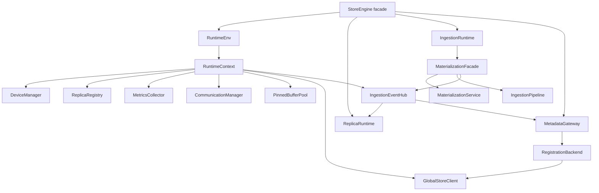

# Summary

Store runtime responsibilities were previously tracked across eight incremental designs (0024–0032). The codebase now reflects the fully merged architecture: `StoreEngine` is a thin facade over a `RuntimeEnv` that wires a durable runtime context, a dedicated `ReplicaRuntime`, a consolidated `IngestionRuntime` backed by a `MaterializationFacade`, and a `MetadataGateway` with an event-driven registration backend. Materialization control/data-plane code lives exclusively under `core/store/materialization/**`, all registration logic is centralized inside `runtime/metadata`, and ingestion completion flows through a typed `IngestionEventHub` instead of ad-hoc callbacks. This document captures that final state so the prior stepwise documents can be deleted without losing intent.

# Goals / Non-Goals

## Goals

- Capture the final StoreEngine runtime boundaries (RuntimeEnv/Context, ReplicaRuntime, IngestionRuntime, MetadataGateway) and the contracts between them.
- Describe how materialization orchestration (requests, validation, service execution, pipeline ingestion) and registration (pending contexts, TTL, Global Store publication) relate to the runtime services today.
- Document the event-driven ingestion hub and how observability and dedupe rely on it.
- Provide the acceptance surface (tests, metrics, documentation) that guard this architecture going forward.

## Non-Goals

- Re-open compatibility shims or legacy loader hierarchies; the code already deleted `core/store/loading/**` and `core/store/loader/**`.
- Change daemon or Python RPC schemas, UMA semantics, or communicator transports—this design only codifies how the existing implementation behaves.
- Introduce alternative runtime plans; implementations of new experiments should add new designs/plans referencing this document.

# Architecture & Interfaces

## StoreEngine facade & RuntimeEnv

`StoreEngine` (`core/store/store_engine.{h,cc}`) now contains almost no business logic. Construction wires:

- `RuntimeEnv` (`core/store/runtime/runtime_env.{h,cc}`) which owns lifecycle of a `RuntimeContext` built from `StoreEngineOptions`.
- `RuntimeContext` (`core/store/runtime/context/runtime_context.{h,cc}`) which initializes device/replica registries, metrics, communicator, pinned memory, Global Store clients, the canonical `ViewHashComputer`, and in-process event infrastructure.
- `ReplicaRuntime`, `IngestionRuntime`, and `metadata::MetadataGateway` (described below), each scoped to a single responsibility. Public StoreEngine APIs simply forward to the owning runtime.

Worker identity updates flow through `RuntimeEnv::update_worker_identity`, which pushes the struct into the context so all downstream subscribers (Global Store client, MetadataGateway, communicator) observe the same data. `RuntimeContext::drain_events()` is called from `RuntimeEnv::shutdown()` to guarantee event callbacks finish before dependencies are torn down.

## ReplicaRuntime (lifecycle + telemetry)

`ReplicaRuntime` (`core/store/runtime/replica/replica_runtime.{h,cc}`) consolidates replica lifecycle management, telemetry, and event emission:

- Registry ownership: all replica lookups, creation (`get_or_create_replica`), eviction, and remote-access toggles live here. StoreEngine queries such as `get_available_memory`, `list_device_replicas`, `enable_remote_replica_access`, and telemetry helpers forward directly to ReplicaRuntime.
- Observability: `ReplicaRuntime::record_ingestion_result` subscribes to `IngestionEventHub::subscribe_completed`, updating chunk state, metrics, and structured events whenever ingestion completes. The runtime still exposes synchronous helpers (`wait_replica_ready`, `get_replica_gpu_ptr`, etc.) to the StoreEngine facade and daemon bindings.
- Metrics: `metrics_collector().update_all_metrics` is called centrally so the doc-sync requirement (core/store/README.md, docs/architecture/architecture-overview.md) matches the actual update point.

## Materialization orchestration (IngestionRuntime + MaterializationFacade)

`IngestionRuntime` (`core/store/runtime/ingestion/ingestion_runtime.{h,cc}`) is the StoreEngine entry point for `materialize_replica`, disk ingest, and P2P ingest. It wraps:

- `MaterializationFacade` (`core/store/runtime/ingestion/materialization_facade.{h,cc}`) which unifies orchestration for disk, P2P, and AUTO flows. The facade constructs request metadata (request id, publish context id minted via `RuntimeContext::mint_publish_context_id`), publishes `IngestionStartedEvent`/`IngestionCompletedEvent` via `IngestionEventHub`, and records publish-context dedupe per replica.
- `MaterializationService` (`core/store/runtime/ingestion/materialization_service.{h,cc}`) which encapsulates the logic formerly embedded in `StoreEngine::materialize_replica`: request validation via `loading::MaterializationRequest::Create`, replica reuse, COPY_ONLY / LOAD_ONLY flows, fallback AUTO strategies, and View hashing. Dependencies are injected through `MaterializationDeps` (replica registry, pinned pool, artifact chunk size, pinned-memory timeout, optional `run_auto` callback), making the service unit-testable (`materialization_service_test.cc`).
- The canonical pipeline (`core/store/materialization/runtime/pipeline/ingestion_pipeline.{h,cc}`) and planners live entirely under `core/store/materialization/**`, and the facade owns the only runtime reference. There are no longer duplicate control/data-plane directories.

Materialization hooks (`MaterializationHooks` struct) provide injection points for tests (override pipeline factory, mutate completion events, or short-circuit results) without modifying runtime wiring.

## MetadataGateway & RegistrationBackend

`MetadataGateway` (`core/store/runtime/metadata/metadata_gateway.{h,cc}`) is the single owner of metadata publication, replica registration, and registration RPCs:

- It subscribes to ingestion completion events to register replicas automatically when `publish_to_global_store` is set, reusing publish-context IDs to avoid duplicate Global Store updates.
- It exposes the public StoreEngine registration API (`begin_registration`, `commit_registration`, `ingest_view_registration_chunk`, TTL `keep_alive`, bytes ingested query) by delegating to `RegistrationBackend`.
- When a replica must be published immediately (e.g., client-specified canonical IDs), `register_replica` uses the `ReplicaRuntime` to compute size and the `ReplicaRegistrationHelper` to call the connected `IGlobalStoreClient`. TTL + dedupe state is stored in `publish_contexts_` guarded by a mutex.

`RegistrationBackend` (`core/store/runtime/metadata/registration_backend.{h,cc}`) plays the role previously called the Artifact Registration Manager:

- Maintains `PendingRegistrationContext` objects inside an `absl::flat_hash_map`, with TTL enforcement, `keep_alive`, and chunk ingestion tracked under a mutex.
- Allocates UMA memory via the provided `ReplicaFactory`, records ingestion progress, and emits metrics via `components::MetricsCollector::record_registration_pending` and `record_registration_commit`.
- Commits compute canonical hashes, updates registries, and publish through a `RegistrationPublisher` interface (backed by `GlobalStoreRegistrationPublisher`).

All registration flows now live within `core/store/runtime/metadata/**`, so daemon RPCs simply forward to MetadataGateway.

## IngestionEventHub (event-driven ingestion + observability)

`RuntimeContext` constructs an `ingestion::IngestionEventHub` (`core/store/runtime/ingestion/ingestion_event_hub.{h,cc}`) on top of `RuntimeContextEvents`. The hub provides typed publishers/subscribers for `IngestionStartedEvent` and `IngestionCompletedEvent` defined in `core/store/runtime/ingestion_events.h`.

- Publishers: `MaterializationFacade` and any future ingestion sources emit started/completed events. Completion events carry `ReplicaKey`, transfer stats, and publish-context metadata.
- Subscribers: `ReplicaRuntime` updates registry + metrics, `MetadataGateway` performs registration, and observability hooks (metrics/tracing) consume both event types. All callbacks are lightweight and drain before shutdown via `RuntimeEnv::shutdown()`.
- There are no longer synchronous calls between the pipeline and metadata/replica modules; the event hub is the single coordination mechanism, satisfying the documentation claim that ingestion is event-driven.

## Naming Compliance

| Symbol | Kind | Compliance rationale |
| --- | --- | --- |
| `RuntimeEnv`, `RuntimeContext`, `ReplicaRuntime`, `IngestionRuntime`, `MetadataGateway`, `MaterializationFacade`, `MaterializationService`, `RegistrationBackend`, `IngestionEventHub` | Classes | PascalCase per AGENTS.md |
| `materialize_replica`, `ingest_from_disk`, `register_replica`, `publish_completed`, `record_ingestion_result`, `begin_registration`, `commit_registration`, `keep_alive_registration` | Methods | snake_case per C++ guidance |
| `kPublishContextTtl`, `kMaxPublishContextRecords` | Constants | ALL_CAPS naming enforced inside `metadata_gateway.cc` |

# Schema Changes

None. All modules operate on in-memory runtime state; `schema.sql` and RPC payloads remain untouched.

# Trade-offs & Risks

- **Event hub coupling**: ReplicaRuntime and MetadataGateway now depend on event ordering. Mitigation: runtime drains events on shutdown, and callbacks are short + synchronous to avoid queue buildup (validated by `ingestion_event_hub_test.cc`).
- **Publish-context dedupe accuracy**: Incorrect bookkeeping could drop real updates. Mitigation: publish context state is keyed by `ReplicaKey` + context id and cleaned up via TTL sweeps; `metadata_gateway_test.cc` exercises duplicates and TTL expiry.
- **Service sprawl**: More modules mean more constructor wiring. Mitigation: `RuntimeEnv` and `RuntimeContext` centralize initialization; test seams exist via hook structs and override setters.
- **Observability drift**: Splitting responsibilities risks stale docs. Mitigation: `core/store/README.md`, `core/store/docs/architecture.md`, and `docs/internals/model-loading.md` already reference these modules, and this document replaces the superseded designs.

# Compatibility & Acceptance Criteria

- StoreEngine public APIs and daemon/Python bindings stay unchanged; existing Python suites continue to target the same symbols.
- Tests gating this architecture:
  - `bazel test //core/store:store_engine_test //core/store:store_engine_view_test`
  - `bazel test //core/store/runtime/...` (covers context, ingestion runtime/facade/service, metadata gateway, replica runtime)
  - `bazel test //daemon:grpc_service_impl_registration_test --define=use_fake_cuda=true`
  - `uv run pytest tests/python/test_store_session_api.py -k "(register or materialize)"` plus `uv run pytest tests/python/test_store_region_registration.py`
- Metrics `tc_register_pending_gauge`, `tc_register_commit_seconds`, and ingestion telemetry counters continue to emit via `MetricsCollector` and event subscribers; goldens live under `core/store/runtime/runtime_services_test.cc`.
- Documentation for module owners stays in sync: modifying runtime/materialization code requires updating `core/store/README.md`, `core/store/docs/architecture.md`, and this design (doc-sync rule).

# References

- `core/store/store_engine.{h,cc}`
- `core/store/runtime/runtime_env.{h,cc}`, `runtime/context/runtime_context.{h,cc}`
- `core/store/runtime/replica/replica_runtime.{h,cc}`
- `core/store/runtime/ingestion/{ingestion_runtime,materialization_facade,materialization_service,ingestion_event_hub}.h`
- `core/store/runtime/metadata/{metadata_gateway,registration_backend}.h`
- `core/store/materialization/{contracts,control,dataplane,runtime}/**`
- `docs/architecture/architecture-overview.md`, `core/store/README.md`
