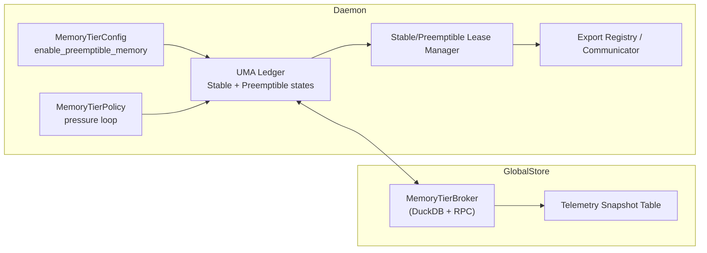
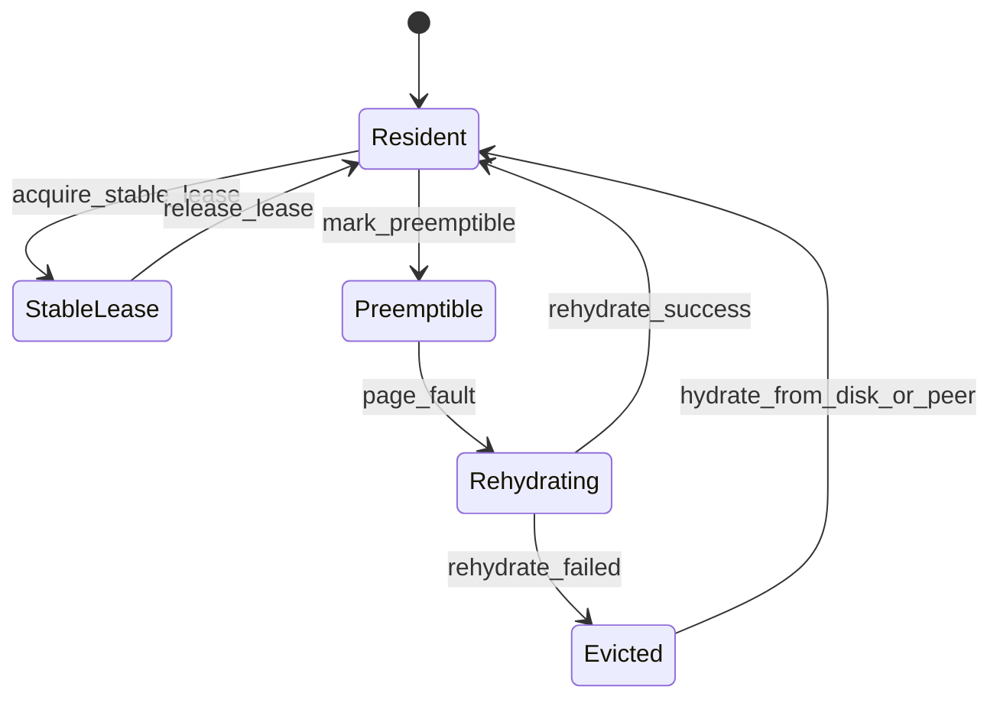

# Summary

Building on the UMA preemptible mechanism described in `docs/internals/preemptible-memory.md`, we introduce two tiers: Stable Memory and Preemptible Memory. Stable Memory guarantees continuous residency and is explicitly carved out by the daemon, while Preemptible Memory is an elastic extension that can be reclaimed by the kernel. The daemon must coordinate both tiers and uses the configurable `enable_preemptible_memory` switch to decide whether preemption is exposed. The Global Store aggregates each daemon's stable/preemptible supply, issues global leases, and ensures the distributed system keeps running even when preemptible memory is fully disabled; once enabled, the preemptible pool synchronizes with the Global Store through leases and telemetry so that the cluster behaves like an elastic memory pool.

# Problem & Context

## Current State

### UMA/StoreEngine current behavior (code anchors)

- `core/store/materialization/planning/chunk_aware_strategy.cc:162-182` hard codes a `ratio=0.5F` call to `ReplicaLoadController::mark_cpu_preemptible` after CPU loading finishes and calls it again with `ratio=1.0F` after the GPU load completes. There is no configuration knob and every replica automatically becomes preemptible.
- `core/store/replica/replica_load_controller.cc:1124-1163` simply forwards the ratio to `UnifiedMemoryAuthority::mark_cpu_chunks_preemptible`; the controller has no concept of Stable vs. Preemptible and cannot reject UMA's default policy.
- `core/store/replica/unified_memory_authority.cc:372-410` computes a chunk prefix from the ratio, calls `CpuArena::mark_preemptible`, and records the prefix as `ChunkState::PREEMPTIBLE`. The ledger has no "stable lease" field, so any chunk can be `madvise`'d.
- `UnifiedMemoryAuthority::post_gpu_load_policy` (around line 880 in the same file) is always invoked by `ReplicaLoadController` with `PostGpuLoadPolicy::EvictCPU`. The policy directly calls `CpuArena::evict_tail_bytes`, so persistent allocations are evicted as well.

### Global Store / daemon coordination

- `daemon/worker_lifecycle_manager.cc:122-150` only fills `get_mem_pool_size()` / `get_available_memory()` when registering a worker, and heartbeats only report a single `mem_pool_available_size`, so there is no way to communicate stable vs. preemptible capacity.
- The `workers` table inside `schema.sql` only contains `mem_pool_total_size` / `mem_pool_available_size`, and the `chunk_directory` table only has an integer `chunk_state` (0=HOT...4=EVICTED). There is no understanding of leases or memory tiers.
- The Global Store Python services (`tensorcast/global_store/services/worker_service.py`, `tensorcast/global_store/repositories/chunk_directory_repository.py`) are built around those fields and lack any `MemoryTierStatus` or lease-related RPCs.

## Distributed gaps

- Loader/Export/RDMA paths have no concept of "stable memory leases", so reclaiming preemptible memory can break in-flight transfers.
- A daemon can enable `madvise` locally, but the Global Store cannot tell which nodes allow preemption, making it impossible to create a true distributed memory pool.
- The cluster should be able to run with only stable memory, yet UMA does not provide a "stable-only" mode.

# Goals

- Introduce an explicit Stable Memory concept. The daemon guarantees a minimum stable capacity at startup and keeps all critical replicas under stable leases.
- Control preemptible memory with a boolean switch and thresholds. It must be fully disable-able. When disabled, the system keeps running in a stable-only mode.
- Share a single "Memory Tiers" model and state machine between the UMA ledger, daemon policy, and Global Store.
- Have the Global Store aggregate memory-tier states from every daemon, surface a "distributed stable memory pool", and issue leases based on telemetry even when preemption is off.
- Require Loader/Export/Communicator code to use explicit lease APIs with RAII semantics to avoid dangling references.
- Since the project has not launched yet, we do not need backward compatibility. Prioritize complete stable-path functionality and observability; preemptible logic can stay minimal as long as configs and metrics are present.

# Non-Goals

- Do not introduce additional GPU memory tiers; the existing GPU strategy stays unchanged.
- Do not implement UMA transactional details in this design (see `docs/designs/0022-distributed-preemptible-memory.md`).
- Do not change client APIs such as `tensorcast.get()`.

# Architecture Overview



# Memory Tier Model

| Tier | Description | Allowed residency states | Trigger to enter | Exit condition |
| ---- | ----------- | ------------------------ | ---------------- | -------------- |
| Stable | Explicitly reserved by the daemon at startup or when a lease is requested. Never issues `madvise` and guarantees CPU residency. | `Resident`, `StableLease` | Loader/Export requests or Global Store issues a stable lease | Explicit release or Global Store revokes the stable lease |
| Preemptible | Elastic memory that can be marked as `Preemptible` and reclaimed by the kernel. | `Preemptible`, `Rehydrating`, `Evicted` | UMA policy `mark_preemptible` when configuration allows it | Fault/rehydration success or policy rollback |

All chunks share the following state machine (reusing the UMA V3 design):



## Naming and Terminology (avoid concept confusion)

- **Stable Lease**: Ledger-level residency right indicating that a chunk must remain resident and cannot be preempted. Used for capacity budgeting and Global Store lease records; does **not** imply OS-level `mlock`.
- **Preemptible Mark**: Indicates that a chunk may be `madvise`'d or reclaimed by the kernel. It has nothing to do with quotas.
- **Pin Lease / Export Pin**: Used only during export/transfer to keep `mlock`/pin buffers alive. Prevents eviction while exporting, independent of Stable Leases, but they can coexist.
- **MemoryTierBudget / MemoryTierStatus**: Node-level capacity/usage snapshots. Field names must use the `stable_*` and `preemptible_*` prefixes to avoid confusion with the pinned pool.
- **Pinned Pool**: Dedicated pinned host buffers for the data plane, separate from UMA/Stable/Preemptible tiers. Never refer to the pinned pool as the "stable pool".

All interfaces and fields must keep these prefixes. Avoid ambiguous names such as "preemptible_lease" or "stable_pin" to reduce confusion during operations and code review.

# Daemon Behavior

## MemoryTierConfig

- `MemoryTierConfig` continues to live on the C++ side (`daemon/runtime/memory_tiers.h`), but its values come from the unified configuration system defined in `docs/designs/0004-unified-runtime-config.md`. `DaemonConfig.engine.memory_tiers` adds the following fields:

  ```proto
  message MemoryTiers {
    optional bool enable_preemptible = 1;            // default = false
    optional uint64 stable_bytes = 2;                // required via validation
    optional uint64 preemptible_limit_bytes = 3;     // optional, ignored when enable_preemptible=false
    optional double preemptible_low_watermark_ratio = 4; // default 0.4
  }

  message EngineConfig {
    ...
    optional MemoryTiers memory_tiers = N;
  }
  ```

- The daemon still follows the single `--config` entry point; `MemoryTierConfig` is parsed via `core/common/config/daemon_config_io.cc` → `runtime::Config`.
- `normalize_defaults` enforces the minimum for `stable_bytes` (for example 4 GiB). Missing values are treated as errors per the 0004 design.
- The Global Store configuration also adds `tensorcast.config.v1.GlobalStoreConfig.worker_policy.memory_tiers` (loaded by `tensorcast/global_store/config/settings.py`) so it can broadcast lease thresholds and telemetry intervals.
- Runtime flow: read YAML/JSON → convert to Protobuf → populate the C++ `MemoryTierConfig` struct → `MemoryTierCoordinator` initializes UMA and policy.

## Differences between UMA, mem_pool, and pinned memory

- `StoreEngineOptions::memory_pool_size` (wired through `DaemonConfig.engine.mem_pool_size_bytes`) refers **only** to the PinnedBufferPool capacity used by P2P and disk streaming. `ReplicaRuntime::get_available_memory()` and `WorkerHeartbeat.mem_pool_available_size` also refer strictly to the pinned pool and have nothing to do with UMA CPU chunks.
- The pinned pool calls `mlock`/`cudaHostAlloc` during initialization and remains resident. Those bytes must be deducted from the host DRAM budget and cannot be reused by the stable pool.
- The new `MemoryTierBudget` therefore needs a separate "CPU DRAM available to UMA" calculation:
  1. Read node `MemTotal` (or cgroup `memory.max` when inside a container) to get `host_dram_bytes`.
  2. Read `pinned_pool_bytes = engine.get_mem_pool_size()`.
  3. Compute `uma_cpu_capacity_bytes = max(host_dram_bytes - pinned_pool_bytes, 0)`.
  4. Set `stable_capacity_bytes = min(config.stable_bytes, uma_cpu_capacity_bytes)`.
- In other words, `mem_pool_size` is **not** the stable pool capacity and **not** the UMA VS size. Docs, gRPC APIs, and metrics must clearly differentiate between the pinned pool and UMA tiers.

## Initial stable allocation (on-demand leases, no anonymous pre-allocation)

1. `MemoryTierCoordinator::bootstrap()` no longer tries to create anonymous chunks inside UMA. Instead it:
   - Computes `stable_capacity_bytes` using the formula above and stores it in the local `MemoryTierBudget`.
   - Reports the initial snapshot with `stable_committed_bytes = 0` and `stable_available_bytes = stable_capacity_bytes` to the Global Store.
   - Fails startup immediately if `stable_bytes` exceeds `uma_cpu_capacity_bytes` (i.e., host DRAM remaining after subtracting the pinned pool), signaling that the configuration is invalid.
2. Whenever the loader/Export/Communicator requests a stable lease:
   - `AcquireStableLease(span)` converts the chunk size into bytes and atomically deducts it from the `MemoryTierBudget`.
   - Only after the deduction succeeds do we call UMA's `mark_chunks_stable` to label the specific replica chunks as `StableLease`.
   - If the deduction fails (budget exhausted), return `ResourceExhausted` so the caller can fall back to preemptible or reject the request.
3. When chunks are released (export complete, replica unloaded, etc.), `release_stable_lease` returns the same number of bytes to the `MemoryTierBudget` and updates UMA. Budget changes are propagated to the Global Store in the next `MemoryTierStatus`.
4. This makes the stable pool the combination of "available budget + leased chunks" instead of anonymous allocations that cannot be bound.
5. Stable capacity is driven entirely by the `stable_bytes` configuration; we no longer infer it from current free memory. If `uma_cpu_capacity_bytes` is smaller than the configured value, bootstrap fails and asks operators to lower the config or free host DRAM.

## Preemptible strategy

- When `enable_preemptible_memory = false`, the policy loop never executes `mark_preemptible`, so all chunks stay in `Resident/StableLease` states. Implementation details:
  1. `ChunkAwareLoadingStrategy` reads `MemoryTierConfig` and skips `mark_cpu_preemptible` calls when preemption is disabled; it only invokes UMA when the config allows it.
  2. To stay compatible with legacy callers, `ReplicaLoadController::mark_cpu_preemptible` returns `absl::OkStatus()` and logs that preemption was skipped instead of raising `FailedPrecondition`. Older code paths calling it will not treat the stable-only mode as a failure.
  3. `UnifiedMemoryAuthority::post_gpu_load_policy` chooses a new `StableOnly` branch (ledger updates only, no eviction) when preemption is disabled, and only executes `EvictCPU` / `MarkPreemptible` when enabled.
- When preemption is enabled, `MemoryTierPolicy` uses `preemptible_limit_bytes` and pressure signals (RSS, `/proc/pressure/memory`, GPU transfer backlog) to select chunks that enter `Preemptible`. The recovery ratio is controlled by `preemptible_low_watermark_ratio`.
- On faults, `MemoryTierCoordinator` triggers rehydration. If the chunk still holds a `StableLease`, the fault is treated as an error and reported.

## Telemetry publication

Each daemon periodically pushes `MemoryTierStatus` (defined below) to the Global Store with:

- `stable_total_bytes`, `stable_used_bytes`
- `preemptible_total_bytes`, `preemptible_marked_bytes`
- `faults_per_sec`, `rehydrate_p99_ns`
- Current `enable_preemptible_memory` setting

The Global Store persists these fields as-is and maps them to Prometheus metrics. `faults_per_sec` / `rehydrate_p99_ns` become counters/latency metrics, while `enable_preemptible_memory` is exposed as an info/label metric to distinguish "stable-only configuration" from "node not reporting".

# Global Store Coordination

## Schema changes

`schema.sql` gains or modifies the following structures:

```sql
CREATE TABLE IF NOT EXISTS memory_tier_snapshots (
    node_id TEXT NOT NULL,
    epoch_ns BIGINT NOT NULL,
    stable_total_bytes BIGINT NOT NULL,
    stable_used_bytes BIGINT NOT NULL,
    preemptible_total_bytes BIGINT NOT NULL,
    preemptible_marked_bytes BIGINT NOT NULL,
    faults_per_sec REAL NOT NULL,
    rehydrate_p99_ns BIGINT NOT NULL,
    enable_preemptible BOOLEAN NOT NULL,
    memory_tier_config_json TEXT NOT NULL DEFAULT '{}',
    PRIMARY KEY (node_id, epoch_ns)
);

CREATE OR REPLACE VIEW node_memory_tier_latest AS
WITH ranked AS (
    SELECT
        node_id,
        stable_total_bytes,
        stable_used_bytes,
        preemptible_total_bytes,
        preemptible_marked_bytes,
        faults_per_sec,
        rehydrate_p99_ns,
        enable_preemptible,
        memory_tier_config_json,
        epoch_ns,
        ROW_NUMBER() OVER (PARTITION BY node_id ORDER BY epoch_ns DESC) AS rn
    FROM memory_tier_snapshots
)
SELECT
    node_id,
    stable_total_bytes,
    stable_used_bytes,
    preemptible_total_bytes,
    preemptible_marked_bytes,
    faults_per_sec,
    rehydrate_p99_ns,
    enable_preemptible,
    memory_tier_config_json,
    epoch_ns AS snapshot_epoch_ns
FROM ranked
WHERE rn = 1;

CREATE TABLE IF NOT EXISTS memory_tier_leases (
    lease_id TEXT PRIMARY KEY,
    node_id TEXT NOT NULL,
    kind TEXT CHECK (kind IN ('stable','preemptible')) NOT NULL,
    artifact_id TEXT NOT NULL,
    chunk_range JSON NOT NULL, -- human-friendly range, e.g., {"start": 0, "count": 16}
    chunk_ids JSON NOT NULL,   -- immutable UMA chunk ordinals or IDs for exact replay/audit
    ledger_version BIGINT NOT NULL, -- UMA ledger version at acquisition for staleness checks
    bytes BIGINT NOT NULL,
    workload_id TEXT NOT NULL,
    state TEXT CHECK (state IN ('pending','active','revoking','expired')) NOT NULL DEFAULT 'pending',
    request_id TEXT NOT NULL,
    ack_epoch_ns BIGINT,
    issued_at_ns BIGINT NOT NULL,
    expires_at_ns BIGINT NULL
);
CREATE INDEX IF NOT EXISTS idx_memory_tier_leases_node_artifact ON memory_tier_leases(node_id, artifact_id, state);
```

- `memory_tier_snapshots` uses short-term retention: keep only the last N rows per node or the last 5–10 minutes (whichever is smaller). Periodic `DELETE ... WHERE epoch_ns < cutoff` plus `VACUUM` / `PRAGMA optimize` prevents unbounded DuckDB growth. Prometheus/export aggregation happens on this sliding window.
- `node_memory_tier_latest` replaces the duplicated columns that previously lived in `workers`: all read paths now join this view on `node_id` to fetch the freshest telemetry/config without performing extra writes per heartbeat.

## MemoryTierBroker service

- `tensorcast/global_store/services/memory_tier_service.py` (new):
  - `PublishMemoryTierStatus(MemoryTierStatus)`: called by daemons, writes to `memory_tier_snapshots` and updates the capacity columns inside `workers`.
  - `RequestMemoryTierLease(RequestMemoryTierLeaseRequest)`: the Global Store allocates leases using the policy (prefer stable → fallback to preemptible → reject). Returns `lease_id + ttl` with initial `pending` state. The response includes `artifact_id`, optional `chunk_range` hints, and placeholders for `chunk_ids` / `ledger_version` that the daemon must fill in once acquisition succeeds.
  - `AcknowledgeMemoryTierLease(AcknowledgeMemoryTierLeaseRequest)`: the daemon calls this after binding UMA leases or after releasing them. The `action` enum is `{ACQUIRED, RELEASED}` and transitions the lease from `pending`→`active` or `revoking`→`expired`. ACKs must include `chunk_ids` (UMA chunk ordinals/IDs), `ledger_version`, and the human-readable `chunk_range` for replay/audit.
  - `RevokeMemoryTierLease(lease_id)`: marks a lease as `revoking` when a node is under pressure or failed.
  - `ListOutstandingLeases(ListOutstandingLeasesRequest)`: the daemon fetches `pending/active/revoking` leases during startup or recovery to reconcile UMA state.
- Protobuf definitions live in `tensorcast/proto/memory_tier/v1/memory_tier.proto` and cover `MemoryTierStatus`, `MemoryTierLease`, and `RequestMemoryTierLeaseRequest/Response`.

## Coordination flow

1. Daemon starts → `enable_preemptible_memory` decides the policy → daemon publishes `MemoryTierStatus`.
2. The Global Store computes cluster-wide stable/preemptible capacity and maintains the "distributed stable memory pool".
3. When a new artifact needs residency, the Global Store first tries to allocate stable leases (single node or cross-node). If that fails it falls back to preemptible leases.
4. Nodes with preemption disabled still participate in the stable pool; the Global Store will not assign them preemptible leases.
5. When global pressure requires reclamation, the Global Store issues `RevokeMemoryTierLease` (marks them as `revoking`). The daemon downgrades or releases the chunks and then calls `AcknowledgeMemoryTierLease(action=RELEASED)`.

## Lease acknowledgement and replay

- **Acknowledgement flow**: `RequestMemoryTierLease` returns a lease in `pending`. After the daemon binds the UMA `StableLease`, it calls `AcknowledgeMemoryTierLease(action=ACQUIRED)` with `lease_id`, `node_id`, `artifact_id`, `chunk_range`, `acked_bytes`, and the UMA ledger version. The call is idempotent (carry `request_id`). Unacknowledged leases do not count toward stable capacity.
- **Replay / recovery**: when the daemon or Global Store restarts—or an RPC times out—the daemon calls `ListOutstandingLeases(node_id)`:
  - `pending`: if UMA does not hold it yet, the daemon can reapply or reject. Rejections send `AcknowledgeMemoryTierLease(action=RELEASED, reason=FAILED_TO_ACQUIRE)`.
  - `active`: the daemon must reapply `chunk_ids` (real UMA IDs/ordinals) to mark the chunks as stable again. `chunk_range` is only diagnostic; if shard/compaction changed, `chunk_ids` take precedence. Failures must release the lease so the control plane can reschedule.
  - `revoking`: release immediately based on `chunk_ids` and send `action=RELEASED`.
- **Data consistency**: `memory_tier_leases` stores the artifact, `chunk_ids`, `ledger_version`, optional human-readable `chunk_range`, and the lifecycle state (`state`, `ack_epoch_ns`, `request_id`). All state transitions (including ACKs) happen in a single transaction to avoid ghost leases and to support targeted revocation/auditing.

# Configuration & Telemetry

- Configuration follows `docs/designs/0004-unified-runtime-config.md`: every process only exposes `--config`.
  - `DaemonConfig.engine.memory_tiers` defines the stable/preemptible parameters; when `enable_preemptible` is false the default is stable-only.
  - `GlobalStoreConfig.worker_policy.memory_tiers` provides telemetry intervals and node-priority policies.
- Update `proto/tensorcast/config/v1/daemon_config.proto`, `core/common/config/daemon_config_io.cc`, and `tensorcast/global_store/config/settings.py` to define the `memory_tiers` field, update parsing/validation, and reject unknown fields per design 0004.
- New Prometheus metrics:
  - `tensorcast_memory_tier_stable_bytes{node=}`
  - `tensorcast_memory_tier_preemptible_bytes{node=,state=}`
  - `tensorcast_memory_tier_faults_per_sec`

# Failure Modes & Fallback

| Scenario | Behavior |
| -------- | -------- |
| `enable_preemptible_memory=false` | The daemon only allocates `stable_bytes`. The Global Store sees `preemptible_total_bytes=0` and the system continues operating. |
| `MemoryTierStatus` not reported | The Global Store marks the node as stable-only and lowers its scheduling priority. |
| Preemptible rehydration fails | The chunk moves to `Evicted`. The Global Store can reassign a stable lease or trigger replication. |
| Global stable capacity insufficient | The broker first reclaims idle stable leases, then rejects new `RequestMemoryTierLease` calls. |

# Implementation Anchors

| Subsystem | Existing files to modify | Work required |
| ------ | ------------------ | -------- |
| Loader / strategy | `core/store/materialization/planning/chunk_aware_strategy.cc` | Replace the hard-coded `preemptible_ratio` with `MemoryTierConfig` logic; skip `mark_cpu_preemptible` when disabled. |
| Replica controller | `core/store/replica/replica_load_controller.cc` | Read the new config, gate `enable_preemptible_memory`, and support the `Keep`/`StableOnly` branch when invoking `post_gpu_load_policy`. |
| UMA ledger | `core/store/replica/unified_memory_authority.{h,cc}` | Extend `ChunkRecord` with `StableLease` / `Resident` states; `mark_cpu_chunks_preemptible` obeys the config; `post_gpu_load_policy` gets the new branch. |
| Daemon → GS heartbeat | `daemon/worker_lifecycle_manager.cc` | Heartbeats include stable/preemptible capacity and the config switch; call the new `MemoryTierService` RPC. |
| Global Store schema | `schema.sql`, `tensorcast/global_store/services/worker_service.py`, `repositories/*` | Extend the `workers` table, add `memory_tier_snapshots` / `memory_tier_leases` tables, and update repositories/services + gRPC surface. |
| Telemetry & control plane | `tensorcast/global_store/services/memory_tier_service.py` (new) | Implement `PublishMemoryTierStatus`, `RequestMemoryTierLease`, `AcknowledgeMemoryTierLease`, `RevokeMemoryTierLease`, `ListOutstandingLeases`, aligned with the DuckDB schema. |
| Configuration system | `proto/tensorcast/config/v1/daemon_config.proto`, `core/common/config/daemon_config_io.cc`, `tensorcast/global_store/config/settings.py` | Define the `memory_tiers` fields in the unified config, update parsing/validation to follow design 0004. |

# Naming Compliance (C++ APIs)

| Symbol | Kind | Naming rule satisfied | Notes |
| ------ | ---- | --------------------- | ----- |
| `MemoryTierConfig` | struct | PascalCase ✓ | New config struct inside `daemon::runtime`. |
| `MemoryTierCoordinator` | class | PascalCase ✓ | Manages UMA plus the policy loop. |
| `configure_memory_tiers` | function | snake_case ✓ | Helper that initializes the components and returns `absl::Status`. |
| `acquire_stable_lease` | method | snake_case ✓ | Member of `MemoryTierCoordinator`. |
| `release_stable_lease` | method | snake_case ✓ | Mirror of the acquire method. |
| `kDefaultStableRatio` | constant | ALL_CAPS ✓ | Default stable capacity ratio. |

# Risks & Open Questions

- **Source of configuration**: Should `stable_bytes` come from node topology discovery or manual config? A future plan needs to define auto-discovery.
- **Cross-node load balancing**: Without real-time RSS data, the Global Store relies solely on telemetry and might react slowly. Need to evaluate the update frequency vs. cost.
- **Lease consistency**: The `ListOutstandingLeases` + `AcknowledgeMemoryTierLease` combo must guarantee idempotence and alerting; implementation must ensure this.

# References

- `docs/internals/preemptible-memory.md`
- `docs/designs/0022-distributed-preemptible-memory.md`
- `schema.sql`
