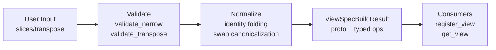

# Summary

Refactor the `Store._build_view_spec` method and related `_resolve_view_inputs` to use structured result types and dedicated validation helpers. This eliminates complex tuple returns, introduces type-safe operation models, and separates validation/normalization concerns from protobuf assembly.

The current implementation returns a 3-tuple `(ViewSpec | None, bool, dict[str, list[dict]])` from `_build_view_spec` and a 6-tuple from `_resolve_view_inputs`, making the code hard to maintain and extend. This design introduces:

1. **Typed operation models** (`NarrowOp`, `TransposeOp`, `TensorViewOp` union)
2. **Structured result types** (`ViewSpecBuildResult`, `ResolvedViewInputs`)
3. **Dedicated validation helpers** (`validate_narrow`, `validate_transpose`)
4. **Clear separation** between validation, normalization, and proto assembly



# Goals / Non-Goals

## Goals

1. **Type safety**: Replace `dict[str, list[dict[str, int | str]]]` with strongly-typed dataclasses (`NarrowOp`, `TransposeOp`).
2. **Semantic clarity**: Replace positional tuple unpacking with named fields via result objects.
3. **Testability**: Enable focused unit tests for each validation helper without invoking the full Store machinery.
4. **Extensibility**: New transform operations (future: `reshape`, `squeeze`) can be added as new `TensorViewOp` variants without modifying existing validation logic.
5. **Maintainability**: Reduce cognitive load by splitting the 200+ line `_build_view_spec` into smaller, single-purpose functions.
6. **Pragmatic transition**: Provide adapter methods (`to_normalized_dict()`) only to ease short-term internal migration; prioritize clean semantics over preserving legacy quirks (pre-launch, no external compatibility promises).

## Non-Goals

- Changing the proto wire format (`ViewSpec`, `TensorViewOps`, etc.).
- Modifying the C++ `ViewPlanner` or daemon-side execution.
- Adding new transform types (this design only restructures existing `narrow`/`transpose` handling).
- Changing the public SDK API signatures (`get_view`, `register_view`, etc.).

# Architecture & Interfaces

## 1. Typed Operation Models

A new module `tensorcast/api/_view_ops.py` defines the core types:

```python
from __future__ import annotations

from dataclasses import dataclass
from typing import Mapping, Sequence, Union

# Narrow input contract: single spec per tensor
SliceSpec = slice | tuple[int, slice]

@dataclass(frozen=True, slots=True)
class NarrowOp:
    """Single-dimension slice operation (torch.narrow semantics).
    
    All indices are non-negative after normalization. Negative input indices
    are converted to positive via `idx + extent` before storage.
    """
    dim: int
    start: int
    length: int

@dataclass(frozen=True, slots=True)
class TransposeOp:
    """Single dimension-pair swap (torch.transpose semantics)."""
    dim0: int
    dim1: int

# Sealed union of supported operations
TensorViewOp = Union[NarrowOp, TransposeOp]
```

### Naming Compliance

| Symbol | Kind | Convention | Compliant |
|--------|------|------------|-----------|
| `NarrowOp` | class | PascalCase | ✓ |
| `TransposeOp` | class | PascalCase | ✓ |
| `TensorViewOp` | type alias | PascalCase | ✓ |
| `dim`, `start`, `length`, `dim0`, `dim1` | field | snake_case | ✓ |

## 2. ViewSpecBuildResult

```python
@dataclass(frozen=True, slots=True)
class ViewSpecBuildResult:
    """Structured result from view spec construction."""
    
    proto: store_daemon_pb2.ViewSpec | None
    """The protobuf ViewSpec, or None if all operations are identity."""
    
    tensor_ops: Mapping[str, list[TensorViewOp]]
    """Per-tensor operation sequences, keyed by tensor name (sorted)."""

    def __post_init__(self) -> None:
        # Enforce invariant: proto is None iff tensor_ops is empty
        if (self.proto is None) != (not self.tensor_ops):
            raise ValueError("ViewSpecBuildResult must keep proto and tensor_ops in sync")

    @property
    def has_transpose(self) -> bool:
        """True if any tensor has transpose operations."""
        return any(
            isinstance(op, TransposeOp)
            for ops in self.tensor_ops.values()
            for op in ops
        )

    @property
    def is_identity(self) -> bool:
        """True if no meaningful transforms exist."""
        return not self.tensor_ops  # invariant guarantees proto is None in this case

    def __repr__(self) -> str:
        """Concise representation for debugging."""
        op_count = sum(len(ops) for ops in self.tensor_ops.values())
        return (
            f"ViewSpecBuildResult(tensors={len(self.tensor_ops)}, "
            f"ops={op_count}, is_identity={self.is_identity})"
        )

    def to_normalized_dict(self) -> dict[str, list[dict[str, int | str]]]:
        """
        Convert to legacy dict format for backward compatibility.
        
        Returns:
            Mapping compatible with existing consumers like
            `_compute_view_plan_metadata` and `_materialize_canonical_tensors`.
        """
        result: dict[str, list[dict[str, int | str]]] = {}
        for name in sorted(self.tensor_ops.keys()):
            op_list: list[dict[str, int | str]] = []
            for op in self.tensor_ops[name]:
                if isinstance(op, NarrowOp):
                    op_list.append({
                        "type": "narrow",
                        "dim": op.dim,
                        "start": op.start,
                        "length": op.length,
                    })
                elif isinstance(op, TransposeOp):
                    op_list.append({
                        "type": "transpose",
                        "dim0": op.dim0,
                        "dim1": op.dim1,
                    })
            if op_list:
                result[name] = op_list
        return result

# Module-level singleton for identity result (immutable, safe to share)
_IDENTITY_RESULT: ViewSpecBuildResult | None = None

def _get_identity_result() -> ViewSpecBuildResult:
    """Return the cached identity result singleton."""
    global _IDENTITY_RESULT
    if _IDENTITY_RESULT is None:
        _IDENTITY_RESULT = ViewSpecBuildResult(proto=None, tensor_ops={})
    return _IDENTITY_RESULT

# Add to ViewSpecBuildResult class:
    @staticmethod
    def identity() -> ViewSpecBuildResult:
        """Return a cached identity (no-op) result singleton."""
        return _get_identity_result()
```

### Naming Compliance

| Symbol | Kind | Convention | Compliant |
|--------|------|------------|-----------|
| `ViewSpecBuildResult` | class | PascalCase | ✓ |
| `proto`, `tensor_ops` | field | snake_case | ✓ |
| `has_transpose`, `is_identity` | property | snake_case | ✓ |
| `to_normalized_dict`, `identity` | method | snake_case | ✓ |

## 3. ResolvedViewInputs

Replaces the 6-tuple return from `_resolve_view_inputs`:

```python
from typing import Literal

@dataclass(frozen=True, slots=True)
class ResolvedViewInputs:
    """Structured result from view input resolution."""
    
    artifact_id: str
    """Resolved canonical artifact ID."""
    
    canonical_index_bytes: bytes | None
    """Raw canonical index JSON bytes, or None when using view_id lookup."""
    
    build_result: ViewSpecBuildResult | None
    """Build result, or None when resolving via pre-existing view_id."""
    
    disk_path_hint: str | None
    """Optional disk path hint from key resolution."""
    
    view_id: str | None
    """Pre-existing view_id when provided by caller (mutually exclusive with build_result)."""

    def __post_init__(self) -> None:
        # Enforce mutual exclusivity: exactly one of build_result or view_id must be set
        has_build = self.build_result is not None
        has_view_id = self.view_id is not None
        if has_build == has_view_id:
            raise ValueError(
                "ResolvedViewInputs requires exactly one of build_result or view_id, "
                f"got build_result={has_build}, view_id={has_view_id}"
            )

    @property
    def variant(self) -> Literal["build", "id"]:
        """Return which variant this resolution represents."""
        return "build" if self.build_result is not None else "id"

    @property
    def view_spec(self) -> store_daemon_pb2.ViewSpec | None:
        """Convenience accessor for the proto ViewSpec."""
        return self.build_result.proto if self.build_result else None

    @property
    def has_transpose(self) -> bool:
        """True if the resolved view includes transpose operations."""
        return self.build_result.has_transpose if self.build_result else False

    @property
    def normalized_ops(self) -> dict[str, list[dict[str, int | str]]]:
        """Legacy-compatible normalized operations dict."""
        if self.build_result is None:
            return {}
        return self.build_result.to_normalized_dict()

    @classmethod
    def from_build_result(
        cls,
        *,
        artifact_id: str,
        canonical_index_bytes: bytes,
        build_result: ViewSpecBuildResult,
        disk_path_hint: str | None = None,
    ) -> ResolvedViewInputs:
        """Construct from a freshly built ViewSpec."""
        return cls(
            artifact_id=artifact_id,
            canonical_index_bytes=canonical_index_bytes,
            build_result=build_result,
            disk_path_hint=disk_path_hint,
            view_id=None,
        )

    @classmethod
    def from_view_id(
        cls,
        *,
        artifact_id: str,
        view_id: str,
        disk_path_hint: str | None = None,
    ) -> ResolvedViewInputs:
        """Construct from a pre-existing view_id (deferred spec lookup)."""
        return cls(
            artifact_id=artifact_id,
            canonical_index_bytes=None,
            build_result=None,
            disk_path_hint=disk_path_hint,
            view_id=view_id,
        )
```

### Mutual Exclusivity (Type-Level)

- `ResolvedViewInputs` enforces `build_result` XOR `view_id`:
  - `__post_init__` raises if both are set or if neither is set.
  - Two named constructors (`from_build_result`, `from_view_id`) make the variant explicit.
  - A `variant` property (`Literal["build", "id"]`) is used in tests to assert exclusivity.

### Naming Compliance

| Symbol | Kind | Convention | Compliant |
|--------|------|------------|-----------|
| `ResolvedViewInputs` | class | PascalCase | ✓ |
| `artifact_id`, `canonical_index_bytes`, etc. | field | snake_case | ✓ |
| `view_spec`, `has_transpose`, `normalized_ops` | property | snake_case | ✓ |

## 4. Validation Helpers

Dedicated functions for validating and normalizing each operation type:

```python
def validate_narrow(
    tensor_name: str,
    shape: tuple[int, ...],
    spec: SliceSpec,
) -> NarrowOp | None:
    """
    Validate and normalize a single narrow (slice) specification.
    
    Args:
        tensor_name: Name of the tensor (for error messages).
        shape: Tensor shape from canonical index.
        spec: User-provided slice specification (single spec per tensor).
            Contract:
            - Must be `slice` or `(int, slice)`
            - `slice.step` must be `None` or `1`
            - Negative start/stop are normalized via `idx + extent` (Python semantics)
            - `None` start/stop are expanded to `[0, extent]`
            - Bare `slice` implies dim=0; `(dim, slice)` uses explicit dim
    
    Returns:
        NarrowOp with non-negative indices if the slice is non-identity,
        None if it's a full-range identity slice.
    
    Raises:
        ValueError: If validation fails (dimension out of range, invalid bounds, etc.).
    
    Example:
        >>> validate_narrow("weight", (10, 20), slice(2, 5))
        NarrowOp(dim=0, start=2, length=3)
        >>> validate_narrow("weight", (10, 20), (1, slice(-5, None)))
        NarrowOp(dim=1, start=15, length=5)  # negative normalized
        >>> validate_narrow("weight", (10, 20), slice(None))
        None  # identity, full range
    """
    ...


def validate_transpose(
    tensor_name: str,
    shape: tuple[int, ...],
    ops: Sequence[tuple[int, int]],
) -> list[TransposeOp]:
    """
    Validate and normalize transpose operations into canonical swap sequence.
    
    Args:
        tensor_name: Name of the tensor (for error messages).
        shape: Tensor shape from canonical index.
        ops: User-provided transpose pairs.
    
    Returns:
        List of TransposeOp produced by a stable swap-to-place algorithm:
        - Apply user swap pairs in order to derive target permutation
        - Canonicalize by swapping each position into place left-to-right
        - Cancellation: repeated identical swaps cancel (e.g., [(0, 1), (0, 1)] -> [])
        - Stability: canonicalize(canonicalize(ops)) == canonicalize(ops)
        - Empty list if the resulting permutation is identity
    
    Raises:
        ValueError: If validation fails (dimensions out of range, etc.).
    
    Example:
        >>> validate_transpose("weight", (10, 20, 30), [(0, 2)])
        [TransposeOp(dim0=0, dim1=2)]
        >>> validate_transpose("weight", (10, 20, 30), [(0, 1), (0, 1)])
        []  # cancels out
    """
    ...
```

### Naming Compliance

| Symbol | Kind | Convention | Compliant |
|--------|------|------------|-----------|
| `validate_narrow` | function | snake_case | ✓ |
| `validate_transpose` | function | snake_case | ✓ |
| `tensor_name`, `shape`, `spec`, `ops` | parameter | snake_case | ✓ |

### Transpose Canonicalization (Fixed Algorithm)

- **Algorithm**: swap-to-place, left-to-right. For each target position, swap the desired dim into place; stable w.r.t. input order.
- **Cancellation**: Repeated identical swaps cancel out (e.g., `[(0,1), (0,1)]` → `[]`).
- **Stability (idempotence)**: `canonicalize(canonicalize(ops)) == canonicalize(ops)` — applying canonicalization twice yields the same result.
- **Determinism**: Given the same input sequence and shape, the canonicalized swap list is unique and reproducible.

## 5. Orchestrator Function

```python
def build_view_spec(
    *,
    entry_shapes: Mapping[str, tuple[int, ...]],
    slices: Mapping[str, SliceSpec] | None,
    transpose: Mapping[str, Sequence[tuple[int, int]]] | None,
) -> ViewSpecBuildResult:
    """
    Build a ViewSpec from user-provided slice and transpose specifications.
    
    This function orchestrates validation, normalization, and proto assembly:
    1. Check for slice/transpose conflicts (same tensor in both).
    2. Validate and normalize each operation via dedicated helpers.
    3. Assemble the protobuf ViewSpec.
    4. Return structured result with typed operations.
    
    Args:
        entry_shapes: Mapping of tensor names to their shapes.
        slices: Optional slice specifications per tensor (one SliceSpec per tensor).
        transpose: Optional transpose specifications per tensor.
    
    Returns:
        ViewSpecBuildResult containing proto and typed operations.
        Returns `ViewSpecBuildResult.identity()` if all operations fold to identity.
    
    Raises:
        ValueError: If validation fails for any operation.
    """
    ...
```

### Naming Compliance

| Symbol | Kind | Convention | Compliant |
|--------|------|------------|-----------|
| `build_view_spec` | function | snake_case | ✓ |
| `entry_shapes`, `slices`, `transpose` | parameter | snake_case | ✓ |

### Input Type Coercion

The `Store` layer accepts the legacy `Sequence[object]` type for backward compatibility and
coerces it to `SliceSpec` before calling `build_view_spec`:

```python
def _coerce_slice_spec(seq: Sequence[object]) -> SliceSpec:
    """
    Coerce legacy slice sequence to single SliceSpec.
    
    Raises:
        ValueError: If sequence length != 1 or element type is invalid.
    """
    if len(seq) != 1:
        raise ValueError(
            f"Only a single narrow operation is supported per tensor (got {len(seq)})"
        )
    item = seq[0]
    if isinstance(item, slice):
        return item
    if isinstance(item, tuple) and len(item) == 2:
        dim, slc = item
        if isinstance(dim, int) and isinstance(slc, slice):
            return (dim, slc)
    raise ValueError(
        "Slice spec must be a slice object or (dim, slice) tuple"
    )
```

## 6. Integration with Store

The `Store` class delegates to the new module, handling type coercion at the boundary:

```python
# tensorcast/api/store.py

from tensorcast.api._view_ops import (
    build_view_spec,
    ResolvedViewInputs,
    SliceSpec,
    ViewSpecBuildResult,
    _coerce_slice_spec,
)

class Store:
    def _build_view_spec(
        self,
        *,
        canonical_index: CanonicalIndex,
        slices: Mapping[str, Sequence[object]] | None,
        transpose: Mapping[str, Sequence[tuple[int, int]]] | None,
    ) -> ViewSpecBuildResult:
        """Build view spec, wrapping ValueError as ArtifactError.
        
        Accepts legacy Sequence[object] for backward compatibility and
        coerces to SliceSpec internally.
        """
        entry_shapes = {e.name: tuple(e.shape) for e in canonical_index.entries}
        try:
            # Coerce legacy sequence format to SliceSpec
            typed_slices: Mapping[str, SliceSpec] | None = None
            if slices:
                typed_slices = {
                    name: _coerce_slice_spec(seq)
                    for name, seq in slices.items()
                }
            return build_view_spec(
                entry_shapes=entry_shapes,
                slices=typed_slices,
                transpose=transpose,
            )
        except ValueError as exc:
            raise ArtifactError(
                str(exc),
                status_code="INVALID_ARGUMENT",
                retryable=False,
            ) from exc

    def _resolve_view_inputs(
        self,
        *,
        client: DaemonCtl,
        artifact_id: str | None,
        key: str | None,
        slices: Mapping[str, Sequence[object]] | None,
        transpose: Mapping[str, Sequence[tuple[int, int]]] | None,
        view_id: str | None,
    ) -> ResolvedViewInputs:
        """Resolve view inputs, returning structured result."""
        # ... implementation returns ResolvedViewInputs instead of 6-tuple
        ...
```

## 7. Consumer Updates

### register_view

```python
def register_view(self, tensors, *, artifact_id=None, key=None, ...):
    resolved = self._resolve_view_inputs(...)
    
    if resolved.view_spec is None:
        raise ArtifactError("View registration via pre-existing view_id not supported", ...)
    
    # Use property instead of tuple element
    placement_choice = placement or ("CLIENT" if resolved.has_transpose else "SERVER")
    
    # Use adapter for legacy consumers
    plan_metadata = _compute_view_plan_metadata(
        resolved.canonical_index_bytes,
        resolved.normalized_ops,  # calls to_normalized_dict() internally
    )
    ...
```

### get_view / get_view_into

```python
def get_view(self, *, artifact_id=None, key=None, ...):
    resolved = self._resolve_view_inputs(...)
    
    placement_enum = self._resolve_transform_placement(
        placement, has_transpose=resolved.has_transpose
    )
    
    materialized, _ = self._perform_get_with_retry(
        artifact_id=resolved.artifact_id,
        view=resolved.view_spec,
        canonical_index_hint=resolved.canonical_index_bytes,
        disk_path_hint=resolved.disk_path_hint,
        ...
    )
    ...
```

# Invariants & Error Model

## Invariants

1. **Mutual exclusivity**: A tensor cannot appear in both `slices` and `transpose` mappings.
2. **Single narrow per tensor**: Each tensor supports at most one narrow operation (enforced by `SliceSpec` type).
3. **Negative index normalization**: Negative slice start/stop are normalized to positive via `idx + extent` (Python semantics). After normalization, all stored indices are non-negative.
4. **Step = 1**: Slice step must be 1 (no strided slicing).
5. **Dimension bounds**: All dimension indices must be in `[0, ndim)`.
6. **Range validity (post-normalization)**: `start >= 0`, `length > 0`, `start + length <= shape[dim]`.
7. **Identity folding**: Full-range slices and identity transposes are folded out.
8. **Deterministic ordering**: Tensor names in `tensor_ops` are ASCII-sorted.
9. **Swap-to-place canonicalization**: Transpose canonicalization is stable; cancellation removes redundant swaps; `canonicalize(canonicalize(ops)) == canonicalize(ops)`.
10. **Result invariants**: `ViewSpecBuildResult` enforces `proto is None` iff `tensor_ops` is empty.
11. **Variant invariants**: `ResolvedViewInputs` enforces exactly one of `build_result` or `view_id` is set.
12. **Identity immutability**: The cached identity result uses a read-only mapping to prevent downstream mutation from breaking invariants.

## Error Model

| Condition | Exception | Status Code |
|-----------|-----------|-------------|
| Tensor in both slices and transpose | `ValueError` → `ArtifactError` | `INVALID_ARGUMENT` |
| Unknown tensor name | `ValueError` → `ArtifactError` | `INVALID_ARGUMENT` |
| Dimension out of range | `ValueError` → `ArtifactError` | `INVALID_ARGUMENT` |
| Invalid slice bounds | `ValueError` → `ArtifactError` | `INVALID_ARGUMENT` |
| Non-unit step | `ValueError` → `ArtifactError` | `INVALID_ARGUMENT` |
| Empty or malformed spec | `ValueError` → `ArtifactError` | `INVALID_ARGUMENT` |
| Non-mapping `slices`/`transpose` inputs | `ValueError` → `ArtifactError` | `INVALID_ARGUMENT` |

The validation layer (`_view_ops.py`) raises `ValueError` for all validation failures. The `Store` layer wraps these as `ArtifactError` with appropriate status codes.

# Schema Changes

None. This refactoring is purely internal to the Python SDK and does not affect:
- Database schema (`schema.sql`)
- Proto definitions
- Wire format
- Daemon behavior

# Trade-offs & Risks

| Trade-off | Rationale |
|-----------|-----------|
| New module (`_view_ops.py`) | Adds a file but provides clear separation; the module is small (~300 lines) and focused. |
| Adapter method (`to_normalized_dict`) | Enables incremental migration; can be removed once all consumers are updated. |
| `Union` type for `TensorViewOp` | Python's type system handles this well; pattern matching via `isinstance` is idiomatic. |

| Risk | Mitigation |
|------|------------|
| Behavioral regression | Existing tests cover all validation edge cases; add focused unit tests for new helpers. |
| Performance overhead from dataclass creation | Negligible; view spec construction is not on hot path (happens once per request). |
| Migration incomplete | Adapter method ensures backward compatibility; migration can be phased. |

# Compatibility & Acceptance Criteria

## Backward Compatibility

- **API/Wire**: No changes to public SDK signatures (`get_view`, `register_view`, etc.) or proto surfaces.
- **Behavioral parity**: Negative index normalization is preserved (consistent with current implementation). All stored indices in `NarrowOp` are non-negative after normalization.
- **Operational stance**: Project is pre-launch; adapters (`to_normalized_dict()`) exist only to ease internal migration, not to preserve legacy quirks.

## Acceptance Criteria

1. **Type safety**: `mypy` and `pyright` pass with strict mode on `_view_ops.py`.
2. **Test coverage**:
   - Unit tests for `validate_narrow`: negative indices normalized correctly, full-range identity returns `None`, `(dim, slice)` vs bare `slice`, bounds checking (post-normalization), step=1 enforcement.
   - Unit tests for `validate_transpose`: identity permutation, stable swap-to-place canonicalization, dimension bounds, cancellation of repeated identical swaps.
   - Unit tests for `build_view_spec`: conflict detection, identity folding, deterministic ordering, invariant enforcement (`proto`/`tensor_ops` sync).
   - Unit tests for `ResolvedViewInputs`: constructors enforce mutual exclusivity, `variant` property works, `__post_init__` raises on invalid state.
   - Unit tests for `to_normalized_dict()`: round-trip equivalence with legacy code paths; verify output matches what `_compute_view_plan_metadata` expects.
   - Unit tests for `_coerce_slice_spec`: valid inputs coerced, invalid inputs raise `ValueError`.
   - Integration tests: existing `register_view`/`get_view` tests pass unchanged.
3. **Performance**: No measurable regression in view registration/retrieval latency.
4. **Lint**: `ruff check` and `ruff format` pass on all modified files.

# References

- [0016-artifact-view-v1](./0016-artifact-view-v1.md) — Canonical view architecture and supported transforms. This refactor preserves all proto/wire semantics defined there.
- `tensorcast/api/store.py` — Current implementation of `_build_view_spec` and `_resolve_view_inputs`.
- `tensorcast/api/_register.py` — Consumers of `normalized_ops` (`_compute_view_plan_metadata`, `_materialize_canonical_tensors`).

# Appendix: Implementation Notes

## A. Negative Index Normalization

The current implementation already supports negative indices (see `store.py` lines 1584-1587). This design preserves that behavior for consistency:

```python
# Before normalization
slice(-5, None) on dim with extent=20  →  start=15, stop=20

# After normalization (stored in NarrowOp)
NarrowOp(dim=d, start=15, length=5)  # all positive
```

Normalization happens in `validate_narrow` before the `NarrowOp` is created, ensuring invariant #6 (range validity) can be checked on positive values only.

## B. Debug Logging

The `build_view_spec` function includes optional debug logging at `VLOG(1)` equivalent level:

```python
import logging
logger = logging.getLogger(__name__)

def build_view_spec(...) -> ViewSpecBuildResult:
    logger.debug(
        "build_view_spec: tensors=%d, slices=%d, transposes=%d",
        len(entry_shapes),
        len(slices or {}),
        len(transpose or {}),
    )
    # ... implementation ...
    logger.debug("build_view_spec result: %r", result)
    return result
```
