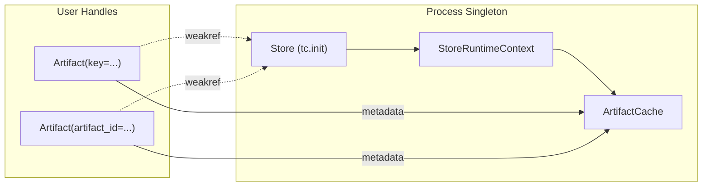
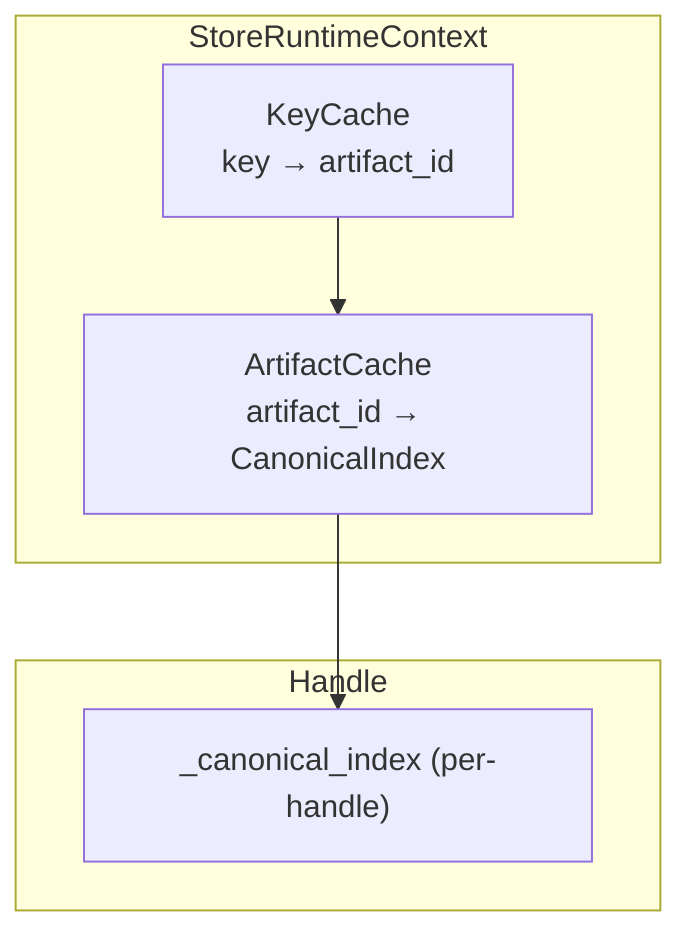
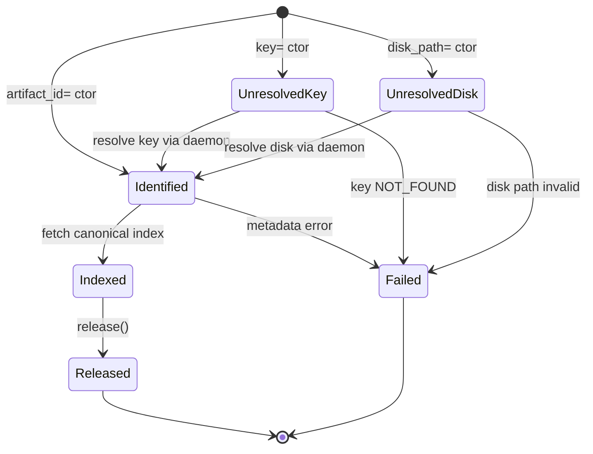

# Summary

Phase 2 introduces the public `Artifact` handle abstraction on top of the Phase 1 pipeline capabilities. The handle exposes lazy metadata access (`tensor_names`, `describe()`), selective tensor materialization, and store-bound lifecycle management while keeping the eager `store.get()` API untouched. This stage also adds a process-wide `ArtifactCache` that stores canonical indices and key→artifact mappings so user code can inspect metadata without hitting the daemon repeatedly.

Delivering this slice separately lets us validate the lazy identity + metadata flow with minimal API surface and without shipping advanced features such as views, batching, or prefetch (Phase 3).

# Goals / Non-Goals

## Goals

1. Public `Artifact` type with synchronous `.tensor_dict()`, `.tensor()`, `.with_fallback()`, `.exists()`, `.to_dict()`, `.from_dict()`.
   - Selective materialization (`names=`) is part of Phase 2 to validate lazy handles (consumed by Phase 3 view/batch/prefetch).
2. Store-bound factory functions: `tc.artifact()` and `Store.artifact()` that reuse the existing Store session singleton.
3. `ArtifactCache` inside `StoreRuntimeContext` that caches canonical indices and disk hints with TTL-based eviction and LRU bounds (default TTL 600s, max 1000 entries; env overrides described below).
4. Thread-safe handle state machine that lazily resolves keys and metadata, delegating selective fetches to the Phase 1 iterator pipeline.

## Non-Goals

- View composition, batching, async variants, or prefetch tickets (Phase 3).
- Changes to the daemon RPC surface (already handled in Phase 1).
- Altering Global Store metadata schemas.

# Architecture & Interfaces

## Module layout & Store binding

### Module layout

| Module | Responsibility | Phase |
|--------|----------------|-------|
| `tensorcast/api/store/artifact.py` | Public `Artifact` class plus serialization helpers | Phase 2 |
| `tensorcast/api/store/cache.py` | `ArtifactCache` and supporting dataclasses | Phase 2 |
| `tensorcast/api/store/materialization.py` | Updated pipeline facade that accepts selective tensor lists | Phase 1 foundation |
| `tensorcast/api/store/views.py` | View orchestrator helpers (stubbed in Phase 2, fully used in Phase 3) | Phase 2 scaffolding |

Public symbols are re-exported via `tensorcast.api.store` and `tensorcast`, so end users rarely import the deep modules directly. IDE users can still jump to `artifact.py` for the handle definition.

### Store binding conceptual model



Every handle holds a `weakref` to the originating `Store`. If the store closes, `artifact.is_valid` flips to `False` and subsequent materialization calls raise `ArtifactError(status_code="FAILED_PRECONDITION")` while previously cached metadata remains readable. This matches the lifecycle guidance in `StoreRuntimeContext._after_fork_child` and prevents dangling gRPC channels after `fork()`.

## Motivation: runtime caches are key-only today

`StoreRuntimeContext` currently caches only key→artifact_id mappings. Handles need canonical indices, disk hints, and generation counters to avoid repeated RPCs. The snippet below shows the existing `_key_cache` helper.

```225:258:tensorcast/api/store/runtime.py
    def cache_key_mapping(...):
        ...
        self._key_cache[key] = _KeyCacheEntry(...)

    def resolve_key_mapping_cached(...):
        ...
        artifact_id, disk_path = self.ensure_client().resolve_key_mapping(key)
        self.cache_key_mapping(key, artifact_id=resolved_id, disk_path=resolved_path)
        return resolved_id, resolved_path
```

Phase 2 adds `ArtifactCache` alongside the key cache so metadata can be reused across handles and processes (respecting fork semantics handled by `StoreRuntimeContext._after_fork_child`).

## Public API surface

### Factory helpers

- `tensorcast.artifact(key=..., artifact_id=..., disk_path=..., *, fallback=None) -> Artifact`
- `Store.artifact(...) -> Artifact`
- `tensorcast.from_disk(path) -> Artifact` (convenience wrapper, see Phase 4)

Factories require at least one of `key`, `artifact_id`, or `disk_path`. Multiple identifiers may be provided; handles keep all known hints so cloning/serialization works even after resolution. When `disk_path` is provided, the factory calls the daemon to resolve the artifact identity from the disk path (the daemon reads `tensor_index.json` and computes/verifies the artifact ID). All construction paths return the same `Artifact` type—there is no special subclass for disk-backed artifacts. They capture a `weakref.ref[Store]` to avoid keeping the Store alive indefinitely.

> **Note**: The `disk_path=` parameter and `from_disk()` function are defined here for completeness but are fully implemented in Phase 4 (`0036-04-disk-artifact-variant.md`).

### Artifact class

```python
class Artifact:
    """Lazy handle to a TensorCast artifact (Phase 2 feature set)."""

    # Identity & metadata (no data transfer)
    @property
    def artifact_id(self) -> str: ...
    @property
    def key(self) -> str | None: ...
    @property
    def tensor_names(self) -> tuple[str, ...]: ...
    def tensor_meta(self, name: str) -> TensorMeta: ...
    def describe(self) -> ArtifactDescriptor: ...

    # Materialization (delegates to Phase 1 iterator)
    def tensor_dict(
        self, *, device: torch.device | str, names: Sequence[str] | None = None
    ) -> dict[str, torch.Tensor]: ...
    def tensor(
        self, name: str, *, device: torch.device | str, cache: bool = True
    ) -> torch.Tensor: ...
    def tensor_dict_into(
        self, target: dict[str, torch.Tensor], *, device: torch.device | str | None = None
    ) -> None: ...

    # Lifecycle & configuration
    def with_fallback(self, fallback: FallbackOptions) -> Artifact: ...
    def exists(self) -> bool: ...
    @property
    def is_valid(self) -> bool: ...
    def release(self) -> None: ...

    # Serialization (process-local)
    def to_dict(self) -> dict[str, object]: ...
    @classmethod
    def from_dict(cls, data: dict[str, object], store: Store) -> Artifact: ...
```

Handles are immutable except for lazy metadata caching and the `_released` flag. Construction never performs I/O; metadata is fetched on first access through the shared cache.

### Tensor metadata types

```python
@dataclass(frozen=True, slots=True)
class TensorMeta:
    name: str
    shape: tuple[int, ...]
    stride: tuple[int, ...]
    dtype: torch.dtype
    storage_offset: int
    size_bytes: int

@dataclass(frozen=True, slots=True)
class ArtifactDescriptor:
    artifact_id: str
    tensor_names: tuple[str, ...]
    tensor_metas: Mapping[str, TensorMeta]
    total_bytes: int
    generation: int | None
```

`TensorMeta` is derived from `CanonicalIndexEntry` but omits UMA-specific offsets. `ArtifactDescriptor` is a normalized snapshot returned by `Artifact.describe()` and used by higher layers (e.g., view planning in Phase 3).

### Metadata caching

`ArtifactCache` is a process-wide LRU + TTL cache stored on `StoreRuntimeContext`. Defaults:
- TTL: 600s (`TENSORCAST_STORE_INDEX_CACHE_TTL_SECONDS`; `<=0` disables caching)
- Max entries: 1000 (`TENSORCAST_STORE_CACHE_MAX_ENTRIES`; `<=0` disables caching)

Entry schema (immutable payload + expiry metadata):
- `artifact_id: str`
- `disk_path: str | None`
- `canonical_index_bytes: bytes`
- `parsed_index: CanonicalIndex`
- `generation: int | None`
- `expires_at: float` (monotonic deadline)
- `hit_count: int` (for metrics only; not used for eviction)

Cache API (new in Phase 2):
- `get_artifact_index_cached(artifact_id) -> ArtifactCacheEntry | None`
- `cache_artifact_index(entry: ArtifactCacheEntry) -> None` (enforces LRU + size)
- `invalidate_artifact(artifact_id: str, key: str | None = None) -> None`
- Fork safety: `_after_fork_child` rebuilds cache structures to avoid inherited locks.

Metrics:
- `store.artifact_cache.hit`, `.miss`, `.evict`, `.invalidate`
- Dimensions: `artifact_id` (hashed/truncated), `reason` (`ttl`, `lru`, `explicit`)



#### Cache behavior

- Process-wide `ArtifactCache` stores `{artifact_id, disk_path, canonical_index_bytes, parsed_index, generation, expires_at}`.
- Entries expire after `TENSORCAST_STORE_INDEX_CACHE_TTL_SECONDS` (default 600s) or when `StoreRuntimeContext.invalidate_artifact()` is called.
- Maximum entries default to 1000 (`TENSORCAST_STORE_CACHE_MAX_ENTRIES`), evicted via LRU on insert.
- Fork handling: `_after_fork_child()` rebuilds the cache to avoid inheriting stale mutexes.

#### Handle lookup flow

1. Check `_canonical_index` without locking.
2. Acquire `_lock` and re-check (double-checked locking).
3. Query `ArtifactCache` by `artifact_id`. On hit, copy the parsed index into the handle.
4. On miss, fetch `canonical_index_bytes` via daemon RPC, populate `ArtifactCache`, then set handle fields.
5. Metadata-only operations (e.g., `tensor_names`) never touch the daemon again unless the cache entry expires.

### Handle state machine



All three construction paths (`key=`, `artifact_id=`, `disk_path=`) converge to the same `Identified` state after daemon resolution. From there, the artifact behaves identically regardless of how it was constructed.

`Artifact` instances track the following private fields:

- `_artifact_id: str | None`
- `_key_hint: str | None`
- `_disk_path_hint: str | None` — used for disk-backed construction and materialization fallback
- `_fallback: FallbackOptions | None`
- `_canonical_index_bytes: bytes | None`
- `_canonical_index: CanonicalIndex | None`
- `_generation: int | None`
- `_store_ref: weakref.ref[Store]`
- `_view_spec: ViewSpecBuildResult | None` (always `None` in Phase 2)
- `_lock: threading.RLock`
- `_released: bool`

`release()` flips `_released` to `True`, preventing further materialization but leaving metadata accessible for debugging. If `store.close()` fires, dereferencing `_store_ref` returns `None` and subsequent materialization attempts raise `ArtifactError(status_code="FAILED_PRECONDITION")`.

### Lifecycle semantics (`exists()`, `is_valid`, `release()`)

- `is_valid`: True iff `_released` is False *and* `_store_ref()` returns a live Store. Any materialization attempt when invalid raises `FAILED_PRECONDITION`; metadata access remains allowed.
- `exists()`: shallow existence probe without tensor transfer.
  - `key` handle → check `_key_cache`, then `resolve_key_mapping_cached`; on miss, RPC to daemon.
  - `artifact_id` handle → try `ArtifactCache`; on miss, call `get_artifact_index_by_id` (lightweight metadata RPC). Cache the result on success.
  - `disk_path` handle → read local `tensor_index.json` to compute/verify artifact id (Phase 4 full path), fallback to daemon lookup in Phase 2 if local parse fails.
  - Errors bubble as `ArtifactError` with retryable flag based on daemon response; NOT_FOUND invalidates caches for that id/key.
- `release()`: idempotent; marks handle invalid for future materialization but leaves cached metadata readable for diagnostics. `exists()` still works post-release (metadata-only).

### Materialization path

`Artifact.tensor_dict()` calls a new `_materialize_subset(names, device)` helper:

1. Validate `names` vs. `_canonical_index`, raising `INVALID_ARGUMENT` early.
2. Build a `MaterializationRequest` struct that carries `artifact_id`, `tensor_names`, `device`, `view_spec=None`, and `fallback`.
3. Invoke `StoreRuntimeContext.materialization_pipeline.get_subset(request)`, which wraps Phase 1’s iterator and returns a `dict` as needed.

Because handles validate tensor names against cached metadata, `MaterializationPipeline` can trust caller-provided subsets and skip redundant checks.

### Serialization and process safety

`Artifact.to_dict()` returns:

```python
{
    "artifact_id": "...",
    "key": "...",
    "fallback": fallback.to_dict() if fallback else None,
    "canonical_index": base64.b64encode(...).decode(),
    "generation": self._generation,
}
```

`Artifact.from_dict(data, store)` reconstructs a handle bound to the provided Store. Metadata bytes are copied into the handle but *not* inserted into the shared cache to avoid accidental unbounded growth when deserializing large batches. If generation is missing or the cached entry is past TTL, the handle triggers a fresh cache lookup/daemon fetch on first metadata access.

Generation source: Daemon v2 materialization/index RPCs surface `generation` alongside canonical index bytes. Cache entries, `ArtifactDescriptor`, and serialization all carry this generation to detect staleness across disk/daemon variants.

### Cache invalidation triggers (Phase 2)

- `RegistrationPipeline`: after successful register/put/register_view (including overwrite), call `invalidate_artifact(artifact_id, key)` and clear `_key_cache` for the key.
- `Store.deregister_artifact`: on success, call `invalidate_artifact(artifact_id, key=None)` and drop any cached key mapping.
- `MaterializationPipeline`: on `NOT_FOUND` or `FAILED_PRECONDITION` from daemon, invalidate the artifact_id (and key if known) before surfacing the error.
- `StoreRuntimeContext.invalidate_artifact`: explicit API used by the above and exposed for future cleanup hooks (e.g., lease expiry).

### ViewOrchestrator cache reuse

`ViewOrchestrator.resolve_view_inputs` first probes `ArtifactCache` for `artifact_id`; on hit, it returns `ResolvedViewInputs` using the cached canonical index bytes without hitting the daemon. On miss, it fetches via `client.get_artifact_index_by_id`, populates `ArtifactCache`, and proceeds. This establishes cache benefits for view requests before Phase 3 adds the view composition surface.

### Naming compliance

| Symbol | Kind | Compliance |
|--------|------|------------|
| `Artifact` | Python class | PascalCase |
| `ArtifactDescriptor` | Python dataclass | PascalCase |
| `TensorMeta` | Python dataclass | PascalCase |
| `ArtifactCache` | Python class | PascalCase |
| `artifact()` | Function | snake_case |
| `tensor_dict()` / `tensor()` / `with_fallback()` | Methods | snake_case |

All new modules reside under `tensorcast/api/store/` per SDK guidance, re-exported via `tensorcast.api.store.__init__`.

# Trade-offs & Risks

- **Store lifecycle coupling**: Handles become invalid when the Store is closed. We mitigate accidental use-after-close by exposing `is_valid` and raising deterministic errors.
- **Cache memory pressure**: A 1000-entry index cache with 1 MiB indices consumes up to ~1 GiB. TTL + LRU eviction and env var overrides allow tuning, and we publish metrics (`artifact_cache.entries`, `artifact_cache.evictions`).
- **Concurrency complexity**: Double-checked locking in each handle requires careful testing to avoid deadlocks. Unit tests cover concurrent metadata access, release, and serialization.
- **Fork safety**: Handles created before `os.fork()` may hold metadata from the parent. Because metadata bytes are immutable, the child can reuse them, but we document that materialization requires reinitializing the Store (already handled by `StoreRuntimeContext._after_fork_child`).

# Compatibility & Acceptance Criteria

1. **State machine unit tests**: `tests/python/api/test_artifact_state.py` covers transitions, repeated `.release()`, and error cases.
2. **Metadata cache tests**: `tests/python/api/test_artifact_cache.py` asserts TTL expiry, LRU eviction, fork reset semantics, generation carry-through, and cache hit/miss metrics.
3. **Selective materialization tests**: `tests/python/api/test_artifact_tensor_subset.py` verifies that `Artifact.tensor("foo")` only hydrates one tensor and that `MaterializationPipeline` receives `tensor_names`.
4. **Existence/lifecycle tests**: `tests/python/api/test_artifact_exists.py` exercises `exists()`, store-close invalidation, and release idempotency.
5. **View cache reuse tests**: `tests/python/api/test_view_orchestrator_cache.py` asserts `resolve_view_inputs` hits `ArtifactCache` before daemon RPC.
6. **Serialization round-trip**: `Artifact.to_dict()` / `from_dict()` preserve identity, canonical index bytes, and generation while enforcing TTL refresh on stale metadata.
7. **Doc updates**: `tensorcast/api/store/README.md` documents the new handle API, cache env vars (`TENSORCAST_STORE_INDEX_CACHE_TTL_SECONDS`, `TENSORCAST_STORE_CACHE_MAX_ENTRIES`), and lifecycle semantics; `docs/architecture/architecture-overview.md` references lazy handles and cache behavior.

# References

- `docs/designs/0036-01-materialization-pipeline-v2.md`
- `tensorcast/api/store/runtime.py`
- `tensorcast/api/store/materialization.py`
- `tensorcast/api/store/__init__.py`
- `docs/designs/0036-03-lazy-artifact-handle.md`
