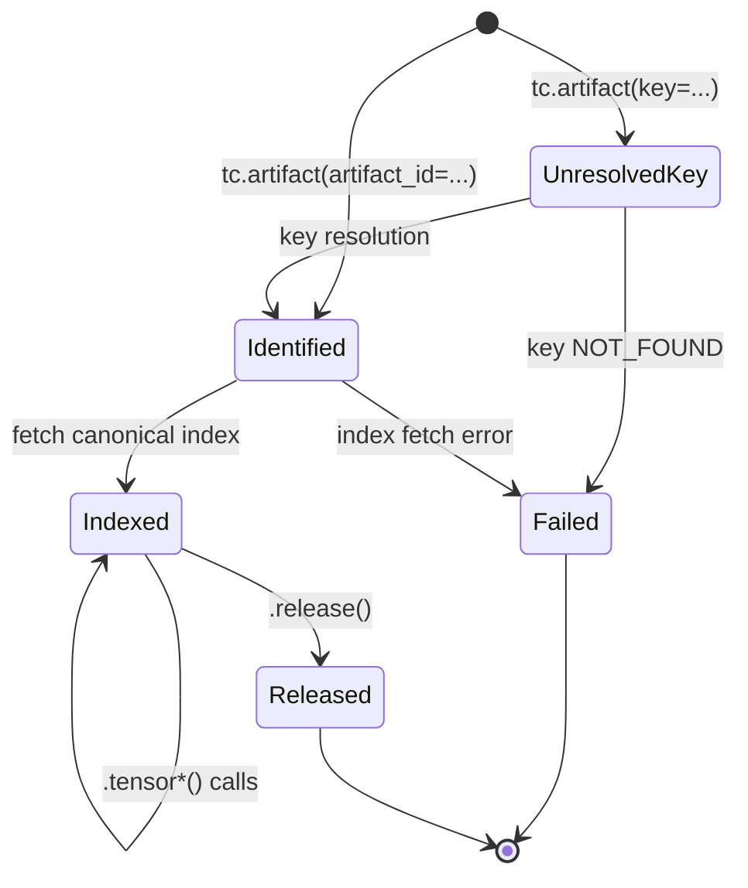
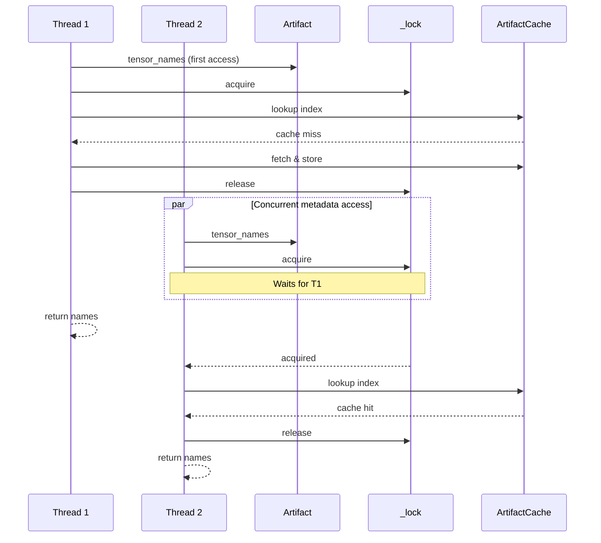
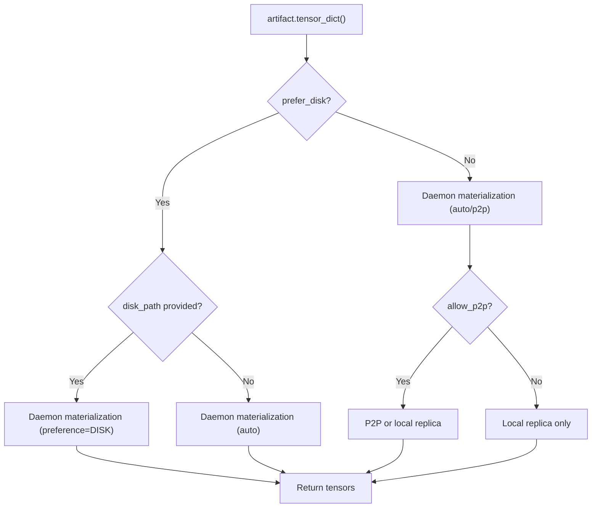
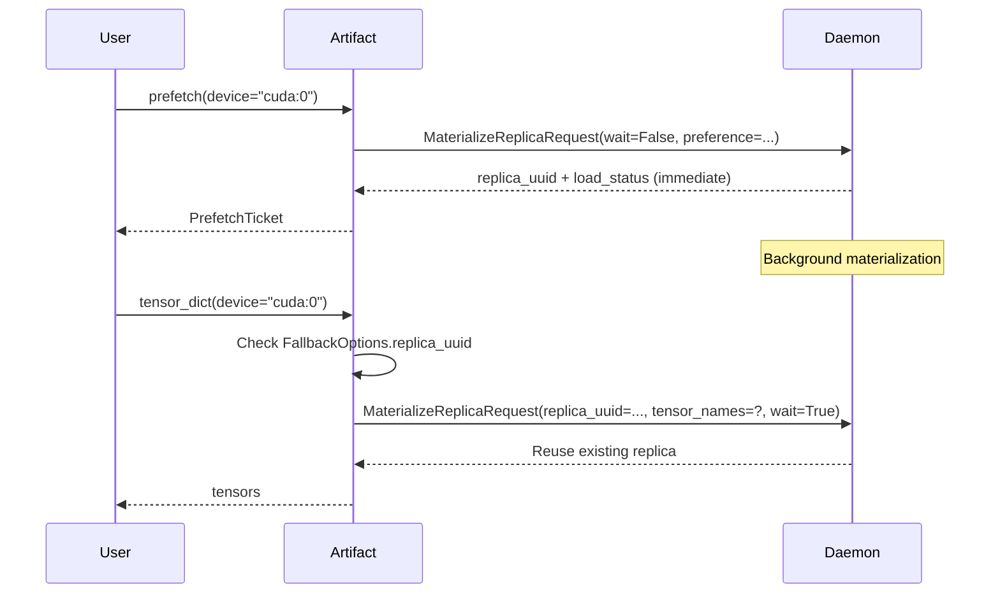

# Summary

Phase 3 completes the **Lazy Artifact Handle** program by layering view composition, batching, async materialization, and prefetch tickets on top of the Phase 1 pipeline upgrade (`0036-01`) and the Phase 2 core handle (`0036-02`). An `Artifact` object represents a deferred reference to a stored artifact—holding identity and metadata without immediately transferring tensor data. Users gain explicit control over when and which tensors materialize, enabling partial loading, source-aware fetching, and composable view derivation.

The shift from eager `store.get() → dict[str, Tensor]` to `tc.artifact() → Artifact` followed by explicit `.tensor_dict()` / `.tensor()` transforms the API from **imperative** (fetch now) to **declarative** (describe intent, execute later).

Phase 2 is now implemented in `tensorcast/api/store/artifact.py` and
`tensorcast/api/store/cache.py`, including the process-wide `ArtifactCache`
driven by `TENSORCAST_STORE_INDEX_CACHE_TTL_SECONDS` and
`TENSORCAST_STORE_CACHE_MAX_ENTRIES`. Phase 3 builds directly on that baseline.

```python
# Current (eager)
state_dict = tc.get(key="model:v2", device="cuda:0")

# Proposed (lazy)
artifact = tc.artifact(key="model:v2")
print(artifact.tensor_names)  # metadata only; no data transfer
shard = artifact.tensor("wte.weight", device="cuda:0")  # single tensor
full = artifact.tensor_dict(device="cuda:0")  # all tensors
```

# Goals / Non-Goals

## Goals

1. **View composition & derivation** — `.view()`, `.subset()`, and `ViewBuilder` produce child artifacts with composed `ViewSpec` objects, including validation and placement rules.
2. **Materialization batching & async coalescing** — `BatchContext` (sync) and `MaterializationBatcher` (async) reduce per-tensor RPC overhead while preserving iterator semantics from Phase 1.
3. **Prefetch tickets & replica reuse** — `prefetch()` exposes tickets backed by daemon `wait_for_completion=false` responses, plus explicit `QueryReplicaStatus` / `ReleaseReplica`.
4. **Disk parity foundation** — View composition and batching APIs work identically for disk-backed artifacts (constructed via `tc.from_disk()`). The actual `from_disk()` entry point is implemented in Phase 4 (`0036-04-disk-artifact-variant.md`).
5. **Extended fallback & source policies** — `FallbackOptions` gains explicit `prefer` modes, checksum controls, and per-handle `replica_uuid` wiring to integrate with prefetch tickets.
6. **Public async surface** — Async `tensor*` variants integrate with the batcher and store event loop without blocking the existing runtime executor.

## Non-Goals

- Re-defining identity, metadata caching, or store binding (covered by `0036-02`).
- Repeating daemon/proto transport changes (covered by `0036-01`).
- Cross-store artifact transfer coordination (out of scope).
- Persistent serialization of Artifact handles (handles remain process-local).

> **Note:** Phase 1 (`0036-01`) and Phase 2 (`0036-02`) cover the transport and handle fundamentals. This document references those capabilities and limits itself to the incremental surfaces listed above.

# Architecture & Interfaces

## New Modules Introduced in Phase 3

Phase 2 already established `artifact.py` and `cache.py`. This phase adds the higher-level orchestration pieces.

> **Design principle**: All artifacts—whether constructed via `key=`, `artifact_id=`, or `disk_path=`—share identical interfaces and go through the same Store session / daemon gRPC flow. The `tc.from_disk(path)` entry point (Phase 4) returns a standard `Artifact` object, not a special subclass.

| Module | Contents | Notes |
|--------|----------|-------|
| `tensorcast/api/store/view_composer.py` | `ViewSpecComposer`, `ViewBuilder`, helpers for composing RFC‑0016 view plans | Consumes canonical metadata from Phase 2 |
| `tensorcast/api/store/batch_context.py` | `BatchContext`, `MaterializationBatcher`, `PendingFetch`, `PrefetchTicket` | Couples to the Phase 1 iterator + daemon ticket fields |

Public entry points (`tensorcast.api.store`) continue to re-export the new symbols so user code can simply call `tc.artifact(...).view(...)` or `tc.from_disk(...)`.

## Conceptual Model

See `0036-02-artifact-handle-core.md` for the base handle + store binding diagrams. Phase 3 reuses that foundation and layers new behaviors (views, batching, async, disk parity) without changing the lifecycle contract.

## Daemon & RPC Extensions

Phase 1 already introduced the v2 selective-materialization RPC. Phase 3 adds two incremental capabilities required for prefetch tickets and explicit source policies:

- **Replica Tickets** – `MaterializeReplicaResponse` now carries an optional `ReplicaTicket { string replica_uuid, string device_uuid, google.protobuf.Timestamp expires_at, LoadStatus status }` whenever `wait_for_completion=false`. The SDK surfaces that via `Artifact.prefetch()` and later passes the `replica_uuid` back through `Materialize*` requests. Two lightweight RPCs are added:
  - `QueryReplicaStatus(ReplicaTicket)` – returns `{status, expires_at}` so the SDK can await readiness without reissuing a materialize call.
  - `ReleaseReplica(ReplicaTicket)` – allows explicit cleanup when the ticket is abandoned before consumption.
- **Source Preferences** – `SourcePreference preference` and `DiskFallbackHint` (disk path + checksum policy) become first-class request fields. They are wired directly from the extended `FallbackOptions` documented below so that daemon-side schedulers can differentiate `local_only`, `disk-first`, or `p2p` requests without relying on heuristics.

All other protocol changes (tensor-name subsets, descriptor iterators) remain as defined in `0036-01`.

## Public API

### Entry points added in Phase 3

- `tc.artifact_async(...)` / `Store.artifact_async(...)` – coroutine factory that mirrors `tc.artifact` but defers identity resolution onto the store event loop for async workflows.
- `Artifact.prefetch()` – kicks off background loads and exposes tickets (paired with new RPC fields).
- Async `Artifact.tensor_async()` / `.tensor_dict_async()` – surfaced as coroutines rather than `ArtifactFuture`.
- Sync helpers `Artifact.view()`, `.subset()`, `.view_builder()` are exported via `tensorcast.api.store`.

> **Note**: `tc.from_disk(path)` is covered in Phase 4 (`0036-04-disk-artifact-variant.md`). View and batching APIs defined here work with disk-backed artifacts once Phase 4 is implemented.

### Artifact API additions (Phase 3)

Phase 2 already covered identity, metadata, and synchronous `tensor*` helpers. This phase introduces:

- `Artifact.view(...)`, `.slice(...)`, `.subset(...)` — return derived handles whose `ViewSpec` is composed via `ViewSpecComposer`.
- `Artifact.view_builder()` — fluent API that records multiple operations before materializing a child handle.
- `Artifact.batch(device=...)` — sync batching context manager described below.
- `Artifact.tensor_async()` / `.tensor_dict_async()` — coroutine equivalents wired into `MaterializationBatcher`.
- `Artifact.prefetch(device=...)` — kicks off background materialization and returns a `PrefetchTicket`.

All additions reuse the same locking/state rules documented in `0036-02`; only the behaviors listed above are new.

### ViewBuilder (Fluent API)

```python
class ViewBuilder:
    """Fluent builder for constructing artifact views."""
    def slice(self, tensor_slices: Mapping[str, SliceSpec]) -> ViewBuilder: ...
    def transpose(self, tensor_dims: Mapping[str, Sequence[tuple[int, int]]]) -> ViewBuilder: ...
    def select(self, names: Sequence[str]) -> ViewBuilder: ...
    def build(self) -> Artifact: ...
```

### BatchContext (RPC Coalescing)

```python
class BatchContext:
    """Context manager for batching multiple tensor fetches into a single RPC."""
    
    def __init__(self, artifact: Artifact, device: str | torch.device) -> None: ...
    def __enter__(self) -> BatchContext: ...
    def __exit__(self, exc_type, exc_val, exc_tb) -> None: ...
    
    def add(self, name: str) -> None:
        """Queue a tensor for batch fetch. Does not block."""
        ...
    
    def get(self, name: str) -> torch.Tensor:
        """Get a previously added tensor. Blocks until batch completes on first call."""
        ...
    
    @property
    def tensors(self) -> dict[str, torch.Tensor]:
        """All fetched tensors. Blocks until batch completes."""
        ...
```

Usage:

```python
with artifact.batch(device="cuda:0") as batch:
    batch.add("layer.0.weight")
    batch.add("layer.0.bias")
# Single RPC issued on context exit
w = batch.get("layer.0.weight")
b = batch.get("layer.0.bias")
```

### SliceSpec Type

Reuses existing definition from `tensorcast.api._view_ops`:

```python
SliceSpec = slice | tuple[int, slice]
# slice(0, 128)        → narrow dim=0, [0:128]
# (1, slice(64, 192))  → narrow dim=1, [64:192]
```

> `Store.artifact()` and `tc.artifact()` construction semantics remain unchanged from Phase 2; no new entry points are introduced here.

### from_disk Variant

> **See Phase 4**: The `tc.from_disk(path)` entry point is fully specified in [0036-04-disk-artifact-variant.md](./0036-04-disk-artifact-variant.md).

**Summary**: `tc.from_disk(path)` returns a standard `Artifact` (not a special subclass) by going through the same Store session / daemon gRPC flow. The view composition, batching, and prefetch APIs defined in this document work identically with disk-backed artifacts.

### Extended FallbackOptions

```python
@dataclass(frozen=True)
class FallbackOptions:
    prefer: Literal["auto", "local", "p2p", "disk"] = "auto"
    disk_path: str | None = None
    allow_p2p: bool = True
    verify_checksums: bool = True
    prefer_disk: bool | None = None  # deprecated alias, kept for compat
    replica_uuid: str | None = None  # For prefetch integration

    @classmethod
    def for_disk(cls, path: str, *, verify: bool = True) -> FallbackOptions: ...
    @classmethod
    def local_only(cls) -> FallbackOptions: ...
```

| `prefer` | Behavior |
|----------|----------|
| `"auto"` | Daemon chooses optimal source |
| `"local"` | Local daemon replica only; fail if unavailable |
| `"p2p"` | Allow remote P2P transfer |
| `"disk"` | Load from `disk_path` first; daemon/P2P as fallback |

Compatibility strategy:

- Existing callers that pass `prefer_disk=True` continue to work; the constructor maps it to `prefer="disk"` if `prefer` is not explicitly provided.
- `StoreOptions.fallback` remains optional; unspecified fields fall back to the per-session defaults.
- The new `replica_uuid` surfaces Prefetch tickets without changing eager APIs—legacy code simply leaves it `None`.
- SDK-to-daemon translation lives in `FallbackResolver`, ensuring the new enum is forwarded through RPCs while the rest of the Python code keeps a stable signature.

## Internal Architecture

### Artifact State Machine



| State | Description | Cached Data |
|-------|-------------|-------------|
| `UnresolvedKey` | Constructed from key; no artifact_id yet | `key_hint` only |
| `Identified` | Has `artifact_id` (via key lookup or direct) | `artifact_id`, optional `disk_path_hint` |
| `Indexed` | Canonical index fetched and cached | Index bytes, tensor list |
| `Released` | Explicitly released; metadata still accessible | Cached metadata (read-only) |
| `Failed` | Resolution or fetch error occurred | Error details |

### Handle State Storage

```python
class Artifact:
    # Identity (immutable after construction)
    _artifact_id: str | None
    _key_hint: str | None

    # Cached metadata (protected by _lock, lazy-initialized)
    _generation: int | None
    _canonical_index_bytes: bytes | None
    _canonical_index: CanonicalIndex | None

    # Fallback options (immutable; changed via with_fallback())
    _fallback: FallbackOptions | None

    # View composition (immutable; set at construction)
    _view_spec: ViewSpecBuildResult | None

    # Lifecycle
    _store_ref: weakref.ref[Store]
    _released: bool
    _lock: threading.RLock
```

### Thread Safety Model

#### Field Categories

| Category | Fields | Thread Safety |
|----------|--------|---------------|
| **Immutable** | `_artifact_id`, `_key_hint`, `_fallback`, `_view_spec`, `_store_ref` | Safe for concurrent read |
| **Lazy-initialized** | `_canonical_index_bytes`, `_canonical_index`, `_generation` | Protected by `_lock`; init once, then read-only |
| **Lifecycle** | `_released` | Protected by `_lock`; transitions only `False → True` |

#### Concurrency Semantics



#### Invariants

1. **Double-checked locking**: Metadata fields use double-checked locking pattern—check without lock, acquire lock, re-check, initialize if still null.
2. **Independent child locks**: Child artifacts from `.view()` have their own `_lock` instances. Parent and child can be accessed concurrently without contention.
3. **View derivation is pure**: `.view()` reads parent's cached index (acquiring parent's lock briefly) then creates child with independent state.
4. **Materialization is stateless**: `.tensor_dict()` delegates to `MaterializationPipeline` which handles its own thread safety. Multiple threads calling `.tensor_dict()` concurrently each receive independent tensor allocations.
5. **Release is idempotent**: Multiple threads calling `.release()` is safe; only the first call has effect.

#### Parent-Child Lifecycle Independence

View artifacts (`child = parent.view(...)`) are fully independent after construction:
- Child copies `_artifact_id` and `_canonical_index_bytes` from parent at creation time
- Child holds its own `_store_ref` (same Store, independent weakref)
- Parent `.release()` does not affect child's validity
- Child can outlive parent

### View Composition

When `.view()` is called, the returned child Artifact holds:
1. Parent's `artifact_id` (copied, immutable)
2. Parent's `canonical_index_bytes` (copied, no parent dependency)
3. Composed `ViewSpec` = parent's spec ⊕ new spec

**Implementation note:** all spec composition runs through the existing `ViewOrchestrator`. `ViewBuilder` merely emits `ViewOp` descriptions; `ViewOrchestrator.compose(parent_spec, ops)` performs normalization, placement resolution, RFC‑0016 validation, and depth enforcement so we do not fork a second implementation.

#### ViewSpecComposer

Handles flattening and validation of chained view operations:

```python
class ViewSpecComposer:
    @staticmethod
    def compose(parent: ViewSpecBuildResult, child: ViewSpecBuildResult) -> ViewSpecBuildResult:
        """Flatten parent ⊕ child into single ViewSpec."""
        ...
```

#### Composition Rules

| Parent Op | Child Op | Result | Notes |
|-----------|----------|--------|-------|
| `narrow(dim, a, len_a)` | `narrow(dim, c, len_c)` | `narrow(dim, a+c, len_c)` | Requires `c + len_c ≤ len_a` |
| `narrow(dim, a, len_a)` | `narrow(dim', ...)` where `dim' ≠ dim` | Both ops preserved | Different dimensions |
| `transpose(d0, d1)` | `transpose(d2, d3)` | Composed permutation | Folded to minimal swaps |
| `transpose(d0, d1)` | `transpose(d0, d1)` | Identity (removed) | Self-inverse |
| `narrow(dim, ...)` | `transpose(...)` on same tensor | `INVALID_ARGUMENT` | Per RFC-0016 |
| Identity | Any op | Child op only | Parent is no-op |

#### Validation

- **Dimension bounds**: Slice dimensions must be valid for the (possibly already sliced) tensor shape
- **Length bounds**: `start + length ≤ parent_length` for chained narrows
- **Exclusivity**: A single tensor cannot have both narrow and transpose ops (even across composition)
- **Depth limit**: Maximum 8 chained `.view()` calls to prevent runaway composition

### Materialization Batching

To avoid per-tensor RPC overhead:

| Pattern | Mechanism | Use Case |
|---------|-----------|----------|
| `tensor_dict(names=[...])` | Single RPC for subset | Known tensor set |
| `artifact.batch(device=...)` | Explicit sync batching | Incremental discovery |
| `.tensor_async()` concurrent calls | `MaterializationBatcher` | Async workflows |

#### Sync Batching

`artifact.batch()` returns a `BatchContext` (see API above) that collects tensor names and issues a single RPC on context exit.

#### Async Batching

`MaterializationBatcher` coalesces concurrent `.tensor_async()` calls:

```python
class MaterializationBatcher:
    """Coalesces async tensor fetches within a time window."""
    
    _pending: dict[BatchKey, list[PendingFetch]]
    _window_ms: float = 1.0  # Coalescing window
    
    # BatchKey = (artifact_id, view_spec_hash, device)
```

Flow:
1. `.tensor_async(name)` submits to batcher with key `(artifact_id, view_spec_hash, device)`
2. Batcher waits up to 1ms for additional requests with same key
3. Single RPC fetches all tensors; results distributed to awaiting futures

Sync `.tensor()` calls bypass the batcher and issue immediate RPCs—use `batch()` context for sync batching.

#### Threading Model & Scheduling

**Context:** `StoreRuntimeContext` maintains a single-thread executor (`_executor = ThreadPoolExecutor(max_workers=1)`) for async callbacks and cleanup. Reusing this executor for batching with blocking waits would cause deadlock or severe performance degradation.

**Design Principles:**

1. **Independent Scheduler** — `MaterializationBatcher` uses a dedicated daemon thread for batch dispatch, completely separate from `StoreRuntimeContext._executor`:

```python
class MaterializationBatcher:
    """Lock-free batcher with independent scheduling."""
    
    _pending_queue: queue.Queue[PendingFetch]  # Thread-safe queue
    _batch_groups: dict[BatchKey, BatchGroup]  # Protected by _group_lock
    _group_lock: threading.Lock  # Short-lived, guards only group assignment
    _dispatch_thread: threading.Thread  # Dedicated daemon thread
    _window_ms: float = 1.0
    _shutdown: threading.Event
    
    def __init__(self) -> None:
        self._dispatch_thread = threading.Thread(
            target=self._dispatch_loop,
            daemon=True,
            name="MaterializationBatcher-Dispatch"
        )
        self._dispatch_thread.start()
    
    def submit(self, fetch: PendingFetch) -> asyncio.Future[torch.Tensor]:
        """Non-blocking submission. Returns future immediately."""
        future: asyncio.Future[torch.Tensor] = asyncio.get_event_loop().create_future()
        fetch.future = future
        self._pending_queue.put_nowait(fetch)
        return future
    
    def _dispatch_loop(self) -> None:
        """Background loop: drain queue, group by key, flush after window."""
        while not self._shutdown.is_set():
            try:
                fetch = self._pending_queue.get(timeout=self._window_ms / 1000)
                self._assign_to_group(fetch)
            except queue.Empty:
                pass
            self._flush_ready_groups()
```

2. **Lock-Free Request Path** — Submission uses `queue.Queue` (thread-safe, GIL-based) with `put_nowait()` for non-blocking enqueue. The `_group_lock` protects only the brief batch-key assignment, never held during I/O:

```python
@dataclass
class BatchGroup:
    key: BatchKey
    fetches: list[PendingFetch]
    created_at: float  # time.monotonic()
    deadline: float    # created_at + window_ms

def _assign_to_group(self, fetch: PendingFetch) -> None:
    """Assign fetch to batch group. Lock held only for dict lookup/insert."""
    with self._group_lock:  # ~microseconds
        group = self._batch_groups.get(fetch.batch_key)
        if group is None:
            now = time.monotonic()
            group = BatchGroup(
                key=fetch.batch_key,
                fetches=[],
                created_at=now,
                deadline=now + self._window_ms / 1000,
            )
            self._batch_groups[fetch.batch_key] = group
        group.fetches.append(fetch)

def _flush_ready_groups(self) -> None:
    """Flush groups past deadline. RPC happens outside lock."""
    now = time.monotonic()
    ready_groups: list[BatchGroup] = []
    
    with self._group_lock:
        expired_keys = [k for k, g in self._batch_groups.items() if g.deadline <= now]
        for k in expired_keys:
            ready_groups.append(self._batch_groups.pop(k))
    
    # RPC dispatch outside lock — no contention
    for group in ready_groups:
        self._dispatch_group(group)
```

3. **RPC Dispatch** — Actual materialization RPCs execute on the Store's async event loop (via `asyncio.run_coroutine_threadsafe`), not on the batcher thread. This keeps the dispatch thread responsive:

```python
def _dispatch_group(self, group: BatchGroup) -> None:
    """Issue single RPC for batch group, distribute results to futures."""
    names = [f.tensor_name for f in group.fetches]
    coro = self._materialize_batch(group.key, names)
    
    # Submit to Store's event loop, not blocking dispatch thread
    loop = self._store_ref().event_loop
    future = asyncio.run_coroutine_threadsafe(coro, loop)
    future.add_done_callback(lambda f: self._distribute_results(group, f))
```

**Threading Topology:**

```
┌────────────────────────────────────────────────────────────────────────┐
│                          User Threads                                   │
│  .tensor_async() → batcher.submit() → queue.put_nowait() → return      │
└───────────────────────────────┬────────────────────────────────────────┘
                                │ (non-blocking)
                                ▼
┌────────────────────────────────────────────────────────────────────────┐
│             MaterializationBatcher Dispatch Thread                      │
│  _pending_queue.get() → _assign_to_group() → _flush_ready_groups()     │
│  (daemon thread, independent of StoreRuntimeContext._executor)          │
└───────────────────────────────┬────────────────────────────────────────┘
                                │ asyncio.run_coroutine_threadsafe()
                                ▼
┌────────────────────────────────────────────────────────────────────────┐
│                    Store Event Loop (asyncio)                           │
│  _materialize_batch() → daemon gRPC → distribute results to futures    │
└────────────────────────────────────────────────────────────────────────┘
```

**Invariants:**

- `submit()` never blocks; callers receive `Future` immediately
- `_group_lock` held for < 1µs (dict operations only)
- RPC I/O happens on Store's event loop, not dispatch thread
- Dispatch thread is daemon; no explicit shutdown required for process exit
- `StoreRuntimeContext._executor` remains unchanged; batcher is fully independent

### View-Specific Metadata Cache

Global metadata caching is defined in `0036-02`. Phase 3 only adds a per-handle cache for view-derived metadata so repeated `.tensor_names` / `.describe()` calls on the same view do not re-run the planner.

```python
@dataclass(frozen=True)
class ViewMetadataCache:
    view_id: str
    view_index_bytes: bytes
    view_data_hash: str
    tensor_names: tuple[str, ...]
    nbytes: int
```

```

`ViewMetadataCache` is computed once per derived artifact via `ViewPlanner` and stored on the handle (not in the shared `ArtifactCache`) because each view can have different specs even if they share the same parent artifact.

### Source Resolution Flow



All branches route through the daemon per [0038-daemon-only-disk-materialization](./0038-daemon-only-disk-materialization.md).

### Prefetch Integration

`artifact.prefetch(device=...)` issues `MaterializeReplicaRequest` with `wait_for_completion=False` (now fully supported end-to-end) and returns a `PrefetchTicket`. The daemon immediately replies with `{replica_uuid, load_status, device_uuid, expires_at}` while continuing to build the replica in the background. Clients can either poll `ticket.is_ready` (backed by `QueryReplicaStatus`) or optimistically invoke `.tensor_dict()` which reuses the `replica_uuid` hint.

```python
@dataclass
class PrefetchTicket:
    """Handle to a background prefetch operation."""
    replica_uuid: str
    artifact_id: str
    device: torch.device
    expires_at: float
    started_at: float  # time.monotonic()
    ttl_seconds: float = 30.0
    
    @property
    def is_ready(self) -> bool:
        """True if replica is fully materialized."""
        ...
    
    @property
    def is_expired(self) -> bool:
        """True if TTL exceeded."""
        ...
    
    def wait(self, timeout: float | None = None) -> bool:
        """Block until ready or timeout. Returns True if ready."""
        ...
    
    def cancel(self) -> None:
        """Request daemon to unload the prefetched replica."""
        ...
```

#### Prefetch Flow



Subsequent `.tensor_dict()` calls reuse the prefetched replica via the new RPC field **and** by copying `replica_uuid` into `FallbackOptions`. The daemon recognizes the hint, pins the staged replica (or finishes it if still in-flight), and skips redundant data movement. If the request targets a different device or arrives after `expires_at`, the daemon returns `FAILED_PRECONDITION`; the SDK drops the stale ticket, records a metric, and retries without a replica hint so correctness is preserved.

# Invariants & Error Model

## Invariants

1. **Identity immutability**: `artifact.artifact_id` never changes after resolution.
2. **Metadata consistency**: Once fetched, canonical index is immutable and cached.
3. **Store binding**: All materialization uses the bound Store's policies (retry, fallback, tracing).
4. **View derivation purity**: `.view()` returns new handle without mutating original; child is independent of parent lifecycle.
5. **Lazy by default**: Construction and view derivation never trigger data transfer or RPC.
6. **Cache coherence**: `ArtifactCache` entries are immutable once written; updates create new entries.
7. **Thread safety**: All public methods are safe for concurrent access (see Thread Safety Model).
8. **Weakref validity**: If `_store_ref` dereferences to `None`, all materialization calls fail with `FAILED_PRECONDITION`.

## Error Semantics

| Condition | Status Code | Retryable |
|-----------|-------------|-----------|
| Store closed / Artifact released | `FAILED_PRECONDITION` | No |
| Artifact not found / Key unmapped | `NOT_FOUND` | No |
| Tensor name unknown / Invalid slice/transpose | `INVALID_ARGUMENT` | No |
| Materialization timeout | `DEADLINE_EXCEEDED` | Yes |
| Daemon unavailable | `UNAVAILABLE` | Yes |
| Data integrity mismatch | `DATA_LOSS` | No |

All errors raised as `ArtifactError` with structured status codes.

# Usage Examples

### Tensor-Parallel Sharding

```python
model = tc.artifact(key="llama-70b:v1")
rank, tp_size = dist.get_rank(), dist.get_world_size()
dim_size = model.tensor_meta("lm_head.weight").shape[0]
shard_start = rank * (dim_size // tp_size)

sharded = model.view(slices={
    "lm_head.weight": (0, slice(shard_start, shard_start + dim_size // tp_size)),
})
weights = sharded.tensor_dict(device=f"cuda:{rank}")
```

### Selective Loading

```python
artifact = tc.artifact(key="gpt2:v3")
attn_names = [n for n in artifact.tensor_names if "attn" in n]
attn_tensors = artifact.tensor_dict(device="cuda:0", names=attn_names)
```

### Disk Fallback

```python
artifact = tc.artifact(key="model:stable").with_fallback(
    FallbackOptions.for_disk("/mnt/checkpoints/model")
)
state_dict = artifact.tensor_dict(device="cuda:0")
```

### View Chaining

```python
artifact = tc.artifact(key="transformer:v1")
base_view = artifact.subset(["embed", "layer.0.attn", "layer.0.mlp"])
sliced = base_view.view(slices={"embed": slice(0, 32000)})
tensors = sliced.tensor_dict(device="cuda:0")  # Composed view
```

### Prefetch for Latency Hiding

```python
artifacts = [tc.artifact(key=f"layer_{i}") for i in range(12)]
for a in artifacts:
    a.prefetch(device="cuda:0")  # Background loading
for a in artifacts:
    tensors = a.tensor_dict(device="cuda:0")  # May be faster
```

# Trade-offs & Risks

| Risk | Mitigation |
|------|------------|
| **Stale handles** — Artifact deleted after handle creation | `.exists()` check; `generation` tracking; `NOT_FOUND` on materialize |
| **Lazy resolution overhead** — Extra RPC for metadata | `ArtifactCache` with 10-min TTL; background prefetch option |
| **Per-tensor RPC cost** | `MaterializationBatcher` coalesces async calls; `BatchContext` for sync |
| **Batcher thread contention** | Independent daemon thread; lock-free queue submission; lock held < 1µs |
| **View chain complexity** | Flatten composed ViewSpecs; depth limit of 8 |
| **Memory leaks** — Forgotten handles | Weak Store reference; `__del__` logs unreleased; prefetch TTL cleanup |
| **Prefetch vs. eviction** | TTL (30s default); track in Store session metadata |
| **Store closed mid-use** | `_store_ref` weakref returns `None`; clear error with `FAILED_PRECONDITION` |
| **Cache memory pressure** | LRU eviction at 1000 entries; configurable via env var |
| **Fork safety** | Artifact inherits cached metadata; materialization uses forked Store session |
| **API surface expansion** | Clear documentation; eager API (`store.get()`) remains for simple cases |

# Compatibility & Acceptance Criteria

## Compatibility

- **Single-track upgrade** — All environments must roll out the v2 daemon/GS binaries and proto set before enabling the SDK. We do not support mixed clusters.
- **API continuity** — `store.get()` / `store.register()` keep their surface area but internally call the lazy pipeline on top of the new RPCs.
- **On-disk parity** — Disk artifacts share the same SelectionPlan + slice reader as daemon-backed artifacts, so view semantics remain identical across sources.

## Acceptance Criteria

1. **State machine tests**: Unit tests for Artifact state transitions (UnresolvedKey → Identified → Indexed → Released/Failed).
2. **Lazy resolution tests**: Integration tests for key resolution, partial fetches, view composition, disk fallback.
3. **Batching tests**: Verify RPC coalescing for async `.tensor_async()` calls and sync `batch()` context.
4. **Selective streaming tests**: Daemon + SDK end-to-end suites proving `tensor_names` only transfers requested tensors, deserializes via payload descriptors, and never builds a full state dict when not needed.
5. **Disk slice tests**: Once Phase 4 is implemented, `tc.from_disk(path).view(...)` must return byte-accurate slices identical to P2P-backed artifact output for the same `ViewSpec`. (Detailed tests in Phase 4.)
6. **Prefetch tests**: Latency reduction ≥20% for repeated `.tensor_dict()` after prefetch, including device-mismatch/expiry scenarios that produce `FAILED_PRECONDITION` and trigger a retry.
7. **Metadata purity tests**: Confirm no GPU memory touched for `.describe()` / `.tensor_names`.
8. **Thread safety tests**: Concurrent `.tensor_dict()` from multiple threads; concurrent `.view()` derivation.
9. **Parent-child lifecycle tests**: Child view remains valid after parent `.release()`.
10. **Fork safety tests**: Artifact handles behave correctly after `os.fork()` (inherit parent's cached metadata, but new materialization uses forked Store).
11. **Cache eviction tests**: LRU eviction when cache exceeds 1000 entries.
12. **Benchmark**: `.tensor()` overhead vs. full `.tensor_dict()` for single-tensor access (target: <5% overhead with selective fetch enabled).

# Naming Compliance

All new public names follow Python naming in `AGENTS.md`:
- Classes: `Artifact`, `ArtifactDescriptor`, `TensorMeta`, `ViewBuilder`, `PrefetchTicket`, `BatchContext`
- Functions/methods: `artifact()`, `from_disk()`, `tensor_dict()`, `tensor()`, `with_fallback()`, `view_builder()`

# References

- [0014-store-session-api-modernization](./0014-store-session-api-modernization.md) — Current Store session API
- [0016-artifact-view-v1](./0016-artifact-view-v1.md) — ViewSpec and view retrieval/registration
- [tensor-first-artifact-architecture](../internals/tensor-first-artifact-architecture.md) — Tensor-first design philosophy
- [0007-content-addressed-artifact-id](./0007-content-addressed-artifact-id.md) — mi2 identity model
