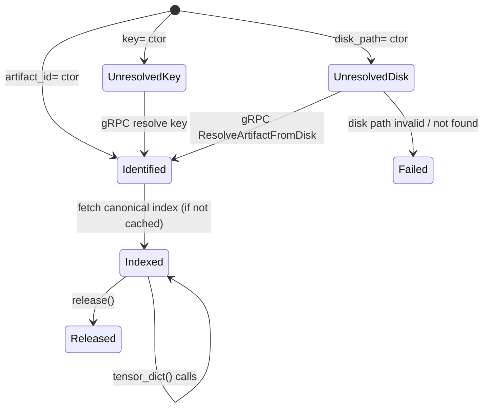

# Summary

Phase 4 introduces the `tc.from_disk(path)` entry point that constructs an `Artifact` from a local disk path. This completes the lazy artifact handle program by enabling disk-backed artifacts to participate in the same unified flow as key-resolved and artifact_id-based artifacts.

**Design principle**: `tc.from_disk(path)` returns a standard `Artifact` object, not a special subclass. All artifacts—whether constructed via `key=`, `artifact_id=`, or `disk_path=`—share identical interfaces and go through the same Store session / daemon gRPC flow. The disk path is merely a construction hint that influences how the daemon resolves and materializes the artifact.

Resolution returns canonical index bytes (not JSON) plus an optional `generation` counter so the SDK can hydrate `ArtifactCache` immediately and keep metadata aligned with the v2 materialization fields (`canonical_index_bytes`, `view_index_bytes`).

```python
# All three return the same Artifact type with identical behavior
artifact1 = tc.artifact(key="model:v1")
artifact2 = tc.artifact(artifact_id="mi2:...")
artifact3 = tc.from_disk("/mnt/checkpoints/model")

# Identical API surface
artifact3.tensor_names          # metadata access
artifact3.tensor_dict(device="cuda:0")  # materialization
artifact3.view(slices={...})    # view composition (from Phase 3)
```

# Goals / Non-Goals

## Goals

1. **`tc.from_disk(path)` entry point** — Convenience function that constructs an `Artifact` from a local disk path via daemon gRPC.
2. **Daemon disk resolution RPC** — Dedicated RPC that inspects a disk path and returns `{artifact_id, canonical_index_bytes, generation}` for cache hydration.
3. **Unified Artifact type** — No `DiskArtifact` subclass; disk-backed artifacts are indistinguishable from other artifacts at the API level.
4. **Implicit fallback binding** — The constructed `Artifact` carries `_disk_path_hint` so subsequent materialization automatically uses the disk path.
5. **Backward compatibility** — Document that `tc.from_disk()` always routes through the daemon, matching the daemon-only invariant defined in [0038-daemon-only-disk-materialization](./0038-daemon-only-disk-materialization.md).

## Non-Goals

- Changing the `Artifact` class definition (already covered in Phase 2).
- View composition or batching (covered in Phase 3).
- Offline disk loading without daemon (legacy `restore_tensors_from_disk()` API remains for this).

# Architecture & Interfaces

## Construction Flow

```
tc.from_disk("/mnt/checkpoints/model")
        │
        ▼
Store.from_disk(path) / Store.artifact(disk_path=path)
        │
        ▼
┌───────────────────────────────────────────────────────────────┐
│  gRPC: ResolveArtifactFromDisk(disk_path)                      │
└───────────────────────────────────────────────────────────────┘
        │
        ▼
┌───────────────────────────────────────────────────────────────┐
│  Daemon:                                                       │
│  1. Validate disk_path exists and contains tensor_index.json   │
│  2. Parse tensor_index.json → canonical_index_bytes            │
│  3. Compute artifact_id from index (or read from descriptor)   │
│  4. Return {artifact_id, canonical_index_bytes, generation, disk_path}     │
└───────────────────────────────────────────────────────────────┘
        │
        ▼
Artifact(
    artifact_id=resolved_id,
    canonical_index_bytes=index_bytes,
    generation=generation,
    disk_path_hint=path,
    store_ref=weakref(store),
)
```

## Materialization Flow

When `artifact.tensor_dict()` is called on a disk-backed artifact:

```
artifact.tensor_dict(device="cuda:0", names=["layer.0.weight"])
        │
        ▼
MaterializationPipeline._materialize(
    artifact_id=...,
    fallback=FallbackOptions.for_disk(artifact._disk_path_hint),
    tensor_names=["layer.0.weight"],
)
        │
        ▼
┌───────────────────────────────────────────────────────────────┐
│  gRPC: MaterializeReplicaRequest(                              │
│    artifact_id=...,                                            │
│    preference=DISK,                                            │
│    disk_fallback=DiskFallbackHint(                             │
│      disk_path="/mnt/checkpoints/model",                       │
│      verify_checksums=true                                     │
│    ),                                                          │
│    tensor_names=["layer.0.weight"],                            │
│  )                                                             │
└───────────────────────────────────────────────────────────────┘
        │
        ▼
┌───────────────────────────────────────────────────────────────┐
│  Daemon DiskLoader (C++ infrastructure)                        │
│  DiskLoader → FilePartitionSource → pread/mmap                 │
│  ViewPlanSource applies SelectionPlan for selective loading    │
└───────────────────────────────────────────────────────────────┘
        │
        ▼
MaterializeReplicaResponse(payloads=[...], ...)
        │
        ▼
SDK maps CUDA IPC handles → torch.Tensor dict
```

## Public API

### Entry Points

```python
# Primary entry point
def from_disk(path: str | os.PathLike) -> Artifact:
    """Construct an Artifact from a local disk path.
    
    The artifact identity is resolved via daemon gRPC by inspecting
    the disk path's tensor_index.json. Subsequent materialization
    automatically uses the disk path as the data source.
    
    Args:
        path: Path to artifact directory containing tensor_index.json
              and tensor.data_* files.
    
    Returns:
        Standard Artifact object (not a special subclass).
    
    Raises:
        ArtifactError: If path is invalid or daemon cannot resolve.
    """
    store = get_default_store()
    return store.from_disk(path)

# Also available on Store
class Store:
    def from_disk(self, path: str | os.PathLike) -> Artifact:
        """Construct an Artifact from a local disk path."""
        return self.artifact(disk_path=str(path))
    
    def artifact(
        self,
        *,
        key: str | None = None,
        artifact_id: str | None = None,
        disk_path: str | None = None,
        fallback: FallbackOptions | None = None,
    ) -> Artifact:
        """Construct an Artifact from key, artifact_id, or disk_path."""
        # Exactly one of key, artifact_id, disk_path must be provided
        ...
```

### Artifact Internal State

Phase 2 already defined `_disk_path_hint`. This phase uses it:

```python
class Artifact:
    # ... existing fields from Phase 2 ...
    _disk_path_hint: str | None  # Set when constructed via disk_path=
    
    def tensor_dict(
        self,
        *,
        device: torch.device | str,
        names: Sequence[str] | None = None,
    ) -> dict[str, torch.Tensor]:
        # If disk_path_hint is set, use it as fallback
        fallback = self._fallback
        if self._disk_path_hint and fallback is None:
            fallback = FallbackOptions.for_disk(self._disk_path_hint)
        
        return self._materialize(
            names=names,
            device=device,
            fallback=fallback,
        )
```

## Daemon RPC Extensions (chosen)

```protobuf
// In tensorcast.proto.daemon.v2

message ResolveArtifactFromDiskRequest {
  string disk_path = 1;
  bool verify_checksums = 2;
}

message ResolveArtifactFromDiskResponse {
  string artifact_id = 1;
  bytes canonical_index_bytes = 2;  // canonical index bytes, not JSON
  string disk_path = 3;             // echoed back for confirmation
  uint64 generation = 4;            // propagated to ArtifactCache
}

service StoreDaemon {
  // ... existing RPCs ...
  rpc ResolveArtifactFromDisk(ResolveArtifactFromDiskRequest)
      returns (ResolveArtifactFromDiskResponse);
}
```

## Backward Compatibility

Production flows always go through the daemon; there is no SDK code path that reads disk directly.

## State Machine Extension

Phase 2 defined the state machine with `UnresolvedDisk` state. This phase implements it:



**Note**: For disk-backed artifacts, the daemon returns `canonical_index_bytes` during resolution, so the `Identified → Indexed` transition happens immediately.

# Trade-offs & Risks

| Risk | Mitigation |
|------|------------|
| **Daemon dependency** | All disk operations require a running daemon. This is intentional for unified observability. Legacy `restore_tensors_from_disk()` remains for offline scenarios. |
| **Disk path validation** | Daemon validates path existence and structure. SDK receives clear error if path is invalid. |
| **Stale disk data** | If disk data changes after artifact construction, subsequent materialization may fail or return inconsistent data. Document that artifacts are snapshots. |
| **Performance overhead** | Additional gRPC round-trip for resolution. Mitigated by caching in `ArtifactCache`. |

# Compatibility & Acceptance Criteria

1. **Basic from_disk test**: `tc.from_disk(path).tensor_dict()` returns the same tensors as the canonical on-disk artifact.
2. **Selective loading test**: `tc.from_disk(path).tensor_dict(names=["a"])` only loads tensor "a".
3. **View composition test**: `tc.from_disk(path).view(slices={...})` works with Phase 3 view APIs.
4. **Error handling test**: Invalid disk path raises `ArtifactError(status_code="NOT_FOUND")`.
5. **Daemon RPC test**: `bazel test //daemon:resolve_artifact_from_disk_test --define=use_fake_cuda=true`.
6. **Metadata caching test**: Repeated `from_disk(path)` calls reuse cached metadata.
7. **Type identity test**: `isinstance(tc.from_disk(path), Artifact)` returns `True` (no subclass).

# Naming Compliance

| Symbol | Kind | Compliance |
|--------|------|------------|
| `from_disk()` | Function | snake_case |
| `ResolveArtifactFromDisk` | Proto RPC | PascalCase |
| `ResolveArtifactFromDiskRequest` | Proto message | PascalCase |
| `_disk_path_hint` | Private field | snake_case with underscore prefix |

# References

- `docs/designs/0036-01-materialization-pipeline-v2.md` — Disk loading via daemon
- `docs/designs/0036-02-artifact-handle-core.md` — Artifact class and state machine
- `docs/designs/0036-03-lazy-artifact-handle.md` — View composition (uses same Artifact)
- `core/store/materialization/dataplane/loaders/disk_loader.h` — C++ DiskLoader
- `tensorcast/api/_io_disk.py` — Legacy disk loading API
